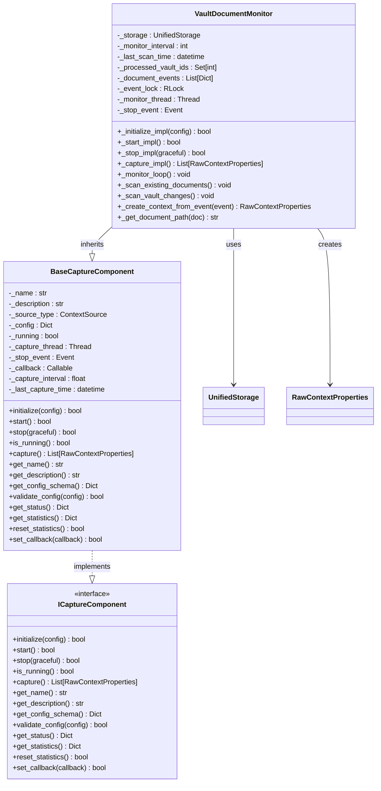
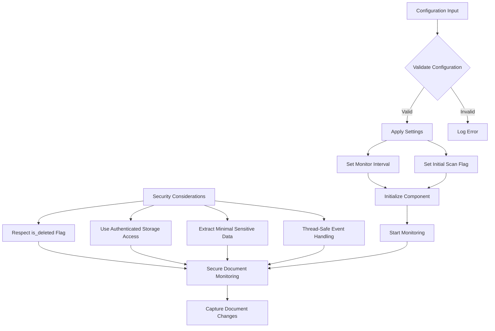
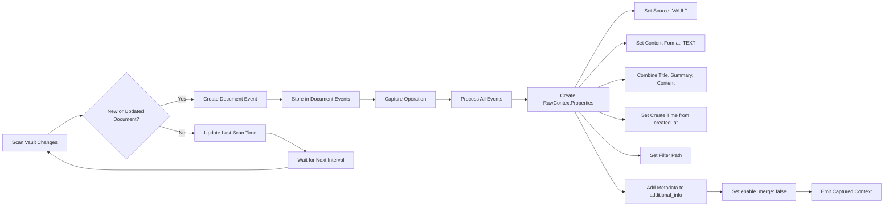
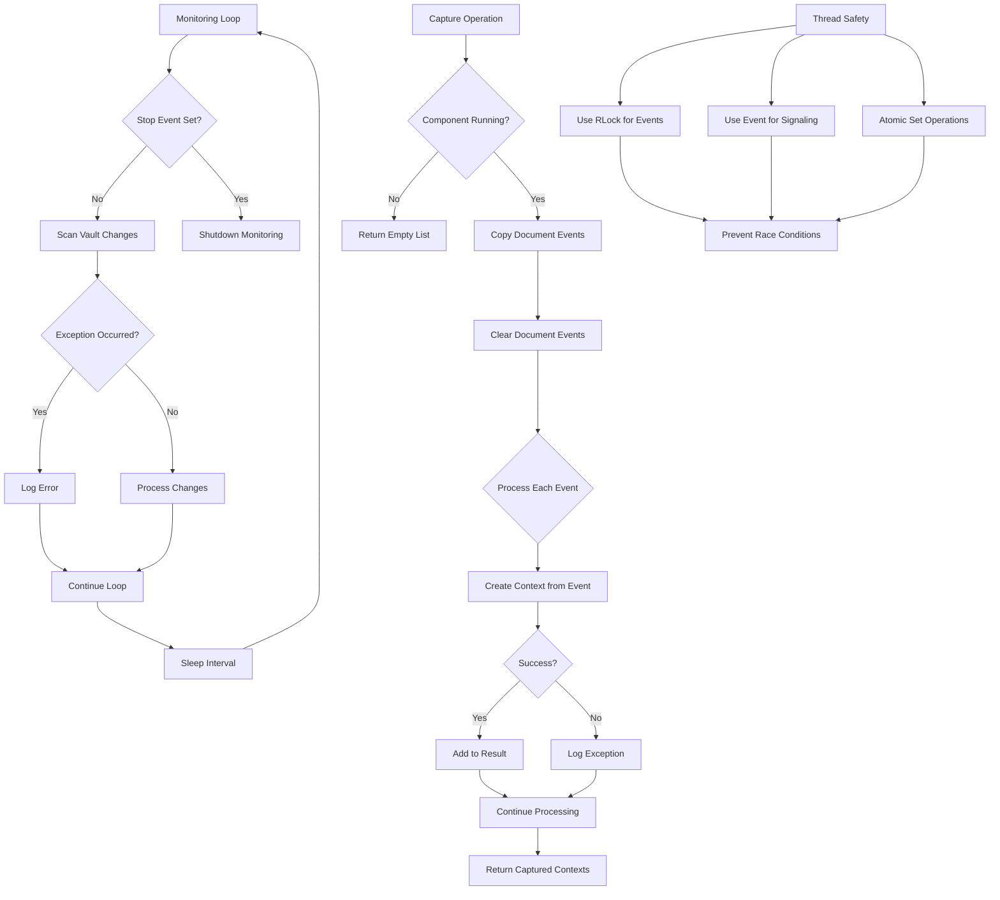

# Vault Document Monitoring

<cite>
**Referenced Files in This Document**   
- [vault_document_monitor.py](file://opencontext/context_capture/vault_document_monitor.py)
- [capture_interface.py](file://opencontext/interfaces/capture_interface.py)
- [base.py](file://opencontext/context_capture/base.py)
- [context.py](file://opencontext/models/context.py)
- [enums.py](file://opencontext/models/enums.py)
- [global_storage.py](file://opencontext/storage/global_storage.py)
- [unified_storage.py](file://opencontext/storage/unified_storage.py)
- [sqlite_backend.py](file://opencontext/storage/backends/sqlite_backend.py)
- [config.yaml](file://config/config.yaml)
</cite>

## Table of Contents
1. [Introduction](#introduction)
2. [Core Components](#core-components)
3. [Architecture Overview](#architecture-overview)
4. [Configuration and Security](#configuration-and-security)
5. [Data Flow and Processing](#data-flow-and-processing)
6. [Error Handling and Synchronization](#error-handling-and-synchronization)
7. [Conclusion](#conclusion)

## Introduction
The Vault Document Monitoring component is responsible for tracking changes to secure documents within the application's vault system. This component monitors the vaults table for document modifications, captures relevant metadata and version history, and transforms this information into structured context data for downstream processing. The implementation follows a secure monitoring pattern that respects access controls and encryption boundaries while providing comprehensive document change tracking capabilities.

**Section sources**
- [vault_document_monitor.py](file://opencontext/context_capture/vault_document_monitor.py#L1-L389)

## Core Components

The VaultDocumentMonitor class implements the ICaptureComponent interface to capture document modifications from the vault system. This implementation extends the BaseCaptureComponent class, inheriting core functionality for initialization, startup, stopping, and configuration management while providing vault-specific monitoring logic.

The component uses a multi-threaded architecture with a dedicated monitoring loop that periodically scans for changes in the vaults table. It maintains state through several key attributes: `_processed_vault_ids` tracks documents that have been processed, `_document_events` stores detected changes before processing, and `_last_scan_time` records the timestamp of the last scan for incremental change detection.



**Diagram sources**
- [vault_document_monitor.py](file://opencontext/context_capture/vault_document_monitor.py#L26-L389)
- [base.py](file://opencontext/context_capture/base.py#L26-L515)
- [capture_interface.py](file://opencontext/interfaces/capture_interface.py#L18-L153)

**Section sources**
- [vault_document_monitor.py](file://opencontext/context_capture/vault_document_monitor.py#L26-L389)
- [base.py](file://opencontext/context_capture/base.py#L26-L515)

## Architecture Overview

The vault document monitoring system follows a layered architecture that integrates with the application's storage and context management systems. The component operates as part of the context capture layer, interfacing with the unified storage system to retrieve vault data and emitting captured context through the ICaptureComponent interface.

The monitoring process begins with initialization, where the component obtains a reference to the global storage system and configures its monitoring parameters. During startup, it can perform an initial scan of existing documents before entering a continuous monitoring loop. This loop periodically queries the vaults table for changes, comparing creation and update timestamps against the last scan time to identify new and modified documents.

```mermaid
sequenceDiagram
participant Monitor as VaultDocumentMonitor
participant Storage as UnifiedStorage
participant Backend as SQLiteBackend
participant Context as RawContextProperties
Monitor->>Monitor : initialize(config)
Monitor->>Storage : get_storage()
Monitor->>Monitor : set monitor_interval
Monitor->>Monitor : set initial scan time
Monitor->>Monitor : start()
alt Initial Scan Enabled
Monitor->>Storage : get_vaults(limit=1000, is_deleted=False)
Storage->>Backend : query vaults table
Backend-->>Storage : return documents
Storage-->>Monitor : return documents
loop For each unprocessed document
Monitor->>Monitor : create "existing" event
Monitor->>Monitor : add to document_events
Monitor->>Monitor : add to processed_vault_ids
end
end
loop Monitoring Loop
Monitor->>Storage : get_vaults(limit=100, is_deleted=False)
Storage->>Backend : query vaults table
Backend-->>Storage : return documents
Storage-->>Monitor : return documents
loop For each document
Monitor->>Monitor : check if new or updated
alt Document is new
Monitor->>Monitor : create "created" event
Monitor->>Monitor : add to document_events
else Document is updated
Monitor->>Monitor : create "updated" event
Monitor->>Monitor : add to document_events
end
end
Monitor->>Monitor : update last_scan_time
Monitor->>Monitor : sleep(monitor_interval)
end
Monitor->>Monitor : capture()
Monitor->>Monitor : copy document_events
Monitor->>Monitor : clear document_events
loop For each event
Monitor->>Monitor : create_context_from_event()
Monitor->>Context : create RawContextProperties
Monitor->>Monitor : add to result
Monitor->>Monitor : increment total_processed
end
Monitor-->> : return captured contexts
```

**Diagram sources**
- [vault_document_monitor.py](file://opencontext/context_capture/vault_document_monitor.py#L51-L389)
- [unified_storage.py](file://opencontext/storage/unified_storage.py#L90-L925)
- [sqlite_backend.py](file://opencontext/storage/backends/sqlite_backend.py#L495-L575)

**Section sources**
- [vault_document_monitor.py](file://opencontext/context_capture/vault_document_monitor.py#L51-L389)
- [unified_storage.py](file://opencontext/storage/unified_storage.py#L90-L925)

## Configuration and Security

The Vault Document Monitoring component supports configurable monitoring parameters through the application's configuration system. The primary configuration options include the monitoring interval (default: 5 seconds) and whether to perform an initial scan of existing documents. These settings are defined in the component's configuration schema and can be overridden in the main config.yaml file.

Security considerations are integrated into the monitoring process through several mechanisms. The component respects the `is_deleted` flag in the vaults table, ensuring that deleted documents are not monitored. It also operates within the application's access control framework by using the global storage system, which enforces authentication and authorization rules. The monitoring process extracts only necessary metadata and content from vault documents, minimizing exposure of sensitive information.

The configuration schema for the component is defined in the `_get_config_schema_impl` method, which specifies the `monitor_interval` as an integer with a minimum value of 1, and `initial_scan` as a boolean with a default value of true. Configuration validation is performed in the `_validate_config_impl` method, ensuring that the monitor_interval is a positive integer.



**Diagram sources**
- [vault_document_monitor.py](file://opencontext/context_capture/vault_document_monitor.py#L310-L353)
- [config.yaml](file://config/config.yaml#L70-L75)

**Section sources**
- [vault_document_monitor.py](file://opencontext/context_capture/vault_document_monitor.py#L310-L353)
- [config.yaml](file://config/config.yaml#L70-L75)

## Data Flow and Processing

The data flow in the vault document monitoring system follows a structured process from change detection to context creation. The component extracts document metadata, version history, and collaboration events from the vault system by monitoring changes to the vaults table. This information is transformed into RawContextProperties objects with appropriate security flags and context information.

The `_create_context_from_event` method is responsible for transforming document events into structured context data. It extracts key information from the document data including title, summary, content, tags, and document type, combining these elements into a single content_text field. The method also preserves important metadata in the additional_info dictionary, including the vault_id, title, summary, tags, document_type, and event_type (created, updated, or existing).

Document path information is extracted through the `_get_document_path` method, which attempts to build a hierarchical path based on the document's parent_id. Although the current implementation has a TODO note indicating that complete path building logic needs to be implemented, it currently returns a simple path based on the document title.



**Diagram sources**
- [vault_document_monitor.py](file://opencontext/context_capture/vault_document_monitor.py#L251-L287)
- [context.py](file://opencontext/models/context.py#L35-L46)

**Section sources**
- [vault_document_monitor.py](file://opencontext/context_capture/vault_document_monitor.py#L251-L287)
- [context.py](file://opencontext/models/context.py#L35-L46)

## Error Handling and Synchronization

The vault document monitoring component implements robust error handling and synchronization mechanisms to ensure reliable operation in production environments. The component uses thread-safe data structures and synchronization primitives to coordinate between the monitoring loop and capture operations, preventing race conditions when accessing shared state.

The monitoring loop runs in a dedicated thread and uses a try-except block to catch and log any exceptions that occur during the scanning process. This ensures that transient errors do not terminate the monitoring process. The component also implements graceful shutdown through the `_stop_impl` method, which sets a stop event and waits for the monitoring thread to terminate within a configurable timeout period.

For handling concurrent edits and conflict resolution, the component relies on the underlying storage system's transactional integrity. By using timestamp-based change detection (comparing created_at and updated_at fields with the last_scan_time), the monitoring system can detect modifications even if multiple changes occur between scan intervals. The component maintains a set of processed vault IDs to avoid reprocessing the same document, which helps maintain data integrity across sync operations.



**Diagram sources**
- [vault_document_monitor.py](file://opencontext/context_capture/vault_document_monitor.py#L145-L154)
- [vault_document_monitor.py](file://opencontext/context_capture/vault_document_monitor.py#L100-L117)
- [vault_document_monitor.py](file://opencontext/context_capture/vault_document_monitor.py#L130-L132)

**Section sources**
- [vault_document_monitor.py](file://opencontext/context_capture/vault_document_monitor.py#L145-L154)
- [vault_document_monitor.py](file://opencontext/context_capture/vault_document_monitor.py#L100-L117)

## Conclusion
The Vault Document Monitoring component provides a comprehensive solution for tracking secure document changes within the application's vault system. By implementing the ICaptureComponent interface, it integrates seamlessly with the broader context capture framework while providing specialized functionality for monitoring vault documents.

The component effectively captures document metadata, version history, and collaboration events through periodic scanning of the vaults table, transforming this information into structured RawContextProperties objects with appropriate security considerations. Configuration options for sensitivity levels and access logging are supported through the standard configuration system, allowing administrators to tune monitoring behavior to their specific requirements.

The implementation demonstrates robust handling of concurrent edits and maintains data integrity across sync operations through careful state management and thread-safe operations. Future enhancements could include implementing the complete document path building logic and adding more sophisticated conflict resolution strategies for handling simultaneous document modifications.

**Section sources**
- [vault_document_monitor.py](file://opencontext/context_capture/vault_document_monitor.py#L1-L389)
- [config.yaml](file://config/config.yaml#L70-L75)