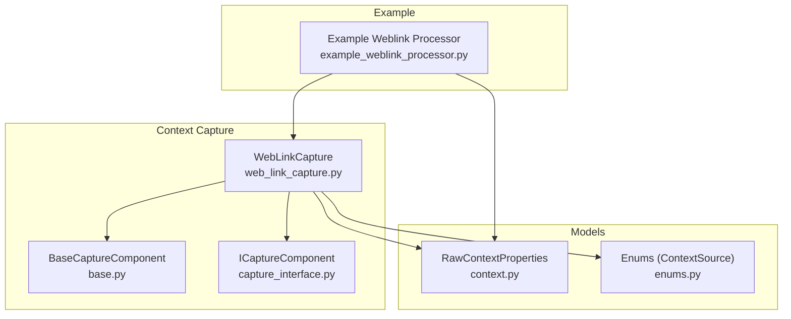
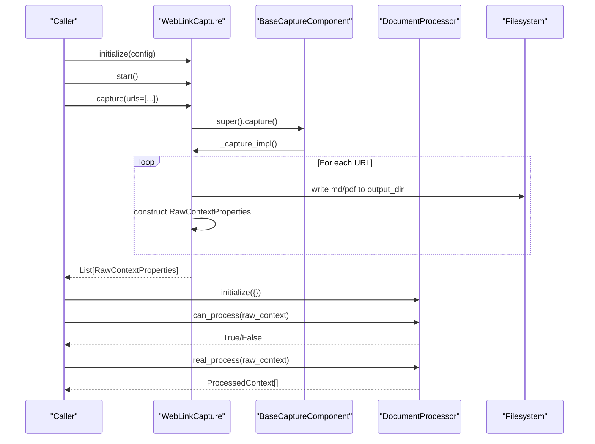
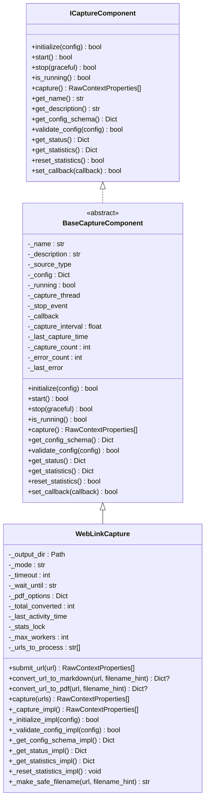
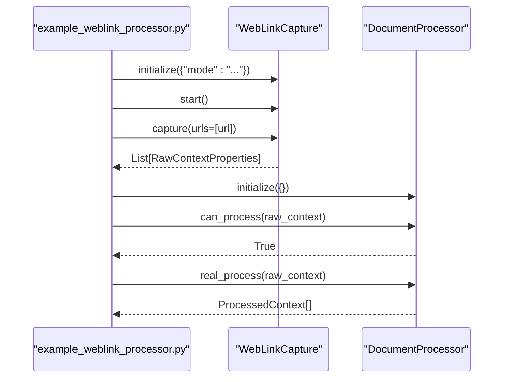
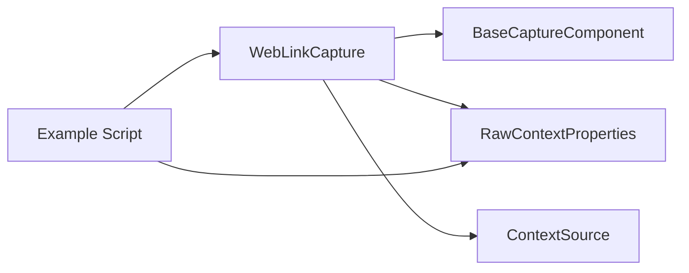

# Web Link Capture

<cite>
**Referenced Files in This Document**
- [web_link_capture.py](file://opencontext/context_capture/web_link_capture.py)
- [base.py](file://opencontext/context_capture/base.py)
- [capture_interface.py](file://opencontext/interfaces/capture_interface.py)
- [context.py](file://opencontext/models/context.py)
- [enums.py](file://opencontext/models/enums.py)
- [example_weblink_processor.py](file://examples/example_weblink_processor.py)
</cite>

## Table of Contents
1. [Introduction](#introduction)
2. [Project Structure](#project-structure)
3. [Core Components](#core-components)
4. [Architecture Overview](#architecture-overview)
5. [Detailed Component Analysis](#detailed-component-analysis)
6. [Dependency Analysis](#dependency-analysis)
7. [Performance Considerations](#performance-considerations)
8. [Troubleshooting Guide](#troubleshooting-guide)
9. [Conclusion](#conclusion)
10. [Appendices](#appendices)

## Introduction
This document explains the Web Link Capture component that transforms web browsing activity into actionable context. It focuses on how the WebLinkCapture class implements the ICaptureComponent interface to capture navigation events, page titles, URLs, and contextual metadata, and how the resulting web context is transformed into RawContextProperties for downstream processing. It also covers configuration options for tracking frequency, rendering modes, timeouts, and privacy-related considerations, along with practical examples from the codebase.

## Project Structure
The Web Link Capture resides in the context capture module and integrates with the broader context processing pipeline. The key files are:
- WebLinkCapture implementation
- Base capture component providing lifecycle and scheduling
- ICaptureComponent interface contract
- Data models for RawContextProperties and enums
- Example usage showing capture and subsequent processing

**Diagram sources**
- [web_link_capture.py](file://opencontext/context_capture/web_link_capture.py#L1-L351)
- [base.py](file://opencontext/context_capture/base.py#L1-L515)
- [capture_interface.py](file://opencontext/interfaces/capture_interface.py#L1-L153)
- [context.py](file://opencontext/models/context.py#L1-L343)
- [enums.py](file://opencontext/models/enums.py#L1-L120)
- [example_weblink_processor.py](file://examples/example_weblink_processor.py#L1-L95)

**Section sources**
- [web_link_capture.py](file://opencontext/context_capture/web_link_capture.py#L1-L351)
- [base.py](file://opencontext/context_capture/base.py#L1-L515)
- [capture_interface.py](file://opencontext/interfaces/capture_interface.py#L1-L153)
- [context.py](file://opencontext/models/context.py#L1-L343)
- [enums.py](file://opencontext/models/enums.py#L1-L120)
- [example_weblink_processor.py](file://examples/example_weblink_processor.py#L1-L95)

## Core Components
- WebLinkCapture: Implements ICaptureComponent to capture URLs, render them to Markdown or PDF, and produce RawContextProperties for downstream processing.
- BaseCaptureComponent: Provides lifecycle management (initialize/start/stop), scheduling, statistics, and callback invocation.
- ICaptureComponent: Defines the component contract for initialization, lifecycle, capture, configuration, and diagnostics.
- RawContextProperties: The standardized data model representing captured content with source, format, path/text, filter path, and additional metadata.
- Enums: Defines ContextSource.WEB_LINK and ContentFormat.FILE used by WebLinkCapture.

Key responsibilities:
- Accept a list of URLs and convert them to Markdown or PDF using external libraries.
- Produce RawContextProperties with ContextSource.WEB_LINK and ContentFormat.FILE.
- Expose configuration for output directory, mode, concurrency, timeouts, and PDF options.
- Provide status and statistics for monitoring.

**Section sources**
- [web_link_capture.py](file://opencontext/context_capture/web_link_capture.py#L1-L351)
- [base.py](file://opencontext/context_capture/base.py#L1-L515)
- [capture_interface.py](file://opencontext/interfaces/capture_interface.py#L1-L153)
- [context.py](file://opencontext/models/context.py#L1-L120)
- [enums.py](file://opencontext/models/enums.py#L1-L120)

## Architecture Overview
The Web Link Capture follows a componentized architecture:
- Components implement ICaptureComponent and inherit BaseCaptureComponent for shared behavior.
- WebLinkCapture overrides capture to accept a batch of URLs and processes them concurrently.
- Results are emitted as RawContextProperties with additional_info containing the original URL and rendered file path.
- An example demonstrates chaining capture with a document processor to extract structured content.

**Diagram sources**
- [web_link_capture.py](file://opencontext/context_capture/web_link_capture.py#L191-L252)
- [base.py](file://opencontext/context_capture/base.py#L176-L219)
- [example_weblink_processor.py](file://examples/example_weblink_processor.py#L1-L95)

## Detailed Component Analysis

### WebLinkCapture Implementation
WebLinkCapture implements the capture workflow for web URLs:
- Initialization: Validates and applies configuration for output directory, mode (Markdown/PDF), timeout, wait condition, PDF options, and worker count.
- Capture: Accepts a list of URLs, processes them concurrently, and emits RawContextProperties with content_path pointing to the generated file.
- Rendering:
  - Markdown mode uses an asynchronous crawler to generate Markdown and write to disk.
  - PDF mode uses a headless browser to render and export PDFs.
- Metadata: additional_info stores the original URL and the path to the generated file. filter_path is set to the URL for deduplication.

**Diagram sources**
- [capture_interface.py](file://opencontext/interfaces/capture_interface.py#L1-L153)
- [base.py](file://opencontext/context_capture/base.py#L1-L515)
- [web_link_capture.py](file://opencontext/context_capture/web_link_capture.py#L1-L351)

**Section sources**
- [web_link_capture.py](file://opencontext/context_capture/web_link_capture.py#L1-L351)
- [base.py](file://opencontext/context_capture/base.py#L1-L515)
- [capture_interface.py](file://opencontext/interfaces/capture_interface.py#L1-L153)

### Configuration Options
WebLinkCapture exposes a comprehensive configuration schema:
- output_dir: Directory to store generated files (default: uploads/weblinks).
- mode: Conversion mode, either pdf or markdown (default: pdf).
- max_workers: Maximum number of parallel threads for conversion (default: 4).
- timeout: Page load timeout for PDF conversion (default: 30000 ms).
- wait_until: Wait condition for page navigation in PDF mode (default: networkidle).
- pdf_format: PDF page format (default: A4).
- print_background: Whether to print CSS backgrounds (default: True).
- landscape: PDF orientation (default: False).

Validation ensures types and ranges are correct, and initialization creates the output directory.

**Section sources**
- [web_link_capture.py](file://opencontext/context_capture/web_link_capture.py#L160-L181)
- [web_link_capture.py](file://opencontext/context_capture/web_link_capture.py#L254-L296)
- [web_link_capture.py](file://opencontext/context_capture/web_link_capture.py#L298-L316)

### Data Transformation to RawContextProperties
After rendering, WebLinkCapture constructs RawContextProperties with:
- source: ContextSource.WEB_LINK
- content_format: ContentFormat.FILE
- content_path: Path to the generated Markdown or PDF
- content_text: Empty for file-based content
- create_time: Current timestamp
- filter_path: URL for deduplication
- additional_info: Contains the original URL and the path to the generated file
- enable_merge: Disabled by default for file-based web captures

This structure aligns with the broader context processing pipeline and allows downstream processors to handle the file content appropriately.

**Section sources**
- [web_link_capture.py](file://opencontext/context_capture/web_link_capture.py#L219-L242)
- [context.py](file://opencontext/models/context.py#L35-L70)
- [enums.py](file://opencontext/models/enums.py#L15-L22)

### Example Usage: Capture and Process Web Links
The example demonstrates:
- Initializing WebLinkCapture with a chosen mode (pdf or markdown)
- Starting the component
- Capturing a URL by passing it as a list to capture
- Verifying the produced RawContextProperties
- Passing the result to a document processor for further extraction

**Diagram sources**
- [example_weblink_processor.py](file://examples/example_weblink_processor.py#L1-L95)
- [web_link_capture.py](file://opencontext/context_capture/web_link_capture.py#L191-L252)

**Section sources**
- [example_weblink_processor.py](file://examples/example_weblink_processor.py#L1-L95)

## Dependency Analysis
- WebLinkCapture depends on:
  - BaseCaptureComponent for lifecycle and scheduling
  - RawContextProperties and ContextSource for standardized context representation
  - External libraries for rendering (asynchronous crawler for Markdown and Playwright for PDF)
- The example depends on WebLinkCapture and DocumentProcessor to demonstrate the end-to-end flow.

**Diagram sources**
- [web_link_capture.py](file://opencontext/context_capture/web_link_capture.py#L1-L351)
- [base.py](file://opencontext/context_capture/base.py#L1-L515)
- [context.py](file://opencontext/models/context.py#L1-L120)
- [enums.py](file://opencontext/models/enums.py#L1-L120)
- [example_weblink_processor.py](file://examples/example_weblink_processor.py#L1-L95)

**Section sources**
- [web_link_capture.py](file://opencontext/context_capture/web_link_capture.py#L1-L351)
- [base.py](file://opencontext/context_capture/base.py#L1-L515)
- [context.py](file://opencontext/models/context.py#L1-L120)
- [enums.py](file://opencontext/models/enums.py#L1-L120)
- [example_weblink_processor.py](file://examples/example_weblink_processor.py#L1-L95)

## Performance Considerations
- Concurrency: WebLinkCapture uses a thread pool with configurable max_workers to parallelize conversions. Increasing workers improves throughput but raises resource usage.
- Rendering costs: PDF generation requires launching a headless browser and rendering the page; Markdown generation uses an asynchronous crawler. Both can be slow for large or media-heavy pages.
- Timeout and wait conditions: Adjust timeout and wait_until to balance reliability and speed. Longer waits increase robustness but reduce throughput.
- Output directory: Ensure sufficient disk space and fast I/O for the output_dir to avoid bottlenecks.

[No sources needed since this section provides general guidance]

## Troubleshooting Guide
Common issues and resolutions:
- Missing dependencies:
  - For Markdown mode, the crawler library must be installed; otherwise, initialization logs an error.
  - For PDF mode, Playwright must be installed and initialized; otherwise, conversion returns None.
- Invalid configuration:
  - Mode must be pdf or markdown; max_workers and timeout must be integers ≥ 1.
  - Output directory must be a string.
- URL validation:
  - Only http/https URLs are accepted; invalid URLs are logged and skipped.
- Browser compatibility:
  - PDF rendering relies on Chromium via Playwright; ensure the environment supports headless execution.
- Authentication and private content:
  - Private or auth-required pages may fail to render. Consider pre-authentication or proxy configurations outside this component.
- Performance impact:
  - Increase max_workers cautiously; monitor CPU and memory usage.
  - Reduce timeout for faster failures on slow pages.

**Section sources**
- [web_link_capture.py](file://opencontext/context_capture/web_link_capture.py#L71-L116)
- [web_link_capture.py](file://opencontext/context_capture/web_link_capture.py#L126-L159)
- [web_link_capture.py](file://opencontext/context_capture/web_link_capture.py#L298-L316)

## Conclusion
WebLinkCapture provides a robust, configurable mechanism to capture web content as Markdown or PDF and expose it as RawContextProperties for downstream processing. By leveraging BaseCaptureComponent’s lifecycle and scheduling, it supports batch processing with controlled concurrency and clear diagnostics. The example demonstrates a straightforward pipeline to capture and process web links, enabling further extraction and enrichment.

[No sources needed since this section summarizes without analyzing specific files]

## Appendices

### Configuration Reference
- output_dir: Directory path for generated files
- mode: pdf or markdown
- max_workers: Integer ≥ 1
- timeout: Integer milliseconds
- wait_until: String (e.g., networkidle)
- pdf_format: String (e.g., A4)
- print_background: Boolean
- landscape: Boolean

**Section sources**
- [web_link_capture.py](file://opencontext/context_capture/web_link_capture.py#L160-L181)
- [web_link_capture.py](file://opencontext/context_capture/web_link_capture.py#L254-L296)

### Data Model Reference
- RawContextProperties fields used by WebLinkCapture:
  - source: ContextSource.WEB_LINK
  - content_format: ContentFormat.FILE
  - content_path: Generated file path
  - content_text: Empty for file-based content
  - create_time: Timestamp
  - filter_path: URL
  - additional_info: Original URL and file path
  - enable_merge: False by default

**Section sources**
- [web_link_capture.py](file://opencontext/context_capture/web_link_capture.py#L219-L242)
- [context.py](file://opencontext/models/context.py#L35-L70)
- [enums.py](file://opencontext/models/enums.py#L15-L22)