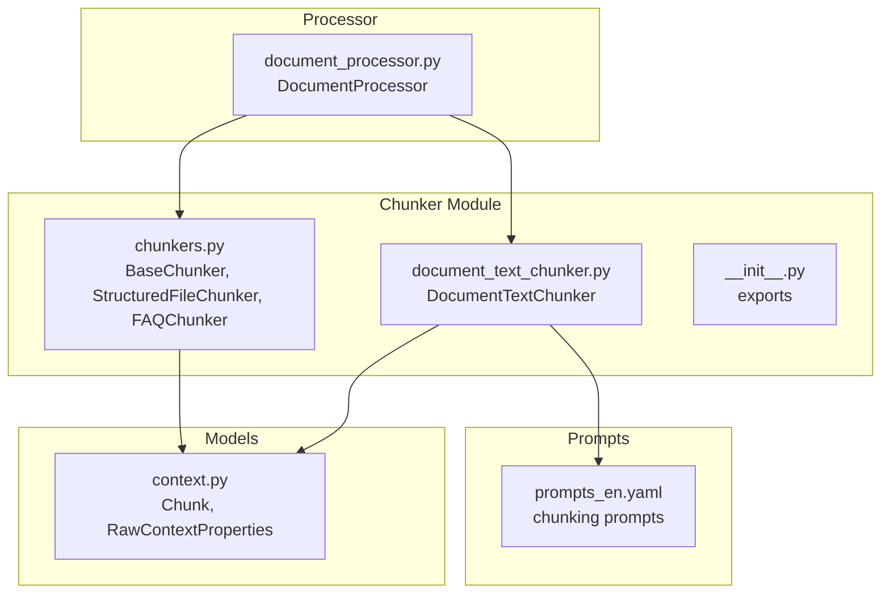
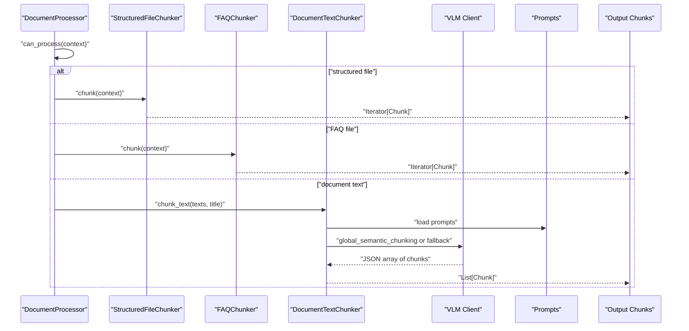
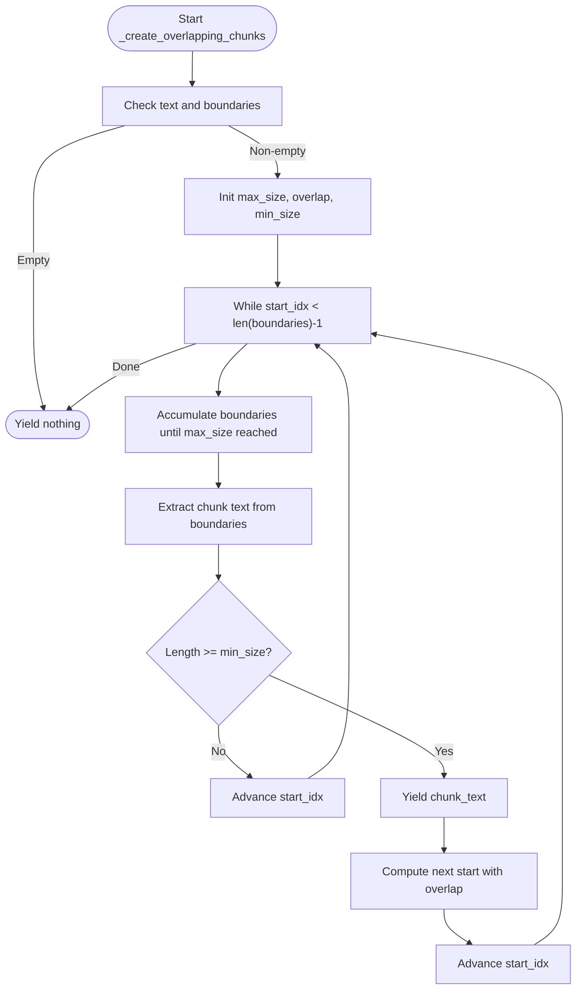
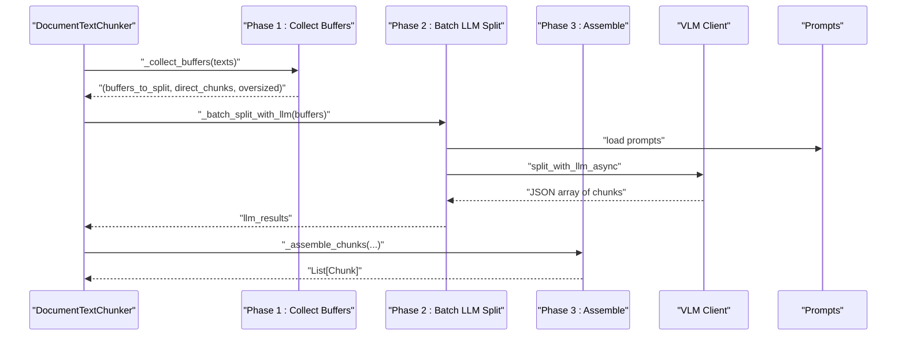
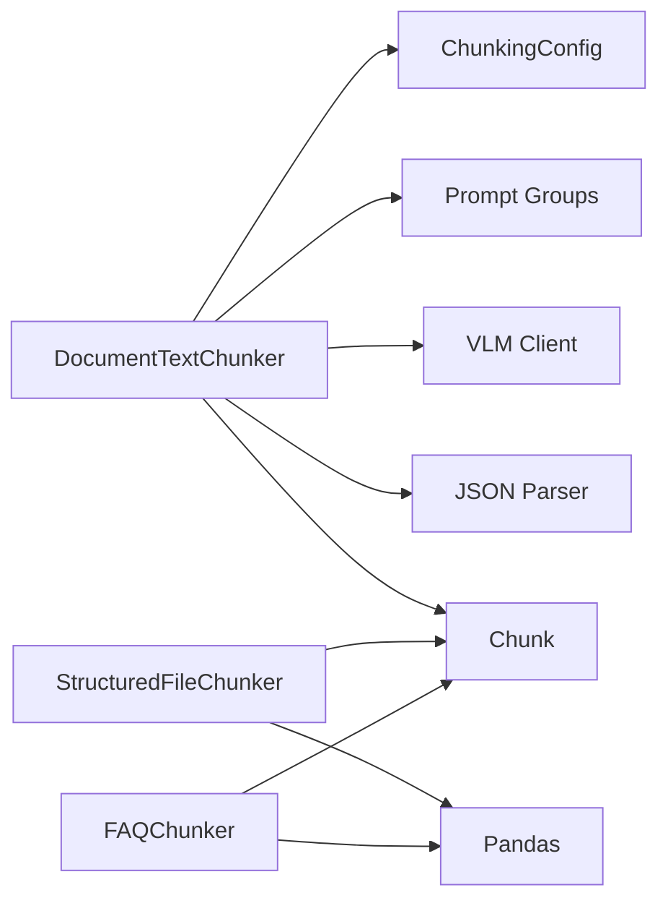

# Content Chunking

<cite>
**Referenced Files in This Document**
- [chunkers.py](file://opencontext/context_processing/chunker/chunkers.py)
- [document_text_chunker.py](file://opencontext/context_processing/chunker/document_text_chunker.py)
- [__init__.py](file://opencontext/context_processing/chunker/__init__.py)
- [context.py](file://opencontext/models/context.py)
- [document_processor.py](file://opencontext/context_processing/processor/document_processor.py)
- [prompts_en.yaml](file://config/prompts_en.yaml)
- [example_document_processor.py](file://examples/example_document_processor.py)
</cite>

## Table of Contents
1. [Introduction](#introduction)
2. [Project Structure](#project-structure)
3. [Core Components](#core-components)
4. [Architecture Overview](#architecture-overview)
5. [Detailed Component Analysis](#detailed-component-analysis)
6. [Dependency Analysis](#dependency-analysis)
7. [Performance Considerations](#performance-considerations)
8. [Troubleshooting Guide](#troubleshooting-guide)
9. [Conclusion](#conclusion)
10. [Appendices](#appendices)

## Introduction
This document explains the content chunking subsystem responsible for breaking processed context into AI-friendly segments. It covers:
- Chunking strategies implemented in chunkers.py (structured files, FAQ, and base overlapping chunking)
- Semantic-aware text chunking in document_text_chunker.py (global semantic chunking, fallback strategies, and LLM-driven splitting)
- Configuration options for chunk size, overlap, and language-specific processing
- Real-time chunking performance, memory usage, and trade-offs
- Integration with the document processing pipeline and downstream AI analysis

## Project Structure
The chunking subsystem resides under opencontext/context_processing/chunker and is integrated into the document processing pipeline.

**Diagram sources**
- [chunkers.py](file://opencontext/context_processing/chunker/chunkers.py#L1-L120)
- [document_text_chunker.py](file://opencontext/context_processing/chunker/document_text_chunker.py#L1-L120)
- [__init__.py](file://opencontext/context_processing/chunker/__init__.py#L1-L24)
- [context.py](file://opencontext/models/context.py#L24-L60)
- [document_processor.py](file://opencontext/context_processing/processor/document_processor.py#L70-L120)
- [prompts_en.yaml](file://config/prompts_en.yaml#L1580-L1779)

**Section sources**
- [chunkers.py](file://opencontext/context_processing/chunker/chunkers.py#L1-L120)
- [document_text_chunker.py](file://opencontext/context_processing/chunker/document_text_chunker.py#L1-L120)
- [__init__.py](file://opencontext/context_processing/chunker/__init__.py#L1-L24)
- [context.py](file://opencontext/models/context.py#L24-L60)
- [document_processor.py](file://opencontext/context_processing/processor/document_processor.py#L70-L120)
- [prompts_en.yaml](file://config/prompts_en.yaml#L1580-L1779)

## Core Components
- ChunkingConfig: Central configuration for chunking parameters (maximum chunk size, overlap, minimum size, batch size, caching).
- BaseChunker: Abstract base class providing shared utilities (sentence boundary detection, overlapping chunk generation) and iterator-based chunking.
- StructuredFileChunker: Streams and batches structured files (CSV, Excel, JSONL) to produce chunks without loading entire files into memory.
- FAQChunker: Specialized chunker for FAQ Excel files, treating each Q&A pair as a separate chunk.
- DocumentTextChunker: Intelligent text chunker for document text extracted by VLM, using semantic boundaries and LLM-driven splitting.

Key data model:
- Chunk: Represents a chunk with text, optional image, chunk_index, and metadata fields.
- RawContextProperties: Carries raw content and metadata for processing.

**Section sources**
- [chunkers.py](file://opencontext/context_processing/chunker/chunkers.py#L28-L44)
- [chunkers.py](file://opencontext/context_processing/chunker/chunkers.py#L46-L154)
- [chunkers.py](file://opencontext/context_processing/chunker/chunkers.py#L155-L348)
- [chunkers.py](file://opencontext/context_processing/chunker/chunkers.py#L350-L439)
- [document_text_chunker.py](file://opencontext/context_processing/chunker/document_text_chunker.py#L25-L64)
- [context.py](file://opencontext/models/context.py#L24-L60)

## Architecture Overview
The chunking subsystem integrates with the DocumentProcessor to handle diverse content types:
- Structured files: streamed and batched by StructuredFileChunker
- FAQ files: processed by FAQChunker
- Document text: chunked by DocumentTextChunker using semantic-aware strategies and LLM assistance

**Diagram sources**
- [document_processor.py](file://opencontext/context_processing/processor/document_processor.py#L70-L120)
- [chunkers.py](file://opencontext/context_processing/chunker/chunkers.py#L155-L348)
- [chunkers.py](file://opencontext/context_processing/chunker/chunkers.py#L350-L439)
- [document_text_chunker.py](file://opencontext/context_processing/chunker/document_text_chunker.py#L39-L120)
- [prompts_en.yaml](file://config/prompts_en.yaml#L1580-L1779)

## Detailed Component Analysis

### BaseChunker and Overlapping Chunking
BaseChunker provides:
- Configurable chunking parameters via ChunkingConfig
- Sentence boundary detection with caching
- Overlapping chunk generation that respects boundaries and size limits

Implementation highlights:
- Sentence boundary detection identifies sentence ends to align chunk boundaries.
- Overlapping chunk generation builds chunks up to max size, then yields them and advances with overlap to preserve continuity.

**Diagram sources**
- [chunkers.py](file://opencontext/context_processing/chunker/chunkers.py#L97-L154)

**Section sources**
- [chunkers.py](file://opencontext/context_processing/chunker/chunkers.py#L28-L44)
- [chunkers.py](file://opencontext/context_processing/chunker/chunkers.py#L82-L101)
- [chunkers.py](file://opencontext/context_processing/chunker/chunkers.py#L103-L154)

### StructuredFileChunker
Handles CSV, Excel, and JSONL files with streaming and batching:
- CSV: Reads in chunks using pandas and converts each chunk to text with headers.
- Excel: Iterates sheets and splits large sheets into smaller chunks.
- JSONL: Accumulates lines until batch size is reached, then emits a chunk.

Each chunk carries metadata indicating file type, row/sheet info, and column names for structured data.

**Section sources**
- [chunkers.py](file://opencontext/context_processing/chunker/chunkers.py#L197-L348)

### FAQChunker
Treats each Q&A pair as a separate chunk:
- Detects question and answer columns heuristically.
- Creates a chunk combining question and answer with metadata including row index and column names.

**Section sources**
- [chunkers.py](file://opencontext/context_processing/chunker/chunkers.py#L350-L439)

### DocumentTextChunker
Integrates semantic-aware chunking with LLM assistance:
- Strategy selection:
  - Short documents (< threshold): Global semantic chunking using LLM to analyze the entire document.
  - Long documents (≥ threshold): Fallback to paragraph-based accumulation with LLM-assisted splitting for oversized buffers.
- Phases:
  1) Buffer collection: Accumulate text elements into buffers respecting max chunk size; oversized elements are split mechanically.
  2) Batch LLM splitting: Concurrently split buffers that require semantic splitting.
  3) Assembly: Create Chunk objects from LLM results and mechanical splits.

Mechanical splitting strategies:
- If punctuation-based splitting is possible, split by sentence boundaries.
- Otherwise, split in half.

LLM prompts:
- Document-level semantic chunking prompt emphasizes preserving original text, semantic completeness, structure recognition, and context supplementation.
- Per-buffer chunking prompt instructs the LLM to return a JSON array of semantically complete chunks with length guidance.

**Diagram sources**
- [document_text_chunker.py](file://opencontext/context_processing/chunker/document_text_chunker.py#L65-L120)
- [document_text_chunker.py](file://opencontext/context_processing/chunker/document_text_chunker.py#L133-L159)
- [document_text_chunker.py](file://opencontext/context_processing/chunker/document_text_chunker.py#L161-L179)
- [document_text_chunker.py](file://opencontext/context_processing/chunker/document_text_chunker.py#L181-L222)
- [document_text_chunker.py](file://opencontext/context_processing/chunker/document_text_chunker.py#L255-L319)
- [document_text_chunker.py](file://opencontext/context_processing/chunker/document_text_chunker.py#L320-L339)
- [prompts_en.yaml](file://config/prompts_en.yaml#L1580-L1779)

**Section sources**
- [document_text_chunker.py](file://opencontext/context_processing/chunker/document_text_chunker.py#L39-L120)
- [document_text_chunker.py](file://opencontext/context_processing/chunker/document_text_chunker.py#L133-L159)
- [document_text_chunker.py](file://opencontext/context_processing/chunker/document_text_chunker.py#L161-L179)
- [document_text_chunker.py](file://opencontext/context_processing/chunker/document_text_chunker.py#L181-L222)
- [document_text_chunker.py](file://opencontext/context_processing/chunker/document_text_chunker.py#L223-L254)
- [document_text_chunker.py](file://opencontext/context_processing/chunker/document_text_chunker.py#L255-L319)
- [document_text_chunker.py](file://opencontext/context_processing/chunker/document_text_chunker.py#L320-L339)
- [prompts_en.yaml](file://config/prompts_en.yaml#L1580-L1779)

### Integration with DocumentProcessor
DocumentProcessor initializes chunkers and orchestrates processing:
- Initializes StructuredFileChunker, FAQChunker, and DocumentTextChunker with ChunkingConfig.
- Determines file type and dispatches to appropriate chunker.
- Processes structured files via streaming/batching and text chunks via semantic-aware splitting.

**Section sources**
- [document_processor.py](file://opencontext/context_processing/processor/document_processor.py#L70-L120)
- [document_processor.py](file://opencontext/context_processing/processor/document_processor.py#L133-L171)

## Dependency Analysis
- DocumentTextChunker depends on:
  - ChunkingConfig for sizing and overlap
  - Prompt groups loaded from configuration for semantic chunking
  - Global VLM client for asynchronous LLM calls
  - JSON parser for extracting chunk arrays from LLM responses
- StructuredFileChunker and FAQChunker depend on:
  - Pandas for structured file parsing
  - File system access for reading content
- All chunkers emit Chunk objects compatible with downstream storage and retrieval.

**Diagram sources**
- [document_text_chunker.py](file://opencontext/context_processing/chunker/document_text_chunker.py#L181-L222)
- [chunkers.py](file://opencontext/context_processing/chunker/chunkers.py#L197-L348)
- [chunkers.py](file://opencontext/context_processing/chunker/chunkers.py#L350-L439)
- [context.py](file://opencontext/models/context.py#L24-L60)

**Section sources**
- [document_text_chunker.py](file://opencontext/context_processing/chunker/document_text_chunker.py#L181-L222)
- [chunkers.py](file://opencontext/context_processing/chunker/chunkers.py#L197-L348)
- [chunkers.py](file://opencontext/context_processing/chunker/chunkers.py#L350-L439)
- [context.py](file://opencontext/models/context.py#L24-L60)

## Performance Considerations
- Memory usage patterns:
  - StructuredFileChunker streams files and uses batch sizes to avoid loading entire files into memory.
  - DocumentTextChunker uses iterative buffering and yields chunks to minimize memory footprint.
- Real-time chunking:
  - DocumentTextChunker performs concurrent LLM calls for buffers requiring semantic splitting.
  - For very long documents, it falls back to paragraph-based accumulation to reduce LLM load.
- Trade-offs between chunk size and AI effectiveness:
  - Larger chunks preserve more context but increase LLM cost and latency.
  - Smaller chunks improve locality but risk losing cross-boundary context.
  - The system balances these by using global semantic chunking for short documents and mechanical splitting with sentence boundaries for long documents.
- Caching and overlap:
  - Sentence boundary detection is cached to reduce repeated computation.
  - Overlap ensures continuity across chunk boundaries without excessive recomputation.

[No sources needed since this section provides general guidance]

## Troubleshooting Guide
Common issues and resolutions:
- Empty or invalid input:
  - DocumentTextChunker logs warnings when texts are empty and returns no chunks.
- LLM failures:
  - If LLM returns non-list responses or exceptions occur, the system falls back to mechanical splitting or default strategies.
- Oversized elements:
  - Mechanically split by sentence boundaries or in half when no punctuation is found.
- Structured file errors:
  - Exceptions during streaming are logged; ensure file paths exist and formats are supported.

**Section sources**
- [document_text_chunker.py](file://opencontext/context_processing/chunker/document_text_chunker.py#L219-L222)
- [document_text_chunker.py](file://opencontext/context_processing/chunker/document_text_chunker.py#L246-L254)
- [chunkers.py](file://opencontext/context_processing/chunker/chunkers.py#L197-L348)
- [chunkers.py](file://opencontext/context_processing/chunker/chunkers.py#L350-L439)

## Conclusion
The chunking subsystem provides robust, scalable strategies for transforming processed context into AI-friendly segments:
- StructuredFileChunker and FAQChunker handle structured content efficiently with streaming and batching.
- DocumentTextChunker applies semantic-aware splitting with LLM assistance for short documents and mechanical splitting for long ones, balancing accuracy and performance.
- Configuration options allow tuning chunk size, overlap, and batch behavior to meet downstream AI analysis requirements.

[No sources needed since this section summarizes without analyzing specific files]

## Appendices

### Configuration Options
- ChunkingConfig parameters:
  - max_chunk_size: maximum characters per chunk
  - chunk_overlap: overlap between consecutive chunks
  - min_chunk_size: minimum characters per chunk
  - batch_size: batch size for structured file processing
  - enable_caching: enables sentence boundary caching

- DocumentProcessor initialization sets defaults for DocumentTextChunker:
  - max_chunk_size: 1000
  - min_chunk_size: 100
  - chunk_overlap: 100

**Section sources**
- [chunkers.py](file://opencontext/context_processing/chunker/chunkers.py#L28-L44)
- [document_processor.py](file://opencontext/context_processing/processor/document_processor.py#L76-L84)

### Example Usage
- The example demonstrates how to queue documents for processing and retrieve chunk summaries without storing in the database.

**Section sources**
- [example_document_processor.py](file://examples/example_document_processor.py#L118-L170)