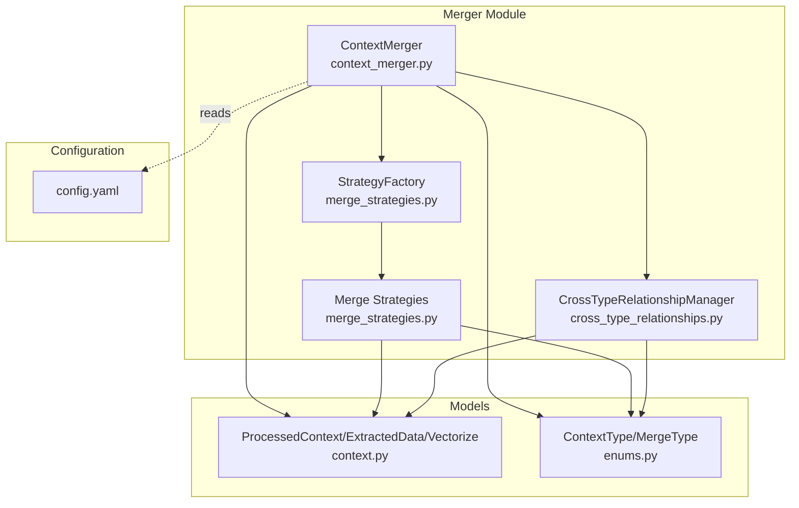
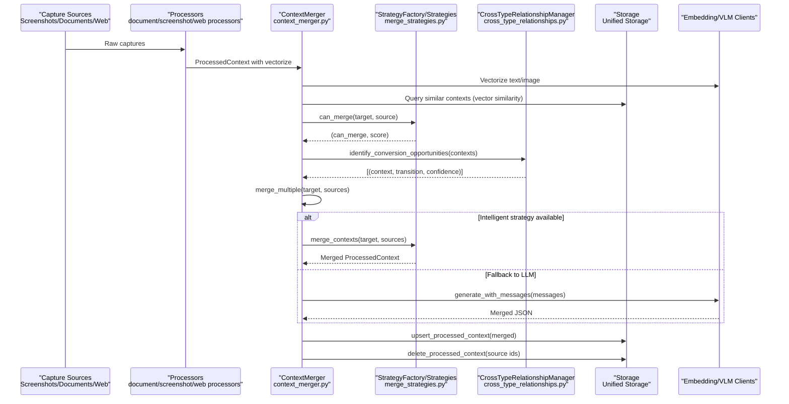
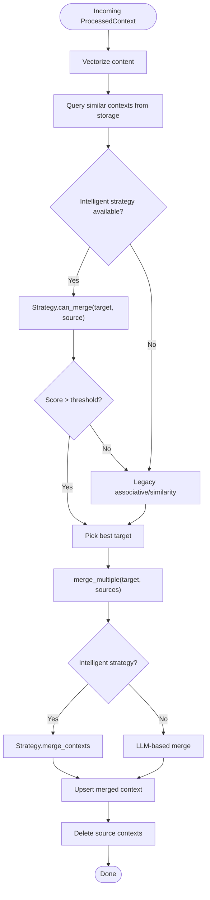
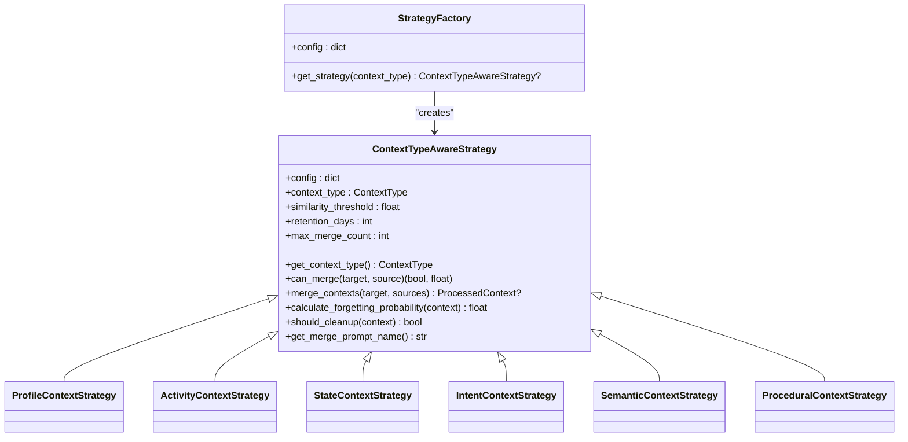
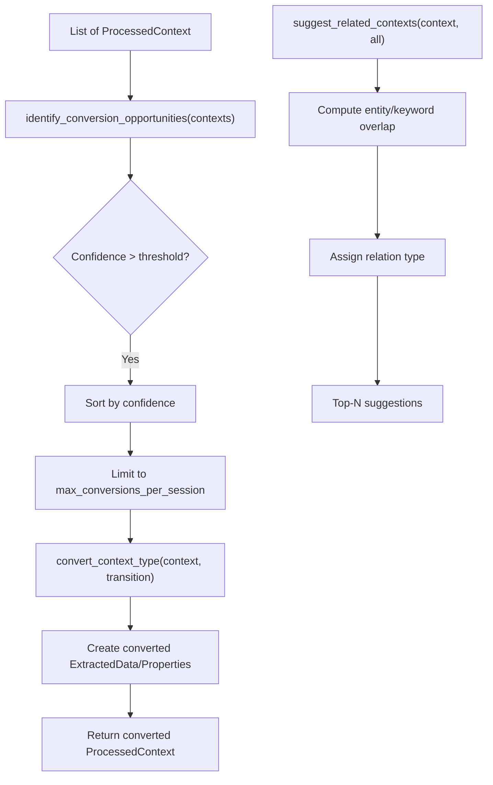
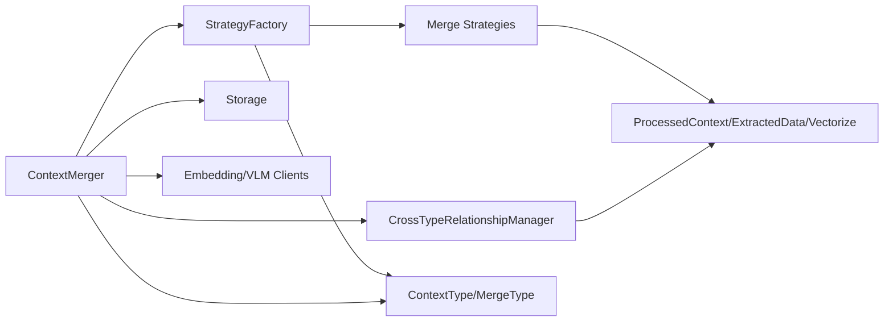

# Context Merging

<cite>
**Referenced Files in This Document**
- [context_merger.py](file://opencontext/context_processing/merger/context_merger.py)
- [merge_strategies.py](file://opencontext/context_processing/merger/merge_strategies.py)
- [cross_type_relationships.py](file://opencontext/context_processing/merger/cross_type_relationships.py)
- [context.py](file://opencontext/models/context.py)
- [enums.py](file://opencontext/models/enums.py)
- [config.yaml](file://config/config.yaml)
</cite>

## Table of Contents
1. [Introduction](#introduction)
2. [Project Structure](#project-structure)
3. [Core Components](#core-components)
4. [Architecture Overview](#architecture-overview)
5. [Detailed Component Analysis](#detailed-component-analysis)
6. [Dependency Analysis](#dependency-analysis)
7. [Performance Considerations](#performance-considerations)
8. [Troubleshooting Guide](#troubleshooting-guide)
9. [Conclusion](#conclusion)
10. [Appendices](#appendices)

## Introduction
This document explains the context merging subsystem responsible for combining related information captured from diverse sources (screenshots, documents, web links, etc.) into coherent, high-quality knowledge units. It covers:
- How the merger identifies and links related context items across different capture types
- The intelligent merge strategies that leverage temporal proximity, semantic similarity, and entity-based linking
- Cross-type relationships that connect different context types and simulate transformations akin to human memory
- Practical examples of reconstructing user activities from fragmented captures
- Configuration options for thresholds, relationship weighting, and conflict resolution
- Performance considerations and memory management strategies for large-scale merging

## Project Structure
The merging subsystem resides under the context processing module and integrates with the unified storage layer and LLM clients for vectorization and merging.

**Diagram sources**
- [context_merger.py](file://opencontext/context_processing/merger/context_merger.py#L1-L120)
- [merge_strategies.py](file://opencontext/context_processing/merger/merge_strategies.py#L1-L120)
- [cross_type_relationships.py](file://opencontext/context_processing/merger/cross_type_relationships.py#L1-L120)
- [context.py](file://opencontext/models/context.py#L1-L120)
- [enums.py](file://opencontext/models/enums.py#L80-L120)
- [config.yaml](file://config/config.yaml#L95-L145)

**Section sources**
- [context_merger.py](file://opencontext/context_processing/merger/context_merger.py#L1-L120)
- [merge_strategies.py](file://opencontext/context_processing/merger/merge_strategies.py#L1-L120)
- [cross_type_relationships.py](file://opencontext/context_processing/merger/cross_type_relationships.py#L1-L120)
- [context.py](file://opencontext/models/context.py#L1-L120)
- [enums.py](file://opencontext/models/enums.py#L80-L120)
- [config.yaml](file://config/config.yaml#L95-L145)

## Core Components
- ContextMerger: Orchestrates intelligent merging, fallback strategies, and periodic memory compression. It uses vector similarity and type-aware strategies to find merge targets and merge multiple contexts.
- StrategyFactory and ContextTypeAwareStrategy: Provide type-specific merge logic and memory management policies for each ContextType.
- CrossTypeRelationshipManager: Identifies cross-type conversion opportunities and suggests related contexts across types, enabling transformations like intent-to-activity or activity-to-profile.

Key capabilities:
- Temporal proximity: Strategies enforce time windows for activity/state contexts.
- Semantic similarity: Cosine similarity over embeddings determines relatedness.
- Entity-based linking: Overlap of entities and keywords strengthens candidate selection.
- Cross-type associations: Keyword triggers and confidence scoring drive transformations.

**Section sources**
- [context_merger.py](file://opencontext/context_processing/merger/context_merger.py#L39-L120)
- [merge_strategies.py](file://opencontext/context_processing/merger/merge_strategies.py#L1-L120)
- [cross_type_relationships.py](file://opencontext/context_processing/merger/cross_type_relationships.py#L1-L120)

## Architecture Overview
The merging pipeline integrates vectorization, similarity search, and type-aware strategies, with optional LLM-based fallback and cross-type relationship processing.

**Diagram sources**
- [context_merger.py](file://opencontext/context_processing/merger/context_merger.py#L85-L200)
- [merge_strategies.py](file://opencontext/context_processing/merger/merge_strategies.py#L1270-L1287)
- [cross_type_relationships.py](file://opencontext/context_processing/merger/cross_type_relationships.py#L91-L140)

## Detailed Component Analysis

### ContextMerger: Intelligent Target Finding and Merging
Responsibilities:
- Vectorize incoming contexts and query similar contexts from storage.
- Select merge targets using type-aware strategies or legacy associative/similarity heuristics.
- Merge multiple sources into a target using intelligent strategies or LLM fallback.
- Periodic memory compression to group similar contexts and clean up older ones.
- Memory reinforcement and cleanup utilities.

Key logic highlights:
- Intelligent target finding: Uses vector similarity and strategy.can_merge to pick best target.
- Legacy fallback: Associative merge within a time window and entity overlap, followed by similarity-based merge.
- LLM-based merging: Builds type-specific or generic prompts to produce merged ExtractedData.
- Periodic compression: Groups contexts by similarity and merges older ones into newer ones.
- Memory management: Cleanup by type using forgetting probability and retention policies.

**Diagram sources**
- [context_merger.py](file://opencontext/context_processing/merger/context_merger.py#L106-L200)
- [context_merger.py](file://opencontext/context_processing/merger/context_merger.py#L265-L380)
- [context_merger.py](file://opencontext/context_processing/merger/context_merger.py#L462-L595)

**Section sources**
- [context_merger.py](file://opencontext/context_processing/merger/context_merger.py#L85-L200)
- [context_merger.py](file://opencontext/context_processing/merger/context_merger.py#L265-L380)
- [context_merger.py](file://opencontext/context_processing/merger/context_merger.py#L462-L595)

### Merge Strategies: Temporal, Semantic, and Entity-Aware Linking
The StrategyFactory registers type-aware strategies for each ContextType. Each strategy defines:
- Thresholds for similarity and retention
- Time windows for temporal proximity checks
- Entity and keyword overlap rules
- Cosine similarity computation
- Merge logic that aggregates entities, keywords, importance, and confidence

Supported strategies and their specializations:
- ProfileContextStrategy: High entity overlap and vector similarity for identity/profile consolidation.
- ActivityContextStrategy: Time window checks and moderate entity/keyword overlap for activity sequences.
- StateContextStrategy: Very short time windows and high entity overlap for monitoring state continuity.
- IntentContextStrategy: Moderate entity/keyword overlap plus vector similarity for goal-oriented planning.
- SemanticContextStrategy: Conceptual overlap and vector similarity for knowledge definitions.
- ProceduralContextStrategy: Tool/method overlap and operational keyword overlap for workflows.

**Diagram sources**
- [merge_strategies.py](file://opencontext/context_processing/merger/merge_strategies.py#L1-L120)
- [merge_strategies.py](file://opencontext/context_processing/merger/merge_strategies.py#L1270-L1287)

**Section sources**
- [merge_strategies.py](file://opencontext/context_processing/merger/merge_strategies.py#L1-L120)
- [merge_strategies.py](file://opencontext/context_processing/merger/merge_strategies.py#L1270-L1287)

### Cross-Type Relationships: Transformations and Associations
CrossTypeRelationshipManager:
- Defines transitions between context types (e.g., intent-to-activity, activity-to-profile, state-to-activity).
- Evaluates conversion confidence based on keyword triggers, context confidence/importance, and specific rules.
- Converts a context to another type with adjusted importance/confidence and adapted keywords.
- Suggests related contexts across types using entity/keyword overlap.

**Diagram sources**
- [cross_type_relationships.py](file://opencontext/context_processing/merger/cross_type_relationships.py#L91-L140)
- [cross_type_relationships.py](file://opencontext/context_processing/merger/cross_type_relationships.py#L203-L243)
- [cross_type_relationships.py](file://opencontext/context_processing/merger/cross_type_relationships.py#L362-L409)

**Section sources**
- [cross_type_relationships.py](file://opencontext/context_processing/merger/cross_type_relationships.py#L1-L120)
- [cross_type_relationships.py](file://opencontext/context_processing/merger/cross_type_relationships.py#L120-L243)
- [cross_type_relationships.py](file://opencontext/context_processing/merger/cross_type_relationships.py#L244-L361)
- [cross_type_relationships.py](file://opencontext/context_processing/merger/cross_type_relationships.py#L362-L409)

### Example: Reconstructing User Activities from Fragmented Captures
Scenario:
- Screenshots capture UI actions and partial tasks
- Documents describe procedures and goals
- Web links provide external references
- State monitors show progress metrics

Workflow:
- Capture processors extract ProcessedContext with entities/keywords and vectorize content.
- ContextMerger finds temporally close and semantically similar contexts.
- ActivityContextStrategy merges multiple activity fragments into a coherent sequence.
- CrossTypeRelationshipManager converts completed intents into activity records and activity sequences into profile updates.

Outcome:
- A unified activity timeline reflecting the user’s goals, actions, and outcomes, with enriched entities and keywords.

[No sources needed since this section provides a conceptual example]

### Configuration Options
Core configuration keys under processing.context_merger:
- similarity_threshold: Global threshold for similarity-based merging
- associative_similarity_threshold: Threshold for associative merge within time window
- use_intelligent_merging: Toggle intelligent strategy merging vs. LLM fallback
- enable_memory_management: Enable periodic memory compression and cleanup
- cleanup_interval_hours: Interval for cleanup checks
- enable_cross_type_processing: Enable cross-type processing
- conversion_confidence_threshold: Confidence threshold for conversions
- max_conversions_per_session: Cap on conversions per session

Type-specific configuration keys (with placeholders for ContextType values):
- {TYPE}_similarity_threshold
- {TYPE}_retention_days
- {TYPE}_max_merge_count
- {TYPE}_time_window_hours (for activity)
- {TYPE}_time_window_minutes (for state)

These keys are read by strategies to tune thresholds and retention policies per context type.

**Section sources**
- [config.yaml](file://config/config.yaml#L95-L145)
- [merge_strategies.py](file://opencontext/context_processing/merger/merge_strategies.py#L24-L60)

## Dependency Analysis
- ContextMerger depends on:
  - StrategyFactory for type-aware strategies
  - Unified storage for vector similarity queries and upsert/delete operations
  - Embedding and VLM clients for vectorization and LLM-based merging
- StrategyFactory depends on ContextType and config to instantiate strategies
- CrossTypeRelationshipManager depends on ExtractedData and ContextType for conversions and suggestions
- Models (ProcessedContext, ExtractedData, Vectorize) define the data contract across components

**Diagram sources**
- [context_merger.py](file://opencontext/context_processing/merger/context_merger.py#L1-L120)
- [merge_strategies.py](file://opencontext/context_processing/merger/merge_strategies.py#L1270-L1287)
- [cross_type_relationships.py](file://opencontext/context_processing/merger/cross_type_relationships.py#L1-L120)
- [context.py](file://opencontext/models/context.py#L1-L120)
- [enums.py](file://opencontext/models/enums.py#L80-L120)

**Section sources**
- [context_merger.py](file://opencontext/context_processing/merger/context_merger.py#L1-L120)
- [merge_strategies.py](file://opencontext/context_processing/merger/merge_strategies.py#L1270-L1287)
- [cross_type_relationships.py](file://opencontext/context_processing/merger/cross_type_relationships.py#L1-L120)
- [context.py](file://opencontext/models/context.py#L1-L120)
- [enums.py](file://opencontext/models/enums.py#L80-L120)

## Performance Considerations
- Vector similarity queries: Use top_k and filters to bound candidate sets; avoid scanning entire corpus for every merge.
- Batch processing: Group contexts by type and similarity to reduce repeated queries and LLM calls.
- Memory compression: Periodic compression reduces storage and improves retrieval performance by consolidating similar contexts.
- Cleanup policies: Use forgetting curves and retention days to prune low-importance, outdated contexts.
- Embedding dimensionality: Align embedding model output_dim with storage backend expectations to avoid costly conversions.
- LLM cost control: Prefer intelligent strategies over LLM fallback when possible; limit max_conversions_per_session and adjust thresholds.

[No sources needed since this section provides general guidance]

## Troubleshooting Guide
Common issues and remedies:
- No merge target found:
  - Verify vectorize is populated and embedding client is configured
  - Check thresholds and time windows for the context type
- LLM merge failures:
  - Inspect prompt availability and JSON parsing errors
  - Validate required fields in response
- Cross-type conversion not triggered:
  - Ensure trigger keywords appear in title/summary
  - Confirm conversion_confidence_threshold and max_conversions_per_session
- Memory cleanup not effective:
  - Review retention_days and importance thresholds per type
  - Confirm enable_memory_management flag

Operational diagnostics:
- ContextMerger.get_statistics(): Track merges attempted/succeeded/errors
- CrossTypeRelationshipManager.get_conversion_statistics(): Monitor conversion attempts and success rates

**Section sources**
- [context_merger.py](file://opencontext/context_processing/merger/context_merger.py#L462-L595)
- [cross_type_relationships.py](file://opencontext/context_processing/merger/cross_type_relationships.py#L344-L361)

## Conclusion
The context merging subsystem combines vector similarity, temporal proximity, and entity-based linking with type-aware strategies to unify fragmented captures into coherent knowledge. Cross-type relationships enable semantic transformations that mirror human memory, while configuration-driven thresholds and retention policies balance quality and performance. Periodic compression and cleanup keep the knowledge graph compact and relevant.

[No sources needed since this section summarizes without analyzing specific files]

## Appendices

### Appendix A: Context Types and Their Purposes
- ENTITY_CONTEXT: Identity/profile information
- ACTIVITY_CONTEXT: Completed behaviors and tasks
- INTENT_CONTEXT: Future plans and goals
- SEMANTIC_CONTEXT: Concepts and definitions
- PROCEDURAL_CONTEXT: Operational methods and workflows
- STATE_CONTEXT: Progress and status monitoring

**Section sources**
- [enums.py](file://opencontext/models/enums.py#L84-L142)

### Appendix B: Data Model Overview
- ProcessedContext: id, properties, extracted_data, vectorize, metadata
- ExtractedData: title, summary, keywords, entities, context_type, confidence, importance
- Vectorize: content_format, text/image_path/vector for embedding

**Section sources**
- [context.py](file://opencontext/models/context.py#L57-L120)
- [context.py](file://opencontext/models/context.py#L131-L203)