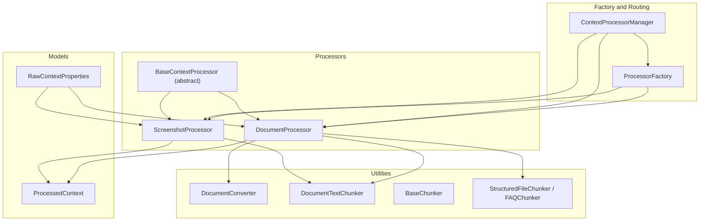
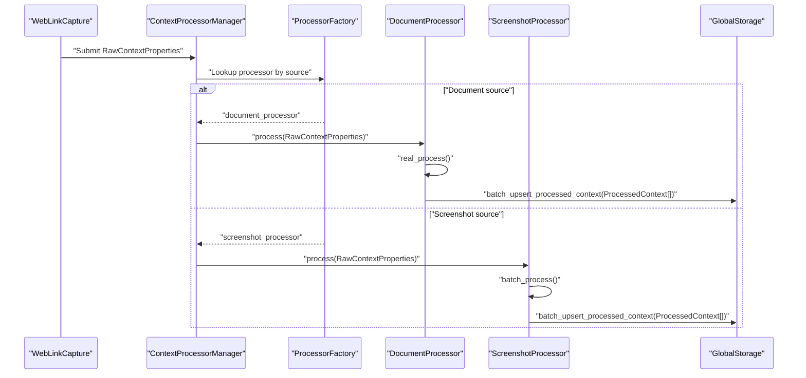
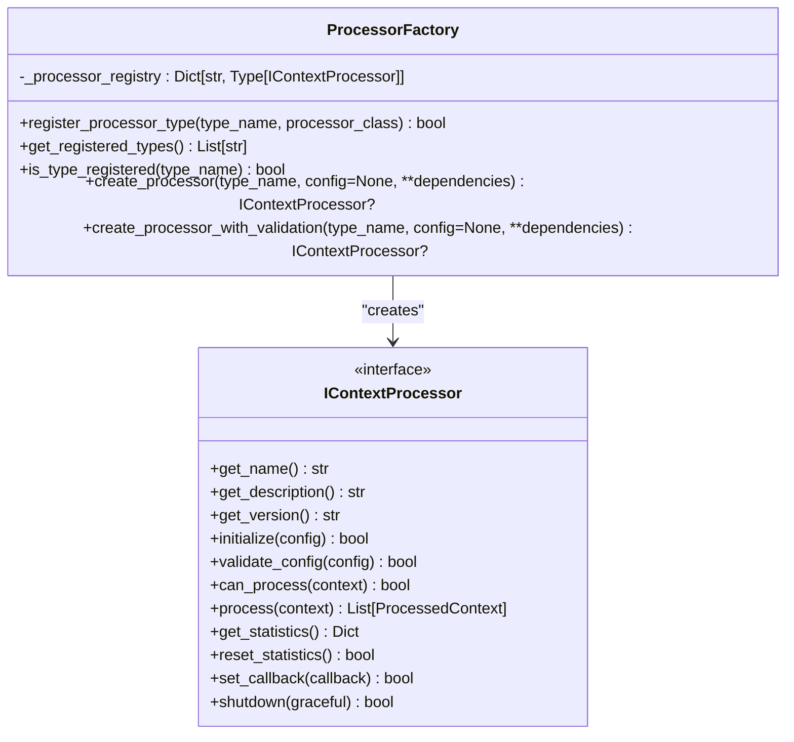
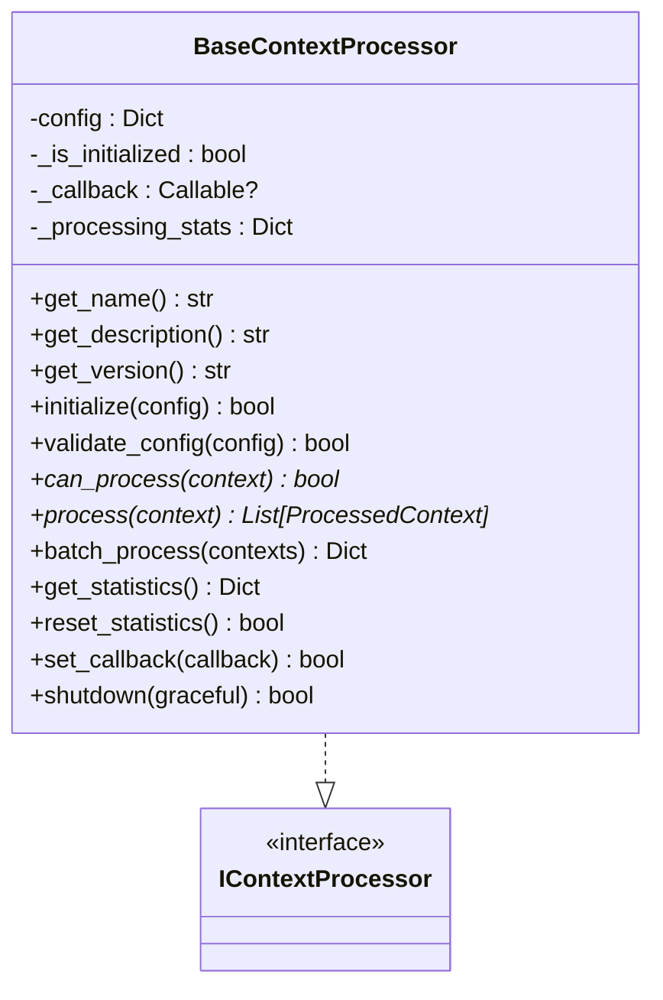
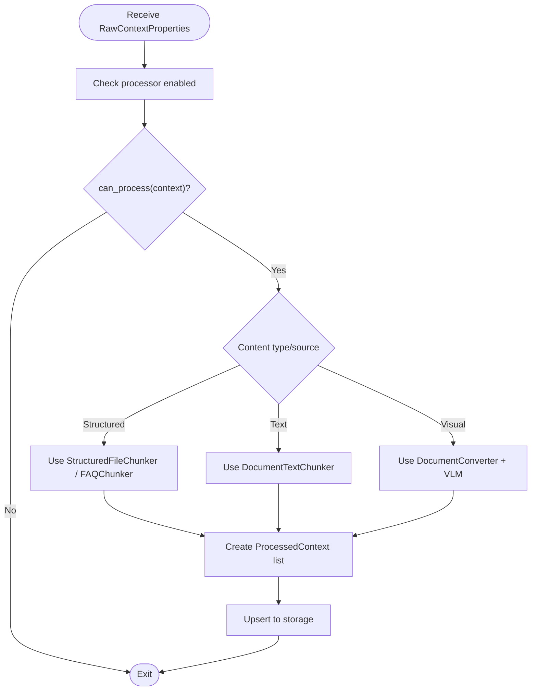
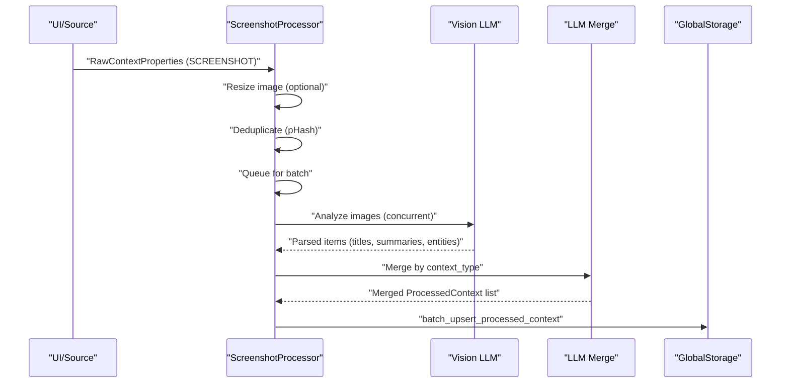
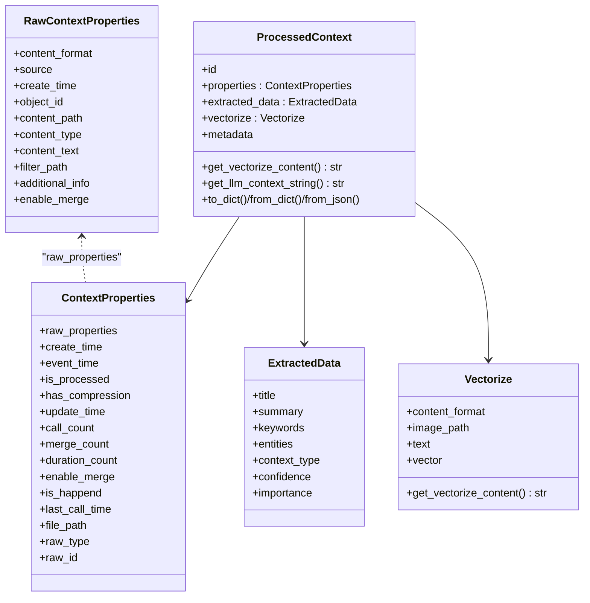
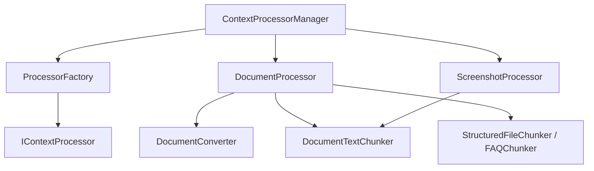

# Context Processors

<cite>
**Referenced Files in This Document**
- [processor_factory.py](file://opencontext/context_processing/processor/processor_factory.py)
- [base_processor.py](file://opencontext/context_processing/processor/base_processor.py)
- [document_processor.py](file://opencontext/context_processing/processor/document_processor.py)
- [screenshot_processor.py](file://opencontext/context_processing/processor/screenshot_processor.py)
- [document_converter.py](file://opencontext/context_processing/processor/document_converter.py)
- [context.py](file://opencontext/models/context.py)
- [processor_interface.py](file://opencontext/interfaces/processor_interface.py)
- [processor_manager.py](file://opencontext/managers/processor_manager.py)
- [document_text_chunker.py](file://opencontext/context_processing/chunker/document_text_chunker.py)
- [chunkers.py](file://opencontext/context_processing/chunker/chunkers.py)
- [example_document_processor.py](file://examples/example_document_processor.py)
- [example_screenshot_processor.py](file://examples/example_screenshot_processor.py)
- [example_weblink_processor.py](file://examples/example_weblink_processor.py)
</cite>

## Table of Contents
1. [Introduction](#introduction)
2. [Project Structure](#project-structure)
3. [Core Components](#core-components)
4. [Architecture Overview](#architecture-overview)
5. [Detailed Component Analysis](#detailed-component-analysis)
6. [Dependency Analysis](#dependency-analysis)
7. [Performance Considerations](#performance-considerations)
8. [Troubleshooting Guide](#troubleshooting-guide)
9. [Conclusion](#conclusion)
10. [Appendices](#appendices)

## Introduction
This document explains the context processor subsystem responsible for transforming raw captured data into structured, searchable context. It focuses on:
- Dynamic routing of different context types (document, screenshot, web link) to their respective processors via a factory and manager.
- How the document processor extracts text and metadata from various file formats using a document converter and chunker.
- How the screenshot processor analyzes visual content using AI models and merges results.
- The base processor abstraction that defines a common interface for all processors.
- Domain models such as ProcessedContext and RawContextProperties and how they evolve through the processing phase.
- Example workflows for different file types, error handling, performance considerations, and extensibility for custom processors.

## Project Structure
The context processing subsystem is organized around a factory, a base processor abstraction, specialized processors, and supporting utilities:
- Factory and Manager: dynamic creation and routing of processors
- Base Processor: shared interface and lifecycle
- Document Processor: file format handling, conversion, and chunking
- Screenshot Processor: visual analysis and merging
- Utilities: converters, chunkers, and models

**Diagram sources**
- [processor_factory.py](file://opencontext/context_processing/processor/processor_factory.py#L1-L175)
- [processor_manager.py](file://opencontext/managers/processor_manager.py#L1-L213)
- [base_processor.py](file://opencontext/context_processing/processor/base_processor.py#L1-L261)
- [document_processor.py](file://opencontext/context_processing/processor/document_processor.py#L1-L653)
- [screenshot_processor.py](file://opencontext/context_processing/processor/screenshot_processor.py#L1-L590)
- [document_converter.py](file://opencontext/context_processing/processor/document_converter.py#L1-L607)
- [document_text_chunker.py](file://opencontext/context_processing/chunker/document_text_chunker.py#L1-L349)
- [chunkers.py](file://opencontext/context_processing/chunker/chunkers.py#L1-L439)
- [context.py](file://opencontext/models/context.py#L1-L343)

**Section sources**
- [processor_factory.py](file://opencontext/context_processing/processor/processor_factory.py#L1-L175)
- [processor_manager.py](file://opencontext/managers/processor_manager.py#L1-L213)
- [context.py](file://opencontext/models/context.py#L1-L343)

## Core Components
- ProcessorFactory: registers and creates processor instances, validates configuration, and logs lifecycle events.
- BaseContextProcessor: defines the common interface, lifecycle, statistics, and batch processing behavior.
- DocumentProcessor: orchestrates document conversion, page-level analysis, VLM extraction, chunking, and storage.
- ScreenshotProcessor: performs deduplication, VLM analysis, merging, and entity enrichment.
- DocumentConverter: converts PDF/DOCX/PPTX/images to images and analyzes pages for visual content.
- Chunkers: structured file chunkers and a semantic text chunker for intelligent splitting.

**Section sources**
- [processor_factory.py](file://opencontext/context_processing/processor/processor_factory.py#L1-L175)
- [base_processor.py](file://opencontext/context_processing/processor/base_processor.py#L1-L261)
- [document_processor.py](file://opencontext/context_processing/processor/document_processor.py#L1-L653)
- [screenshot_processor.py](file://opencontext/context_processing/processor/screenshot_processor.py#L1-L590)
- [document_converter.py](file://opencontext/context_processing/processor/document_converter.py#L1-L607)
- [document_text_chunker.py](file://opencontext/context_processing/chunker/document_text_chunker.py#L1-L349)
- [chunkers.py](file://opencontext/context_processing/chunker/chunkers.py#L1-L439)

## Architecture Overview
The system routes raw contexts to appropriate processors based on source and content type. The manager maintains routing rules and delegates processing to registered processors. Both DocumentProcessor and ScreenshotProcessor use asynchronous workflows and background queues for throughput.

**Diagram sources**
- [processor_manager.py](file://opencontext/managers/processor_manager.py#L87-L160)
- [processor_factory.py](file://opencontext/context_processing/processor/processor_factory.py#L109-L171)
- [document_processor.py](file://opencontext/context_processing/processor/document_processor.py#L223-L246)
- [screenshot_processor.py](file://opencontext/context_processing/processor/screenshot_processor.py#L498-L531)

## Detailed Component Analysis

### ProcessorFactory: Dynamic Routing and Registration
- Registers built-in processors and allows external registration.
- Validates processor classes implement the interface.
- Creates instances with parameterless constructors and supports configuration validation via global config.

**Diagram sources**
- [processor_factory.py](file://opencontext/context_processing/processor/processor_factory.py#L1-L175)
- [processor_interface.py](file://opencontext/interfaces/processor_interface.py#L1-L136)

**Section sources**
- [processor_factory.py](file://opencontext/context_processing/processor/processor_factory.py#L45-L171)
- [processor_interface.py](file://opencontext/interfaces/processor_interface.py#L16-L136)

### BaseContextProcessor: Common Abstraction
- Defines the IContextProcessor contract and provides:
  - Initialization and configuration validation
  - Batch processing with grouping by object ID
  - Statistics tracking and callback invocation
  - Graceful shutdown

**Diagram sources**
- [base_processor.py](file://opencontext/context_processing/processor/base_processor.py#L1-L261)
- [processor_interface.py](file://opencontext/interfaces/processor_interface.py#L1-L136)

**Section sources**
- [base_processor.py](file://opencontext/context_processing/processor/base_processor.py#L31-L261)
- [processor_interface.py](file://opencontext/interfaces/processor_interface.py#L16-L136)

### DocumentProcessor: File Format Extraction and Chunking
- Determines file type and content source to route processing:
  - Structured files (CSV/XLSX/JSONL) via structured chunkers
  - Plain text content via text chunker
  - Visual content (PDF/DOCX/images) via page-level analysis and VLM
- Uses a background queue and thread for throughput.
- Converts documents to images, analyzes pages, and extracts text using VLM.
- Applies semantic chunking to produce ProcessedContext entries.

**Diagram sources**
- [document_processor.py](file://opencontext/context_processing/processor/document_processor.py#L172-L246)
- [document_converter.py](file://opencontext/context_processing/processor/document_converter.py#L52-L167)
- [document_text_chunker.py](file://opencontext/context_processing/chunker/document_text_chunker.py#L39-L118)
- [chunkers.py](file://opencontext/context_processing/chunker/chunkers.py#L155-L349)

**Section sources**
- [document_processor.py](file://opencontext/context_processing/processor/document_processor.py#L172-L653)
- [document_converter.py](file://opencontext/context_processing/processor/document_converter.py#L1-L607)
- [document_text_chunker.py](file://opencontext/context_processing/chunker/document_text_chunker.py#L1-L349)
- [chunkers.py](file://opencontext/context_processing/chunker/chunkers.py#L1-L439)

### ScreenshotProcessor: Visual Analysis and Merging
- Deduplicates screenshots using perceptual hashing and optional deletion.
- Resizes images and processes batches concurrently with Vision LLM.
- Merges results by context type using LLM-driven semantic merging.
- Performs entity refresh and vectorization in parallel.

**Diagram sources**
- [screenshot_processor.py](file://opencontext/context_processing/processor/screenshot_processor.py#L114-L235)
- [screenshot_processor.py](file://opencontext/context_processing/processor/screenshot_processor.py#L236-L531)

**Section sources**
- [screenshot_processor.py](file://opencontext/context_processing/processor/screenshot_processor.py#L114-L590)

### Domain Models: RawContextProperties and ProcessedContext
- RawContextProperties: carries source, content format, and either a file path or text content.
- ProcessedContext: holds structured extracted data, vectorization configuration, and metadata.
- ContextProperties and ExtractedData provide typed attributes for downstream systems.

**Diagram sources**
- [context.py](file://opencontext/models/context.py#L24-L202)

**Section sources**
- [context.py](file://opencontext/models/context.py#L24-L202)

## Dependency Analysis
- ProcessorFactory depends on IContextProcessor and processor classes to create instances.
- ContextProcessorManager defines routing rules and delegates processing to registered processors.
- DocumentProcessor depends on DocumentConverter, chunkers, and storage for persistence.
- ScreenshotProcessor depends on image utilities, VLM clients, and merging logic.

**Diagram sources**
- [processor_factory.py](file://opencontext/context_processing/processor/processor_factory.py#L1-L175)
- [processor_manager.py](file://opencontext/managers/processor_manager.py#L87-L160)
- [document_processor.py](file://opencontext/context_processing/processor/document_processor.py#L1-L120)
- [screenshot_processor.py](file://opencontext/context_processing/processor/screenshot_processor.py#L1-L120)
- [document_converter.py](file://opencontext/context_processing/processor/document_converter.py#L1-L120)
- [document_text_chunker.py](file://opencontext/context_processing/chunker/document_text_chunker.py#L1-L60)
- [chunkers.py](file://opencontext/context_processing/chunker/chunkers.py#L1-L80)

**Section sources**
- [processor_manager.py](file://opencontext/managers/processor_manager.py#L87-L160)
- [document_processor.py](file://opencontext/context_processing/processor/document_processor.py#L1-L120)
- [screenshot_processor.py](file://opencontext/context_processing/processor/screenshot_processor.py#L1-L120)

## Performance Considerations
- Background queues and threads: DocumentProcessor and ScreenshotProcessor use queues and background threads to decouple submission from processing.
- Concurrency: ScreenshotProcessor uses asyncio to run multiple VLM calls concurrently and merges results in parallel.
- Chunking strategies:
  - Structured files: streaming chunkers minimize memory usage.
  - Text chunking: semantic chunking with LLM for short documents and fallback for long ones.
- Image handling: resizing and perceptual hashing reduce bandwidth and storage overhead.
- Metrics and logging: processors record processing metrics and errors for observability.

[No sources needed since this section provides general guidance]

## Troubleshooting Guide
- Processor creation failures: Verify processor class implements IContextProcessor and is registered.
- Configuration validation: Use create_processor_with_validation to validate processor-specific config via global config.
- Document conversion errors: Check supported formats and external dependencies (e.g., LibreOffice for PPTX).
- VLM timeouts or failures: Inspect LLM client configuration and retry policies; review logs for specific error messages.
- Deduplication issues: Adjust similarity hash threshold and ensure image resizing is configured appropriately.
- Storage upsert failures: Confirm storage backend availability and credentials.

**Section sources**
- [processor_factory.py](file://opencontext/context_processing/processor/processor_factory.py#L143-L171)
- [document_processor.py](file://opencontext/context_processing/processor/document_processor.py#L339-L403)
- [screenshot_processor.py](file://opencontext/context_processing/processor/screenshot_processor.py#L114-L171)

## Conclusion
The context processor subsystem provides a scalable, extensible framework for transforming raw data into structured context. The factory and manager enable dynamic routing, while specialized processors implement robust extraction and analysis workflows. Domain models ensure consistent data structures across the pipeline, and utilities optimize performance for large-scale processing.

[No sources needed since this section summarizes without analyzing specific files]

## Appendices

### Processing Workflows by File Type
- DocumentProcessor:
  - Structured files: stream and chunk via structured chunkers; create ProcessedContext entries.
  - Text content: chunk via DocumentTextChunker; create ProcessedContext entries.
  - Visual content: convert to images, analyze pages, extract text with VLM, chunk, and create ProcessedContext entries.
- ScreenshotProcessor:
  - Deduplicate images, resize if configured, analyze with VLM, merge by context type, enrich entities, and persist results.

**Section sources**
- [document_processor.py](file://opencontext/context_processing/processor/document_processor.py#L247-L653)
- [screenshot_processor.py](file://opencontext/context_processing/processor/screenshot_processor.py#L236-L531)

### Extensibility for Custom Processors
- Implement IContextProcessor or subclass BaseContextProcessor.
- Register the processor with ProcessorFactory.register_processor_type.
- Optionally integrate with ContextProcessorManager for routing.
- Use examples as templates for building custom workflows.

**Section sources**
- [processor_interface.py](file://opencontext/interfaces/processor_interface.py#L16-L136)
- [base_processor.py](file://opencontext/context_processing/processor/base_processor.py#L1-L261)
- [processor_factory.py](file://opencontext/context_processing/processor/processor_factory.py#L62-L87)
- [processor_manager.py](file://opencontext/managers/processor_manager.py#L87-L115)

### Example Workflows
- Document processing example: demonstrates creating RawContextProperties, checking can_process, and calling real_process to queue processing.
- Screenshot processing example: demonstrates creating RawContextProperties, adding to queue, and awaiting batch processing results.
- Web link capture and processing example: shows capturing a URL, initializing processors, and processing the resulting context.

**Section sources**
- [example_document_processor.py](file://examples/example_document_processor.py#L93-L192)
- [example_screenshot_processor.py](file://examples/example_screenshot_processor.py#L80-L177)
- [example_weblink_processor.py](file://examples/example_weblink_processor.py#L15-L74)