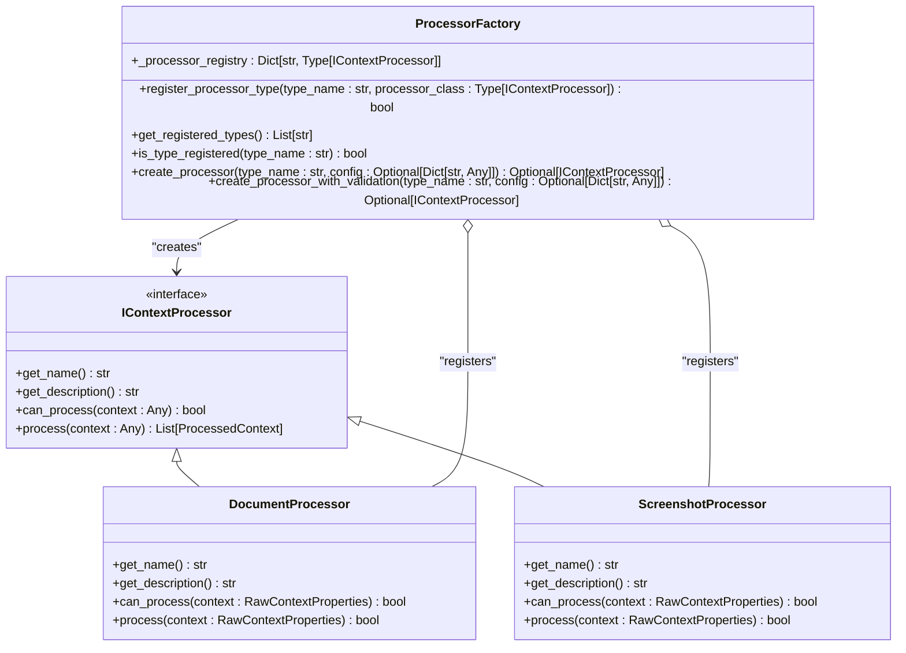
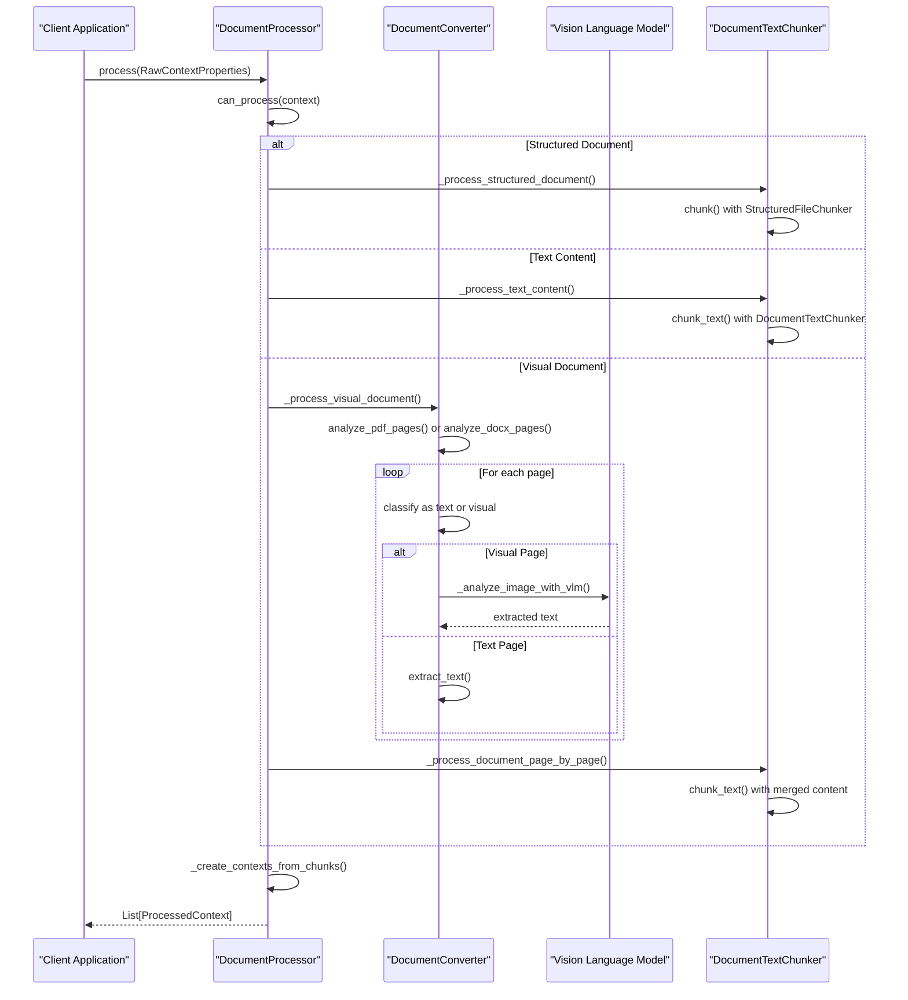
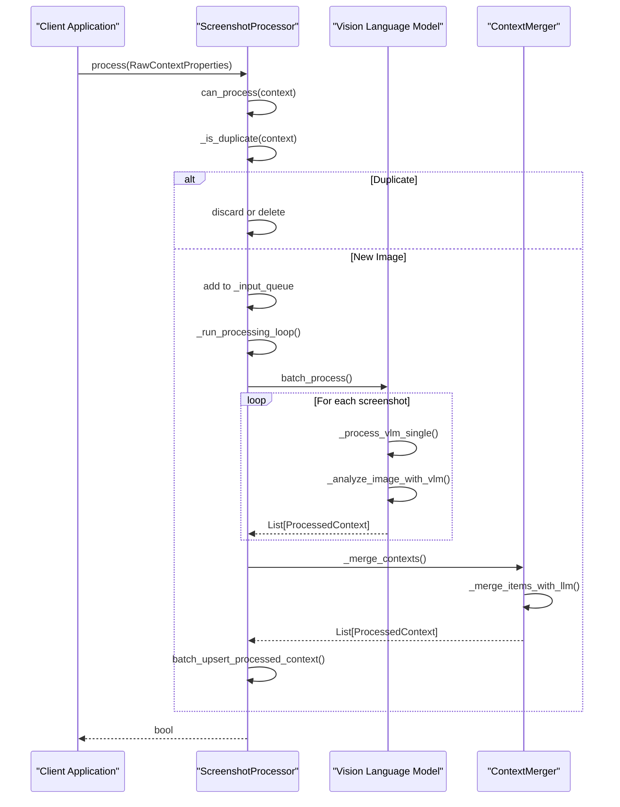
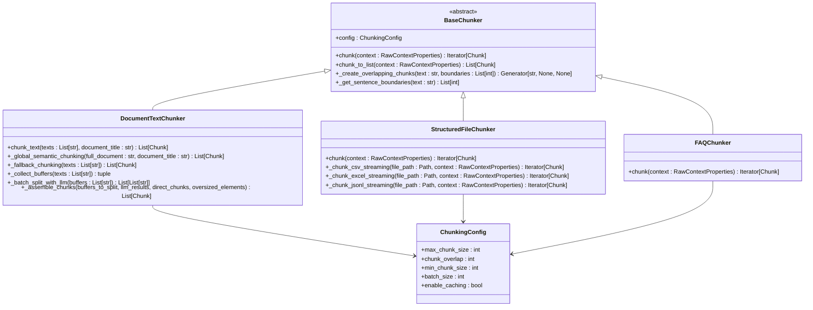
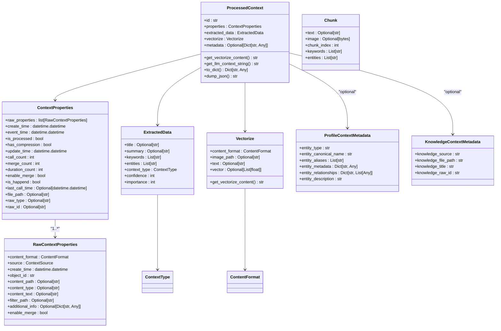
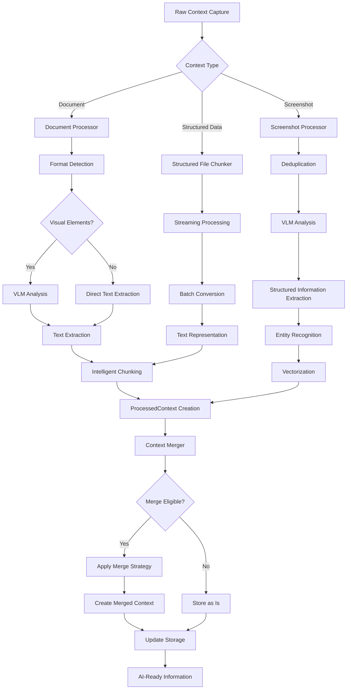

# Data Processing Pipeline

<cite>
**Referenced Files in This Document**   
- [processor_factory.py](file://opencontext/context_processing/processor/processor_factory.py)
- [document_processor.py](file://opencontext/context_processing/processor/document_processor.py)
- [screenshot_processor.py](file://opencontext/context_processing/processor/screenshot_processor.py)
- [chunkers.py](file://opencontext/context_processing/chunker/chunkers.py)
- [document_text_chunker.py](file://opencontext/context_processing/chunker/document_text_chunker.py)
- [context_merger.py](file://opencontext/context_processing/merger/context_merger.py)
- [merge_strategies.py](file://opencontext/context_processing/merger/merge_strategies.py)
- [base_processor.py](file://opencontext/context_processing/processor/base_processor.py)
- [context.py](file://opencontext/models/context.py)
- [document_converter.py](file://opencontext/context_processing/processor/document_converter.py)
- [example_document_processor.py](file://examples/example_document_processor.py)
- [example_screenshot_processor.py](file://examples/example_screenshot_processor.py)
</cite>

## Table of Contents
1. [Introduction](#introduction)
2. [Processor Factory Pattern](#processor-factory-pattern)
3. [Document Processing](#document-processing)
4. [Screenshot Processing](#screenshot-processing)
5. [Chunking Strategies](#chunking-strategies)
6. [Context Merging](#context-merging)
7. [Domain Models](#domain-models)
8. [Complete Processing Journey](#complete-processing-journey)
9. [Performance and Error Handling](#performance-and-error-handling)
10. [Conclusion](#conclusion)

## Introduction
The data processing pipeline transforms raw captured context into structured, AI-ready information through a series of specialized components. This system handles various context types including documents, screenshots, and structured data, processing them through dedicated processors that extract meaningful information, chunk large content, and merge related contexts. The pipeline is designed for extensibility and performance, using factory patterns to manage processor instances and sophisticated strategies to optimize processing based on content type. This documentation details the architecture and implementation of this pipeline, focusing on the key components that enable intelligent context processing.

## Processor Factory Pattern
The processor factory pattern implements the Factory design pattern to provide centralized creation and management of processor instances. This pattern enables type-safe processor registration and creation with automatic dependency injection and configuration management. The `ProcessorFactory` class maintains a registry of processor types and provides methods to register new processor types and create instances based on type names. This approach allows for extensible processor type registration while ensuring that all processors implement the required `IContextProcessor` interface.

The factory pattern supports backward compatibility through a global instance while providing methods for configuration validation during processor creation. When a processor is requested, the factory checks if the type is registered, validates the configuration if the processor supports it, and returns an instance. This design decouples processor creation from their usage, allowing the system to dynamically adapt to different processing requirements without modifying the core pipeline logic.

**Diagram sources**
- [processor_factory.py](file://opencontext/context_processing/processor/processor_factory.py#L31-L174)
- [base_processor.py](file://opencontext/context_processing/processor/base_processor.py#L23-L260)
- [document_processor.py](file://opencontext/context_processing/processor/document_processor.py#L41-L86)
- [screenshot_processor.py](file://opencontext/context_processing/processor/screenshot_processor.py#L47-L95)

**Section sources**
- [processor_factory.py](file://opencontext/context_processing/processor/processor_factory.py#L31-L174)

## Document Processing
The document processor handles various document formats including PDF, DOCX, XLSX, CSV, Markdown, images, and text files. It uses a sophisticated strategy to determine the optimal processing approach based on the document type and content characteristics. For visual documents like PDFs and DOCX files, the processor analyzes each page to determine if Vision Language Models (VLM) are needed, using direct text extraction for pure text pages and VLM for pages with charts or images.

The document processing workflow begins with format detection and classification into structured, text, or visual document types. Structured documents (CSV, XLSX, JSONL) are processed using specialized chunkers that handle large files efficiently through streaming and batching. Text content is processed using text chunkers with configurable parameters for chunk size and overlap. Visual documents undergo page-by-page analysis where the system determines whether to use direct text extraction or VLM-based parsing based on the presence of visual elements.

**Diagram sources**
- [document_processor.py](file://opencontext/context_processing/processor/document_processor.py#L41-L652)
- [document_converter.py](file://opencontext/context_processing/processor/document_converter.py#L46-L606)
- [document_text_chunker.py](file://opencontext/context_processing/chunker/document_text_chunker.py#L25-L348)

**Section sources**
- [document_processor.py](file://opencontext/context_processing/processor/document_processor.py#L41-L652)
- [document_converter.py](file://opencontext/context_processing/processor/document_converter.py#L46-L606)

## Screenshot Processing
The screenshot processor analyzes screenshot streams to extract context information while performing real-time deduplication. It uses perceptual hashing (pHash) to identify duplicate images and eliminate redundant processing. The processor operates on a background thread model, placing processing tasks in a queue and executing them in the background to ensure responsive performance. This approach allows the system to handle high volumes of screenshots efficiently while maintaining low latency.

The processing workflow begins with deduplication using pHash comparison. When a new screenshot is received, its pHash is calculated and compared against recently processed images. If a match is found within a configurable threshold, the image is considered a duplicate and discarded. Non-duplicate screenshots are added to a processing queue. The background processing loop periodically processes batches of screenshots, using Vision Language Models (VLM) to extract structured information from the visual content.

**Diagram sources**
- [screenshot_processor.py](file://opencontext/context_processing/processor/screenshot_processor.py#L47-L589)
- [context_merger.py](file://opencontext/context_processing/merger/context_merger.py#L35-L800)

**Section sources**
- [screenshot_processor.py](file://opencontext/context_processing/processor/screenshot_processor.py#L47-L589)

## Chunking Strategies
The chunking system implements multiple strategies to break large documents into manageable segments for AI processing. The core component is the `BaseChunker` abstract class, which provides memory-efficient chunking with configurable parameters for maximum chunk size, overlap, and minimum chunk size. Different specialized chunkers inherit from this base class to handle specific content types with optimized strategies.

For structured documents (CSV, XLSX, JSONL), the `StructuredFileChunker` uses streaming and batching to handle large files without loading everything into memory at once. It processes files in chunks, converting each batch to a text representation with metadata. For FAQ Excel files, the `FAQChunker` treats each Q&A pair as a separate chunk, preserving the question-answer relationship. The `DocumentTextChunker` is specifically designed for text extracted from VLM processing, using semantic boundary splitting based on paragraphs and sentences.

**Diagram sources**
- [chunkers.py](file://opencontext/context_processing/chunker/chunkers.py#L28-L438)
- [document_text_chunker.py](file://opencontext/context_processing/chunker/document_text_chunker.py#L25-L348)

**Section sources**
- [chunkers.py](file://opencontext/context_processing/chunker/chunkers.py#L28-L438)
- [document_text_chunker.py](file://opencontext/context_processing/chunker/document_text_chunker.py#L25-L348)

## Context Merging
The context merging system combines related context from different sources using intelligent strategies based on context type. The `ContextMerger` class serves as the central component, coordinating the merging process and applying type-specific strategies. It supports both similarity-based merging (for nearly identical contexts) and associative merging (for related contexts created within a time window). The system uses vector similarity queries to find potential merge candidates and applies context-aware strategies to determine merge eligibility.

Different context types have specialized merge strategies that understand their unique characteristics. For example, `ProfileContextStrategy` focuses on entity overlap and related skills for personal identity profiles, while `ActivityContextStrategy` considers time windows and behavioral patterns for activity records. The merging process can be executed multiple times, with each merge increasing the merge count and updating the context's properties. The system also supports periodic memory compression to consolidate related contexts and reduce storage overhead.

```mermaid
classDiagram
class ContextMerger {
+strategies : Dict[ContextType, ContextTypeAwareStrategy]
+find_merge_target(context : ProcessedContext) ProcessedContext
+merge_multiple(target : ProcessedContext, sources : List[ProcessedContext]) Optional[ProcessedContext]
+periodic_memory_compression(interval_seconds : int)
+_group_contexts_by_similarity(contexts : List[ProcessedContext], threshold : float) List[List[ProcessedContext]]
+_calculate_similarity(emb1 : List[float], emb2 : List[float]) float
}
class ContextTypeAwareStrategy {
<<abstract>>
+config : dict
+context_type : ContextType
+similarity_threshold : float
+retention_days : int
+max_merge_count : int
+can_merge(target : ProcessedContext, source : ProcessedContext) Tuple[bool, float]
+merge_contexts(target : ProcessedContext, sources : List[ProcessedContext]) Optional[ProcessedContext]
+calculate_forgetting_probability(context : ProcessedContext) float
+should_cleanup(context : ProcessedContext) bool
}
class ProfileContextStrategy {
+can_merge(target : ProcessedContext, source : ProcessedContext) Tuple[bool, float]
+merge_contexts(target : ProcessedContext, sources : List[ProcessedContext]) Optional[ProcessedContext]
+_merge_profile_titles(target : ProcessedContext, sources : List[ProcessedContext]) str
+_merge_profile_summaries(target : ProcessedContext, sources : List[ProcessedContext]) str
}
class ActivityContextStrategy {
+can_merge(target : ProcessedContext, source : ProcessedContext) Tuple[bool, float]
+merge_contexts(target : ProcessedContext, sources : List[ProcessedContext]) Optional[ProcessedContext]
+_merge_with_frequency(item_lists : List[List[str]]) List[str]
+_create_activity_sequence_summary(contexts : List[ProcessedContext]) str
}
class StateContextStrategy {
+can_merge(target : ProcessedContext, source : ProcessedContext) Tuple[bool, float]
+merge_contexts(target : ProcessedContext, sources : List[ProcessedContext]) Optional[ProcessedContext]
+_extract_state_trends(keyword_lists : List[List[str]]) List[str]
+_create_state_trend_summary(contexts : List[ProcessedContext]) str
}
class IntentContextStrategy {
+can_merge(target : ProcessedContext, source : ProcessedContext) Tuple[bool, float]
+merge_contexts(target : ProcessedContext, sources : List[ProcessedContext]) Optional[ProcessedContext]
+_merge_intent_entities(entity_lists : List[List[str]]) List[str]
+_merge_intent_keywords(keyword_lists : List[List[str]]) List[str]
+_create_integrated_intent_title(contexts : List[ProcessedContext]) str
+_create_integrated_intent_summary(contexts : List[ProcessedContext]) str
}
ContextMerger --> ContextTypeAwareStrategy : "uses"
ContextTypeAwareStrategy <|-- ProfileContextStrategy
ContextTypeAwareStrategy <|-- ActivityContextStrategy
ContextTypeAwareStrategy <|-- StateContextStrategy
ContextTypeAwareStrategy <|-- IntentContextStrategy
ContextMerger --> ProfileContextStrategy : "initializes"
ContextMerger --> ActivityContextStrategy : "initializes"
ContextMerger --> StateContextStrategy : "initializes"
ContextMerger --> IntentContextStrategy : "initializes"
```

**Diagram sources**
- [context_merger.py](file://opencontext/context_processing/merger/context_merger.py#L35-L800)
- [merge_strategies.py](file://opencontext/context_processing/merger/merge_strategies.py#L24-L800)

**Section sources**
- [context_merger.py](file://opencontext/context_processing/merger/context_merger.py#L35-L800)
- [merge_strategies.py](file://opencontext/context_processing/merger/merge_strategies.py#L24-L800)

## Domain Models
The domain models define the core data structures used throughout the data processing pipeline. The `ProcessedContext` class represents the final output of the processing pipeline, containing extracted information, properties, and vectorization data. It is built from `RawContextProperties` which capture the original context source, format, and metadata. The `ExtractedData` class contains the structured information extracted from raw content, including title, summary, keywords, entities, and context type.

The `ContextProperties` class manages metadata about the context's lifecycle, including creation and update times, merge count, and duration count. The `Vectorize` class handles the vectorization of content for similarity searches and retrieval. These models use Pydantic for data validation and serialization, ensuring data integrity throughout the pipeline. The models are designed to be extensible, with metadata fields that can store additional structured information specific to different context types.

**Diagram sources**
- [context.py](file://opencontext/models/context.py#L24-L342)

**Section sources**
- [context.py](file://opencontext/models/context.py#L24-L342)

## Complete Processing Journey
The complete processing journey from raw capture to merged context involves multiple stages coordinated by the data processing pipeline. The journey begins when a raw context is captured and represented as a `RawContextProperties` object with metadata about its source, format, and creation time. This raw context is then routed to the appropriate processor through the `ProcessorFactory`, which determines the specialized processor based on the context type.

For document processing, the journey involves format detection, content extraction, and intelligent chunking. The document processor analyzes the document structure, determines which pages require VLM processing, and extracts text from both text and visual elements. The extracted content is then chunked using semantic boundaries and converted into `ProcessedContext` objects. For screenshot processing, the journey includes deduplication, VLM analysis to extract structured information, and context creation with entity extraction and vectorization.

The final stage of the journey is context merging, where related contexts are combined to create more comprehensive representations. The context merger identifies potential merge targets using vector similarity and applies type-specific strategies to determine merge eligibility. Successfully merged contexts are updated with consolidated information, and the original source contexts are marked for deletion. This end-to-end journey transforms raw, unstructured content into AI-ready information that can be effectively used for retrieval, analysis, and generation tasks.

**Diagram sources**
- [processor_factory.py](file://opencontext/context_processing/processor/processor_factory.py#L31-L174)
- [document_processor.py](file://opencontext/context_processing/processor/document_processor.py#L41-L652)
- [screenshot_processor.py](file://opencontext/context_processing/processor/screenshot_processor.py#L47-L589)
- [chunkers.py](file://opencontext/context_processing/chunker/chunkers.py#L28-L438)
- [context_merger.py](file://opencontext/context_processing/merger/context_merger.py#L35-L800)

**Section sources**
- [example_document_processor.py](file://examples/example_document_processor.py#L37-L236)
- [example_screenshot_processor.py](file://examples/example_screenshot_processor.py#L29-L180)

## Performance and Error Handling
The data processing pipeline incorporates several performance optimizations and robust error handling mechanisms to ensure reliable operation with large files and complex processing tasks. For large file processing, the system uses streaming and batching strategies to minimize memory usage. Structured file chunkers process files in batches rather than loading entire files into memory, while document text chunkers use asynchronous processing to handle VLM calls efficiently.

Error handling is implemented at multiple levels throughout the pipeline. Each processor includes comprehensive exception handling with logging to capture processing errors while preventing them from disrupting the overall workflow. The system uses configurable timeouts and retry mechanisms for external service calls, particularly for VLM and embedding services. Performance metrics are recorded for each processing operation, including duration, context count, and error rates, enabling monitoring and optimization.

The pipeline also implements graceful shutdown procedures that allow background processing tasks to complete before termination. This ensures that partially processed contexts are not lost and that resources are properly cleaned up. For format conversion errors, the system provides detailed error messages and fallback strategies, such as mechanical splitting when LLM-based chunking fails. These performance and error handling features work together to create a robust processing pipeline capable of handling diverse input types and volumes reliably.

**Section sources**
- [document_processor.py](file://opencontext/context_processing/processor/document_processor.py#L41-L652)
- [screenshot_processor.py](file://opencontext/context_processing/processor/screenshot_processor.py#L47-L589)
- [chunkers.py](file://opencontext/context_processing/chunker/chunkers.py#L28-L438)

## Conclusion
The data processing pipeline effectively transforms raw captured context into structured, AI-ready information through a sophisticated architecture of specialized processors, intelligent chunking strategies, and context-aware merging. The processor factory pattern enables flexible routing of different context types to appropriate specialized processors, while the domain models provide a consistent representation of processed information. The system handles both document and screenshot processing with optimized strategies that balance accuracy and performance.

Key strengths of the pipeline include its extensible design, memory-efficient processing of large files, and intelligent context merging that creates comprehensive representations from related information. The implementation demonstrates careful attention to performance considerations and robust error handling, ensuring reliable operation in production environments. By combining rule-based processing with AI-powered analysis, the pipeline effectively bridges the gap between raw content and structured data suitable for AI applications.