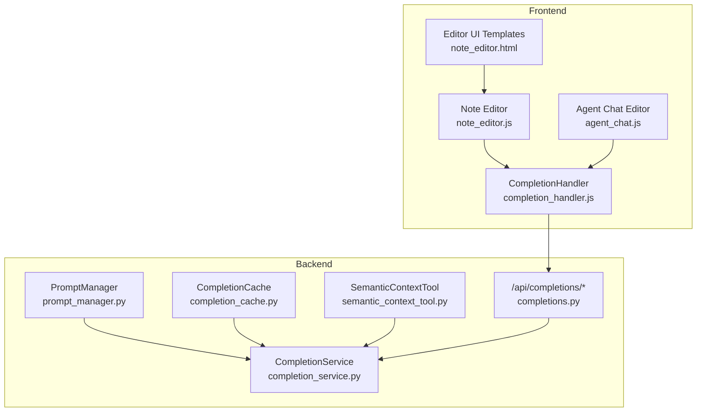
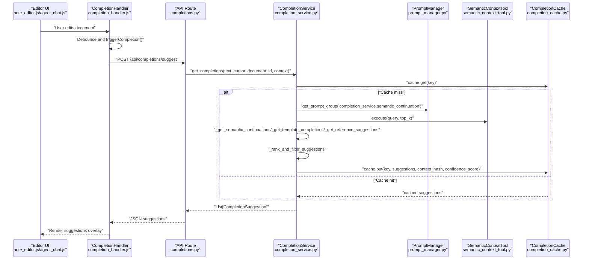
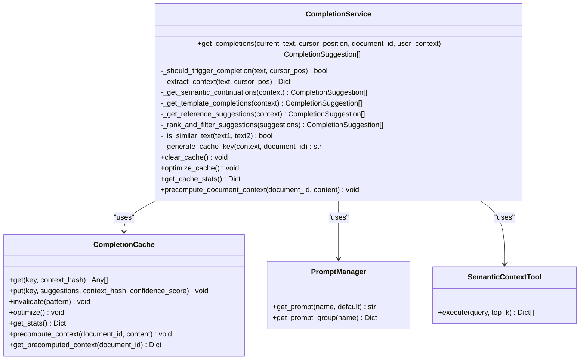
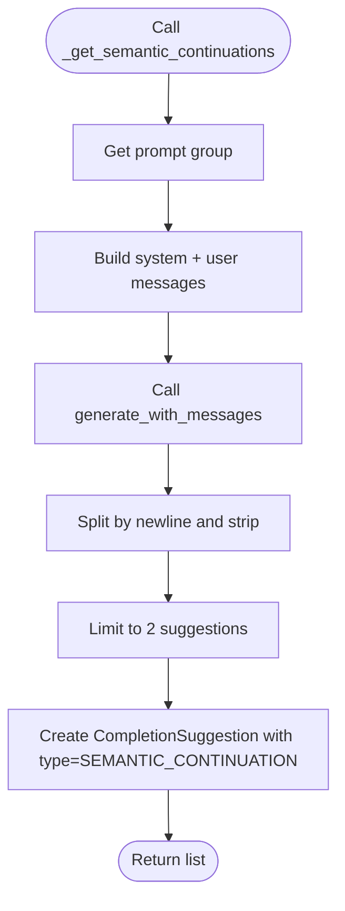
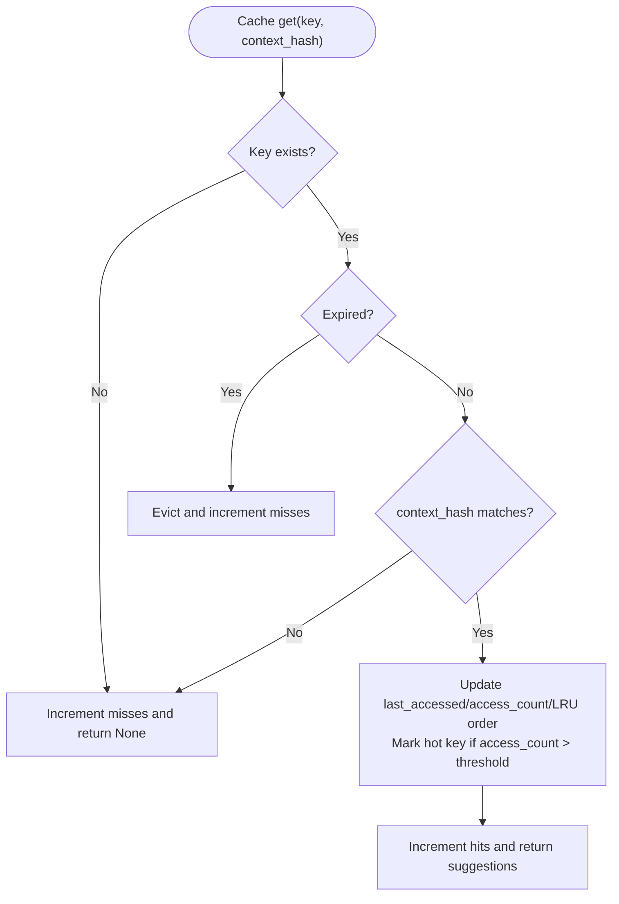
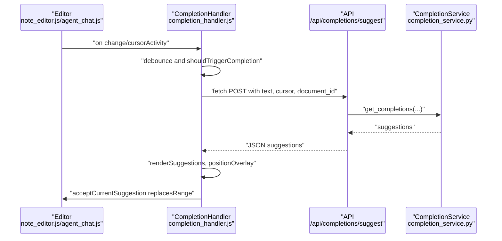
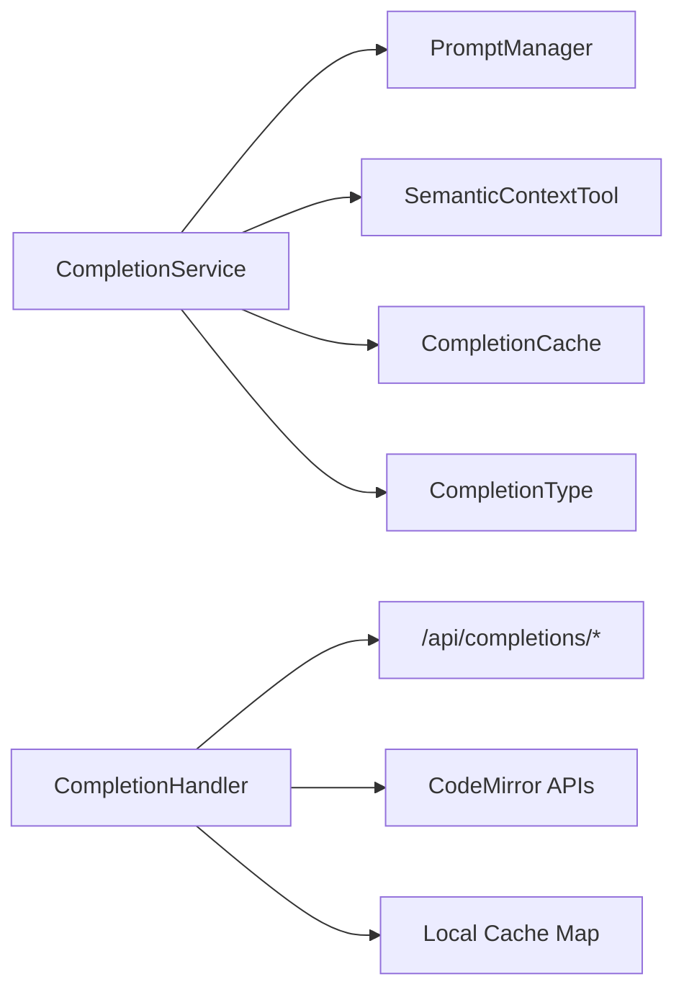

# Completion Service Intelligence

<cite>
**Referenced Files in This Document**
- [completion_service.py](file://opencontext/context_consumption/completion/completion_service.py)
- [completion_cache.py](file://opencontext/context_consumption/completion/completion_cache.py)
- [completions.py](file://opencontext/server/routes/completions.py)
- [prompt_manager.py](file://opencontext/config/prompt_manager.py)
- [prompts_en.yaml](file://config/prompts_en.yaml)
- [semantic_context_tool.py](file://opencontext/tools/retrieval_tools/semantic_context_tool.py)
- [enums.py](file://opencontext/models/enums.py)
- [completion_handler.js](file://opencontext/web/static/js/completion_handler.js)
- [note_editor.js](file://opencontext/web/static/js/note_editor.js)
- [agent_chat.js](file://opencontext/web/static/js/agent_chat.js)
- [note_editor.html](file://opencontext/web/templates/note_editor.html)
</cite>

## Table of Contents
1. [Introduction](#introduction)
2. [Project Structure](#project-structure)
3. [Core Components](#core-components)
4. [Architecture Overview](#architecture-overview)
5. [Detailed Component Analysis](#detailed-component-analysis)
6. [Dependency Analysis](#dependency-analysis)
7. [Performance Considerations](#performance-considerations)
8. [Troubleshooting Guide](#troubleshooting-guide)
9. [Conclusion](#conclusion)
10. [Appendices](#appendices)

## Introduction
This document explains the CompletionService class that powers intelligent content completion during document editing. It focuses on how the service orchestrates multiple suggestion types—semantic continuations, template completions, and reference suggestions—while integrating with the editor UI and backend API. It also covers the caching mechanism, confidence scoring, and performance considerations for real-time suggestions.

## Project Structure
The completion intelligence spans backend Python services, frontend JavaScript handlers, and configuration files:
- Backend orchestration and caching live under opencontext/context_consumption/completion.
- The HTTP API route exposes completion endpoints.
- Prompt management and retrieval tools support semantic suggestions.
- Frontend editors and completion overlays integrate with the backend.

**Diagram sources**
- [completion_service.py](file://opencontext/context_consumption/completion/completion_service.py#L56-L158)
- [completion_cache.py](file://opencontext/context_consumption/completion/completion_cache.py#L45-L164)
- [prompt_manager.py](file://opencontext/config/prompt_manager.py#L17-L49)
- [semantic_context_tool.py](file://opencontext/tools/retrieval_tools/semantic_context_tool.py#L15-L30)
- [completions.py](file://opencontext/server/routes/completions.py#L69-L103)
- [completion_handler.js](file://opencontext/web/static/js/completion_handler.js#L1-L120)
- [note_editor.js](file://opencontext/web/static/js/note_editor.js#L338-L355)
- [agent_chat.js](file://opencontext/web/static/js/agent_chat.js#L1143-L1170)
- [note_editor.html](file://opencontext/web/templates/note_editor.html#L41-L88)

**Section sources**
- [completion_service.py](file://opencontext/context_consumption/completion/completion_service.py#L56-L158)
- [completion_cache.py](file://opencontext/context_consumption/completion/completion_cache.py#L45-L164)
- [completions.py](file://opencontext/server/routes/completions.py#L69-L103)
- [completion_handler.js](file://opencontext/web/static/js/completion_handler.js#L1-L120)
- [note_editor.js](file://opencontext/web/static/js/note_editor.js#L338-L355)
- [agent_chat.js](file://opencontext/web/static/js/agent_chat.js#L1143-L1170)
- [note_editor.html](file://opencontext/web/templates/note_editor.html#L41-L88)

## Core Components
- CompletionService: Orchestrates suggestion generation, ranking, and caching.
- CompletionCache: Manages cache entries with TTL/LRU/Hybrid strategies, hot keys, and statistics.
- PromptManager and prompts_en.yaml: Provide LLM prompts for semantic continuation.
- SemanticContextTool: Performs semantic search for reference suggestions.
- Frontend CompletionHandler: Integrates with editors, triggers requests, displays suggestions, and manages local cache.
- API route completions.py: Validates inputs, invokes CompletionService, filters and limits suggestions, and returns JSON.

**Section sources**
- [completion_service.py](file://opencontext/context_consumption/completion/completion_service.py#L56-L158)
- [completion_cache.py](file://opencontext/context_consumption/completion/completion_cache.py#L45-L164)
- [prompt_manager.py](file://opencontext/config/prompt_manager.py#L17-L49)
- [prompts_en.yaml](file://config/prompts_en.yaml#L1-L200)
- [semantic_context_tool.py](file://opencontext/tools/retrieval_tools/semantic_context_tool.py#L15-L30)
- [completion_handler.js](file://opencontext/web/static/js/completion_handler.js#L1-L120)
- [completions.py](file://opencontext/server/routes/completions.py#L69-L103)

## Architecture Overview
The system follows a layered design:
- Frontend editors detect user input and trigger completion requests.
- The API validates parameters and delegates to CompletionService.
- CompletionService extracts context, generates suggestions from multiple sources, ranks and deduplicates, caches results, and returns them.
- Frontend renders suggestions and applies user selections.

**Diagram sources**
- [note_editor.js](file://opencontext/web/static/js/note_editor.js#L338-L355)
- [agent_chat.js](file://opencontext/web/static/js/agent_chat.js#L1143-L1170)
- [completion_handler.js](file://opencontext/web/static/js/completion_handler.js#L80-L156)
- [completions.py](file://opencontext/server/routes/completions.py#L69-L103)
- [completion_service.py](file://opencontext/context_consumption/completion/completion_service.py#L92-L158)
- [prompt_manager.py](file://opencontext/config/prompt_manager.py#L17-L49)
- [semantic_context_tool.py](file://opencontext/tools/retrieval_tools/semantic_context_tool.py#L15-L30)
- [completion_cache.py](file://opencontext/context_consumption/completion/completion_cache.py#L83-L164)

## Detailed Component Analysis

### CompletionService
Responsibilities:
- Orchestrate multiple suggestion types: semantic continuations, template completions, and reference suggestions.
- Extract contextual information around the cursor.
- Generate cache keys and manage caching.
- Rank and deduplicate suggestions.
- Provide confidence scores and metadata.

Key methods and behaviors:
- get_completions: Main entrypoint that checks trigger conditions, extracts context, checks cache, generates suggestions, ranks/filter, and caches results.
- _should_trigger_completion: Guards against premature triggers (min length, whitespace, mid-word).
- _extract_context: Builds before/after text, current line/paragraph, and structure info (heading level, list, code block).
- _get_semantic_continuations: Uses PromptManager to fetch a prompt group and LLM client to generate continuation candidates.
- _get_template_completions: Generates structural completions (subheadings, list continuation, fenced code blocks).
- _get_reference_suggestions: Uses SemanticContextTool to retrieve semantically similar content and converts results into suggestions with confidence derived from similarity.
- _rank_and_filter_suggestions: Sorts by confidence, deduplicates by text similarity, and caps number of suggestions.
- _is_similar_text: Computes similarity using word sets.
- _generate_cache_key: Creates a deterministic key from recent context, current line, and document id.
- clear_cache/optimize_cache/get_cache_stats: Utilities for cache maintenance.

**Diagram sources**
- [completion_service.py](file://opencontext/context_consumption/completion/completion_service.py#L56-L481)
- [completion_cache.py](file://opencontext/context_consumption/completion/completion_cache.py#L45-L399)
- [prompt_manager.py](file://opencontext/config/prompt_manager.py#L17-L49)
- [semantic_context_tool.py](file://opencontext/tools/retrieval_tools/semantic_context_tool.py#L15-L30)

**Section sources**
- [completion_service.py](file://opencontext/context_consumption/completion/completion_service.py#L92-L481)
- [enums.py](file://opencontext/models/enums.py#L360-L366)

### Semantic Continuations
- Uses PromptManager to fetch a prompt group keyed by “completion_service.semantic_continuation”.
- Constructs a system prompt and a user prompt embedding the context_before and current_line.
- Calls the LLM client to generate continuation candidates.
- Parses newline-separated suggestions and creates CompletionSuggestion instances with a fixed confidence.

**Diagram sources**
- [completion_service.py](file://opencontext/context_consumption/completion/completion_service.py#L243-L294)
- [prompt_manager.py](file://opencontext/config/prompt_manager.py#L17-L49)
- [prompts_en.yaml](file://config/prompts_en.yaml#L1-L200)

**Section sources**
- [completion_service.py](file://opencontext/context_consumption/completion/completion_service.py#L243-L294)
- [prompt_manager.py](file://opencontext/config/prompt_manager.py#L17-L49)
- [prompts_en.yaml](file://config/prompts_en.yaml#L1-L200)

### Template Completions
- Inspects the current line and structure to suggest structural elements:
  - Subheadings when inside a heading.
  - List continuation when inside a bullet or numbered list.
  - Fenced code block starter when the line equals a fence marker.

Confidence values are set per suggestion type to reflect structural certainty.

**Section sources**
- [completion_service.py](file://opencontext/context_consumption/completion/completion_service.py#L296-L351)

### Reference Suggestions
- Uses SemanticContextTool to perform semantic search on context_before.
- Filters results by similarity threshold and converts top sentences into suggestions.
- Populates context_used metadata with source descriptions when available.

**Section sources**
- [completion_service.py](file://opencontext/context_consumption/completion/completion_service.py#L352-L406)
- [semantic_context_tool.py](file://opencontext/tools/retrieval_tools/semantic_context_tool.py#L15-L30)

### Ranking, Deduplication, and Confidence Scoring
- Suggestions are sorted by confidence descending.
- Deduplication compares candidate texts using a word-set similarity threshold.
- The maximum number of suggestions is capped by configuration.

**Section sources**
- [completion_service.py](file://opencontext/context_consumption/completion/completion_service.py#L408-L450)

### Caching Mechanism and Optimization
- Cache key generation: MD5 of a compact context snapshot (last N characters of context_before, current_line, document_id).
- Cache entry fields: suggestions, timestamps, access counters, confidence_score, context_hash.
- Strategies:
  - TTL-based eviction.
  - LRU-based eviction with hot-key protection.
  - Hybrid strategy combining TTL and confidence-based eviction.
- Optimization routines:
  - Periodic cleanup of expired entries.
  - Hot-key maintenance and access-order compaction.
  - Cleanup of stale precomputed contexts.

**Diagram sources**
- [completion_cache.py](file://opencontext/context_consumption/completion/completion_cache.py#L83-L164)
- [completion_cache.py](file://opencontext/context_consumption/completion/completion_cache.py#L182-L221)
- [completion_cache.py](file://opencontext/context_consumption/completion/completion_cache.py#L277-L314)

**Section sources**
- [completion_cache.py](file://opencontext/context_consumption/completion/completion_cache.py#L45-L399)
- [completion_service.py](file://opencontext/context_consumption/completion/completion_service.py#L451-L463)

### Editor UI Integration
- The editor detects changes and triggers completion after a configurable delay.
- The CompletionHandler builds request payloads, sends them to the backend, and renders suggestions in an overlay positioned near the cursor.
- Users can accept suggestions, navigate with keyboard, and provide feedback.

**Diagram sources**
- [note_editor.js](file://opencontext/web/static/js/note_editor.js#L338-L355)
- [agent_chat.js](file://opencontext/web/static/js/agent_chat.js#L1143-L1170)
- [completion_handler.js](file://opencontext/web/static/js/completion_handler.js#L80-L258)
- [completions.py](file://opencontext/server/routes/completions.py#L69-L103)
- [completion_service.py](file://opencontext/context_consumption/completion/completion_service.py#L92-L158)

**Section sources**
- [note_editor.js](file://opencontext/web/static/js/note_editor.js#L338-L355)
- [agent_chat.js](file://opencontext/web/static/js/agent_chat.js#L1143-L1170)
- [completion_handler.js](file://opencontext/web/static/js/completion_handler.js#L1-L200)
- [note_editor.html](file://opencontext/web/templates/note_editor.html#L41-L88)

## Dependency Analysis
- CompletionService depends on:
  - PromptManager for LLM prompts.
  - SemanticContextTool for vector-based semantic search.
  - CompletionCache for caching and statistics.
  - CompletionType enum for suggestion categorization.
- Frontend CompletionHandler depends on:
  - Editor APIs to read content and cursor position.
  - Fetch API to communicate with the backend.
  - Local cache for short-term request deduplication.

**Diagram sources**
- [completion_service.py](file://opencontext/context_consumption/completion/completion_service.py#L56-L158)
- [enums.py](file://opencontext/models/enums.py#L360-L366)
- [completion_handler.js](file://opencontext/web/static/js/completion_handler.js#L1-L120)

**Section sources**
- [completion_service.py](file://opencontext/context_consumption/completion/completion_service.py#L56-L158)
- [enums.py](file://opencontext/models/enums.py#L360-L366)
- [completion_handler.js](file://opencontext/web/static/js/completion_handler.js#L1-L120)

## Performance Considerations
- Real-time responsiveness:
  - Debounce user input in the frontend to reduce request volume.
  - Use cache keys that minimize hashing overhead while capturing meaningful context.
  - Limit max_suggestions to keep rendering lightweight.
- Backend latency:
  - Use TTL/LRU/Hybrid cache strategies to balance freshness and throughput.
  - Hot-key protection prevents frequent eviction of frequently used contexts.
  - Confidence-based eviction ensures low-quality suggestions are pruned.
- Prompt and tool costs:
  - PromptManager loads prompts from YAML; ensure prompt groups are concise.
  - Semantic search should be bounded (top_k) and filtered by similarity threshold.
- Frontend UX:
  - Overlay positioning avoids overflow; hide on scroll/resize.
  - Feedback loop helps improve future suggestions.

[No sources needed since this section provides general guidance]

## Troubleshooting Guide
Common issues and remedies:
- No suggestions appear:
  - Verify trigger conditions: cursor position meets min length and is not mid-word or trailing whitespace.
  - Check that the API endpoint receives valid text and cursor position.
- Suggestions are outdated:
  - Ensure document modification timestamps are compared to prevent applying stale suggestions.
  - Clear cache if content changed significantly.
- Slow responses:
  - Reduce max_suggestions and adjust debounce delay.
  - Use cache optimization to clean expired entries and hot-keys.
- Semantic continuation failures:
  - Confirm prompt group exists and LLM client is initialized.
  - Validate that the prompt YAML is present and readable.

**Section sources**
- [completion_service.py](file://opencontext/context_consumption/completion/completion_service.py#L159-L204)
- [completions.py](file://opencontext/server/routes/completions.py#L69-L103)
- [completion_handler.js](file://opencontext/web/static/js/completion_handler.js#L118-L156)
- [completion_cache.py](file://opencontext/context_consumption/completion/completion_cache.py#L277-L314)

## Conclusion
The CompletionService provides a robust, multi-modal completion pipeline that combines LLM-driven semantic continuations, structural template completions, and vector-search-based reference suggestions. Its caching layer and confidence scoring ensure responsive, high-quality suggestions in real-time editing scenarios. The frontend integration offers a smooth user experience with debounced triggers, overlay rendering, and feedback collection.

[No sources needed since this section summarizes without analyzing specific files]

## Appendices

### API Contract for Completion Requests
- Endpoint: POST /api/completions/suggest
- Request fields:
  - text: string, required
  - cursor_position: integer, required
  - document_id: integer, optional
  - max_suggestions: integer, optional
  - completion_types: list of strings, optional (filters by CompletionType values)
  - context: object, optional (includes current_line, line_number, char_position)
- Response fields:
  - success: boolean
  - suggestions: array of CompletionSuggestion objects
  - processing_time_ms: number (optional)

**Section sources**
- [completions.py](file://opencontext/server/routes/completions.py#L69-L103)
- [completion_service.py](file://opencontext/context_consumption/completion/completion_service.py#L92-L158)
- [enums.py](file://opencontext/models/enums.py#L360-L366)