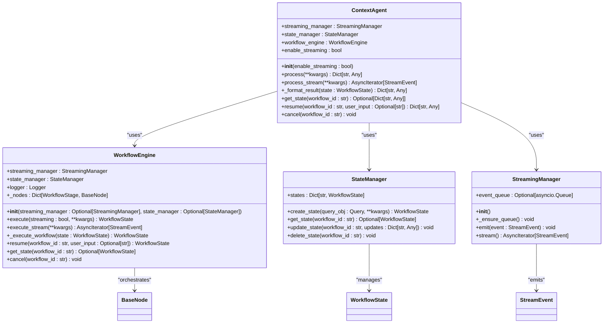
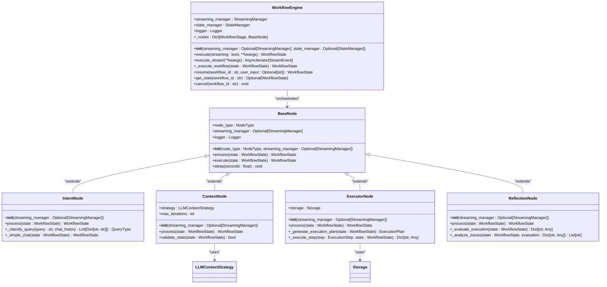
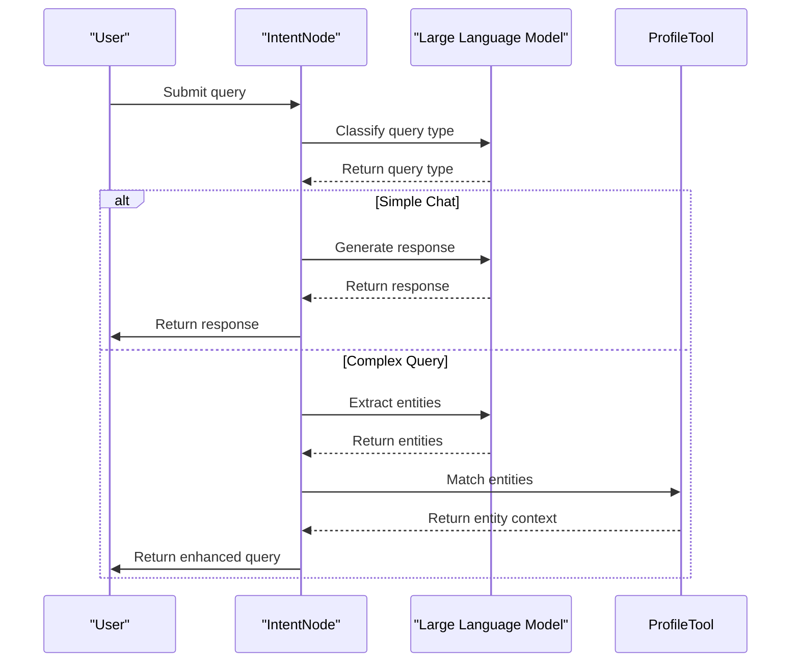
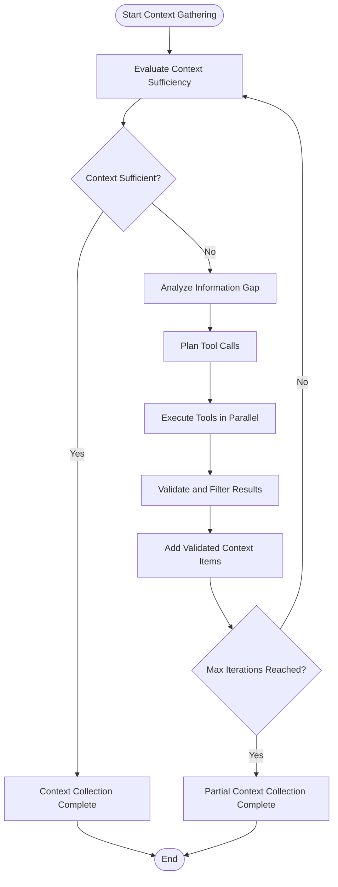
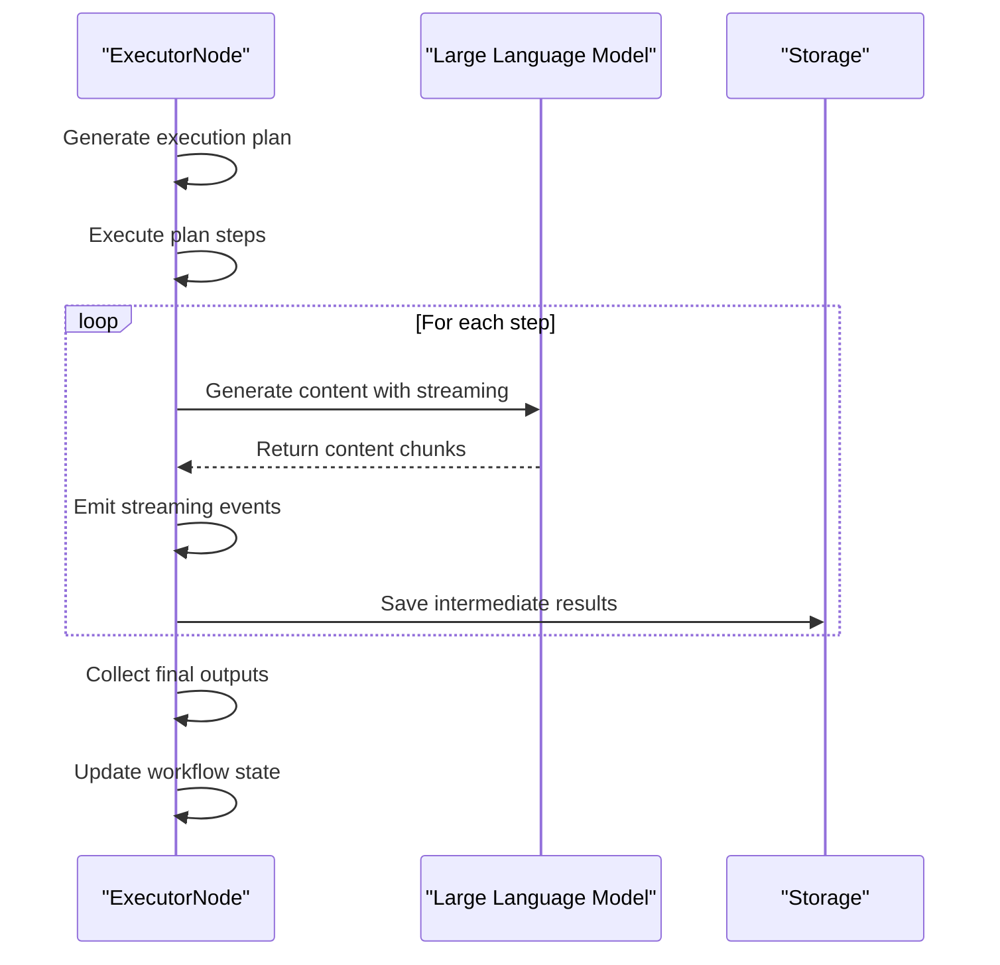
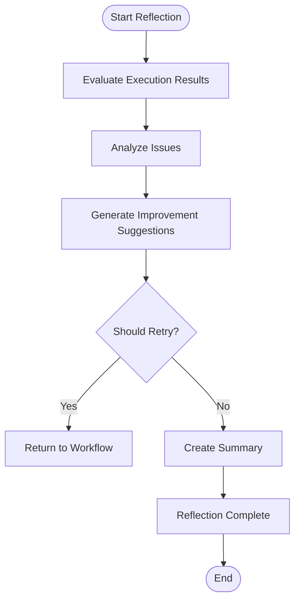
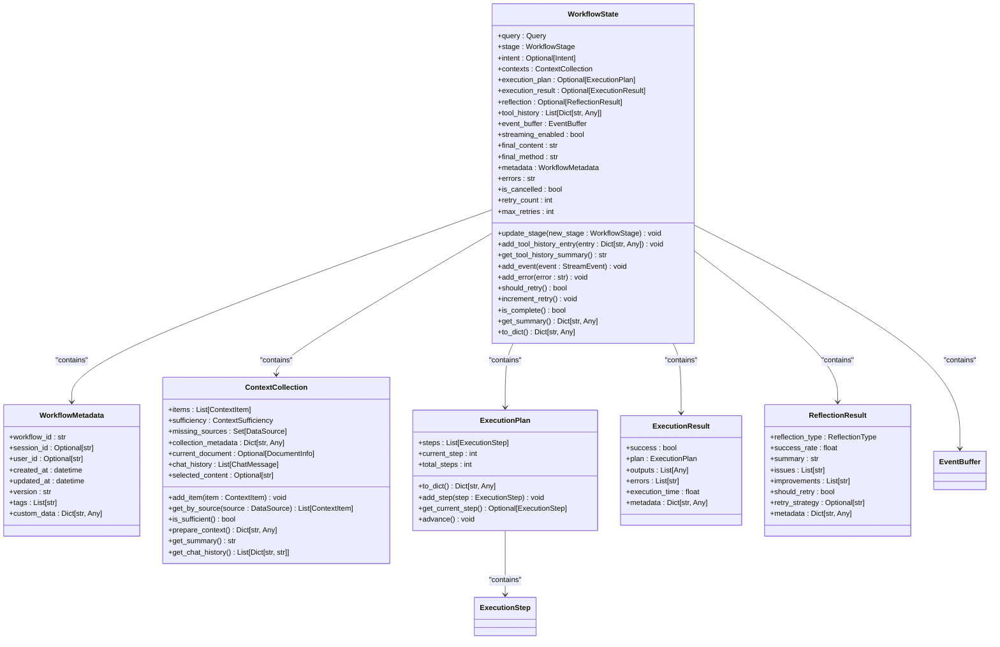
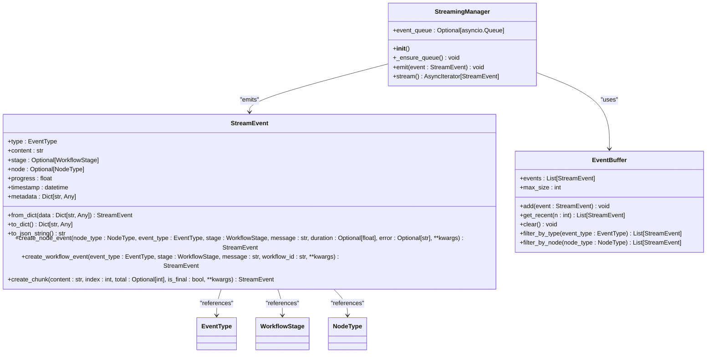
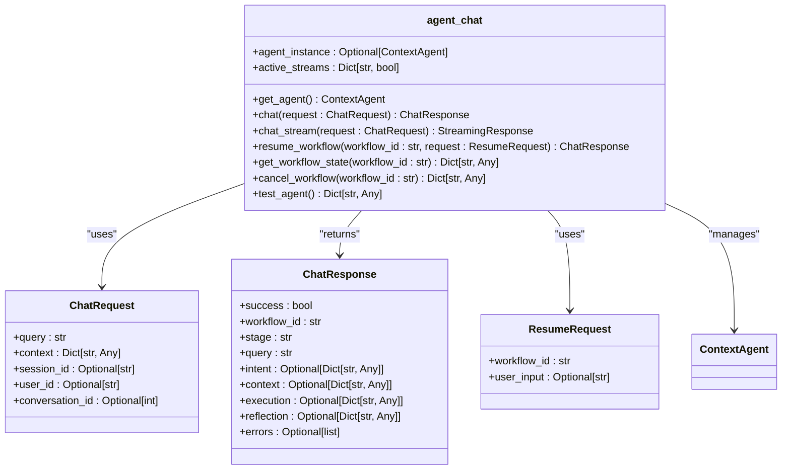
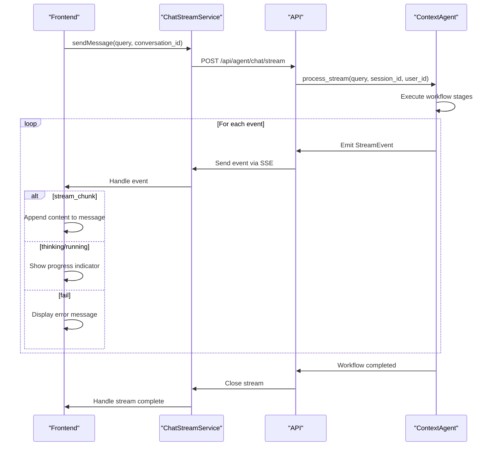

# Context Agent Orchestration

<cite>
**Referenced Files in This Document**   
- [opencontext/context_consumption/context_agent/agent.py](file://opencontext/context_consumption/context_agent/agent.py)
- [opencontext/context_consumption/context_agent/core/workflow.py](file://opencontext/context_consumption/context_agent/core/workflow.py)
- [opencontext/context_consumption/context_agent/core/state.py](file://opencontext/context_consumption/context_agent/core/state.py)
- [opencontext/context_consumption/context_agent/nodes/intent.py](file://opencontext/context_consumption/context_agent/nodes/intent.py)
- [opencontext/context_consumption/context_agent/nodes/context.py](file://opencontext/context_consumption/context_agent/nodes/context.py)
- [opencontext/context_consumption/context_agent/nodes/executor.py](file://opencontext/context_consumption/context_agent/nodes/executor.py)
- [opencontext/context_consumption/context_agent/nodes/reflection.py](file://opencontext/context_consumption/context_agent/nodes/reflection.py)
- [opencontext/context_consumption/context_agent/models/schemas.py](file://opencontext/context_consumption/context_agent/models/schemas.py)
- [opencontext/context_consumption/context_agent/core/streaming.py](file://opencontext/context_consumption/context_agent/core/streaming.py)
- [opencontext/context_consumption/context_agent/models/events.py](file://opencontext/context_consumption/context_agent/models/events.py)
- [opencontext/context_consumption/context_agent/core/llm_context_strategy.py](file://opencontext/context_consumption/context_agent/core/llm_context_strategy.py)
- [opencontext/server/routes/agent_chat.py](file://opencontext/server/routes/agent_chat.py)
- [frontend/src/renderer/src/hooks/use-chat-stream.ts](file://frontend/src/renderer/src/hooks/use-chat-stream.ts)
</cite>

## Table of Contents
1. [Introduction](#introduction)
2. [Core Components](#core-components)
3. [Workflow Engine Architecture](#workflow-engine-architecture)
4. [Workflow Stages](#workflow-stages)
5. [State Management](#state-management)
6. [Streaming and Event Handling](#streaming-and-event-handling)
7. [API Integration](#api-integration)
8. [Error Handling](#error-handling)
9. [Frontend Interaction](#frontend-interaction)
10. [Conclusion](#conclusion)

## Introduction

The Context Agent is a sophisticated AI workflow orchestration system designed to process user queries through a structured, multi-stage workflow with support for both synchronous and asynchronous execution. The agent implements a comprehensive workflow engine that manages the entire lifecycle of query processing, from initial intent analysis through context retrieval, execution, and reflection. This documentation provides a detailed analysis of the ContextAgent class and its associated components, focusing on its architecture, workflow stages, state management, streaming capabilities, and integration with frontend components.

**Section sources**
- [opencontext/context_consumption/context_agent/agent.py](file://opencontext/context_consumption/context_agent/agent.py#L1-L165)

## Core Components

The Context Agent system is built around several core components that work together to orchestrate AI workflows. At the heart of the system is the ContextAgent class, which serves as the main entry point for processing user queries. The agent coordinates with a WorkflowEngine that manages the execution flow, a StateManager that maintains workflow state, and a StreamingManager that handles real-time event streaming. The system is designed with a modular architecture where each workflow stage is implemented as a specialized node that inherits from a common BaseNode class.

The ContextAgent class provides two primary methods for processing queries: `process` for synchronous execution and `process_stream` for asynchronous, streaming execution. These methods delegate to the WorkflowEngine, which orchestrates the execution of various workflow stages. The agent also provides workflow management capabilities through `resume` and `cancel` methods, allowing for the continuation or termination of ongoing workflows. The `_format_result` method is responsible for structuring the output with success status, workflow ID, stage information, and detailed results from each workflow stage.

**Diagram sources**
- [opencontext/context_consumption/context_agent/agent.py](file://opencontext/context_consumption/context_agent/agent.py#L21-L125)
- [opencontext/context_consumption/context_agent/core/workflow.py](file://opencontext/context_consumption/context_agent/core/workflow.py#L22-L208)
- [opencontext/context_consumption/context_agent/core/state.py](file://opencontext/context_consumption/context_agent/core/state.py#L211-L278)
- [opencontext/context_consumption/context_agent/core/streaming.py](file://opencontext/context_consumption/context_agent/core/streaming.py#L16-L46)

**Section sources**
- [opencontext/context_consumption/context_agent/agent.py](file://opencontext/context_consumption/context_agent/agent.py#L21-L125)
- [opencontext/context_consumption/context_agent/core/workflow.py](file://opencontext/context_consumption/context_agent/core/workflow.py#L22-L208)
- [opencontext/context_consumption/context_agent/core/state.py](file://opencontext/context_consumption/context_agent/core/state.py#L211-L278)
- [opencontext/context_consumption/context_agent/core/streaming.py](file://opencontext/context_consumption/context_agent/core/streaming.py#L16-L46)

## Workflow Engine Architecture

The WorkflowEngine is the central orchestrator of the Context Agent system, responsible for managing the execution flow across multiple stages. The engine implements a state-driven workflow that progresses through distinct phases: intent analysis, context gathering, execution, and reflection. Each stage is implemented as a specialized node that inherits from the BaseNode class, allowing for consistent interface and behavior across different workflow components.

The engine follows a modular design where nodes are lazily initialized upon first use, reducing startup overhead and memory usage. The `_init_nodes` method creates instances of the four primary workflow nodes: IntentNode, ContextNode, ExecutorNode, and ReflectionNode. Each node is responsible for a specific aspect of query processing and communicates through a shared WorkflowState object that maintains the current state of the workflow.

The execute method serves as the main entry point for synchronous workflow execution, while execute_stream provides asynchronous, streaming capabilities. Both methods delegate to the `_execute_workflow` method, which implements the core workflow logic as a sequential process that can be interrupted or resumed as needed. The engine also provides workflow management capabilities through the resume, get_state, and cancel methods, enabling external control over ongoing workflows.

**Diagram sources**
- [opencontext/context_consumption/context_agent/core/workflow.py](file://opencontext/context_consumption/context_agent/core/workflow.py#L22-L208)
- [opencontext/context_consumption/context_agent/nodes/base.py](file://opencontext/context_consumption/context_agent/nodes/base.py#L22-L55)
- [opencontext/context_consumption/context_agent/nodes/intent.py](file://opencontext/context_consumption/context_agent/nodes/intent.py#L26-L264)
- [opencontext/context_consumption/context_agent/nodes/context.py](file://opencontext/context_consumption/context_agent/nodes/context.py#L19-L171)
- [opencontext/context_consumption/context_agent/nodes/executor.py](file://opencontext/context_consumption/context_agent/nodes/executor.py#L22-L276)
- [opencontext/context_consumption/context_agent/nodes/reflection.py](file://opencontext/context_consumption/context_agent/nodes/reflection.py#L20-L334)
- [opencontext/context_consumption/context_agent/core/llm_context_strategy.py](file://opencontext/context_consumption/context_agent/core/llm_context_strategy.py#L30-L439)

**Section sources**
- [opencontext/context_consumption/context_agent/core/workflow.py](file://opencontext/context_consumption/context_agent/core/workflow.py#L22-L208)
- [opencontext/context_consumption/context_agent/nodes/base.py](file://opencontext/context_consumption/context_agent/nodes/base.py#L22-L55)

## Workflow Stages

The Context Agent processes user queries through a structured workflow consisting of four primary stages: intent analysis, context gathering, execution, and reflection. Each stage is implemented as a specialized node that performs specific tasks and transitions the workflow to the next stage based on the processing results.

### Intent Analysis

The IntentNode is responsible for analyzing the user's query to determine its type and purpose. This stage uses a large language model to classify the query into categories such as simple chat, document editing, QA analysis, or content generation. For simple chat queries, the node directly generates a response using the LLM. For more complex queries, it enhances the original query by extracting entities and enriching the context. The intent analysis process includes entity extraction using specialized tools that match entities to user profiles, providing additional context for subsequent stages.

**Diagram sources**
- [opencontext/context_consumption/context_agent/nodes/intent.py](file://opencontext/context_consumption/context_agent/nodes/intent.py#L26-L264)

### Context Gathering

The ContextNode implements an LLM-driven iterative process for collecting relevant context information. This stage uses the LLMContextStrategy to analyze the current context and determine which retrieval tools to call. The process is iterative, with multiple rounds of context collection until sufficient information is gathered or the maximum number of iterations is reached. In each iteration, the system evaluates context sufficiency, analyzes information gaps, plans tool calls, executes them in parallel, validates results, and adds relevant context items to the collection.

**Diagram sources**
- [opencontext/context_consumption/context_agent/nodes/context.py](file://opencontext/context_consumption/context_agent/nodes/context.py#L19-L171)
- [opencontext/context_consumption/context_agent/core/llm_context_strategy.py](file://opencontext/context_consumption/context_agent/core/llm_context_strategy.py#L30-L439)

### Execution

The ExecutorNode is responsible for executing the task based on the analyzed intent and gathered context. This stage generates an execution plan consisting of one or more steps, each representing a specific action to be performed. The execution process includes generating the plan, executing each step in sequence, and collecting the outputs. For content generation, document editing, and answering tasks, the node uses streaming generation to provide real-time updates to the user interface. The execution results are stored in the WorkflowState object for use in subsequent stages.

**Diagram sources**
- [opencontext/context_consumption/context_agent/nodes/executor.py](file://opencontext/context_consumption/context_agent/nodes/executor.py#L22-L276)

### Reflection

The ReflectionNode evaluates the execution results and provides suggestions for improvement. This stage analyzes the success rate of the execution, identifies issues, generates improvement suggestions, and decides whether a retry is needed. The reflection process includes evaluating execution results, analyzing issues, generating improvement suggestions, deciding on retry strategy, and creating a summary. The reflection results are used to determine whether the workflow should be completed or retried with additional information.

**Diagram sources**
- [opencontext/context_consumption/context_agent/nodes/reflection.py](file://opencontext/context_consumption/context_agent/nodes/reflection.py#L20-L334)

**Section sources**
- [opencontext/context_consumption/context_agent/nodes/intent.py](file://opencontext/context_consumption/context_agent/nodes/intent.py#L26-L264)
- [opencontext/context_consumption/context_agent/nodes/context.py](file://opencontext/context_consumption/context_agent/nodes/context.py#L19-L171)
- [opencontext/context_consumption/context_agent/nodes/executor.py](file://opencontext/context_consumption/context_agent/nodes/executor.py#L22-L276)
- [opencontext/context_consumption/context_agent/nodes/reflection.py](file://opencontext/context_consumption/context_agent/nodes/reflection.py#L20-L334)

## State Management

The Context Agent system uses a comprehensive state management system to maintain the state of ongoing workflows. The WorkflowState dataclass serves as the central repository for all workflow-related information, including the user query, current stage, results from each workflow stage, tool call history, streaming information, metadata, and error information. The StateManager class provides methods for creating, retrieving, updating, and deleting workflow states, ensuring that the system can handle multiple concurrent workflows.

The WorkflowState object contains several key components:
- **Core data**: The user query and current workflow stage
- **Stage results**: Results from intent analysis, context gathering, execution, and reflection
- **Tool history**: A record of all tool calls and validations
- **Streaming data**: Event buffer, streaming status, final content, and method
- **Metadata**: Workflow ID, session ID, user ID, timestamps, and custom data
- **Error and status**: Error messages, cancellation status, retry count, and maximum retries

The StateManager maintains a dictionary of active workflow states, indexed by workflow ID. This allows for efficient retrieval and updating of workflow states. The system also includes methods for cleaning up old states to prevent memory leaks. The state management system supports workflow resumption by preserving the state when a workflow is paused, allowing it to be resumed later with additional user input.

**Diagram sources**
- [opencontext/context_consumption/context_agent/core/state.py](file://opencontext/context_consumption/context_agent/core/state.py#L27-L208)
- [opencontext/context_consumption/context_agent/models/schemas.py](file://opencontext/context_consumption/context_agent/models/schemas.py#L17-L263)

**Section sources**
- [opencontext/context_consumption/context_agent/core/state.py](file://opencontext/context_consumption/context_agent/core/state.py#L27-L278)
- [opencontext/context_consumption/context_agent/models/schemas.py](file://opencontext/context_consumption/context_agent/models/schemas.py#L17-L263)

## Streaming and Event Handling

The Context Agent system implements a robust streaming and event handling mechanism to support real-time updates to the user interface. The StreamingManager class manages an event queue that buffers events generated during workflow execution. Events are emitted using the emit method and can be consumed through the stream method, which returns an asynchronous iterator over the events.

The StreamEvent dataclass defines a unified event structure that includes the event type, content, workflow stage, node type, progress, timestamp, and metadata. This standardized event format allows for consistent handling of different types of events across the system. The EventBuffer class provides additional functionality for buffering events, retrieving recent events, filtering by type or node, and clearing the buffer.

The system supports several types of events:
- **Workflow events**: Indicate the start, progress, completion, or failure of a workflow
- **Node events**: Provide information about the execution of specific nodes
- **Streaming chunks**: Deliver content in chunks for real-time display
- **Thinking events**: Show the agent's thought process during execution
- **Progress events**: Indicate the progress of long-running operations

The streaming mechanism is integrated throughout the workflow, with each node emitting appropriate events during its execution. For example, the IntentNode emits thinking events during intent analysis, the ContextNode emits running and done events during context gathering, and the ExecutorNode emits streaming chunk events during content generation. This comprehensive event system enables the frontend to provide rich, real-time feedback to users.

**Diagram sources**
- [opencontext/context_consumption/context_agent/core/streaming.py](file://opencontext/context_consumption/context_agent/core/streaming.py#L16-L46)
- [opencontext/context_consumption/context_agent/models/events.py](file://opencontext/context_consumption/context_agent/models/events.py#L16-L134)

**Section sources**
- [opencontext/context_consumption/context_agent/core/streaming.py](file://opencontext/context_consumption/context_agent/core/streaming.py#L16-L46)
- [opencontext/context_consumption/context_agent/models/events.py](file://opencontext/context_consumption/context_agent/models/events.py#L16-L134)

## API Integration

The Context Agent system is exposed through a REST API that provides endpoints for chat, streaming, workflow management, and state retrieval. The API is implemented using FastAPI and follows a clean, well-structured design that maps directly to the agent's capabilities. The primary endpoints include:

- **POST /api/agent/chat**: Process a query synchronously and return the result
- **POST /api/agent/chat/stream**: Process a query with streaming and return events
- **POST /api/agent/resume/{workflow_id}**: Resume a paused workflow
- **GET /api/agent/state/{workflow_id}**: Retrieve the state of a workflow
- **DELETE /api/agent/cancel/{workflow_id}**: Cancel an ongoing workflow
- **GET /api/agent/test**: Test if the agent is working properly

The API uses Pydantic models to define request and response schemas, ensuring type safety and automatic validation. The ChatRequest model defines the structure of chat requests, including the query, context, session ID, user ID, and conversation ID. The ChatResponse model defines the structure of chat responses, including success status, workflow ID, stage, query, and detailed results from each workflow stage.

The streaming endpoint implements server-sent events (SSE) to deliver events in real-time to the client. Each event is formatted as a JSON object and sent with the "data:" prefix, following the SSE specification. The endpoint also handles interruption of streaming requests, allowing users to stop long-running operations.

**Diagram sources**
- [opencontext/server/routes/agent_chat.py](file://opencontext/server/routes/agent_chat.py#L29-L367)

**Section sources**
- [opencontext/server/routes/agent_chat.py](file://opencontext/server/routes/agent_chat.py#L29-L367)

## Error Handling

The Context Agent system implements comprehensive error handling across all workflow stages to ensure robustness and reliability. Errors are handled at multiple levels, from individual node execution to the overall workflow management. When an error occurs during node execution, it is caught by the execute method of the BaseNode class, which logs the error, emits a fail event, adds the error to the workflow state, and re-raises the exception.

The WorkflowEngine includes a try-catch block in its execute method that handles exceptions during workflow execution. When an exception is caught, the engine updates the workflow stage to FAILED, adds the error message to the state, and emits a fail event. This ensures that errors are properly reported to the user and do not cause the entire system to crash.

The system also includes specific error handling in individual nodes. For example, the IntentNode handles failures in query classification and entity extraction, the ContextNode handles failures in document retrieval and tool execution, and the ReflectionNode handles failures in evaluation and analysis. In each case, the node attempts to continue execution or provide a meaningful error message rather than failing completely.

The error handling system is integrated with the streaming mechanism, allowing errors to be reported in real-time to the user interface. Fail events are emitted with detailed error messages, and the final response includes a comprehensive error report. This enables users to understand what went wrong and potentially take corrective action.

**Section sources**
- [opencontext/context_consumption/context_agent/nodes/base.py](file://opencontext/context_consumption/context_agent/nodes/base.py#L40-L50)
- [opencontext/context_consumption/context_agent/core/workflow.py](file://opencontext/context_consumption/context_agent/core/workflow.py#L100-L111)
- [opencontext/context_consumption/context_agent/nodes/intent.py](file://opencontext/context_consumption/context_agent/nodes/intent.py#L42-L53)
- [opencontext/context_consumption/context_agent/nodes/context.py](file://opencontext/context_consumption/context_agent/nodes/context.py#L48-L57)
- [opencontext/context_consumption/context_agent/nodes/reflection.py](file://opencontext/context_consumption/context_agent/nodes/reflection.py#L75-L86)

## Frontend Interaction

The frontend components interact with the Context Agent through the API layer, using the streaming capabilities to provide real-time updates to the user interface. The useChatStream hook in the frontend implements a comprehensive state management system for chat interactions, handling message sending, streaming, error handling, and state updates.

The hook uses the ChatStreamService to send requests to the agent and receive streaming events. When a user sends a message, the hook adds the user message to the chat history, creates a streaming request with the query, conversation ID, and context, and sends it to the agent. The hook then listens for streaming events and updates the UI accordingly.

Different event types are handled in specific ways:
- **session_start**: Updates the session ID and message ID
- **thinking/running**: Shows the agent's thought process and progress
- **stream_chunk**: Appends content chunks to the streaming message
- **stream_complete**: Finalizes the assistant message and adds it to the chat history
- **completed**: Handles non-streaming completion
- **fail**: Displays error messages to the user
- **done**: Updates the current stage and progress

The hook also provides methods for clearing the chat history and stopping the current streaming request. This comprehensive interaction model enables a smooth, responsive user experience with real-time feedback during AI processing.

**Diagram sources**
- [frontend/src/renderer/src/hooks/use-chat-stream.ts](file://frontend/src/renderer/src/hooks/use-chat-stream.ts#L34-L311)
- [opencontext/server/routes/agent_chat.py](file://opencontext/server/routes/agent_chat.py#L118-L290)

**Section sources**
- [frontend/src/renderer/src/hooks/use-chat-stream.ts](file://frontend/src/renderer/src/hooks/use-chat-stream.ts#L34-L311)

## Conclusion

The Context Agent system provides a sophisticated framework for AI workflow orchestration, combining structured processing with real-time streaming capabilities. The system's modular architecture, with distinct stages for intent analysis, context gathering, execution, and reflection, enables comprehensive processing of user queries. The integration of state management, error handling, and streaming ensures robustness and a responsive user experience.

The agent's API design provides clean, well-documented endpoints that make it easy for frontend components to interact with the system. The use of server-sent events for streaming enables real-time updates to the user interface, while comprehensive error handling ensures reliability. The system's extensibility, through its node-based architecture and tool integration, allows for easy enhancement and customization.

Overall, the Context Agent represents a powerful solution for AI workflow orchestration, balancing complexity with usability and providing a solid foundation for building intelligent applications.