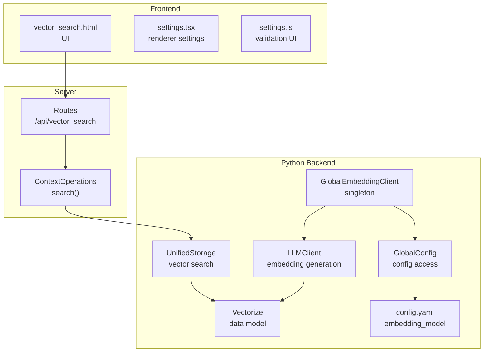
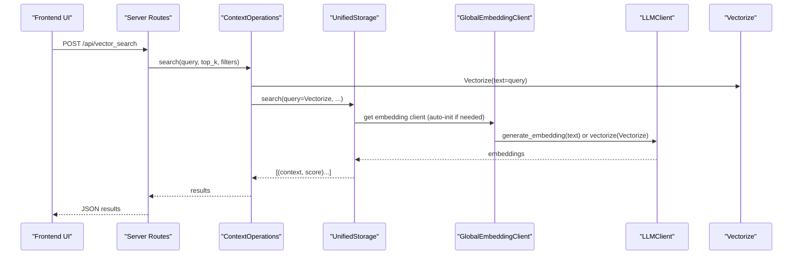
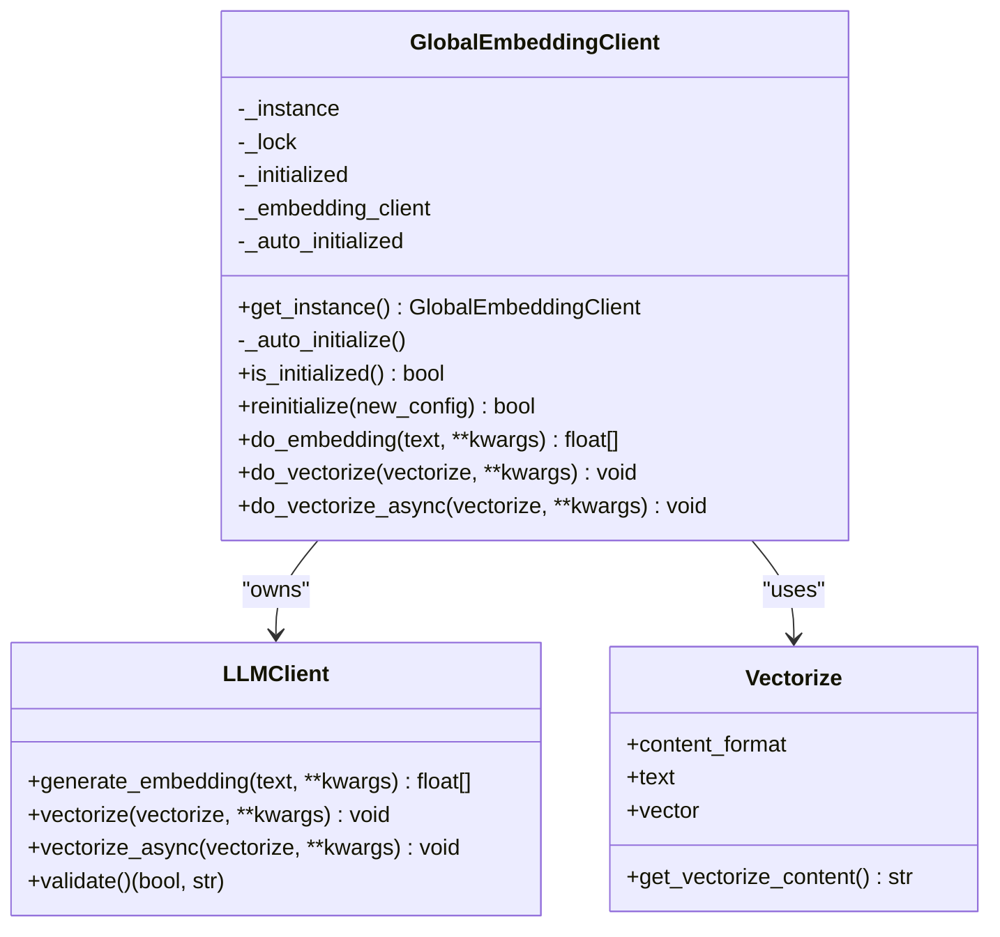
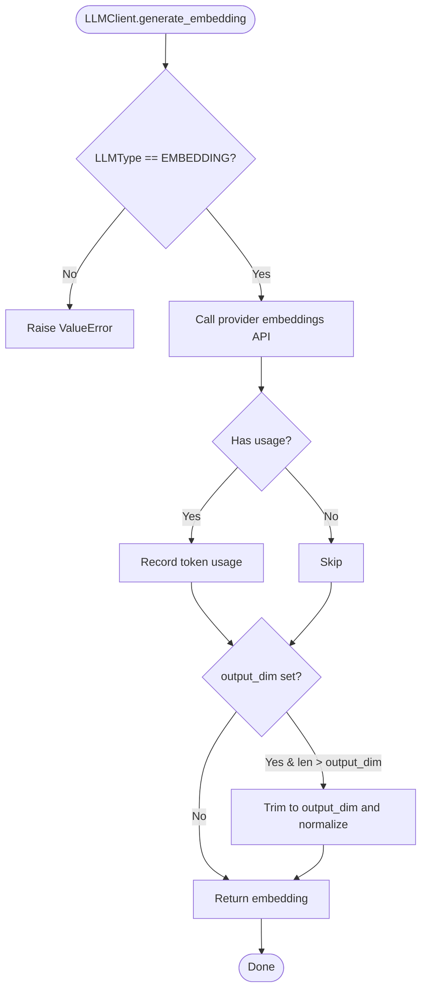
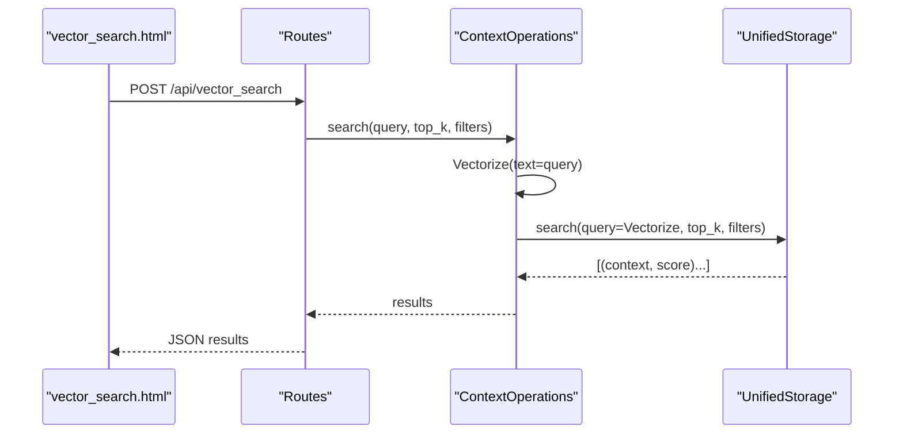
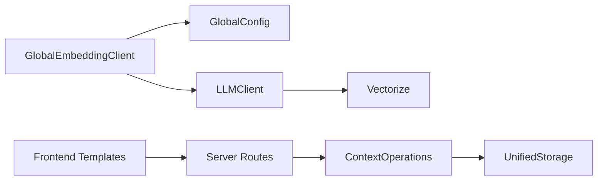

# Global Embedding Client

<cite>
**Referenced Files in This Document**
- [global_embedding_client.py](file://opencontext/llm/global_embedding_client.py)
- [llm_client.py](file://opencontext/llm/llm_client.py)
- [context.py](file://opencontext/models/context.py)
- [global_config.py](file://opencontext/config/global_config.py)
- [config.yaml](file://config/config.yaml)
- [unified_storage.py](file://opencontext/storage/unified_storage.py)
- [context_operations.py](file://opencontext/server/context_operations.py)
- [context.py](file://opencontext/server/routes/context.py)
- [vector_search.html](file://opencontext/web/templates/vector_search.html)
- [settings.js](file://opencontext/web/static/js/settings.js)
- [settings.tsx](file://frontend/src/renderer/src/pages/settings/settings.tsx)
</cite>

## Table of Contents
1. [Introduction](#introduction)
2. [Project Structure](#project-structure)
3. [Core Components](#core-components)
4. [Architecture Overview](#architecture-overview)
5. [Detailed Component Analysis](#detailed-component-analysis)
6. [Dependency Analysis](#dependency-analysis)
7. [Performance Considerations](#performance-considerations)
8. [Troubleshooting Guide](#troubleshooting-guide)
9. [Conclusion](#conclusion)
10. [Appendices](#appendices)

## Introduction
This document explains the GlobalEmbeddingClient singleton responsible for managing vector embeddings across the application. It covers auto-initialization using the embedding_model configuration, interaction with LLMClient, the do_embedding and do_vectorize methods, thread-safe reinitialization, and integration with the unified storage system for semantic search. It also provides examples of how frontend components request embeddings and discusses performance considerations for batch operations and memory usage.

## Project Structure
The embedding pipeline spans Python backend modules and frontend UI components:
- GlobalEmbeddingClient orchestrates embedding operations and interacts with LLMClient.
- LLMClient encapsulates provider-specific embedding generation and vectorization.
- Vectorize model defines the content-to-embed and stores generated vectors.
- GlobalConfig and config.yaml supply the embedding_model configuration.
- UnifiedStorage integrates vector backends for semantic search.
- Server routes expose vector search endpoints.
- Frontend templates and settings collect and validate embedding configuration.

**Diagram sources**
- [global_embedding_client.py](file://opencontext/llm/global_embedding_client.py#L1-L139)
- [llm_client.py](file://opencontext/llm/llm_client.py#L1-L466)
- [context.py](file://opencontext/models/context.py#L109-L129)
- [global_config.py](file://opencontext/config/global_config.py#L236-L331)
- [config.yaml](file://config/config.yaml#L32-L38)
- [unified_storage.py](file://opencontext/storage/unified_storage.py#L283-L323)
- [context_operations.py](file://opencontext/server/context_operations.py#L162-L207)
- [context.py](file://opencontext/server/routes/context.py#L117-L145)
- [vector_search.html](file://opencontext/web/templates/vector_search.html#L205-L250)
- [settings.js](file://opencontext/web/static/js/settings.js#L492-L518)
- [settings.tsx](file://frontend/src/renderer/src/pages/settings/settings.tsx#L86-L115)

**Section sources**
- [global_embedding_client.py](file://opencontext/llm/global_embedding_client.py#L1-L139)
- [llm_client.py](file://opencontext/llm/llm_client.py#L1-L466)
- [context.py](file://opencontext/models/context.py#L109-L129)
- [global_config.py](file://opencontext/config/global_config.py#L236-L331)
- [config.yaml](file://config/config.yaml#L32-L38)
- [unified_storage.py](file://opencontext/storage/unified_storage.py#L283-L323)
- [context_operations.py](file://opencontext/server/context_operations.py#L162-L207)
- [context.py](file://opencontext/server/routes/context.py#L117-L145)
- [vector_search.html](file://opencontext/web/templates/vector_search.html#L205-L250)
- [settings.js](file://opencontext/web/static/js/settings.js#L492-L518)
- [settings.tsx](file://frontend/src/renderer/src/pages/settings/settings.tsx#L86-L115)

## Core Components
- GlobalEmbeddingClient: Singleton that lazily initializes an LLMClient for embeddings, exposes do_embedding and do_vectorize, and supports thread-safe reinitialization.
- LLMClient: Provider-agnostic client that generates embeddings and vectorizes Vectorize objects; validates configuration via API calls.
- Vectorize: Pydantic model representing content to embed and the resulting vector.
- GlobalConfig and config.yaml: Provide embedding_model configuration (base_url, api_key, model, provider, output_dim).
- UnifiedStorage: Integrates vector backends for semantic search and upsert operations.
- Server routes and ContextOperations: Convert text queries to vectors and perform vector search.
- Frontend templates and settings: Allow users to configure embedding settings and validate connectivity.

**Section sources**
- [global_embedding_client.py](file://opencontext/llm/global_embedding_client.py#L23-L139)
- [llm_client.py](file://opencontext/llm/llm_client.py#L22-L110)
- [context.py](file://opencontext/models/context.py#L109-L129)
- [global_config.py](file://opencontext/config/global_config.py#L236-L331)
- [config.yaml](file://config/config.yaml#L32-L38)
- [unified_storage.py](file://opencontext/storage/unified_storage.py#L283-L323)
- [context_operations.py](file://opencontext/server/context_operations.py#L162-L207)
- [context.py](file://opencontext/server/routes/context.py#L117-L145)
- [vector_search.html](file://opencontext/web/templates/vector_search.html#L205-L250)
- [settings.js](file://opencontext/web/static/js/settings.js#L492-L518)
- [settings.tsx](file://frontend/src/renderer/src/pages/settings/settings.tsx#L86-L115)

## Architecture Overview
The GlobalEmbeddingClient acts as a façade over LLMClient for embedding operations. It reads embedding_model configuration from GlobalConfig and constructs an LLMClient with LLMType.EMBEDDING. Vectorization is performed by passing a Vectorize object to LLMClient.vectorize, which computes the embedding and stores it in the vector field. UnifiedStorage coordinates vector search and upsert operations.

**Diagram sources**
- [context.py](file://opencontext/server/routes/context.py#L117-L145)
- [context_operations.py](file://opencontext/server/context_operations.py#L162-L207)
- [unified_storage.py](file://opencontext/storage/unified_storage.py#L283-L323)
- [global_embedding_client.py](file://opencontext/llm/global_embedding_client.py#L49-L138)
- [llm_client.py](file://opencontext/llm/llm_client.py#L263-L342)
- [context.py](file://opencontext/models/context.py#L109-L129)

## Detailed Component Analysis

### GlobalEmbeddingClient
- Singleton pattern ensures a single embedding client instance shared across the app.
- Auto-initialization: On first access, reads embedding_model from GlobalConfig and creates an LLMClient with LLMType.EMBEDDING. Logs warnings or errors if configuration is missing or invalid.
- Thread-safe reinitialization: Supports updating the embedded client with new configuration while holding a lock.
- Public API:
  - do_embedding(text, **kwargs): Delegates to LLMClient.generate_embedding.
  - do_vectorize(vectorize, **kwargs): Delegates to LLMClient.vectorize; skips if vector already exists.
  - do_vectorize_async(vectorize, **kwargs): Asynchronous vectorization.

**Diagram sources**
- [global_embedding_client.py](file://opencontext/llm/global_embedding_client.py#L23-L139)
- [llm_client.py](file://opencontext/llm/llm_client.py#L22-L110)
- [context.py](file://opencontext/models/context.py#L109-L129)

**Section sources**
- [global_embedding_client.py](file://opencontext/llm/global_embedding_client.py#L23-L139)

### LLMClient (Embedding)
- Validates configuration presence (api_key, base_url, model).
- Generates embeddings via provider SDK and records token usage when available.
- Supports output_dim trimming and normalization to reduce memory footprint and improve similarity stability.
- Vectorize methods compute embeddings for Vectorize content and store them in-place.

**Diagram sources**
- [llm_client.py](file://opencontext/llm/llm_client.py#L263-L342)

**Section sources**
- [llm_client.py](file://opencontext/llm/llm_client.py#L22-L110)
- [llm_client.py](file://opencontext/llm/llm_client.py#L263-L342)

### Vectorize Model
- Holds content_format, text, image_path, and vector fields.
- get_vectorize_content selects text or image_path depending on content_format.

**Section sources**
- [context.py](file://opencontext/models/context.py#L109-L129)

### Configuration and Auto-Initialization
- GlobalConfig.get_config("embedding_model") supplies base_url, api_key, model, provider, and output_dim.
- config.yaml defines embedding_model with default output_dim and environment variable placeholders.
- GlobalEmbeddingClient._auto_initialize reads configuration and constructs LLMClient.

**Section sources**
- [global_config.py](file://opencontext/config/global_config.py#L236-L331)
- [config.yaml](file://config/config.yaml#L32-L38)
- [global_embedding_client.py](file://opencontext/llm/global_embedding_client.py#L60-L77)

### Unified Storage and Semantic Search
- UnifiedStorage.search accepts a Vectorize query and delegates to the vector backend.
- ContextOperations.search converts a text query to a Vectorize and calls storage.search.
- Server route /api/vector_search wraps ContextOperations.search and returns results.

**Diagram sources**
- [vector_search.html](file://opencontext/web/templates/vector_search.html#L205-L250)
- [context.py](file://opencontext/server/routes/context.py#L117-L145)
- [context_operations.py](file://opencontext/server/context_operations.py#L162-L207)
- [unified_storage.py](file://opencontext/storage/unified_storage.py#L283-L323)

**Section sources**
- [unified_storage.py](file://opencontext/storage/unified_storage.py#L283-L323)
- [context_operations.py](file://opencontext/server/context_operations.py#L162-L207)
- [context.py](file://opencontext/server/routes/context.py#L117-L145)
- [vector_search.html](file://opencontext/web/templates/vector_search.html#L205-L250)

### Frontend Integration Examples
- vector_search.html submits a POST to /api/vector_search with query, top_k, context_types, and filters.
- settings.tsx and settings.js manage embedding configuration inputs and validation, including separate embedding settings and connection testing.

**Section sources**
- [vector_search.html](file://opencontext/web/templates/vector_search.html#L205-L250)
- [settings.tsx](file://frontend/src/renderer/src/pages/settings/settings.tsx#L86-L115)
- [settings.js](file://opencontext/web/static/js/settings.js#L492-L518)

## Dependency Analysis
- GlobalEmbeddingClient depends on GlobalConfig for configuration and LLMClient for embedding generation.
- LLMClient depends on provider SDK and records token usage.
- UnifiedStorage depends on vector backends and delegates search operations.
- Server routes depend on ContextOperations and UnifiedStorage.
- Frontend templates depend on server routes for vector search.

**Diagram sources**
- [global_embedding_client.py](file://opencontext/llm/global_embedding_client.py#L49-L138)
- [global_config.py](file://opencontext/config/global_config.py#L236-L331)
- [llm_client.py](file://opencontext/llm/llm_client.py#L22-L110)
- [context.py](file://opencontext/models/context.py#L109-L129)
- [unified_storage.py](file://opencontext/storage/unified_storage.py#L283-L323)
- [context_operations.py](file://opencontext/server/context_operations.py#L162-L207)
- [context.py](file://opencontext/server/routes/context.py#L117-L145)
- [vector_search.html](file://opencontext/web/templates/vector_search.html#L205-L250)

**Section sources**
- [global_embedding_client.py](file://opencontext/llm/global_embedding_client.py#L49-L138)
- [llm_client.py](file://opencontext/llm/llm_client.py#L22-L110)
- [unified_storage.py](file://opencontext/storage/unified_storage.py#L283-L323)
- [context_operations.py](file://opencontext/server/context_operations.py#L162-L207)
- [context.py](file://opencontext/server/routes/context.py#L117-L145)
- [vector_search.html](file://opencontext/web/templates/vector_search.html#L205-L250)

## Performance Considerations
- Output dimension trimming and normalization: LLMClient trims embeddings to output_dim and normalizes them to reduce memory usage and stabilize similarity comparisons. See [llm_client.py](file://opencontext/llm/llm_client.py#L306-L342).
- Batch upsert in vector backends: UnifiedStorage.batch_upsert_processed_context delegates to vector backends for efficient bulk storage. See [unified_storage.py](file://opencontext/storage/unified_storage.py#L167-L187).
- Memory usage patterns: Large embeddings consume significant RAM; adjust output_dim to fit downstream vector databases and keep memory bounded. See [config.yaml](file://config/config.yaml#L32-L38).
- Concurrency: GlobalEmbeddingClient uses a lock for thread-safe reinitialization; embedding generation itself is synchronous in do_embedding and asynchronous in do_embedding_async. See [global_embedding_client.py](file://opencontext/llm/global_embedding_client.py#L81-L99).

[No sources needed since this section provides general guidance]

## Troubleshooting Guide
- Auto-initialization failures: If embedding_model configuration is missing, GlobalEmbeddingClient logs a warning and sets auto-initialized flag. See [global_embedding_client.py](file://opencontext/llm/global_embedding_client.py#L60-L77).
- Reinitialization errors: If reinitialize cannot find embedding_model configuration, it logs an error and raises ValueError. See [global_embedding_client.py](file://opencontext/llm/global_embedding_client.py#L81-L99).
- Provider validation failures: LLMClient.validate extracts concise error summaries for API errors (e.g., invalid_api_key, model_not_found). See [llm_client.py](file://opencontext/llm/llm_client.py#L344-L466).
- Frontend validation: settings.js provides a validateModelConfig endpoint to test embedding connectivity before saving. See [settings.js](file://opencontext/web/static/js/settings.js#L492-L518).

**Section sources**
- [global_embedding_client.py](file://opencontext/llm/global_embedding_client.py#L60-L99)
- [llm_client.py](file://opencontext/llm/llm_client.py#L344-L466)
- [settings.js](file://opencontext/web/static/js/settings.js#L492-L518)

## Conclusion
GlobalEmbeddingClient centralizes embedding operations with auto-initialization, thread-safe reinitialization, and seamless integration with LLMClient and UnifiedStorage. It enables robust semantic search across the application, with configuration validated at runtime and performance tuned via output_dim trimming and batch operations.

[No sources needed since this section summarizes without analyzing specific files]

## Appendices

### Configuration Reference
- embedding_model fields: base_url, api_key, model, provider, output_dim. See [config.yaml](file://config/config.yaml#L32-L38).
- GlobalConfig.get_config("embedding_model"): Accesses embedding configuration. See [global_config.py](file://opencontext/config/global_config.py#L236-L331).

**Section sources**
- [config.yaml](file://config/config.yaml#L32-L38)
- [global_config.py](file://opencontext/config/global_config.py#L236-L331)