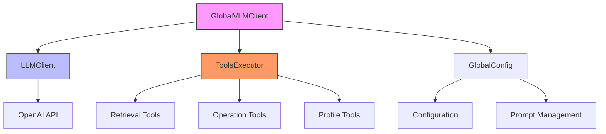
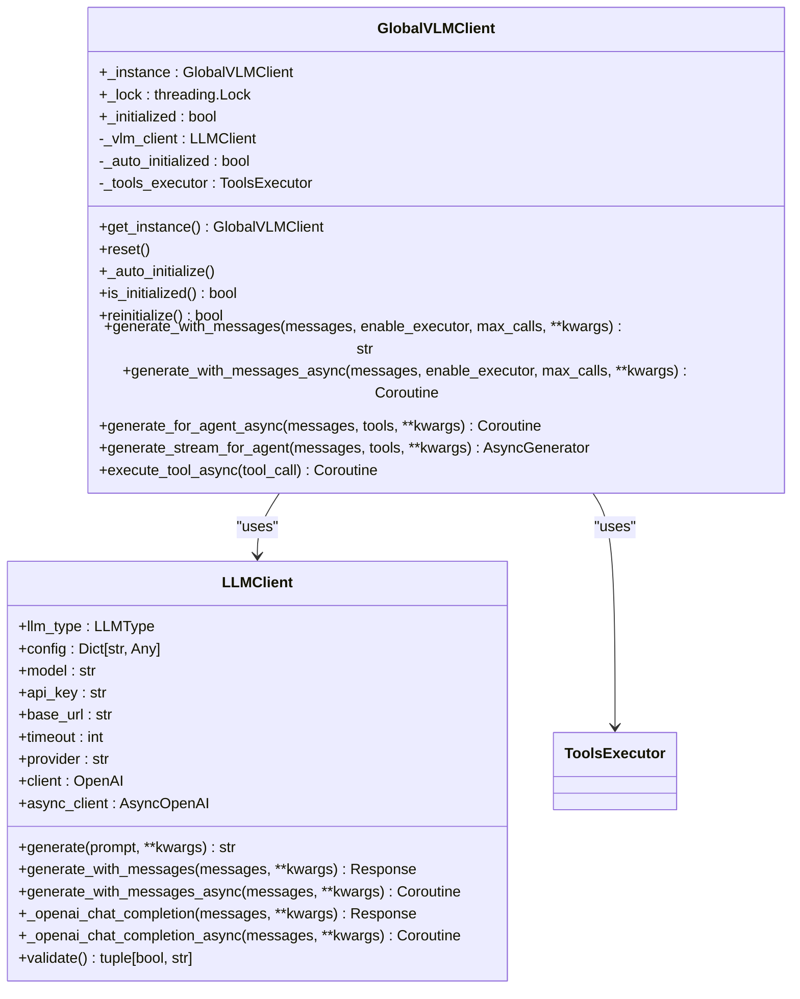
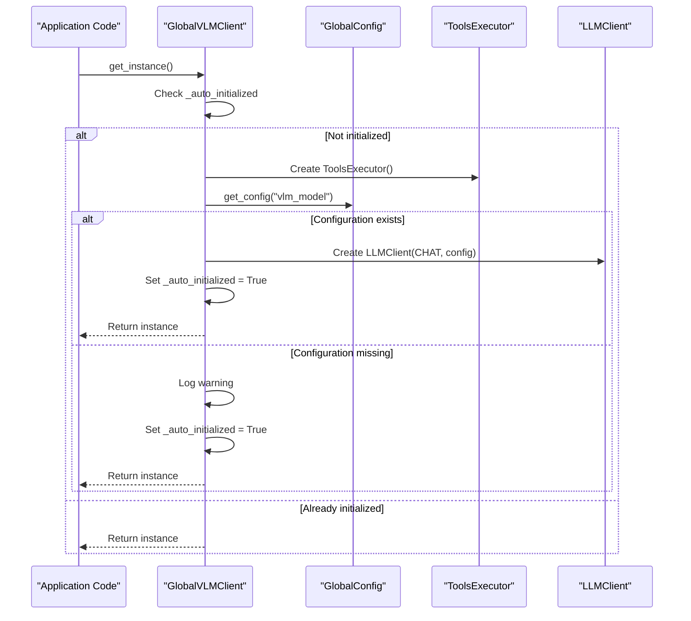

# Global VLM Client

<cite>
**Referenced Files in This Document**   
- [global_vlm_client.py](file://opencontext/llm/global_vlm_client.py)
- [tools_executor.py](file://opencontext/tools/tools_executor.py)
- [llm_client.py](file://opencontext/llm/llm_client.py)
- [global_config.py](file://opencontext/config/global_config.py)
- [executor.py](file://opencontext/context_consumption/context_agent/nodes/executor.py)
- [screenshot_processor.py](file://opencontext/context_processing/processor/screenshot_processor.py)
</cite>

## Table of Contents
1. [Introduction](#introduction)
2. [Architecture Overview](#architecture-overview)
3. [Core Components](#core-components)
4. [Auto-Initialization Process](#auto-initialization-process)
5. [Tool Execution Workflows](#tool-execution-workflows)
6. [Concurrency Patterns](#concurrency-patterns)
7. [Error Handling and Fallback Strategies](#error-handling-and-fallback-strategies)
8. [AI Agent Integration](#ai-agent-integration)

## Introduction

The GlobalVLMClient is a singleton implementation that manages vision-language model (VLM) operations within the OpenContext system. It serves as the central interface for multimodal LLM interactions, enabling AI agents to process both textual and visual inputs while executing complex workflows through integrated tool calling capabilities. The client provides a unified access point for VLM operations, ensuring consistent configuration, efficient resource utilization, and thread-safe operations across the application.

As a singleton, the GlobalVLMClient ensures that only one instance exists throughout the application lifecycle, preventing redundant initialization and maintaining state consistency. This design pattern is particularly important for resource-intensive components like LLM clients, where multiple instances could lead to excessive memory consumption and inconsistent behavior. The client integrates seamlessly with the ToolsExecutor to enable sophisticated agent workflows that combine reasoning with external tool execution.

**Section sources**
- [global_vlm_client.py](file://opencontext/llm/global_vlm_client.py#L27-L35)

## Architecture Overview



**Diagram sources**
- [global_vlm_client.py](file://opencontext/llm/global_vlm_client.py#L27-L317)
- [tools_executor.py](file://opencontext/tools/tools_executor.py#L15-L136)
- [llm_client.py](file://opencontext/llm/llm_client.py#L32-L466)

The GlobalVLMClient architecture centers around a singleton pattern that coordinates between the LLMClient for model interactions and the ToolsExecutor for tool management. The client retrieves configuration through GlobalConfig, which provides access to model settings and prompt templates. When processing requests, the client can engage in tool calling loops where the VLM generates tool calls, the ToolsExecutor executes them, and results are fed back to the VLM for further reasoning.

This architecture enables multimodal reasoning by allowing the VLM to process both text and images, while extending its capabilities through specialized tools. The separation of concerns between the VLM client, tool executor, and configuration manager creates a modular system that can be easily extended with new tools and adapted to different VLM providers.

**Section sources**
- [global_vlm_client.py](file://opencontext/llm/global_vlm_client.py#L27-L317)
- [tools_executor.py](file://opencontext/tools/tools_executor.py#L15-L136)

## Core Components

### GlobalVLMClient Singleton

The GlobalVLMClient implements the singleton pattern using a thread-safe initialization process. It maintains a single instance across the application through the `_instance` class variable and uses a threading lock to ensure that initialization is atomic. The client exposes both synchronous and asynchronous interfaces for different use cases, with the asynchronous methods designed for integration with the context agent system.



**Diagram sources**
- [global_vlm_client.py](file://opencontext/llm/global_vlm_client.py#L27-L317)
- [llm_client.py](file://opencontext/llm/llm_client.py#L32-L466)

### ToolsExecutor Integration

The ToolsExecutor is tightly integrated with the GlobalVLMClient, providing the capability to execute tool calls generated by the VLM. It maintains a registry of available tools and handles both synchronous and asynchronous execution. The executor validates tool inputs and provides helpful error messages when unknown tools are called, including suggestions based on fuzzy matching.

**Section sources**
- [global_vlm_client.py](file://opencontext/llm/global_vlm_client.py#L74-L76)
- [tools_executor.py](file://opencontext/tools/tools_executor.py#L15-L136)

## Auto-Initialization Process

The GlobalVLMClient employs an auto-initialization mechanism that activates when the instance is first accessed. This lazy initialization ensures that resources are only allocated when needed, improving startup performance. The initialization process follows a specific sequence:

1. Check if the client has already been auto-initialized
2. Import and instantiate the ToolsExecutor
3. Retrieve VLM configuration from GlobalConfig using the "vlm_model" path
4. Create an LLMClient instance with CHAT type and the retrieved configuration
5. Set initialization flags and log success or failure

When configuration is missing, the client handles this gracefully by setting the auto-initialized flag without creating a VLM client, allowing the system to continue operating in a degraded mode. This fault-tolerant design prevents application startup failures due to configuration issues.

The reinitialize method provides a thread-safe way to refresh the VLM client with updated configuration, which is useful when users modify model settings through the UI. This method acquires the same lock used during initialization to prevent race conditions.



**Diagram sources**
- [global_vlm_client.py](file://opencontext/llm/global_vlm_client.py#L70-L89)
- [global_config.py](file://opencontext/config/global_config.py#L236-L261)

## Tool Execution Workflows

### generate_with_messages Method

The generate_with_messages method implements a tool calling loop that enables the VLM to reason and act iteratively. This method processes a message sequence and handles tool calls automatically, with configurable parameters:

- **messages**: The conversation history including user queries and system instructions
- **enable_executor**: Flag to enable or disable tool execution (default: True)
- **max_calls**: Maximum number of tool call iterations (default: 5)
- **kwargs**: Additional parameters passed to the underlying LLMClient

The workflow follows these steps:
1. Send the initial message sequence to the VLM
2. Check if the response contains tool calls
3. For each tool call, parse the function name and arguments
4. Execute all tools in parallel using ThreadPoolExecutor
5. Format tool results and append them to the message history
6. Send the updated message sequence back to the VLM
7. Repeat until no more tool calls are generated or max_calls is reached

When the maximum call limit is reached, the system appends a system message informing the VLM to answer directly without further tool calls, preventing infinite loops.

**Section sources**
- [global_vlm_client.py](file://opencontext/llm/global_vlm_client.py#L114-L174)

### generate_with_messages_async Method

The asynchronous version of the tool calling loop uses asyncio for parallel tool execution, providing better performance for I/O-bound operations. Instead of ThreadPoolExecutor, it uses asyncio.gather to run multiple tool calls concurrently. This approach is more efficient for tools that involve network requests or other asynchronous operations.

The async method follows the same logical flow as the synchronous version but leverages Python's async/await syntax for non-blocking operations. This allows the event loop to handle other tasks while waiting for tool execution to complete, improving overall system responsiveness.

**Section sources**
- [global_vlm_client.py](file://opencontext/llm/global_vlm_client.py#L176-L232)

## Concurrency Patterns

The GlobalVLMClient employs different concurrency patterns for synchronous and asynchronous operations:

### Synchronous Concurrency with ThreadPoolExecutor

For the synchronous generate_with_messages method, the client uses ThreadPoolExecutor to execute multiple tool calls in parallel. This is appropriate for CPU-bound operations or when integrating with synchronous APIs. The implementation creates a context manager that automatically manages the thread pool lifecycle:

```python
with concurrent.futures.ThreadPoolExecutor() as executor:
    future_to_tool = {
        executor.submit(self._tools_executor.run, function_name, function_args): (tool_id, function_name)
        for tool_id, function_name, function_args in tool_call_info
    }
    for future in concurrent.futures.as_completed(future_to_tool):
        # Process completed futures
```

This pattern allows multiple tools to execute simultaneously, reducing the total time required for tool execution. The use of as_completed enables processing results as they become available rather than waiting for all tools to complete.

### Asynchronous Concurrency with asyncio.gather

For the asynchronous methods, the client uses asyncio.gather to run multiple coroutines concurrently. This is more efficient for I/O-bound operations like API calls, database queries, or file operations:

```python
tasks = []
for tc in tool_calls:
    function_name = tc.function.name
    function_args = parse_json_from_response(tc.function.arguments)
    tasks.append(self._tools_executor.run_async(function_name, function_args))

results = await asyncio.gather(*tasks)
```

This approach leverages Python's event loop to achieve concurrency without the overhead of thread management. It's particularly effective when tools involve network requests, as the event loop can switch between tasks while waiting for responses.

**Section sources**
- [global_vlm_client.py](file://opencontext/llm/global_vlm_client.py#L144-L151)
- [global_vlm_client.py](file://opencontext/llm/global_vlm_client.py#L200-L214)

## Error Handling and Fallback Strategies

The GlobalVLMClient implements comprehensive error handling at multiple levels:

### Tool Execution Errors

When a tool call fails, the system captures the exception and returns a structured error response rather than propagating the exception. This prevents a single failed tool from terminating the entire workflow. The error response includes:
- Error message with details about the failure
- Information about the failed tool
- Suggestions for alternative tools when applicable

For unknown tools, the system uses difflib.get_close_matches to suggest similar tool names, helping to recover from typos or naming inconsistencies.

### JSON Parsing Errors

The client uses a dedicated json_parser module to handle argument parsing from tool calls. When JSON parsing fails, it returns a clear error message indicating the parsing failure rather than raising an exception. This graceful degradation allows the system to continue operating even with malformed tool call arguments.

### VLM Communication Errors

The underlying LLMClient implements robust error handling for API communication, including:
- APIError handling with detailed logging
- Processing stage recording for monitoring
- Token usage tracking for cost management
- Comprehensive validation with descriptive error messages

The validation method extracts concise error summaries from verbose API responses, making it easier to diagnose configuration issues.

**Section sources**
- [global_vlm_client.py](file://opencontext/llm/global_vlm_client.py#L154-L160)
- [tools_executor.py](file://opencontext/tools/tools_executor.py#L56-L76)
- [llm_client.py](file://opencontext/llm/llm_client.py#L138-L147)

## AI Agent Integration

### Context Agent System Integration

The GlobalVLMClient is tightly integrated with the context agent system, providing specialized methods for agent workflows:

#### generate_for_agent_async

This method returns the raw LLM response without automatically executing tool calls, giving the agent full control over the tool calling process. It's used when the agent needs to implement custom tool calling logic or when tool execution decisions depend on additional context.

#### generate_stream_for_agent

This method provides streaming responses, allowing the agent to process partial results as they become available. It's used for real-time updates and progressive disclosure of information, enhancing the user experience by providing immediate feedback.

### Agent Usage Examples

AI agents use the GlobalVLMClient for multimodal reasoning in various scenarios:

1. **Screenshot Analysis**: The ScreenshotProcessor uses generate_with_messages_async to extract content from screenshots, combining image analysis with text processing.

2. **Document Processing**: The DocumentProcessor uses the client to analyze document images, extracting text and understanding content structure.

3. **Context Retrieval**: Agents use the tool calling capabilities to retrieve relevant context from various sources, including activity history, semantic context, and procedural knowledge.

4. **Web Search**: When local knowledge is insufficient, agents use the web_search tool to retrieve up-to-date information from the internet.

The integration between the GlobalVLMClient and the context agent system enables sophisticated workflows where the agent can reason about user queries, plan execution steps, and coordinate multiple tools to achieve complex goals.

**Section sources**
- [global_vlm_client.py](file://opencontext/llm/global_vlm_client.py#L234-L259)
- [executor.py](file://opencontext/context_consumption/context_agent/nodes/executor.py#L144-L161)
- [screenshot_processor.py](file://opencontext/context_processing/processor/screenshot_processor.py#L287-L290)