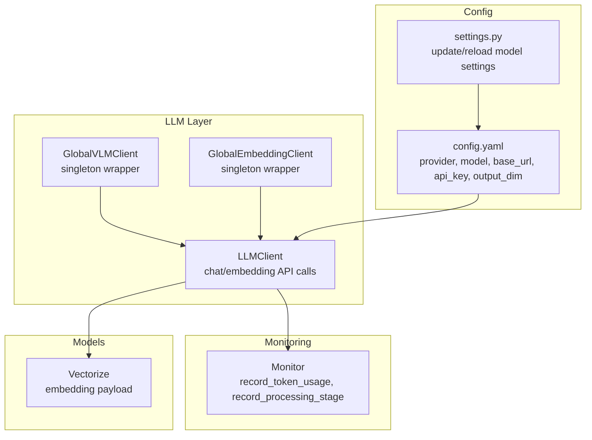
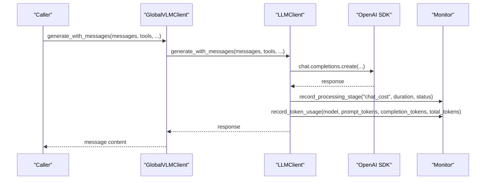
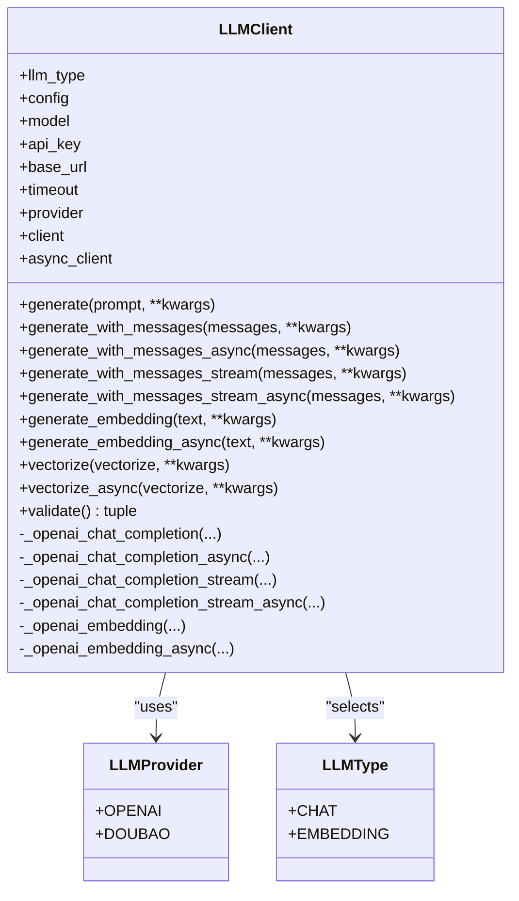
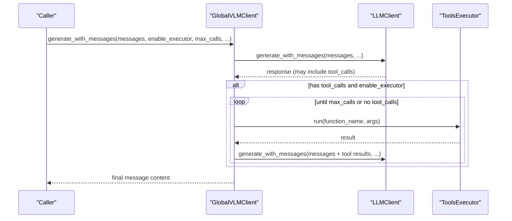
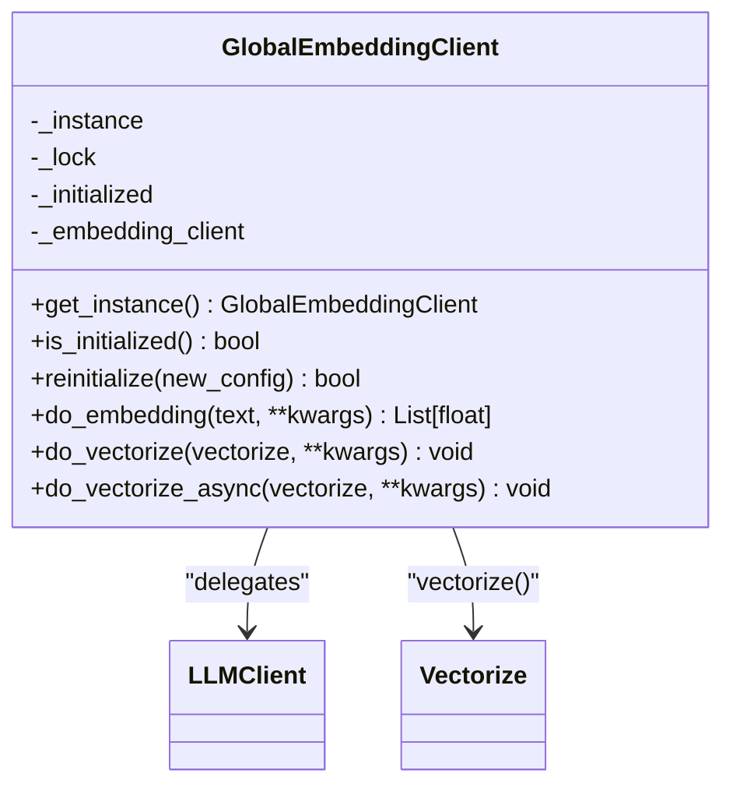
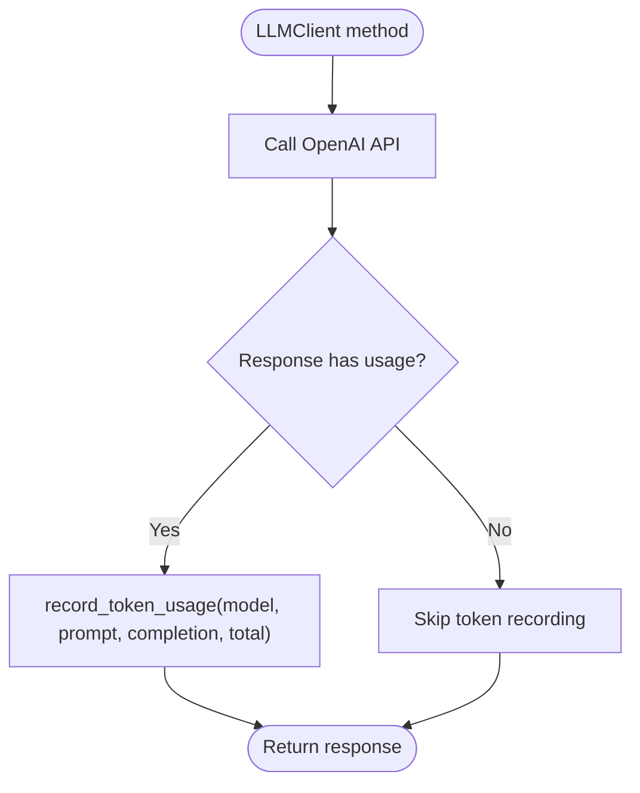
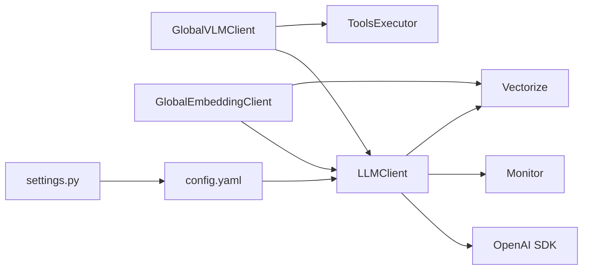

# LLM Client Core

<cite>
**Referenced Files in This Document**
- [llm_client.py](file://opencontext/llm/llm_client.py)
- [global_vlm_client.py](file://opencontext/llm/global_vlm_client.py)
- [global_embedding_client.py](file://opencontext/llm/global_embedding_client.py)
- [monitor.py](file://opencontext/monitoring/monitor.py)
- [context.py](file://opencontext/models/context.py)
- [config.yaml](file://config/config.yaml)
- [settings.py](file://opencontext/server/routes/settings.py)
</cite>

## Table of Contents
1. [Introduction](#introduction)
2. [Project Structure](#project-structure)
3. [Core Components](#core-components)
4. [Architecture Overview](#architecture-overview)
5. [Detailed Component Analysis](#detailed-component-analysis)
6. [Dependency Analysis](#dependency-analysis)
7. [Performance Considerations](#performance-considerations)
8. [Troubleshooting Guide](#troubleshooting-guide)
9. [Conclusion](#conclusion)
10. [Appendices](#appendices)

## Introduction
This document provides a comprehensive guide to the LLMClient class and related LLM utilities in the OpenContext project. It focuses on how the system interfaces with OpenAI-compatible APIs, including request formatting, streaming responses, error handling, and token usage tracking. It also covers initialization with API key, base URL, and model configuration, the generate_with_messages and generate_with_messages_stream methods for chat completions, and generate_embedding for vector generation. Configuration options for providers, model selection, timeouts, and output dimensionality are documented, along with usage patterns for synchronous and asynchronous operations. The document addresses rate limiting, token usage tracking via record_token_usage, fallback strategies for API failures, and privacy considerations when sending user data to external LLM providers.

## Project Structure
The LLM-related components are primarily located under opencontext/llm, with monitoring utilities under opencontext/monitoring, configuration under config, and server-side model settings under opencontext/server/routes. The LLMClient class centralizes OpenAI-compatible API interactions, while GlobalVLMClient and GlobalEmbeddingClient provide convenient singletons for chat and embedding operations respectively.

**Diagram sources**
- [llm_client.py](file://opencontext/llm/llm_client.py#L32-L120)
- [global_vlm_client.py](file://opencontext/llm/global_vlm_client.py#L27-L113)
- [global_embedding_client.py](file://opencontext/llm/global_embedding_client.py#L23-L100)
- [monitor.py](file://opencontext/monitoring/monitor.py#L133-L163)
- [context.py](file://opencontext/models/context.py#L109-L129)
- [config.yaml](file://config/config.yaml#L26-L38)
- [settings.py](file://opencontext/server/routes/settings.py#L108-L173)

**Section sources**
- [llm_client.py](file://opencontext/llm/llm_client.py#L32-L120)
- [global_vlm_client.py](file://opencontext/llm/global_vlm_client.py#L27-L113)
- [global_embedding_client.py](file://opencontext/llm/global_embedding_client.py#L23-L100)
- [monitor.py](file://opencontext/monitoring/monitor.py#L133-L163)
- [context.py](file://opencontext/models/context.py#L109-L129)
- [config.yaml](file://config/config.yaml#L26-L38)
- [settings.py](file://opencontext/server/routes/settings.py#L108-L173)

## Core Components
- LLMClient: Implements OpenAI-compatible chat completions and embeddings, supports sync and async operations, streaming, and token usage tracking. It validates configuration and raises explicit errors for missing keys.
- GlobalVLMClient: Singleton wrapper around LLMClient for chat with automatic tool execution and streaming support.
- GlobalEmbeddingClient: Singleton wrapper around LLMClient for embedding generation and vectorization of Vectorize objects.
- Monitor: Records token usage and processing stages, persists metrics to storage, and exposes summaries.

Key responsibilities:
- Initialization: Validates presence of api_key, base_url, model; sets timeout; creates OpenAI and AsyncOpenAI clients.
- Chat: Formats messages, supports tools and provider-specific extra parameters (e.g., Doubao “thinking”).
- Embedding: Generates vectors, records token usage, and optionally trims and normalizes embeddings to configured output_dim.
- Streaming: Provides both sync and async streaming responses.
- Monitoring: Uses record_token_usage and record_processing_stage to track usage and latency.

**Section sources**
- [llm_client.py](file://opencontext/llm/llm_client.py#L32-L120)
- [llm_client.py](file://opencontext/llm/llm_client.py#L90-L191)
- [llm_client.py](file://opencontext/llm/llm_client.py#L203-L262)
- [llm_client.py](file://opencontext/llm/llm_client.py#L263-L327)
- [monitor.py](file://opencontext/monitoring/monitor.py#L133-L163)
- [monitor.py](file://opencontext/monitoring/monitor.py#L337-L350)

## Architecture Overview
The LLMClient integrates with OpenAI-compatible APIs through the OpenAI and AsyncOpenAI SDKs. It delegates chat and embedding requests to the underlying SDK, records metrics, and returns responses. Global wrappers encapsulate common usage patterns: GlobalVLMClient orchestrates tool execution and streaming, while GlobalEmbeddingClient provides centralized embedding and vectorization.

**Diagram sources**
- [global_vlm_client.py](file://opencontext/llm/global_vlm_client.py#L114-L174)
- [llm_client.py](file://opencontext/llm/llm_client.py#L90-L191)
- [monitor.py](file://opencontext/monitoring/monitor.py#L337-L350)

## Detailed Component Analysis

### LLMClient Class
LLMClient encapsulates OpenAI-compatible API interactions for chat and embeddings. It supports:
- Initialization with provider, model, base_url, api_key, timeout, and output_dim for embeddings.
- Synchronous and asynchronous chat completions with optional tools and provider-specific parameters.
- Streaming chat completions (sync and async).
- Embedding generation with optional output dimensionality trimming and normalization.
- Token usage tracking and processing stage timing.
- Validation via a lightweight API call to confirm connectivity and model availability.

Implementation highlights:
- Request formatting: Builds create_params with model, messages, optional tools/tool_choice, and provider-specific extra_body for Doubao “thinking”.
- Streaming: Returns a stream object for sync; async generator yields chunks for async.
- Error handling: Catches APIError, logs, records failure stage timing, and re-raises.
- Token usage: On successful responses, extracts usage fields and records via record_token_usage.
- Validation: Attempts a minimal chat or embedding call depending on llm_type and returns success or a concise error summary.

**Diagram sources**
- [llm_client.py](file://opencontext/llm/llm_client.py#L22-L31)
- [llm_client.py](file://opencontext/llm/llm_client.py#L32-L120)
- [llm_client.py](file://opencontext/llm/llm_client.py#L120-L201)
- [llm_client.py](file://opencontext/llm/llm_client.py#L203-L262)
- [llm_client.py](file://opencontext/llm/llm_client.py#L263-L327)

**Section sources**
- [llm_client.py](file://opencontext/llm/llm_client.py#L32-L120)
- [llm_client.py](file://opencontext/llm/llm_client.py#L90-L191)
- [llm_client.py](file://opencontext/llm/llm_client.py#L203-L262)
- [llm_client.py](file://opencontext/llm/llm_client.py#L263-L327)
- [llm_client.py](file://opencontext/llm/llm_client.py#L344-L466)

### GlobalVLMClient
GlobalVLMClient provides a singleton interface for VLM (vision-language-model) chat operations:
- Auto-initializes from configuration (vlm_model).
- Executes tool calls automatically when present in responses, up to a configurable max_calls.
- Supports both synchronous and asynchronous generation, including streaming.
- Exposes convenience functions for agent-specific generation and streaming.

**Diagram sources**
- [global_vlm_client.py](file://opencontext/llm/global_vlm_client.py#L114-L174)
- [global_vlm_client.py](file://opencontext/llm/global_vlm_client.py#L176-L232)
- [global_vlm_client.py](file://opencontext/llm/global_vlm_client.py#L251-L259)

**Section sources**
- [global_vlm_client.py](file://opencontext/llm/global_vlm_client.py#L27-L113)
- [global_vlm_client.py](file://opencontext/llm/global_vlm_client.py#L114-L174)
- [global_vlm_client.py](file://opencontext/llm/global_vlm_client.py#L176-L232)
- [global_vlm_client.py](file://opencontext/llm/global_vlm_client.py#L251-L259)

### GlobalEmbeddingClient
GlobalEmbeddingClient provides a singleton interface for embedding operations:
- Auto-initializes from configuration (embedding_model).
- Offers do_embedding and do_vectorize methods for synchronous and asynchronous operations.
- Integrates with Vectorize to compute and attach embeddings.

**Diagram sources**
- [global_embedding_client.py](file://opencontext/llm/global_embedding_client.py#L23-L100)
- [global_embedding_client.py](file://opencontext/llm/global_embedding_client.py#L101-L139)
- [context.py](file://opencontext/models/context.py#L109-L129)

**Section sources**
- [global_embedding_client.py](file://opencontext/llm/global_embedding_client.py#L23-L100)
- [global_embedding_client.py](file://opencontext/llm/global_embedding_client.py#L101-L139)
- [context.py](file://opencontext/models/context.py#L109-L129)

### Monitoring and Metrics
Token usage and processing stage timing are recorded centrally:
- record_token_usage: Persists token usage per model and maintains rolling histories.
- record_processing_stage: Records stage durations and statuses for performance insights.
- Monitor consolidates metrics and provides summaries and persistence to storage.

**Diagram sources**
- [llm_client.py](file://opencontext/llm/llm_client.py#L123-L137)
- [llm_client.py](file://opencontext/llm/llm_client.py#L177-L191)
- [llm_client.py](file://opencontext/llm/llm_client.py#L268-L281)
- [monitor.py](file://opencontext/monitoring/monitor.py#L133-L163)

**Section sources**
- [monitor.py](file://opencontext/monitoring/monitor.py#L133-L163)
- [monitor.py](file://opencontext/monitoring/monitor.py#L337-L350)
- [llm_client.py](file://opencontext/llm/llm_client.py#L123-L137)
- [llm_client.py](file://opencontext/llm/llm_client.py#L177-L191)
- [llm_client.py](file://opencontext/llm/llm_client.py#L268-L281)

## Dependency Analysis
- LLMClient depends on:
  - OpenAI/AsyncOpenAI SDK for API calls.
  - opencontext.monitoring for metrics.
  - opencontext.models.context for Vectorize.
- GlobalVLMClient depends on LLMClient and ToolsExecutor for tool orchestration.
- GlobalEmbeddingClient depends on LLMClient and Vectorize.
- Configuration is loaded via GlobalConfig and exposed through config.yaml.

**Diagram sources**
- [llm_client.py](file://opencontext/llm/llm_client.py#L13-L18)
- [global_vlm_client.py](file://opencontext/llm/global_vlm_client.py#L18-L22)
- [global_embedding_client.py](file://opencontext/llm/global_embedding_client.py#L15-L18)
- [config.yaml](file://config/config.yaml#L26-L38)
- [settings.py](file://opencontext/server/routes/settings.py#L108-L173)

**Section sources**
- [llm_client.py](file://opencontext/llm/llm_client.py#L13-L18)
- [global_vlm_client.py](file://opencontext/llm/global_vlm_client.py#L18-L22)
- [global_embedding_client.py](file://opencontext/llm/global_embedding_client.py#L15-L18)
- [config.yaml](file://config/config.yaml#L26-L38)
- [settings.py](file://opencontext/server/routes/settings.py#L108-L173)

## Performance Considerations
- Timeout: LLMClient uses a configurable timeout for API calls; adjust according to provider SLAs and network conditions.
- Streaming: Prefer streaming for long-running responses to reduce perceived latency and enable incremental rendering.
- Output dimensionality: For embeddings, output_dim can be configured to trim and normalize vectors, reducing downstream storage and computation costs.
- Rate limiting: The codebase does not implement built-in retry/backoff; consider integrating retry logic at call sites or via upstream SDK features. The validation routine demonstrates concise error summarization to aid diagnostics.
- Monitoring: Use record_processing_stage and record_token_usage to track latency and token consumption; leverage Monitor summaries for operational insights.

[No sources needed since this section provides general guidance]

## Troubleshooting Guide
Common issues and remedies:
- Missing configuration: Initialization requires api_key, base_url, and model; missing any raises a ValueError. Verify config.yaml and settings endpoint.
- Provider-specific parameters: For Doubao provider, extra_body with thinking type can be included; ensure provider is set accordingly.
- API errors: LLMClient catches APIError, logs, records failure stage timing, and re-raises. Use validation to quickly detect misconfiguration.
- Error summarization: The validate method extracts concise error messages for known providers and formats, aiding rapid diagnosis.
- Token usage: If usage fields are absent, token recording is skipped; ensure provider returns usage in responses.

**Section sources**
- [llm_client.py](file://opencontext/llm/llm_client.py#L32-L47)
- [llm_client.py](file://opencontext/llm/llm_client.py#L138-L148)
- [llm_client.py](file://opencontext/llm/llm_client.py#L192-L202)
- [llm_client.py](file://opencontext/llm/llm_client.py#L344-L466)

## Conclusion
The LLMClient class provides a robust, OpenAI-compatible interface for chat and embedding operations with strong observability and configuration support. Global wrappers simplify common usage patterns, including tool execution and vectorization. The monitoring subsystem enables comprehensive tracking of token usage and processing latency. While the codebase does not include built-in retry/backoff, the validation and error summarization utilities facilitate quick identification and remediation of issues. For production deployments, consider adding retry logic and rate-limiting controls at call sites, and ensure privacy-conscious handling of user data.

[No sources needed since this section summarizes without analyzing specific files]

## Appendices

### Configuration Options
- Provider selection: provider can be set to OPENAI or DOUBAO; DOUBAO supports extra_body for thinking.
- Model selection: model must be provided; embedding_model.output_dim controls vector dimensionality.
- Base URL and API key: base_url and api_key are required for initialization.
- Timeout: timeout is configurable and defaults to a reasonable value.

**Section sources**
- [llm_client.py](file://opencontext/llm/llm_client.py#L32-L47)
- [llm_client.py](file://opencontext/llm/llm_client.py#L108-L111)
- [config.yaml](file://config/config.yaml#L26-L38)

### Usage Patterns
- Synchronous chat: Use generate_with_messages with a messages list; optionally include tools and thinking.
- Asynchronous chat: Use generate_with_messages_async for non-blocking operations.
- Streaming: Use generate_with_messages_stream (sync) or generate_with_messages_stream_async (async) to iterate over response chunks.
- Embedding: Use generate_embedding or generate_embedding_async; output_dim can be passed to trim and normalize vectors.
- Vectorization: Use vectorize or vectorize_async on Vectorize objects to compute and attach embeddings.

**Section sources**
- [llm_client.py](file://opencontext/llm/llm_client.py#L52-L89)
- [llm_client.py](file://opencontext/llm/llm_client.py#L203-L262)
- [llm_client.py](file://opencontext/llm/llm_client.py#L263-L327)
- [context.py](file://opencontext/models/context.py#L109-L129)

### Privacy Considerations
- External provider: All LLM calls are sent to the configured base_url/provider; ensure secure transport and least-privilege credentials.
- Data minimization: Avoid sending sensitive content unless necessary; consider preprocessing or anonymization before LLM calls.
- Logging: Errors are logged; ensure logs do not retain sensitive data.
- Compliance: Follow applicable regulations for data handling and retention.

[No sources needed since this section provides general guidance]