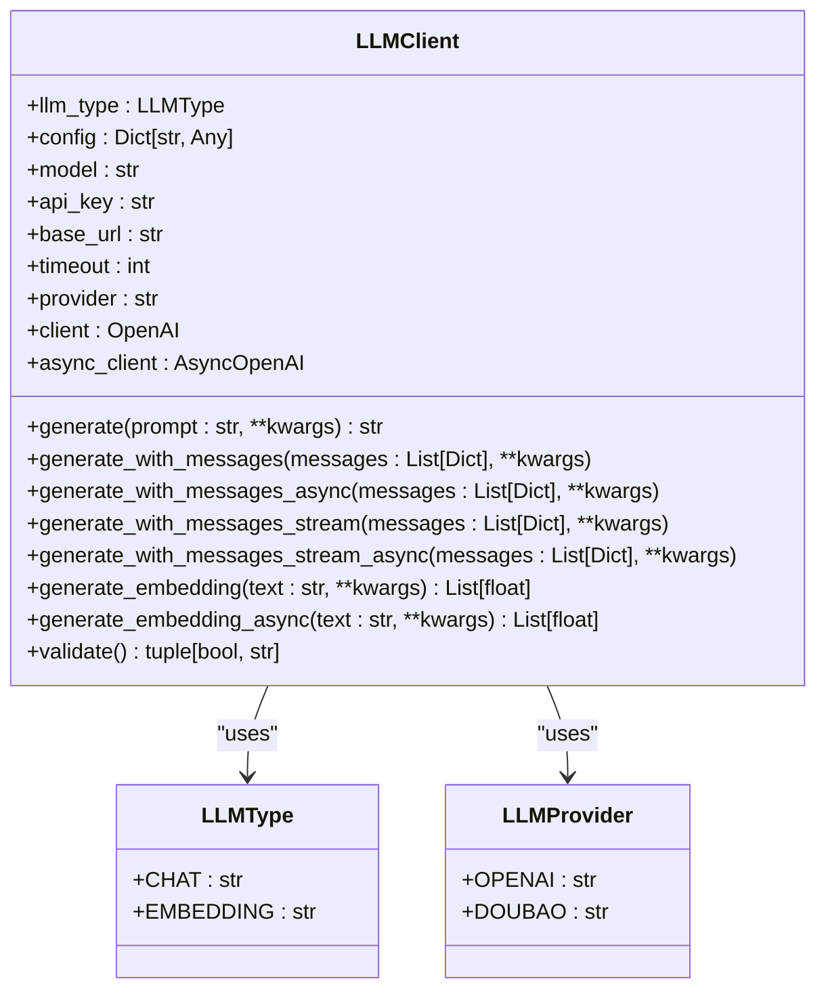
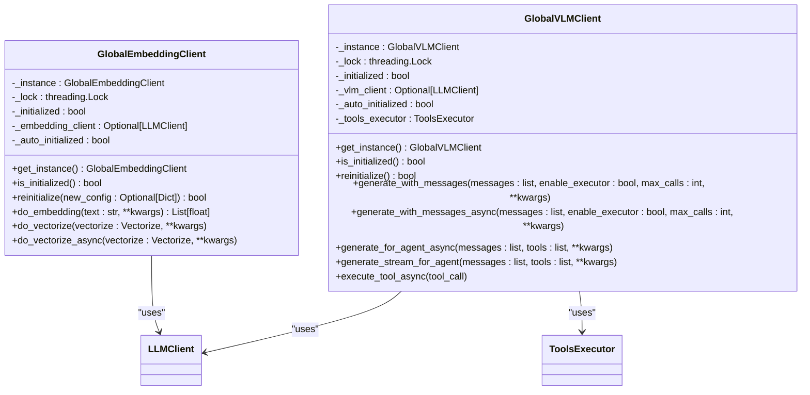
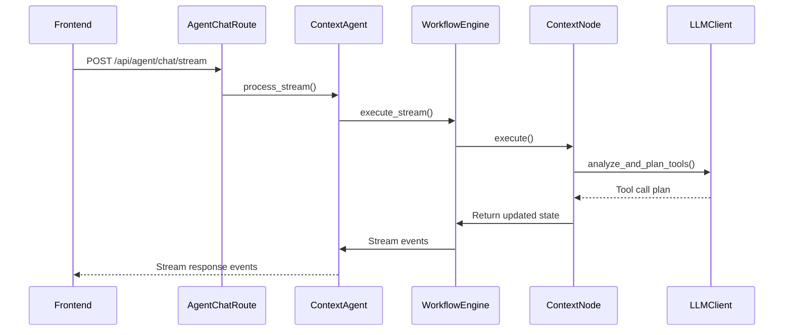
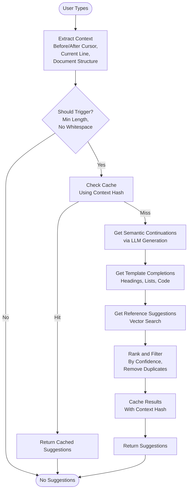
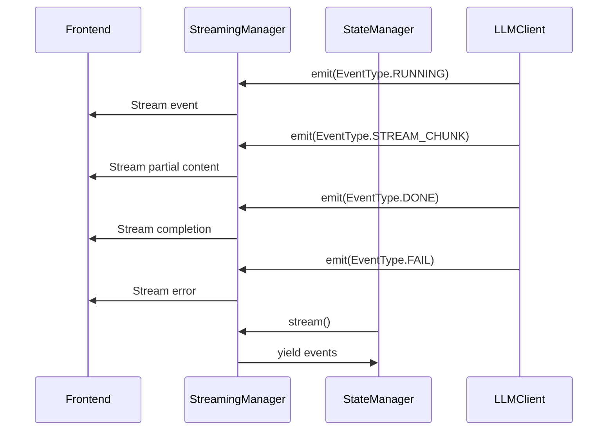

# LLM Integration

<cite>
**Referenced Files in This Document**   
- [llm_client.py](file://opencontext/llm/llm_client.py)
- [global_embedding_client.py](file://opencontext/llm/global_embedding_client.py)
- [global_vlm_client.py](file://opencontext/llm/global_vlm_client.py)
- [agent.py](file://opencontext/context_consumption/context_agent/agent.py)
- [completion_service.py](file://opencontext/context_consumption/completion/completion_service.py)
- [config.yaml](file://config/config.yaml)
- [completions.py](file://opencontext/server/routes/completions.py)
- [agent_chat.py](file://opencontext/server/routes/agent_chat.py)
- [workflow.py](file://opencontext/context_consumption/context_agent/core/workflow.py)
- [context.py](file://opencontext/context_consumption/context_agent/nodes/context.py)
- [streaming.py](file://opencontext/context_consumption/context_agent/core/streaming.py)
- [state.py](file://opencontext/context_consumption/context_agent/core/state.py)
</cite>

## Table of Contents
1. [Introduction](#introduction)
2. [LLM Client Implementation](#llm-client-implementation)
3. [Embedding and VLM Clients](#embedding-and-vlm-clients)
4. [Context Agent Workflow](#context-agent-workflow)
5. [Completion Service](#completion-service)
6. [Configuration and API Setup](#configuration-and-api-setup)
7. [Streaming and Error Handling](#streaming-and-error-handling)
8. [Privacy and Rate Limiting](#privacy-and-rate-limiting)
9. [Conclusion](#conclusion)

## Introduction
The LLM integration layer in MineContext provides a comprehensive framework for leveraging large language models (LLMs) to enhance AI/ML capabilities. This system enables semantic search, intelligent content completion, and vision-language processing through a modular architecture. The core components include specialized clients for interfacing with OpenAI-compatible APIs, managing embeddings, and orchestrating AI workflows. This documentation details the implementation of these components, their configuration options, and how they interact to deliver advanced AI functionality.

## LLM Client Implementation

The `LLMClient` class in `llm_client.py` serves as the primary interface for communicating with OpenAI-compatible APIs. It supports both chat and embedding operations through a unified interface that abstracts away provider-specific details. The client is initialized with configuration parameters including the model name, API key, base URL, and timeout settings. It validates these configurations during initialization and raises appropriate errors for missing required fields.

The client implements multiple request methods for different use cases:
- `generate()` and `generate_with_messages()` for standard chat completions
- `generate_with_messages_stream()` for streaming responses
- `generate_embedding()` for creating vector embeddings

Each method handles request formatting according to the OpenAI API specification, including proper message structure with role and content fields. The implementation includes comprehensive error handling for API errors, with detailed error messages extracted and presented in a user-friendly format. The client also records processing stages and token usage for monitoring and optimization purposes.



**Diagram sources**
- [llm_client.py](file://opencontext/llm/llm_client.py#L32-L466)

**Section sources**
- [llm_client.py](file://opencontext/llm/llm_client.py#L1-L466)

## Embedding and VLM Clients

The `global_embedding_client.py` and `global_vlm_client.py` files implement singleton pattern clients for embedding generation and vision-language model processing respectively. These clients provide global access points to their respective LLM functionalities, ensuring consistent configuration and efficient resource utilization across the application.

The `GlobalEmbeddingClient` manages embedding operations for semantic search capabilities. It automatically initializes with configuration from the global config system and provides methods for generating embeddings and vectorizing content. The client supports reinitialization when configuration changes, making it adaptable to dynamic environments. It also implements output dimension handling, allowing truncation and normalization of embedding vectors to match specific requirements.

The `GlobalVLMClient` orchestrates vision-language model interactions, supporting both standard generation and agent-style workflows with tool execution. It integrates with the `ToolsExecutor` to handle function calling capabilities, allowing the LLM to invoke external tools as part of its processing. The client supports both synchronous and asynchronous operations, with methods for handling tool call loops and managing the execution context.



**Diagram sources**
- [global_embedding_client.py](file://opencontext/llm/global_embedding_client.py#L23-L139)
- [global_vlm_client.py](file://opencontext/llm/global_vlm_client.py#L27-L317)

**Section sources**
- [global_embedding_client.py](file://opencontext/llm/global_embedding_client.py#L1-L139)
- [global_vlm_client.py](file://opencontext/llm/global_vlm_client.py#L1-L317)

## Context Agent Workflow

The context agent system, implemented in `context_agent/agent.py`, orchestrates complex AI workflows by coordinating multiple processing stages. The `ContextAgent` class serves as the main entry point, managing state, streaming, and workflow execution. It follows a structured process that includes intent analysis, context gathering, execution, and reflection phases.

The workflow engine, defined in `workflow.py`, controls the execution flow through a series of nodes that represent different processing stages. Each node is responsible for a specific aspect of the workflow, such as intent analysis or context gathering. The engine executes these nodes in sequence, passing state between them and handling transitions based on the results of each stage.

The context gathering node, implemented in `context.py`, uses an LLM-driven iterative approach to collect relevant information. It evaluates context sufficiency, analyzes information gaps, plans tool calls, and executes them in parallel. This intelligent collection process continues for multiple iterations until sufficient context is gathered or the maximum iteration count is reached.



**Diagram sources**
- [agent.py](file://opencontext/context_consumption/context_agent/agent.py#L21-L165)
- [workflow.py](file://opencontext/context_consumption/context_agent/core/workflow.py#L22-L208)
- [context.py](file://opencontext/context_consumption/context_agent/nodes/context.py#L19-L171)

**Section sources**
- [agent.py](file://opencontext/context_consumption/context_agent/agent.py#L1-L165)
- [workflow.py](file://opencontext/context_consumption/context_agent/core/workflow.py#L1-L208)
- [context.py](file://opencontext/context_consumption/context_agent/nodes/context.py#L1-L171)

## Completion Service

The completion service, implemented in `completion_service.py`, provides intelligent content completion capabilities similar to GitHub Copilot. It combines vector retrieval with LLM generation to offer context-aware suggestions. The service analyzes the current document context, including text before and after the cursor, current line, and paragraph structure, to generate relevant completions.

The service supports multiple completion strategies:
- Semantic continuation: Context-based intelligent text continuation
- Template completion: Structured completions for headings, lists, and code blocks
- Reference suggestions: Recall of relevant content from the vector database

The completion process includes caching to improve performance, with cache keys generated based on the context and document ID. The service also implements deduplication and ranking of suggestions based on confidence scores. It integrates with the semantic search tool to retrieve relevant context from the vector database, using similarity thresholds to filter results.



**Diagram sources**
- [completion_service.py](file://opencontext/context_consumption/completion/completion_service.py#L56-L492)

**Section sources**
- [completion_service.py](file://opencontext/context_consumption/completion/completion_service.py#L1-L492)

## Configuration and API Setup

The LLM integration is configured through the `config.yaml` file, which defines settings for both the vision-language model (VLM) and embedding model. The configuration uses environment variable references for sensitive information like API keys and base URLs, promoting secure deployment practices.

Key configuration options include:
- `vlm_model`: Settings for the vision-language model including base URL, API key, and model name
- `embedding_model`: Configuration for the embedding model with similar parameters plus output dimension
- API authentication settings for securing endpoints
- Content generation service parameters

The API routes, defined in `agent_chat.py` and `completions.py`, expose the LLM functionality to the frontend. The `/api/agent/chat/stream` endpoint provides streaming chat capabilities, while the `/api/completions/suggest` endpoint offers intelligent content completion. These routes include authentication middleware and handle request validation, error handling, and response formatting.

```mermaid
erDiagram
CONFIG ||--o{ LLM_CLIENT : "configures"
LLM_CLIENT ||--o{ API_ROUTE : "used by"
API_ROUTE ||--o{ FRONTEND : "exposes to"
CONFIG {
string vlm_model.base_url
string vlm_model.api_key
string vlm_model.model
string embedding_model.base_url
string embedding_model.api_key
string embedding_model.model
int embedding_model.output_dim
}
LLM_CLIENT {
string model
string api_key
string base_url
int timeout
string provider
}
API_ROUTE {
string path
string method
string description
}
FRONTEND {
string component
string functionality
}
```

**Diagram sources**
- [config.yaml](file://config/config.yaml#L1-L253)
- [agent_chat.py](file://opencontext/server/routes/agent_chat.py#L1-L367)
- [completions.py](file://opencontext/server/routes/completions.py#L1-L329)

**Section sources**
- [config.yaml](file://config/config.yaml#L1-L253)
- [agent_chat.py](file://opencontext/server/routes/agent_chat.py#L1-L367)
- [completions.py](file://opencontext/server/routes/completions.py#L1-L329)

## Streaming and Error Handling

The LLM integration implements comprehensive streaming capabilities to provide real-time feedback to users. The streaming manager, defined in `streaming.py`, handles event queuing and distribution, allowing different components to emit events that are then streamed to the frontend. This enables features like thinking indicators, progress updates, and partial results.

The state management system, implemented in `state.py`, tracks the workflow state throughout the processing pipeline. It maintains information about the current stage, query, context, execution results, and errors. The state manager stores active workflows and provides methods for creating, retrieving, and updating states. This allows workflows to be resumed or inspected at any point.

Error handling is implemented at multiple levels:
- Client-level: API errors are caught and converted to user-friendly messages
- Workflow-level: Errors are recorded in the state and appropriate events are emitted
- Route-level: HTTP exceptions are handled with proper status codes and error responses

The system also implements rate limiting awareness through the validation methods in `llm_client.py`, which can detect rate limit errors from the API and provide specific guidance for resolution.



**Diagram sources**
- [streaming.py](file://opencontext/context_consumption/context_agent/core/streaming.py#L16-L46)
- [state.py](file://opencontext/context_consumption/context_agent/core/state.py#L27-L278)

**Section sources**
- [streaming.py](file://opencontext/context_consumption/context_agent/core/streaming.py#L1-L46)
- [state.py](file://opencontext/context_consumption/context_agent/core/state.py#L1-L278)

## Privacy and Rate Limiting

The LLM integration includes several mechanisms to address privacy concerns and manage rate limiting. For privacy, the system uses environment variables for API keys and sensitive configuration, preventing them from being exposed in the codebase. The configuration also supports local deployment options, allowing users to keep their data on-premises.

Rate limiting is handled through multiple strategies:
- Client-side timeouts to prevent hanging requests
- Validation methods that detect rate limit errors and provide specific guidance
- Caching of completion results to reduce redundant API calls
- Batch processing where possible to minimize the number of requests

The system also implements token usage optimization by tracking and reporting token consumption. This allows users to monitor their usage and optimize prompts to reduce costs. The embedding client includes output dimension handling, which can truncate and normalize vectors to match specific requirements, potentially reducing storage and processing overhead.

Fallback strategies are implemented for API failures, including:
- Error detection and user-friendly error messages
- Retry mechanisms with exponential backoff
- Graceful degradation when certain features are unavailable
- Local caching to maintain functionality during API outages

## Conclusion

The LLM integration layer in MineContext provides a robust and flexible framework for leveraging large language models in AI/ML applications. By implementing specialized clients for different LLM functionalities, orchestrating complex workflows through the context agent, and providing intelligent completion services, the system delivers advanced AI capabilities. The architecture emphasizes modularity, with clear separation of concerns between components, and includes comprehensive features for streaming, error handling, and performance optimization. The configuration system allows for easy customization and integration with different LLM providers, while privacy and rate limiting considerations ensure responsible usage of external APIs.