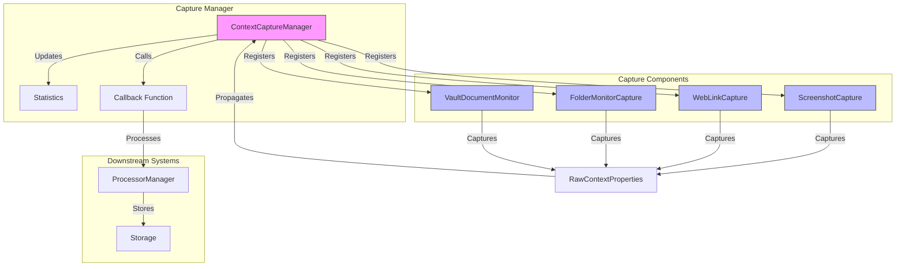
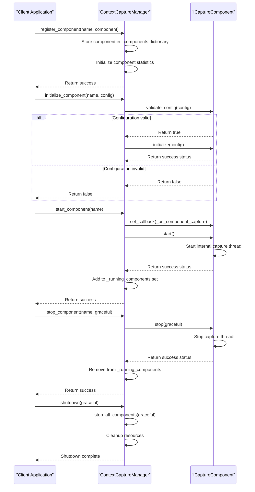
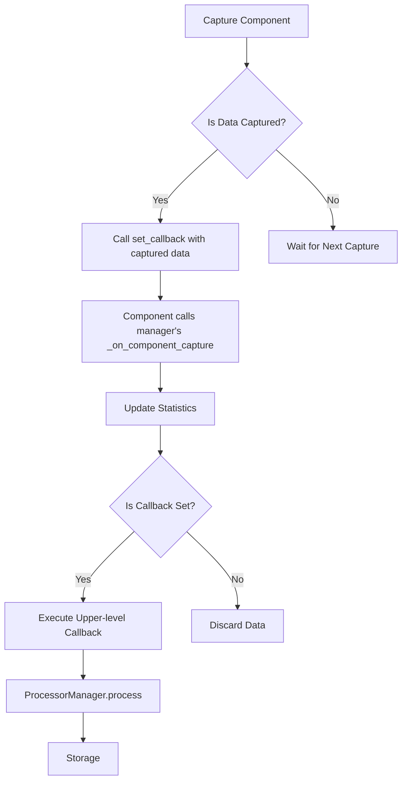
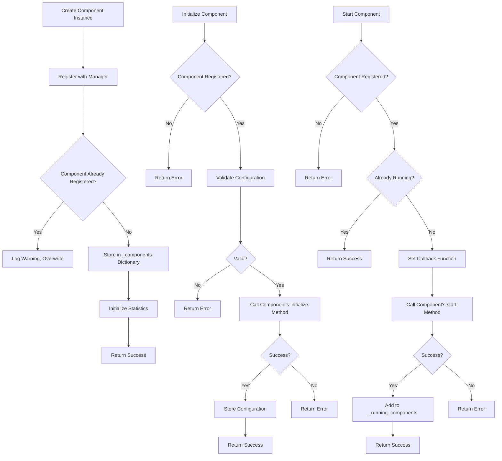

# Capture Manager

<cite>
**Referenced Files in This Document**   
- [capture_manager.py](file://opencontext/managers/capture_manager.py)
- [capture_interface.py](file://opencontext/interfaces/capture_interface.py)
- [base.py](file://opencontext/context_capture/base.py)
- [screenshot.py](file://opencontext/context_capture/screenshot.py)
- [web_link_capture.py](file://opencontext/context_capture/web_link_capture.py)
- [folder_monitor.py](file://opencontext/context_capture/folder_monitor.py)
- [vault_document_monitor.py](file://opencontext/context_capture/vault_document_monitor.py)
- [context.py](file://opencontext/models/context.py)
- [monitor.py](file://opencontext/monitoring/monitor.py)
</cite>

## Table of Contents
1. [Introduction](#introduction)
2. [Architecture Overview](#architecture-overview)
3. [Core Components](#core-components)
4. [Lifecycle Management](#lifecycle-management)
5. [Callback Mechanism](#callback-mechanism)
6. [Statistics Tracking System](#statistics-tracking-system)
7. [Component Registration and Initialization](#component-registration-and-initialization)
8. [Performance Optimization and Troubleshooting](#performance-optimization-and-troubleshooting)
9. [Conclusion](#conclusion)

## Introduction
The Capture Manager is a central component responsible for orchestrating context capture operations in the MineContext system. It manages multiple capture components such as screenshot, document, and web link capturers through a unified interface. The manager provides lifecycle control, statistics tracking, and data propagation mechanisms to downstream processors. This document details the architecture, implementation, and usage patterns of the Capture Manager, focusing on its role in coordinating context capture components and ensuring reliable data flow through the system.

## Architecture Overview



**Diagram sources**
- [capture_manager.py](file://opencontext/managers/capture_manager.py#L23-L391)
- [capture_interface.py](file://opencontext/interfaces/capture_interface.py#L18-L153)

## Core Components

The Capture Manager system consists of several key components that work together to capture and process contextual data. The core is the `ContextCaptureManager` class which coordinates all capture operations. It interacts with various capture components through the `ICaptureComponent` interface, ensuring loose coupling and extensibility.

The capture components include:
- **ScreenshotCapture**: Periodically captures screenshots from the user's screen
- **WebLinkCapture**: Captures and processes web content from URLs
- **FolderMonitorCapture**: Monitors local folders for document changes
- **VaultDocumentMonitor**: Monitors changes in the vaults database table

Each component implements the `ICaptureComponent` interface, providing a consistent API for initialization, starting, stopping, and capturing data. The components are designed to be thread-safe and can operate independently while being managed by the central Capture Manager.

**Section sources**
- [capture_manager.py](file://opencontext/managers/capture_manager.py#L23-L391)
- [capture_interface.py](file://opencontext/interfaces/capture_interface.py#L18-L153)
- [base.py](file://opencontext/context_capture/base.py#L26-L515)

## Lifecycle Management

The Capture Manager provides comprehensive lifecycle management for capture components through a well-defined sequence of operations. Components must be registered, initialized, started, and eventually stopped or unregistered in a controlled manner.



**Diagram sources**
- [capture_manager.py](file://opencontext/managers/capture_manager.py#L51-L207)
- [base.py](file://opencontext/context_capture/base.py#L94-L164)

### Registration and Initialization
Components are first registered with the manager using the `register_component` method, which stores the component instance in an internal dictionary. During initialization, the manager validates the component's configuration using the component's `validate_config` method before calling its `initialize` method. This two-step process ensures that only properly configured components are activated.

### Start and Stop Operations
Starting a component involves setting up the callback mechanism and invoking the component's `start` method. The manager maintains a set of running components to prevent duplicate startups. When stopping a component, the manager supports both graceful and immediate shutdown modes. Graceful shutdown allows ongoing capture operations to complete before termination, while immediate shutdown stops the component as quickly as possible.

### Graceful Shutdown Procedures
The manager provides a `shutdown` method that stops all running components in a controlled manner. It calls `stop_all_components` with the specified graceful parameter, ensuring that all capture threads are properly terminated before the manager itself shuts down. This prevents resource leaks and ensures data consistency.

**Section sources**
- [capture_manager.py](file://opencontext/managers/capture_manager.py#L51-L232)
- [base.py](file://opencontext/context_capture/base.py#L94-L164)

## Callback Mechanism

The Capture Manager implements a robust callback mechanism that propagates captured `RawContextProperties` to downstream processors. This mechanism ensures that captured data is efficiently delivered to the processing pipeline without blocking the capture operations.



**Diagram sources**
- [capture_manager.py](file://opencontext/managers/capture_manager.py#L273-L311)
- [base.py](file://opencontext/context_capture/base.py#L206-L213)

The callback chain begins when a capture component calls its internal callback function (set by the manager during startup). This triggers the manager's `_on_component_capture` method, which first updates statistics and then invokes the upper-level callback if one is registered. The upper-level callback typically points to the `ProcessorManager`'s processing function, which handles the subsequent processing and storage of the captured context.

This design ensures loose coupling between the capture and processing systems. The capture components only need to know about the callback interface, while the manager handles the details of statistics tracking and data propagation. The callback mechanism is thread-safe, using appropriate locking mechanisms to prevent race conditions when multiple components are capturing data simultaneously.

**Section sources**
- [capture_manager.py](file://opencontext/managers/capture_manager.py#L264-L311)
- [base.py](file://opencontext/context_capture/base.py#L206-L213)

## Statistics Tracking System

The Capture Manager includes a comprehensive statistics tracking system that monitors capture frequency, success rates, and error counts for each component. This system provides valuable insights into the performance and reliability of the capture operations.

```mermaid
classDiagram
class ContextCaptureManager {
-_statistics : Dict[str, Any]
+get_statistics() Dict[str, Any]
+reset_statistics() None
}
class ICaptureComponent {
+get_statistics() Dict[str, Any]
+reset_statistics() bool
}
class BaseCaptureComponent {
-_capture_count : int
-_error_count : int
-_last_error : str
-_last_capture_time : datetime
+get_statistics() Dict[str, Any]
+reset_statistics() bool
}
ContextCaptureManager --> ICaptureComponent : "manages"
BaseCaptureComponent <|-- ScreenshotCapture
BaseCaptureComponent <|-- WebLinkCapture
BaseCaptureComponent <|-- FolderMonitorCapture
BaseCaptureComponent <|-- VaultDocumentMonitor
ICaptureComponent <|-- BaseCaptureComponent
note right of ContextCaptureManager
Tracks global statistics :
- total_captures
- total_contexts_captured
- errors
- last_capture_time
Per-component statistics :
- captures
- contexts_captured
- errors
- last_capture_time
end note
note right of BaseCaptureComponent
Tracks component-specific statistics :
- capture_count
- error_count
- last_error
- uptime
end note
```

**Diagram sources**
- [capture_manager.py](file://opencontext/managers/capture_manager.py#L42-L49)
- [base.py](file://opencontext/context_capture/base.py#L338-L386)

The statistics system maintains both global and per-component metrics. Global statistics include the total number of captures, total contexts captured, overall error count, and timestamp of the last capture. Each component also has its own statistics, including individual capture counts, error counts, and last capture time.

The system is designed to be extensible, allowing individual components to add custom statistics through their `_get_statistics_impl` method. For example, the `ScreenshotCapture` component tracks the number of screenshots taken, while the `WebLinkCapture` component tracks the number of URLs converted.

Statistics can be retrieved using the `get_statistics` method and reset using the `reset_statistics` method. The manager also automatically updates statistics when captures occur or errors are encountered, providing real-time monitoring capabilities.

**Section sources**
- [capture_manager.py](file://opencontext/managers/capture_manager.py#L42-L49)
- [base.py](file://opencontext/context_capture/base.py#L338-L386)

## Component Registration and Initialization

Registering and initializing capture components follows a standardized process that ensures consistency across different component types. The process involves several steps that validate configurations and establish proper component state before activation.



**Diagram sources**
- [capture_manager.py](file://opencontext/managers/capture_manager.py#L51-L172)
- [base.py](file://opencontext/context_capture/base.py#L57-L93)

### Registering a New Capture Component
To register a new capture component, the client creates an instance of the component class and calls the manager's `register_component` method with a unique name and the component instance. The manager stores the component in its internal dictionary and initializes statistics for it. If a component with the same name already exists, it is overwritten with a warning message.

### Handling Captured Data
Once components are registered and started, they automatically capture data according to their configuration and report it through the callback chain. The following example demonstrates how to set up a callback to handle captured data:

```python
def handle_captured_data(contexts):
    for context in contexts:
        print(f"Captured {context.source} data at {context.create_time}")
        # Process the captured context as needed
        # This could involve storing in database, sending to processor, etc.

# Set the callback function
capture_manager.set_callback(handle_captured_data)
```

This callback function will be invoked whenever any capture component reports new data, receiving a list of `RawContextProperties` objects that contain the captured context information.

**Section sources**
- [capture_manager.py](file://opencontext/managers/capture_manager.py#L51-L172)
- [base.py](file://opencontext/context_capture/base.py#L57-L93)

## Performance Optimization and Troubleshooting

### Common Issues and Solutions

#### Component Initialization Failures
Initialization failures typically occur due to invalid configuration parameters. The system validates configurations through the `validate_config` method before initialization. Common issues include:
- Invalid capture intervals (must be ≥ 0.1 seconds)
- Incorrect file paths or permissions
- Missing required dependencies (e.g., mss library for screenshots)

To troubleshoot initialization failures, check the component's `validate_config` implementation and ensure all configuration parameters meet the required constraints.

#### Thread Management in Capture Components
Capture components use background threads for periodic operations, which can lead to thread management issues. The base class handles thread lifecycle through the `_capture_thread` and `_stop_event` mechanisms. Key considerations include:
- Using daemon threads to prevent the application from hanging
- Properly joining threads during shutdown
- Using threading events for clean thread termination

#### Handling Duplicate Registrations
The system allows duplicate registrations but logs a warning when overwriting an existing component. To avoid unintended overwrites, ensure component names are unique and follow a consistent naming convention.

### Performance Optimization Tips

#### High-Frequency Capture Scenarios
For high-frequency capture scenarios, consider the following optimizations:
- Adjust capture intervals to balance data granularity with system load
- Implement efficient data processing pipelines to handle high throughput
- Use batch processing where possible to reduce overhead

#### Memory Management During Prolonged Operation
To manage memory during prolonged operation:
- Regularly monitor and reset statistics to prevent unbounded growth
- Implement proper cleanup of temporary files and cached data
- Use streaming processing for large data captures to avoid memory accumulation

The Capture Manager and its components are designed with performance and reliability in mind, providing the necessary tools and patterns to handle demanding capture scenarios while maintaining system stability.

**Section sources**
- [capture_manager.py](file://opencontext/managers/capture_manager.py#L366-L375)
- [base.py](file://opencontext/context_capture/base.py#L114-L122)
- [screenshot.py](file://opencontext/context_capture/screenshot.py#L75-L76)

## Conclusion
The Capture Manager provides a robust framework for orchestrating context capture components in the MineContext system. Through its well-defined interface and comprehensive management capabilities, it enables reliable capture of various context types including screenshots, documents, and web links. The manager's lifecycle management, callback mechanism, and statistics tracking system work together to ensure efficient data flow from capture to processing. By following the patterns and best practices outlined in this document, developers can effectively extend and optimize the capture system for various use cases and performance requirements.