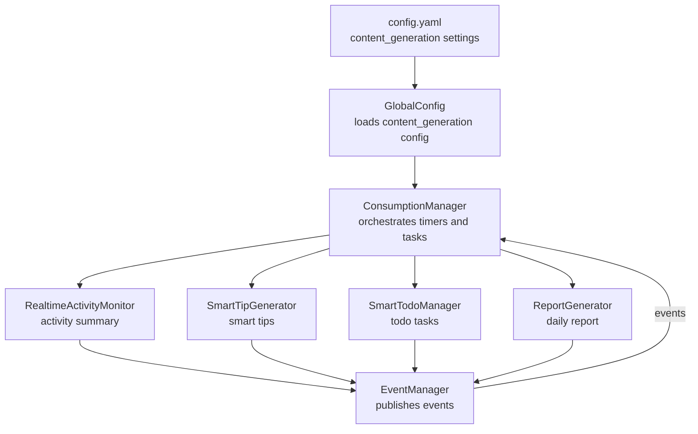
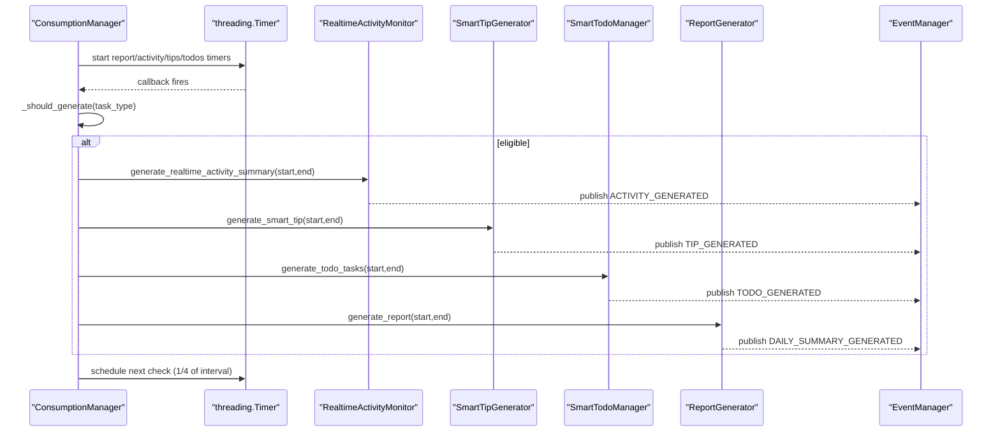
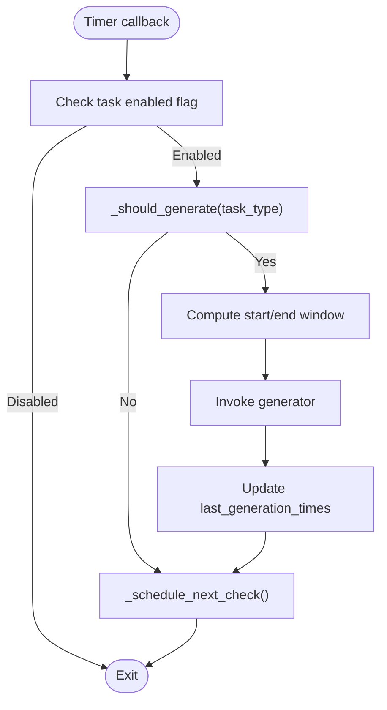
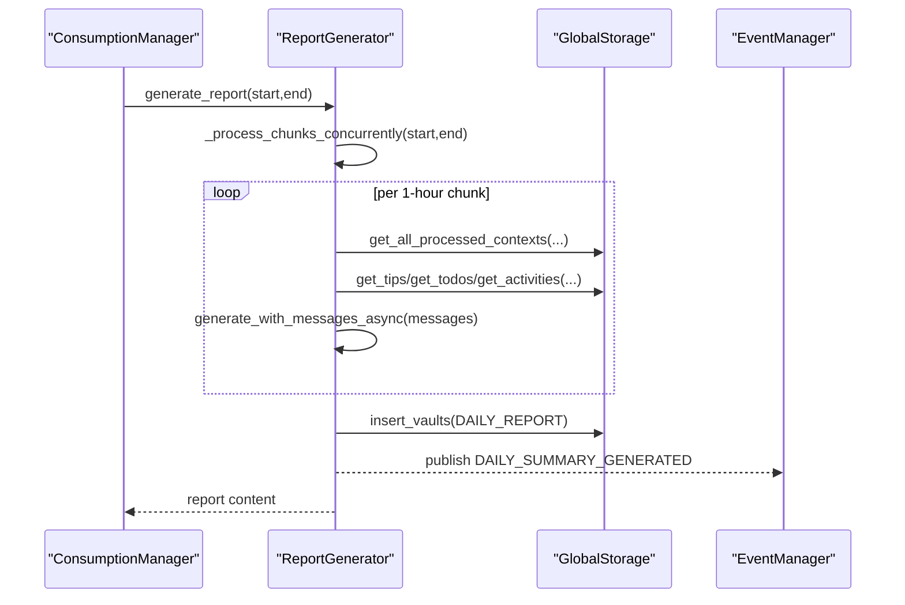
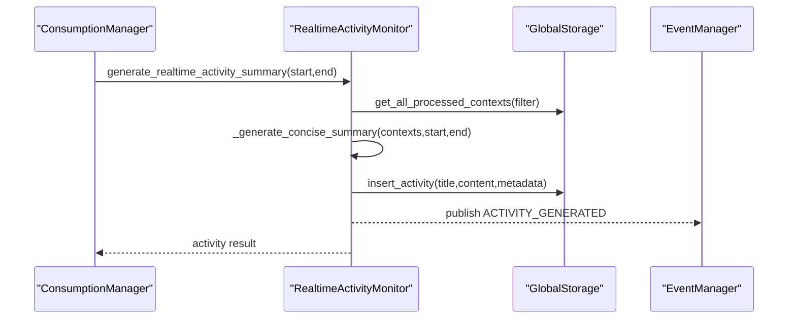
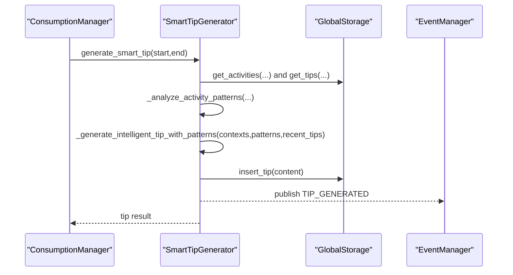
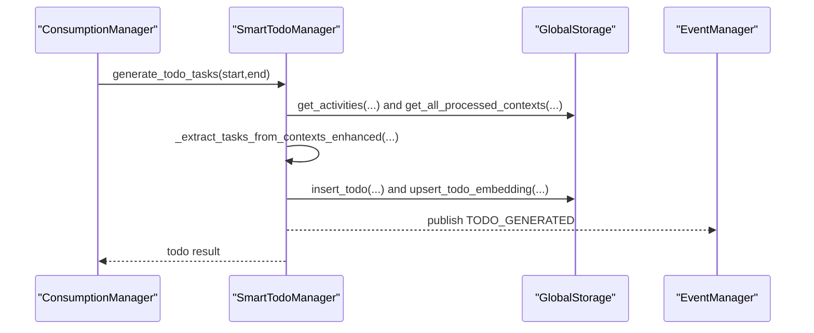
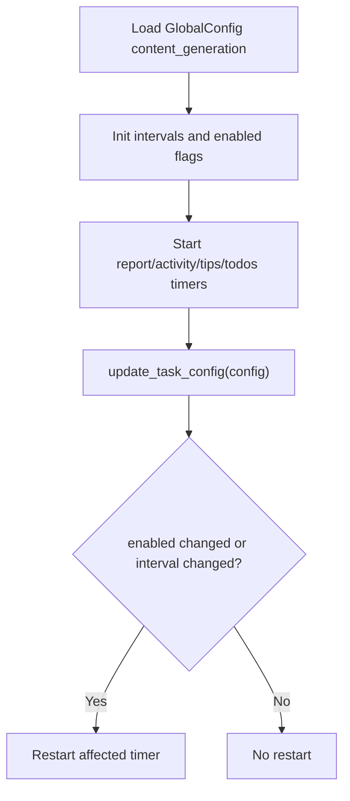
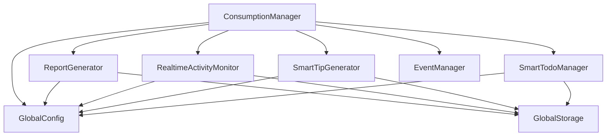

# Consumption Manager

<cite>
**Referenced Files in This Document**
- [consumption_manager.py](file://opencontext/managers/consumption_manager.py)
- [generation_report.py](file://opencontext/context_consumption/generation/generation_report.py)
- [realtime_activity_monitor.py](file://opencontext/context_consumption/generation/realtime_activity_monitor.py)
- [smart_tip_generator.py](file://opencontext/context_consumption/generation/smart_tip_generator.py)
- [smart_todo_manager.py](file://opencontext/context_consumption/generation/smart_todo_manager.py)
- [event_manager.py](file://opencontext/managers/event_manager.py)
- [global_config.py](file://opencontext/config/global_config.py)
- [config.yaml](file://config/config.yaml)
</cite>

## Table of Contents
1. [Introduction](#introduction)
2. [Project Structure](#project-structure)
3. [Core Components](#core-components)
4. [Architecture Overview](#architecture-overview)
5. [Detailed Component Analysis](#detailed-component-analysis)
6. [Dependency Analysis](#dependency-analysis)
7. [Performance Considerations](#performance-considerations)
8. [Troubleshooting Guide](#troubleshooting-guide)
9. [Conclusion](#conclusion)
10. [Appendices](#appendices)

## Introduction
This document explains the Consumption Manager and how it orchestrates scheduled tasks to produce AI-powered insights from processed context. It covers:
- How ConsumptionManager coordinates activity summaries, smart tips, todo generation, and daily reports
- Timer-based scheduling with configurable intervals and logic for deciding when to generate new content
- Integration with ReportGenerator, RealtimeActivityMonitor, SmartTipGenerator, and SmartTodoManager
- Configuration management for dynamic updates to task schedules and enabling/disabling features
- Practical guidance for starting tasks, updating intervals at runtime, and resolving common issues
- Performance optimization tips to balance insight freshness with system resource usage

## Project Structure
The Consumption Manager resides in the consumption layer and coordinates multiple generation components. It reads configuration from the global configuration system and uses threading timers to schedule periodic tasks. The generation components interact with storage and LLM clients to produce insights and persist results.

**Diagram sources**
- [consumption_manager.py](file://opencontext/managers/consumption_manager.py#L31-L120)
- [generation_report.py](file://opencontext/context_consumption/generation/generation_report.py#L26-L74)
- [realtime_activity_monitor.py](file://opencontext/context_consumption/generation/realtime_activity_monitor.py#L54-L122)
- [smart_tip_generator.py](file://opencontext/context_consumption/generation/smart_tip_generator.py#L40-L87)
- [smart_todo_manager.py](file://opencontext/context_consumption/generation/smart_todo_manager.py#L46-L132)
- [global_config.py](file://opencontext/config/global_config.py#L23-L113)
- [config.yaml](file://config/config.yaml#L216-L239)
- [event_manager.py](file://opencontext/managers/event_manager.py#L25-L117)

**Section sources**
- [consumption_manager.py](file://opencontext/managers/consumption_manager.py#L31-L120)
- [global_config.py](file://opencontext/config/global_config.py#L23-L113)
- [config.yaml](file://config/config.yaml#L216-L239)

## Core Components
- ConsumptionManager: Central scheduler and coordinator for content generation tasks. It loads configuration, starts/stops timers, determines generation eligibility, and updates schedules dynamically.
- ReportGenerator: Asynchronously builds daily reports by aggregating hourly summaries and persisting the result.
- RealtimeActivityMonitor: Produces activity summaries from recent processed contexts and publishes an activity-generated event.
- SmartTipGenerator: Creates personalized tips by analyzing recent activity patterns and context, and publishes a tip-generated event.
- SmartTodoManager: Extracts actionable tasks from recent activity insights and context, deduplicates with vector similarity, persists todos, and publishes a todo-generated event.
- EventManager: Publishes and caches generation events for downstream consumers.
- GlobalConfig and config.yaml: Provide centralized configuration for content generation intervals and daily report time.

Key responsibilities:
- ConsumptionManager maintains per-task intervals, last-generation timestamps, and a timer map. It calculates check intervals (1/4 of generation interval with limits) and schedules recurring checks.
- Each generator component encapsulates its own prompt usage, context retrieval, LLM calls, persistence, and event publishing.

**Section sources**
- [consumption_manager.py](file://opencontext/managers/consumption_manager.py#L31-L120)
- [generation_report.py](file://opencontext/context_consumption/generation/generation_report.py#L26-L74)
- [realtime_activity_monitor.py](file://opencontext/context_consumption/generation/realtime_activity_monitor.py#L54-L122)
- [smart_tip_generator.py](file://opencontext/context_consumption/generation/smart_tip_generator.py#L40-L87)
- [smart_todo_manager.py](file://opencontext/context_consumption/generation/smart_todo_manager.py#L46-L132)
- [event_manager.py](file://opencontext/managers/event_manager.py#L25-L117)
- [global_config.py](file://opencontext/config/global_config.py#L23-L113)
- [config.yaml](file://config/config.yaml#L216-L239)

## Architecture Overview
ConsumptionManager initializes generators and reads content_generation settings from GlobalConfig. It starts timers for:
- Daily report at a configured time-of-day
- Activity summary at a configurable interval
- Tips at a configurable interval
- Todos at a configurable interval

Each timer triggers a callback that checks eligibility (elapsed time vs interval), computes time windows, invokes the respective generator, updates last-generation timestamps, and reschedules the next check.

**Diagram sources**
- [consumption_manager.py](file://opencontext/managers/consumption_manager.py#L112-L171)
- [consumption_manager.py](file://opencontext/managers/consumption_manager.py#L243-L356)
- [consumption_manager.py](file://opencontext/managers/consumption_manager.py#L358-L371)
- [realtime_activity_monitor.py](file://opencontext/context_consumption/generation/realtime_activity_monitor.py#L60-L122)
- [smart_tip_generator.py](file://opencontext/context_consumption/generation/smart_tip_generator.py#L46-L87)
- [smart_todo_manager.py](file://opencontext/context_consumption/generation/smart_todo_manager.py#L52-L132)
- [generation_report.py](file://opencontext/context_consumption/generation/generation_report.py#L34-L74)
- [event_manager.py](file://opencontext/managers/event_manager.py#L25-L117)

## Detailed Component Analysis

### ConsumptionManager
Responsibilities:
- Load configuration from GlobalConfig under content_generation
- Maintain task intervals, enabled flags, last-generation timestamps, and daily report time
- Start/stop timers for report, activity, tips, and todos
- Determine eligibility to generate using elapsed time vs interval
- Dynamically update task configuration and restart affected timers

Key behaviors:
- Eligibility check: compares last generation time with current time and the configured interval
- Check interval calculation: min(interval/4, task-specific cap) to avoid excessive polling
- Daily report scheduling: calculates seconds until target time-of-day and runs periodic checks; prevents duplicate daily generation on the same calendar day
- Dynamic updates: supports toggling enabled flags and updating intervals; restarts timers when needed

Runtime configuration:
- start_scheduled_tasks(config): accepts daily_report_time and per-task intervals to override defaults
- update_task_config(config): updates activity/tips/todos intervals and report time/enabled flags; restarts timers if necessary

**Diagram sources**
- [consumption_manager.py](file://opencontext/managers/consumption_manager.py#L112-L171)
- [consumption_manager.py](file://opencontext/managers/consumption_manager.py#L243-L356)
- [consumption_manager.py](file://opencontext/managers/consumption_manager.py#L358-L371)

**Section sources**
- [consumption_manager.py](file://opencontext/managers/consumption_manager.py#L31-L120)
- [consumption_manager.py](file://opencontext/managers/consumption_manager.py#L112-L171)
- [consumption_manager.py](file://opencontext/managers/consumption_manager.py#L171-L242)
- [consumption_manager.py](file://opencontext/managers/consumption_manager.py#L243-L356)
- [consumption_manager.py](file://opencontext/managers/consumption_manager.py#L358-L371)
- [consumption_manager.py](file://opencontext/managers/consumption_manager.py#L372-L524)

### ReportGenerator
Responsibilities:
- Asynchronously generate daily reports by processing time chunks and merging summaries
- Persist the report to vaults and publish a daily summary event

Highlights:
- Concurrently processes 1-hour chunks with a semaphore to bound concurrency
- Retrieves contexts, tips, todos, and activities within each chunk
- Uses prompt groups for report generation and merging
- Emits a DAILY_SUMMARY_GENERATED event with persisted report metadata

**Diagram sources**
- [generation_report.py](file://opencontext/context_consumption/generation/generation_report.py#L34-L74)
- [generation_report.py](file://opencontext/context_consumption/generation/generation_report.py#L76-L110)
- [generation_report.py](file://opencontext/context_consumption/generation/generation_report.py#L111-L205)
- [generation_report.py](file://opencontext/context_consumption/generation/generation_report.py#L206-L265)

**Section sources**
- [generation_report.py](file://opencontext/context_consumption/generation/generation_report.py#L26-L74)
- [generation_report.py](file://opencontext/context_consumption/generation/generation_report.py#L76-L110)
- [generation_report.py](file://opencontext/context_consumption/generation/generation_report.py#L111-L205)
- [generation_report.py](file://opencontext/context_consumption/generation/generation_report.py#L206-L265)

### RealtimeActivityMonitor
Responsibilities:
- Produce a concise activity summary from recent processed contexts
- Extract representative context resources (e.g., screenshots) and persist an activity record
- Publish an ACTIVITY_GENERATED event with metadata

Highlights:
- Gathers contexts by type and time window
- Builds a structured prompt and calls the LLM to produce a summary with category distribution and insights
- Saves debug information and increments recording stats after successful generation

**Diagram sources**
- [realtime_activity_monitor.py](file://opencontext/context_consumption/generation/realtime_activity_monitor.py#L60-L122)
- [realtime_activity_monitor.py](file://opencontext/context_consumption/generation/realtime_activity_monitor.py#L134-L245)
- [realtime_activity_monitor.py](file://opencontext/context_consumption/generation/realtime_activity_monitor.py#L247-L343)

**Section sources**
- [realtime_activity_monitor.py](file://opencontext/context_consumption/generation/realtime_activity_monitor.py#L54-L122)
- [realtime_activity_monitor.py](file://opencontext/context_consumption/generation/realtime_activity_monitor.py#L134-L245)
- [realtime_activity_monitor.py](file://opencontext/context_consumption/generation/realtime_activity_monitor.py#L247-L343)

### SmartTipGenerator
Responsibilities:
- Generate personalized tips by analyzing recent activity patterns and multi-dimensional context
- Avoid repetition by retrieving recent tips
- Persist tips and publish a TIP_GENERATED event

Highlights:
- Analyzes recent activities to compute category distributions, key entities, and work patterns
- Retrieves recent tips to avoid duplicates
- Builds a prompt incorporating context, patterns, and recent tips, then calls the LLM with tools
- Emits a TIP_GENERATED event with tip content

**Diagram sources**
- [smart_tip_generator.py](file://opencontext/context_consumption/generation/smart_tip_generator.py#L46-L87)
- [smart_tip_generator.py](file://opencontext/context_consumption/generation/smart_tip_generator.py#L89-L178)
- [smart_tip_generator.py](file://opencontext/context_consumption/generation/smart_tip_generator.py#L179-L226)
- [smart_tip_generator.py](file://opencontext/context_consumption/generation/smart_tip_generator.py#L227-L304)

**Section sources**
- [smart_tip_generator.py](file://opencontext/context_consumption/generation/smart_tip_generator.py#L40-L87)
- [smart_tip_generator.py](file://opencontext/context_consumption/generation/smart_tip_generator.py#L89-L178)
- [smart_tip_generator.py](file://opencontext/context_consumption/generation/smart_tip_generator.py#L179-L226)
- [smart_tip_generator.py](file://opencontext/context_consumption/generation/smart_tip_generator.py#L227-L304)

### SmartTodoManager
Responsibilities:
- Extract actionable tasks from recent activity insights and context
- Deduplicate tasks using vector similarity against historical and batch tasks
- Persist todos and store embeddings for future deduplication
- Publish a TODO_GENERATED event

Highlights:
- Retrieves recent activity insights and relevant context
- Builds a prompt with historical todos and activity insights, then calls the LLM
- Post-processes tasks to normalize fields and deadlines
- Applies vector-based deduplication and stores embeddings

**Diagram sources**
- [smart_todo_manager.py](file://opencontext/context_consumption/generation/smart_todo_manager.py#L52-L132)
- [smart_todo_manager.py](file://opencontext/context_consumption/generation/smart_todo_manager.py#L134-L222)
- [smart_todo_manager.py](file://opencontext/context_consumption/generation/smart_todo_manager.py#L223-L296)
- [smart_todo_manager.py](file://opencontext/context_consumption/generation/smart_todo_manager.py#L297-L450)

**Section sources**
- [smart_todo_manager.py](file://opencontext/context_consumption/generation/smart_todo_manager.py#L46-L132)
- [smart_todo_manager.py](file://opencontext/context_consumption/generation/smart_todo_manager.py#L134-L222)
- [smart_todo_manager.py](file://opencontext/context_consumption/generation/smart_todo_manager.py#L223-L296)
- [smart_todo_manager.py](file://opencontext/context_consumption/generation/smart_todo_manager.py#L297-L450)

### Configuration Management
ConsumptionManager reads content_generation settings from GlobalConfig and config.yaml:
- activity.enabled and activity.interval
- tips.enabled and tips.interval
- todos.enabled and todos.interval
- report.enabled and report.time

It exposes:
- get_task_config(): returns current configuration
- update_task_config(config): updates intervals and flags, restarting timers when needed
- start_scheduled_tasks(config): starts timers and applies runtime overrides

**Diagram sources**
- [consumption_manager.py](file://opencontext/managers/consumption_manager.py#L53-L73)
- [consumption_manager.py](file://opencontext/managers/consumption_manager.py#L132-L155)
- [consumption_manager.py](file://opencontext/managers/consumption_manager.py#L402-L482)
- [global_config.py](file://opencontext/config/global_config.py#L23-L113)
- [config.yaml](file://config/config.yaml#L216-L239)

**Section sources**
- [consumption_manager.py](file://opencontext/managers/consumption_manager.py#L53-L73)
- [consumption_manager.py](file://opencontext/managers/consumption_manager.py#L132-L155)
- [consumption_manager.py](file://opencontext/managers/consumption_manager.py#L402-L482)
- [global_config.py](file://opencontext/config/global_config.py#L23-L113)
- [config.yaml](file://config/config.yaml#L216-L239)

## Dependency Analysis
- ConsumptionManager depends on:
  - GlobalConfig for configuration
  - ReportGenerator, RealtimeActivityMonitor, SmartTipGenerator, SmartTodoManager for insight generation
  - EventManager for publishing generation events
  - GlobalStorage for persistence and retrieval
- Generators depend on:
  - GlobalConfig for prompt groups
  - GlobalVLMClient for LLM calls
  - GlobalStorage for data access
  - ToolsExecutor for tool-based retrieval (ReportGenerator)
- EventManager provides a thread-safe event cache and supports multiple event types.

**Diagram sources**
- [consumption_manager.py](file://opencontext/managers/consumption_manager.py#L31-L120)
- [generation_report.py](file://opencontext/context_consumption/generation/generation_report.py#L26-L74)
- [realtime_activity_monitor.py](file://opencontext/context_consumption/generation/realtime_activity_monitor.py#L54-L122)
- [smart_tip_generator.py](file://opencontext/context_consumption/generation/smart_tip_generator.py#L40-L87)
- [smart_todo_manager.py](file://opencontext/context_consumption/generation/smart_todo_manager.py#L46-L132)
- [event_manager.py](file://opencontext/managers/event_manager.py#L25-L117)
- [global_config.py](file://opencontext/config/global_config.py#L23-L113)

**Section sources**
- [consumption_manager.py](file://opencontext/managers/consumption_manager.py#L31-L120)
- [event_manager.py](file://opencontext/managers/event_manager.py#L25-L117)

## Performance Considerations
- Timer cadence: ConsumptionManager caps check intervals to 1/4 of the generation interval with per-task limits to reduce overhead while maintaining responsiveness.
- Concurrency control: ReportGenerator uses a semaphore to bound concurrent chunk processing, preventing resource saturation.
- Deduplication cost: SmartTodoManager’s vector-based deduplication adds embedding computation and vector DB queries; tune similarity thresholds and top_k to balance quality and latency.
- I/O batching: Generators retrieve contexts and related artifacts (tips, todos, activities) per chunk; ensure storage queries are efficient and indexed appropriately.
- Event throughput: EventManager caches events; monitor cache size and adjust max cache size if needed to avoid memory pressure.

[No sources needed since this section provides general guidance]

## Troubleshooting Guide
Common issues and resolutions:
- Timer drift: If timers fire slightly late, ConsumptionManager’s eligibility check uses elapsed time vs interval, minimizing drift impact. For strict timing, consider aligning to HH:MM boundaries for daily report and using monotonic time comparisons.
- Missed generation windows: If a task is disabled or the interval is too long, ConsumptionManager will skip generation until the next eligible window. Adjust intervals or enable tasks via update_task_config.
- Resource contention: High concurrency in ReportGenerator or frequent LLM calls can overload the system. Reduce concurrency (semaphore) or increase intervals. Consider rate-limiting LLM calls at the client level.
- Duplicate daily reports: ConsumptionManager tracks last report date and prevents multiple generations per day; ensure the daily report time is correctly configured and that the clock is accurate.
- Storage errors: Generators log exceptions during persistence; verify storage connectivity and permissions. Retry logic is implicit in the generators’ exception handling.

Operational commands:
- Start scheduled tasks with runtime overrides:
  - See [consumption_manager.py](file://opencontext/managers/consumption_manager.py#L132-L155)
- Update intervals at runtime:
  - See [consumption_manager.py](file://opencontext/managers/consumption_manager.py#L402-L482)
- Inspect current configuration:
  - See [consumption_manager.py](file://opencontext/managers/consumption_manager.py#L380-L401)

**Section sources**
- [consumption_manager.py](file://opencontext/managers/consumption_manager.py#L112-L171)
- [consumption_manager.py](file://opencontext/managers/consumption_manager.py#L171-L242)
- [consumption_manager.py](file://opencontext/managers/consumption_manager.py#L243-L356)
- [consumption_manager.py](file://opencontext/managers/consumption_manager.py#L358-L371)
- [consumption_manager.py](file://opencontext/managers/consumption_manager.py#L380-L401)
- [consumption_manager.py](file://opencontext/managers/consumption_manager.py#L402-L482)

## Conclusion
ConsumptionManager provides a robust, configurable orchestration layer for generating AI-powered insights. By leveraging threading timers, per-task eligibility checks, and dynamic configuration updates, it balances freshness and resource usage. Integrations with ReportGenerator, RealtimeActivityMonitor, SmartTipGenerator, and SmartTodoManager deliver diverse insights while emitting standardized events for downstream systems.

[No sources needed since this section summarizes without analyzing specific files]

## Appendices

### Configuration Reference
- content_generation.activity.enabled, interval
- content_generation.tips.enabled, interval
- content_generation.todos.enabled, interval
- content_generation.report.enabled, time

These settings are loaded by GlobalConfig and consumed by ConsumptionManager to initialize and update task schedules.

**Section sources**
- [config.yaml](file://config/config.yaml#L216-L239)
- [global_config.py](file://opencontext/config/global_config.py#L23-L113)
- [consumption_manager.py](file://opencontext/managers/consumption_manager.py#L53-L73)

### Example Usage Paths
- Starting scheduled tasks with runtime overrides:
  - [consumption_manager.py](file://opencontext/managers/consumption_manager.py#L132-L155)
- Updating task configuration dynamically:
  - [consumption_manager.py](file://opencontext/managers/consumption_manager.py#L402-L482)
- Eligibility check logic:
  - [consumption_manager.py](file://opencontext/managers/consumption_manager.py#L112-L127)
- Check interval calculation:
  - [consumption_manager.py](file://opencontext/managers/consumption_manager.py#L358-L364)