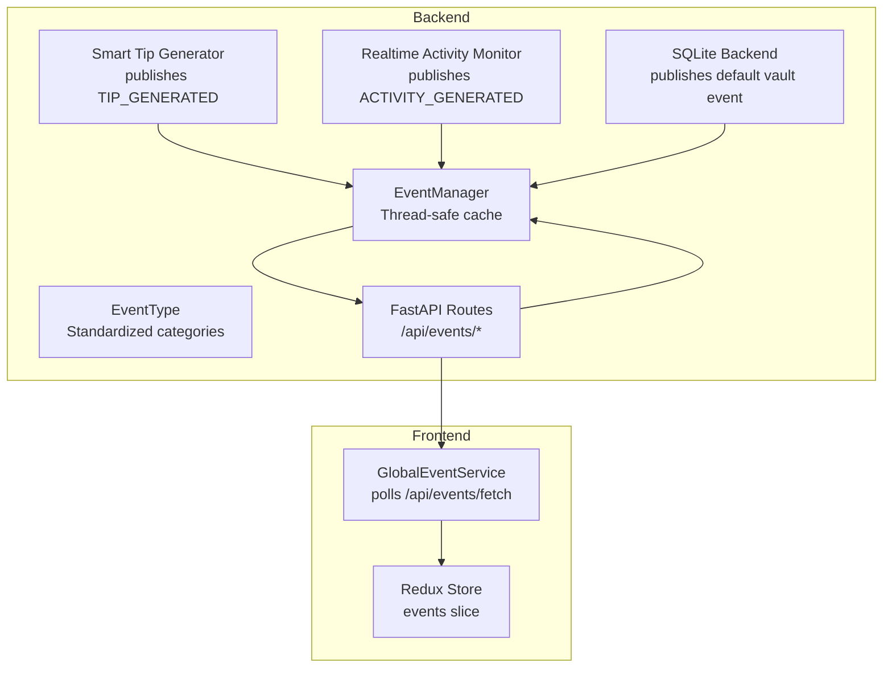
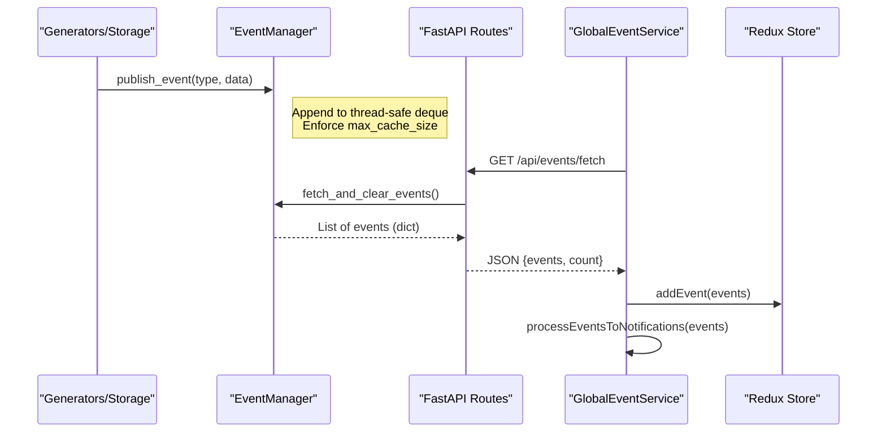
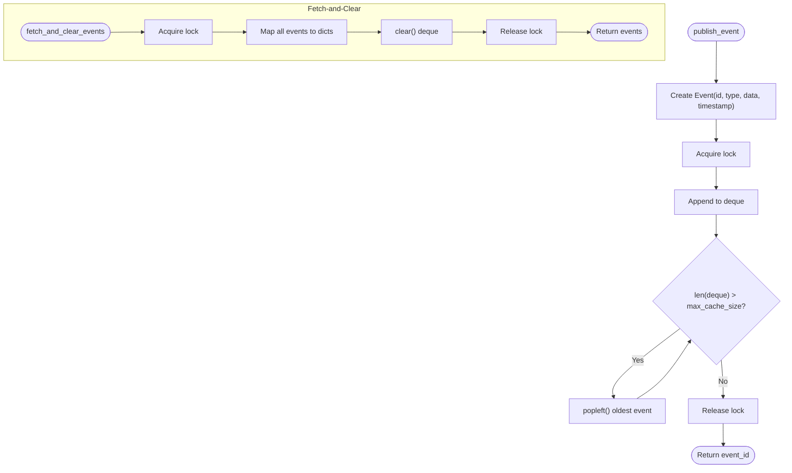
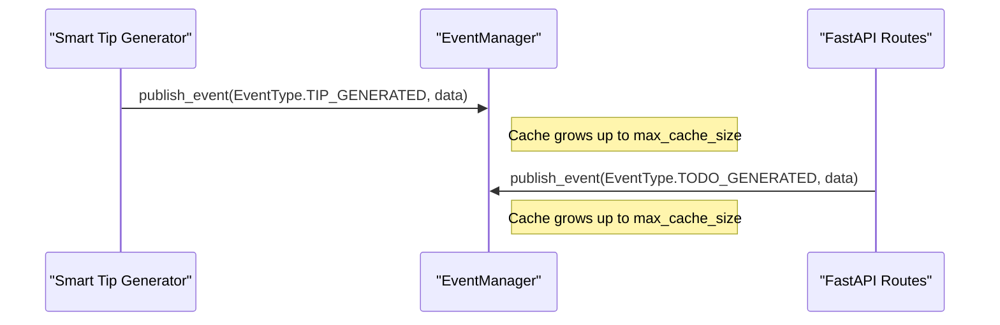
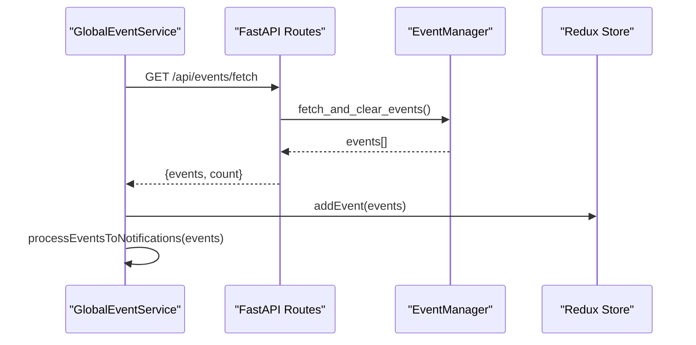
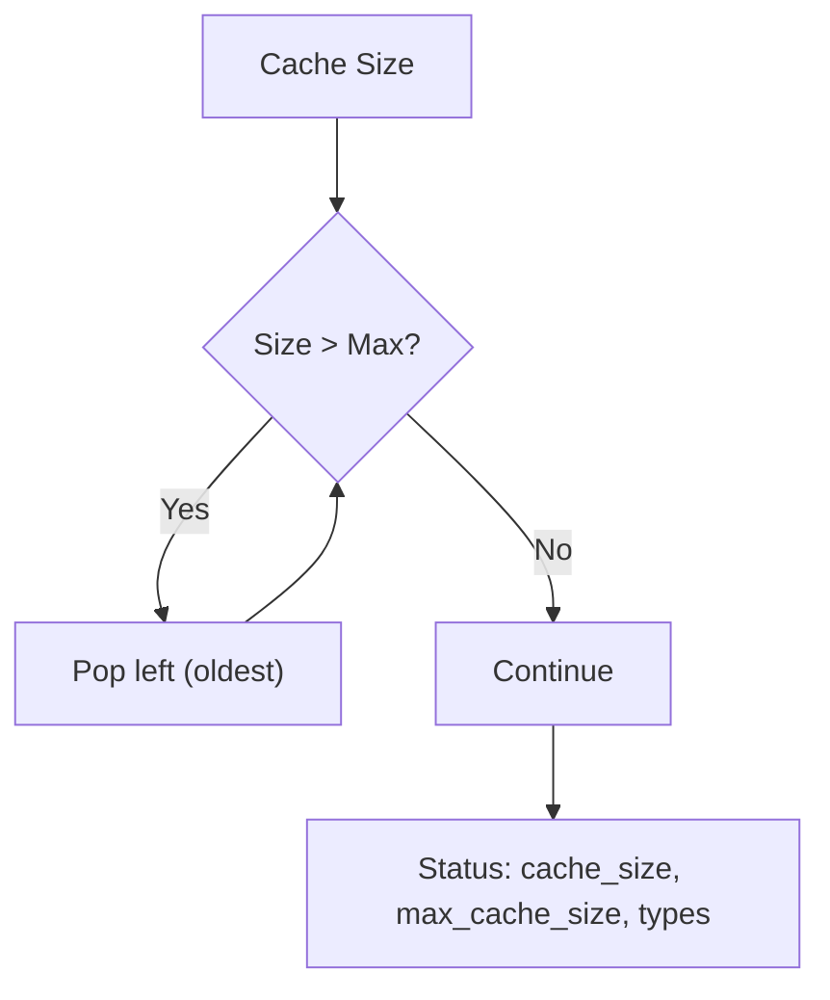
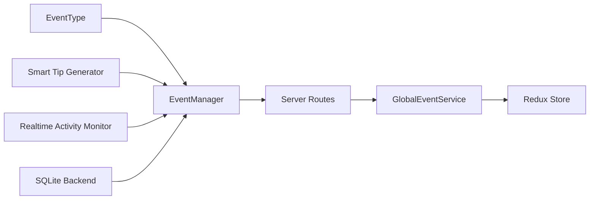

# Event Manager

<cite>
**Referenced Files in This Document**
- [event_manager.py](file://opencontext/managers/event_manager.py)
- [events.py](file://opencontext/server/routes/events.py)
- [smart_tip_generator.py](file://opencontext/context_consumption/generation/smart_tip_generator.py)
- [realtime_activity_monitor.py](file://opencontext/context_consumption/generation/realtime_activity_monitor.py)
- [sqlite_backend.py](file://opencontext/storage/backends/sqlite_backend.py)
- [GlobalEventService.ts](file://frontend/src/renderer/src/services/GlobalEventService.ts)
- [events.ts](file://frontend/src/renderer/src/store/events.ts)
</cite>

## Table of Contents
1. [Introduction](#introduction)
2. [Project Structure](#project-structure)
3. [Core Components](#core-components)
4. [Architecture Overview](#architecture-overview)
5. [Detailed Component Analysis](#detailed-component-analysis)
6. [Dependency Analysis](#dependency-analysis)
7. [Performance Considerations](#performance-considerations)
8. [Troubleshooting Guide](#troubleshooting-guide)
9. [Conclusion](#conclusion)
10. [Appendices](#appendices)

## Introduction
This document explains the Event Manager subsystem responsible for inter-component communication through event broadcasting. It covers how events are standardized via an enumeration, cached in a thread-safe deque, and consumed using a publish/fetch-clear pattern. It also documents the singleton pattern that ensures a single global instance, cache management to prevent memory overflow, status monitoring, and practical guidance for publishing custom events and retrieving batches from the cache. Finally, it addresses common issues such as event loss under high-frequency publishing, thread safety, and cleanup considerations, along with performance optimization tips for high-volume event streams.

## Project Structure
The Event Manager spans backend Python modules, FastAPI routes, and frontend consumers:
- Backend core: EventManager, EventType, and helper functions
- Server routes: HTTP endpoints for publishing and fetching events
- Generators: Smart Tip Generator and Realtime Activity Monitor publish events
- Storage: SQLite backend publishes events on initialization
- Frontend: GlobalEventService polls events and stores them in Redux

**Diagram sources**
- [event_manager.py](file://opencontext/managers/event_manager.py#L25-L117)
- [events.py](file://opencontext/server/routes/events.py#L1-L99)
- [smart_tip_generator.py](file://opencontext/context_consumption/generation/smart_tip_generator.py#L70-L88)
- [realtime_activity_monitor.py](file://opencontext/context_consumption/generation/realtime_activity_monitor.py#L95-L118)
- [sqlite_backend.py](file://opencontext/storage/backends/sqlite_backend.py#L395-L405)
- [GlobalEventService.ts](file://frontend/src/renderer/src/services/GlobalEventService.ts#L39-L76)
- [events.ts](file://frontend/src/renderer/src/store/events.ts#L1-L48)

**Section sources**
- [event_manager.py](file://opencontext/managers/event_manager.py#L25-L117)
- [events.py](file://opencontext/server/routes/events.py#L1-L99)
- [smart_tip_generator.py](file://opencontext/context_consumption/generation/smart_tip_generator.py#L70-L88)
- [realtime_activity_monitor.py](file://opencontext/context_consumption/generation/realtime_activity_monitor.py#L95-L118)
- [sqlite_backend.py](file://opencontext/storage/backends/sqlite_backend.py#L395-L405)
- [GlobalEventService.ts](file://frontend/src/renderer/src/services/GlobalEventService.ts#L39-L76)
- [events.ts](file://frontend/src/renderer/src/store/events.ts#L1-L48)

## Core Components
- EventType: A standardized enumeration of event categories used across the system.
- Event: A dataclass representing a single event with id, type, data payload, and timestamp.
- EventManager: Thread-safe cache backed by a deque, with publish and fetch-and-clear semantics, plus cache status reporting.
- Singleton accessor: get_event_manager() ensures a single global instance.
- Server routes: Expose endpoints to publish and fetch/clear events and to get cache status.
- Frontend consumer: GlobalEventService polls events and stores them in Redux.

**Section sources**
- [event_manager.py](file://opencontext/managers/event_manager.py#L25-L117)
- [events.py](file://opencontext/server/routes/events.py#L1-L99)
- [GlobalEventService.ts](file://frontend/src/renderer/src/services/GlobalEventService.ts#L39-L76)
- [events.ts](file://frontend/src/renderer/src/store/events.ts#L1-L48)

## Architecture Overview
The Event Manager implements a publish/fetch-clear pattern:
- Publishers (generators, storage backend) call publish_event() to enqueue events.
- Consumers (frontend) poll /api/events/fetch to receive all queued events and clear the cache.
- Status endpoint /api/events/status reports cache metrics.

**Diagram sources**
- [event_manager.py](file://opencontext/managers/event_manager.py#L63-L99)
- [events.py](file://opencontext/server/routes/events.py#L30-L47)
- [GlobalEventService.ts](file://frontend/src/renderer/src/services/GlobalEventService.ts#L55-L76)
- [events.ts](file://frontend/src/renderer/src/store/events.ts#L20-L32)

## Detailed Component Analysis

### EventType Enumeration
EventType defines standardized categories used by publishers and consumers:
- TIP_GENERATED
- TODO_GENERATED
- ACTIVITY_GENERATED
- DAILY_SUMMARY_GENERATED
- WEEKLY_SUMMARY_GENERATED
- SYSTEM_STATUS

These values are used consistently across generators, storage, and routes.

**Section sources**
- [event_manager.py](file://opencontext/managers/event_manager.py#L25-L34)

### Event Data Model
Event encapsulates:
- id: Unique identifier
- type: EventType
- data: Arbitrary payload
- timestamp: Unix epoch seconds

It provides to_dict() for serialization.

**Section sources**
- [event_manager.py](file://opencontext/managers/event_manager.py#L36-L53)

### EventManager: Thread-Safe Deque Cache
- Thread safety: Uses a threading.Lock to guard all cache mutations.
- Cache: deque[Event] with a fixed max_cache_size.
- Publish: Creates a new Event with UUID and timestamp, appends to cache, trims overflow by popping left.
- Fetch-and-clear: Returns all current events as dictionaries and clears the cache.
- Status: Reports cache_size, max_cache_size, and supported event types.

**Diagram sources**
- [event_manager.py](file://opencontext/managers/event_manager.py#L55-L99)

**Section sources**
- [event_manager.py](file://opencontext/managers/event_manager.py#L55-L99)

### Singleton Pattern via get_event_manager()
A module-level global ensures a single EventManager instance is reused across the application. The function lazily initializes the instance if absent.

**Section sources**
- [event_manager.py](file://opencontext/managers/event_manager.py#L102-L112)

### Publishing Custom Events
There are two primary ways to publish:
- Directly via EventManager.publish_event(event_type, data)
- Via helper publish_event(event_type, data) which delegates to the singleton

Publishers include:
- Smart Tip Generator: publishes TIP_GENERATED
- Realtime Activity Monitor: publishes ACTIVITY_GENERATED
- SQLite Backend: publishes a default vault creation event

**Diagram sources**
- [smart_tip_generator.py](file://opencontext/context_consumption/generation/smart_tip_generator.py#L70-L88)
- [realtime_activity_monitor.py](file://opencontext/context_consumption/generation/realtime_activity_monitor.py#L95-L118)
- [sqlite_backend.py](file://opencontext/storage/backends/sqlite_backend.py#L395-L405)
- [events.py](file://opencontext/server/routes/events.py#L65-L99)

**Section sources**
- [smart_tip_generator.py](file://opencontext/context_consumption/generation/smart_tip_generator.py#L70-L88)
- [realtime_activity_monitor.py](file://opencontext/context_consumption/generation/realtime_activity_monitor.py#L95-L118)
- [sqlite_backend.py](file://opencontext/storage/backends/sqlite_backend.py#L395-L405)
- [events.py](file://opencontext/server/routes/events.py#L65-L99)

### Consuming Events: Fetch-and-Clear Pattern
Consumers poll /api/events/fetch to retrieve all queued events and clear the cache. The frontend service:
- Periodically requests events
- Dispatches addEvent to Redux
- Converts events to notifications and enqueues them

**Diagram sources**
- [events.py](file://opencontext/server/routes/events.py#L30-L47)
- [GlobalEventService.ts](file://frontend/src/renderer/src/services/GlobalEventService.ts#L55-L76)
- [events.ts](file://frontend/src/renderer/src/store/events.ts#L20-L32)

**Section sources**
- [events.py](file://opencontext/server/routes/events.py#L30-L47)
- [GlobalEventService.ts](file://frontend/src/renderer/src/services/GlobalEventService.ts#L55-L76)
- [events.ts](file://frontend/src/renderer/src/store/events.ts#L20-L32)

### Cache Management and Status Monitoring
- Cache trimming: On publish, if cache exceeds max_cache_size, the oldest events are popped from the left.
- Status endpoint: Returns cache_size, max_cache_size, and supported event types.
- Frontend polling: GlobalEventService polls every 30 seconds by default.

**Diagram sources**
- [event_manager.py](file://opencontext/managers/event_manager.py#L59-L99)
- [events.py](file://opencontext/server/routes/events.py#L49-L63)
- [GlobalEventService.ts](file://frontend/src/renderer/src/services/GlobalEventService.ts#L12-L20)

**Section sources**
- [event_manager.py](file://opencontext/managers/event_manager.py#L59-L99)
- [events.py](file://opencontext/server/routes/events.py#L49-L63)
- [GlobalEventService.ts](file://frontend/src/renderer/src/services/GlobalEventService.ts#L12-L20)

## Dependency Analysis
- EventManager depends on EventType and threading.Lock for thread safety.
- Generators depend on EventManager to publish events.
- Storage backend depends on EventManager to publish initial events.
- Server routes depend on EventManager for publish/fetch/status.
- Frontend depends on server routes for event consumption.

**Diagram sources**
- [event_manager.py](file://opencontext/managers/event_manager.py#L25-L117)
- [events.py](file://opencontext/server/routes/events.py#L1-L99)
- [smart_tip_generator.py](file://opencontext/context_consumption/generation/smart_tip_generator.py#L70-L88)
- [realtime_activity_monitor.py](file://opencontext/context_consumption/generation/realtime_activity_monitor.py#L95-L118)
- [sqlite_backend.py](file://opencontext/storage/backends/sqlite_backend.py#L395-L405)
- [GlobalEventService.ts](file://frontend/src/renderer/src/services/GlobalEventService.ts#L39-L76)
- [events.ts](file://frontend/src/renderer/src/store/events.ts#L1-L48)

**Section sources**
- [event_manager.py](file://opencontext/managers/event_manager.py#L25-L117)
- [events.py](file://opencontext/server/routes/events.py#L1-L99)
- [smart_tip_generator.py](file://opencontext/context_consumption/generation/smart_tip_generator.py#L70-L88)
- [realtime_activity_monitor.py](file://opencontext/context_consumption/generation/realtime_activity_monitor.py#L95-L118)
- [sqlite_backend.py](file://opencontext/storage/backends/sqlite_backend.py#L395-L405)
- [GlobalEventService.ts](file://frontend/src/renderer/src/services/GlobalEventService.ts#L39-L76)
- [events.ts](file://frontend/src/renderer/src/store/events.ts#L1-L48)

## Performance Considerations
- Cache sizing: max_cache_size is set to a fixed value; tune it according to expected peak throughput and retention needs.
- Fetch-and-clear batching: Consumers should poll at intervals appropriate to event volume to minimize overhead while keeping latency low.
- Payload size: Keep event.data minimal to reduce memory footprint and serialization cost.
- Threading: The lock protects cache operations; avoid long operations inside locked regions.
- Frontend polling cadence: Adjust polling interval to balance responsiveness and network load.
- Memory pressure: If event volume spikes persistently, consider increasing max_cache_size or offloading older events to persistent storage.

[No sources needed since this section provides general guidance]

## Troubleshooting Guide
Common issues and resolutions:
- Event loss under high-frequency publishing
  - Cause: Cache overflow trims oldest events when exceeding max_cache_size.
  - Mitigation: Increase max_cache_size or reduce event frequency; ensure consumers poll frequently.
  - Evidence: Overflow warning logs during publish when cache exceeds capacity.
- Thread safety concerns
  - Cause: Concurrent publish/fetch operations without synchronization.
  - Mitigation: Use the provided lock; avoid manual deque manipulation outside EventManager.
- Proper cleanup of event references
  - Cause: Large payloads or frequent events can inflate memory.
  - Mitigation: Trim payloads; rely on fetch-and-clear to release references; monitor cache_size via status endpoint.
- Consumer lag
  - Cause: Polling interval too long or backend overload.
  - Mitigation: Shorten polling interval; ensure server routes are responsive; monitor status for cache growth.

**Section sources**
- [event_manager.py](file://opencontext/managers/event_manager.py#L63-L99)
- [events.py](file://opencontext/server/routes/events.py#L30-L63)

## Conclusion
The Event Manager provides a robust, thread-safe, and standardized event broadcasting mechanism. By enforcing a publish/fetch-clear pattern, it decouples producers (generators, storage) from consumers (frontend), enabling scalable and observable inter-component communication. The singleton pattern guarantees a single global instance, while cache management and status monitoring help maintain system stability under varying loads.

[No sources needed since this section summarizes without analyzing specific files]

## Appendices

### How to Publish a Custom Event
- Choose or extend EventType to represent your event category.
- Use the singleton accessor to publish:
  - From Python: call publish_event(EventType.YOUR_TYPE, data)
  - Or directly: EventManager.publish_event(EventType.YOUR_TYPE, data)

References:
- [event_manager.py](file://opencontext/managers/event_manager.py#L106-L117)
- [events.py](file://opencontext/server/routes/events.py#L65-L99)

### How to Retrieve a Batch of Events from the Cache
- Poll the fetch endpoint to receive all queued events and clear the cache:
  - GET /api/events/fetch
- The response includes events[], count, and message.

References:
- [events.py](file://opencontext/server/routes/events.py#L30-L47)
- [GlobalEventService.ts](file://frontend/src/renderer/src/services/GlobalEventService.ts#L55-L76)
- [events.ts](file://frontend/src/renderer/src/store/events.ts#L20-L32)

### Status Monitoring
- GET /api/events/status returns cache_size, max_cache_size, and supported_event_types.

References:
- [events.py](file://opencontext/server/routes/events.py#L49-L63)
- [event_manager.py](file://opencontext/managers/event_manager.py#L90-L100)