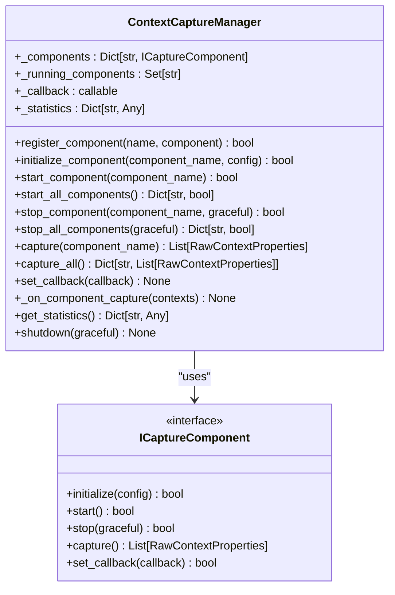
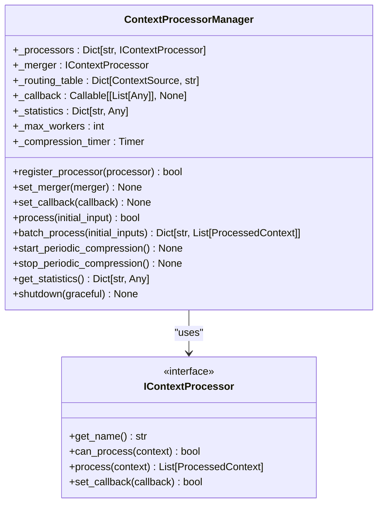
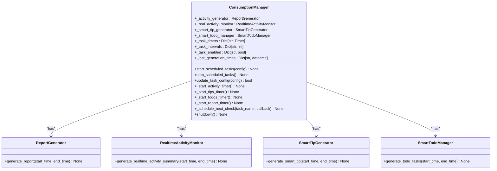
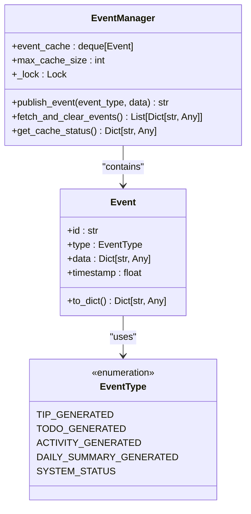
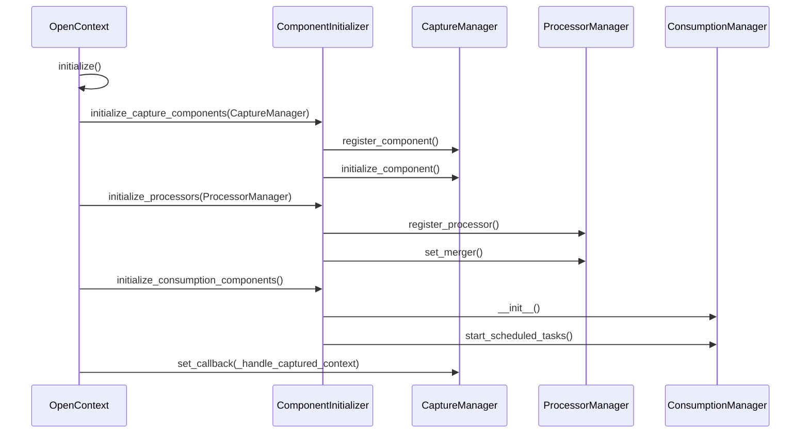

# Managers

<cite>
**Referenced Files in This Document**   
- [capture_manager.py](file://opencontext/managers/capture_manager.py)
- [processor_manager.py](file://opencontext/managers/processor_manager.py)
- [consumption_manager.py](file://opencontext/managers/consumption_manager.py)
- [event_manager.py](file://opencontext/managers/event_manager.py)
- [component_initializer.py](file://opencontext/server/component_initializer.py)
- [opencontext.py](file://opencontext/server/opencontext.py)
</cite>

## Table of Contents
1. [Introduction](#introduction)
2. [CaptureManager: Orchestration of Context Capture](#capturemanager-orchestration-of-context-capture)
3. [ProcessorManager: Routing and Processing of Raw Data](#processormanager-routing-and-processing-of-raw-data)
4. [ConsumptionManager: AI-Driven Insight Generation](#consumptionmanager-ai-driven-insight-generation)
5. [EventManager: Event-Driven Communication](#eventmanager-event-driven-communication)
6. [Component Initialization and System Startup](#component-initialization-and-system-startup)
7. [Manager Interaction Example: Screenshot to Insights](#manager-interaction-example-screenshot-to-insights)
8. [Troubleshooting Common Issues](#troubleshooting-common-issues)
9. [Performance Optimization Tips](#performance-optimization-tips)
10. [Conclusion](#conclusion)

## Introduction
This document provides a comprehensive analysis of the backend managers subsystem in the MineContext application, focusing on the coordination and lifecycle management of core services. The system is built around four primary managers: CaptureManager, ProcessorManager, ConsumptionManager, and EventManager. These managers work in concert to capture, process, and consume user context data, enabling AI-driven insights and user-facing features. The component_initializer.py module is responsible for wiring these managers together during application startup, ensuring a cohesive and functional system. This document will detail the role of each manager, their interactions, and provide guidance on troubleshooting and optimization.

## CaptureManager: Orchestration of Context Capture

The CaptureManager, implemented as `ContextCaptureManager` in `capture_manager.py`, is responsible for orchestrating the capture of context data from various sources such as screenshots, documents, and web links. It acts as a central registry and coordinator for all capture components, providing a unified interface for their management.

The manager maintains a dictionary of registered capture components (`_components`) and a set of running components (`_running_components`). It provides methods to register, initialize, start, and stop individual components. When a component is started, the manager sets a callback function (`_on_component_capture`) that is triggered whenever the component captures new data. This callback is responsible for updating internal statistics and forwarding the captured `RawContextProperties` to the next stage in the pipeline via an upper-level callback.

The manager supports both manual and automatic capture. The `capture()` method allows for a one-time manual trigger of a specific component, while `start_all_components()` is used to initiate all registered components for continuous, automatic data capture. The manager also tracks detailed statistics, including the total number of captures, contexts captured, and component-specific metrics, which can be accessed via the `get_statistics()` method.

**Diagram sources**
- [capture_manager.py](file://opencontext/managers/capture_manager.py#L23-L391)

**Section sources**
- [capture_manager.py](file://opencontext/managers/capture_manager.py#L23-L391)

## ProcessorManager: Routing and Processing of Raw Data

The ProcessorManager, implemented as `ContextProcessorManager` in `processor_manager.py`, is responsible for routing raw context data to the appropriate processing pipelines. It manages a collection of `IContextProcessor` components, each specialized for a specific type of input (e.g., screenshots, documents).

The manager uses a routing table (`_routing_table`) to map `ContextSource` types (e.g., `SCREENSHOT`, `LOCAL_FILE`) to specific processor names (e.g., `screenshot_processor`, `document_processor`). When the `process()` method is called with a `RawContextProperties` object, the manager consults this table to determine the correct processor, retrieves it from its registry (`_processors`), and delegates the processing task.

The manager also supports a merger component (`_merger`) which is used for periodic memory compression and context merging. It features a background thread (`_compression_timer`) that runs at a configurable interval (default 30 minutes) to call the merger's `periodic_memory_compression` method, helping to manage memory usage over time.

For efficiency, the manager provides a `batch_process()` method that uses a `ThreadPoolExecutor` to process multiple inputs concurrently, up to a configurable `max_workers` limit. This allows for high-throughput processing of context data. Like the CaptureManager, it maintains detailed statistics on the number of inputs processed and contexts generated, which are updated after each processing operation.

**Diagram sources**
- [processor_manager.py](file://opencontext/managers/processor_manager.py#L21-L213)

**Section sources**
- [processor_manager.py](file://opencontext/managers/processor_manager.py#L21-L213)

## ConsumptionManager: AI-Driven Insight Generation

The ConsumptionManager, implemented as `ConsumptionManager` in `consumption_manager.py`, is responsible for generating AI-driven insights and user-facing features from processed context data. It manages several background services that run on configurable schedules to produce activities, smart tips, todo tasks, and daily reports.

The manager uses a series of `threading.Timer` objects (`_task_timers`) to schedule the execution of its various generation tasks. Each task (e.g., activity, tips, todos, report) has its own configurable interval and enabled status, stored in `_task_intervals` and `_task_enabled` dictionaries. The manager checks if a task should run based on its interval and the last generation time (`_last_generation_times`), preventing unnecessary processing.

The core components it manages include:
- `ReportGenerator`: Generates comprehensive daily reports.
- `RealtimeActivityMonitor`: Creates summaries of user activity.
- `SmartTipGenerator`: Produces personalized productivity tips.
- `SmartTodoManager`: Generates actionable todo tasks.

The manager provides a `start_scheduled_tasks()` method to initiate all timers and a `stop_scheduled_tasks()` method to cancel them. It also allows for dynamic configuration updates via `update_task_config()`, which can restart timers if their interval or enabled status changes. This enables runtime adjustments to the system's behavior without requiring a restart.

**Diagram sources**
- [consumption_manager.py](file://opencontext/managers/consumption_manager.py#L31-L524)

**Section sources**
- [consumption_manager.py](file://opencontext/managers/consumption_manager.py#L31-L524)

## EventManager: Event-Driven Communication

The EventManager, implemented in `event_manager.py`, provides an event-driven architecture for inter-component communication and system notifications. It uses a cached, in-memory event bus to decouple producers and consumers of events.

The core of the system is the `EventManager` class, which maintains a `deque` of `Event` objects (`event_cache`). Events are published to the cache via the `publish_event()` method, which creates an `Event` object with a unique ID, a type from the `EventType` enum (e.g., `TIP_GENERATED`, `TODO_GENERATED`), and a data payload. The cache has a maximum size (`max_cache_size`) to prevent memory overflow; when exceeded, the oldest events are automatically removed.

Components retrieve events by calling `fetch_and_clear_events()`, which atomically returns all current events and clears the cache. This pull-based model ensures that events are not lost if no consumer is immediately available. The system is designed to be thread-safe using a `threading.Lock`.

A global singleton instance is provided via the `get_event_manager()` function, ensuring that all parts of the application use the same event bus. This allows for loose coupling; for example, the `SmartTipGenerator` can publish a `TIP_GENERATED` event without knowing which component (e.g., a frontend service) will eventually consume it.

**Diagram sources**
- [event_manager.py](file://opencontext/managers/event_manager.py#L55-L117)

**Section sources**
- [event_manager.py](file://opencontext/managers/event_manager.py#L55-L117)

## Component Initialization and System Startup

The initialization and wiring of the managers are orchestrated by the `ComponentInitializer` class in `component_initializer.py` and the main `OpenContext` class in `opencontext.py`. This process ensures that all components are created, configured, and connected in the correct order.

The `ComponentInitializer` class is responsible for creating and configuring individual components based on the application's configuration file (`config.yaml`). It uses predefined mappings (`CAPTURE_COMPONENTS`, `CONSUMPTION_COMPONENTS`) to instantiate capture and consumption components. For processors, it uses a `ProcessorFactory` to create instances of `document_processor` and `screenshot_processor`, which are then registered with the `ProcessorManager`.

The `OpenContext` class acts as the system's entry point. In its `initialize()` method, it follows a strict sequence:
1.  It initializes global singletons (configuration, storage, LLM clients).
2.  It sets up the `ContextOperations` helper.
3.  It registers a callback with the `CaptureManager` to handle captured data.
4.  It delegates to the `ComponentInitializer` to set up the capture components, processors, consumption manager, and completion service.

This sequence is critical: the `CaptureManager` must have its callback set *before* the capture components are initialized, so that any data captured during initialization can be properly routed to the `ProcessorManager`. The `ProcessorManager` then processes the data and, via its own callback, stores it in the database.

**Diagram sources**
- [component_initializer.py](file://opencontext/server/component_initializer.py#L52-L229)
- [opencontext.py](file://opencontext/server/opencontext.py#L31-L229)

**Section sources**
- [component_initializer.py](file://opencontext/server/component_initializer.py#L52-L229)
- [opencontext.py](file://opencontext/server/opencontext.py#L31-L229)

## Manager Interaction Example: Screenshot to Insights

The interaction between the managers can be illustrated by the lifecycle of a captured screenshot. This process is exemplified in the `example_screenshot_to_insights.py` script.

1.  **Capture**: The `ScreenshotCapture` component captures a new screenshot and creates a `RawContextProperties` object with `source=ContextSource.SCREENSHOT`. It then calls the callback function provided by the `CaptureManager`.
2.  **Routing**: The `CaptureManager`'s `_on_component_capture` method receives the data and forwards it to the upper-level callback, which is the `_handle_captured_context` method in the `OpenContext` class.
3.  **Processing**: The `_handle_captured_context` method calls `processor_manager.process(context_data)`. The `ProcessorManager` consults its routing table, identifies the `screenshot_processor` as the correct handler, and delegates the processing task.
4.  **Insight Generation**: The `ScreenshotProcessor` uses a Vision Language Model (VLM) to analyze the image, extract text, and generate a `ProcessedContext` object. This object is then passed to the `ConsumptionManager`'s components via scheduled tasks. For instance, the `SmartTipGenerator` might analyze the processed context and publish a `TIP_GENERATED` event.
5.  **Notification**: The `EventManager` stores the `TIP_GENERATED` event in its cache. A frontend service can then periodically call `fetch_and_clear_events()` to retrieve the new tip and display it to the user.

This chain demonstrates the loosely coupled, event-driven nature of the system, where each manager has a distinct responsibility and communicates through well-defined interfaces and callbacks.

**Section sources**
- [example_screenshot_to_insights.py](file://opencontext/examples/example_screenshot_to_insights.py#L1-L676)
- [opencontext.py](file://opencontext/server/opencontext.py#L103-L116)

## Troubleshooting Common Issues

**Manager Initialization Failures**: These often stem from misconfigurations in `config.yaml`. To troubleshoot:
1.  Verify that the component names in the config (e.g., under `capture`, `processing`) match the keys in the `CAPTURE_COMPONENTS` or `CONSUMPTION_COMPONENTS` dictionaries in `component_initializer.py`.
2.  Check that the `enabled` flag is set to `true` for the components you wish to use.
3.  Ensure that any required external services (e.g., LLM APIs) are accessible and their credentials are correctly configured. Logs from `get_logger(__name__)` in each manager will provide specific error messages.

**Event Propagation Bottlenecks**: If events are not being consumed in a timely manner:
1.  Check the size of the event cache using `get_event_manager().get_cache_status()`. If it is consistently near `max_cache_size` (1000), it indicates that consumers are not pulling events fast enough.
2.  Verify that the consuming service (e.g., a frontend polling endpoint) is actively calling `fetch_and_clear_events()`.
3.  Monitor the system for long-running tasks that might be blocking the event loop, especially in synchronous code.

**Processor Not Handling Data**: If a processor (e.g., `screenshot_processor`) fails to process incoming data:
1.  Confirm that the `ProcessorManager`'s callback is correctly set by the `OpenContext` class.
2.  Check the routing table in `processor_manager.py` to ensure the `ContextSource` of your data (e.g., `SCREENSHOT`) is mapped to the correct processor name.
3.  Use the `get_statistics()` method on the `ProcessorManager` to see if the "total_processed_inputs" counter is incrementing, which indicates data is being received.

## Performance Optimization Tips

*   **ProcessorManager Threading**: Adjust the `max_workers` parameter in the `ContextProcessorManager` constructor to optimize for your hardware. A value equal to the number of CPU cores is often a good starting point for CPU-intensive tasks like VLM calls.
*   **EventManager Polling**: Frontend clients should poll for events (`fetch_and_clear_events()`) at a reasonable interval (e.g., every 5-10 seconds). Polling too frequently creates unnecessary load, while polling too infrequently increases latency for user notifications.
*   **CaptureManager Statistics**: Regularly monitor the statistics from `CaptureManager.get_statistics()` to identify underperforming or error-prone capture components. High error counts may indicate a need for configuration adjustment or component replacement.
*   **ConsumptionManager Scheduling**: Tune the generation intervals in the `content_generation` section of `config.yaml`. For example, setting `tips.interval` to a higher value (e.g., 7200 seconds) reduces the frequency of LLM calls, saving resources if real-time tips are not critical.

## Conclusion

The backend managers subsystem in MineContext provides a robust and scalable architecture for context-aware computing. The `CaptureManager`, `ProcessorManager`, `ConsumptionManager`, and `EventManager` work together to create a seamless pipeline from raw data capture to AI-driven insight delivery. Their design emphasizes loose coupling through interfaces and callbacks, allowing for flexible component replacement and extension. The initialization process, managed by `ComponentInitializer` and `OpenContext`, ensures a reliable startup sequence. By understanding the roles, interactions, and potential pitfalls of these managers, developers can effectively maintain, troubleshoot, and optimize the system for enhanced user experience.