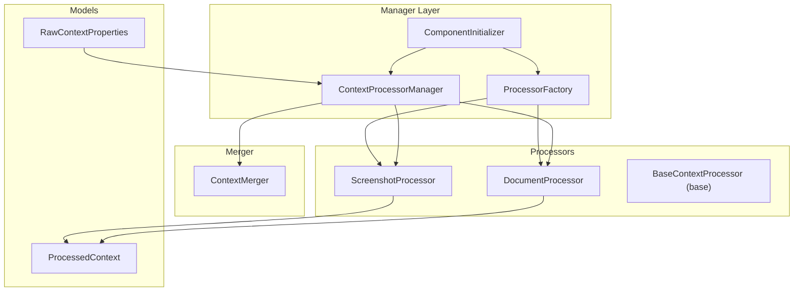
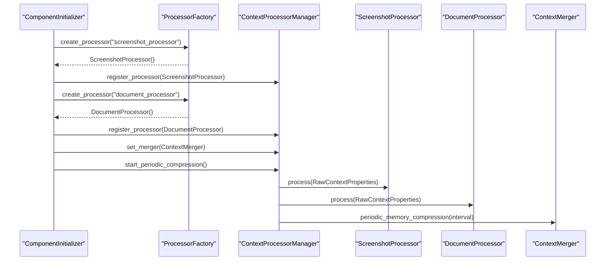
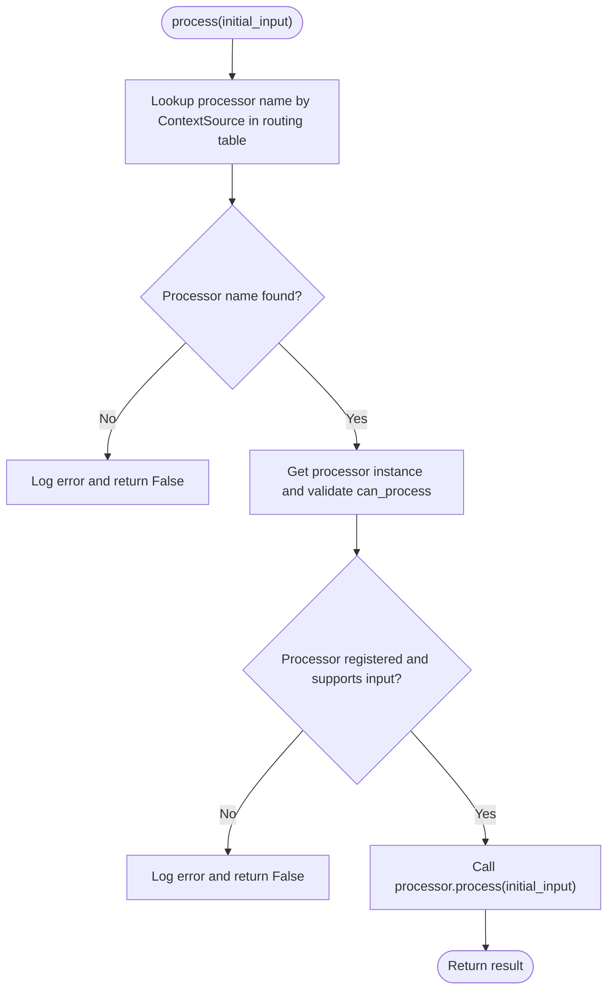
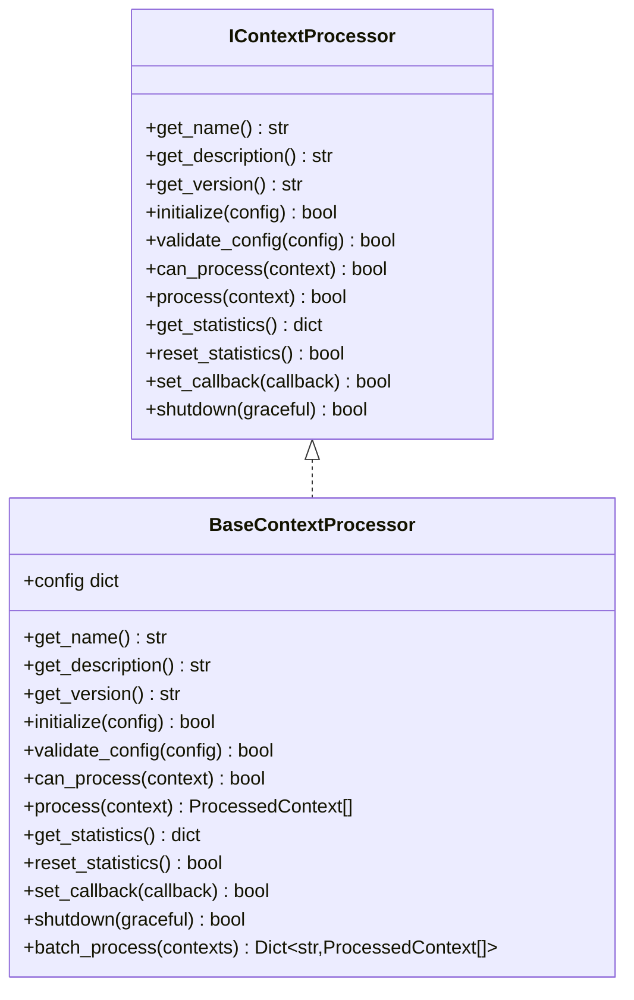
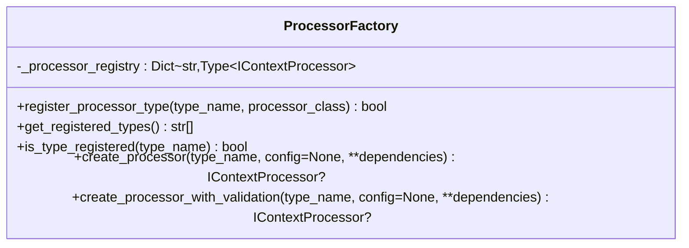
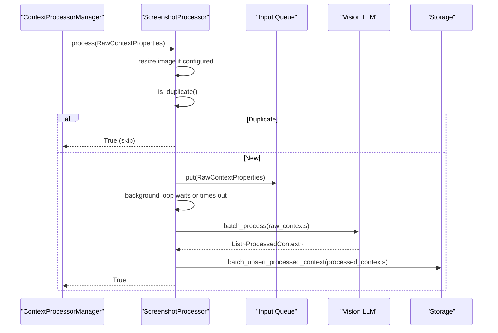
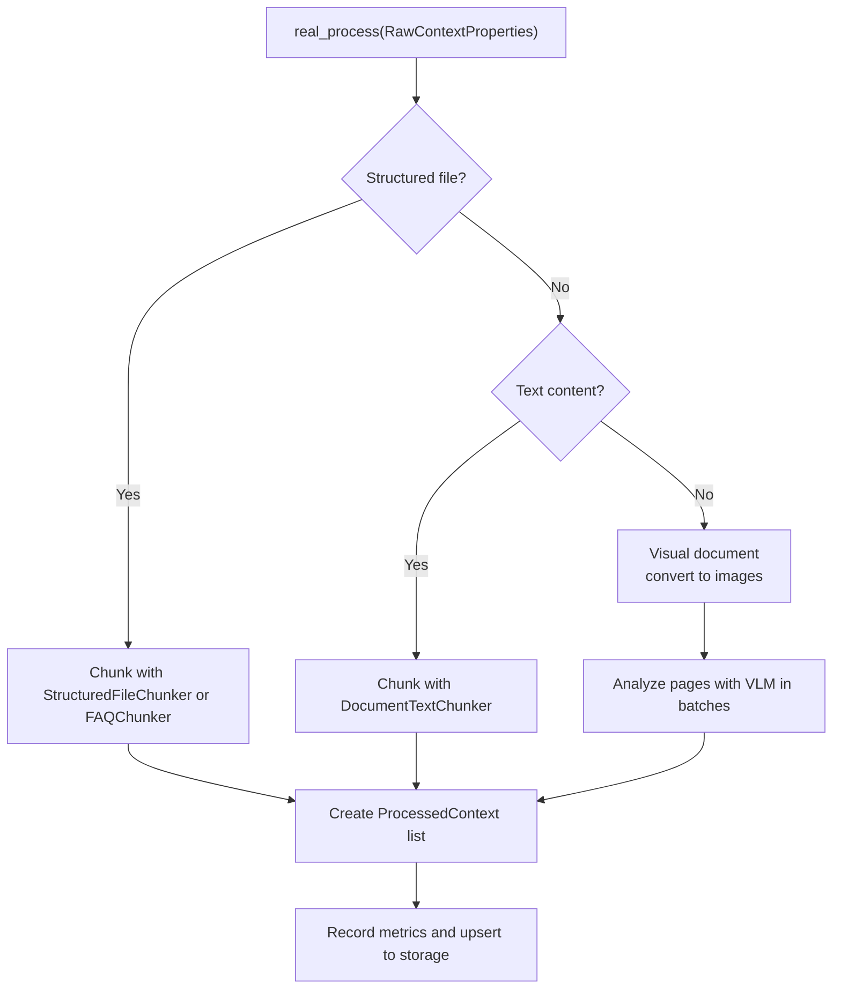
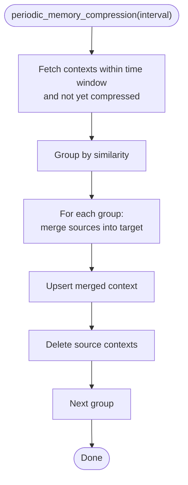
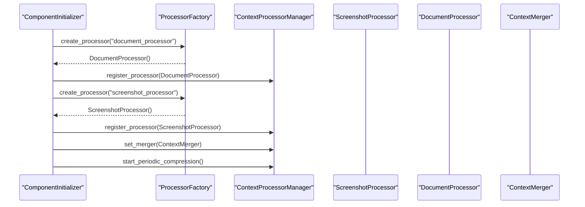
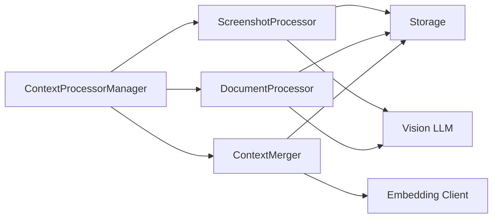

# Processor Manager

<cite>
**Referenced Files in This Document**
- [processor_manager.py](file://opencontext/managers/processor_manager.py)
- [base_processor.py](file://opencontext/context_processing/processor/base_processor.py)
- [processor_factory.py](file://opencontext/context_processing/processor/processor_factory.py)
- [screenshot_processor.py](file://opencontext/context_processing/processor/screenshot_processor.py)
- [document_processor.py](file://opencontext/context_processing/processor/document_processor.py)
- [context_merger.py](file://opencontext/context_processing/merger/context_merger.py)
- [processor_interface.py](file://opencontext/interfaces/processor_interface.py)
- [context.py](file://opencontext/models/context.py)
- [component_initializer.py](file://opencontext/server/component_initializer.py)
- [config.yaml](file://config/config.yaml)
- [example_screenshot_processor.py](file://examples/example_screenshot_processor.py)
- [example_document_processor.py](file://examples/example_document_processor.py)
</cite>

## Table of Contents
1. [Introduction](#introduction)
2. [Project Structure](#project-structure)
3. [Core Components](#core-components)
4. [Architecture Overview](#architecture-overview)
5. [Detailed Component Analysis](#detailed-component-analysis)
6. [Dependency Analysis](#dependency-analysis)
7. [Performance Considerations](#performance-considerations)
8. [Troubleshooting Guide](#troubleshooting-guide)
9. [Conclusion](#conclusion)
10. [Appendices](#appendices)

## Introduction
This document explains the Processor Manager responsible for routing and processing raw context data across the system. It covers:
- How ContextProcessorManager uses a routing table to direct RawContextProperties to appropriate processors based on ContextSource (e.g., screenshot_processor for SCREENSHOT).
- The registration mechanism for IContextProcessor implementations via ProcessorFactory and ComponentInitializer.
- The role of the merger component in periodic memory compression.
- Batch processing capabilities using ThreadPoolExecutor for concurrent context processing.
- Statistics aggregation across processors.
- Practical examples for registering custom processors and configuring the processing pipeline.
- Common issues and performance optimization tips for handling large volumes of context data.

## Project Structure
The Processor Manager sits at the center of the processing pipeline, orchestrating processors and integrating with the merger for memory compression. Supporting components include:
- Processor interfaces and base classes
- Built-in processors (screenshot and document)
- Merger for intelligent merging and periodic compression
- Component initializer wiring processors into the runtime
- Configuration driving processor behavior

**Diagram sources**
- [processor_manager.py](file://opencontext/managers/processor_manager.py#L21-L213)
- [processor_factory.py](file://opencontext/context_processing/processor/processor_factory.py#L31-L175)
- [component_initializer.py](file://opencontext/server/component_initializer.py#L119-L175)
- [screenshot_processor.py](file://opencontext/context_processing/processor/screenshot_processor.py#L47-L110)
- [document_processor.py](file://opencontext/context_processing/processor/document_processor.py#L41-L110)
- [context_merger.py](file://opencontext/context_processing/merger/context_merger.py#L35-L120)
- [context.py](file://opencontext/models/context.py#L35-L143)

**Section sources**
- [processor_manager.py](file://opencontext/managers/processor_manager.py#L21-L213)
- [processor_factory.py](file://opencontext/context_processing/processor/processor_factory.py#L31-L175)
- [component_initializer.py](file://opencontext/server/component_initializer.py#L119-L175)
- [context.py](file://opencontext/models/context.py#L35-L143)

## Core Components
- ContextProcessorManager: Central coordinator that registers processors, routes inputs, runs batch processing, aggregates statistics, and manages periodic memory compression via the merger.
- BaseContextProcessor: Abstract base class providing common functionality (configuration, callbacks, statistics, batch processing helpers).
- ProcessorFactory: Factory for creating processor instances by type, with built-in registration for document_processor and screenshot_processor.
- ScreenshotProcessor: Asynchronous, background-threaded processor for screenshots with deduplication, batching, and LLM-driven extraction.
- DocumentProcessor: Background-threaded processor for structured, text, and visual documents with chunking and VLM-based analysis.
- ContextMerger: Intelligent merger with vector similarity and LLM-based merging, plus periodic memory compression.
- ComponentInitializer: Initializes processors and wires them into the manager, optionally enabling the merger and starting periodic compression.
- Configuration: config.yaml drives processor behavior (batch sizes, timeouts, thresholds, and merger settings).

**Section sources**
- [processor_manager.py](file://opencontext/managers/processor_manager.py#L21-L213)
- [base_processor.py](file://opencontext/context_processing/processor/base_processor.py#L23-L261)
- [processor_factory.py](file://opencontext/context_processing/processor/processor_factory.py#L31-L175)
- [screenshot_processor.py](file://opencontext/context_processing/processor/screenshot_processor.py#L47-L110)
- [document_processor.py](file://opencontext/context_processing/processor/document_processor.py#L41-L110)
- [context_merger.py](file://opencontext/context_processing/merger/context_merger.py#L35-L120)
- [component_initializer.py](file://opencontext/server/component_initializer.py#L119-L175)
- [config.yaml](file://config/config.yaml#L76-L145)

## Architecture Overview
The Processor Manager orchestrates the lifecycle of raw context inputs:
- Routing: Based on ContextSource, inputs are routed to the appropriate processor.
- Registration: Processors are registered with the manager and tracked for statistics.
- Processing: Single or batch processing is executed, with callbacks invoked upon completion.
- Merger Integration: Periodic memory compression is delegated to the merger when enabled.
- Statistics: Aggregated counts track processed inputs, generated contexts, and per-processor metrics.

**Diagram sources**
- [component_initializer.py](file://opencontext/server/component_initializer.py#L138-L173)
- [processor_manager.py](file://opencontext/managers/processor_manager.py#L129-L179)
- [context_merger.py](file://opencontext/context_processing/merger/context_merger.py#L465-L547)

## Detailed Component Analysis

### ContextProcessorManager
Responsibilities:
- Routing table mapping ContextSource to processor names.
- Processor registration and retrieval.
- Single and batch processing using ThreadPoolExecutor.
- Statistics aggregation and reset.
- Merger integration and periodic compression scheduling.
- Graceful shutdown.

Key behaviors:
- Routing: The routing table defines which processor name handles each ContextSource.
- Batch processing: Submits per-input tasks to a ThreadPoolExecutor and collects results.
- Statistics: Maintains totals and per-processor stats; updates on demand.
- Merger: Delegates periodic compression to the merger when present.

**Diagram sources**
- [processor_manager.py](file://opencontext/managers/processor_manager.py#L132-L179)

**Section sources**
- [processor_manager.py](file://opencontext/managers/processor_manager.py#L28-L213)

### BaseContextProcessor
Responsibilities:
- Standardized interface for processors (get_name, get_description, get_version, initialize, validate_config, can_process, process, get_statistics, reset_statistics, set_callback, shutdown).
- Shared statistics tracking and callback invocation.
- Batch processing helper that groups results by object ID and updates counters.

**Diagram sources**
- [processor_interface.py](file://opencontext/interfaces/processor_interface.py#L16-L136)
- [base_processor.py](file://opencontext/context_processing/processor/base_processor.py#L23-L261)

**Section sources**
- [base_processor.py](file://opencontext/context_processing/processor/base_processor.py#L23-L261)
- [processor_interface.py](file://opencontext/interfaces/processor_interface.py#L16-L136)

### ProcessorFactory
Responsibilities:
- Centralized creation of processor instances by type.
- Built-in registration for document_processor and screenshot_processor.
- Type registration and validation.
- Deprecated configuration and dependency injection parameters (ignored in current implementation).

**Diagram sources**
- [processor_factory.py](file://opencontext/context_processing/processor/processor_factory.py#L31-L175)

**Section sources**
- [processor_factory.py](file://opencontext/context_processing/processor/processor_factory.py#L31-L175)

### ScreenshotProcessor
Responsibilities:
- Deduplication of incoming screenshots using perceptual hashing.
- Background processing loop with configurable batch size and timeout.
- Vision LLM-based extraction and merging of contexts.
- Async batch processing and storage integration.

Key configuration:
- similarity_hash_threshold, batch_size, batch_timeout, max_image_size, resize_quality, enabled_delete, max_raw_properties.

**Diagram sources**
- [screenshot_processor.py](file://opencontext/context_processing/processor/screenshot_processor.py#L149-L235)
- [processor_manager.py](file://opencontext/managers/processor_manager.py#L132-L179)

**Section sources**
- [screenshot_processor.py](file://opencontext/context_processing/processor/screenshot_processor.py#L47-L110)
- [screenshot_processor.py](file://opencontext/context_processing/processor/screenshot_processor.py#L149-L235)
- [screenshot_processor.py](file://opencontext/context_processing/processor/screenshot_processor.py#L498-L532)

### DocumentProcessor
Responsibilities:
- Background processing for structured, text, and visual documents.
- File type detection and chunking strategies.
- VLM-based analysis for pages requiring visual interpretation.
- Metrics recording and storage integration.

Key configuration:
- document_processing.enabled, dpi, vlm_batch_size, text_threshold_per_page.
- document_processor.batch_size, batch_timeout.

**Diagram sources**
- [document_processor.py](file://opencontext/context_processing/processor/document_processor.py#L223-L246)
- [document_processor.py](file://opencontext/context_processing/processor/document_processor.py#L312-L402)
- [document_processor.py](file://opencontext/context_processing/processor/document_processor.py#L404-L608)

**Section sources**
- [document_processor.py](file://opencontext/context_processing/processor/document_processor.py#L41-L110)
- [document_processor.py](file://opencontext/context_processing/processor/document_processor.py#L223-L246)
- [document_processor.py](file://opencontext/context_processing/processor/document_processor.py#L312-L402)
- [document_processor.py](file://opencontext/context_processing/processor/document_processor.py#L404-L608)

### ContextMerger
Responsibilities:
- Intelligent merging of similar contexts using strategies and vector similarity.
- LLM-based fallback merging when strategies are unavailable.
- Periodic memory compression across context types.
- Memory management features (cleanup and reinforcement).

**Diagram sources**
- [context_merger.py](file://opencontext/context_processing/merger/context_merger.py#L465-L547)

**Section sources**
- [context_merger.py](file://opencontext/context_processing/merger/context_merger.py#L35-L120)
- [context_merger.py](file://opencontext/context_processing/merger/context_merger.py#L465-L547)

### ComponentInitializer and Configuration
- ComponentInitializer initializes processors by type, sets callbacks, registers them with the manager, and optionally enables the merger and starts periodic compression.
- config.yaml controls processor behavior (batch sizes, timeouts, thresholds) and merger settings.

**Diagram sources**
- [component_initializer.py](file://opencontext/server/component_initializer.py#L138-L173)

**Section sources**
- [component_initializer.py](file://opencontext/server/component_initializer.py#L119-L175)
- [config.yaml](file://config/config.yaml#L76-L145)

## Dependency Analysis
- Coupling:
  - ContextProcessorManager depends on IContextProcessor and ContextSource to route inputs.
  - Processors depend on BaseContextProcessor for shared behavior.
  - ScreenshotProcessor and DocumentProcessor depend on storage and LLM clients.
  - ContextMerger depends on storage backends and embedding clients.
- Cohesion:
  - Each processor encapsulates its own processing logic and background loops.
  - Manager centralizes orchestration and statistics.
- External dependencies:
  - Storage backends (vector and document) for persistence.
  - LLM clients for vision and embedding operations.
  - Threading and timers for asynchronous processing and periodic compression.

**Diagram sources**
- [processor_manager.py](file://opencontext/managers/processor_manager.py#L28-L120)
- [screenshot_processor.py](file://opencontext/context_processing/processor/screenshot_processor.py#L47-L110)
- [document_processor.py](file://opencontext/context_processing/processor/document_processor.py#L41-L110)
- [context_merger.py](file://opencontext/context_processing/merger/context_merger.py#L35-L120)

**Section sources**
- [processor_manager.py](file://opencontext/managers/processor_manager.py#L28-L120)
- [screenshot_processor.py](file://opencontext/context_processing/processor/screenshot_processor.py#L47-L110)
- [document_processor.py](file://opencontext/context_processing/processor/document_processor.py#L41-L110)
- [context_merger.py](file://opencontext/context_processing/merger/context_merger.py#L35-L120)

## Performance Considerations
- Concurrency:
  - ThreadPoolExecutor in ContextProcessorManager controls batch processing concurrency. Tune max_workers according to CPU and I/O capacity.
  - ScreenshotProcessor and DocumentProcessor use internal queues and background threads; adjust batch_size and batch_timeout to balance throughput and latency.
- Memory:
  - ScreenshotProcessor maintains a current screenshot cache and optional deletion of duplicates to reduce disk usage.
  - ContextMerger’s periodic memory compression reduces long-term storage footprint by merging similar contexts.
- I/O and LLM:
  - Limit max_image_size and resize_quality to control memory and cost.
  - Use batch_size and batch_timeout to minimize idle time while avoiding overload.
- Storage:
  - Ensure storage backends are tuned for vector operations and document writes.

[No sources needed since this section provides general guidance]

## Troubleshooting Guide
Common issues and resolutions:
- Processor bottlenecks:
  - Symptom: Slow processing despite sufficient workers.
  - Actions: Increase batch_size and batch_timeout in processor configs; verify storage and LLM client performance; inspect processor logs for errors.
- Thread pool exhaustion:
  - Symptom: Exceptions or timeouts during batch processing.
  - Actions: Reduce max_workers or batch size; ensure processors release resources promptly; check for blocking operations inside processors.
- Routing misconfigurations:
  - Symptom: Inputs not processed or errors indicating no processor for source.
  - Actions: Verify routing table entries and ContextSource values; confirm processor registration; check that processors implement can_process correctly.
- Merger not compressing:
  - Symptom: Periodic compression not running.
  - Actions: Confirm merger is set and enabled; verify periodic_memory_compression is started; check storage availability and vectorization.

**Section sources**
- [processor_manager.py](file://opencontext/managers/processor_manager.py#L132-L179)
- [screenshot_processor.py](file://opencontext/context_processing/processor/screenshot_processor.py#L149-L235)
- [document_processor.py](file://opencontext/context_processing/processor/document_processor.py#L223-L246)
- [context_merger.py](file://opencontext/context_processing/merger/context_merger.py#L465-L547)

## Conclusion
The Processor Manager provides a robust, extensible framework for routing and processing raw context data. By leveraging typed processor registration, background processing, and periodic memory compression, it scales to handle diverse content types efficiently. Proper configuration and monitoring ensure reliable performance under load.

[No sources needed since this section summarizes without analyzing specific files]

## Appendices

### How to Register a Custom Processor
Steps:
- Implement IContextProcessor or extend BaseContextProcessor.
- Register the processor type with ProcessorFactory.register_processor_type.
- Initialize the processor via ComponentInitializer.initialize_processors.
- Optionally set a callback to receive processed contexts.

References:
- [processor_interface.py](file://opencontext/interfaces/processor_interface.py#L16-L136)
- [base_processor.py](file://opencontext/context_processing/processor/base_processor.py#L23-L261)
- [processor_factory.py](file://opencontext/context_processing/processor/processor_factory.py#L62-L87)
- [component_initializer.py](file://opencontext/server/component_initializer.py#L138-L173)

**Section sources**
- [processor_interface.py](file://opencontext/interfaces/processor_interface.py#L16-L136)
- [base_processor.py](file://opencontext/context_processing/processor/base_processor.py#L23-L261)
- [processor_factory.py](file://opencontext/context_processing/processor/processor_factory.py#L62-L87)
- [component_initializer.py](file://opencontext/server/component_initializer.py#L138-L173)

### Example: Configure the Processing Pipeline
- Enable processors and merger in config.yaml.
- Initialize processors and merger via ComponentInitializer.
- Start periodic compression if merger is enabled.

References:
- [config.yaml](file://config/config.yaml#L76-L145)
- [component_initializer.py](file://opencontext/server/component_initializer.py#L138-L173)

**Section sources**
- [config.yaml](file://config/config.yaml#L76-L145)
- [component_initializer.py](file://opencontext/server/component_initializer.py#L138-L173)

### Example: Using Processors Without Database Storage
Examples demonstrate creating RawContextProperties and invoking processors for screenshots and documents without storing results in the database.

References:
- [example_screenshot_processor.py](file://examples/example_screenshot_processor.py#L105-L147)
- [example_document_processor.py](file://examples/example_document_processor.py#L118-L186)

**Section sources**
- [example_screenshot_processor.py](file://examples/example_screenshot_processor.py#L105-L147)
- [example_document_processor.py](file://examples/example_document_processor.py#L118-L186)