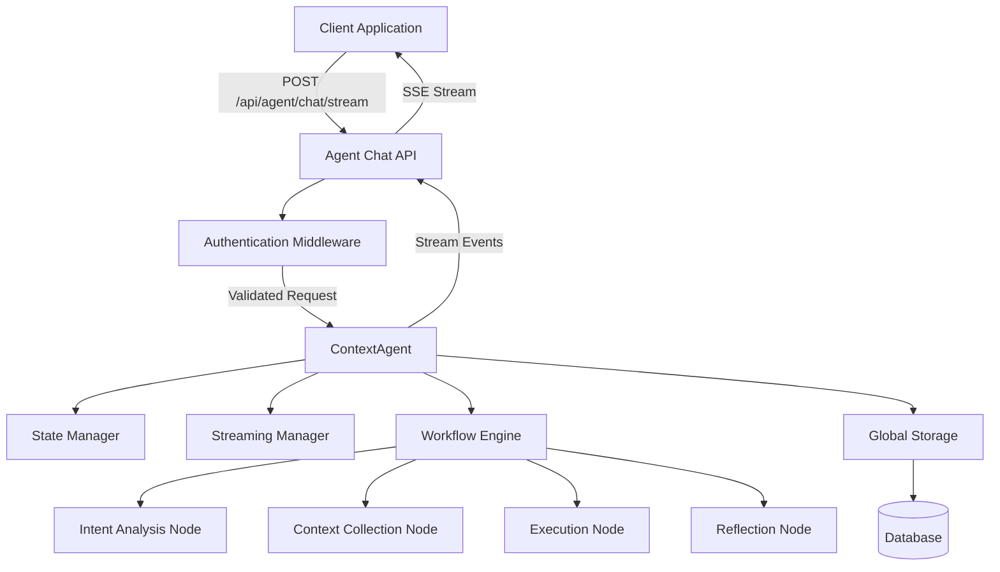

# Agent Chat API

<cite>
**Referenced Files in This Document**   
- [agent_chat.py](file://opencontext/server/routes/agent_chat.py)
- [agent.py](file://opencontext/context_consumption/context_agent/agent.py)
- [streaming.py](file://opencontext/context_consumption/context_agent/core/streaming.py)
- [schemas.py](file://opencontext/context_consumption/context_agent/models/schemas.py)
- [events.py](file://opencontext/context_consumption/context_agent/models/events.py)
- [enums.py](file://opencontext/context_consumption/context_agent/models/enums.py)
- [context.py](file://opencontext/context_consumption/context_agent/nodes/context.py)
- [global_storage.py](file://opencontext/storage/global_storage.py)
- [unified_storage.py](file://opencontext/storage/unified_storage.py)
- [auth.py](file://opencontext/server/middleware/auth.py)
- [use-chat-stream.ts](file://frontend/src/renderer/src/hooks/use-chat-stream.ts)
- [ChatStreamService.ts](file://frontend/src/renderer/src/services/ChatStreamService.ts)
</cite>

## Table of Contents
1. [Introduction](#introduction)
2. [API Endpoint](#api-endpoint)
3. [Request Parameters](#request-parameters)
4. [Streaming Response Format](#streaming-response-format)
5. [SSE Implementation](#sse-implementation)
6. [ContextAgent Integration](#contextagent-integration)
7. [Conversation History Management](#conversation-history-management)
8. [Error Handling](#error-handling)
9. [Security Considerations](#security-considerations)
10. [Request Examples](#request-examples)
11. [Response Stream Examples](#response-stream-examples)
12. [Architecture Overview](#architecture-overview)

## Introduction
The Agent Chat API provides AI-powered conversational interactions through a streaming interface that enables real-time, interactive responses. The system leverages the ContextAgent framework to deliver intelligent conversations by analyzing user queries, gathering relevant context, executing appropriate actions, and reflecting on outcomes. This documentation details the POST /agent-chat endpoint, its request parameters, streaming response format using Server-Sent Events (SSE), integration with the ContextAgent system, conversation history management, error handling mechanisms, and security requirements.

**Section sources**
- [agent_chat.py](file://opencontext/server/routes/agent_chat.py#L1-L367)
- [agent.py](file://opencontext/context_consumption/context_agent/agent.py#L1-L165)

## API Endpoint
The Agent Chat API exposes a streaming endpoint that processes user queries and returns responses in real-time using Server-Sent Events (SSE). The primary endpoint is:

```
POST /api/agent/chat/stream
```

This endpoint accepts user input, conversation context, and configuration options to generate AI-powered responses. It supports both streaming and non-streaming modes, with the streaming mode being the primary interface for interactive conversations. The endpoint is protected by API key authentication and requires valid credentials to access.

The API follows a workflow-based approach where each conversation is processed through multiple stages including intent analysis, context gathering, execution, and reflection. Each stage produces events that are streamed to the client, providing visibility into the processing pipeline.

**Section sources**
- [agent_chat.py](file://opencontext/server/routes/agent_chat.py#L79-L290)

## Request Parameters
The POST /agent-chat endpoint accepts a JSON payload with the following parameters:

### ChatRequest Parameters
- **query** (string, required): The user's input or question
- **context** (object, optional): Additional context information including chat history, selected content, and current document
- **session_id** (string, optional): Unique identifier for the conversation session
- **user_id** (string, optional): Identifier for the user
- **conversation_id** (integer, optional): Database identifier for storing message history

The context object can include:
- **chat_history**: Array of previous conversation messages with role and content
- **selected_content**: Text content selected by the user
- **document_id**: Identifier for the current document in context
- **current_document**: Information about the current document including title and content

When a conversation_id is provided, the system automatically manages message persistence, creating entries for both user and assistant messages. The conversation title is set from the user's initial query if not already established.

**Section sources**
- [agent_chat.py](file://opencontext/server/routes/agent_chat.py#L48-L57)
- [schemas.py](file://opencontext/context_consumption/context_agent/models/schemas.py#L39-L49)
- [ChatStreamService.ts](file://frontend/src/renderer/src/services/ChatStreamService.ts#L46-L52)

## Streaming Response Format
The streaming response format uses Server-Sent Events (SSE) to deliver real-time updates to the client. Each response is a series of events with the following structure:

```json
{
  "type": "event_type",
  "content": "event_content",
  "stage": "workflow_stage",
  "progress": 0.0,
  "timestamp": "iso_timestamp",
  "metadata": {}
}
```

### Event Types
- **session_start**: Initial event containing session_id and assistant_message_id
- **thinking**: Internal reasoning and planning information
- **running**: Status updates during processing stages
- **done**: Completion of a processing stage
- **fail**: Error information when processing fails
- **completed**: Final completion status
- **stream_chunk**: Partial content for incremental display
- **stream_complete**: Final content chunk indicating completion

The response stream provides granular visibility into the AI's processing workflow, allowing clients to display intermediate states such as context gathering, execution planning, and reflection.

**Section sources**
- [events.py](file://opencontext/context_consumption/context_agent/models/events.py#L16-L103)
- [enums.py](file://opencontext/context_consumption/context_agent/models/enums.py#L67-L78)
- [use-chat-stream.ts](file://frontend/src/renderer/src/hooks/use-chat-stream.ts#L76-L96)

## SSE Implementation
The Server-Sent Events (SSE) implementation follows the standard SSE protocol with specific optimizations for AI conversation streaming. The endpoint returns content with the media type "text/event-stream" and appropriate headers to prevent buffering:

```http
Content-Type: text/event-stream
Cache-Control: no-cache
Connection: keep-alive
X-Accel-Buffering: no
```

### Streaming Workflow
1. Client sends a POST request to /api/agent/chat/stream
2. Server responds with HTTP 200 and begins streaming events
3. First event is "session_start" containing session and message identifiers
4. Subsequent events stream in real-time as the AI processes the request
5. "stream_chunk" events deliver incremental response content
6. Final "stream_complete" or "completed" event indicates response completion

The implementation includes interrupt handling through an in-memory flag system. When a client cancels a request, the server detects this and gracefully terminates the stream, marking the message as cancelled in the database.

**Section sources**
- [agent_chat.py](file://opencontext/server/routes/agent_chat.py#L122-L280)
- [ChatStreamService.ts](file://frontend/src/renderer/src/services/ChatStreamService.ts#L106-L174)

## ContextAgent Integration
The Agent Chat API integrates with the ContextAgent system, which orchestrates the AI conversation workflow through a series of specialized nodes. The ContextAgent manages the complete lifecycle of a conversation, from initial query processing to final response generation.

### Workflow Stages
- **INIT**: Initial state
- **INTENT_ANALYSIS**: Determine user intent and query type
- **CONTEXT_GATHERING**: Collect relevant context from various sources
- **EXECUTION**: Perform the required actions based on intent
- **REFLECTION**: Evaluate the results and determine next steps
- **COMPLETED**: Final successful completion
- **FAILED**: Processing failure

The ContextAgent uses a state management system to track the progress of each conversation, with each workflow having a unique identifier. The system supports resuming interrupted workflows through the /resume/{workflow_id} endpoint, allowing users to provide additional input when clarification is needed.

**Section sources**
- [agent.py](file://opencontext/context_consumption/context_agent/agent.py#L21-L125)
- [enums.py](file://opencontext/context_consumption/context_agent/models/enums.py#L21-L31)
- [state.py](file://opencontext/context_consumption/context_agent/core/state.py#L42-L208)

## Conversation History Management
The system maintains conversation history through integrated storage mechanisms that persist messages and context across sessions. When a conversation_id is provided in the request, the system automatically manages message storage and retrieval.

### Message Storage Operations
- **create_message**: Stores completed user and assistant messages
- **create_streaming_message**: Creates a placeholder for streaming responses
- **append_message_content**: Adds incremental content to streaming messages
- **update_message_metadata**: Stores event metadata from the processing workflow
- **mark_message_finished**: Finalizes message status (completed, failed, cancelled)

The conversation title is automatically set from the user's initial query if not already established. Message metadata captures the complete event history, including thinking processes, context collection, and execution steps, enabling comprehensive conversation analysis and debugging.

**Section sources**
- [agent_chat.py](file://opencontext/server/routes/agent_chat.py#L136-L153)
- [unified_storage.py](file://opencontext/storage/unified_storage.py#L764-L887)
- [global_storage.py](file://opencontext/storage/global_storage.py#L186-L196)

## Error Handling
The API implements comprehensive error handling for various failure scenarios, including LLM failures, timeout scenarios, and input validation issues.

### Error Types
- **LLM Failures**: Errors from the language model processing, captured in the "fail" event type
- **Timeout Scenarios**: Handled through FastAPI's built-in timeout mechanisms and stream interruption
- **Input Validation**: Validation of request parameters using Pydantic models
- **Authentication Errors**: Invalid or missing API keys
- **Storage Errors**: Database connection or write failures

When errors occur, the system emits appropriate events and ensures proper cleanup of resources. For streaming requests, if an error occurs, the system marks the assistant message as failed in the database and includes the error message in the response stream.

**Section sources**
- [agent_chat.py](file://opencontext/server/routes/agent_chat.py#L113-L115)
- [agent_chat.py](file://opencontext/server/routes/agent_chat.py#L260-L274)
- [auth.py](file://opencontext/server/middleware/auth.py#L88-L107)

## Security Considerations
The Agent Chat API implements several security measures to protect user data and ensure authorized access.

### Authentication
The API requires API key authentication through the X-API-Key header or api_key query parameter. Authentication is enabled by default and can be configured in the api_auth section of the configuration. The system validates API keys against a configured list of valid keys.

### Data Protection
User data is handled with privacy considerations, and the system follows security best practices for data storage and transmission. The API is designed to minimize exposure of sensitive information in logs and error messages.

### Security Configuration
Authentication can be disabled for development purposes, but is enabled by default in production environments. Certain paths like /health and / are excluded from authentication requirements to allow health checks and static content access.

**Section sources**
- [auth.py](file://opencontext/server/middleware/auth.py#L1-L113)
- [agent_chat.py](file://opencontext/server/routes/agent_chat.py#L23)

## Request Examples
### Basic Chat Request
```json
{
  "query": "What are the main points of this document?",
  "conversation_id": 123,
  "session_id": "session_12345"
}
```

### Request with Context
```json
{
  "query": "Summarize the key findings",
  "conversation_id": 123,
  "context": {
    "chat_history": [
      {
        "role": "user",
        "content": "I'm researching climate change impacts"
      },
      {
        "role": "assistant",
        "content": "I can help you with that topic."
      }
    ],
    "selected_content": "The data shows a 2°C increase in global temperatures over the last century...",
    "document_id": "doc_456"
  }
}
```

### Request with User Identification
```json
{
  "query": "Continue my previous analysis",
  "conversation_id": 123,
  "user_id": "user_789",
  "session_id": "session_12345"
}
```

**Section sources**
- [agent_chat.py](file://opencontext/server/routes/agent_chat.py#L48-L57)
- [ChatStreamService.ts](file://frontend/src/renderer/src/services/ChatStreamService.ts#L46-L52)

## Response Stream Examples
### Initial Session Start
```json
data: {"type": "session_start", "session_id": "session_12345", "assistant_message_id": 456, "timestamp": "2025-01-01T12:00:00Z"}
```

### Thinking Process
```json
data: {"type": "thinking", "content": "Analyzing user intent and query type...", "stage": "intent_analysis", "progress": 0.2, "timestamp": "2025-01-01T12:00:01Z"}
```

### Context Gathering
```json
data: {"type": "running", "content": "Collecting relevant context from document library...", "stage": "context_gathering", "progress": 0.4, "timestamp": "2025-01-01T12:00:03Z"}
```

### Streaming Response
```json
data: {"type": "stream_chunk", "content": "The main points of the document are ", "stage": "execution", "progress": 0.6, "timestamp": "2025-01-01T12:00:05Z"}
data: {"type": "stream_chunk", "content": "first, climate change is accelerating", "stage": "execution", "progress": 0.7, "timestamp": "2025-01-01T12:00:06Z"}
```

### Completion
```json
data: {"type": "stream_complete", "content": "The main points of the document are first, climate change is accelerating...", "stage": "completed", "progress": 1.0, "timestamp": "2025-01-01T12:00:08Z"}
```

**Section sources**
- [events.py](file://opencontext/context_consumption/context_agent/models/events.py#L16-L103)
- [use-chat-stream.ts](file://frontend/src/renderer/src/hooks/use-chat-stream.ts#L98-L246)

## Architecture Overview
The Agent Chat API follows a modular architecture with clear separation of concerns between components. The system is built on FastAPI for the web interface, with a ContextAgent core that orchestrates the AI conversation workflow.



**Diagram sources**
- [agent_chat.py](file://opencontext/server/routes/agent_chat.py#L29-L367)
- [agent.py](file://opencontext/context_consumption/context_agent/agent.py#L21-L125)
- [state.py](file://opencontext/context_consumption/context_agent/core/state.py#L211-L277)
- [streaming.py](file://opencontext/context_consumption/context_agent/core/streaming.py#L16-L46)