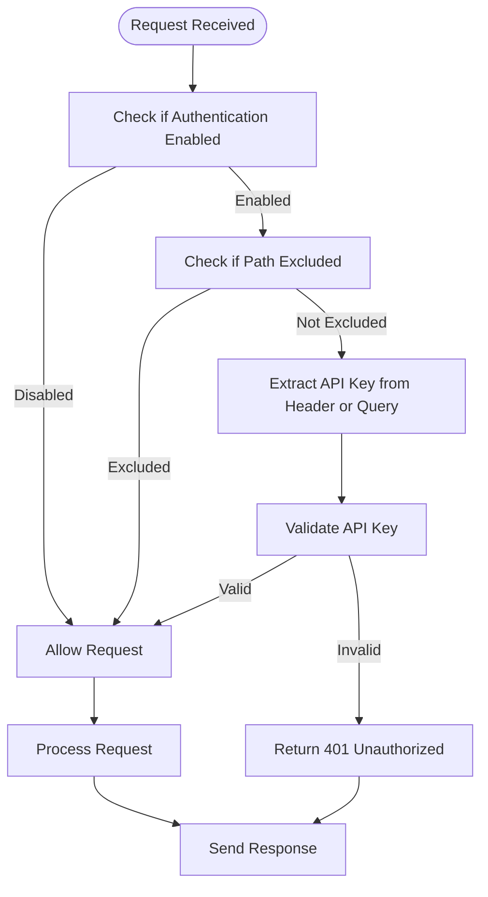
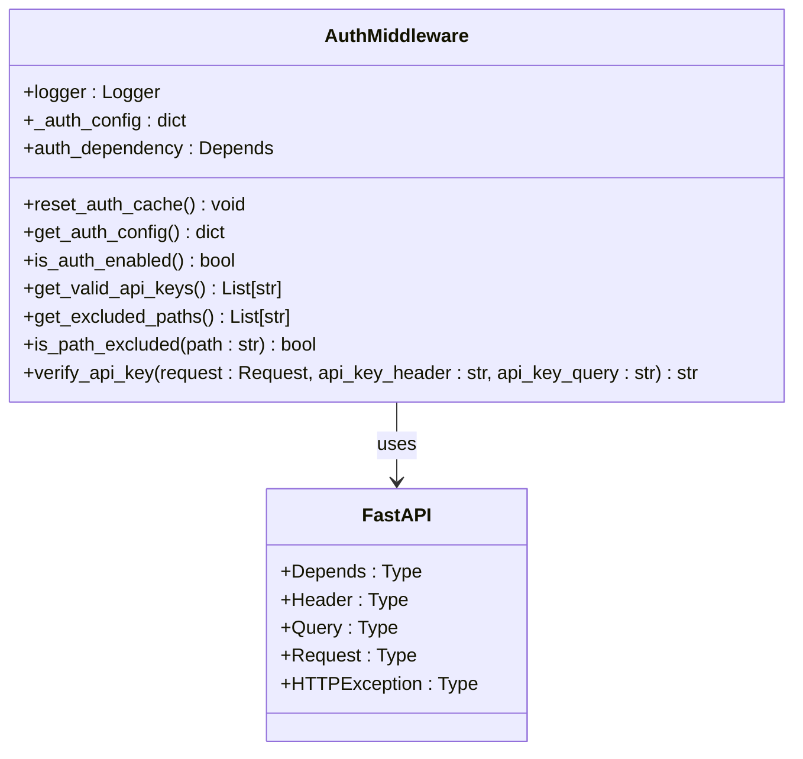
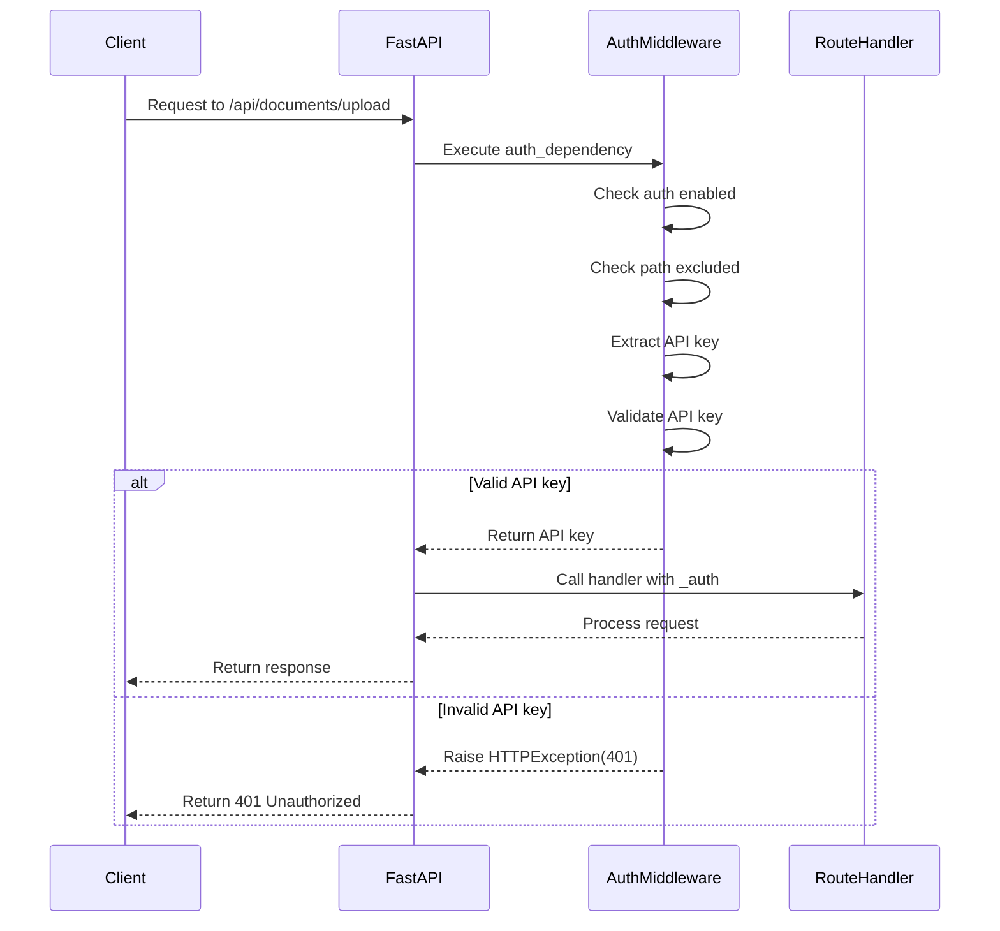
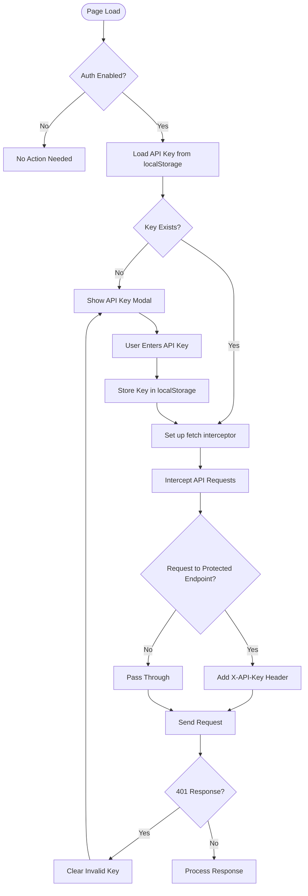

# Authentication Middleware

<cite>
**Referenced Files in This Document**   
- [auth.py](file://opencontext/server/middleware/auth.py)
- [config.yaml](file://config/config.yaml)
- [api_auth.js](file://opencontext/web/static/js/api_auth.js)
- [context.py](file://opencontext/server/routes/context.py)
- [documents.py](file://opencontext/server/routes/documents.py)
- [conversation.py](file://opencontext/server/routes/conversation.py)
- [messages.py](file://opencontext/server/routes/messages.py)
- [health.py](file://opencontext/server/routes/health.py)
- [redact.ts](file://frontend/packages/shared/logger/redact.ts)
</cite>

## Table of Contents
1. [Introduction](#introduction)
2. [Authentication Mechanism](#authentication-mechanism)
3. [Configuration](#configuration)
4. [Middleware Implementation](#middleware-implementation)
5. [Route Integration](#route-integration)
6. [Client-Side Handling](#client-side-handling)
7. [Security Considerations](#security-considerations)
8. [Error Handling](#error-handling)
9. [Best Practices](#best-practices)

## Introduction
The OpenContext backend implements an API key-based authentication middleware to secure its API endpoints. This documentation details the authentication system that protects the backend services, focusing on the token-based authentication mechanism using API keys. The middleware is built using FastAPI's dependency system and provides flexible configuration for enabling/disabling authentication, managing valid API keys, and defining excluded paths. The system is designed to be both secure and developer-friendly, with comprehensive logging and error handling.

**Section sources**
- [auth.py](file://opencontext/server/middleware/auth.py#L1-L112)

## Authentication Mechanism
The authentication middleware implements an API key-based security model that verifies requests through either HTTP headers or query parameters. The system supports multiple authentication methods, with the primary method being the X-API-Key header. The middleware checks for the API key in the "X-API-Key" header or "api_key" query parameter, providing flexibility for different client implementations. Authentication can be globally enabled or disabled through configuration, and specific paths can be excluded from authentication requirements.

The verification process follows a three-step approach: first checking if authentication is enabled, then determining if the requested path is excluded from authentication, and finally validating the provided API key against the configured valid keys. This layered approach ensures that health checks and static resources remain accessible while protecting sensitive API endpoints. The system also supports wildcard matching for excluded paths, allowing flexible configuration of public endpoints.



**Diagram sources**
- [auth.py](file://opencontext/server/middleware/auth.py#L68-L110)

**Section sources**
- [auth.py](file://opencontext/server/middleware/auth.py#L68-L110)

## Configuration
Authentication settings are configured through the config.yaml file, which provides a flexible structure for managing API security. The api_auth section contains three main configuration options: enabled (boolean flag to turn authentication on/off), api_keys (list of valid API keys), and excluded_paths (list of paths that don't require authentication). API keys can be specified directly in the configuration or referenced as environment variables using the ${VARIABLE_NAME:default} syntax.

The excluded_paths configuration supports wildcard patterns using fnmatch, allowing administrators to exclude entire path patterns from authentication requirements. By default, health check endpoints, the root path, and static resources are excluded from authentication. This configuration approach enables fine-grained control over which endpoints require authentication while maintaining system accessibility for monitoring and public resources.

```mermaid
erDiagram
AUTH_CONFIG {
boolean enabled
string[] api_keys
string[] excluded_paths
}
AUTH_CONFIG ||--o{ API_KEY : contains
AUTH_CONFIG ||--o{ EXCLUDED_PATH : excludes
class API_KEY {
string key_value
string source
}
class EXCLUDED_PATH {
string path_pattern
boolean wildcard
}
```

**Diagram sources**
- [config.yaml](file://config/config.yaml#L192-L211)
- [auth.py](file://opencontext/server/middleware/auth.py#L31-L54)

**Section sources**
- [config.yaml](file://config/config.yaml#L192-L211)
- [auth.py](file://opencontext/server/middleware/auth.py#L31-L54)

## Middleware Implementation
The authentication middleware is implemented as a FastAPI dependency that can be applied to individual routes or entire route groups. The core component is the verify_api_key function, which serves as the dependency callable and returns the validated API key upon successful authentication. This function leverages FastAPI's Header and Query dependencies to extract the API key from either the "X-API-Key" header or "api_key" query parameter, providing flexibility for different client implementations.

The middleware includes several supporting functions that handle configuration retrieval and path exclusion checks. The get_auth_config function retrieves authentication settings from the global configuration system, while is_path_excluded uses wildcard matching to determine if a request path should bypass authentication. The auth_dependency variable provides a convenient reference to the configured dependency, allowing easy integration across route handlers. The implementation also includes caching of authentication configuration to improve performance and a reset_auth_cache function for testing purposes.



**Diagram sources**
- [auth.py](file://opencontext/server/middleware/auth.py#L1-L112)

**Section sources**
- [auth.py](file://opencontext/server/middleware/auth.py#L1-L112)

## Route Integration
The authentication middleware is integrated into API routes through FastAPI's dependency system, using the auth_dependency in route handler function signatures. This approach allows for granular control over which endpoints require authentication. The pattern is consistent across route modules: routes that require authentication include the _auth parameter with the auth_dependency, while public endpoints omit this dependency.

Multiple route files demonstrate this integration pattern, including context.py, documents.py, conversation.py, and messages.py. Each of these files imports the auth_dependency from the middleware module and applies it to protected endpoints. The middleware is applied at the route handler level, allowing different endpoints within the same router to have different authentication requirements. This flexible approach enables the creation of hybrid APIs with both public and private endpoints.



**Diagram sources**
- [context.py](file://opencontext/server/routes/context.py#L21)
- [documents.py](file://opencontext/server/routes/documents.py#L18)
- [conversation.py](file://opencontext/server/routes/conversation.py#L17)
- [messages.py](file://opencontext/server/routes/messages.py#L17)

**Section sources**
- [context.py](file://opencontext/server/routes/context.py#L73)
- [documents.py](file://opencontext/server/routes/documents.py#L44)
- [conversation.py](file://opencontext/server/routes/conversation.py#L80)
- [messages.py](file://opencontext/server/routes/messages.py#L106)

## Client-Side Handling
The frontend implementation includes JavaScript utilities to handle API authentication, ensuring seamless integration between the client and protected endpoints. The APIAuth class in api_auth.js manages API key storage, request interception, and authentication flow. It uses localStorage to persist the API key between sessions and automatically injects the X-API-Key header into requests to protected endpoints.

The client-side implementation includes a modal interface for API key management, which appears when authentication is required but no valid key is available. This user interface guides users through the process of entering their API key. The implementation also includes error handling for authentication failures, clearing invalid keys and prompting users to re-enter their credentials. A fetch monkey patch intercepts API calls and adds authentication headers, providing transparent authentication for application code.



**Diagram sources**
- [api_auth.js](file://opencontext/web/static/js/api_auth.js#L9-L287)

**Section sources**
- [api_auth.js](file://opencontext/web/static/js/api_auth.js#L9-L287)

## Security Considerations
The authentication system incorporates several security measures to protect against common vulnerabilities and ensure robust protection of API endpoints. The server-side implementation includes comprehensive logging of authentication attempts, with warnings for missing or invalid API keys. The system also validates that at least one valid API key is configured when authentication is enabled, preventing accidental exposure of protected endpoints.

On the client side, the redact function in redact.ts ensures that sensitive authentication information is not logged in plaintext. This function specifically masks password fields, token values, and authorization headers in log output, preventing accidental exposure of credentials in log files. The use of the X-API-Key header (rather than Authorization: Bearer) provides explicit semantics for API key authentication and helps prevent confusion with other authentication schemes.

The configuration system supports environment variable references for API keys, enabling secure key management without hardcoding secrets in configuration files. The wildcard support for excluded paths is implemented using the fnmatch module, which provides safe pattern matching without the risks associated with regular expressions. The middleware also includes proper HTTP status codes (401 for unauthorized, 500 for configuration errors) to provide clear feedback while avoiding information leakage.

**Section sources**
- [auth.py](file://opencontext/server/middleware/auth.py#L89-L106)
- [redact.ts](file://frontend/packages/shared/logger/redact.ts#L9-L11)
- [config.yaml](file://config/config.yaml#L195-L196)

## Error Handling
The authentication middleware provides comprehensive error handling with descriptive messages and appropriate HTTP status codes. When no API key is provided, the system returns a 401 Unauthorized status with a detailed message explaining how to provide the API key via header or query parameter. For invalid API keys, a 401 Unauthorized status is returned with a generic "Invalid API key" message to prevent enumeration attacks.

The system also handles configuration errors, returning a 500 Internal Server Error when authentication is enabled but no valid API keys are configured. This prevents the accidental exposure of protected endpoints due to misconfiguration. All authentication events are logged with appropriate severity levels: debug for successful authentication, warning for missing or invalid keys, and error for configuration issues.

The client-side implementation complements the server-side error handling by detecting 401 responses and triggering the API key modal interface. This creates a seamless user experience where authentication failures are handled gracefully, guiding users to resolve authentication issues without exposing technical details.

**Section sources**
- [auth.py](file://opencontext/server/middleware/auth.py#L90-L106)
- [api_auth.js](file://opencontext/web/static/js/api_auth.js#L111-L116)

## Best Practices
To ensure secure and reliable operation of the authentication system, several best practices should be followed. In production environments, authentication should be enabled by setting api_auth.enabled to true in the configuration file. API keys should be generated using cryptographically secure random generators and should be sufficiently long (recommended 32+ characters) to prevent brute force attacks.

API keys should be stored in environment variables rather than in configuration files, using the ${VARIABLE_NAME:default} syntax in config.yaml. This prevents accidental exposure of keys in version control systems. Regular key rotation is recommended, with old keys being deactivated after a suitable grace period. The system should be monitored for repeated failed authentication attempts, which may indicate brute force attacks.

For client applications, API keys should be stored securely using platform-appropriate mechanisms (localStorage with encryption, keychain services, etc.). The X-API-Key header should be used instead of query parameters when possible, as headers are less likely to be logged by intermediaries. Sensitive operations should require additional authorization checks beyond API key authentication, implementing a defense-in-depth approach to security.

**Section sources**
- [config.yaml](file://config/config.yaml#L193-L211)
- [auth.py](file://opencontext/server/middleware/auth.py#L68-L110)
- [api_auth.js](file://opencontext/web/static/js/api_auth.js#L27-L32)