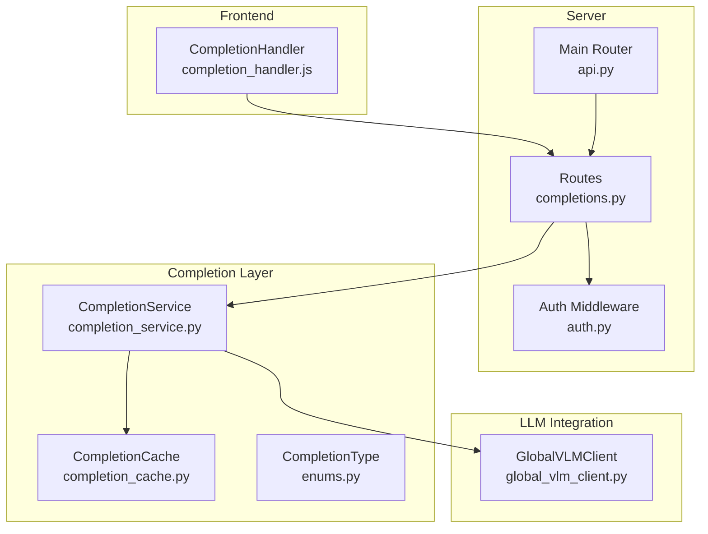
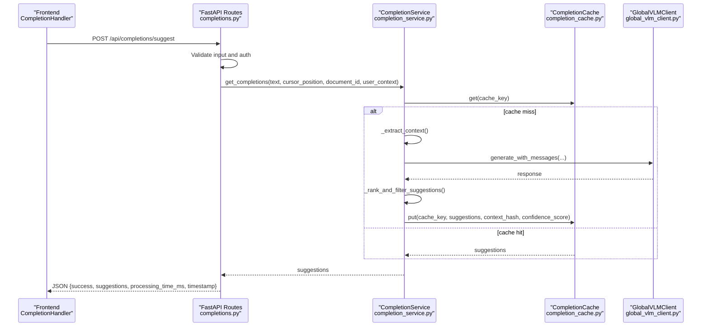
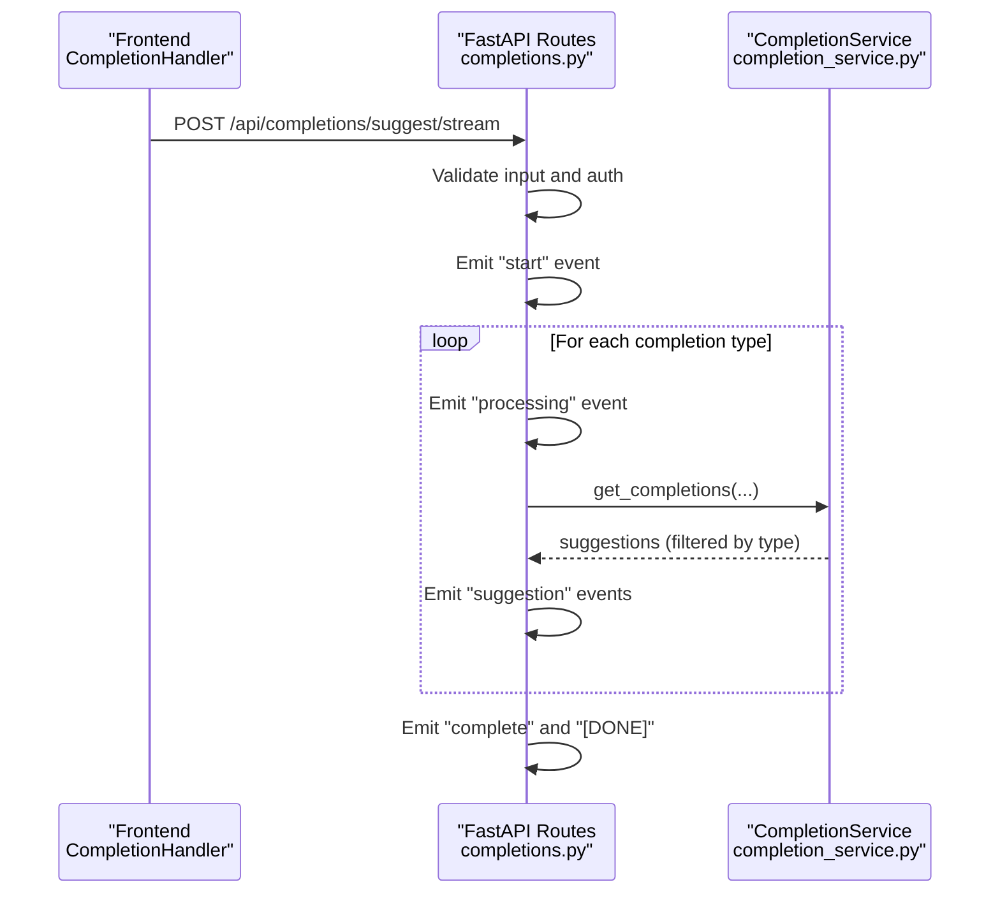
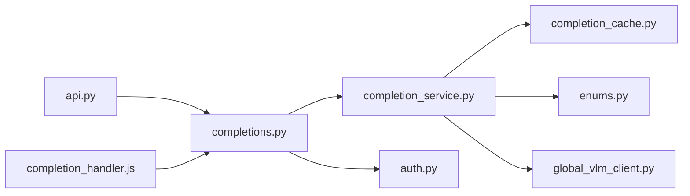

# Completions API

<cite>
**Referenced Files in This Document**
- [completions.py](file://opencontext/server/routes/completions.py)
- [completion_service.py](file://opencontext/context_consumption/completion/completion_service.py)
- [completion_cache.py](file://opencontext/context_consumption/completion/completion_cache.py)
- [enums.py](file://opencontext/models/enums.py)
- [global_vlm_client.py](file://opencontext/llm/global_vlm_client.py)
- [auth.py](file://opencontext/server/middleware/auth.py)
- [api.py](file://opencontext/server/api.py)
- [completion_handler.js](file://opencontext/web/static/js/completion_handler.js)
</cite>

## Table of Contents
1. [Introduction](#introduction)
2. [Project Structure](#project-structure)
3. [Core Components](#core-components)
4. [Architecture Overview](#architecture-overview)
5. [Detailed Component Analysis](#detailed-component-analysis)
6. [Dependency Analysis](#dependency-analysis)
7. [Performance Considerations](#performance-considerations)
8. [Troubleshooting Guide](#troubleshooting-guide)
9. [Conclusion](#conclusion)
10. [Appendices](#appendices)

## Introduction
This document provides comprehensive API documentation for the AI-powered content suggestions and auto-completion system centered around the POST /api/completions/suggest endpoint. It covers the input schema, response format, integration with the CompletionService and LLM capabilities, usage examples for code completion, text expansion, and form filling, as well as rate limiting, caching strategies, performance considerations, and error handling/fallback mechanisms.

## Project Structure
The Completions API is implemented as part of the FastAPI server routes and integrates with a dedicated completion service and cache layer. The frontend JavaScript handler demonstrates real-time usage and includes client-side caching and debouncing.

**Diagram sources**
- [completions.py](file://opencontext/server/routes/completions.py#L1-L120)
- [completion_service.py](file://opencontext/context_consumption/completion/completion_service.py#L1-L120)
- [completion_cache.py](file://opencontext/context_consumption/completion/completion_cache.py#L1-L120)
- [enums.py](file://opencontext/models/enums.py#L360-L367)
- [global_vlm_client.py](file://opencontext/llm/global_vlm_client.py#L1-L120)
- [auth.py](file://opencontext/server/middleware/auth.py#L1-L113)
- [api.py](file://opencontext/server/api.py#L1-L58)
- [completion_handler.js](file://opencontext/web/static/js/completion_handler.js#L1-L120)

**Section sources**
- [completions.py](file://opencontext/server/routes/completions.py#L1-L120)
- [api.py](file://opencontext/server/api.py#L1-L58)

## Core Components
- POST /api/completions/suggest: Returns completion suggestions based on the provided text, cursor position, and optional document context.
- POST /api/completions/suggest/stream: Streams completion suggestions in real-time across multiple completion types.
- POST /api/completions/feedback: Submits user feedback to improve completion quality.
- GET /api/completions/stats: Retrieves service statistics including supported completion types and cache stats.
- GET /api/completions/cache/stats: Retrieves cache statistics.
- POST /api/completions/cache/optimize: Optimizes cache performance.
- POST /api/completions/cache/clear: Clears the completion cache.
- POST /api/completions/precompute/{document_id}: Precomputes document context for caching.

These endpoints integrate with the CompletionService, CompletionCache, CompletionType enum, and the GlobalVLMClient for LLM generation.

**Section sources**
- [completions.py](file://opencontext/server/routes/completions.py#L57-L329)
- [enums.py](file://opencontext/models/enums.py#L360-L367)
- [completion_service.py](file://opencontext/context_consumption/completion/completion_service.py#L1-L120)
- [completion_cache.py](file://opencontext/context_consumption/completion/completion_cache.py#L1-L120)
- [global_vlm_client.py](file://opencontext/llm/global_vlm_client.py#L1-L120)

## Architecture Overview
The Completions API follows a layered architecture:
- Route handlers validate inputs, enforce authentication, and orchestrate calls to the CompletionService.
- CompletionService extracts context, triggers completion strategies, ranks and deduplicates suggestions, and manages caching.
- CompletionCache stores and retrieves previously computed suggestions with configurable policies.
- GlobalVLMClient coordinates LLM generation and optional tool execution for semantic continuation.

**Diagram sources**
- [completions.py](file://opencontext/server/routes/completions.py#L57-L120)
- [completion_service.py](file://opencontext/context_consumption/completion/completion_service.py#L92-L154)
- [completion_cache.py](file://opencontext/context_consumption/completion/completion_cache.py#L83-L164)
- [global_vlm_client.py](file://opencontext/llm/global_vlm_client.py#L114-L175)

## Detailed Component Analysis

### API Endpoints and Schemas

- POST /api/completions/suggest
  - Purpose: Generate completion suggestions based on current document content and cursor position.
  - Authentication: Requires API key via header or query parameter when enabled.
  - Request body (CompletionRequest):
    - text: string, required. Current document content.
    - cursor_position: integer, required. Cursor position within the text.
    - document_id: integer, optional. Document identifier for context-aware caching.
    - completion_types: array of strings, optional. Filter suggestions by completion types.
    - max_suggestions: integer, optional. Limit number of returned suggestions.
    - context: object, optional. Additional context information (e.g., current_line, line_number, char_position).
  - Response (CompletionResponse):
    - success: boolean
    - suggestions: array of suggestion objects
    - processing_time_ms: number
    - cache_hit: boolean (currently always false)
    - error: string, optional (present on failure)
    - timestamp: ISO string
  - Behavior:
    - Validates text is non-empty and cursor_position is within bounds.
    - Calls CompletionService.get_completions.
    - Optionally filters by completion_types and limits suggestions.
    - Returns JSON with processing time and suggestions.

- POST /api/completions/suggest/stream
  - Purpose: Stream completion suggestions across multiple completion types.
  - Yields SSE events:
    - start: initial event with timestamp.
    - processing: indicates which completion type is being processed.
    - suggestion: emits a suggestion object.
    - complete: signals completion with total_suggestions count.
    - [DONE]: ends the stream.
  - Headers: no-cache, keep-alive, CORS headers included.

- POST /api/completions/feedback
  - Purpose: Submit user feedback to improve completion quality.
  - Request parameters:
    - suggestion_text: string
    - document_id: integer, optional
    - accepted: boolean
    - completion_type: string, optional
  - Response: success flag and message/error.

- GET /api/completions/stats
  - Returns service status, supported completion types, and cache stats.

- GET /api/completions/cache/stats
  - Returns cache statistics.

- POST /api/completions/cache/optimize
  - Optimizes cache performance and returns updated stats.

- POST /api/completions/cache/clear
  - Clears the completion cache.

- POST /api/completions/precompute/{document_id}
  - Precomputes document context for caching.

**Section sources**
- [completions.py](file://opencontext/server/routes/completions.py#L30-L120)
- [completions.py](file://opencontext/server/routes/completions.py#L134-L203)
- [completions.py](file://opencontext/server/routes/completions.py#L205-L329)

### CompletionService and Strategies
- CompletionService.get_completions:
  - Determines whether to trigger completion based on cursor position and surrounding characters.
  - Extracts context including before/after cursor, current line/paragraph, and document structure.
  - Generates cache key from context and document_id.
  - Checks CompletionCache for cached results; if absent, computes:
    - Semantic continuation: Uses LLM to generate continuation suggestions.
    - Template completion: Provides structured completions for headings, lists, code blocks.
    - Reference suggestions: Uses vector search to recall relevant content.
  - Ranks and deduplicates suggestions, caches results, and returns suggestions.
- CompletionSuggestion:
  - Fields: text, completion_type, confidence, context_used, timestamp.
  - to_dict() converts to response-friendly format.

**Section sources**
- [completion_service.py](file://opencontext/context_consumption/completion/completion_service.py#L29-L54)
- [completion_service.py](file://opencontext/context_consumption/completion/completion_service.py#L92-L154)
- [completion_service.py](file://opencontext/context_consumption/completion/completion_service.py#L159-L215)
- [completion_service.py](file://opencontext/context_consumption/completion/completion_service.py#L216-L242)
- [completion_service.py](file://opencontext/context_consumption/completion/completion_service.py#L243-L407)
- [completion_service.py](file://opencontext/context_consumption/completion/completion_service.py#L408-L450)
- [completion_service.py](file://opencontext/context_consumption/completion/completion_service.py#L451-L481)

### CompletionCache and Caching Strategies
- CompletionCache.get:
  - Thread-safe retrieval with TTL expiration and optional context hash validation.
  - Tracks hits/misses, evictions, and updates average response time.
  - Maintains LRU access order and hot keys for performance.
- CompletionCache.put:
  - Evicts entries according to strategy (LRU/TTL/Hybrid) and adds new entry.
- Optimization:
  - Cleans expired entries, updates hot keys, compacts access order, and prunes old precomputed contexts.
- Stats:
  - Provides cache_size, max_size, hit_rate, total_requests, hot_keys_count, precomputed_contexts, and estimated memory usage.

**Section sources**
- [completion_cache.py](file://opencontext/context_consumption/completion/completion_cache.py#L83-L164)
- [completion_cache.py](file://opencontext/context_consumption/completion/completion_cache.py#L165-L233)
- [completion_cache.py](file://opencontext/context_consumption/completion/completion_cache.py#L277-L334)
- [completion_cache.py](file://opencontext/context_consumption/completion/completion_cache.py#L335-L361)

### LLM Integration
- GlobalVLMClient.generate_with_messages:
  - Wraps LLMClient to generate responses given a message list.
  - Optionally executes tool calls and aggregates results before final response.
  - Provides async variants for streaming and agent-specific generation.

**Section sources**
- [global_vlm_client.py](file://opencontext/llm/global_vlm_client.py#L114-L175)
- [global_vlm_client.py](file://opencontext/llm/global_vlm_client.py#L176-L233)
- [global_vlm_client.py](file://opencontext/llm/global_vlm_client.py#L234-L317)

### Frontend Usage and Real-Time Suggestions
- CompletionHandler in the frontend:
  - Debounces requests, validates trigger conditions, and sends POST /api/completions/suggest.
  - Displays suggestions and supports keyboard navigation and acceptance.
  - Implements client-side caching keyed by context and cursor position.
  - Sends feedback via POST /api/completions/feedback upon acceptance.
  - Handles timeouts and invalidates stale suggestions when document content changes.

**Section sources**
- [completion_handler.js](file://opencontext/web/static/js/completion_handler.js#L1-L120)
- [completion_handler.js](file://opencontext/web/static/js/completion_handler.js#L121-L258)
- [completion_handler.js](file://opencontext/web/static/js/completion_handler.js#L259-L470)
- [completion_handler.js](file://opencontext/web/static/js/completion_handler.js#L471-L605)

### API Workflow Sequence (Streaming)

**Diagram sources**
- [completions.py](file://opencontext/server/routes/completions.py#L134-L203)
- [completion_service.py](file://opencontext/context_consumption/completion/completion_service.py#L92-L154)

### Completion Types
Supported completion types are defined in CompletionType:
- semantic_continuation
- template_completion
- reference_suggestion
- context_aware

These types influence suggestion generation and filtering.

**Section sources**
- [enums.py](file://opencontext/models/enums.py#L360-L367)

## Dependency Analysis
- Route handlers depend on:
  - CompletionService via get_completion_service().
  - Authentication middleware via auth_dependency.
  - CompletionType for filtering.
- CompletionService depends on:
  - CompletionCache for caching.
  - GlobalVLMClient for LLM generation.
  - Storage and prompt manager for context and retrieval.
- Frontend depends on:
  - CompletionHandler for request orchestration and UI integration.

**Diagram sources**
- [completions.py](file://opencontext/server/routes/completions.py#L1-L120)
- [completion_service.py](file://opencontext/context_consumption/completion/completion_service.py#L1-L120)
- [completion_cache.py](file://opencontext/context_consumption/completion/completion_cache.py#L1-L120)
- [enums.py](file://opencontext/models/enums.py#L360-L367)
- [global_vlm_client.py](file://opencontext/llm/global_vlm_client.py#L1-L120)
- [auth.py](file://opencontext/server/middleware/auth.py#L1-L113)
- [api.py](file://opencontext/server/api.py#L1-L58)
- [completion_handler.js](file://opencontext/web/static/js/completion_handler.js#L1-L120)

**Section sources**
- [completions.py](file://opencontext/server/routes/completions.py#L1-L120)
- [completion_service.py](file://opencontext/context_consumption/completion/completion_service.py#L1-L120)
- [completion_cache.py](file://opencontext/context_consumption/completion/completion_cache.py#L1-L120)
- [enums.py](file://opencontext/models/enums.py#L360-L367)
- [global_vlm_client.py](file://opencontext/llm/global_vlm_client.py#L1-L120)
- [auth.py](file://opencontext/server/middleware/auth.py#L1-L113)
- [api.py](file://opencontext/server/api.py#L1-L58)
- [completion_handler.js](file://opencontext/web/static/js/completion_handler.js#L1-L120)

## Performance Considerations
- Caching:
  - CompletionCache supports LRU/TTL/Hybrid strategies, hot keys, and precomputed contexts.
  - Cache statistics include hit rate, eviction counts, and memory usage estimates.
  - Use POST /api/completions/cache/optimize to prune expired entries and hot keys.
- Trigger conditions:
  - CompletionService checks minimum trigger length and cursor position to avoid unnecessary calls.
- Streaming:
  - Use POST /api/completions/suggest/stream for real-time progress display and immediate partial results.
- Frontend:
  - Debounce requests, client-side caching keyed by context and cursor position, and request timeouts prevent excessive load.
- LLM latency:
  - GlobalVLMClient supports tool execution and async streaming; tune timeouts accordingly.

[No sources needed since this section provides general guidance]

## Troubleshooting Guide
- Authentication failures:
  - Ensure API key is provided via X-API-Key header or api_key query parameter when authentication is enabled.
- Validation errors:
  - Empty text or invalid cursor_position will result in HTTP 400 errors.
- LLM/tool errors:
  - CompletionService catches exceptions and returns empty suggestions; check logs for underlying errors.
- Cache issues:
  - Use GET /api/completions/cache/stats to inspect cache metrics.
  - Use POST /api/completions/cache/clear to clear cache and POST /api/completions/cache/optimize to optimize.
- Feedback collection:
  - POST /api/completions/feedback records user feedback; ensure accepted flag and completion_type are provided.

**Section sources**
- [auth.py](file://opencontext/server/middleware/auth.py#L68-L113)
- [completions.py](file://opencontext/server/routes/completions.py#L69-L120)
- [completion_service.py](file://opencontext/context_consumption/completion/completion_service.py#L159-L215)
- [completion_cache.py](file://opencontext/context_consumption/completion/completion_cache.py#L315-L361)
- [completions.py](file://opencontext/server/routes/completions.py#L205-L240)

## Conclusion
The Completions API provides a robust, extensible system for AI-powered content suggestions. It integrates FastAPI routes, a caching layer, and LLM capabilities to deliver real-time, context-aware completions. With configurable completion types, streaming support, and comprehensive statistics, it supports diverse use cases including code completion, text expansion, and form filling. Proper caching, authentication, and feedback mechanisms ensure reliability and continuous improvement.

[No sources needed since this section summarizes without analyzing specific files]

## Appendices

### API Definitions

- POST /api/completions/suggest
  - Request body: CompletionRequest
  - Response: CompletionResponse
  - Notes: Filters by completion_types and limits suggestions via max_suggestions.

- POST /api/completions/suggest/stream
  - Response: Server-Sent Events (start, processing, suggestion, complete, [DONE])

- POST /api/completions/feedback
  - Request parameters: suggestion_text, document_id, accepted, completion_type
  - Response: success flag and message/error

- GET /api/completions/stats
  - Response: service_status, cache_stats, supported_types, timestamp

- GET /api/completions/cache/stats
  - Response: cache statistics

- POST /api/completions/cache/optimize
  - Response: success flag and stats

- POST /api/completions/cache/clear
  - Response: success flag and message

- POST /api/completions/precompute/{document_id}
  - Request body: content
  - Response: success flag and message

**Section sources**
- [completions.py](file://opencontext/server/routes/completions.py#L57-L329)

### Usage Examples

- Code completion:
  - Scenario: User types within a code block; suggestions include template completion for fenced code blocks and semantic continuation for context-aware code ideas.
  - Steps:
    - Frontend detects cursor position and content.
    - Calls POST /api/completions/suggest with text, cursor_position, and optional document_id.
    - Receives suggestions and displays them; user accepts via keyboard or click.
    - On acceptance, sends POST /api/completions/feedback with accepted=true and completion_type.

- Text expansion:
  - Scenario: User starts writing a heading or list item; suggestions include template completion for continuing headings/lists and semantic continuation for related content.
  - Steps:
    - Frontend triggers completion when appropriate.
    - Calls POST /api/completions/suggest/stream to receive streaming suggestions.
    - Renders suggestions and allows selection.

- Form filling:
  - Scenario: User fills a form field; suggestions include reference suggestions drawn from previous entries or related content.
  - Steps:
    - Frontend sends request with context containing current_line and line_number.
    - Backend returns reference suggestions with context_used metadata indicating source.

**Section sources**
- [completion_handler.js](file://opencontext/web/static/js/completion_handler.js#L121-L258)
- [completion_service.py](file://opencontext/context_consumption/completion/completion_service.py#L296-L351)
- [completion_service.py](file://opencontext/context_consumption/completion/completion_service.py#L352-L407)