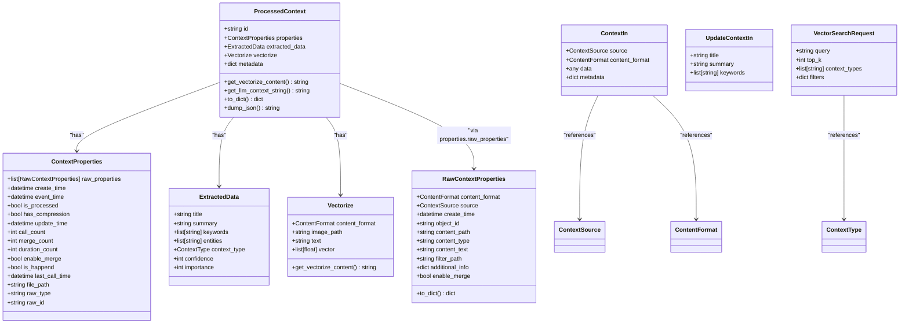

# Context Management API

<cite>
**Referenced Files in This Document**   
- [context.py](file://opencontext/server/routes/context.py)
- [context_operations.py](file://opencontext/server/context_operations.py)
- [context.py](file://opencontext/models/context.py)
- [enums.py](file://opencontext/models/enums.py)
- [unified_storage.py](file://opencontext/storage/unified_storage.py)
- [opencontext.py](file://opencontext/server/opencontext.py)
- [screenshot.py](file://opencontext/context_capture/screenshot.py)
- [web_link_capture.py](file://opencontext/context_capture/web_link_capture.py)
- [document_processor.py](file://opencontext/context_processing/processor/document_processor.py)
</cite>

## Table of Contents
1. [Introduction](#introduction)
2. [Core Data Structures](#core-data-structures)
3. [Context Creation Endpoints](#context-creation-endpoints)
4. [Context Retrieval Endpoints](#context-retrieval-endpoints)
5. [Context Processing Pipeline](#context-processing-pipeline)
6. [Data Filtering and Pagination](#data-filtering-and-pagination)
7. [Context Data Examples](#context-data-examples)
8. [Integration with Context Capture System](#integration-with-context-capture-system)
9. [Data Privacy and Retention](#data-privacy-and-retention)
10. [Error Handling](#error-handling)

## Introduction
The Context Management API provides a comprehensive interface for creating, retrieving, and manipulating contextual data within the OpenContext system. This API serves as the central hub for managing various types of contextual information captured from different sources including screenshots, documents, web links, and user inputs. The system is designed to transform raw context properties into structured, processed data that can be efficiently searched and utilized.

The API follows a RESTful design pattern with JSON-based request and response payloads. It integrates with a sophisticated processing pipeline that captures raw context data, processes it through specialized processors, and stores the structured results in a unified storage system. The architecture supports multiple context types, each representing different categories of information such as entity profiles, activity records, intent planning, semantic knowledge, procedural workflows, and state monitoring.

This documentation details the available endpoints, request/response schemas, data processing workflows, and integration points with the context capture system. It also covers filtering and pagination parameters for context retrieval, examples of context data structures for different source types, and considerations for data privacy and retention.

**Section sources**
- [context.py](file://opencontext/server/routes/context.py#L1-L146)
- [opencontext.py](file://opencontext/server/opencontext.py#L1-L300)

## Core Data Structures

The Context Management API utilizes several key data structures to represent context information at different stages of processing. These structures are defined using Pydantic models and form the foundation of the API's request and response schemas.

The primary data model is `ProcessedContext`, which represents fully processed context data with extracted information, metadata, and vectorization data. This model contains several nested components:

- `ContextProperties`: Contains metadata about the context including creation time, update time, processing status, and references to raw properties
- `ExtractedData`: Contains the structured information extracted from the context such as title, summary, keywords, entities, and context type
- `Vectorize`: Contains information for vector representation including text content and embedding vectors
- `RawContextProperties`: Represents the original raw context data with source information, content format, and additional metadata

The API also defines input models for various operations:
- `ContextIn`: Used for creating new contexts with source, content format, data, and optional metadata
- `UpdateContextIn`: Used for updating existing contexts with title, summary, and keywords
- `QueryIn`: Used for simple query operations
- `ConsumeIn`: Used for consuming contexts with a query and context IDs
- `ContextDetailRequest`: Used for requesting specific context details by ID and type
- `VectorSearchRequest`: Used for vector-based searches with query, top_k, context types, and filters

These data structures enable the system to maintain a rich representation of context information while providing a clean interface for API consumers.



**Diagram sources **
- [context.py](file://opencontext/models/context.py#L1-L343)
- [enums.py](file://opencontext/models/enums.py#L1-L367)

**Section sources**
- [context.py](file://opencontext/models/context.py#L1-L343)
- [enums.py](file://opencontext/models/enums.py#L1-L367)

## Context Creation Endpoints

The Context Management API provides endpoints for creating and updating context data. These endpoints handle the ingestion of raw context properties and their transformation into structured, processed data.

The primary endpoint for context creation is not explicitly defined in the provided code, but the system supports context creation through the `add_context` method in the `OpenContext` class. This method accepts a `RawContextProperties` object and processes it through the system's processing pipeline.

For updating existing contexts, the API provides a model for update operations through the `UpdateContextIn` class, which allows modifying the title, summary, and keywords of a context. While the specific update endpoint is not shown in the provided code, the system supports updating contexts through the `update_context` method in the `ContextOperations` class.

The system also supports specialized context creation for specific source types:
- Screenshots can be added using the `add_screenshot` method, which takes parameters for the image path, window title, creation time, and application
- Documents can be added using the `add_document` method, which takes a file path
- Web links can be processed through the `WebLinkCapture` component, which converts URLs to Markdown or PDF format

When a new context is created, it goes through the following workflow:
1. The raw context data is captured from its source
2. The data is packaged into a `RawContextProperties` object with appropriate metadata
3. The context is passed to the processor manager for processing
4. Processors extract structured information and generate a `ProcessedContext` object
5. The processed context is stored in the unified storage system


**Diagram sources **
- [opencontext.py](file://opencontext/server/opencontext.py#L1-L300)
- [context_operations.py](file://opencontext/server/context_operations.py#L1-L224)
- [unified_storage.py](file://opencontext/storage/unified_storage.py#L1-L800)

**Section sources**
- [opencontext.py](file://opencontext/server/opencontext.py#L1-L300)
- [context_operations.py](file://opencontext/server/context_operations.py#L1-L224)

## Context Retrieval Endpoints

The Context Management API provides several endpoints for retrieving context data, with a focus on flexible search capabilities and efficient data retrieval.

The primary retrieval endpoints include:

- `GET /api/context_types`: Retrieves all available context types in the system
- `POST /api/vector_search`: Performs a direct vector search without using an LLM, allowing for fast similarity-based retrieval
- `POST /contexts/detail`: Retrieves detailed information about a specific context by ID and type, returning an HTML response
- `POST /contexts/delete`: Deletes a processed context by its ID and context type

The vector search endpoint (`/api/vector_search`) is particularly powerful, accepting a `VectorSearchRequest` with the following parameters:
- `query`: The search query text
- `top_k`: The number of results to return (default 10)
- `context_types`: Optional list of context types to filter the search
- `filters`: Optional dictionary of additional filter conditions

The search functionality leverages the underlying vector database to perform similarity searches based on the vector representations of context data. This enables semantic search capabilities where contexts with similar meaning can be retrieved even if they don't contain exact keyword matches.

The API also supports retrieving all contexts with pagination and filtering through the `get_all_contexts` method, which accepts parameters for limit, offset, and filter criteria. This allows clients to efficiently browse through large collections of context data without overwhelming the system or network.


**Diagram sources **
- [context.py](file://opencontext/server/routes/context.py#L1-L146)
- [context_operations.py](file://opencontext/server/context_operations.py#L1-L224)
- [unified_storage.py](file://opencontext/storage/unified_storage.py#L1-L800)

**Section sources**
- [context.py](file://opencontext/server/routes/context.py#L1-L146)
- [context_operations.py](file://opencontext/server/context_operations.py#L1-L224)

## Context Processing Pipeline

The Context Management API is integrated with a sophisticated context processing pipeline that transforms raw context data into structured, searchable information. This pipeline consists of several components that work together to capture, process, and store context data.

The processing pipeline begins with context capture components that monitor various sources for new context data:
- `ScreenshotCapture`: Captures periodic screenshots from the user's screen
- `WebLinkCapture`: Captures web links and converts them to Markdown or PDF format
- `FolderMonitorCapture`: Monitors specified directories for new files
- `VaultDocumentMonitor`: Monitors the vault system for document changes

When context data is captured, it is packaged into `RawContextProperties` objects and passed to the `ContextProcessorManager`. This manager routes the data to appropriate processors based on the content type and source. The main processors include:

- `DocumentProcessor`: Handles various document formats including PDF, DOCX, XLSX, CSV, and text files
- `ScreenshotProcessor`: Processes screenshot images using vision language models to extract text and semantic information
- `EntityProcessor`: Extracts and manages entity-related information

The `DocumentProcessor` implements a sophisticated strategy for handling different document types:
- For structured documents (CSV, XLSX, JSONL), it uses specialized chunkers to extract tabular data
- For visual documents (PDF, DOCX, images), it employs a page-by-page analysis strategy that combines direct text extraction with vision language model (VLM) processing
- For plain text files, it uses text chunking algorithms to divide content into manageable segments

The processing workflow involves several steps:
1. Raw context data is captured from its source
2. The data is analyzed to determine the appropriate processing strategy
3. For visual content, VLM is used to extract text and semantic information
4. The extracted content is chunked into smaller segments
5. Each chunk is converted into a `ProcessedContext` object with metadata
6. The processed contexts are stored in the unified storage system

This pipeline enables the system to handle diverse content types while maintaining a consistent data model for retrieval and analysis.


**Diagram sources **
- [screenshot.py](file://opencontext/context_capture/screenshot.py#L1-L508)
- [web_link_capture.py](file://opencontext/context_capture/web_link_capture.py#L1-L351)
- [document_processor.py](file://opencontext/context_processing/processor/document_processor.py#L1-L653)
- [unified_storage.py](file://opencontext/storage/unified_storage.py#L1-L800)

**Section sources**
- [screenshot.py](file://opencontext/context_capture/screenshot.py#L1-L508)
- [web_link_capture.py](file://opencontext/context_capture/web_link_capture.py#L1-L351)
- [document_processor.py](file://opencontext/context_processing/processor/document_processor.py#L1-L653)

## Data Filtering and Pagination

The Context Management API provides robust filtering and pagination capabilities to efficiently retrieve context data from large datasets. These features are essential for managing the potentially vast amount of context information captured by the system.

For pagination, the API supports limit and offset parameters that allow clients to retrieve data in manageable chunks. The `get_all_contexts` method accepts these parameters to control the number of results returned and the starting position within the result set. The system enforces a maximum limit of 1000 results per request to prevent excessive memory usage and ensure responsive performance.

Filtering is supported through several mechanisms:
- Context type filtering: Clients can specify a list of context types to include in the search results
- Field-based filtering: The API supports filtering on specific fields within the context data
- Vector similarity filtering: The vector search functionality allows for semantic filtering based on content similarity

The filtering system is implemented through the `get_all_processed_contexts` method in the `UnifiedStorage` class, which accepts a filter parameter as a dictionary of key-value pairs. This allows for flexible filtering based on any field in the context data.

For vector searches, the API provides additional filtering capabilities through the `VectorSearchRequest` model, which includes:
- `context_types`: Restricts the search to specific context types
- `filters`: Allows for additional field-based filtering on the search results

The system also supports time-based filtering through parameters like `created_after`, `created_before`, `updated_after`, and `updated_before` in various retrieval methods, enabling clients to focus on context data within specific time ranges.

These filtering and pagination features work together to provide efficient access to context data, allowing clients to retrieve exactly the information they need without transferring unnecessary data over the network.

```mermaid
flowchart TD
A[Client Request] --> B{Request Type}
B --> |Get All Contexts| C[Apply Pagination]
B --> |Vector Search| D[Apply Filters]
C --> E[Validate limit and offset]
E --> F[Apply limit cap (1000)]
F --> G[Retrieve from Storage]
G --> H[Return Paginated Results]
D --> I[Parse VectorSearchRequest]
I --> J[Apply context_types filter]
J --> K[Apply additional filters]
K --> L[Execute Vector Search]
L --> M[Return Filtered Results]
N[Time-based Filtering] --> O[created_after]
N --> P[created_before]
N --> Q[updated_after]
N --> R[updated_before]
O --> G
P --> G
Q --> G
R --> G
```

**Diagram sources **
- [context_operations.py](file://opencontext/server/context_operations.py#L1-L224)
- [unified_storage.py](file://opencontext/storage/unified_storage.py#L1-L800)

**Section sources**
- [context_operations.py](file://opencontext/server/context_operations.py#L1-L224)
- [unified_storage.py](file://opencontext/storage/unified_storage.py#L1-L800)

## Context Data Examples

The Context Management API handles various types of context data from different sources, each with its own structure and characteristics. Below are examples of context data structures for different source types.

### Screenshot Context
When a screenshot is captured, it generates a context with the following structure:
- Source: `screenshot`
- Content format: `image`
- Additional metadata includes:
  - Window title
  - Application name
  - Screenshot format (png, jpg, etc.)
  - Coordinates of the captured region
  - Monitor ID (for multi-monitor setups)

The processed context includes extracted text from the image, identified entities, and a classification of the context type (e.g., code snippet, meeting notes, error message).

### Document Context
Documents from various formats generate contexts with rich metadata:
- Source: `local_file` or `web_link`
- Content format: `file`
- Additional metadata includes:
  - File name and extension
  - File size
  - MIME type
  - Document-specific properties (e.g., page count for PDFs)

For structured documents like spreadsheets, the system creates multiple context entries, one for each row or logical grouping of data. For text documents, the content is chunked based on semantic boundaries.

### Web Link Context
Web links are processed into contexts with the following characteristics:
- Source: `web_link`
- Content format: `file` (referring to the generated Markdown or PDF)
- Additional metadata includes:
  - Original URL
  - Page title
  - Content type
  - Generation timestamp

The system converts the web content to Markdown or PDF format, preserving the semantic structure while removing irrelevant elements like advertisements and navigation menus.

### Input Context
User-generated text content creates contexts with:
- Source: `input`
- Content format: `text`
- Additional metadata may include:
  - Input method (keyboard, voice, etc.)
  - Application context
  - Timestamp with millisecond precision

These examples demonstrate how the system normalizes diverse input types into a consistent data model while preserving source-specific information that may be valuable for context understanding and retrieval.


**Diagram sources **
- [context.py](file://opencontext/models/context.py#L1-L343)
- [enums.py](file://opencontext/models/enums.py#L1-L367)

**Section sources**
- [context.py](file://opencontext/models/context.py#L1-L343)
- [enums.py](file://opencontext/models/enums.py#L1-L367)

## Integration with Context Capture System

The Context Management API is tightly integrated with the context capture system, which is responsible for collecting raw context data from various sources and feeding it into the processing pipeline. This integration is facilitated through several key components and design patterns.

The `ContextCaptureManager` serves as the central coordinator for all capture components, providing a unified interface for registering, initializing, and controlling capture modules. It maintains a registry of capture components and manages their lifecycle, including starting, stopping, and monitoring their status.

Capture components implement the `ICaptureComponent` interface and are designed with loose coupling to allow for easy extension and replacement. Each component is responsible for a specific type of context capture:
- `ScreenshotCapture`: Handles periodic screen capturing
- `WebLinkCapture`: Manages web link processing
- `FolderMonitorCapture`: Monitors directories for file changes
- `VaultDocumentMonitor`: Tracks changes in the vault system

The integration between the capture system and the API follows an event-driven pattern. When a capture component detects new context data, it packages the data into `RawContextProperties` objects and passes them to a callback function registered with the `ContextCaptureManager`. This callback is typically the `_handle_captured_context` method in the `OpenContext` class, which then forwards the data to the processor manager for further processing.

The system uses a modular architecture with clear separation of concerns:
- Capture components focus solely on data collection
- The capture manager handles component coordination and lifecycle management
- The processor manager handles data transformation
- The storage system handles data persistence

This architecture enables the system to scale horizontally by adding new capture components without modifying existing code, and it supports graceful degradation if individual components fail.


**Diagram sources **
- [capture_manager.py](file://opencontext/managers/capture_manager.py#L1-L391)
- [opencontext.py](file://opencontext/server/opencontext.py#L1-L300)
- [unified_storage.py](file://opencontext/storage/unified_storage.py#L1-L800)

**Section sources**
- [capture_manager.py](file://opencontext/managers/capture_manager.py#L1-L391)
- [opencontext.py](file://opencontext/server/opencontext.py#L1-L300)

## Data Privacy and Retention

The Context Management API incorporates several data privacy and retention policies to ensure responsible handling of user data. These policies are implemented at multiple levels of the system architecture and are configurable through the system's configuration files.

Data retention policies are defined on a per-context-type basis, with different retention periods for different types of information:
- Entity context: 365 days
- Activity context: 90 days
- Intent context: 180 days
- Semantic context: 180 days
- Procedural context: 120 days
- State context: 7 days

These retention periods are configured in the `config.yaml` file under the `processing.context_merger` section and are enforced by the context merger component, which periodically cleans up expired contexts.

The system also implements data minimization principles by:
- Only storing necessary metadata with each context
- Using relative paths instead of absolute paths when possible
- Providing options to disable specific capture components
- Allowing users to delete contexts manually through the API

Privacy considerations are addressed through several mechanisms:
- API authentication can be enabled in production environments to restrict access
- Sensitive data can be filtered or redacted during processing
- Users have control over which directories are monitored for context capture
- The system supports local storage of sensitive data while using cloud services only for inference

Data security is enhanced by:
- Using environment variables for sensitive configuration (API keys, base URLs)
- Supporting HTTPS for API communication
- Implementing proper error handling that doesn't expose sensitive information
- Providing audit logging of system operations

These privacy and retention policies ensure that the system balances the utility of context management with the need to protect user privacy and comply with data protection regulations.

**Section sources**
- [config.yaml](file://config/config.yaml#L1-L253)
- [enums.py](file://opencontext/models/enums.py#L1-L367)
- [context_merger.py](file://opencontext/context_processing/merger/context_merger.py)

## Error Handling

The Context Management API implements comprehensive error handling to ensure reliable operation and provide meaningful feedback to clients. The system uses HTTP status codes and descriptive error messages to communicate the nature of any issues that occur during API operations.

For validation errors, the API returns HTTP 422 Unprocessable Entity with details about the specific validation failure. This includes cases where:
- Required fields are missing
- Field values are outside acceptable ranges
- Enum values are invalid
- Data types are incorrect

For resource not found errors, the API returns HTTP 404 Not Found, typically when attempting to retrieve or delete a context with an invalid ID or type combination.

Authentication and authorization errors are handled with appropriate HTTP status codes:
- HTTP 401 Unauthorized for missing or invalid authentication
- HTTP 403 Forbidden for insufficient permissions

Server-side errors are communicated with HTTP 500 Internal Server Error, accompanied by error details in the response body. The system logs detailed error information for debugging purposes while only exposing essential information to clients to prevent information leakage.

The API also implements specific error handling for various operations:
- Context creation failures due to invalid data or processing errors
- Search failures due to malformed queries or indexing issues
- Storage failures due to database connectivity problems
- Processing failures due to external service unavailability (e.g., LLM services)

Error responses follow a consistent format with fields for:
- Error code
- Status
- Message describing the error
- Optional details for debugging

This comprehensive error handling approach ensures that clients can effectively diagnose and resolve issues while maintaining system stability and security.

**Section sources**
- [context.py](file://opencontext/server/routes/context.py#L1-L146)
- [context_operations.py](file://opencontext/server/context_operations.py#L1-L224)
- [utils.py](file://opencontext/server/utils.py)