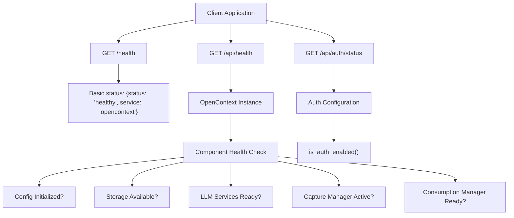
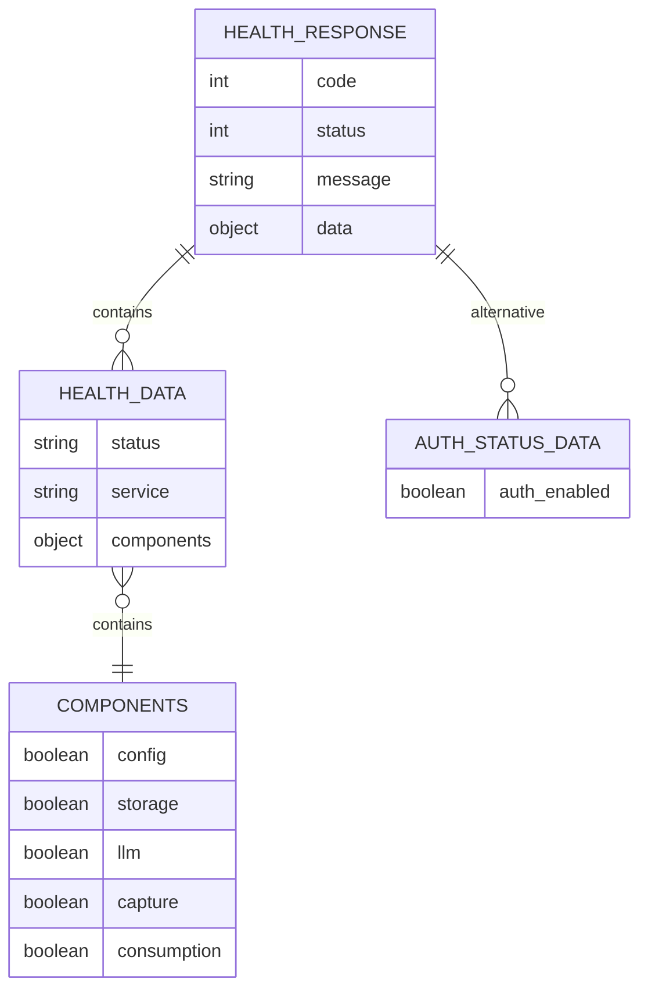
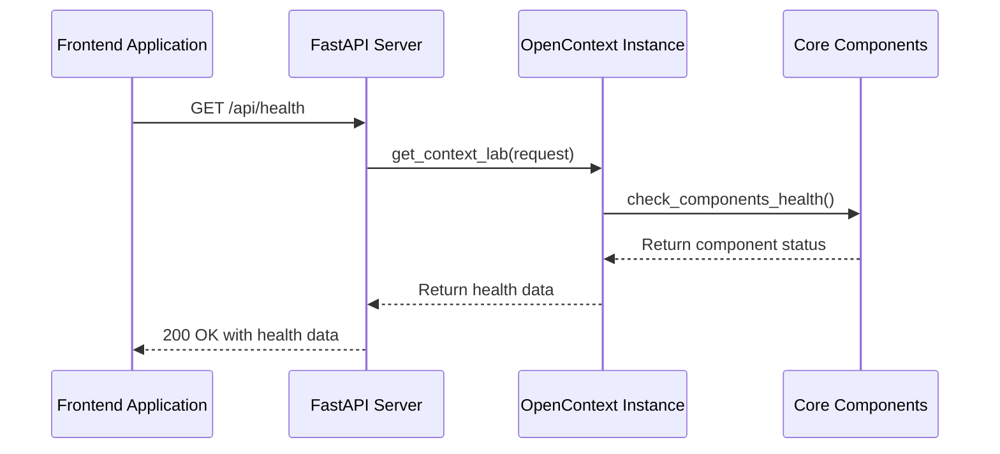
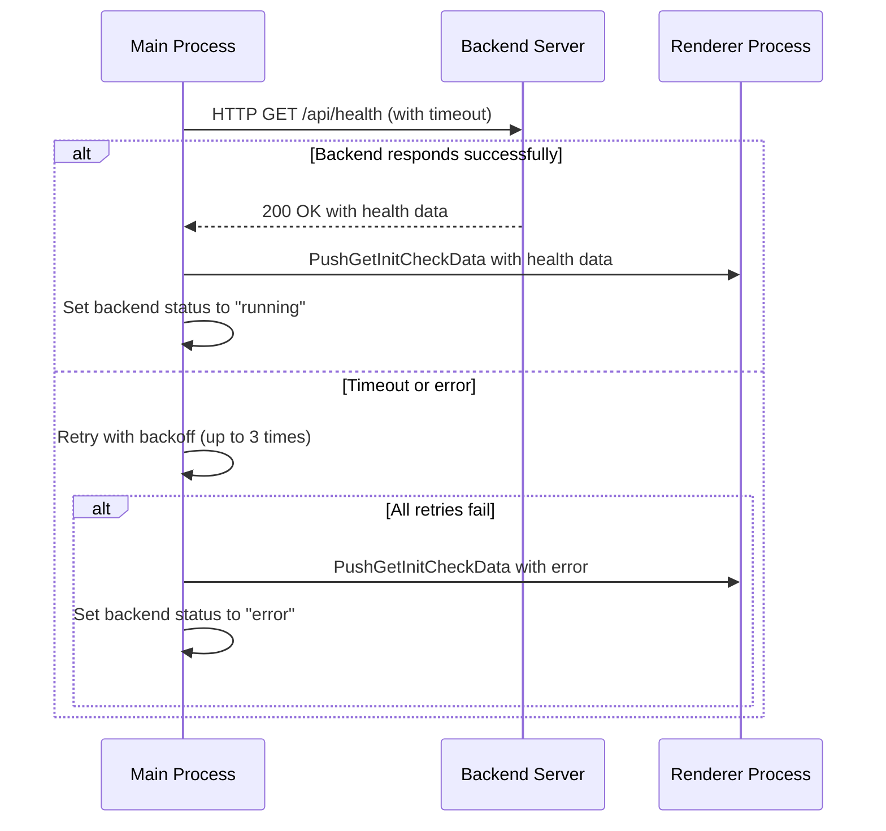
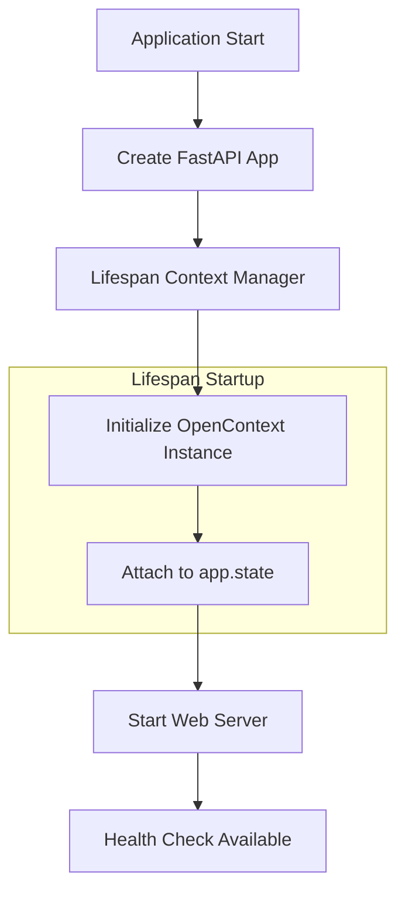

# Health Check API

<cite>
**Referenced Files in This Document**   
- [health.py](file://opencontext/server/routes/health.py)
- [opencontext.py](file://opencontext/server/opencontext.py)
- [utils.py](file://opencontext/server/utils.py)
- [cli.py](file://opencontext/cli.py)
- [auth.py](file://opencontext/server/middleware/auth.py)
- [backend.ts](file://frontend/src/main/backend.ts)
- [axiosConfig.ts](file://frontend/src/renderer/src/services/axiosConfig.ts)
</cite>

## Table of Contents
1. [Introduction](#introduction)
2. [Health Check Endpoints](#health-check-endpoints)
3. [Response Schema](#response-schema)
4. [System Monitoring Integration](#system-monitoring-integration)
5. [Frontend Connection Validation](#frontend-connection-validation)
6. [Error Handling and Common Issues](#error-handling-and-common-issues)
7. [FastAPI Application Lifecycle](#fastapi-application-lifecycle)

## Introduction
The Health Check API provides essential endpoints for monitoring the status and availability of the OpenContext backend server. These endpoints are critical for system monitoring, uptime verification, and connection validation between the frontend and backend components. The API offers multiple health check endpoints that return system status, service availability, and authentication configuration information.

**Section sources**
- [health.py](file://opencontext/server/routes/health.py#L1-L46)

## Health Check Endpoints
The OpenContext backend exposes three health check endpoints:

1. **GET /health**: A basic health check endpoint that returns a simple status response without requiring the OpenContext instance to be fully initialized.
2. **GET /api/health**: A detailed health check endpoint that verifies the status of all core components including configuration, storage, LLM services, capture, and consumption modules.
3. **GET /api/auth/status**: An endpoint that checks whether API authentication is enabled in the system.

The `/health` and `/api/health` endpoints are excluded from authentication requirements, allowing monitoring systems and the frontend to check server status without authentication.



**Diagram sources**
- [health.py](file://opencontext/server/routes/health.py#L19-L46)
- [opencontext.py](file://opencontext/server/opencontext.py#L260-L269)
- [auth.py](file://opencontext/server/middleware/auth.py#L36-L40)

**Section sources**
- [health.py](file://opencontext/server/routes/health.py#L19-L46)
- [auth.py](file://opencontext/server/middleware/auth.py#L50-L54)

## Response Schema
The health check endpoints return responses in a standardized JSON format using the `convert_resp` utility function. The response structure includes a standard wrapper with code, status, and message fields, with health data in the "data" property.

### Basic Health Check Response (GET /health)
```json
{
  "code": 0,
  "status": 200,
  "message": "success",
  "data": {
    "status": "healthy",
    "service": "opencontext"
  }
}
```

### Detailed Health Check Response (GET /api/health)
```json
{
  "code": 0,
  "status": 200,
  "message": "success",
  "data": {
    "status": "healthy",
    "service": "opencontext",
    "components": {
      "config": true,
      "storage": true,
      "llm": true,
      "capture": true,
      "consumption": true
    }
  }
}
```

### Authentication Status Response (GET /api/auth/status)
```json
{
  "code": 0,
  "status": 200,
  "message": "success",
  "data": {
    "auth_enabled": false
  }
}
```

When the health check fails, the endpoint returns a 503 Service Unavailable response:
```json
{
  "code": 503,
  "status": 503,
  "message": "Service unhealthy"
}
```



**Diagram sources**
- [health.py](file://opencontext/server/routes/health.py#L20-L40)
- [utils.py](file://opencontext/server/utils.py#L28-L40)

**Section sources**
- [health.py](file://opencontext/server/routes/health.py#L20-L40)
- [utils.py](file://opencontext/server/utils.py#L28-L40)

## System Monitoring Integration
The health check endpoints are integrated into the OpenContext system to provide comprehensive monitoring capabilities. The detailed health check at `/api/health` leverages the `check_components_health()` method of the OpenContext class to verify the status of all core components.

The component health check evaluates:
- **Configuration**: Whether the GlobalConfig instance is properly initialized
- **Storage**: Whether the GlobalStorage instance has a valid storage backend
- **LLM Services**: Whether both the GlobalEmbeddingClient and GlobalVLMClient are initialized
- **Capture System**: Whether the ContextCaptureManager is available
- **Consumption System**: Whether the ConsumptionManager is available

This comprehensive check ensures that all critical subsystems are operational before reporting the service as healthy.



**Diagram sources**
- [health.py](file://opencontext/server/routes/health.py#L25-L35)
- [opencontext.py](file://opencontext/server/opencontext.py#L260-L269)
- [utils.py](file://opencontext/server/utils.py#L20-L25)

**Section sources**
- [opencontext.py](file://opencontext/server/opencontext.py#L260-L269)
- [health.py](file://opencontext/server/routes/health.py#L25-L35)

## Frontend Connection Validation
The frontend application uses the health check endpoint to validate connectivity with the backend server during startup and runtime. The main process in `backend.ts` implements a robust health check mechanism that attempts to connect to the backend service and verify its health status.

The health check process includes:
- Multiple retry attempts with exponential backoff
- 5-second timeout for each request
- Logging of health check attempts and results
- Integration with the Electron IPC system to notify the renderer process

The frontend dynamically determines the backend port and constructs the health check URL accordingly, allowing for flexible deployment configurations.



**Diagram sources**
- [backend.ts](file://frontend/src/main/backend.ts#L87-L136)
- [health.py](file://opencontext/server/routes/health.py#L25-L35)

**Section sources**
- [backend.ts](file://frontend/src/main/backend.ts#L87-L136)
- [axiosConfig.ts](file://frontend/src/renderer/src/services/axiosConfig.ts#L1-L62)

## Error Handling and Common Issues
The health check implementation includes robust error handling to manage various failure scenarios. Understanding these error conditions is essential for troubleshooting connectivity and availability issues.

### Common Error Conditions
1. **503 Service Unavailable**: Returned when the health check fails due to component initialization issues. This indicates that one or more core components are not functioning properly.

2. **Timeout Errors**: The frontend implements a 5-second timeout for health check requests. Network connectivity issues or server overload can cause timeouts.

3. **Connection Refused**: Occurs when the backend server is not running or is listening on a different port than expected.

4. **Authentication Issues**: Although health check endpoints are excluded from authentication, misconfiguration could potentially affect accessibility.

### Troubleshooting Network Connectivity
When experiencing connectivity issues, consider the following:
- Verify that the backend server is running and listening on the expected port (default: 1733)
- Check firewall settings that might block localhost connections
- Ensure the frontend is using the correct port for the health check request
- Validate network connectivity between frontend and backend processes

The frontend's retry mechanism with exponential backoff helps mitigate transient network issues, attempting up to three times before reporting a failure.

**Section sources**
- [health.py](file://opencontext/server/routes/health.py#L35-L41)
- [backend.ts](file://frontend/src/main/backend.ts#L87-L136)

## FastAPI Application Lifecycle
The health check endpoints are integrated into the FastAPI application lifecycle through the lifespan context manager in `cli.py`. This ensures that the OpenContext instance is properly initialized and available for health checks.

During application startup:
1. The FastAPI app is created with a lifespan context manager
2. On startup, the context manager initializes the OpenContext instance and attaches it to the app state
3. The health check endpoints can then access the OpenContext instance via dependency injection

The `/health` endpoint is specifically designed to be available even before the OpenContext instance is fully initialized, making it suitable for early health verification during the startup process.



**Diagram sources**
- [cli.py](file://opencontext/cli.py#L44-L52)
- [utils.py](file://opencontext/server/utils.py#L20-L25)
- [health.py](file://opencontext/server/routes/health.py#L20-L22)

**Section sources**
- [cli.py](file://opencontext/cli.py#L44-L52)
- [utils.py](file://opencontext/server/utils.py#L20-L25)