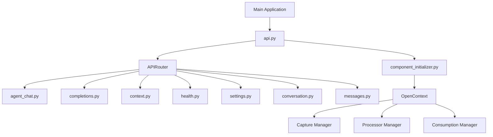
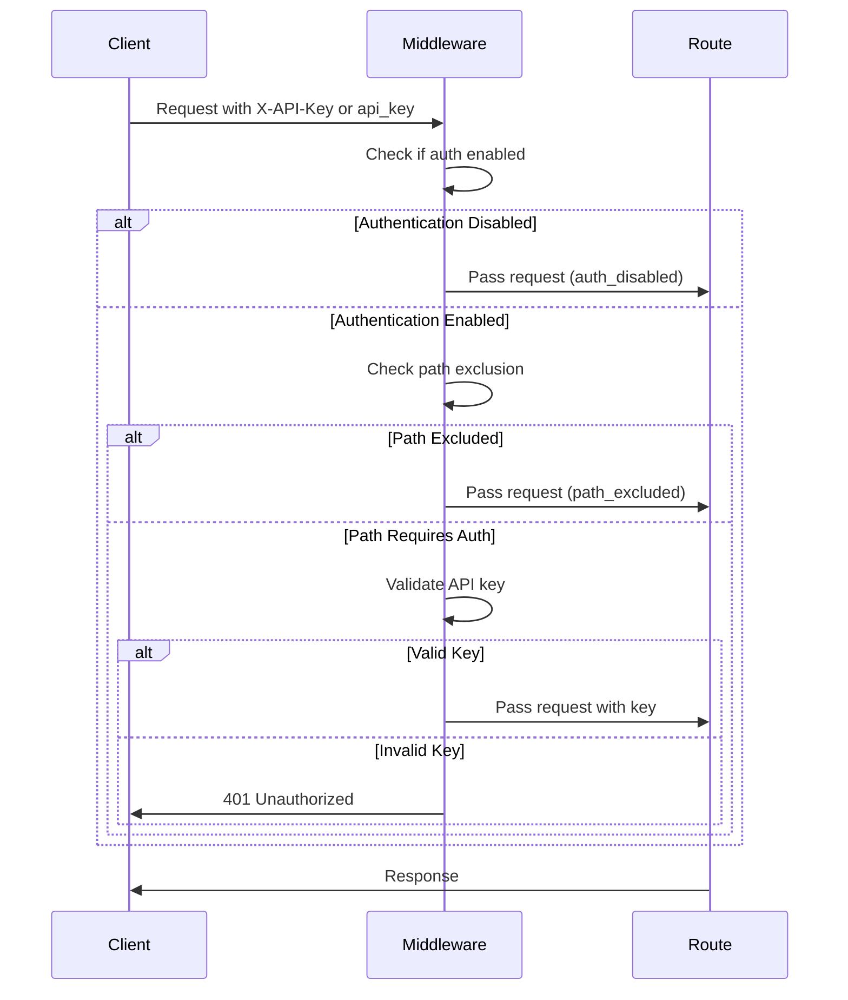
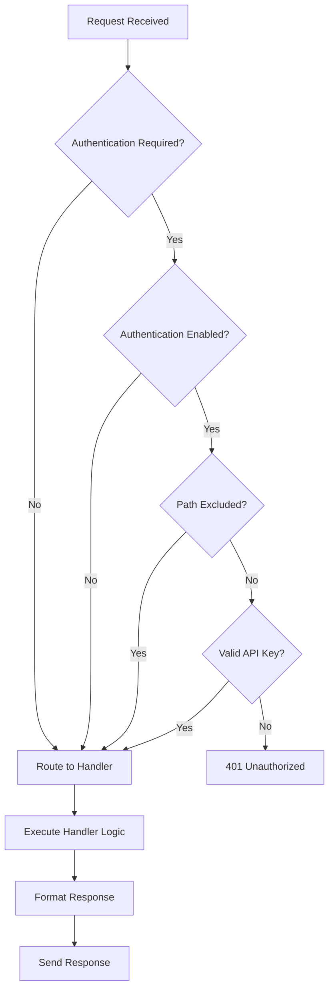

# Server Layer

<cite>
**Referenced Files in This Document**   
- [opencontext/server/api.py](file://opencontext/server/api.py)
- [opencontext/server/component_initializer.py](file://opencontext/server/component_initializer.py)
- [opencontext/server/middleware/auth.py](file://opencontext/server/middleware/auth.py)
- [opencontext/server/routes/agent_chat.py](file://opencontext/server/routes/agent_chat.py)
- [opencontext/server/routes/completions.py](file://opencontext/server/routes/completions.py)
- [opencontext/server/routes/context.py](file://opencontext/server/routes/context.py)
- [opencontext/server/routes/health.py](file://opencontext/server/routes/health.py)
- [opencontext/server/routes/settings.py](file://opencontext/server/routes/settings.py)
- [opencontext/server/opencontext.py](file://opencontext/server/opencontext.py)
- [opencontext/server/utils.py](file://opencontext/server/utils.py)
</cite>

## Table of Contents
1. [Introduction](#introduction)
2. [API Initialization and Routing](#api-initialization-and-routing)
3. [Authentication Middleware](#authentication-middleware)
4. [Endpoint Specifications](#endpoint-specifications)
5. [Request Flow and Processing](#request-flow-and-processing)
6. [API Usage Examples](#api-usage-examples)
7. [Security Practices](#security-practices)
8. [Extending the API](#extending-the-api)
9. [Conclusion](#conclusion)

## Introduction
The OpenContext server layer provides a FastAPI-based RESTful interface that serves as the backend for an intelligent context-aware application. This API facilitates communication between the frontend Electron application and various backend services responsible for context capture, processing, and intelligent content generation. The server exposes endpoints for agent-based chat, intelligent completions, context management, health checks, and system settings. The architecture is designed to be modular, with components initialized through a dependency injection pattern and routes registered via a centralized API router. The system supports both direct HTTP calls and inter-process communication (IPC) from the frontend, enabling rich interactions such as streaming chat responses and real-time content suggestions.

## API Initialization and Routing

The FastAPI application is initialized and configured through the `api.py` module, which serves as the central router configuration for the entire server. This module imports all route handlers and registers them with a single APIRouter instance, creating a unified interface for the application. The routing system is organized into distinct modules based on functionality, including agent_chat, completions, context, health, and settings.



**Diagram sources**
- [opencontext/server/api.py](file://opencontext/server/api.py#L1-L58)
- [opencontext/server/component_initializer.py](file://opencontext/server/component_initializer.py#L1-L229)
- [opencontext/server/opencontext.py](file://opencontext/server/opencontext.py#L1-L300)

The `api.py` file imports route modules and includes their routers using the `include_router` method. Each route module defines its own APIRouter with a specific prefix and tags for organization. The component_initializer.py module is responsible for initializing all system components, including capture managers, processor managers, and consumption managers, which are then made available to the route handlers through dependency injection. This separation of concerns allows for a clean architecture where the API layer is responsible for request handling and response formatting, while business logic is encapsulated in dedicated service classes.

**Section sources**
- [opencontext/server/api.py](file://opencontext/server/api.py#L1-L58)
- [opencontext/server/component_initializer.py](file://opencontext/server/component_initializer.py#L1-L229)

## Authentication Middleware

The API implements token-based authentication through a middleware component that verifies API keys for protected endpoints. The authentication system is configurable through the application's configuration file, allowing administrators to enable or disable authentication globally and specify valid API keys. The middleware provides flexible authentication options, accepting API keys via either the `X-API-Key` header or a query parameter named `api_key`.



**Diagram sources**
- [opencontext/server/middleware/auth.py](file://opencontext/server/middleware/auth.py#L1-L113)

The authentication middleware is implemented as a dependency that can be applied to individual routes or entire router groups. It uses a dependency injection pattern where the `auth_dependency` is passed as a parameter to route handlers. The system caches authentication configuration to improve performance and supports wildcard patterns in the excluded paths list, allowing entire directory trees to be excluded from authentication (e.g., `/static/*`). This design enables fine-grained control over which endpoints require authentication while maintaining high performance through configuration caching.

**Section sources**
- [opencontext/server/middleware/auth.py](file://opencontext/server/middleware/auth.py#L1-L113)

## Endpoint Specifications

### Agent Chat Endpoints
The agent chat endpoints provide an intelligent conversation interface based on the Context Agent system. These endpoints support both synchronous and streaming responses, allowing for real-time interaction with the AI system.

| Endpoint | HTTP Method | Description | Authentication Required |
|---------|------------|-------------|------------------------|
| `/api/agent/chat` | POST | Non-streaming chat interface | Yes |
| `/api/agent/chat/stream` | POST | Streaming chat interface with SSE | Yes |
| `/api/agent/resume/{workflow_id}` | POST | Resume a paused workflow | Yes |
| `/api/agent/state/{workflow_id}` | GET | Get current workflow state | Yes |
| `/api/agent/cancel/{workflow_id}` | DELETE | Cancel an active workflow | Yes |
| `/api/agent/test` | GET | Test agent functionality | Yes |

The chat endpoint accepts a `ChatRequest` model containing the user query, context information, session ID, and user ID. The streaming endpoint uses Server-Sent Events (SSE) to deliver responses incrementally, with special events for session start, thinking steps, and completion. The system maintains state for active streams, allowing clients to interrupt message generation by calling the interrupt endpoint.

### Completions Endpoints
The completions endpoints provide GitHub Copilot-like functionality for intelligent content completion in documents. These endpoints analyze the current document content and cursor position to generate relevant suggestions.

| Endpoint | HTTP Method | Description | Authentication Required |
|---------|------------|-------------|------------------------|
| `/api/completions/suggest` | POST | Get completion suggestions | Yes |
| `/api/completions/suggest/stream` | POST | Stream completion suggestions | Yes |
| `/api/completions/feedback` | POST | Submit feedback on suggestions | Yes |
| `/api/completions/stats` | GET | Get completion service statistics | Yes |
| `/api/completions/cache/stats` | GET | Get cache statistics | Yes |
| `/api/completions/cache/optimize` | POST | Optimize completion cache | Yes |
| `/api/completions/precompute/{document_id}` | POST | Precompute document context | Yes |
| `/api/completions/cache/clear` | POST | Clear completion cache | Yes |

The main suggestion endpoint accepts a `CompletionRequest` model with the current text, cursor position, document ID, and optional context. Clients can specify preferred completion types (semantic continuation, template completion, reference suggestions) and limit the number of suggestions returned. The streaming endpoint delivers suggestions incrementally, allowing the frontend to display results as they become available.

### Context Management Endpoints
The context management endpoints handle operations on processed context data, including retrieval, deletion, and vector search.

| Endpoint | HTTP Method | Description | Authentication Required |
|---------|------------|-------------|------------------------|
| `/contexts/delete` | POST | Delete a processed context | Yes |
| `/contexts/detail` | POST | Get detailed context information | Yes |
| `/api/context_types` | GET | Get all available context types | Yes |
| `/api/vector_search` | POST | Perform direct vector search | Yes |

The vector search endpoint allows clients to search the vector database directly without involving an LLM, which is useful for debugging and performance optimization. The search accepts a query string, number of results to return, optional context type filters, and additional metadata filters.

### Health Check Endpoints
The health check endpoints provide system status information and are accessible without authentication.

| Endpoint | HTTP Method | Description | Authentication Required |
|---------|------------|-------------|------------------------|
| `/health` | GET | Basic health check | No |
| `/api/health` | GET | Detailed health check with component status | No |
| `/api/auth/status` | GET | Check if authentication is enabled | No |

The detailed health check returns information about the status of key components including configuration, storage, LLM services, capture, and consumption systems.

### Settings Endpoints
The settings endpoints provide a comprehensive interface for managing system configuration, including model settings, general settings, and prompts.

| Endpoint | HTTP Method | Description | Authentication Required |
|---------|------------|-------------|------------------------|
| `/api/model_settings/get` | GET | Get current model configuration | Yes |
| `/api/model_settings/update` | POST | Update model configuration | Yes |
| `/api/model_settings/validate` | POST | Validate model configuration | Yes |
| `/api/settings/system_info` | GET | Get system information | Yes |
| `/api/settings/general` | GET/POST | Get or update general settings | Yes |
| `/api/settings/prompts` | GET/POST | Get or update prompts | Yes |
| `/api/settings/prompts/import` | POST | Import prompts from YAML | Yes |
| `/api/settings/prompts/export` | GET | Export prompts as YAML | Yes |
| `/api/settings/prompts/language` | GET/POST | Get or change prompt language | Yes |
| `/api/settings/reset` | POST | Reset all settings to defaults | Yes |

The model settings endpoints allow clients to configure both the VLM (Vision Language Model) and embedding models, including their providers, model IDs, base URLs, and API keys. The system validates the configuration by testing connectivity before applying changes.

**Section sources**
- [opencontext/server/routes/agent_chat.py](file://opencontext/server/routes/agent_chat.py#L1-L367)
- [opencontext/server/routes/completions.py](file://opencontext/server/routes/completions.py#L1-L329)
- [opencontext/server/routes/context.py](file://opencontext/server/routes/context.py#L1-L146)
- [opencontext/server/routes/health.py](file://opencontext/server/routes/health.py#L1-L47)
- [opencontext/server/routes/settings.py](file://opencontext/server/routes/settings.py#L1-L791)

## Request Flow and Processing

The request flow in the OpenContext server follows a consistent pattern across all endpoints, beginning with authentication and ending with response formatting. When a request arrives at the server, it first passes through the authentication middleware, which verifies the API key if required for the endpoint. Once authenticated, the request is routed to the appropriate handler function based on the URL pattern.



**Diagram sources**
- [opencontext/server/middleware/auth.py](file://opencontext/server/middleware/auth.py#L1-L113)
- [opencontext/server/api.py](file://opencontext/server/api.py#L1-L58)

The handler functions typically interact with service classes or managers to perform business logic. For example, the agent chat handler uses the ContextAgent class to process user queries, while the completions handler uses the CompletionService to generate suggestions. These service classes are initialized during application startup and made available through dependency injection.

Error handling is implemented consistently across all endpoints using try-catch blocks that log exceptions and return appropriate HTTP error responses. The `convert_resp` utility function standardizes response formatting, ensuring all responses follow the same structure with code, status, message, and optional data fields. This consistent error handling and response format makes it easier for clients to handle responses and debug issues.

The server also implements specialized processing for streaming responses, particularly for the agent chat and completions endpoints. These endpoints use FastAPI's StreamingResponse to deliver content incrementally, which is essential for providing a responsive user experience with long-running operations. The streaming implementation includes mechanisms for interrupting active streams, allowing users to cancel ongoing operations.

**Section sources**
- [opencontext/server/utils.py](file://opencontext/server/utils.py#L1-L41)
- [opencontext/server/routes/agent_chat.py](file://opencontext/server/routes/agent_chat.py#L1-L367)
- [opencontext/server/routes/completions.py](file://opencontext/server/routes/completions.py#L1-L329)

## API Usage Examples

### Frontend IPC Usage
The Electron frontend communicates with the backend server using IPC (Inter-Process Communication). This approach allows the frontend to make API calls without exposing the server to external network requests, enhancing security. The frontend uses a bridge pattern to translate IPC messages into HTTP requests to the local server.

```javascript
// Example IPC call from frontend
ipcRenderer.invoke('api-call', {
  method: 'POST',
  endpoint: '/api/agent/chat',
  data: {
    query: 'Hello, how are you?',
    session_id: 'session-123'
  }
}).then(response => {
  console.log('Chat response:', response);
});
```

### Direct HTTP Usage
The API can also be accessed directly via HTTP for integration with external systems or testing purposes.

```bash
# Test health endpoint
curl http://localhost:1733/health

# Get model settings
curl -H "X-API-Key: your-api-key" http://localhost:1733/api/model_settings/get

# Send a chat message
curl -X POST http://localhost:1733/api/agent/chat \
  -H "X-API-Key: your-api-key" \
  -H "Content-Type: application/json" \
  -d '{
    "query": "What can you do?",
    "session_id": "session-123"
  }'

# Stream chat responses
curl -X POST http://localhost:1733/api/agent/chat/stream \
  -H "X-API-Key: your-api-key" \
  -H "Content-Type: application/json" \
  -d '{
    "query": "Explain quantum computing",
    "session_id": "session-123"
  }' \
  --no-buffer
```

### Streaming Response Handling
For endpoints that support streaming, clients can process responses incrementally:

```javascript
async function streamChat() {
  const response = await fetch('/api/agent/chat/stream', {
    method: 'POST',
    headers: {
      'X-API-Key': 'your-api-key',
      'Content-Type': 'application/json'
    },
    body: JSON.stringify({
      query: 'Tell me a story',
      session_id: 'session-123'
    })
  });

  const reader = response.body.getReader();
  const decoder = new TextDecoder();

  while (true) {
    const { done, value } = await reader.read();
    if (done) break;
    
    const chunk = decoder.decode(value);
    const lines = chunk.split('\n');
    for (const line of lines) {
      if (line.startsWith('data: ')) {
        const data = line.slice(6);
        if (data !== '[DONE]') {
          const event = JSON.parse(data);
          console.log('Stream event:', event);
          // Handle different event types (session_start, thinking, stream_chunk, etc.)
        }
      }
    }
  }
}
```

**Section sources**
- [frontend/src/main/ipc.ts](file://frontend/src/main/ipc.ts)
- [opencontext/server/routes/agent_chat.py](file://opencontext/server/routes/agent_chat.py#L1-L367)
- [opencontext/server/routes/completions.py](file://opencontext/server/routes/completions.py#L1-L329)

## Security Practices

The OpenContext server implements several security practices to protect the system and user data:

1. **Token-Based Authentication**: All sensitive endpoints require API key authentication, which can be provided via header or query parameter. The system validates keys against a configured list and supports configuration reloading without restart.

2. **Path-Based Access Control**: The authentication middleware supports excluding specific paths from authentication requirements, allowing public access to health checks and static resources while protecting sensitive endpoints.

3. **Input Validation**: All API endpoints use Pydantic models to validate incoming data, ensuring that requests conform to expected schemas and preventing malformed data from reaching business logic.

4. **Secure File Access**: The file serving endpoint implements strict access controls, blocking access to sensitive directories (config, .env, .git, etc.) and restricting file access to specific allowed prefixes (screenshots, static, uploads, etc.).

5. **Environment Variable Resolution**: Configuration paths that include environment variables (e.g., ${CONTEXT_PATH}) are resolved securely, preventing path traversal attacks.

6. **Rate Limiting Considerations**: While not explicitly implemented in the provided code, the architecture supports adding rate limiting through FastAPI middleware, which could be integrated to prevent abuse of API endpoints.

7. **Error Handling**: The system provides consistent error responses that do not leak sensitive information about internal implementation details, reducing the attack surface for malicious actors.

8. **Secure Configuration Management**: API keys and other sensitive configuration are not hardcoded but are instead managed through configuration files and environment variables, following security best practices.

**Section sources**
- [opencontext/server/middleware/auth.py](file://opencontext/server/middleware/auth.py#L1-L113)
- [opencontext/server/routes/web.py](file://opencontext/server/routes/web.py#L1-L181)
- [opencontext/server/routes/settings.py](file://opencontext/server/routes/settings.py#L1-L791)

## Extending the API

The OpenContext server is designed to be extensible, allowing developers to add new routes and integrate with the frontend Electron application. To add a new route, create a new Python file in the `opencontext/server/routes/` directory and define an APIRouter with the desired endpoints.

```python
# Example: new_route.py
from fastapi import APIRouter, Depends
from opencontext.server.middleware.auth import auth_dependency

router = APIRouter(tags=["new-feature"])

@router.get("/api/new-endpoint")
async def new_endpoint(_auth: str = auth_dependency):
    """New endpoint description."""
    return {"message": "New endpoint response"}
```

Then, import and register the new router in `api.py`:

```python
# In api.py
from .routes import new_route
# ...
router.include_router(new_route.router)
```

To integrate with the frontend Electron application, add a new IPC handler in the main process:

```typescript
// In frontend/src/main/ipc.ts
ipcMain.handle('new-api-call', async (event, args) => {
  // Forward to local server
  const response = await fetch(`http://localhost:1733/api/new-endpoint`, {
    method: 'GET',
    headers: {
      'X-API-Key': getApiKey() // Retrieve API key from secure storage
    }
  });
  return await response.json();
});
```

The frontend can then invoke this IPC handler:

```typescript
// In frontend renderer process
const result = await ipcRenderer.invoke('new-api-call');
```

The modular architecture, with clear separation between routing, business logic, and data access layers, makes it straightforward to extend the system with new features while maintaining code quality and testability.

**Section sources**
- [opencontext/server/api.py](file://opencontext/server/api.py#L1-L58)
- [opencontext/server/routes/](file://opencontext/server/routes/)
- [frontend/src/main/ipc.ts](file://frontend/src/main/ipc.ts)

## Conclusion
The OpenContext server layer provides a robust, secure, and extensible API for an intelligent context-aware application. Built on FastAPI, the system offers a clean RESTful interface with comprehensive endpoints for agent-based chat, intelligent completions, context management, health monitoring, and system configuration. The architecture follows best practices with proper separation of concerns, dependency injection, and consistent error handling. Security is prioritized through token-based authentication, input validation, and secure file access controls. The system supports both IPC communication from the Electron frontend and direct HTTP access, with streaming capabilities for real-time interactions. The modular design makes it easy to extend the API with new features, ensuring the system can evolve to meet changing requirements. Overall, the server layer serves as a solid foundation for building intelligent applications that can understand and respond to user context in meaningful ways.