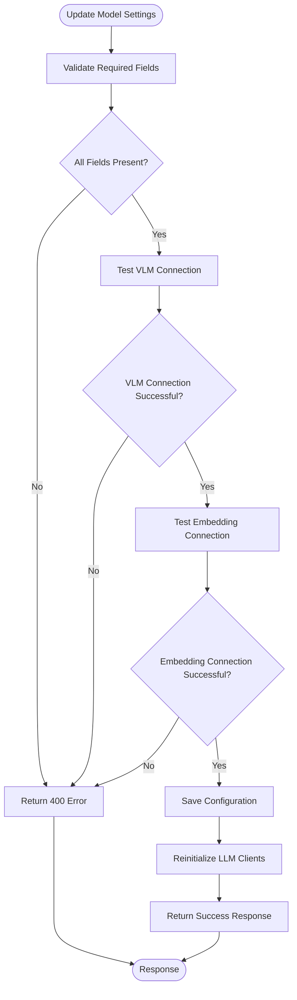
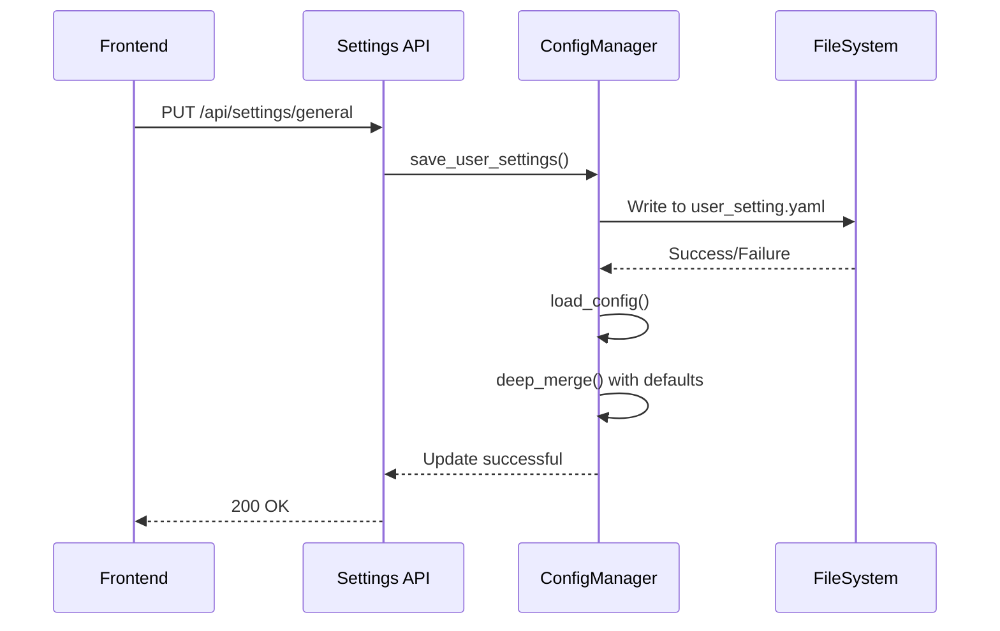
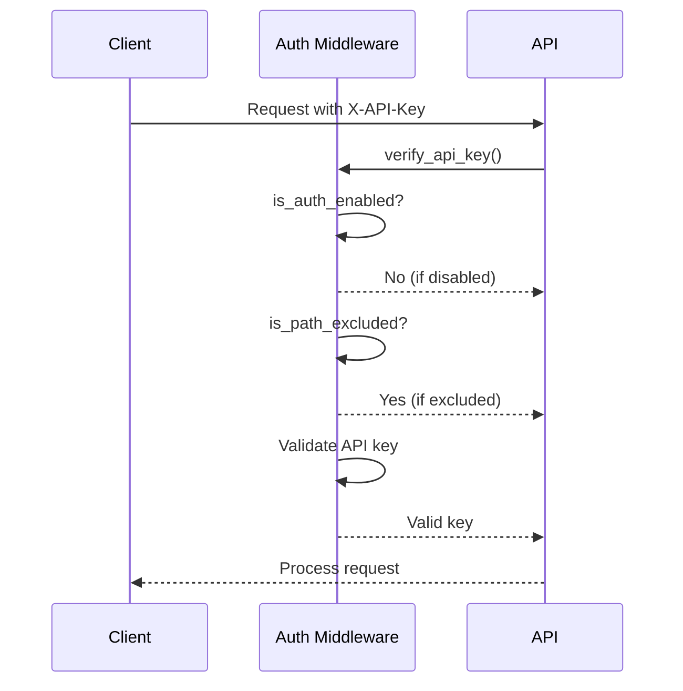

# Settings API

<cite>
**Referenced Files in This Document**   
- [settings.py](file://opencontext/server/routes/settings.py)
- [config_manager.py](file://opencontext/config/config_manager.py)
- [global_config.py](file://opencontext/config/global_config.py)
- [auth.py](file://opencontext/server/middleware/auth.py)
- [config.yaml](file://config/config.yaml)
- [settings.js](file://opencontext/web/static/js/settings.js)
- [settings.html](file://opencontext/web/templates/settings.html)
- [Settings.ts](file://frontend/src/renderer/src/services/Settings.ts)
</cite>

## Table of Contents
1. [Introduction](#introduction)
2. [API Endpoints](#api-endpoints)
3. [Settings Structure](#settings-structure)
4. [Configuration Schema Validation](#configuration-schema-validation)
5. [Settings Persistence](#settings-persistence)
6. [Frontend Integration](#frontend-integration)
7. [Security Considerations](#security-considerations)
8. [Common Configuration Updates](#common-configuration-updates)
9. [Real-time Configuration Updates](#real-time-configuration-updates)
10. [Troubleshooting](#troubleshooting)

## Introduction
The Settings API provides endpoints for managing user preferences and system configuration in the OpenContext application. This documentation covers the GET /settings and PUT /settings endpoints that handle configuration for capture, processing, and AI components. The API allows users to configure LLM models, adjust system behavior, manage prompts, and control content generation settings. All settings are validated against a configuration schema and persisted through the ConfigManager, ensuring data integrity and consistency across application restarts.

**Section sources**
- [settings.py](file://opencontext/server/routes/settings.py#L28-L791)
- [config_manager.py](file://opencontext/config/config_manager.py#L24-L253)

## API Endpoints

### GET /api/settings/general
Retrieves the current general system settings including capture, processing, logging, and content generation configurations.

**Request**
```
GET /api/settings/general
Headers: X-API-Key: {api_key}
```

**Response Schema**
```json
{
  "code": 0,
  "status": 200,
  "message": "Success",
  "data": {
    "capture": {
      "screenshot": {
        "enabled": boolean,
        "capture_interval": number,
        "storage_path": string
      },
      "vault_document_monitor": {
        "enabled": boolean,
        "monitor_interval": number,
        "initial_scan": boolean
      }
    },
    "processing": {
      "document_processor": {
        "enabled": boolean,
        "batch_size": number,
        "batch_timeout": number
      },
      "screenshot_processor": {
        "enabled": boolean,
        "batch_size": number,
        "max_image_size": number
      },
      "context_merger": {
        "enabled": boolean,
        "similarity_threshold": number
      }
    },
    "logging": {
      "level": string,
      "log_path": string
    },
    "content_generation": {
      "debug": {
        "enabled": boolean,
        "output_path": string,
        "output_path_resolved": string
      },
      "activity": {
        "enabled": boolean,
        "interval": number
      },
      "tips": {
        "enabled": boolean,
        "interval": number
      },
      "todos": {
        "enabled": boolean,
        "interval": number
      },
      "report": {
        "enabled": boolean,
        "time": string
      }
    }
  }
}
```

### PUT /api/settings/general
Updates the general system settings.

**Request**
```
POST /api/settings/general
Headers: Content-Type: application/json, X-API-Key: {api_key}
Body: {
  "capture": { ... },
  "processing": { ... },
  "logging": { ... },
  "content_generation": { ... }
}
```

**Response Schema**
```json
{
  "code": 0,
  "status": 200,
  "message": "Settings updated successfully"
}
```

### GET /api/model_settings/get
Retrieves the current LLM model configuration.

**Request**
```
GET /api/model_settings/get
Headers: X-API-Key: {api_key}
```

**Response Schema**
```json
{
  "code": 0,
  "status": 200,
  "message": "Success",
  "data": {
    "config": {
      "modelPlatform": string,
      "modelId": string,
      "baseUrl": string,
      "apiKey": string,
      "embeddingModelId": string,
      "embeddingBaseUrl": string,
      "embeddingApiKey": string,
      "embeddingModelPlatform": string
    }
  }
}
```

### PUT /api/model_settings/update
Updates the LLM model configuration and reinitializes LLM clients.

**Request**
```
POST /api/model_settings/update
Headers: Content-Type: application/json, X-API-Key: {api_key}
Body: {
  "config": {
    "modelPlatform": string,
    "modelId": string,
    "baseUrl": string,
    "apiKey": string,
    "embeddingModelId": string,
    "embeddingBaseUrl": string,
    "embeddingApiKey": string,
    "embeddingModelPlatform": string
  }
}
```

**Response Schema**
```json
{
  "code": 0,
  "status": 200,
  "message": "Model settings updated successfully"
}
```

**Section sources**
- [settings.py](file://opencontext/server/routes/settings.py#L291-L367)
- [settings.py](file://opencontext/server/routes/settings.py#L79-L195)

## Settings Structure

The settings object is structured into several sections that control different aspects of the application:

### Capture Configuration
Controls screenshot capture and document monitoring settings.

```json
{
  "capture": {
    "screenshot": {
      "enabled": true,
      "capture_interval": 5,
      "storage_path": "${CONTEXT_PATH:.}/screenshots"
    },
    "vault_document_monitor": {
      "enabled": false,
      "monitor_interval": 30,
      "initial_scan": true
    }
  }
}
```

### Processing Configuration
Manages document and screenshot processing parameters.

```json
{
  "processing": {
    "document_processor": {
      "enabled": true,
      "batch_size": 5,
      "batch_timeout": 30
    },
    "screenshot_processor": {
      "enabled": true,
      "dedup_cache_size": 30,
      "similarity_hash_threshold": 7,
      "batch_size": 20,
      "batch_timeout": 10,
      "max_image_size": 1920,
      "resize_quality": 85,
      "enabled_delete": true,
      "max_raw_properties": 5
    },
    "context_merger": {
      "enabled": false,
      "similarity_threshold": 0.90,
      "associative_similarity_threshold": 0.6,
      "use_intelligent_merging": true,
      "enable_memory_management": true,
      "cleanup_interval_hours": 24,
      "enable_cross_type_processing": true,
      "conversion_confidence_threshold": 0.8,
      "max_conversions_per_session": 10
    }
  }
}
```

### AI Configuration
Contains settings for LLM models and content generation.

```json
{
  "vlm_model": {
    "base_url": "${LLM_BASE_URL}",
    "api_key": "${LLM_API_KEY}",
    "model": "${LLM_MODEL}",
    "provider": ""
  },
  "embedding_model": {
    "base_url": "${EMBEDDING_BASE_URL}",
    "api_key": "${EMBEDDING_API_KEY}",
    "model": "${EMBEDDING_MODEL}",
    "provider": "",
    "output_dim": 2048
  },
  "content_generation": {
    "debug": {
      "enabled": false,
      "output_path": "${CONTEXT_PATH:.}/debug/generation"
    },
    "activity": {
      "enabled": true,
      "interval": 900
    },
    "tips": {
      "enabled": true,
      "interval": 3600
    },
    "todos": {
      "enabled": true,
      "interval": 1800
    },
    "report": {
      "enabled": true,
      "time": "08:00"
    }
  }
}
```

**Section sources**
- [config.yaml](file://config/config.yaml#L39-L253)
- [settings.py](file://opencontext/server/routes/settings.py#L282-L289)

## Configuration Schema Validation

The Settings API validates all configuration updates against a predefined schema to ensure data integrity and prevent invalid settings.

### Model Settings Validation
When updating model settings, the API performs comprehensive validation:

1. **Required Fields Check**: Ensures all required fields are present
2. **API Key Validation**: Tests connectivity with both VLM and embedding models
3. **Configuration Consistency**: Validates that platform, model ID, and base URL are compatible



**Diagram sources**
- [settings.py](file://opencontext/server/routes/settings.py#L110-L195)

### General Settings Validation
General settings are validated through schema-based checks:

1. **Type Validation**: Ensures values match expected types (boolean, number, string)
2. **Range Validation**: Checks numeric values are within acceptable ranges
3. **Path Validation**: Validates file paths are properly formatted

The validation process occurs automatically when settings are updated through the PUT /api/settings/general endpoint.

**Section sources**
- [settings.py](file://opencontext/server/routes/settings.py#L330-L367)

## Settings Persistence

Settings are persisted through the ConfigManager component, which handles configuration loading, saving, and merging.

### Configuration Flow


### Persistence Mechanism
The ConfigManager uses a two-file system:
1. **config.yaml**: Contains default configuration values
2. **user_setting.yaml**: Stores user-specific overrides

When settings are updated:
1. The ConfigManager saves the new settings to user_setting.yaml
2. The configuration is reloaded from disk
3. Default settings from config.yaml are merged with user settings
4. Environment variables are resolved in paths and values

This approach allows users to customize settings without modifying the base configuration, making upgrades easier and reducing the risk of configuration errors.

**Diagram sources**
- [config_manager.py](file://opencontext/config/config_manager.py#L168-L223)
- [settings.py](file://opencontext/server/routes/settings.py#L330-L358)

**Section sources**
- [config_manager.py](file://opencontext/config/config_manager.py#L24-L253)

## Frontend Integration

The Settings API is integrated with a comprehensive frontend UI that provides an intuitive interface for managing application settings.

### Settings UI Components
The frontend settings interface is organized into tabs:
- **Model Configuration**: LLM and embedding model settings
- **Screenshot Capture**: Capture interval and storage path
- **Processing Configuration**: Document and screenshot processing parameters
- **Content Generation**: Activity, tips, todos, and report generation settings
- **Prompts Management**: System prompts for AI generation

### Frontend-Backend Communication
The frontend communicates with the Settings API through JavaScript functions that handle form submissions and data loading:

```javascript
// Load current settings
async function loadGeneralSettings() {
    const response = await fetch('/api/settings/general');
    const data = await response.json();
    // Populate form fields
}

// Save updated settings
document.getElementById('settingsForm').addEventListener('submit', async (e) => {
    e.preventDefault();
    const settings = collectFormValues();
    const response = await fetch('/api/settings/general', {
        method: 'POST',
        headers: { 'Content-Type': 'application/json' },
        body: JSON.stringify(settings)
    });
    // Handle response
});
```

The UI provides real-time feedback through toast notifications and includes features like connection testing for model configurations.

**Section sources**
- [settings.js](file://opencontext/web/static/js/settings.js#L19-L800)
- [settings.html](file://opencontext/web/templates/settings.html#L1-L666)

## Security Considerations

The Settings API implements several security measures to protect sensitive configuration data.

### Authentication
All settings endpoints require API key authentication:



Authentication can be enabled/disabled in the config.yaml file:
```yaml
api_auth:
  enabled: false
  api_keys:
    - "${CONTEXT_API_KEY:test}"
  excluded_paths:
    - "/health"
    - "/api/health"
    - "/"
```

### Sensitive Data Protection
Sensitive settings like API keys are protected through:
1. **Input Masking**: API keys are displayed as password fields
2. **Environment Variables**: Keys can be stored in environment variables
3. **Access Control**: Only authenticated users can modify settings

The API never returns API keys in GET responses for security reasons.

**Diagram sources**
- [auth.py](file://opencontext/server/middleware/auth.py#L68-L109)

**Section sources**
- [auth.py](file://opencontext/server/middleware/auth.py#L1-L113)
- [settings.py](file://opencontext/server/routes/settings.py#L20-L21)

## Common Configuration Updates

### Changing LLM Provider
To switch from one LLM provider to another:

1. Update the modelPlatform field to the new provider
2. Update modelId to a compatible model
3. Update baseUrl to the provider's API endpoint
4. Provide the new API key

Example update for OpenAI:
```json
{
  "config": {
    "modelPlatform": "openai",
    "modelId": "gpt-4-turbo",
    "baseUrl": "https://api.openai.com/v1",
    "apiKey": "sk-...",
    "embeddingModelId": "text-embedding-ada-002"
  }
}
```

### Adjusting Content Generation Frequency
Modify the interval values for different content generation tasks:

```json
{
  "content_generation": {
    "activity": { "interval": 1800 },
    "tips": { "interval": 7200 },
    "todos": { "interval": 3600 }
  }
}
```

### Enabling Debug Mode
To enable debug mode for troubleshooting:

```json
{
  "content_generation": {
    "debug": {
      "enabled": true,
      "output_path": "${CONTEXT_PATH:.}/debug/generation"
    }
  }
}
```

This will save detailed generation messages and responses to the specified directory.

**Section sources**
- [settings.py](file://opencontext/server/routes/settings.py#L330-L367)
- [config.yaml](file://config/config.yaml#L217-L239)

## Real-time Configuration Updates

The Settings API supports real-time updates that take effect immediately without requiring application restarts.

### Dynamic Reinitialization
When model settings are updated, the API automatically reinitializes the affected components:

```python
# After saving new settings
if not GlobalVLMClient.get_instance().reinitialize():
    return convert_resp(
        code=500, 
        status=500, 
        message="Failed to reinitialize VLM client"
    )
if not GlobalEmbeddingClient.get_instance().reinitialize():
    return convert_resp(
        code=500, 
        status=500, 
        message="Failed to reinitialize embedding client"
    )
```

### Configuration Reload Process
1. Settings are saved to user_setting.yaml
2. ConfigManager.reload_config() is called
3. GlobalConfig instance updates its internal state
4. Dependent components reinitialize with new settings

This allows users to modify system behavior on-the-fly, such as switching between different LLM providers or adjusting processing parameters during operation.

**Section sources**
- [settings.py](file://opencontext/server/routes/settings.py#L176-L184)

## Troubleshooting

### Common Issues and Solutions

**Issue**: Model connection test fails
- **Cause**: Invalid API key or incorrect endpoint URL
- **Solution**: Verify API key and base URL, check provider status

**Issue**: Settings not persisting after restart
- **Cause**: Permission issues writing to user_setting.yaml
- **Solution**: Check file permissions, ensure directory exists

**Issue**: Environment variables not resolving
- **Cause**: Missing environment variables
- **Solution**: Set required environment variables (CONTEXT_PATH, LLM_API_KEY, etc.)

### Debugging Tools
The API provides several endpoints for troubleshooting:

- **GET /api/settings/system_info**: Returns data directory path
- **POST /api/model_settings/validate**: Tests model connectivity without saving
- **GET /api/settings/prompts/history**: Access debug logs for content generation

Enable debug mode in settings to capture detailed generation messages for analysis.

**Section sources**
- [settings.py](file://opencontext/server/routes/settings.py#L198-L250)
- [settings.py](file://opencontext/server/routes/settings.py#L536-L790)