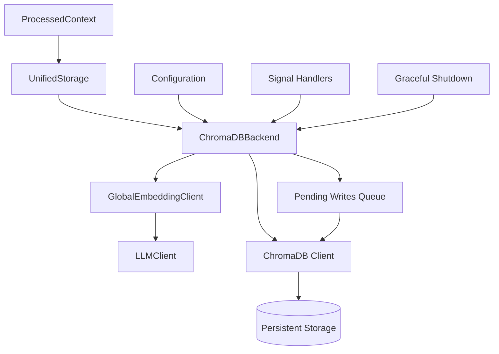
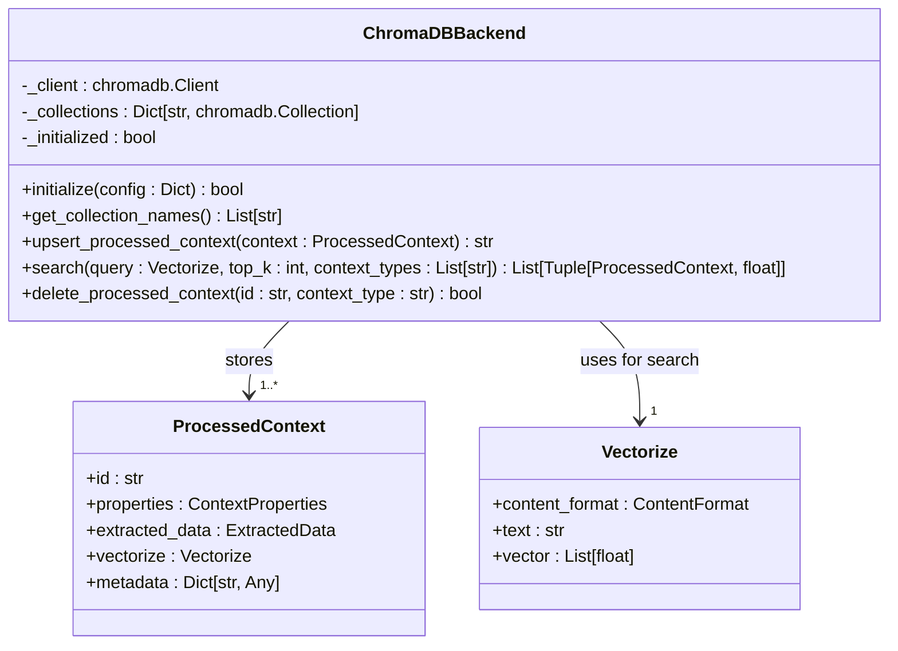
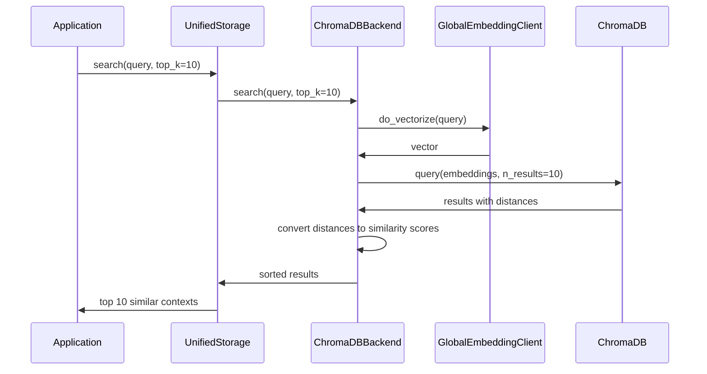
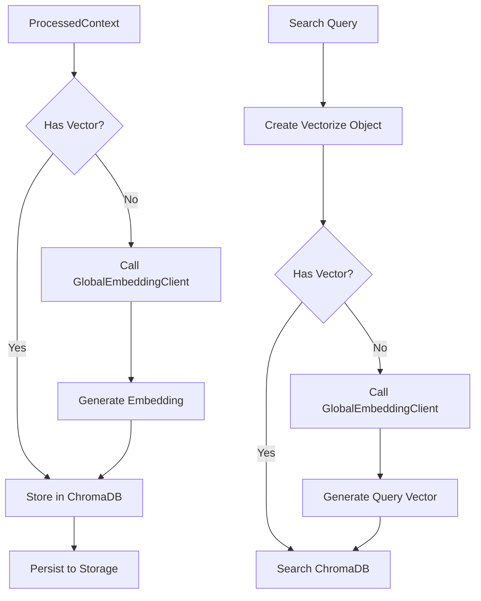
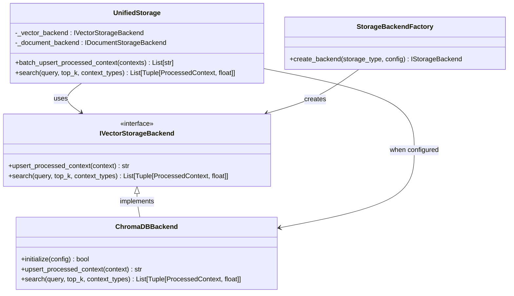
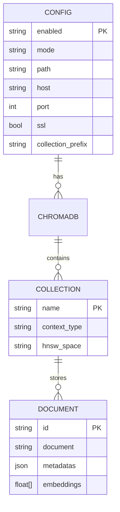

# ChromaDB Backend

<cite>
**Referenced Files in This Document**   
- [chromadb_backend.py](file://opencontext/storage/backends/chromadb_backend.py)
- [global_embedding_client.py](file://opencontext/llm/global_embedding_client.py)
- [unified_storage.py](file://opencontext/storage/unified_storage.py)
- [config.yaml](file://config/config.yaml)
- [context.py](file://opencontext/models/context.py)
- [base_storage.py](file://opencontext/storage/base_storage.py)
- [global_storage.py](file://opencontext/storage/global_storage.py)
</cite>

## Table of Contents
1. [Introduction](#introduction)
2. [Architecture Overview](#architecture-overview)
3. [Core Components](#core-components)
4. [Collection Management](#collection-management)
5. [Indexing and Similarity Search](#indexing-and-similarity-search)
6. [Integration with Global Embedding Client](#integration-with-global-embedding-client)
7. [Unified Storage Integration](#unified-storage-integration)
8. [Configuration Options](#configuration-options)
9. [Performance Considerations](#performance-considerations)
10. [Troubleshooting Guide](#troubleshooting-guide)

## Introduction
The ChromaDB backend provides vector storage capabilities for semantic search within the MineContext system. It implements a specialized storage solution for ProcessedContext objects, enabling efficient storage, retrieval, and similarity search of vectorized context data. The backend supports both local persistence and server modes, with automatic connection management and graceful shutdown handling. It integrates with the global embedding client for vectorization and uses the unified storage system for consistent access patterns across the application.

**Section sources**
- [chromadb_backend.py](file://opencontext/storage/backends/chromadb_backend.py#L1-L942)

## Architecture Overview
The ChromaDB backend architecture follows a layered design pattern with clear separation of concerns. At its core, the system implements a vector database interface that handles ProcessedContext objects, converting them to ChromaDB-compatible formats for storage and retrieval. The architecture includes connection management, collection organization, and integration with the embedding system.

**Diagram sources **
- [chromadb_backend.py](file://opencontext/storage/backends/chromadb_backend.py#L33-L942)
- [unified_storage.py](file://opencontext/storage/unified_storage.py#L90-L800)
- [global_embedding_client.py](file://opencontext/llm/global_embedding_client.py#L23-L139)

## Core Components
The ChromaDB backend consists of several key components that work together to provide vector storage functionality. The system creates independent collections for each context type, ensuring organized data storage and efficient querying. The backend handles vectorization through integration with the global embedding client and manages connections with automatic retry mechanisms.

The implementation includes a write lock to ensure thread safety during operations, and a pending writes queue to handle failed operations during network disruptions. The system also implements graceful shutdown procedures to ensure data persistence and proper cleanup of resources.

**Section sources**
- [chromadb_backend.py](file://opencontext/storage/backends/chromadb_backend.py#L33-L942)
- [base_storage.py](file://opencontext/storage/base_storage.py#L83-L187)

## Collection Management
The ChromaDB backend implements a sophisticated collection management system that creates separate collections for each context type. During initialization, the system creates collections for all available context types defined in the ContextType enum, plus a dedicated "todo" collection for deduplication purposes.

Each collection is configured with cosine similarity as the distance metric, which is optimal for semantic search applications. The collection names correspond directly to the context type values, providing a clear mapping between data types and storage locations. The system maintains a dictionary of collections for quick access during operations.

**Diagram sources **
- [chromadb_backend.py](file://opencontext/storage/backends/chromadb_backend.py#L33-L942)
- [context.py](file://opencontext/models/context.py#L131-L202)

## Indexing and Similarity Search
The ChromaDB backend implements HNSW (Hierarchical Navigable Small World) indexing with cosine similarity for efficient vector search operations. When performing similarity searches, the system converts distance metrics to similarity scores by applying the formula: score = 1 - distance. This provides intuitive similarity values between 0 and 1, where higher values indicate greater similarity.

Search operations support filtering by context types and additional metadata filters. The backend automatically vectorizes query content when necessary and handles empty collections gracefully. Results are sorted by similarity score in descending order and limited to the requested number of results (top_k).

**Diagram sources **
- [chromadb_backend.py](file://opencontext/storage/backends/chromadb_backend.py#L551-L649)
- [unified_storage.py](file://opencontext/storage/unified_storage.py#L283-L309)

## Integration with Global Embedding Client
The ChromaDB backend integrates tightly with the global embedding client to handle vectorization of context data. When storing a ProcessedContext, the system ensures the vector representation exists, calling the global embedding client to generate it if necessary. This integration uses the singleton pattern to provide consistent access to embedding services across the application.

The embedding client configuration is managed through the system's configuration file, allowing for easy switching between different embedding models and providers. The ChromaDB backend automatically handles cases where vectorization is required, making the process transparent to higher-level components.

**Diagram sources **
- [chromadb_backend.py](file://opencontext/storage/backends/chromadb_backend.py#L24-L25)
- [global_embedding_client.py](file://opencontext/llm/global_embedding_client.py#L23-L139)

## Unified Storage Integration
The ChromaDB backend integrates with the unified storage system through the storage backend factory pattern. The unified storage system provides a consistent interface for accessing different storage backends, routing vector database operations to the ChromaDB backend when configured as the default vector storage solution.

This integration allows higher-level components to interact with storage through a unified API without needing to know the specific backend implementation. The unified storage system handles initialization, configuration, and error handling, providing a clean abstraction layer over the underlying ChromaDB implementation.

**Diagram sources **
- [unified_storage.py](file://opencontext/storage/unified_storage.py#L90-L800)
- [chromadb_backend.py](file://opencontext/storage/backends/chromadb_backend.py#L33-L942)
- [base_storage.py](file://opencontext/storage/base_storage.py#L83-L187)

## Configuration Options
The ChromaDB backend supports flexible configuration through the system's config.yaml file. Configuration options include the operation mode (local or server), storage path for local persistence, and connection parameters for server mode. The system also supports collection naming conventions and connection retry settings.

In local mode, data is persisted to the filesystem at the specified path, while server mode connects to a remote ChromaDB instance. The configuration also includes retry parameters for handling connection failures, with exponential backoff implemented for robust network resilience.

**Section sources**
- [config.yaml](file://config/config.yaml#L146-L158)
- [chromadb_backend.py](file://opencontext/storage/backends/chromadb_backend.py#L122-L187)

## Performance Considerations
The ChromaDB backend implements several performance optimizations to ensure efficient operation. These include batch processing of write operations, connection pooling, and automatic persistence after writes to prevent data loss. The system uses a write lock to ensure thread safety during concurrent operations.

Memory usage is managed through the pending writes queue, which buffers operations during network disruptions and retries them when connectivity is restored. Query latency is minimized through the use of HNSW indexing, which provides fast approximate nearest neighbor search capabilities. The system also implements connection health checks and automatic reconnection to maintain availability.

For scaling, the backend supports both embedded (local) and client-server architectures, allowing deployment to scale from single-user applications to distributed systems. The collection-per-context-type design enables horizontal partitioning of data, which can improve query performance for large datasets.

**Section sources**
- [chromadb_backend.py](file://opencontext/storage/backends/chromadb_backend.py#L49-L51)
- [chromadb_backend.py](file://opencontext/storage/backends/chromadb_backend.py#L427-L429)

## Troubleshooting Guide
Common issues with the ChromaDB backend typically fall into three categories: connection problems, data consistency issues, and configuration errors. For connection problems, verify the mode setting in config.yaml and ensure the ChromaDB server is running when in server mode. Check network connectivity and firewall settings if connection timeouts occur.

For embedding dimension mismatches, ensure the embedding model configuration matches the expected vector size. Collection corruption can often be resolved by clearing the persistence directory and allowing the system to recreate collections on startup. Monitor log files for error messages related to HNSW index initialization, which may indicate corrupted index files.

When experiencing performance issues, check system resources (CPU, memory, disk I/O) and consider adjusting the batch size for write operations. For search accuracy problems, verify that the embedding model is functioning correctly and that similarity thresholds are appropriately configured for the use case.

**Section sources**
- [chromadb_backend.py](file://opencontext/storage/backends/chromadb_backend.py#L193-L229)
- [chromadb_backend.py](file://opencontext/storage/backends/chromadb_backend.py#L634-L641)
- [chromadb_backend.py](file://opencontext/storage/backends/chromadb_backend.py#L95-L97)