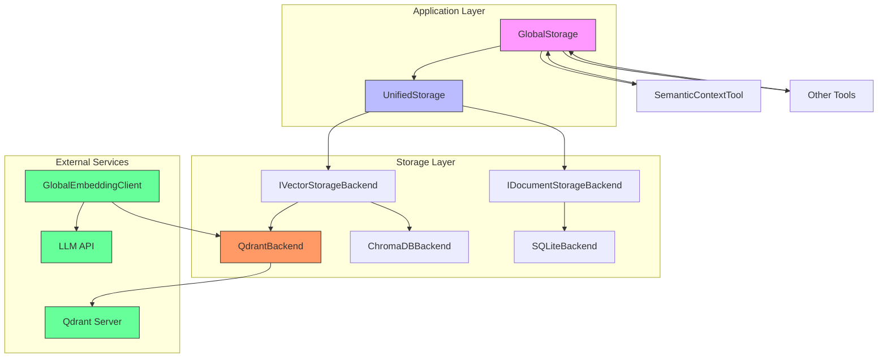
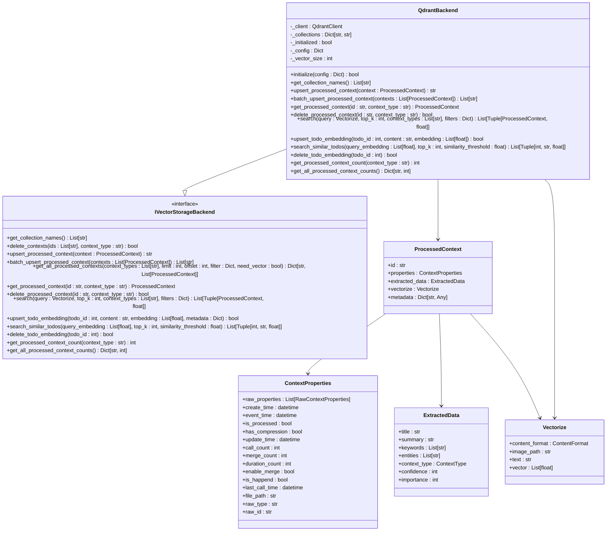
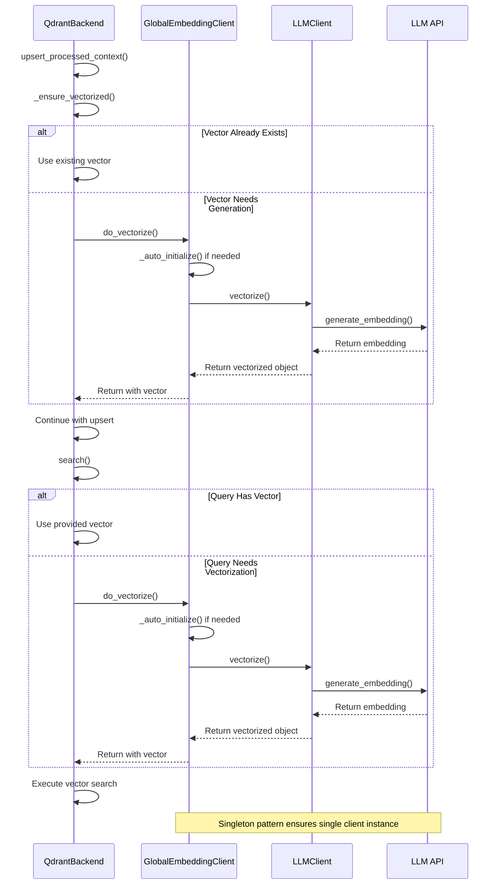

# Qdrant Backend

<cite>
**Referenced Files in This Document**   
- [qdrant_backend.py](file://opencontext/storage/backends/qdrant_backend.py)
- [global_embedding_client.py](file://opencontext/llm/global_embedding_client.py)
- [unified_storage.py](file://opencontext/storage/unified_storage.py)
- [base_storage.py](file://opencontext/storage/base_storage.py)
- [semantic_context_tool.py](file://opencontext/tools/retrieval_tools/semantic_context_tool.py)
- [llm_client.py](file://opencontext/llm/llm_client.py)
- [global_storage.py](file://opencontext/storage/global_storage.py)
- [context.py](file://opencontext/models/context.py)
</cite>

## Table of Contents
1. [Introduction](#introduction)
2. [Architecture Overview](#architecture-overview)
3. [Core Components](#core-components)
4. [Point and Collection Management](#point-and-collection-management)
5. [Payload Filtering and Advanced Search](#payload-filtering-and-advanced-search)
6. [Integration with Global Embedding Client](#integration-with-global-embedding-client)
7. [Integration with Unified Storage](#integration-with-unified-storage)
8. [Configuration Options](#configuration-options)
9. [Usage Examples from Semantic Context Tool](#usage-examples-from-semantic-context-tool)
10. [Performance Optimization](#performance-optimization)
11. [Fault Tolerance and Data Persistence](#fault-tolerance-and-data-persistence)
12. [Troubleshooting Guide](#troubleshooting-guide)

## Introduction
The Qdrant vector database backend provides high-performance vector storage and similarity search capabilities for the OpenContext system. This document details the implementation in qdrant_backend.py, focusing on its integration with the global_embedding_client.py for embedding generation and unified_storage.py for API consistency. The backend supports advanced features like HNSW indexing, quantization, payload filtering, and efficient point management. It is designed to handle various context types including semantic, procedural, and entity contexts, with specialized handling for todo items and their deduplication. The system is built with fault tolerance, connection pooling, and performance optimization in mind, making it suitable for production-scale applications requiring fast and reliable vector search capabilities.

## Architecture Overview
The Qdrant backend is implemented as a vector storage system that integrates with the broader OpenContext architecture through a unified storage layer. It follows a client-server model where the QdrantClient connects to a Qdrant server instance, either local or remote. The architecture is designed around several key components: the QdrantBackend class that implements the IVectorStorageBackend interface, the UnifiedStorage system that provides a consistent API across different storage types, and the GlobalStorage singleton that provides global access to storage functionality. The system uses a collection-per-context-type approach, creating separate Qdrant collections for each ContextType enum value, plus a dedicated todo collection. This design enables efficient querying and filtering while maintaining data organization. The backend handles vectorization through integration with the global embedding client and supports advanced search parameters like payload filtering and similarity thresholds.



**Diagram sources**
- [qdrant_backend.py](file://opencontext/storage/backends/qdrant_backend.py#L37-L689)
- [unified_storage.py](file://opencontext/storage/unified_storage.py#L90-L900)
- [global_storage.py](file://opencontext/storage/global_storage.py#L23-L196)

**Section sources**
- [qdrant_backend.py](file://opencontext/storage/backends/qdrant_backend.py#L1-L689)
- [unified_storage.py](file://opencontext/storage/unified_storage.py#L1-L925)
- [global_storage.py](file://opencontext/storage/global_storage.py#L1-L196)

## Core Components
The core of the Qdrant backend implementation revolves around the QdrantBackend class, which implements the IVectorStorageBackend interface. This class manages connections to the Qdrant server, handles collection creation and management, and provides methods for upserting, retrieving, and searching vector data. The backend automatically creates collections for each ContextType during initialization, ensuring that data is organized by context type for efficient querying. Each collection is configured with cosine distance similarity and a vector size that can be specified in the configuration or defaults to 1536. The backend uses UUID5 hashing to convert string IDs to UUID format required by Qdrant, ensuring consistent ID handling across the system. The implementation includes comprehensive error handling and logging, with health checks to verify connection status before operations. The system also includes specialized methods for todo item management, allowing for embedding storage and similarity-based deduplication.

**Section sources**
- [qdrant_backend.py](file://opencontext/storage/backends/qdrant_backend.py#L37-L689)
- [base_storage.py](file://opencontext/storage/base_storage.py#L83-L187)

## Point and Collection Management
The Qdrant backend provides comprehensive point and collection management capabilities. During initialization, the backend creates collections for each ContextType defined in the system, using the context type value as the collection name. The TODO_COLLECTION is created separately for todo item embeddings. Collection creation is idempotent, with the system checking for existing collections before attempting creation. Points are upserted using the batch_upsert_processed_context method, which groups contexts by type and processes them in batches for efficiency. Each point is assigned a UUID5-based ID derived from the original string ID, ensuring compatibility with Qdrant's requirements. The payload includes all relevant context data, with special handling for datetime fields (converted to ISO format with timestamp suffixes) and nested objects (serialized to JSON strings). The system supports point retrieval by ID, deletion of individual points or batches, and counting of points within collections. The todo-specific methods (upsert_todo_embedding, search_similar_todos, delete_todo_embedding) provide specialized functionality for todo item management and deduplication.



**Diagram sources**
- [qdrant_backend.py](file://opencontext/storage/backends/qdrant_backend.py#L37-L689)
- [context.py](file://opencontext/models/context.py#L131-L200)

**Section sources**
- [qdrant_backend.py](file://opencontext/storage/backends/qdrant_backend.py#L37-L689)
- [context.py](file://opencontext/models/context.py#L131-L200)

## Payload Filtering and Advanced Search
The Qdrant backend implements sophisticated payload filtering and advanced search capabilities to enable precise data retrieval. The _build_filter_condition method converts dictionary-based filters into Qdrant Filter objects, supporting various filter types including exact matches, list membership, and timestamp ranges. For timestamp fields (ending with "_ts"), the system supports $gte and $lte operators to specify range queries. String and numeric fields can be filtered for exact matches, while list fields can be filtered using the MatchAny condition to find documents containing any of the specified values. The search method leverages these filters to constrain vector similarity searches, allowing for combined semantic and metadata-based querying. The system supports searching across multiple context types or limiting searches to specific types. Search results are sorted by similarity score in descending order and limited to the requested top_k results. The backend also provides the get_all_processed_contexts method for scrolling through large result sets with pagination support via limit and offset parameters. For todo items, the search_similar_todos method includes a similarity_threshold parameter to filter out results below a minimum similarity score, enabling effective deduplication.

```mermaid
flowchart TD
A[Search Query] --> B{Has Vector?}
B --> |Yes| C[Use Provided Vector]
B --> |No| D[Generate Vector via do_vectorize]
D --> E[Get Query Vector]
C --> F
E --> F[Execute Search]
F --> G{Context Types Specified?}
G --> |Yes| H[Filter Target Collections]
G --> |No| I[Use All Collections Except Todo]
H --> J
I --> J[Iterate Collections]
J --> K{Collection Has Points?}
K --> |No| L[Skip Collection]
K --> |Yes| M[Apply Filter Condition]
M --> N[Query Points with Vector]
N --> O[Convert Results to ProcessedContext]
O --> P[Store (Context, Score) Pair]
P --> Q{More Collections?}
Q --> |Yes| J
Q --> |No| R[Sort by Score Descending]
R --> S[Return Top K Results]
style A fill:#f9f,stroke:#333
style F fill:#f96,stroke:#333
style N fill:#6f9,stroke:#333
style S fill:#6f9,stroke:#333
```

**Diagram sources**
- [qdrant_backend.py](file://opencontext/storage/backends/qdrant_backend.py#L337-L403)
- [qdrant_backend.py](file://opencontext/storage/backends/qdrant_backend.py#L487-L538)

**Section sources**
- [qdrant_backend.py](file://opencontext/storage/backends/qdrant_backend.py#L337-L403)
- [qdrant_backend.py](file://opencontext/storage/backends/qdrant_backend.py#L487-L538)

## Integration with Global Embedding Client
The Qdrant backend integrates tightly with the global_embedding_client.py module for embedding generation and vectorization. When a ProcessedContext is upserted without a pre-computed vector, the _ensure_vectorized method calls do_vectorize from the global embedding client to generate the embedding. Similarly, during search operations, if the query Vectorize object lacks a vector, the search method calls do_vectorize to create the query embedding. The global embedding client is implemented as a singleton (GlobalEmbeddingClient) with lazy initialization, ensuring that only one embedding client instance exists throughout the application. This client uses the LLMClient to communicate with external LLM APIs (like OpenAI or Doubao) to generate embeddings. The integration is seamless, with the Qdrant backend automatically handling the vectorization process without requiring explicit calls from higher-level components. This design allows for consistent embedding generation across the system, ensuring that both stored vectors and query vectors are created using the same model and configuration, which is critical for accurate similarity search results.



**Diagram sources**
- [qdrant_backend.py](file://opencontext/storage/backends/qdrant_backend.py#L118-L129)
- [qdrant_backend.py](file://opencontext/storage/backends/qdrant_backend.py#L364-L365)
- [global_embedding_client.py](file://opencontext/llm/global_embedding_client.py#L23-L139)
- [llm_client.py](file://opencontext/llm/llm_client.py#L32-L200)

**Section sources**
- [qdrant_backend.py](file://opencontext/storage/backends/qdrant_backend.py#L118-L129)
- [qdrant_backend.py](file://opencontext/storage/backends/qdrant_backend.py#L364-L365)
- [global_embedding_client.py](file://opencontext/llm/global_embedding_client.py#L1-L139)

## Integration with Unified Storage
The Qdrant backend integrates with the unified_storage.py module through the StorageBackendFactory and UnifiedStorage classes, providing a consistent API across different storage types. The UnifiedStorage system acts as a facade, routing vector database operations to the Qdrant backend while delegating document storage operations to a separate document backend (typically SQLite). This separation allows for optimized storage of different data types: vector embeddings and their associated metadata in Qdrant for fast similarity search, and structured document data in SQLite for efficient querying and transactional operations. The StorageBackendFactory creates the QdrantBackend instance based on configuration, and the UnifiedStorage system initializes it during startup. Higher-level components interact with the UnifiedStorage interface, which delegates vector operations like upsert_processed_context, search, and get_processed_context to the Qdrant backend. The GlobalStorage singleton provides global access to this unified storage system, allowing any component to perform storage operations without direct dependencies on the underlying implementations. This architecture enables flexible configuration, where different vector and document backends can be swapped without changing application code.

```mermaid
classDiagram
class UnifiedStorage {
-_factory : StorageBackendFactory
-_vector_backend : IVectorStorageBackend
-_document_backend : IDocumentStorageBackend
+initialize() bool
+get_vector_collection_names() List[str]
+batch_upsert_processed_context(contexts : List[ProcessedContext]) List[str]
+upsert_processed_context(context : ProcessedContext) str
+get_processed_context(id : str, context_type : str) ProcessedContext
+delete_processed_context(id : str, context_type : str) bool
+get_all_processed_contexts(context_types : List[str], limit : int, offset : int, filter : Dict, need_vector : bool) Dict[str, List[ProcessedContext]]
+search(query : Vectorize, top_k : int, context_types : List[str], filters : Dict) List[Tuple[ProcessedContext, float]]
+upsert_todo_embedding(todo_id : int, content : str, embedding : List[float], metadata : Dict) bool
+search_similar_todos(query_embedding : List[float], top_k : int, similarity_threshold : float) List[Tuple[int, str, float]]
+delete_todo_embedding(todo_id : int) bool
+get_processed_context_count(context_type : str) int
+get_all_processed_context_counts() Dict[str, int]
}
class StorageBackendFactory {
-_backends : Dict[StorageType, Dict[str, Callable]]
+create_backend(storage_type : StorageType, config : Dict) IStorageBackend
+_create_qdrant_backend(config : Dict) QdrantBackend
+_create_chromadb_backend(config : Dict) ChromaDBBackend
+_create_sqlite_backend(config : Dict) SQLiteBackend
}
class GlobalStorage {
-_storage : UnifiedStorage
+get_instance() GlobalStorage
+get_storage() UnifiedStorage
+upsert_processed_context(context : ProcessedContext) bool
+batch_upsert_processed_context(contexts : List[ProcessedContext]) bool
+get_processed_context(doc_id : str, context_type : ContextType) ProcessedContext
+delete_processed_context(doc_id : str, context_type : ContextType) bool
+list_processed_contexts(context_types : List[ContextType], limit : int, offset : int, filters : Dict) List[ProcessedContext]
+search_contexts(query : str, context_types : List[ContextType], top_k : int, filters : Dict) List[Dict]
+get_context_types() List[str]
+vectorize(vectorize : Vectorize, **kwargs)
}
UnifiedStorage --> IVectorStorageBackend
UnifiedStorage --> IDocumentStorageBackend
StorageBackendFactory --> QdrantBackend
StorageBackendFactory --> ChromaDBBackend
StorageBackendFactory --> SQLiteBackend
GlobalStorage --> UnifiedStorage
class IVectorStorageBackend {
<<interface>>
}
class IDocumentStorageBackend {
<<interface>>
}
class QdrantBackend {
}
class ChromaDBBackend {
}
class SQLiteBackend {
}
UnifiedStorage -.-> QdrantBackend : delegates vector operations
UnifiedStorage -.-> SQLiteBackend : delegates document operations
GlobalStorage -.-> UnifiedStorage : provides global access
```

**Diagram sources**
- [unified_storage.py](file://opencontext/storage/unified_storage.py#L90-L900)
- [global_storage.py](file://opencontext/storage/global_storage.py#L23-L196)
- [qdrant_backend.py](file://opencontext/storage/backends/qdrant_backend.py#L37-L689)

**Section sources**
- [unified_storage.py](file://opencontext/storage/unified_storage.py#L90-L900)
- [global_storage.py](file://opencontext/storage/global_storage.py#L23-L196)

## Configuration Options
The Qdrant backend supports flexible configuration for both local and remote instances, with options for authentication and connection pooling. Configuration is passed to the initialize method as a dictionary, with the qdrant_config section containing Qdrant-specific settings. The host, port, api_key, and https settings can be specified to connect to remote Qdrant instances, while local instances can be configured with appropriate paths. The vector_size parameter allows specifying the embedding dimension, defaulting to 1536 if not provided. Connection parameters are passed directly to the QdrantClient constructor, supporting all options available in the Qdrant Python client. The backend is configured through the storage.backends section in the global configuration, where multiple storage backends can be defined with their respective configurations. The system supports connection pooling through the underlying QdrantClient implementation, which manages HTTP connections efficiently. Health checks are performed automatically before operations to ensure connection availability, and the system includes retry logic for transient failures. Configuration can be updated at runtime through the reinitialize method, allowing for dynamic changes to connection parameters without restarting the application.

**Section sources**
- [qdrant_backend.py](file://opencontext/storage/backends/qdrant_backend.py#L49-L78)
- [qdrant_backend.py](file://opencontext/storage/backends/qdrant_backend.py#L54-L57)

## Usage Examples from Semantic Context Tool
The SemanticContextTool demonstrates real-world query patterns for the Qdrant backend, showcasing both semantic search and filter-based retrieval. When a query is provided, the tool performs a vector similarity search to find semantically related knowledge concepts and technical principles. The search uses the global embedding client to vectorize the natural language query, then executes a search across relevant context types (primarily SEMANTIC_CONTEXT). Filters can be applied to constrain results by time range (using event_time, create_time, or update_time) or by entities mentioned in the content. The tool supports two modes of operation: semantic search with a query for finding relevant knowledge, and filter-only retrieval for getting all concepts matching certain criteria. Results are returned with similarity scores, allowing clients to assess relevance. The tool's parameters are designed to guide users in formulating effective queries, with examples provided for common use cases like understanding technical concepts, system architectures, and design patterns. This implementation showcases the backend's ability to handle complex, real-world search scenarios that combine semantic understanding with structured filtering.

**Section sources**
- [semantic_context_tool.py](file://opencontext/tools/retrieval_tools/semantic_context_tool.py#L1-L85)
- [qdrant_backend.py](file://opencontext/storage/backends/qdrant_backend.py#L337-L403)

## Performance Optimization
The Qdrant backend implements several performance optimization strategies to ensure high-speed vector storage and retrieval. The batch_upsert_processed_context method groups contexts by type before upserting, reducing the number of API calls to Qdrant and improving throughput. The system uses connection health checks to avoid unnecessary operations on disconnected clients, and includes comprehensive error handling to maintain stability during transient failures. Payload data is optimized for storage by removing null values and converting complex objects to JSON strings, reducing storage overhead. The use of UUID5 hashing for ID conversion ensures consistent ID generation without the need for additional lookups. The backend leverages Qdrant's native support for cosine similarity search with HNSW indexing, enabling fast approximate nearest neighbor search even with large datasets. For todo item deduplication, the search_similar_todos method includes a similarity_threshold parameter to filter out irrelevant results early, reducing processing overhead. The integration with the unified storage layer allows for efficient routing of operations to the appropriate backend, minimizing unnecessary processing. The system also benefits from the underlying Qdrant server's optimizations, including efficient memory management and disk storage.

**Section sources**
- [qdrant_backend.py](file://opencontext/storage/backends/qdrant_backend.py#L181-L245)
- [qdrant_backend.py](file://opencontext/storage/backends/qdrant_backend.py#L622-L666)

## Fault Tolerance and Data Persistence
The Qdrant backend is designed with fault tolerance and data persistence as key priorities. The system performs health checks before operations using the _check_connection method, which verifies connectivity by calling get_collections on the Qdrant client. If a connection failure is detected, operations are aborted with appropriate error handling rather than proceeding with a potentially stale or invalid connection. The backend includes comprehensive exception handling around all Qdrant API calls, logging errors and continuing with other operations when possible. During initialization, the system attempts to create collections only if they don't already exist, preventing errors from duplicate creation attempts. The use of upsert operations (rather than separate insert/update) ensures that data is consistently stored regardless of whether a point already exists. For todo items, the upsert_todo_embedding method includes error handling to prevent failures from affecting the overall system stability. The backend relies on Qdrant's built-in data persistence mechanisms, with configurable storage options on the server side. The system also supports connection retry logic through the underlying Qdrant client, automatically attempting to reconnect after transient network failures. These features combine to create a robust storage system that maintains data integrity and availability even in the face of network issues or server restarts.

**Section sources**
- [qdrant_backend.py](file://opencontext/storage/backends/qdrant_backend.py#L95-L104)
- [qdrant_backend.py](file://opencontext/storage/backends/qdrant_backend.py#L76-L78)
- [qdrant_backend.py](file://opencontext/storage/backends/qdrant_backend.py#L239-L243)

## Troubleshooting Guide
When encountering issues with the Qdrant backend, several common problems and their solutions should be considered. For connection issues, verify that the Qdrant server is running and accessible at the configured host and port. Check that authentication credentials (api_key) are correct if required, and ensure that the https setting matches the server configuration. If using a remote instance, confirm that network connectivity and firewall rules allow the connection. For index corruption issues, restart the Qdrant server to allow it to rebuild indexes from persistent storage, or recreate the affected collections if necessary. Version compatibility problems between client and server can cause unexpected behavior; ensure that the qdrant-client library version is compatible with the Qdrant server version, consulting the Qdrant documentation for version compatibility matrices. If search results are unexpected, verify that the same embedding model is used for both indexing and querying, as different models produce incompatible vectors. For performance issues, check that HNSW indexing is properly configured and consider adjusting the ef_construct and M parameters for the collection. Monitor system resources (memory, CPU) on both client and server, as vector operations can be resource-intensive. Enable detailed logging to diagnose specific errors, and check the Qdrant server logs for additional information. When troubleshooting, start with the health check (_check_connection) to verify basic connectivity before investigating more complex issues.

**Section sources**
- [qdrant_backend.py](file://opencontext/storage/backends/qdrant_backend.py#L95-L104)
- [qdrant_backend.py](file://opencontext/storage/backends/qdrant_backend.py#L54-L57)
- [qdrant_backend.py](file://opencontext/storage/backends/qdrant_backend.py#L76-L78)