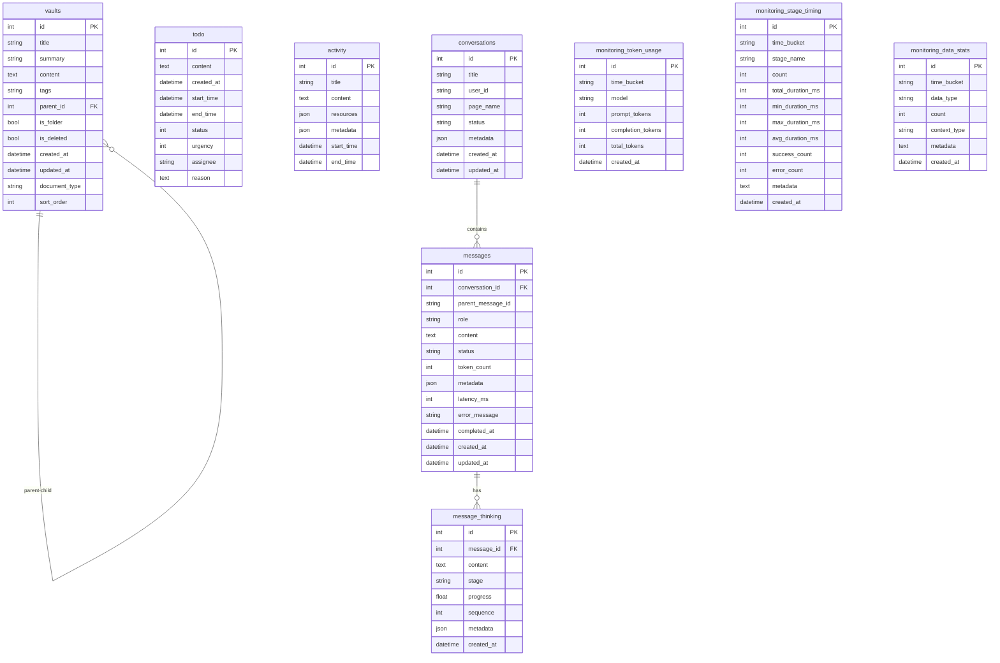
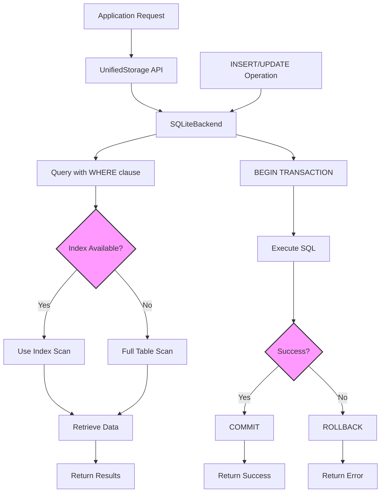
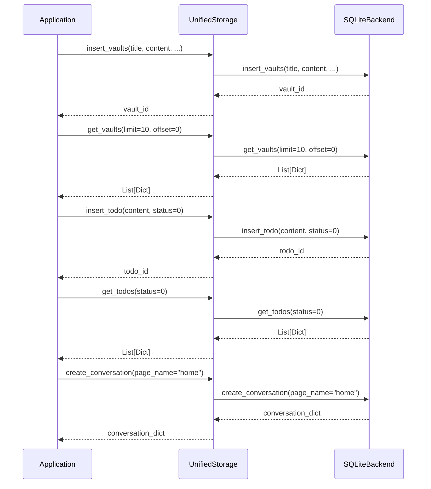
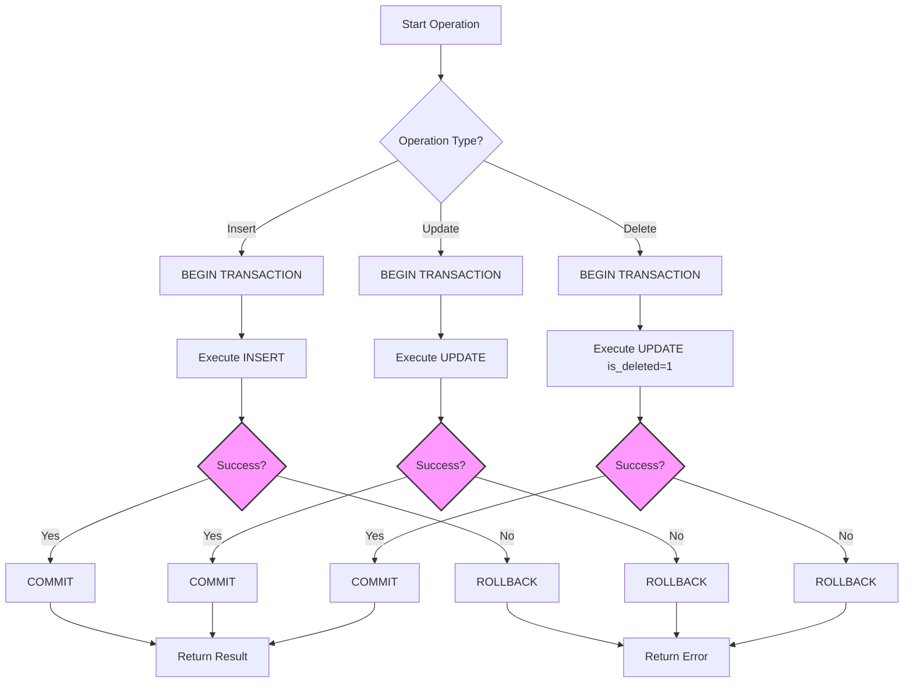
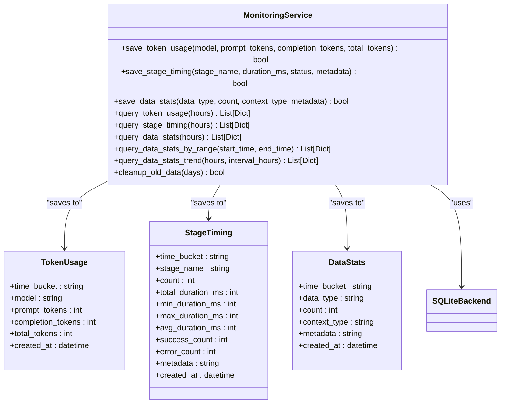
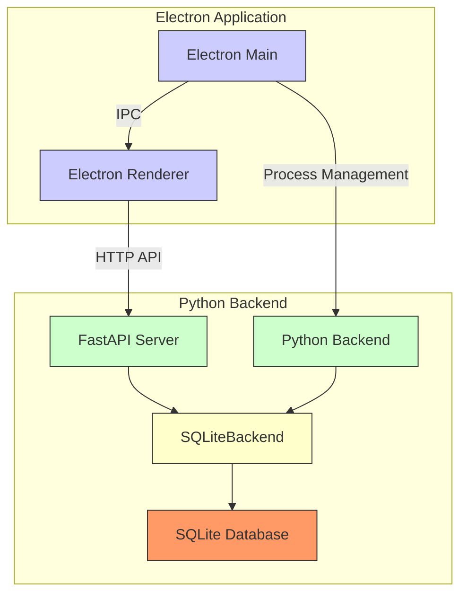
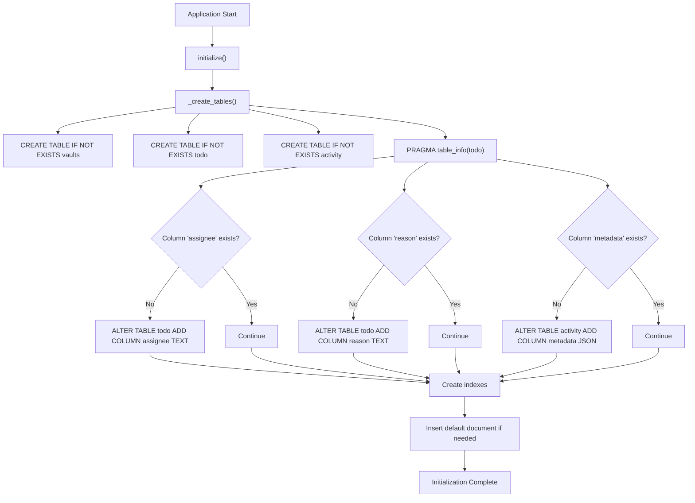

# SQLite Backend

<cite>
**Referenced Files in This Document**   
- [sqlite_backend.py](file://opencontext/storage/backends/sqlite_backend.py)
- [unified_storage.py](file://opencontext/storage/unified_storage.py)
- [base_storage.py](file://opencontext/storage/base_storage.py)
- [schema.sql](file://frontend/src/main/db/schema.sql)
- [backend.ts](file://frontend/src/main/backend.ts)
- [ipc.ts](file://frontend/src/main/ipc.ts)
- [api.py](file://opencontext/server/api.py)
- [conversation.py](file://opencontext/server/routes/conversation.py)
- [messages.py](file://opencontext/server/routes/messages.py)
</cite>

## Table of Contents
1. [Introduction](#introduction)
2. [Database Schema and Table Design](#database-schema-and-table-design)
3. [Core Data Models](#core-data-models)
4. [Indexing and Performance Optimization](#indexing-and-performance-optimization)
5. [Unified Storage and Backend Integration](#unified-storage-and-backend-integration)
6. [Transaction Handling and Data Integrity](#transaction-handling-and-data-integrity)
7. [Monitoring and Analytics Data](#monitoring-and-analytics-data)
8. [Electron and HTTP API Integration](#electron-and-http-api-integration)
9. [Schema Evolution and Versioning](#schema-evolution-and-versioning)
10. [Conclusion](#conclusion)

## Introduction
The SQLite backend implementation in the MineContext application provides a robust, file-based relational database system for persistent storage of user activities, to-do items, vault entries, and system monitoring data. This documentation details the comprehensive data model design, focusing on the `sqlite_backend.py` implementation and its integration with the `unified_storage.py` interface. The backend serves as the primary document storage solution, handling relational data persistence for captured activities, user-generated content, and application settings. It is designed to work seamlessly with the Electron main process through inter-process communication (IPC) and HTTP APIs, providing a consistent interface for data access across the application. The schema is optimized for performance with strategic indexing, connection management, and transaction handling to ensure data integrity and efficient query patterns.

**Section sources**
- [sqlite_backend.py](file://opencontext/storage/backends/sqlite_backend.py#L1-L2136)
- [unified_storage.py](file://opencontext/storage/unified_storage.py#L1-L925)
- [base_storage.py](file://opencontext/storage/base_storage.py#L1-L304)

## Database Schema and Table Design
The SQLite backend implements a comprehensive schema designed to store various types of contextual data generated by the application. The primary tables include `vaults`, `todo`, `activity`, `conversations`, and `messages`, each serving a specific purpose in the application's data model.

The `vaults` table is designed to store user-generated documents and reports, with fields for hierarchical organization through parent-child relationships. It supports rich metadata including document type, tags, creation and update timestamps, and soft deletion capabilities. The table structure allows for organizing content in a folder-like structure while maintaining a flat database schema.

The `todo` table manages task items with fields for content, status, urgency, assignee, and temporal information. This table supports task management workflows with start and end times, enabling the application to track task progress and completion.

The `activity` table captures contextual information about user activities, including title, content, resources (stored as JSON), and metadata. This table is central to the application's context-aware functionality, storing information about user interactions and system events.

Additional tables support specialized functionality:
- `tips`: Stores AI-generated tips and suggestions
- `conversations`: Manages chat conversation metadata
- `messages`: Stores individual messages within conversations
- `message_thinking`: Captures the AI's reasoning process for messages
- Monitoring tables (`monitoring_token_usage`, `monitoring_stage_timing`, `monitoring_data_stats`) track system performance and usage metrics

**Diagram sources**
- [sqlite_backend.py](file://opencontext/storage/backends/sqlite_backend.py#L67-L340)
- [schema.sql](file://frontend/src/main/db/schema.sql#L1-L61)

**Section sources**
- [sqlite_backend.py](file://opencontext/storage/backends/sqlite_backend.py#L67-L340)
- [schema.sql](file://frontend/src/main/db/schema.sql#L1-L61)

## Core Data Models
The core data models in the SQLite backend are implemented through a series of Python classes that define the structure and behavior of the stored data. The `SQLiteBackend` class implements the `IDocumentStorageBackend` interface, providing a consistent API for data operations.

The `vaults` model represents user documents and reports, supporting hierarchical organization through the `parent_id` field that references other vault entries. This enables the creation of folder structures and nested content organization. The model includes soft deletion functionality through the `is_deleted` flag, allowing for content recovery and version history.

The `todo` model implements a task management system with fields for tracking task status (0 for pending, 1 for completed), urgency levels, and assignment information. The model supports temporal tracking with `start_time` and `end_time` fields, enabling the application to analyze task duration and completion patterns.

The `activity` model captures contextual information about user activities, with JSON fields for `resources` and `metadata` that provide extensibility for storing structured data without requiring schema changes. This design allows for flexible storage of various activity types and associated metadata.

The conversation and messaging models implement a hierarchical structure for chat interactions:
- `conversations` represent top-level chat sessions with metadata about the conversation context
- `messages` store individual messages within a conversation, with references to parent messages for threading
- `message_thinking` captures the AI's reasoning process, storing intermediate steps and analysis

These models support the application's AI assistant functionality by preserving the context and thought process behind responses.

```mermaid
classDiagram
class SQLiteBackend {
+db_path : str
+connection : sqlite3.Connection
-_initialized : bool
+initialize(config : Dict) bool
+_create_tables() void
+insert_vaults(title, summary, content, document_type, tags, parent_id, is_folder) int
+get_vaults(limit, offset, is_deleted, document_type, created_after, created_before, updated_after, updated_before) List[Dict]
+get_vault(vault_id) Optional[Dict]
+update_vault(vault_id, **kwargs) bool
+insert_todo(content, start_time, end_time, status, urgency, assignee, reason) int
+get_todos(status, limit, offset, start_time, end_time) List[Dict]
+update_todo_status(todo_id, status, end_time) bool
+insert_activity(title, content, resources, metadata, start_time, end_time) int
+get_activities(start_time, end_time, limit, offset) List[Dict]
+insert_tip(content) int
+get_tips(start_time, end_time, limit, offset) List[Dict]
+get_name() str
+get_storage_type() StorageType
+save_monitoring_token_usage(model, prompt_tokens, completion_tokens, total_tokens) bool
+save_monitoring_stage_timing(stage_name, duration_ms, status, metadata) bool
+save_monitoring_data_stats(data_type, count, context_type, metadata) bool
+query_monitoring_token_usage(hours) List[Dict]
+query_monitoring_stage_timing(hours) List[Dict]
+query_monitoring_data_stats(hours) List[Dict]
+query_monitoring_data_stats_by_range(start_time, end_time) List[Dict]
+query_monitoring_data_stats_trend(hours, interval_hours) List[Dict]
+cleanup_old_monitoring_data(days) bool
+create_conversation(page_name, user_id, title, metadata) Optional[Dict]
+get_conversation(conversation_id) Optional[Dict]
+get_conversation_list(limit, offset, page_name, user_id, status) Dict[str, Any]
+update_conversation(conversation_id, title, status) Optional[Dict]
+delete_conversation(conversation_id) Dict[str, Any]
+get_message(message_id, include_thinking) Optional[Dict]
+create_message(conversation_id, role, content, is_complete, token_count, parent_message_id, metadata) Optional[Dict]
+create_streaming_message(conversation_id, role, parent_message_id, metadata) Optional[Dict]
+update_message(message_id, new_content, is_complete, token_count) Optional[Dict]
+append_message_content(message_id, content_chunk, token_count) bool
+update_message_metadata(message_id, metadata) bool
+mark_message_finished(message_id, status, error_message) bool
+interrupt_message(message_id) bool
+get_conversation_messages(conversation_id) List[Dict]
+delete_message(message_id) bool
+add_message_thinking(message_id, content, stage, progress, sequence, metadata) Optional[int]
+get_message_thinking(message_id) List[Dict]
+clear_message_thinking(message_id) bool
+query(query, limit, filters) QueryResult
+close() void
}
class UnifiedStorage {
+_factory : StorageBackendFactory
+_initialized : bool
+_vector_backend : IVectorStorageBackend
+_document_backend : IDocumentStorageBackend
+initialize() bool
+get_default_backend(storage_type) Optional[IStorageBackend]
+batch_upsert_processed_context(contexts) Optional[List[str]]
+upsert_processed_context(context) Optional[str]
+get_processed_context(id, context_type)
+delete_processed_context(id, context_type)
+get_all_processed_contexts(context_types, limit, offset, filter, need_vector) Dict[str, List[ProcessedContext]]
+get_processed_context_count(context_type) int
+get_all_processed_context_counts() Dict[str, int]
+get_available_context_types() List[str]
+search(query, top_k, context_types, filters) List[Tuple[ProcessedContext, float]]
+upsert_todo_embedding(todo_id, content, embedding, metadata) bool
+search_similar_todos(query_embedding, top_k, similarity_threshold) List[Tuple[int, str, float]]
+delete_todo_embedding(todo_id) bool
+get_document(doc_id) Optional[DocumentData]
+query_documents(query, limit, filters) Optional[QueryResult]
+delete_document(doc_id) bool
+create_conversation(page_name, user_id, title, metadata) Optional[Dict[str, Any]]
+get_conversation(conversation_id) Optional[Dict[str, Any]]
+get_conversation_list(limit, offset, page_name, user_id, status) Dict[str, Any]
+update_conversation(conversation_id, title, status) Optional[Dict[str, Any]]
+delete_conversation(conversation_id) Dict[str, Any]
+insert_vaults(title, summary, content, document_type, tags, parent_id, is_folder) int
+update_vault(vault_id, title, content, summary, tags, is_deleted) bool
+get_reports(limit, offset, is_deleted) List[Dict]
+get_vaults(limit, offset, is_deleted, document_type, created_after, created_before, updated_after, updated_before) List[Dict]
+get_vault(vault_id) Optional[Dict]
+insert_todo(content, start_time, end_time, status, urgency, assignee, reason) int
+get_todos(status, limit, offset, start_time, end_time) List[Dict]
+insert_activity(title, content, resources, metadata, start_time, end_time) int
+get_activities(start_time, end_time, limit, offset) List[Dict]
+insert_tip(content) int
+get_tips(start_time, end_time, limit, offset) List[Dict]
+update_todo_status(todo_id, status, end_time) bool
+save_monitoring_token_usage(model, prompt_tokens, completion_tokens, total_tokens) bool
+save_monitoring_stage_timing(stage_name, duration_ms, status, metadata) bool
+save_monitoring_data_stats(data_type, count, context_type, metadata) bool
+query_monitoring_token_usage(hours) List[Dict[str, Any]]
+query_monitoring_stage_timing(hours) List[Dict[str, Any]]
+query_monitoring_data_stats(hours) List[Dict[str, Any]]
+query_monitoring_data_stats_by_range(start_time, end_time) List[Dict[str, Any]]
+query_monitoring_data_stats_trend(hours, interval_hours) List[Dict[str, Any]]
+cleanup_old_monitoring_data(days) bool
+create_message(conversation_id, role, content, is_complete, token_count, parent_message_id, metadata) Optional[int]
+create_streaming_message(conversation_id, role, parent_message_id, metadata) Optional[int]
+get_message(message_id) Optional[Dict]
+get_conversation_messages(conversation_id) List[Dict]
+mark_message_finished(message_id, status, error_message) bool
+interrupt_message(message_id) bool
+add_message_thinking(message_id, content, stage, progress, sequence, metadata) Optional[int]
+get_message_thinking(message_id) List[Dict]
+clear_message_thinking(message_id) bool
+query(query, limit, filters) Optional[QueryResult]
+delete_message(message_id) bool
}
SQLiteBackend --> UnifiedStorage : "implemented by"
SQLiteBackend --> IDocumentStorageBackend : "implements"
```

**Diagram sources**
- [sqlite_backend.py](file://opencontext/storage/backends/sqlite_backend.py#L29-L2136)
- [unified_storage.py](file://opencontext/storage/unified_storage.py#L90-L798)

**Section sources**
- [sqlite_backend.py](file://opencontext/storage/backends/sqlite_backend.py#L29-L2136)
- [unified_storage.py](file://opencontext/storage/unified_storage.py#L90-L798)

## Indexing and Performance Optimization
The SQLite backend employs a comprehensive indexing strategy to optimize query performance across all major tables. Indexes are strategically created on columns that are frequently used in WHERE clauses, JOIN operations, and ORDER BY statements.

For the `vaults` table, indexes are created on:
- `created_at` for chronological queries
- `document_type` for filtering by content type
- `is_folder` for identifying container entries
- `is_deleted` for soft deletion queries

The `todo` table has indexes on:
- `status` for filtering active vs. completed tasks
- `urgency` for priority-based sorting
- `created_at` for temporal queries

The `activity` table features a composite index on `start_time` and `end_time`, enabling efficient range queries for activity timelines. This is particularly important for the application's context capture functionality, which frequently queries activities within specific time windows.

The conversation and messaging system includes several performance-critical indexes:
- `messages.created_at` for chronological message retrieval
- `messages.status` for filtering message states
- `messages.conversation_id` for joining with conversations
- `conversations.updated_at` (descending) for displaying the most recent conversations first
- `conversations.user_id, page_name` for user-specific and context-specific queries

Monitoring tables have indexes on:
- `time_bucket` for time-based aggregation queries
- `model` and `stage_name` for filtering by specific models or processing stages
- `data_type` for categorizing monitoring data

The backend also implements connection pooling implicitly through SQLite's built-in connection management. The `check_same_thread=False` parameter in the connection allows multiple threads to share the same database connection, improving performance in multi-threaded scenarios.

**Diagram sources**
- [sqlite_backend.py](file://opencontext/storage/backends/sqlite_backend.py#L257-L318)

**Section sources**
- [sqlite_backend.py](file://opencontext/storage/backends/sqlite_backend.py#L257-L318)

## Unified Storage and Backend Integration
The SQLite backend is integrated into the application's data persistence layer through the `UnifiedStorage` system, which provides a consistent interface for multiple storage backends. The `UnifiedStorage` class acts as a facade, routing requests to the appropriate backend based on data type and storage requirements.

The integration is established through the `StorageBackendFactory` class, which creates instances of storage backends based on configuration. For document storage, the factory creates a `SQLiteBackend` instance when the configuration specifies "sqlite" as the backend. The `UnifiedStorage` system initializes the SQLite backend during application startup and maintains a reference to it as the default document database backend.

The `IDocumentStorageBackend` interface defines the contract that the `SQLiteBackend` must implement, ensuring consistency across different storage implementations. This interface includes methods for CRUD operations on vaults, todos, activities, and other document types, as well as specialized methods for monitoring data and conversation management.

The `UnifiedStorage` class delegates document storage operations to the `SQLiteBackend` while providing additional functionality such as:
- Batch operations for improved performance
- Consistent error handling across backends
- Configuration management
- Backend health monitoring

This architecture allows the application to potentially support multiple document storage backends while maintaining a consistent API for the rest of the application.

**Diagram sources**
- [unified_storage.py](file://opencontext/storage/unified_storage.py#L30-L798)
- [sqlite_backend.py](file://opencontext/storage/backends/sqlite_backend.py#L29-L2136)

**Section sources**
- [unified_storage.py](file://opencontext/storage/unified_storage.py#L30-L798)
- [sqlite_backend.py](file://opencontext/storage/backends/sqlite_backend.py#L29-L2136)

## Transaction Handling and Data Integrity
The SQLite backend implements robust transaction handling to ensure data integrity during database operations. Each write operation is wrapped in an explicit transaction using SQLite's `BEGIN` and `COMMIT` statements, with automatic rollback on exceptions.

For insert operations, the backend follows a pattern of:
1. Beginning a transaction
2. Executing the INSERT statement
3. Retrieving the generated ID using `lastrowid`
4. Committing the transaction
5. Handling exceptions by rolling back

For update operations, the pattern includes:
1. Beginning a transaction
2. Executing the UPDATE statement with appropriate WHERE conditions
3. Checking `rowcount` to verify the update affected rows
4. Committing the transaction
5. Rolling back on errors

The backend also implements UPSERT (INSERT OR UPDATE) operations for monitoring data, using SQLite's `ON CONFLICT` clause to handle duplicate entries. This is particularly important for the monitoring tables that aggregate data by time buckets (hourly precision). When inserting monitoring data, if a record already exists for the same time bucket and model/stage, the values are aggregated rather than creating a duplicate record.

Data integrity is further ensured through:
- Foreign key constraints (e.g., `messages.conversation_id` references `conversations.id`)
- NOT NULL constraints on critical fields
- Default values for timestamps and status fields
- Soft deletion pattern using `is_deleted` flags instead of hard deletes

The backend also implements connection management with proper cleanup in the `close()` method, ensuring that database connections are properly closed and resources are released.

**Diagram sources**
- [sqlite_backend.py](file://opencontext/storage/backends/sqlite_backend.py#L420-L451)
- [sqlite_backend.py](file://opencontext/storage/backends/sqlite_backend.py#L586-L624)
- [sqlite_backend.py](file://opencontext/storage/backends/sqlite_backend.py#L910-L956)

**Section sources**
- [sqlite_backend.py](file://opencontext/storage/backends/sqlite_backend.py#L420-L451)
- [sqlite_backend.py](file://opencontext/storage/backends/sqlite_backend.py#L586-L624)
- [sqlite_backend.py](file://opencontext/storage/backends/sqlite_backend.py#L910-L956)

## Monitoring and Analytics Data
The SQLite backend includes a comprehensive monitoring system that tracks various aspects of application performance and usage. This system is implemented through three specialized tables: `monitoring_token_usage`, `monitoring_stage_timing`, and `monitoring_data_stats`.

The `monitoring_token_usage` table tracks LLM API token consumption, aggregating data by hourly time buckets and model type. This allows the application to monitor API costs and usage patterns over time. The table uses UPSERT operations to aggregate token counts, ensuring that multiple requests within the same hour are combined into a single record.

The `monitoring_stage_timing` table captures performance metrics for different processing stages in the application. It records the duration of each stage, success/failure counts, and statistical aggregates (min, max, average). This data is crucial for identifying performance bottlenecks and optimizing the application's processing pipeline.

The `monitoring_data_stats` table tracks the volume of different data types being processed, such as screenshots, documents, and other context types. This provides insights into user behavior and system load patterns.

All monitoring tables use hourly time buckets for aggregation, which reduces the data volume while preserving temporal patterns. The backend provides query methods that automatically filter data by time ranges (e.g., last 24 hours) and support trend analysis with configurable intervals.

Data retention is managed through the `cleanup_old_monitoring_data(days)` method, which removes records older than the specified number of days (default 7 days). This ensures that the monitoring data does not grow indefinitely while preserving recent history for analysis.

**Diagram sources**
- [sqlite_backend.py](file://opencontext/storage/backends/sqlite_backend.py#L166-L295)
- [sqlite_backend.py](file://opencontext/storage/backends/sqlite_backend.py#L910-L1318)

**Section sources**
- [sqlite_backend.py](file://opencontext/storage/backends/sqlite_backend.py#L166-L295)
- [sqlite_backend.py](file://opencontext/storage/backends/sqlite_backend.py#L910-L1318)

## Electron and HTTP API Integration
The SQLite backend integrates with the Electron main process and Python backend through a multi-layered architecture involving IPC (Inter-Process Communication) and HTTP APIs. This integration enables seamless data access between the frontend Electron application and the backend Python services.

The Electron main process manages the lifecycle of the Python backend server, starting it as a separate process and monitoring its health. The `backend.ts` module in the Electron main process handles:
- Finding an available port for the backend server
- Starting the Python process with appropriate arguments
- Monitoring the backend process status
- Implementing health checks to verify the backend is responsive
- Cleaning up resources when the application closes

Communication between the Electron renderer process (frontend) and the Python backend occurs through HTTP APIs served by a FastAPI server. The backend exposes RESTful endpoints for all data operations, which are consumed by the frontend using axios. The `axiosConfig.ts` file dynamically configures the base URL based on the port assigned to the backend server.

The API routes are organized in the `opencontext/server/routes/` directory, with separate modules for different functionality:
- `conversation.py`: Manages conversation CRUD operations
- `messages.py`: Handles message operations within conversations
- `vaults.py`: Manages vault entries
- `todo.py`: Handles to-do item operations
- `monitoring.py`: Provides access to monitoring data

The IPC system in Electron also provides direct access to some database operations through the `ipcMain.handle` methods, allowing for synchronous database queries from the renderer process when needed.

**Diagram sources**
- [backend.ts](file://frontend/src/main/backend.ts#L1-L740)
- [ipc.ts](file://frontend/src/main/ipc.ts#L1-L610)
- [api.py](file://opencontext/server/api.py#L1-L58)
- [conversation.py](file://opencontext/server/routes/conversation.py#L1-L234)
- [messages.py](file://opencontext/server/routes/messages.py#L1-L316)

**Section sources**
- [backend.ts](file://frontend/src/main/backend.ts#L1-L740)
- [ipc.ts](file://frontend/src/main/ipc.ts#L1-L610)
- [api.py](file://opencontext/server/api.py#L1-L58)
- [conversation.py](file://opencontext/server/routes/conversation.py#L1-L234)
- [messages.py](file://opencontext/server/routes/messages.py#L1-L316)

## Schema Evolution and Versioning
The SQLite backend implements a schema evolution strategy that allows for incremental updates to the database structure without data loss. This is achieved through the use of `ALTER TABLE` statements and schema version checking within the `_create_tables()` method.

When the application starts, the `initialize()` method calls `_create_tables()`, which uses `CREATE TABLE IF NOT EXISTS` to ensure tables are created if they don't exist. For existing tables, the method checks the current schema and applies necessary modifications using `ALTER TABLE ADD COLUMN` statements.

The schema evolution process follows these steps:
1. Create tables if they don't exist
2. Check existing columns using `PRAGMA table_info()`
3. Add missing columns with appropriate data types and default values
4. Create indexes if they don't exist

This approach allows for backward-compatible schema changes, where new columns are added with default values to ensure existing data remains valid. The method is designed to be idempotent, meaning it can be safely called multiple times without causing errors.

The backend also includes a mechanism for data migration through the `insert_default_vault_document()` method, which adds a default "Quick Start" document if it doesn't already exist. This ensures new users have a starting point while preserving existing user data.

For future schema changes, the same pattern can be extended by adding new `PRAGMA table_info()` checks and corresponding `ALTER TABLE` statements. This incremental approach minimizes the risk of data loss during updates and allows for smooth version transitions.

**Diagram sources**
- [sqlite_backend.py](file://opencontext/storage/backends/sqlite_backend.py#L66-L344)

**Section sources**
- [sqlite_backend.py](file://opencontext/storage/backends/sqlite_backend.py#L66-L344)

## Conclusion
The SQLite backend implementation in the MineContext application provides a robust, scalable solution for persistent data storage. Its well-designed schema supports the application's core functionality, including context capture, task management, document storage, and conversation history. The integration with the unified storage system and HTTP APIs enables seamless data access across the application stack, while the comprehensive indexing and transaction handling ensure performance and data integrity. The schema evolution strategy allows for future enhancements without disrupting existing user data. This backend serves as a critical component of the application's architecture, providing reliable storage for user-generated content and system metadata.

**Section sources**
- [sqlite_backend.py](file://opencontext/storage/backends/sqlite_backend.py#L1-L2136)
- [unified_storage.py](file://opencontext/storage/unified_storage.py#L1-L925)
- [base_storage.py](file://opencontext/storage/base_storage.py#L1-L304)