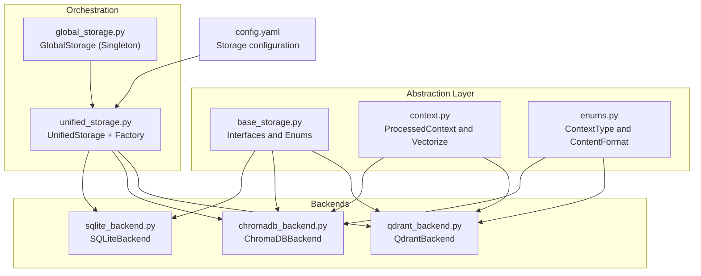
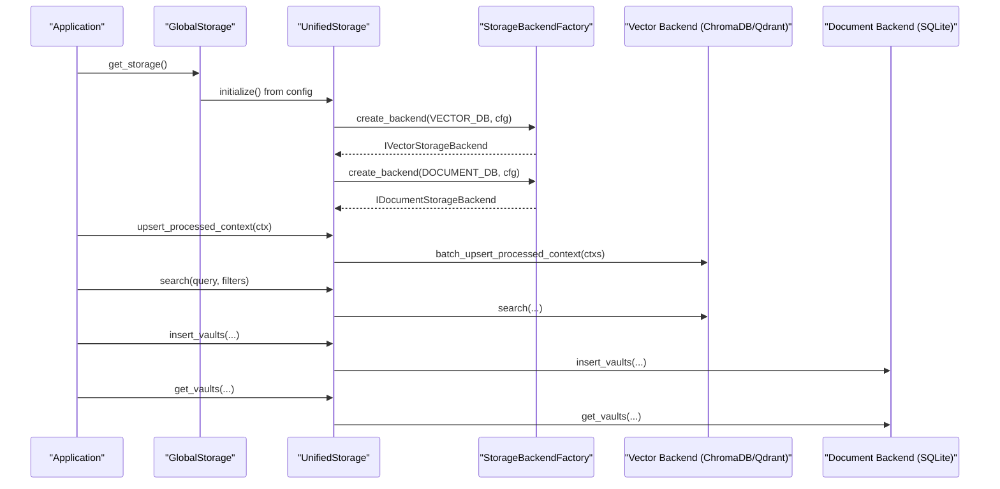
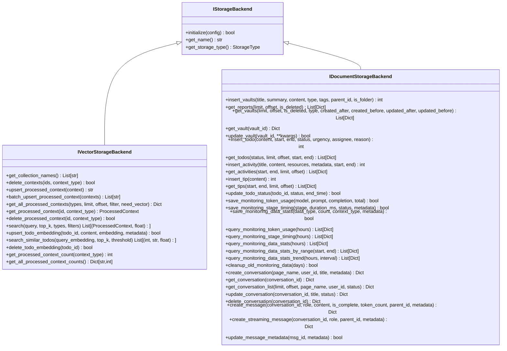
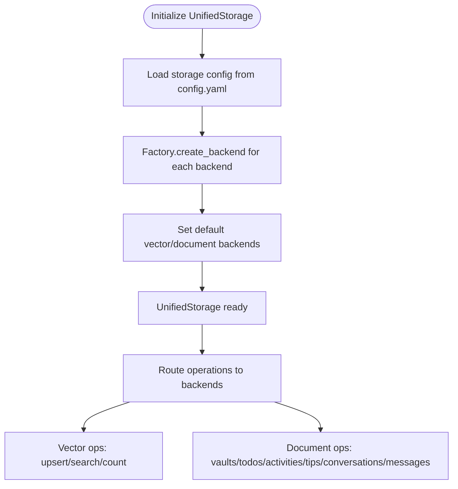
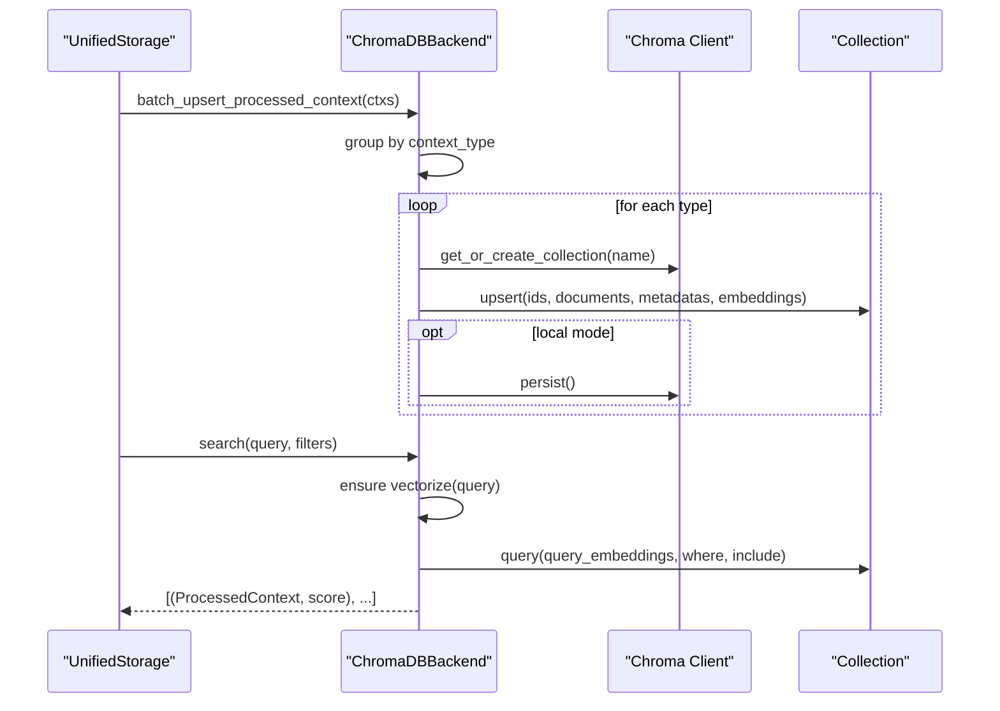
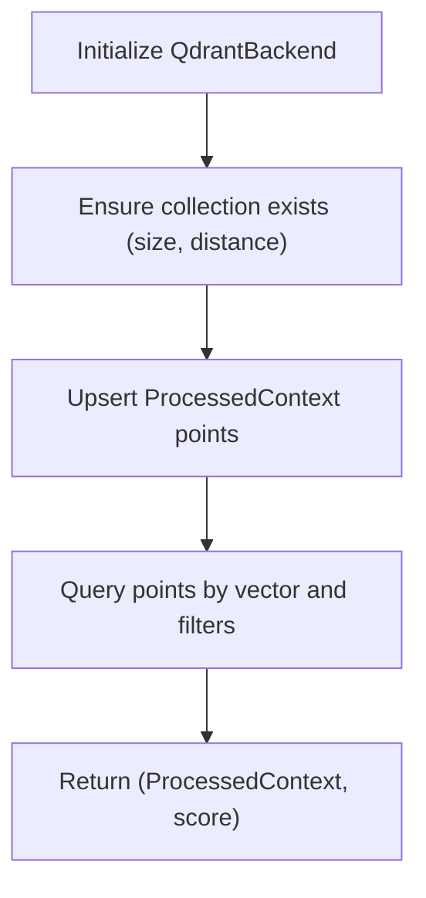
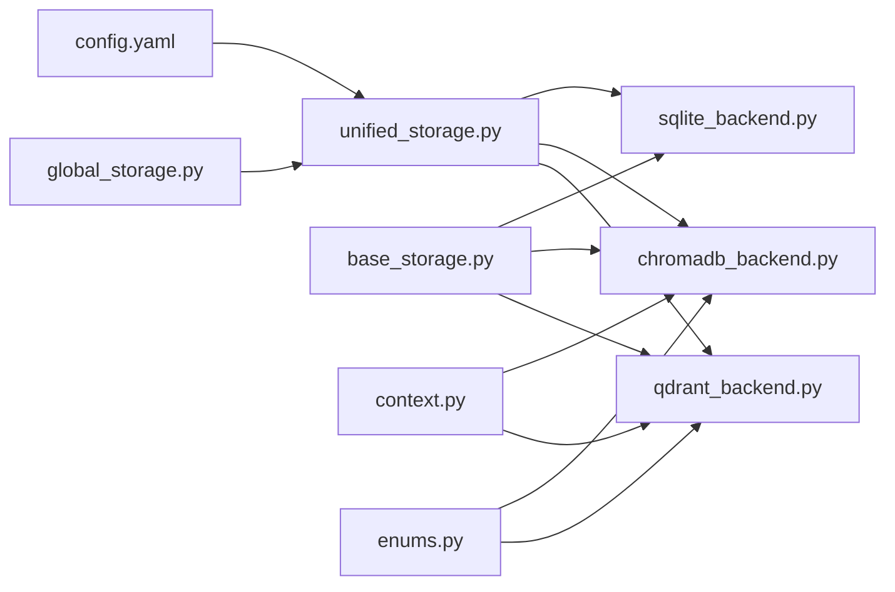

# Storage Backends

<cite>
**Referenced Files in This Document**
- [base_storage.py](file://opencontext/storage/base_storage.py)
- [unified_storage.py](file://opencontext/storage/unified_storage.py)
- [global_storage.py](file://opencontext/storage/global_storage.py)
- [sqlite_backend.py](file://opencontext/storage/backends/sqlite_backend.py)
- [chromadb_backend.py](file://opencontext/storage/backends/chromadb_backend.py)
- [qdrant_backend.py](file://opencontext/storage/backends/qdrant_backend.py)
- [context.py](file://opencontext/models/context.py)
- [enums.py](file://opencontext/models/enums.py)
- [config.yaml](file://config/config.yaml)
- [schema.sql](file://frontend/src/main/db/schema.sql)
</cite>

## Table of Contents
1. [Introduction](#introduction)
2. [Project Structure](#project-structure)
3. [Core Components](#core-components)
4. [Architecture Overview](#architecture-overview)
5. [Detailed Component Analysis](#detailed-component-analysis)
6. [Dependency Analysis](#dependency-analysis)
7. [Performance Considerations](#performance-considerations)
8. [Troubleshooting Guide](#troubleshooting-guide)
9. [Conclusion](#conclusion)
10. [Appendices](#appendices)

## Introduction
This document describes the multi-backend persistence architecture used by the storage system. It covers:
- SQLite backend for relational document storage (vaults, todos, activities, tips, monitoring, conversations, messages).
- ChromaDB and Qdrant vector databases for embedding storage and semantic search of ProcessedContext.
- Unified storage orchestration that provides a consistent interface across backends.
- Base storage abstractions that define the common contracts for vector and document storage.
- Configuration options for selecting and connecting to backends.
- Indexing strategies, data access patterns, and performance considerations.
- Migration and consistency considerations for hybrid storage.

## Project Structure
The storage subsystem is organized around a base abstraction layer, multiple backend implementations, and a unified orchestrator. Configuration is centralized in the application configuration file.



**Diagram sources**
- [base_storage.py](file://opencontext/storage/base_storage.py#L1-L304)
- [sqlite_backend.py](file://opencontext/storage/backends/sqlite_backend.py#L1-L2136)
- [chromadb_backend.py](file://opencontext/storage/backends/chromadb_backend.py#L1-L942)
- [qdrant_backend.py](file://opencontext/storage/backends/qdrant_backend.py#L1-L689)
- [unified_storage.py](file://opencontext/storage/unified_storage.py#L1-L925)
- [global_storage.py](file://opencontext/storage/global_storage.py#L1-L196)
- [context.py](file://opencontext/models/context.py#L1-L343)
- [enums.py](file://opencontext/models/enums.py#L1-L367)
- [config.yaml](file://config/config.yaml#L145-L182)

**Section sources**
- [base_storage.py](file://opencontext/storage/base_storage.py#L1-L304)
- [unified_storage.py](file://opencontext/storage/unified_storage.py#L1-L925)
- [global_storage.py](file://opencontext/storage/global_storage.py#L1-L196)
- [sqlite_backend.py](file://opencontext/storage/backends/sqlite_backend.py#L1-L2136)
- [chromadb_backend.py](file://opencontext/storage/backends/chromadb_backend.py#L1-L942)
- [qdrant_backend.py](file://opencontext/storage/backends/qdrant_backend.py#L1-L689)
- [context.py](file://opencontext/models/context.py#L1-L343)
- [enums.py](file://opencontext/models/enums.py#L1-L367)
- [config.yaml](file://config/config.yaml#L145-L182)

## Core Components
- Base storage abstractions define:
  - StorageType and DataType enumerations.
  - StorageConfig dataclass for backend configuration.
  - DocumentData for document retrieval results.
  - IStorageBackend, IVectorStorageBackend, and IDocumentStorageBackend contracts.
- Unified storage orchestrates backend selection and delegates operations to the appropriate backend.
- Global storage provides a singleton accessor to UnifiedStorage.

Key responsibilities:
- Vector backends (ChromaDB, Qdrant): embedding storage, similarity search, upsert/delete for ProcessedContext and todo embeddings.
- Document backend (SQLite): relational storage for vaults, todos, activities, tips, monitoring stats, conversations, and messages.

**Section sources**
- [base_storage.py](file://opencontext/storage/base_storage.py#L1-L304)
- [unified_storage.py](file://opencontext/storage/unified_storage.py#L1-L925)
- [global_storage.py](file://opencontext/storage/global_storage.py#L1-L196)

## Architecture Overview
The system initializes backends from configuration, exposes a unified interface, and routes operations based on data type and storage requirements.



**Diagram sources**
- [unified_storage.py](file://opencontext/storage/unified_storage.py#L1-L925)
- [global_storage.py](file://opencontext/storage/global_storage.py#L1-L196)
- [chromadb_backend.py](file://opencontext/storage/backends/chromadb_backend.py#L1-L942)
- [qdrant_backend.py](file://opencontext/storage/backends/qdrant_backend.py#L1-L689)
- [sqlite_backend.py](file://opencontext/storage/backends/sqlite_backend.py#L1-L2136)

## Detailed Component Analysis

### Base Abstractions and Contracts
- StorageType: distinguishes vector_db and document_db.
- DataType: text/image/file/markdown.
- StorageConfig: carries storage_type, name, and backend config.
- DocumentData: normalized document representation for retrieval.
- IStorageBackend: initialize(), get_name(), get_storage_type().
- IVectorStorageBackend: vector operations including upsert, batch_upsert, search, counts, and todo embedding helpers.
- IDocumentStorageBackend: CRUD and query operations for vaults, todos, activities, tips, monitoring, conversations, and messages.



**Diagram sources**
- [base_storage.py](file://opencontext/storage/base_storage.py#L1-L304)

**Section sources**
- [base_storage.py](file://opencontext/storage/base_storage.py#L1-L304)

### Unified Storage Orchestration
- StorageBackendFactory maps StorageType to backend implementations and creates instances based on config.backend.
- UnifiedStorage loads storage configs, initializes backends, and routes operations:
  - Vector operations: upsert/search/get counts for ProcessedContext.
  - Document operations: vaults, todos, activities, tips, monitoring, conversations, messages.
- GlobalStorage provides a singleton accessor and convenience wrappers.



**Diagram sources**
- [unified_storage.py](file://opencontext/storage/unified_storage.py#L1-L925)
- [config.yaml](file://config/config.yaml#L145-L182)

**Section sources**
- [unified_storage.py](file://opencontext/storage/unified_storage.py#L1-L925)
- [global_storage.py](file://opencontext/storage/global_storage.py#L1-L196)

### SQLite Backend (Relational Document Storage)
- Purpose: store structured documents and operational data (vaults, todos, activities, tips, monitoring, conversations, messages).
- Schema highlights:
  - vaults: hierarchical notes/documents with tags, parent references, deletion flags, and type.
  - todo: task items with status, urgency, assignee, reason, timestamps.
  - activity: event logs with JSON metadata/resources.
  - tips: quick tips.
  - monitoring_*: token usage, stage timing, and data stats with time buckets and uniqueness constraints.
  - conversations and messages: chat threads with foreign keys and cascading deletes.
  - message_thinking: stepwise thinking logs for messages.
- Indexes: created on frequently filtered/sorted columns (created_at, updated_at, status, urgency, parent_id, etc.) to optimize queries.
- Operations: insert/update/retrieve for vaults, todos, activities, tips; paginated queries with filters; monitoring data aggregation; conversation/message CRUD.

```mermaid
erDiagram
VAULTS {
integer id PK
text title
text summary
text content
text tags
integer parent_id FK
boolean is_folder
boolean is_deleted
datetime created_at
datetime updated_at
text document_type
integer sort_order
}
TODO {
integer id PK
text content
datetime created_at
datetime start_time
datetime end_time
integer status
integer urgency
text assignee
text reason
}
ACTIVITY {
integer id PK
text title
text content
json resources
json metadata
datetime start_time
datetime end_time
}
TIPS {
integer id PK
text content
datetime created_at
}
CONVERSATIONS {
integer id PK
text title
text user_id
varchar page_name
varchar status
json metadata
datetime created_at
datetime updated_at
}
MESSAGES {
integer id PK
integer conversation_id FK
text parent_message_id
text role
text content
text status
integer token_count
json metadata
integer latency_ms
text error_message
datetime completed_at
datetime created_at
datetime updated_at
}
MESSAGE_THINKING {
integer id PK
integer message_id FK
text content
text stage
real progress
integer sequence
json metadata
datetime created_at
}
MONITORING_TOKEN_USAGE {
integer id PK
text time_bucket
text model
integer prompt_tokens
integer completion_tokens
integer total_tokens
datetime created_at
unique(time_bucket, model)
}
MONITORING_STAGE_TIMING {
integer id PK
text time_bucket
text stage_name
integer count
integer total_duration_ms
integer min_duration_ms
integer max_duration_ms
integer avg_duration_ms
integer success_count
integer error_count
text metadata
datetime created_at
unique(time_bucket, stage_name)
}
MONITORING_DATA_STATS {
integer id PK
text time_bucket
text data_type
integer count
text context_type
text metadata
datetime created_at
unique(time_bucket, data_type, context_type)
}
VAULTS ||--o{ MESSAGE_THINKING : "has"
CONVERSATIONS ||--o{ MESSAGES : "contains"
```

**Diagram sources**
- [sqlite_backend.py](file://opencontext/storage/backends/sqlite_backend.py#L66-L341)
- [schema.sql](file://frontend/src/main/db/schema.sql#L1-L61)

**Section sources**
- [sqlite_backend.py](file://opencontext/storage/backends/sqlite_backend.py#L1-L2136)
- [schema.sql](file://frontend/src/main/db/schema.sql#L1-L61)

### ChromaDB Backend (Vector Database)
- Purpose: embedding storage and semantic search for ProcessedContext and todo deduplication.
- Collections:
  - One collection per ContextType (from enums).
  - Dedicated "todo" collection for todo embeddings.
- Initialization modes:
  - Local persistent client or HTTP server client with heartbeat and retry.
- Data model mapping:
  - Flatten ProcessedContext fields into metadata; store document text and embedding.
  - Serialize nested structures to JSON strings; handle timestamps and enums.
- Operations:
  - Upsert/batch_upsert: group by context_type, compute embeddings, upsert into corresponding collection.
  - Get by id and get all with pagination and filters.
  - Search: vector query with optional filters; convert distances to similarity scores.
  - Todo embedding upsert/search/delete.
  - Health checks, graceful shutdown, and pending write flushing.



**Diagram sources**
- [chromadb_backend.py](file://opencontext/storage/backends/chromadb_backend.py#L1-L942)
- [context.py](file://opencontext/models/context.py#L131-L200)
- [enums.py](file://opencontext/models/enums.py#L84-L101)

**Section sources**
- [chromadb_backend.py](file://opencontext/storage/backends/chromadb_backend.py#L1-L942)
- [context.py](file://opencontext/models/context.py#L1-L343)
- [enums.py](file://opencontext/models/enums.py#L1-L367)

### Qdrant Backend (Vector Database)
- Purpose: embedding storage and semantic search mirroring ChromaDB.
- Collections:
  - One collection per ContextType plus "todo".
- Initialization:
  - Create collection with vector params (size, cosine distance).
- Data model mapping:
  - Payload flattening with JSON serialization; UUID conversion for string ids.
- Operations:
  - Upsert/batch_upsert with PointStruct.
  - Retrieve by id, scroll with pagination, query points with filters.
  - Todo embedding upsert/search/delete with numeric ids.
  - Filter building using Qdrant models.Filter.



**Diagram sources**
- [qdrant_backend.py](file://opencontext/storage/backends/qdrant_backend.py#L1-L689)
- [context.py](file://opencontext/models/context.py#L131-L200)
- [enums.py](file://opencontext/models/enums.py#L84-L101)

**Section sources**
- [qdrant_backend.py](file://opencontext/storage/backends/qdrant_backend.py#L1-L689)
- [context.py](file://opencontext/models/context.py#L1-L343)
- [enums.py](file://opencontext/models/enums.py#L1-L367)

### Data Access Patterns and Indexing Strategies
- SQLite:
  - Indexes on created_at, updated_at, status, urgency, parent_id, and JSON metadata fields to accelerate filtering and sorting.
  - Paginated queries with explicit limit/offset; dynamic WHERE clauses for flexible filtering.
  - Foreign keys with cascade deletes for referential integrity (messages -> conversations).
- ChromaDB:
  - Collections per context_type; hnsw:space set to cosine for similarity.
  - Pagination handled by fetching extra records and slicing; filters built from metadata.
  - Embedding persisted locally in local mode; server mode relies on remote persistence.
- Qdrant:
  - Vector params configured with size and cosine distance; payload flattening with JSON serialization.
  - Scroll API for pagination; query_points for similarity search; filters via models.Filter.

**Section sources**
- [sqlite_backend.py](file://opencontext/storage/backends/sqlite_backend.py#L256-L341)
- [chromadb_backend.py](file://opencontext/storage/backends/chromadb_backend.py#L160-L187)
- [qdrant_backend.py](file://opencontext/storage/backends/qdrant_backend.py#L80-L94)

### Configuration Options
- Storage configuration keys:
  - storage.enabled: toggles storage module.
  - storage.backends: list of backend entries with:
    - name: logical name.
    - storage_type: "vector_db" or "document_db".
    - backend: "chromadb", "qdrant", or "sqlite".
    - config: backend-specific parameters.
- ChromaDB config:
  - mode: "local" or "server".
  - path: local persistence directory.
  - collection_prefix: prefix for collection names.
  - server settings: host, port, ssl, headers, settings.
- Qdrant config:
  - vector_size: must match embedding model output dimension.
  - path or host/port/https/api_key for server mode.
- SQLite config:
  - path: database file path.

**Section sources**
- [config.yaml](file://config/config.yaml#L145-L182)

## Dependency Analysis
- Backends depend on:
  - Base interfaces for contracts.
  - Models for ProcessedContext and Vectorize.
  - Enums for ContextType and ContentFormat.
- UnifiedStorage depends on:
  - Base interfaces to enforce contracts.
  - Config loading to initialize backends.
- GlobalStorage depends on:
  - UnifiedStorage to provide a singleton instance.



**Diagram sources**
- [config.yaml](file://config/config.yaml#L145-L182)
- [base_storage.py](file://opencontext/storage/base_storage.py#L1-L304)
- [unified_storage.py](file://opencontext/storage/unified_storage.py#L1-L925)
- [sqlite_backend.py](file://opencontext/storage/backends/sqlite_backend.py#L1-L2136)
- [chromadb_backend.py](file://opencontext/storage/backends/chromadb_backend.py#L1-L942)
- [qdrant_backend.py](file://opencontext/storage/backends/qdrant_backend.py#L1-L689)
- [context.py](file://opencontext/models/context.py#L1-L343)
- [enums.py](file://opencontext/models/enums.py#L1-L367)
- [global_storage.py](file://opencontext/storage/global_storage.py#L1-L196)

**Section sources**
- [unified_storage.py](file://opencontext/storage/unified_storage.py#L1-L925)
- [global_storage.py](file://opencontext/storage/global_storage.py#L1-L196)
- [base_storage.py](file://opencontext/storage/base_storage.py#L1-L304)

## Performance Considerations
- Vector backends:
  - Use cosine distance and appropriate HNSW parameters for similarity search.
  - Persist embeddings in local mode to avoid data loss; in server mode rely on server-side persistence.
  - Batch upsert to minimize network overhead; handle pending writes and retries.
  - Graceful shutdown to flush pending writes and persist index.
- SQLite:
  - Use indexes on frequently filtered columns; prefer JSON fields for metadata to leverage indexes where possible.
  - Paginate with limit/offset; avoid heavy joins for large datasets.
  - Monitor foreign key cascades to prevent orphaned records.
- Unified storage:
  - Route operations to the correct backend to avoid cross-backend inefficiencies.
  - Initialize only required backends to reduce startup cost.

[No sources needed since this section provides general guidance]

## Troubleshooting Guide
- Initialization failures:
  - Verify backend config (paths, host/port, SSL, API keys).
  - Check health checks and reconnection logic for vector backends.
- Vector search issues:
  - Ensure embeddings are computed and stored; confirm collection existence and data presence.
  - Validate filters and metadata serialization.
- SQLite errors:
  - Inspect foreign key constraints and cascading deletes.
  - Confirm indexes exist and are used by queries.
- Global storage:
  - Ensure storage is initialized before use; handle runtime errors when accessing uninitialized storage.

**Section sources**
- [chromadb_backend.py](file://opencontext/storage/backends/chromadb_backend.py#L230-L282)
- [qdrant_backend.py](file://opencontext/storage/backends/qdrant_backend.py#L95-L114)
- [sqlite_backend.py](file://opencontext/storage/backends/sqlite_backend.py#L66-L125)
- [global_storage.py](file://opencontext/storage/global_storage.py#L120-L196)

## Conclusion
The storage system provides a robust, multi-backend architecture:
- Vector backends (ChromaDB and Qdrant) handle semantic search and embedding storage for ProcessedContext and todo deduplication.
- SQLite serves as the relational document store for structured content and operational data.
- Unified storage and factory patterns offer a clean, extensible interface across backends.
- Configuration-driven backend selection enables flexible deployment options.
- Proper indexing and pagination strategies ensure efficient data access.

[No sources needed since this section summarizes without analyzing specific files]

## Appendices

### Data Model References
- ProcessedContext and Vectorize define the structure of vectorized content stored in vector backends.
- ContextType enumerates the semantic categories used to partition vector collections.

**Section sources**
- [context.py](file://opencontext/models/context.py#L131-L200)
- [enums.py](file://opencontext/models/enums.py#L84-L101)