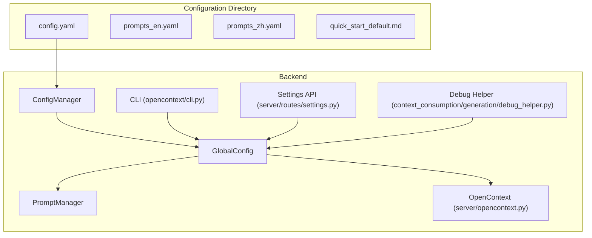
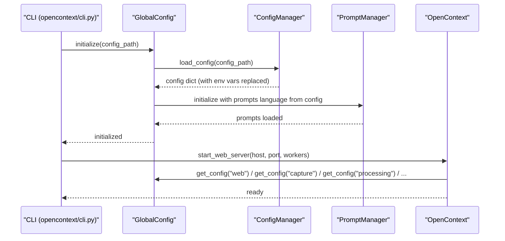
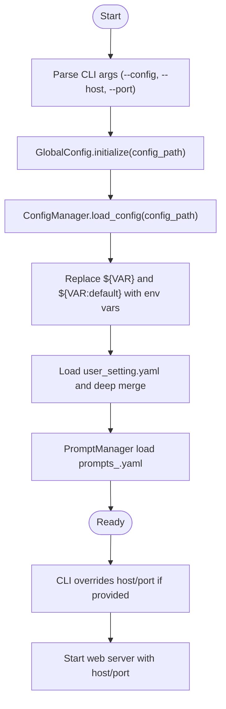
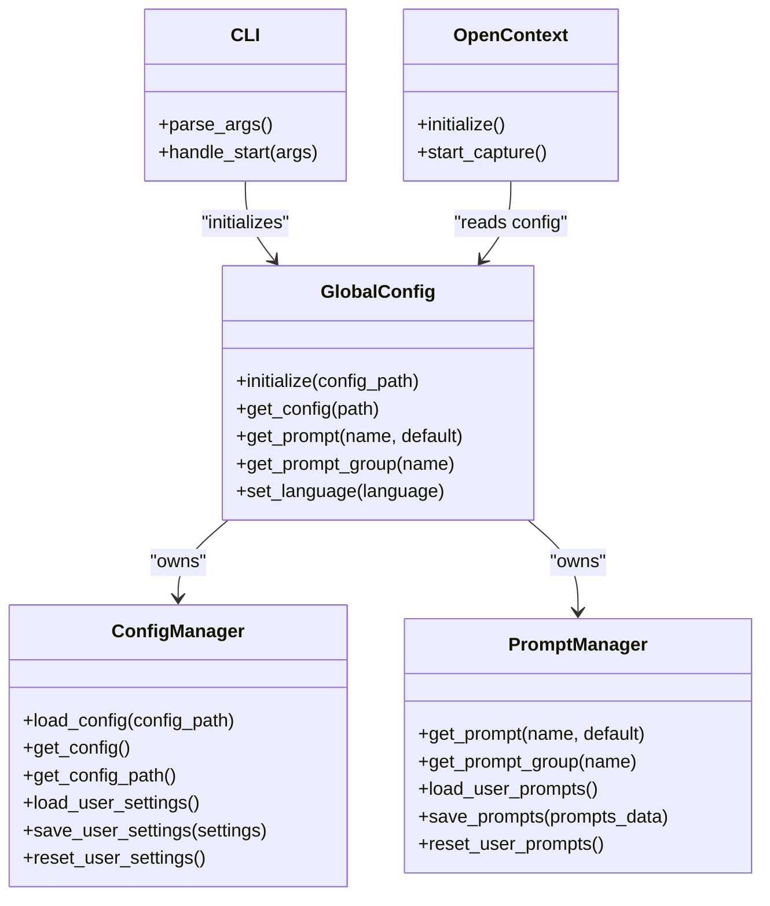
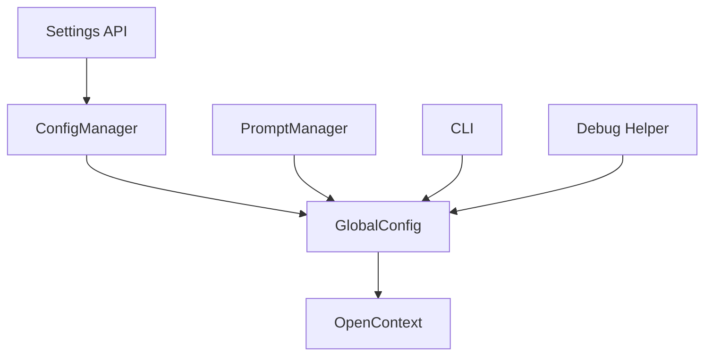

# Configuration Directory

<cite>
**Referenced Files in This Document**
- [config.yaml](file://config/config.yaml)
- [prompts_en.yaml](file://config/prompts_en.yaml)
- [prompts_zh.yaml](file://config/prompts_zh.yaml)
- [quick_start_default.md](file://config/quick_start_default.md)
- [config_manager.py](file://opencontext/config/config_manager.py)
- [global_config.py](file://opencontext/config/global_config.py)
- [prompt_manager.py](file://opencontext/config/prompt_manager.py)
- [cli.py](file://opencontext/cli.py)
- [opencontext.py](file://opencontext/server/opencontext.py)
- [settings.py](file://opencontext/server/routes/settings.py)
- [debug_helper.py](file://opencontext/context_consumption/generation/debug_helper.py)
</cite>

## Table of Contents
1. [Introduction](#introduction)
2. [Project Structure](#project-structure)
3. [Core Components](#core-components)
4. [Architecture Overview](#architecture-overview)
5. [Detailed Component Analysis](#detailed-component-analysis)
6. [Dependency Analysis](#dependency-analysis)
7. [Performance Considerations](#performance-considerations)
8. [Troubleshooting Guide](#troubleshooting-guide)
9. [Conclusion](#conclusion)
10. [Appendices](#appendices)

## Introduction
This document explains the MineContext configuration system centered on the configuration directory. It covers:
- Purpose and structure of config.yaml, including server settings, model configurations (embedding and VLM), and capture parameters
- How prompts_en.yaml and prompts_zh.yaml define AI prompt templates for different languages and use cases, including chunking strategies and system prompts
- The role of quick_start_default.md in onboarding new users
- How configuration values are loaded and prioritized (command-line > config file > defaults) and how they integrate with the ConfigManager and GlobalConfig in the backend
- Practical examples of common configuration changes, such as adjusting screenshot intervals or switching LLM providers

## Project Structure
The configuration directory contains:
- config.yaml: main runtime configuration for the backend
- prompts_en.yaml and prompts_zh.yaml: language-specific prompt templates for AI workflows
- quick_start_default.md: onboarding guide for new users

**Diagram sources**
- [config.yaml](file://config/config.yaml#L1-L253)
- [config_manager.py](file://opencontext/config/config_manager.py#L1-L253)
- [global_config.py](file://opencontext/config/global_config.py#L1-L331)
- [prompt_manager.py](file://opencontext/config/prompt_manager.py#L1-L220)
- [cli.py](file://opencontext/cli.py#L140-L241)
- [opencontext.py](file://opencontext/server/opencontext.py#L1-L200)
- [settings.py](file://opencontext/server/routes/settings.py#L1-L272)
- [debug_helper.py](file://opencontext/context_consumption/generation/debug_helper.py#L40-L56)

**Section sources**
- [config.yaml](file://config/config.yaml#L1-L253)
- [prompts_en.yaml](file://config/prompts_en.yaml#L1-L1852)
- [prompts_zh.yaml](file://config/prompts_zh.yaml#L1-L1817)
- [quick_start_default.md](file://config/quick_start_default.md#L1-L61)

## Core Components
- config.yaml: Defines server host/port, logging, capture modules (screenshots, folders, files, vaults), processing (document/screenshot processors, merger), storage backends (vector/document), consumption tasks, web server, API authentication, prompts language, content generation, tools, and completion service.
- prompts_en.yaml and prompts_zh.yaml: Provide AI prompt templates for chat workflows, processing, merging, and generation. They include system prompts, user prompts, and structured outputs for screenshot extraction and merging.
- quick_start_default.md: Guides users through screen monitoring, home dashboard, and creation features.

**Section sources**
- [config.yaml](file://config/config.yaml#L1-L253)
- [prompts_en.yaml](file://config/prompts_en.yaml#L1-L1852)
- [prompts_zh.yaml](file://config/prompts_zh.yaml#L1-L1817)
- [quick_start_default.md](file://config/quick_start_default.md#L1-L61)

## Architecture Overview
The configuration system integrates with the backend through:
- CLI parsing of command-line arguments (--config, --host, --port)
- ConfigManager loading and environment variable substitution
- GlobalConfig orchestrating initialization and exposing configuration and prompts
- PromptManager loading language-specific prompts and merging user overrides
- OpenContext consuming configuration to initialize capture, processing, storage, and consumption components

**Diagram sources**
- [cli.py](file://opencontext/cli.py#L140-L241)
- [global_config.py](file://opencontext/config/global_config.py#L90-L152)
- [config_manager.py](file://opencontext/config/config_manager.py#L37-L61)
- [prompt_manager.py](file://opencontext/config/prompt_manager.py#L17-L48)
- [opencontext.py](file://opencontext/server/opencontext.py#L60-L83)

## Detailed Component Analysis

### config.yaml: Server, Models, Capture, Processing, Storage, Consumption, Tools, Completion
- General and logging switches, user_setting_path for user overrides
- document_processing: batch size, max image size, DPI, page threshold for scanned documents
- vlm_model and embedding_model: base_url, api_key, model, provider, output_dim
- capture: screenshot interval and storage path, folder/file/vault monitors with intervals, recursion, initial scan, max file size, ignore patterns
- processing: document_processor and screenshot_processor tuning, dedup cache, similarity thresholds, resizing quality, deletion policy, max raw properties
- context_merger: similarity thresholds, intelligent merging, memory management, cleanup intervals, cross-type processing, per-type retention and merge limits
- storage: vector backends (ChromaDB or Qdrant), document store (SQLite), collection prefix/path resolution
- web server host/port
- api_auth: enable/disable, api_keys, excluded paths
- prompts: language selection
- content_generation: debug output path, task intervals (activity/tips/todos/report)
- tools: operation tools (e.g., web search)
- completion: service enable flag

Common configuration changes:
- Adjust screenshot capture interval: modify capture.screenshot.capture_interval
- Switch LLM providers: update vlm_model.provider and embedding_model.provider
- Change embedding output dimension: adjust embedding_model.output_dim
- Tune processing throughput: adjust screenshot_processor.batch_size and batch_timeout
- Switch vector backend: choose chromadb or qdrant in storage.backends

**Section sources**
- [config.yaml](file://config/config.yaml#L1-L253)

### Prompts: Language Templates and Workflows
- Language selection: prompts.language controls which prompt file is loaded (prompts_en.yaml or prompts_zh.yaml)
- Chat workflow: intent_analysis, query_classification, social_interaction, executor.generate/edit/answer, context_collection tool_analysis/validation/sufficiency_evaluation, context_filter
- Processing: screenshot extraction templates with structured outputs and merging rules
- Merging: context_merging_multiple and screenshot_batch_merging with semantic rules and entity extraction requirements
- Generation: merge_hourly_reports and related generation templates

Chunking strategies and system prompts:
- The prompts define structured JSON outputs and explicit merging rules for screenshot batches, guiding how to split and combine context items by type and semantics.
- System prompts emphasize context priority, transparency, and quality assurance for executor and context collection nodes.

**Section sources**
- [prompts_en.yaml](file://config/prompts_en.yaml#L1-L1852)
- [prompts_zh.yaml](file://config/prompts_zh.yaml#L1-L1817)
- [global_config.py](file://opencontext/config/global_config.py#L114-L152)

### quick_start_default.md: Onboarding Guide
- Explains screen monitor capturing and summarization cadence
- Highlights Home dashboard features: todos, tips, summaries
- Demonstrates creation with AI enhancement and document/image/table/math/code blocks

**Section sources**
- [quick_start_default.md](file://config/quick_start_default.md#L1-L61)

### Configuration Loading and Prioritization
- Command-line overrides: --host and --port override web.host/port from config.yaml
- Environment variables: ${VAR} and ${VAR:default} substitutions in config.yaml are resolved using os.environ
- User settings: user_setting.yaml merges into main config via ConfigManager.load_user_settings
- Defaults: if config file is missing, GlobalConfig falls back to defaults and logs a warning

**Diagram sources**
- [cli.py](file://opencontext/cli.py#L140-L241)
- [config_manager.py](file://opencontext/config/config_manager.py#L37-L101)
- [global_config.py](file://opencontext/config/global_config.py#L90-L152)

**Section sources**
- [cli.py](file://opencontext/cli.py#L140-L241)
- [config_manager.py](file://opencontext/config/config_manager.py#L37-L101)
- [global_config.py](file://opencontext/config/global_config.py#L90-L152)

### Integration with Backend Components
- GlobalConfig.get_instance() initializes ConfigManager and PromptManager, exposes convenience getters
- OpenContext.initialize() relies on GlobalConfig for configuration access across capture, processing, storage, and consumption
- Settings API validates and persists model settings, writing to user_setting.yaml and merging into current config
- Debug helper resolves content_generation.debug.output_path using CONTEXT_PATH environment variable

**Diagram sources**
- [config_manager.py](file://opencontext/config/config_manager.py#L1-L253)
- [global_config.py](file://opencontext/config/global_config.py#L1-L331)
- [prompt_manager.py](file://opencontext/config/prompt_manager.py#L1-L220)
- [opencontext.py](file://opencontext/server/opencontext.py#L60-L83)
- [cli.py](file://opencontext/cli.py#L140-L241)

**Section sources**
- [global_config.py](file://opencontext/config/global_config.py#L90-L152)
- [opencontext.py](file://opencontext/server/opencontext.py#L60-L83)
- [settings.py](file://opencontext/server/routes/settings.py#L1-L272)
- [debug_helper.py](file://opencontext/context_consumption/generation/debug_helper.py#L40-L56)

## Dependency Analysis
- ConfigManager depends on YAML parsing and environment variable expansion
- GlobalConfig composes ConfigManager and PromptManager, and exposes unified getters
- CLI depends on GlobalConfig for initialization and uses command-line overrides
- OpenContext consumes GlobalConfig for all subsystems
- Settings API writes user settings to user_setting.yaml and triggers a reload

**Diagram sources**
- [config_manager.py](file://opencontext/config/config_manager.py#L1-L253)
- [global_config.py](file://opencontext/config/global_config.py#L1-L331)
- [prompt_manager.py](file://opencontext/config/prompt_manager.py#L1-L220)
- [cli.py](file://opencontext/cli.py#L140-L241)
- [opencontext.py](file://opencontext/server/opencontext.py#L60-L83)
- [settings.py](file://opencontext/server/routes/settings.py#L1-L272)
- [debug_helper.py](file://opencontext/context_consumption/generation/debug_helper.py#L40-L56)

**Section sources**
- [config_manager.py](file://opencontext/config/config_manager.py#L1-L253)
- [global_config.py](file://opencontext/config/global_config.py#L1-L331)
- [prompt_manager.py](file://opencontext/config/prompt_manager.py#L1-L220)
- [cli.py](file://opencontext/cli.py#L140-L241)
- [opencontext.py](file://opencontext/server/opencontext.py#L60-L83)
- [settings.py](file://opencontext/server/routes/settings.py#L1-L272)
- [debug_helper.py](file://opencontext/context_consumption/generation/debug_helper.py#L40-L56)

## Performance Considerations
- Embedding output dimension affects vector DB sizing and memory usage; tune embedding_model.output_dim accordingly
- Screenshot capture interval impacts CPU and disk I/O; balance capture_interval with storage path and retention policies
- Processing batch sizes and timeouts influence throughput and latency; adjust screenshot_processor.batch_size and batch_timeout
- Vector DB choice (ChromaDB vs Qdrant) affects indexing and retrieval performance; ensure vector_size matches embedding output_dim
- Logging level and log path impact disk usage; set logging.level and logging.log_path appropriately

[No sources needed since this section provides general guidance]

## Troubleshooting Guide
- Configuration file not found: ensure --config points to a valid path or place config.yaml in the expected location
- Environment variable substitution: verify ${VAR} and ${VAR:default} placeholders resolve to actual environment variables
- User settings not applied: confirm user_setting.yaml exists and is readable; use reset_user_settings to restore defaults
- Prompt language mismatch: set prompts.language to "zh" or "en" and reload prompts
- Debug output path: CONTEXT_PATH environment variable resolves ${CONTEXT_PATH} placeholders in content_generation.debug.output_path

**Section sources**
- [config_manager.py](file://opencontext/config/config_manager.py#L37-L61)
- [config_manager.py](file://opencontext/config/config_manager.py#L143-L207)
- [global_config.py](file://opencontext/config/global_config.py#L187-L235)
- [debug_helper.py](file://opencontext/context_consumption/generation/debug_helper.py#L40-L56)

## Conclusion
The MineContext configuration system provides a robust, layered approach:
- config.yaml centralizes runtime settings with environment variable substitution and user overrides
- prompts_en.yaml and prompts_zh.yaml define AI workflows and merging strategies
- GlobalConfig and ConfigManager orchestrate loading, merging, and access
- CLI allows command-line overrides for host/port
- Backend components consume configuration consistently for capture, processing, storage, and consumption

[No sources needed since this section summarizes without analyzing specific files]

## Appendices

### Common Configuration Changes
- Adjust screenshot capture interval: edit capture.screenshot.capture_interval
- Switch LLM providers: update vlm_model.provider and embedding_model.provider
- Change embedding output dimension: adjust embedding_model.output_dim
- Tune processing throughput: adjust screenshot_processor.batch_size and batch_timeout
- Switch vector backend: choose chromadb or qdrant in storage.backends and set vector_size to match embedding output_dim

**Section sources**
- [config.yaml](file://config/config.yaml#L1-L253)