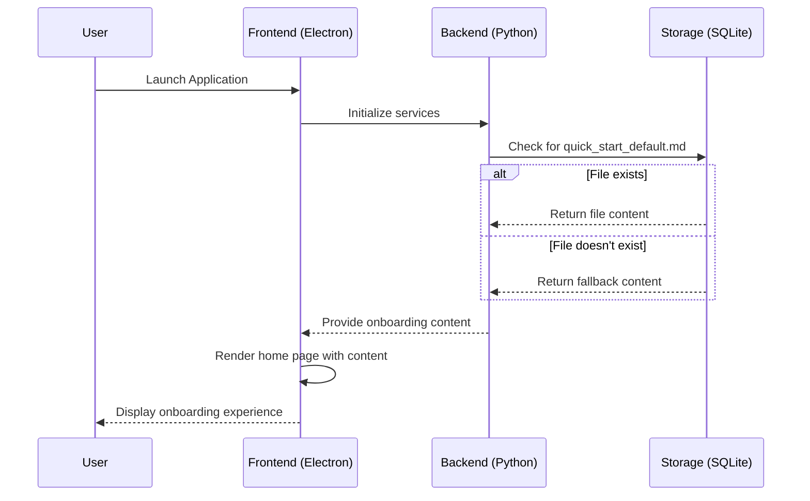

# Onboarding Configuration (quick_start_default.md)

<cite>
**Referenced Files in This Document**   
- [quick_start_default.md](file://config/quick_start_default.md)
- [sqlite_backend.py](file://opencontext/storage/backends/sqlite_backend.py)
- [home-page.tsx](file://frontend/src/renderer/src/pages/home/home-page.tsx)
- [AppService.ts](file://frontend/src/main/services/AppService.ts)
- [use-home-info.ts](file://frontend/src/renderer/src/hooks/use-home-info.ts)
</cite>

## Table of Contents
1. [Introduction](#introduction)
2. [File Location and Structure](#file-location-and-structure)
3. [Content and Purpose](#content-and-purpose)
4. [Loading and Rendering Mechanism](#loading-and-rendering-mechanism)
5. [Integration with AppService](#integration-with-appservice)
6. [Content Recommendations](#content-recommendations)
7. [Customization Strategies](#customization-strategies)
8. [Conclusion](#conclusion)

## Introduction
The `quick_start_default.md` file serves as the default onboarding content presented to new users during the initial setup of MineContext. This Markdown document provides essential guidance on core features and first-time configuration, helping users understand the application's capabilities and how to get started effectively. The document is designed to be both informative and engaging, introducing users to the concept of context-aware AI partnership and guiding them through key functionalities.

## File Location and Structure
The `quick_start_default.md` file is located in the `config/` directory of the project root. This strategic placement ensures that the file is easily accessible during the application's initialization process and can be loaded as part of the configuration setup. The file follows a standard Markdown format with clear section headings and structured content that guides users through various aspects of the application.

**Section sources**
- [quick_start_default.md](file://config/quick_start_default.md)

## Content and Purpose
The `quick_start_default.md` file contains comprehensive information about MineContext's core features and functionality. It introduces users to the application as a "Context-Aware AI Partner" that goes beyond being just a workbench, second brain, or knowledge base. The document is structured into several key sections:

- **Screen Monitor**: Explains how the application captures screen content and transforms it into intelligent, connected contexts while emphasizing local data storage for privacy protection.
- **Home**: Describes the home page as the central hub where MineContext proactively delivers daily summaries, todos, tips, and other insights derived from collected contexts.
- **Creation**: Details how users can create content with AI enhancement based on their own contexts, with each output becoming part of the ongoing context.

The document also includes practical examples of content creation, such as adding images, tables, mathematical expressions, and code blocks, providing users with immediate guidance on how to interact with the application.

**Section sources**
- [quick_start_default.md](file://config/quick_start_default.md)

## Loading and Rendering Mechanism
The `quick_start_default.md` file is loaded and rendered through a coordinated process between the backend and frontend components of MineContext. In the backend, the `sqlite_backend.py` file contains logic to locate and read the quick start document from the config directory. If the file exists, its content is read and made available to the application; otherwise, a fallback content message is provided.

The frontend component responsible for displaying onboarding content is the home page, implemented in `home-page.tsx`. This React component serves as the primary interface where users first engage with the application after installation. The home page integrates various components that display different types of contextual information, including recent activities, todos, tips, and creation suggestions.

The rendering process leverages the application's state management system, which uses Redux for state persistence. When the application initializes, the home page component retrieves the necessary data through various hooks and services, ensuring that the onboarding experience is both dynamic and responsive to user interactions.

**Diagram sources**
- [sqlite_backend.py](file://opencontext/storage/backends/sqlite_backend.py#L355-L370)
- [home-page.tsx](file://frontend/src/renderer/src/pages/home/home-page.tsx)

**Section sources**
- [sqlite_backend.py](file://opencontext/storage/backends/sqlite_backend.py#L355-L370)
- [home-page.tsx](file://frontend/src/renderer/src/pages/home/home-page.tsx)

## Integration with AppService
The onboarding process and the display of the `quick_start_default.md` content are closely integrated with the AppService, which manages various application-level settings and behaviors. The AppService, implemented in `AppService.ts`, handles critical functionality such as determining the onboarding state and managing application settings that affect the user experience.

When a new user launches MineContext for the first time, the AppService helps determine whether the user is in an initial setup state. This determination influences how the home page and its content are presented. The service also manages settings that can affect the onboarding experience, such as launch-on-boot preferences and accessibility permissions, particularly on macOS systems.

The integration between the onboarding content and AppService ensures a cohesive user experience where the guidance provided in the quick start document aligns with the actual application behavior and settings. This integration allows for a seamless transition from the initial onboarding phase to regular application usage.

**Section sources**
- [AppService.ts](file://frontend/src/main/services/AppService.ts)

## Content Recommendations
To ensure effective user guidance, the `quick_start_default.md` file should follow specific content recommendations:

1. **Clear Structure**: Use a logical hierarchy with appropriate headings (##, ###) to organize information and make it easily scannable.
2. **Step-by-Step Instructions**: Provide clear, sequential guidance for setting up and using core features.
3. **Visual Examples**: Include code blocks and formatting examples (as seen in the current document) to demonstrate content creation capabilities.
4. **Relevant Links**: Incorporate links to additional resources, documentation, or support channels for users who want to explore further.
5. **Engaging Tone**: Maintain an encouraging and supportive tone that emphasizes the application's value proposition as a proactive AI partner.

The current implementation already includes several best practices, such as demonstrating various content types (images, tables, math, code) and explaining the purpose of each major feature. These elements help users quickly understand the application's capabilities and how to leverage them effectively.

**Section sources**
- [quick_start_default.md](file://config/quick_start_default.md)

## Customization Strategies
The `quick_start_default.md` file can be customized for different deployment scenarios or user segments while maintaining clarity and engagement. Some effective customization strategies include:

1. **User Segment Targeting**: Create variations of the document for different user types (e.g., students, professionals, researchers) by emphasizing features most relevant to their use cases.
2. **Deployment Context**: Adapt the content based on the deployment environment, such as enterprise installations versus personal use, by including organization-specific guidelines or policies.
3. **Localization**: While the current document is in English, the structure supports localization to other languages, allowing for culturally appropriate onboarding experiences.
4. **Feature Highlighting**: Customize the document to highlight specific features based on the user's subscription level or enabled modules.
5. **Integration Guidance**: Include specific instructions for integrating with commonly used tools or services in particular industries.

These customization options allow organizations and administrators to tailor the onboarding experience to their specific needs while maintaining the core structure and effectiveness of the original document.

## Conclusion
The `quick_start_default.md` file plays a crucial role in the user onboarding process for MineContext, serving as the primary introduction to the application's capabilities and functionality. Its strategic placement in the config directory, integration with the AppService, and rendering through the home page component create a cohesive onboarding experience that guides new users through the initial setup and configuration process. By following content recommendations and leveraging customization strategies, this document can be adapted to various deployment scenarios while maintaining its effectiveness in helping users understand and engage with the context-aware AI partner.