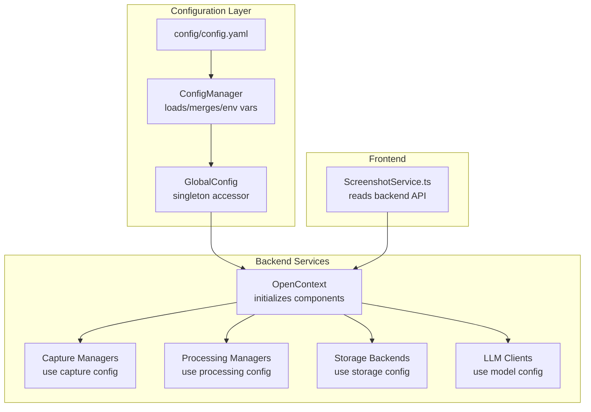
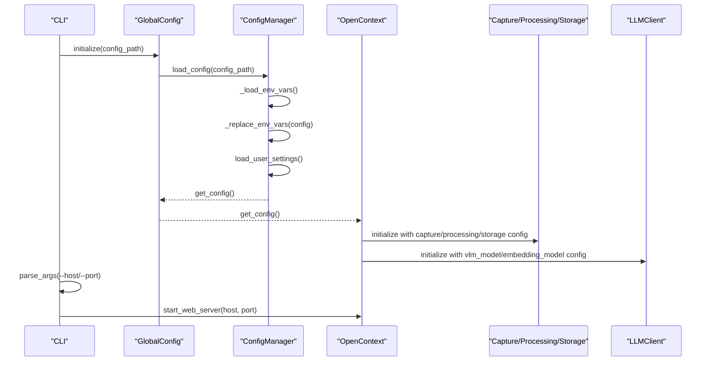
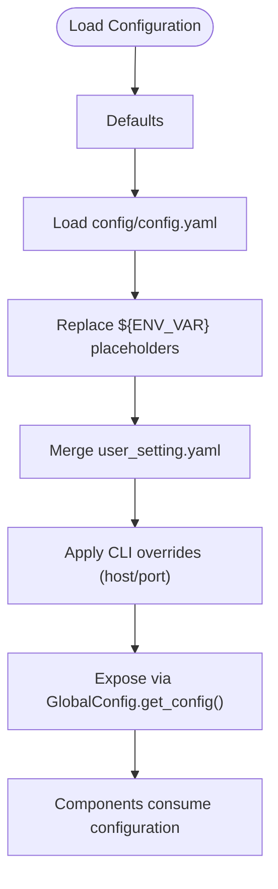
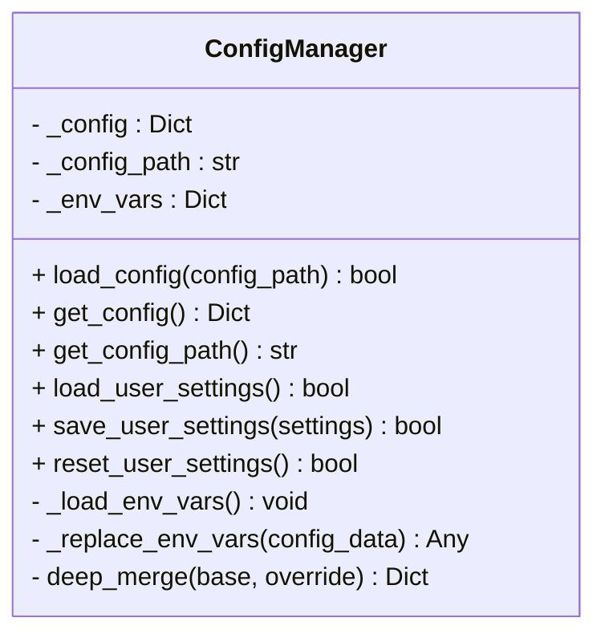
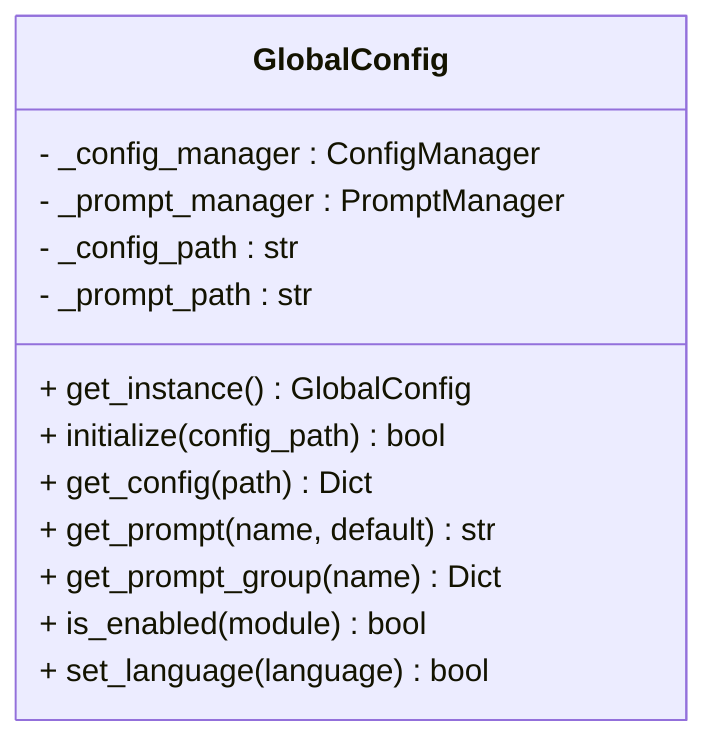
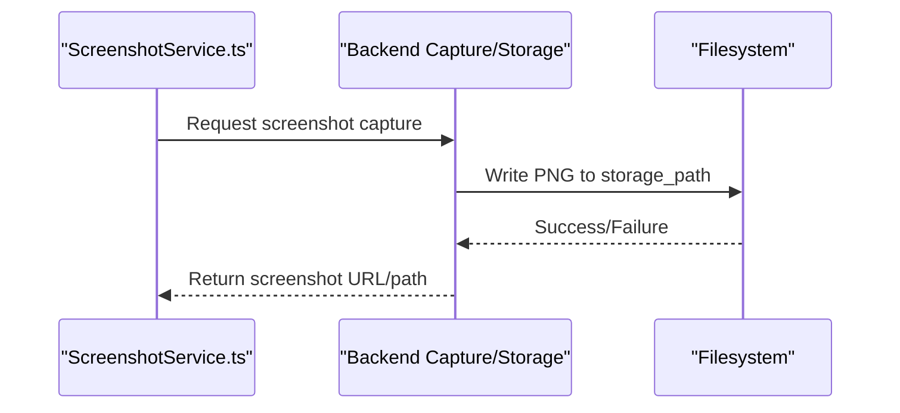
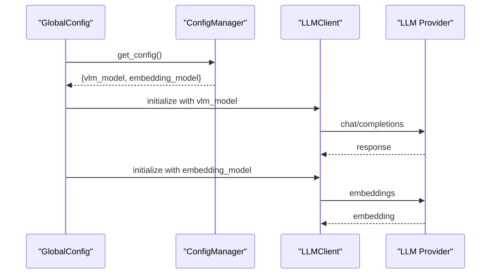
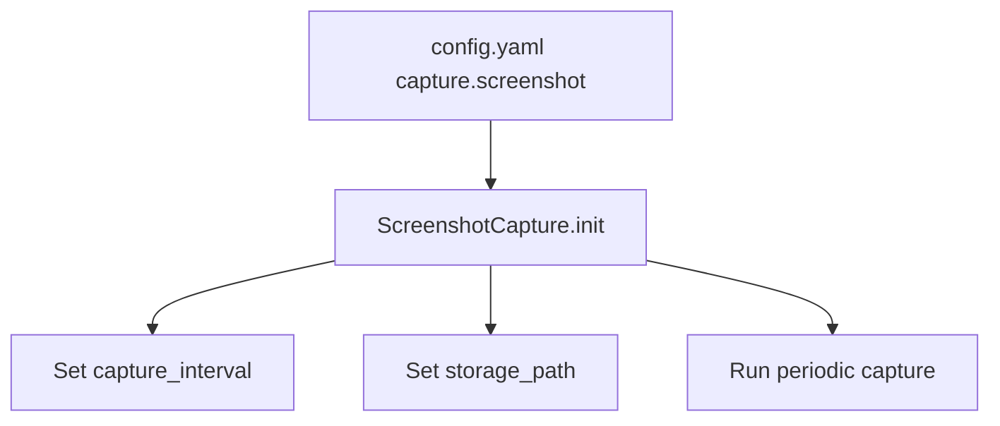
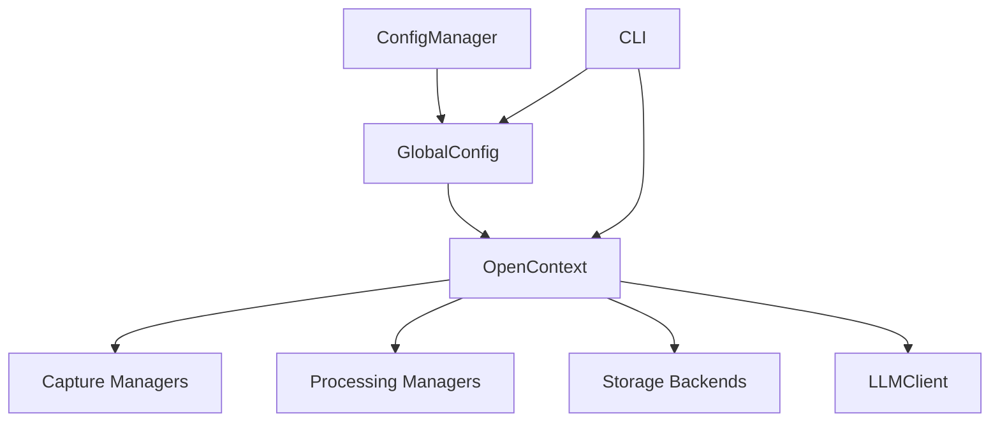

# System Configuration (config.yaml)

<cite>
**Referenced Files in This Document**
- [config.yaml](file://config/config.yaml)
- [config_manager.py](file://opencontext/config/config_manager.py)
- [global_config.py](file://opencontext/config/global_config.py)
- [cli.py](file://opencontext/cli.py)
- [opencontext.py](file://opencontext/server/opencontext.py)
- [settings.py](file://opencontext/server/routes/settings.py)
- [llm_client.py](file://opencontext/llm/llm_client.py)
- [screenshot.py](file://opencontext/context_capture/screenshot.py)
- [ScreenshotService.ts](file://frontend/src/main/services/ScreenshotService.ts)
</cite>

## Table of Contents
1. [Introduction](#introduction)
2. [Project Structure](#project-structure)
3. [Core Components](#core-components)
4. [Architecture Overview](#architecture-overview)
5. [Detailed Component Analysis](#detailed-component-analysis)
6. [Dependency Analysis](#dependency-analysis)
7. [Performance Considerations](#performance-considerations)
8. [Troubleshooting Guide](#troubleshooting-guide)
9. [Conclusion](#conclusion)
10. [Appendices](#appendices)

## Introduction
This document explains the system configuration file config.yaml and how it defines core application settings. It covers:
- How the configuration file specifies server settings, model parameters (VLM and embeddings), capture intervals, and storage paths
- The hierarchical configuration loading mechanism: defaults, config file, environment variables, and command-line arguments
- How ConfigManager parses and validates the file and propagates values to services like ScreenshotService and LLMClient
- Practical examples for modifying screenshot frequency, changing the LLM provider endpoint, and adjusting context retention policies
- Guidance for environment-specific configurations and best practices for securing sensitive values

## Project Structure
The configuration system centers around a YAML file and a Python configuration manager that loads, merges, and exposes settings across the backend. Frontend services read configuration indirectly via the backend’s API.

**Diagram sources**
- [config.yaml](file://config/config.yaml#L1-L253)
- [config_manager.py](file://opencontext/config/config_manager.py#L37-L118)
- [global_config.py](file://opencontext/config/global_config.py#L90-L113)
- [opencontext.py](file://opencontext/server/opencontext.py#L60-L83)
- [screenshot.py](file://opencontext/context_capture/screenshot.py#L106-L122)
- [llm_client.py](file://opencontext/llm/llm_client.py#L32-L46)
- [ScreenshotService.ts](file://frontend/src/main/services/ScreenshotService.ts#L1-L120)

**Section sources**
- [config.yaml](file://config/config.yaml#L1-L253)
- [config_manager.py](file://opencontext/config/config_manager.py#L37-L118)
- [global_config.py](file://opencontext/config/global_config.py#L90-L113)
- [opencontext.py](file://opencontext/server/opencontext.py#L60-L83)

## Core Components
- config/config.yaml: Central configuration file defining server, capture, processing, storage, prompts, content generation, tools, and completion settings.
- ConfigManager: Loads YAML, replaces ${ENV_VAR} placeholders, merges user settings, and exposes merged configuration.
- GlobalConfig: Singleton accessor that initializes ConfigManager and provides convenience methods to retrieve configuration and prompts.
- CLI: Parses command-line arguments and applies overrides to server host/port; passes config path to initialization.
- OpenContext: Initializes subsystems and uses configuration to configure capture, processing, storage, and LLM clients.
- LLMClient: Reads model parameters from configuration to connect to VLM and embedding providers.
- ScreenshotCapture: Uses capture configuration (interval, storage path, dedup thresholds) to drive periodic screenshot capture.
- ScreenshotService.ts: Frontend service that interacts with backend APIs; screenshots are stored on disk by backend services.

**Section sources**
- [config.yaml](file://config/config.yaml#L1-L253)
- [config_manager.py](file://opencontext/config/config_manager.py#L37-L118)
- [global_config.py](file://opencontext/config/global_config.py#L90-L113)
- [cli.py](file://opencontext/cli.py#L140-L167)
- [opencontext.py](file://opencontext/server/opencontext.py#L60-L83)
- [llm_client.py](file://opencontext/llm/llm_client.py#L32-L46)
- [screenshot.py](file://opencontext/context_capture/screenshot.py#L106-L122)
- [ScreenshotService.ts](file://frontend/src/main/services/ScreenshotService.ts#L1-L120)

## Architecture Overview
The configuration lifecycle:
- Defaults are implicit in component initialization and route handlers.
- config/config.yaml provides baseline values.
- Environment variables resolve placeholders in the YAML (e.g., ${CONTEXT_PATH}, ${LLM_BASE_URL}, ${EMBEDDING_API_KEY}).
- User settings (user_setting.yaml) are merged into the main configuration.
- Command-line arguments override web server host/port.
- GlobalConfig exposes configuration to all subsystems.

**Diagram sources**
- [cli.py](file://opencontext/cli.py#L140-L167)
- [global_config.py](file://opencontext/config/global_config.py#L90-L113)
- [config_manager.py](file://opencontext/config/config_manager.py#L37-L118)
- [opencontext.py](file://opencontext/server/opencontext.py#L60-L83)
- [llm_client.py](file://opencontext/llm/llm_client.py#L32-L46)
- [screenshot.py](file://opencontext/context_capture/screenshot.py#L106-L122)

## Detailed Component Analysis

### Configuration File Roles and Sections
- General and logging: enables/disables features and sets log level and path.
- Document processing: batch sizes and image processing parameters for VLM.
- Model parameters:
  - vlm_model: base_url, api_key, model, provider
  - embedding_model: base_url, api_key, model, provider, output_dim
- Capture module:
  - screenshot.enabled/capture_interval/storage_path
  - folder_monitor/file_monitor/vault_document_monitor intervals and paths
- Processing module:
  - document_processor and screenshot_processor batch sizes/timeouts
  - context merger thresholds and retention policies per context type
- Storage module:
  - Vector database backends (ChromaDB or Qdrant) with modes and paths
  - Document database (SQLite) path
- Consumption module: enabled flag
- Web server: host and port
- API authentication: enable/disable and api_keys with excluded paths
- Prompts: language selection
- Content generation: debug output path and task intervals
- Tools: web search tool configuration
- Completion: enabled flag

Practical examples:
- Modify screenshot frequency: adjust capture.screenshot.capture_interval in config.yaml.
- Change LLM provider endpoint: set vlm_model.base_url and embedding_model.base_url.
- Adjust context retention: change retention_days and max_merge_count for specific context types under processing.context_merger.

**Section sources**
- [config.yaml](file://config/config.yaml#L1-L253)

### Hierarchical Configuration Loading Mechanism
- Defaults: Implicit defaults in component initialization and route handlers.
- Config file: Values loaded from config/config.yaml.
- Environment variables: Placeholders like ${VAR} and ${VAR:default} are replaced using ConfigManager.
- User settings: user_setting.yaml is merged into the main configuration.
- Command-line overrides: CLI allows overriding web server host/port; other overrides can be introduced similarly.

**Diagram sources**
- [config_manager.py](file://opencontext/config/config_manager.py#L37-L118)
- [global_config.py](file://opencontext/config/global_config.py#L236-L262)
- [cli.py](file://opencontext/cli.py#L222-L239)

**Section sources**
- [config_manager.py](file://opencontext/config/config_manager.py#L37-L118)
- [global_config.py](file://opencontext/config/global_config.py#L236-L262)
- [cli.py](file://opencontext/cli.py#L222-L239)

### ConfigManager Parsing and Validation
- Loads YAML safely and stores raw config.
- Replaces environment variable placeholders using regex patterns.
- Loads user_setting.yaml and deep-merges it into the main configuration.
- Exposes merged configuration via get_config().

**Diagram sources**
- [config_manager.py](file://opencontext/config/config_manager.py#L37-L253)

**Section sources**
- [config_manager.py](file://opencontext/config/config_manager.py#L37-L118)
- [config_manager.py](file://opencontext/config/config_manager.py#L143-L224)

### GlobalConfig Accessor
- Ensures singleton access to configuration and prompts.
- Initializes ConfigManager and loads prompts based on configuration.
- Provides get_config(path) to retrieve nested values and is_enabled(module) helpers.

**Diagram sources**
- [global_config.py](file://opencontext/config/global_config.py#L23-L113)
- [global_config.py](file://opencontext/config/global_config.py#L236-L331)

**Section sources**
- [global_config.py](file://opencontext/config/global_config.py#L23-L113)
- [global_config.py](file://opencontext/config/global_config.py#L236-L331)

### Propagation to Services

#### ScreenshotService (Frontend)
- The frontend ScreenshotService captures screenshots and writes them to disk under a structured path.
- Backend services (e.g., ScreenshotCapture) also write screenshots to storage_path defined in capture.screenshot.storage_path.

**Diagram sources**
- [ScreenshotService.ts](file://frontend/src/main/services/ScreenshotService.ts#L1-L120)
- [screenshot.py](file://opencontext/context_capture/screenshot.py#L106-L122)
- [config.yaml](file://config/config.yaml#L43-L47)

**Section sources**
- [ScreenshotService.ts](file://frontend/src/main/services/ScreenshotService.ts#L1-L120)
- [screenshot.py](file://opencontext/context_capture/screenshot.py#L106-L122)
- [config.yaml](file://config/config.yaml#L43-L47)

#### LLMClient (Backend)
- Reads vlm_model and embedding_model from configuration to construct OpenAI-compatible clients.
- Validates configuration by attempting API calls.

**Diagram sources**
- [global_config.py](file://opencontext/config/global_config.py#L236-L262)
- [config_manager.py](file://opencontext/config/config_manager.py#L102-L118)
- [llm_client.py](file://opencontext/llm/llm_client.py#L32-L46)
- [settings.py](file://opencontext/server/routes/settings.py#L108-L196)

**Section sources**
- [llm_client.py](file://opencontext/llm/llm_client.py#L32-L46)
- [settings.py](file://opencontext/server/routes/settings.py#L108-L196)

#### Capture Interval and Paths
- Screenshot capture interval and storage path are read by ScreenshotCapture.
- Other capture modules (folder_monitor, file_monitor, vault_document_monitor) use their respective intervals and paths.

**Diagram sources**
- [config.yaml](file://config/config.yaml#L43-L47)
- [screenshot.py](file://opencontext/context_capture/screenshot.py#L106-L122)

**Section sources**
- [config.yaml](file://config/config.yaml#L43-L47)
- [screenshot.py](file://opencontext/context_capture/screenshot.py#L106-L122)

### Practical Configuration Examples
- Modify screenshot frequency:
  - Edit capture.screenshot.capture_interval in config.yaml.
  - Restart backend or trigger a reload to apply changes.
- Change the LLM provider endpoint:
  - Update vlm_model.base_url and embedding_model.base_url in config.yaml.
  - Alternatively, use the model settings API to update and reinitialize clients.
- Adjust context retention policies:
  - Under processing.context_merger, modify retention_days and max_merge_count for specific context types (e.g., ENTITY_CONTEXT, ACTIVITY, INTENT, SEMANTIC, PROCEDURAL, STATE).

Security-sensitive values:
- vlm_model.api_key and embedding_model.api_key should be provided via environment variables or user_setting.yaml to avoid committing secrets to source control.
- Use user_setting.yaml to persist runtime updates without editing the main config file.

**Section sources**
- [config.yaml](file://config/config.yaml#L26-L37)
- [config.yaml](file://config/config.yaml#L112-L144)
- [settings.py](file://opencontext/server/routes/settings.py#L108-L196)
- [config_manager.py](file://opencontext/config/config_manager.py#L168-L224)

## Dependency Analysis
- ConfigManager depends on YAML parsing and environment variables.
- GlobalConfig depends on ConfigManager and prompt manager.
- CLI depends on GlobalConfig for logging setup and passes config path to initialization.
- OpenContext depends on GlobalConfig to initialize capture, processing, storage, and LLM clients.
- LLMClient depends on configuration for base_url, api_key, model, provider, and output_dim.

**Diagram sources**
- [config_manager.py](file://opencontext/config/config_manager.py#L37-L118)
- [global_config.py](file://opencontext/config/global_config.py#L90-L113)
- [opencontext.py](file://opencontext/server/opencontext.py#L60-L83)
- [cli.py](file://opencontext/cli.py#L140-L167)
- [llm_client.py](file://opencontext/llm/llm_client.py#L32-L46)

**Section sources**
- [config_manager.py](file://opencontext/config/config_manager.py#L37-L118)
- [global_config.py](file://opencontext/config/global_config.py#L90-L113)
- [opencontext.py](file://opencontext/server/opencontext.py#L60-L83)
- [cli.py](file://opencontext/cli.py#L140-L167)
- [llm_client.py](file://opencontext/llm/llm_client.py#L32-L46)

## Performance Considerations
- Lower capture intervals increase CPU and I/O usage; tune capture.screenshot.capture_interval to balance frequency and resource usage.
- Larger max_image_size and higher resize_quality increase memory and processing time; adjust processing.screenshot_processor.max_image_size and resize_quality accordingly.
- Embedding output_dim affects downstream vector storage and similarity computations; align embedding_model.output_dim with chosen vector database configuration.
- Batch sizes in document_processor and screenshot_processor influence throughput; tune processing.document_processor.batch_size and processing.screenshot_processor.batch_size.

[No sources needed since this section provides general guidance]

## Troubleshooting Guide
- Configuration not found: Ensure config/config.yaml exists and is readable; CLI accepts a --config path.
- Environment variables not resolving: Confirm ${VAR} placeholders are present and environment variables are exported; ConfigManager replaces ${VAR} and ${VAR:default}.
- Model settings invalid: Use the model settings API to validate and update vlm_model and embedding_model; the API performs connectivity checks and persists user settings.
- Screenshots not saved: Verify capture.screenshot.storage_path exists and is writable; confirm capture.screenshot.enabled is true.
- Web server host/port override: Use CLI --host and --port to override web.host and web.port.

**Section sources**
- [config_manager.py](file://opencontext/config/config_manager.py#L37-L118)
- [settings.py](file://opencontext/server/routes/settings.py#L108-L196)
- [screenshot.py](file://opencontext/context_capture/screenshot.py#L106-L122)
- [cli.py](file://opencontext/cli.py#L222-L239)

## Conclusion
The config.yaml file centralizes application behavior across server, capture, processing, storage, and LLM settings. ConfigManager and GlobalConfig provide robust mechanisms to load, merge, and expose configuration, while CLI and API routes enable environment-specific overrides and runtime updates. Following the outlined examples and best practices ensures secure, maintainable, and performant deployments.

[No sources needed since this section summarizes without analyzing specific files]

## Appendices

### Environment Variables and Placeholders
- ${CONTEXT_PATH}: Resolves to the application context directory used for logs, screenshots, and persistent data.
- ${LLM_BASE_URL}, ${EMBEDDING_BASE_URL}, ${LLM_API_KEY}, ${EMBEDDING_API_KEY}, ${LLM_MODEL}, ${EMBEDDING_MODEL}, ${QDRANT_API_KEY}, ${CONTEXT_API_KEY}: Provide externalized configuration values.

**Section sources**
- [config.yaml](file://config/config.yaml#L10-L14)
- [config.yaml](file://config/config.yaml#L26-L37)
- [config.yaml](file://config/config.yaml#L150-L176)
- [config.yaml](file://config/config.yaml#L193-L211)
- [config_manager.py](file://opencontext/config/config_manager.py#L62-L101)