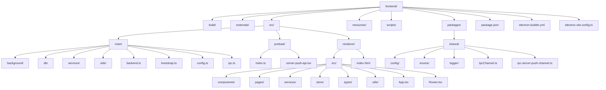
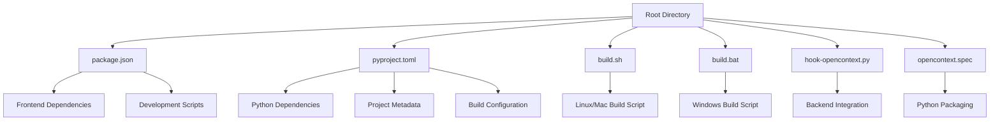

# Directory Structure

<cite>
**Referenced Files in This Document**   
- [config.yaml](file://config/config.yaml)
- [prompts_en.yaml](file://config/prompts_en.yaml)
- [prompts_zh.yaml](file://config/prompts_zh.yaml)
- [quick_start_default.md](file://config/quick_start_default.md)
- [example_document_processor.py](file://examples/example_document_processor.py)
- [example_screenshot_processor.py](file://examples/example_screenshot_processor.py)
- [example_screenshot_to_insights.py](file://examples/example_screenshot_to_insights.py)
- [example_todo_deduplication.py](file://examples/example_todo_deduplication.py)
- [example_weblink_processor.py](file://examples/example_weblink_processor.py)
- [regenerate_debug_file.py](file://examples/regenerate_debug_file.py)
- [verify_folder_monitor.py](file://examples/verify_folder_monitor.py)
- [main.ts](file://frontend/src/main/index.ts)
- [bootstrap.ts](file://frontend/src/main/bootstrap.ts)
- [ipc.ts](file://frontend/src/main/ipc.ts)
- [config.ts](file://frontend/src/main/config.ts)
- [index.ts](file://frontend/src/preload/index.ts)
- [server-push-api.tsx](file://frontend/src/preload/server-push-api.tsx)
- [App.tsx](file://frontend/src/renderer/src/App.tsx)
- [Router.tsx](file://frontend/src/renderer/src/Router.tsx)
- [main.css](file://frontend/src/renderer/src/assets/main.css)
- [index.html](file://frontend/src/renderer/index.html)
- [config_manager.py](file://opencontext/config/config_manager.py)
- [prompt_manager.py](file://opencontext/config/prompt_manager.py)
- [screenshot.py](file://opencontext/context_capture/screenshot.py)
- [folder_monitor.py](file://opencontext/context_capture/folder_monitor.py)
- [vault_document_monitor.py](file://opencontext/context_capture/vault_document_monitor.py)
- [web_link_capture.py](file://opencontext/context_capture/web_link_capture.py)
- [document_processor.py](file://opencontext/context_processing/processor/document_processor.py)
- [screenshot_processor.py](file://opencontext/context_processing/processor/screenshot_processor.py)
- [processor_factory.py](file://opencontext/context_processing/processor/processor_factory.py)
- [context_merger.py](file://opencontext/context_processing/merger/context_merger.py)
- [chunkers.py](file://opencontext/context_processing/chunker/chunkers.py)
- [api.py](file://opencontext/server/api.py)
- [routes](file://opencontext/server/routes)
- [component_initializer.py](file://opencontext/server/component_initializer.py)
- [opencontext.py](file://opencontext/server/opencontext.py)
- [electron.vite.config.ts](file://frontend/electron.vite.config.ts)
- [electron-builder.yml](file://frontend/electron-builder.yml)
- [build-python.js](file://frontend/build-python.js)
- [build-python.sh](file://frontend/build-python.sh)
- [package.json](file://package.json)
- [pyproject.toml](file://pyproject.toml)
- [README.md](file://README.md)
</cite>

## Table of Contents
1. [Introduction](#introduction)
2. [Top-Level Directory Overview](#top-level-directory-overview)
3. [config/ Directory](#config-directory)
4. [examples/ Directory](#examples-directory)
5. [frontend/ Directory](#frontend-directory)
6. [opencontext/ Directory](#opencontext-directory)
7. [src/ Directory](#src-directory)
8. [Root-Level Build and Configuration](#root-level-build-and-configuration)
9. [Separation of Concerns Between Frontend and Backend](#separation-of-concerns-between-frontend-and-backend)
10. [Conclusion](#conclusion)

## Introduction

The MineContext codebase is structured to support a modular, maintainable, and scalable architecture for a context-aware AI application. The directory structure reflects a clear separation of concerns between frontend and backend components, with well-defined responsibilities for configuration, examples, frontend application code, and backend Python services. This document provides a comprehensive breakdown of the top-level directories and their subdirectories, explaining the purpose and organization of each component within the codebase.

**Section sources**
- [README.md](file://README.md#L1-L525)

## Top-Level Directory Overview

The MineContext repository is organized into five primary top-level directories: `config/`, `examples/`, `frontend/`, `opencontext/`, and `src/`, along with root-level configuration and build files. This structure supports a clear separation between the Electron-based frontend application and the Python-based backend service, while providing dedicated spaces for configuration, examples, and documentation. The `frontend/` directory contains the complete Electron application with React components, while the `opencontext/` directory houses the Python backend with a modular architecture for context capture, processing, and consumption.

```mermaid
graph TD
A[MineContext Root] --> B[config/]
A --> C[examples/]
A --> D[frontend/]
A --> E[opencontext/]
A --> F[src/]
A --> G[Root Files]
B --> B1[config.yaml]
B --> B2[prompts_en.yaml]
B --> B3[prompts_zh.yaml]
B --> B4[quick_start_default.md]
C --> C1[example_document_processor.py]
C --> C2[example_screenshot_processor.py]
C --> C3[example_screenshot_to_insights.py]
C --> C4[example_todo_deduplication.py]
C --> C5[example_weblink_processor.py]
C --> C6[regenerate_debug_file.py]
C --> C7[verify_folder_monitor.py]
D --> D1[build/]
D --> D2[externals/]
D --> D3[packages/]
D --> D4[resources/]
D --> D5[scripts/]
D --> D6[src/]
D --> D7[package.json]
D --> D8[electron-builder.yml]
D --> D9[electron.vite.config.ts]
D6 --> D6a[main/]
D6 --> D6b[preload/]
D6 --> D6c[renderer/]
E --> E1[config/]
E --> E2[context_capture/]
E --> E3[context_processing/]
E --> E4[context_consumption/]
E --> E5[managers/]
E --> E6[models/]
E --> E7[monitoring/]
E --> E8[server/]
E --> E9[storage/]
E --> E10[tools/]
E --> E11[utils/]
E --> E12[web/]
F --> F1[architecture-overview.md]
F --> F2[architecture-overview-zh.md]
G --> G1[package.json]
G --> G2[pyproject.toml]
G --> G3[build.sh]
G --> G4[build.bat]
G --> G5[hook-opencontext.py]
```



**Diagram sources **
- [README.md](file://README.md#L1-L525)
- [project_structure](file://project_structure)

**Section sources**
- [README.md](file://README.md#L1-L525)
- [project_structure](file://project_structure)

## config/ Directory

The `config/` directory contains all configuration files for the MineContext application, including system settings, prompt templates, and default quick start documentation. The `config.yaml` file serves as the primary configuration file, defining settings for logging, context capture, processing, storage, and content generation. It uses environment variable placeholders (e.g., `${LLM_API_KEY}`) for sensitive information and supports path variables like `${CONTEXT_PATH}` for dynamic configuration. The directory also includes language-specific prompt templates in `prompts_en.yaml` and `prompts_zh.yaml`, which define the system prompts used by the AI for generating insights, summaries, and other content. These prompts are loaded by the `prompt_manager.py` in the backend and can be customized by users. The `quick_start_default.md` file provides default content for the application's quick start guide, offering users initial instructions and onboarding information.

**Section sources**
- [config.yaml](file://config/config.yaml#L1-L253)
- [prompts_en.yaml](file://config/prompts_en.yaml)
- [prompts_zh.yaml](file://config/prompts_zh.yaml)
- [quick_start_default.md](file://config/quick_start_default.md)

## examples/ Directory

The `examples/` directory contains sample Python scripts that demonstrate how to use various components of the MineContext backend. These examples serve as practical guides for developers and users who want to understand and extend the functionality of the application. The directory includes scripts like `example_screenshot_processor.py`, which shows how to extract content from screenshots using the `ScreenshotProcessor` without storing them in the database, and `example_document_processor.py`, which demonstrates processing documents with the `DocumentProcessor`. Other examples include `example_screenshot_to_insights.py` for generating insights from screenshots, `example_todo_deduplication.py` for deduplicating todos, and `example_weblink_processor.py` for processing web links. Utility scripts like `regenerate_debug_file.py` and `verify_folder_monitor.py` help with debugging and testing specific components. These examples are designed to be run independently and provide a clear API for interacting with the backend services.

**Section sources**
- [example_document_processor.py](file://examples/example_document_processor.py#L1-L181)
- [example_screenshot_processor.py](file://examples/example_screenshot_processor.py#L1-L181)
- [example_screenshot_to_insights.py](file://examples/example_screenshot_to_insights.py)
- [example_todo_deduplication.py](file://examples/example_todo_deduplication.py)
- [example_weblink_processor.py](file://examples/example_weblink_processor.py)
- [regenerate_debug_file.py](file://examples/regenerate_debug_file.py)
- [verify_folder_monitor.py](file://examples/verify_folder_monitor.py)

## frontend/ Directory

The `frontend/` directory contains the complete Electron-based desktop application, built with React, TypeScript, and Vite. It follows a standard Electron architecture with separate directories for the main process, preload scripts, and renderer process. The `src/main/` directory contains the Electron main process code responsible for window management, application lifecycle, and IPC communication. The `src/preload/` directory contains preload scripts that securely expose Node.js APIs to the renderer process, while the `src/renderer/` directory houses the React frontend interface with components, services, and state management. The directory also includes build and packaging configuration files like `electron-builder.yml` and `electron.vite.config.ts`, as well as external Python dependencies in the `externals/python/` subdirectory. Shared utilities and constants are located in `packages/shared/`, promoting code reuse across the application.



**Diagram sources **
- [README.md](file://README.md#L1-L525)
- [electron.vite.config.ts](file://frontend/electron.vite.config.ts#L1-L84)
- [electron-builder.yml](file://frontend/electron-builder.yml#L1-L72)

**Section sources**
- [main.ts](file://frontend/src/main/index.ts#L1-L348)
- [bootstrap.ts](file://frontend/src/main/bootstrap.ts)
- [ipc.ts](file://frontend/src/main/ipc.ts)
- [config.ts](file://frontend/src/main/config.ts)
- [index.ts](file://frontend/src/preload/index.ts#L1-L157)
- [server-push-api.tsx](file://frontend/src/preload/server-push-api.tsx)
- [App.tsx](file://frontend/src/renderer/src/App.tsx#L1-L138)
- [Router.tsx](file://frontend/src/renderer/src/Router.tsx)
- [main.css](file://frontend/src/renderer/src/assets/main.css)
- [index.html](file://frontend/src/renderer/index.html)

### frontend/src/main

The `frontend/src/main` directory contains the Electron main process code, responsible for managing the application window, handling lifecycle events, and establishing IPC communication with the renderer process. The `index.ts` file is the entry point, initializing the application, creating the main window, and setting up event listeners for window close and activation. The `bootstrap.ts` file handles early initialization tasks like setting up the application data directory, while `ipc.ts` defines the IPC channels for communication between the main and renderer processes. The `services/` subdirectory contains classes for managing various application services like the database, screenshot capture, and tray icon. The `background/` directory includes tasks that run in the background, such as screen monitoring and activity tracking, ensuring the application can collect context even when minimized.

**Section sources**
- [main.ts](file://frontend/src/main/index.ts#L1-L348)
- [bootstrap.ts](file://frontend/src/main/bootstrap.ts)
- [ipc.ts](file://frontend/src/main/ipc.ts)
- [config.ts](file://frontend/src/main/config.ts)

### frontend/src/preload

The `frontend/src/preload` directory contains the preload scripts that bridge the Electron main process and the renderer process. The `index.ts` file uses Electron's `contextBridge` to securely expose specific Node.js APIs and custom functions to the renderer process, while preventing direct access to potentially dangerous APIs. It exposes APIs for logging, notifications, database operations, screen monitoring, and file services, allowing the React frontend to interact with system resources in a controlled manner. The `server-push-api.tsx` file provides functionality for server-sent events, enabling real-time updates from the backend to the frontend. This design follows Electron's security best practices by running the renderer process with `contextIsolation` enabled, ensuring that the frontend code cannot directly access Node.js APIs.

**Section sources**
- [index.ts](file://frontend/src/preload/index.ts#L1-L157)
- [server-push-api.tsx](file://frontend/src/preload/server-push-api.tsx)

### frontend/src/renderer

The `frontend/src/renderer` directory contains the React-based user interface for the MineContext application. The `src/` subdirectory houses the React components, organized into `components/`, `pages/`, `services/`, `store/`, and `utils/`. The `components/` directory contains reusable UI components like buttons, modals, and data displays, while `pages/` contains the main application views such as the home page, settings, and screen monitor. The application uses Redux with Jotai for state management, with the `store/` directory containing the global state and reducers. The `services/` directory includes API clients for communicating with the backend, and `types/` defines TypeScript interfaces for data models. The `App.tsx` file is the root component, setting up the Redux provider and routing, while `index.html` is the HTML template loaded by the Electron window.

**Section sources**
- [App.tsx](file://frontend/src/renderer/src/App.tsx#L1-L138)
- [Router.tsx](file://frontend/src/renderer/src/Router.tsx)
- [main.css](file://frontend/src/renderer/src/assets/main.css)

## opencontext/ Directory

The `opencontext/` directory contains the Python-based backend service for MineContext, implemented as a modular and layered system for context management. The backend is built with FastAPI for the web server and API layer, providing RESTful endpoints and WebSocket support for real-time communication. The architecture is divided into several key components: `context_capture/` for acquiring context from various sources like screenshots and documents, `context_processing/` for processing and analyzing the captured context, `context_consumption/` for generating insights and content, and `storage/` for persisting data with support for multiple backends like SQLite and ChromaDB. The `managers/` directory contains business logic managers that coordinate the workflow between components, while `tools/` provides a system of tools for tasks like web search and profile management. The `server/` directory hosts the API routes and web interface, making the backend accessible to the frontend and external clients.

```mermaid
graph TD
A[opencontext/] --> B[config/]
A --> C[context_capture/]
A --> D[context_processing/]
A --> E[context_consumption/]
A --> F[managers/]
A --> G[models/]
A --> H[monitoring/]
A --> I[server/]
A --> J[storage/]
A --> K[tools/]
A --> L[utils/]
A --> M[web/]
B --> B1[config_manager.py]
B --> B2[prompt_manager.py]
C --> C1[screenshot.py]
C --> C2[folder_monitor.py]
C --> C3[vault_document_monitor.py]
C --> C4[web_link_capture.py]
D --> D1[processor/]
D --> D2[chunker/]
D --> D3[merger/]
D1 --> D1a[document_processor.py]
D1 --> D1b[screenshot_processor.py]
D1 --> D1c[processor_factory.py]
D2 --> D2a[chunkers.py]
D3 --> D3a[context_merger.py]
E --> E1[completion/]
E --> E2[context_agent/]
E --> E3[generation/]
I --> I1[api.py]
I --> I2[routes/]
I --> I3[component_initializer.py]
I --> I4[opencontext.py]
J --> J1[backends/]
J --> J2[base_storage.py]
J --> J3[global_storage.py]
J --> J4[unified_storage.py]
K --> K1[retrieval_tools/]
K --> K2[operation_tools/]
K --> K3[profile_tools/]
K --> K4[tools_executor.py]
M --> M1[static/]
M --> M2[templates/]
```



**Diagram sources **
- [README.md](file://README.md#L1-L525)
- [api.py](file://opencontext/server/api.py#L1-L58)
- [config_manager.py](file://opencontext/config/config_manager.py)
- [prompt_manager.py](file://opencontext/config/prompt_manager.py)

**Section sources**
- [config_manager.py](file://opencontext/config/config_manager.py)
- [prompt_manager.py](file://opencontext/config/prompt_manager.py)
- [screenshot.py](file://opencontext/context_capture/screenshot.py)
- [folder_monitor.py](file://opencontext/context_capture/folder_monitor.py)
- [vault_document_monitor.py](file://opencontext/context_capture/vault_document_monitor.py)
- [web_link_capture.py](file://opencontext/context_capture/web_link_capture.py)
- [document_processor.py](file://opencontext/context_processing/processor/document_processor.py)
- [screenshot_processor.py](file://opencontext/context_processing/processor/screenshot_processor.py)
- [processor_factory.py](file://opencontext/context_processing/processor/processor_factory.py)
- [context_merger.py](file://opencontext/context_processing/merger/context_merger.py)
- [chunkers.py](file://opencontext/context_processing/chunker/chunkers.py)
- [api.py](file://opencontext/server/api.py#L1-L58)
- [routes](file://opencontext/server/routes)
- [component_initializer.py](file://opencontext/server/component_initializer.py)
- [opencontext.py](file://opencontext/server/opencontext.py)

### context_capture Module

The `context_capture` module in the `opencontext/` directory is responsible for acquiring context from various sources in the user's digital environment. It includes components for capturing screenshots, monitoring folders for document changes, tracking vault documents, and capturing web links. The `screenshot.py` file implements the screenshot capture functionality, taking periodic screenshots of the user's screen and storing them in the designated directory. The `folder_monitor.py` file monitors specified directories for file changes, enabling the system to process new or modified documents. The `vault_document_monitor.py` tracks changes to documents in the user's vault, while `web_link_capture.py` captures web links for processing. These capture sources are managed by the `CaptureManager` in the `managers/` directory, which coordinates the acquisition of context from multiple sources simultaneously.

**Section sources**
- [screenshot.py](file://opencontext/context_capture/screenshot.py)
- [folder_monitor.py](file://opencontext/context_capture/folder_monitor.py)
- [vault_document_monitor.py](file://opencontext/context_capture/vault_document_monitor.py)
- [web_link_capture.py](file://opencontext/context_capture/web_link_capture.py)

### context_processing Module

The `context_processing` module handles the processing and analysis of captured context, transforming raw data into structured information. It consists of three main subcomponents: `processor/`, `chunker/`, and `merger/`. The `processor/` directory contains processors for different types of content, such as `document_processor.py` for processing documents and `screenshot_processor.py` for analyzing screenshots using vision-language models. The `processor_factory.py` creates the appropriate processor based on the content type. The `chunker/` directory implements strategies for breaking down large documents into smaller chunks for efficient processing, with `document_text_chunker.py` handling text-based documents. The `merger/` directory contains the `context_merger.py`, which combines similar contexts to reduce redundancy and create a coherent narrative from the user's activities. This module ensures that the captured context is transformed into a format suitable for storage and consumption.

**Section sources**
- [document_processor.py](file://opencontext/context_processing/processor/document_processor.py)
- [screenshot_processor.py](file://opencontext/context_processing/processor/screenshot_processor.py)
- [processor_factory.py](file://opencontext/context_processing/processor/processor_factory.py)
- [context_merger.py](file://opencontext/context_processing/merger/context_merger.py)
- [chunkers.py](file://opencontext/context_processing/chunker/chunkers.py)

### server Module

The `server` module provides the web server and API layer for the MineContext backend, built with FastAPI. The `api.py` file defines the main router, which includes all API routes from the `routes/` directory, such as health checks, context management, content generation, and debugging endpoints. The `component_initializer.py` sets up and initializes all backend components when the server starts, ensuring that managers, processors, and storage systems are properly configured. The `opencontext.py` file contains the main application class that ties all components together and provides the entry point for starting the server. The `routes/` directory contains individual route modules for different functionalities, allowing for a modular and maintainable API structure. This module also serves the web interface located in the `web/templates/` directory, providing a web-based UI for debugging and monitoring the backend.

**Section sources**
- [api.py](file://opencontext/server/api.py#L1-L58)
- [routes](file://opencontext/server/routes)
- [component_initializer.py](file://opencontext/server/component_initializer.py)
- [opencontext.py](file://opencontext/server/opencontext.py)

## src/ Directory

The `src/` directory contains documentation files for the MineContext application, specifically architecture overviews in both English and Chinese. The `architecture-overview.md` file provides a high-level description of the system architecture, explaining the relationship between the frontend and backend components, while `architecture-overview-zh.md` offers the same content in Chinese for international users. These files serve as reference documentation for developers and users who want to understand the overall design and functionality of the application. Unlike the `frontend/src/` and `opencontext/` directories, which contain executable code, this `src/` directory is dedicated to static documentation and does not include any source code for the application's functionality.

**Section sources**
- [architecture-overview.md](file://src/architecture-overview.md)
- [architecture-overview-zh.md](file://src/architecture-overview-zh.md)

## Root-Level Build and Configuration

The root directory of the MineContext repository contains build scripts and configuration files that orchestrate the development and packaging of the application. The `package.json` file defines dependencies and scripts for the frontend, while `pyproject.toml` specifies the Python dependencies and project metadata for the backend. Build scripts like `build.sh` and `build.bat` automate the process of building the application for different platforms, ensuring consistency across development environments. The `hook-opencontext.py` script is used to integrate the Python backend with the Electron application, while `opencontext.spec` is a PyInstaller configuration file for packaging the Python code into a standalone executable. These root-level files provide the infrastructure needed to develop, test, and distribute the application, bridging the gap between the frontend and backend components.



**Diagram sources **
- [package.json](file://package.json#L1-L6)
- [pyproject.toml](file://pyproject.toml#L1-L99)
- [build.sh](file://build.sh)
- [build.bat](file://build.bat)
- [hook-opencontext.py](file://hook-opencontext.py)
- [opencontext.spec](file://opencontext.spec)

**Section sources**
- [package.json](file://package.json#L1-L6)
- [pyproject.toml](file://pyproject.toml#L1-L99)
- [build.sh](file://build.sh)
- [build.bat](file://build.bat)
- [hook-opencontext.py](file://hook-opencontext.py)
- [opencontext.spec](file://opencontext.spec)

## Separation of Concerns Between Frontend and Backend

The MineContext codebase exemplifies a clear separation of concerns between frontend and backend components, with each part of the application focused on its specific responsibilities. The frontend, located in the `frontend/` directory, is responsible for the user interface and user experience, built with Electron, React, and TypeScript. It handles window management, user interactions, and rendering of the application interface, while communicating with the backend through IPC and HTTP APIs. The backend, in the `opencontext/` directory, manages the core business logic, including context capture, processing, storage, and content generation, implemented in Python with FastAPI. This separation allows the frontend to focus on presentation and user interaction, while the backend handles data processing and AI operations. The two components are connected through well-defined interfaces, such as the IPC channels in `IpcChannel.ts` and the RESTful API in the `server/` directory, ensuring loose coupling and independent development.

```mermaid
graph LR
A[Frontend] < --> B[Backend]
A --> A1[Electron Main Process]
A --> A2[React Renderer]
A --> A3[Preload Scripts]
A --> A4[User Interface]
B --> B1[FastAPI Server]
B --> B2[Context Capture]
B --> B3[Context Processing]
B --> B4[Storage]
B --> B5[Content Generation]
A1 < --> |IPC| B1
A2 < --> |HTTP API| B1
A3 < --> |Secure Bridge| A1
```

**Diagram sources **
- [README.md](file://README.md#L1-L525)
- [IpcChannel.ts](file://frontend/packages/shared/IpcChannel.ts)
- [api.py](file://opencontext/server/api.py#L1-L58)

**Section sources**
- [README.md](file://README.md#L1-L525)
- [IpcChannel.ts](file://frontend/packages/shared/IpcChannel.ts)
- [api.py](file://opencontext/server/api.py#L1-L58)

## Conclusion

The MineContext codebase is organized into a well-structured directory hierarchy that supports a modular and maintainable architecture for a context-aware AI application. The top-level directories—`config/`, `examples/`, `frontend/`, `opencontext/`, and `src/`—each serve distinct purposes, from configuration and examples to frontend and backend implementation. The frontend follows a standard Electron architecture with clear separation between the main process, preload scripts, and renderer process, while the backend employs a layered design with components for context capture, processing, and consumption. This separation of concerns enables independent development and testing of frontend and backend components, while well-defined interfaces ensure seamless integration. The build and configuration files at the root level provide the infrastructure needed to develop, package, and distribute the application across platforms.