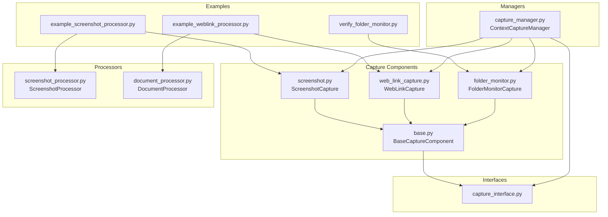
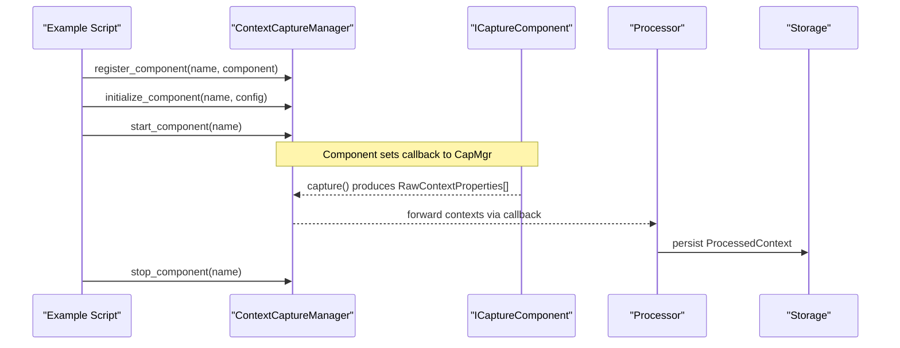
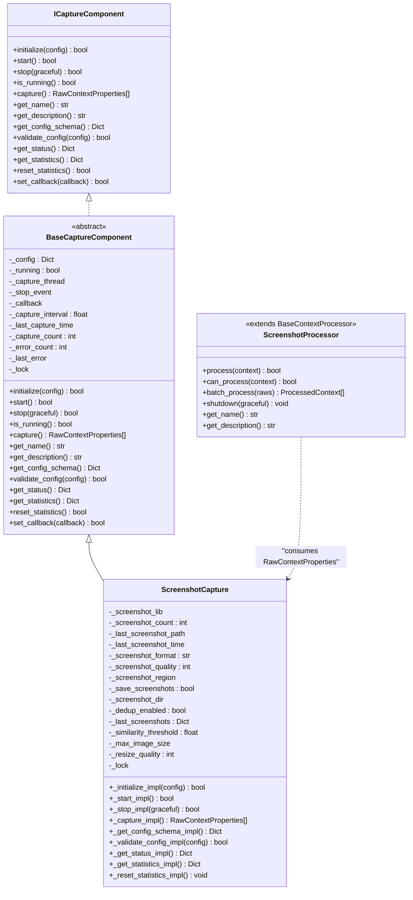
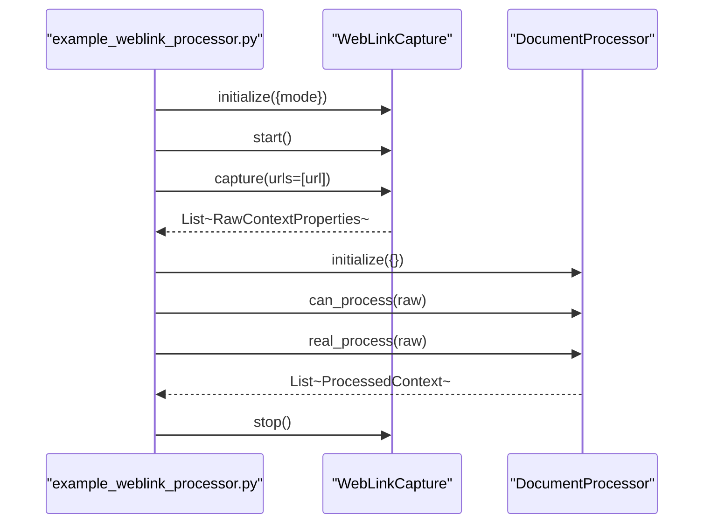
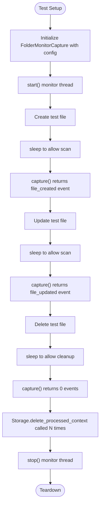
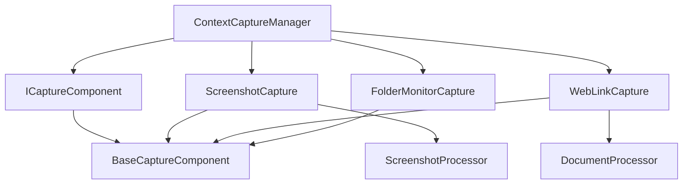

# Capture Processor Examples

<cite>
**Referenced Files in This Document**
- [example_screenshot_processor.py](file://examples/example_screenshot_processor.py)
- [example_weblink_processor.py](file://examples/example_weblink_processor.py)
- [verify_folder_monitor.py](file://examples/verify_folder_monitor.py)
- [capture_interface.py](file://opencontext/interfaces/capture_interface.py)
- [base.py](file://opencontext/context_capture/base.py)
- [screenshot.py](file://opencontext/context_capture/screenshot.py)
- [web_link_capture.py](file://opencontext/context_capture/web_link_capture.py)
- [folder_monitor.py](file://opencontext/context_capture/folder_monitor.py)
- [screenshot_processor.py](file://opencontext/context_processing/processor/screenshot_processor.py)
- [document_processor.py](file://opencontext/context_processing/processor/document_processor.py)
- [capture_manager.py](file://opencontext/managers/capture_manager.py)
</cite>

## Table of Contents
1. [Introduction](#introduction)
2. [Project Structure](#project-structure)
3. [Core Components](#core-components)
4. [Architecture Overview](#architecture-overview)
5. [Detailed Component Analysis](#detailed-component-analysis)
6. [Dependency Analysis](#dependency-analysis)
7. [Performance Considerations](#performance-considerations)
8. [Troubleshooting Guide](#troubleshooting-guide)
9. [Conclusion](#conclusion)
10. [Appendices](#appendices)

## Introduction
This document explains how to implement custom context capture components in MineContext using the ICaptureComponent interface. It focuses on three examples:
- A practical implementation of the ICaptureComponent interface for screen monitoring using ScreenshotCapture and ScreenshotProcessor.
- A template for capturing and processing web-based context using WebLinkCapture and DocumentProcessor.
- A testing pattern for folder monitoring using FolderMonitorCapture and verification via verify_folder_monitor.py.

It also demonstrates how these examples illustrate the plugin architecture and how to extend the system to support new capture sources such as application windows, clipboard content, or system events.

## Project Structure
The examples and core components are organized as follows:
- examples: Example scripts demonstrating capture and processing workflows.
- opencontext/context_capture: Concrete capture components implementing ICaptureComponent.
- opencontext/context_processing/processor: Processors that consume RawContextProperties produced by capture components.
- opencontext/interfaces: Interfaces defining the contract for capture and processing components.
- opencontext/managers: Managers coordinating capture components and routing captured data.

**Diagram sources**
- [example_screenshot_processor.py](file://examples/example_screenshot_processor.py#L1-L181)
- [example_weblink_processor.py](file://examples/example_weblink_processor.py#L1-L95)
- [verify_folder_monitor.py](file://examples/verify_folder_monitor.py#L1-L160)
- [capture_interface.py](file://opencontext/interfaces/capture_interface.py#L1-L153)
- [base.py](file://opencontext/context_capture/base.py#L1-L515)
- [screenshot.py](file://opencontext/context_capture/screenshot.py#L1-L508)
- [web_link_capture.py](file://opencontext/context_capture/web_link_capture.py#L1-L351)
- [folder_monitor.py](file://opencontext/context_capture/folder_monitor.py#L1-L472)
- [screenshot_processor.py](file://opencontext/context_processing/processor/screenshot_processor.py#L1-L590)
- [document_processor.py](file://opencontext/context_processing/processor/document_processor.py#L1-L653)
- [capture_manager.py](file://opencontext/managers/capture_manager.py#L1-L391)

**Section sources**
- [example_screenshot_processor.py](file://examples/example_screenshot_processor.py#L1-L181)
- [example_weblink_processor.py](file://examples/example_weblink_processor.py#L1-L95)
- [verify_folder_monitor.py](file://examples/verify_folder_monitor.py#L1-L160)
- [capture_interface.py](file://opencontext/interfaces/capture_interface.py#L1-L153)
- [base.py](file://opencontext/context_capture/base.py#L1-L515)
- [screenshot.py](file://opencontext/context_capture/screenshot.py#L1-L508)
- [web_link_capture.py](file://opencontext/context_capture/web_link_capture.py#L1-L351)
- [folder_monitor.py](file://opencontext/context_capture/folder_monitor.py#L1-L472)
- [screenshot_processor.py](file://opencontext/context_processing/processor/screenshot_processor.py#L1-L590)
- [document_processor.py](file://opencontext/context_processing/processor/document_processor.py#L1-L653)
- [capture_manager.py](file://opencontext/managers/capture_manager.py#L1-L391)

## Core Components
- ICaptureComponent: Defines the lifecycle and contract for capture components, including initialize, start, stop, capture, and configuration/schema validation.
- BaseCaptureComponent: Implements shared lifecycle logic, thread management, statistics, and callbacks, leaving concrete capture logic to subclasses.
- ScreenshotCapture: Periodic screen capture with configuration for format, quality, region, saving, deduplication, and statistics.
- WebLinkCapture: URL capture that renders to Markdown or PDF, with configuration for output directory, mode, timeouts, and concurrency.
- FolderMonitorCapture: Watches local folders for file changes, generates RawContextProperties, and cleans up processed contexts upon deletion.
- ScreenshotProcessor: Processes screenshots asynchronously, performs deduplication, extracts context via Vision LLM, merges results, and persists outcomes.
- DocumentProcessor: Processes structured/text/visual documents, chunking and vectorizing content for downstream use.
- ContextCaptureManager: Registers, initializes, starts/stops, and orchestrates capture components, forwarding captured data via callbacks.

**Section sources**
- [capture_interface.py](file://opencontext/interfaces/capture_interface.py#L1-L153)
- [base.py](file://opencontext/context_capture/base.py#L1-L515)
- [screenshot.py](file://opencontext/context_capture/screenshot.py#L1-L508)
- [web_link_capture.py](file://opencontext/context_capture/web_link_capture.py#L1-L351)
- [folder_monitor.py](file://opencontext/context_capture/folder_monitor.py#L1-L472)
- [screenshot_processor.py](file://opencontext/context_processing/processor/screenshot_processor.py#L1-L590)
- [document_processor.py](file://opencontext/context_processing/processor/document_processor.py#L1-L653)
- [capture_manager.py](file://opencontext/managers/capture_manager.py#L1-L391)

## Architecture Overview
The capture and processing pipeline integrates components loosely:
- Capture components implement ICaptureComponent and produce RawContextProperties.
- ContextCaptureManager registers components, sets callbacks, and routes captured data.
- Processors consume RawContextProperties and produce ProcessedContext for storage and retrieval.

**Diagram sources**
- [capture_manager.py](file://opencontext/managers/capture_manager.py#L1-L391)
- [capture_interface.py](file://opencontext/interfaces/capture_interface.py#L1-L153)
- [screenshot_processor.py](file://opencontext/context_processing/processor/screenshot_processor.py#L1-L590)
- [document_processor.py](file://opencontext/context_processing/processor/document_processor.py#L1-L653)

## Detailed Component Analysis

### Screenshot Capture and Processing
This example demonstrates implementing a screen monitoring capture component and processing the captured screenshots.

- Lifecycle and configuration:
  - ScreenshotCapture inherits BaseCaptureComponent and implements _initialize_impl, _start_impl, _stop_impl, and _capture_impl.
  - Configuration includes capture_interval, screenshot_format, screenshot_quality, screenshot_region, storage_path, dedup_enabled, similarity_threshold, and more.
  - Validation ensures numeric intervals, supported formats, quality bounds, region geometry, and directory paths.

- Event handling and deduplication:
  - On capture, screenshots are taken and converted to RawContextProperties with metadata.
  - Deduplication compares perceptual hashes; duplicates can be deleted if enabled.

- Integration with processors:
  - ScreenshotProcessor consumes RawContextProperties, performs asynchronous VLM extraction, merges results, and persists outcomes.
  - The example script constructs RawContextProperties and calls batch_process to extract insights without storing in the database.

**Diagram sources**
- [capture_interface.py](file://opencontext/interfaces/capture_interface.py#L1-L153)
- [base.py](file://opencontext/context_capture/base.py#L1-L515)
- [screenshot.py](file://opencontext/context_capture/screenshot.py#L1-L508)
- [screenshot_processor.py](file://opencontext/context_processing/processor/screenshot_processor.py#L1-L590)

Key implementation references:
- ScreenshotCapture lifecycle and configuration: [screenshot.py](file://opencontext/context_capture/screenshot.py#L60-L127), [screenshot.py](file://opencontext/context_capture/screenshot.py#L128-L175), [screenshot.py](file://opencontext/context_capture/screenshot.py#L217-L245), [screenshot.py](file://opencontext/context_capture/screenshot.py#L300-L354), [screenshot.py](file://opencontext/context_capture/screenshot.py#L355-L454), [screenshot.py](file://opencontext/context_capture/screenshot.py#L455-L508)
- BaseCaptureComponent lifecycle and callback: [base.py](file://opencontext/context_capture/base.py#L57-L93), [base.py](file://opencontext/context_capture/base.py#L94-L165), [base.py](file://opencontext/context_capture/base.py#L130-L165), [base.py](file://opencontext/context_capture/base.py#L176-L220), [base.py](file://opencontext/context_capture/base.py#L388-L407), [base.py](file://opencontext/context_capture/base.py#L408-L430)
- ScreenshotProcessor processing and merging: [screenshot_processor.py](file://opencontext/context_processing/processor/screenshot_processor.py#L149-L171), [screenshot_processor.py](file://opencontext/context_processing/processor/screenshot_processor.py#L172-L235), [screenshot_processor.py](file://opencontext/context_processing/processor/screenshot_processor.py#L498-L532)
- Example usage and batch processing: [example_screenshot_processor.py](file://examples/example_screenshot_processor.py#L105-L148)

**Section sources**
- [screenshot.py](file://opencontext/context_capture/screenshot.py#L1-L508)
- [base.py](file://opencontext/context_capture/base.py#L1-L515)
- [screenshot_processor.py](file://opencontext/context_processing/processor/screenshot_processor.py#L1-L590)
- [example_screenshot_processor.py](file://examples/example_screenshot_processor.py#L1-L181)

### Web Link Capture Template
This example demonstrates capturing and processing web-based context, including URL monitoring and metadata extraction.

- Component lifecycle:
  - WebLinkCapture inherits BaseCaptureComponent and implements _initialize_impl, _start_impl, _stop_impl, and overrides capture to accept a list of URLs.
  - Configuration includes output_dir, mode (pdf/markdown), max_workers, timeout, wait_until, and PDF options.

- URL capture and rendering:
  - For mode markdown, converts URLs to Markdown using AsyncWebCrawler.
  - For mode pdf, renders pages to PDF using Playwright.
  - Produces RawContextProperties with content_path and additional_info including URL and file path.

- Processor integration:
  - DocumentProcessor can handle the resulting contexts, chunking and vectorizing content for downstream use.

**Diagram sources**
- [web_link_capture.py](file://opencontext/context_capture/web_link_capture.py#L1-L351)
- [document_processor.py](file://opencontext/context_processing/processor/document_processor.py#L1-L653)
- [example_weblink_processor.py](file://examples/example_weblink_processor.py#L1-L95)

Key implementation references:
- WebLinkCapture lifecycle and capture override: [web_link_capture.py](file://opencontext/context_capture/web_link_capture.py#L160-L190), [web_link_capture.py](file://opencontext/context_capture/web_link_capture.py#L191-L252)
- Markdown/PDF conversion and context creation: [web_link_capture.py](file://opencontext/context_capture/web_link_capture.py#L62-L116), [web_link_capture.py](file://opencontext/context_capture/web_link_capture.py#L117-L159), [web_link_capture.py](file://opencontext/context_capture/web_link_capture.py#L201-L252)
- DocumentProcessor capabilities and processing: [document_processor.py](file://opencontext/context_processing/processor/document_processor.py#L105-L132), [document_processor.py](file://opencontext/context_processing/processor/document_processor.py#L172-L185), [document_processor.py](file://opencontext/context_processing/processor/document_processor.py#L223-L246)
- Example usage: [example_weblink_processor.py](file://examples/example_weblink_processor.py#L15-L74)

**Section sources**
- [web_link_capture.py](file://opencontext/context_capture/web_link_capture.py#L1-L351)
- [document_processor.py](file://opencontext/context_processing/processor/document_processor.py#L1-L653)
- [example_weblink_processor.py](file://examples/example_weblink_processor.py#L1-L95)

### Folder Monitoring Verification Pattern
This example illustrates testing patterns for folder monitoring functionality and validating capture component behavior.

- Component lifecycle:
  - FolderMonitorCapture inherits BaseCaptureComponent and implements _initialize_impl, _start_impl, _stop_impl, and _capture_impl.
  - Configuration includes monitor_interval, watch_folder_paths, recursive, max_file_size, and initial_scan.

- Event generation and cleanup:
  - Scans for new/updated/deleted files, generates events, and creates RawContextProperties for supported formats.
  - On deletion, cleans up processed contexts by querying storage and deleting associated records.

- Testing verification:
  - Uses unittest.mock to patch get_storage and verify capture results and storage cleanup behavior.
  - Exercises file creation, update, and deletion scenarios and validates event types and counts.

**Diagram sources**
- [folder_monitor.py](file://opencontext/context_capture/folder_monitor.py#L1-L472)
- [verify_folder_monitor.py](file://examples/verify_folder_monitor.py#L1-L160)

Key implementation references:
- FolderMonitorCapture lifecycle and capture: [folder_monitor.py](file://opencontext/context_capture/folder_monitor.py#L59-L115), [folder_monitor.py](file://opencontext/context_capture/folder_monitor.py#L116-L136), [folder_monitor.py](file://opencontext/context_capture/folder_monitor.py#L137-L146)
- Event generation and context creation: [folder_monitor.py](file://opencontext/context_capture/folder_monitor.py#L165-L189), [folder_monitor.py](file://opencontext/context_capture/folder_monitor.py#L233-L244), [folder_monitor.py](file://opencontext/context_capture/folder_monitor.py#L289-L326)
- Cleanup and storage integration: [folder_monitor.py](file://opencontext/context_capture/folder_monitor.py#L245-L288)
- Verification pattern: [verify_folder_monitor.py](file://examples/verify_folder_monitor.py#L31-L147)

**Section sources**
- [folder_monitor.py](file://opencontext/context_capture/folder_monitor.py#L1-L472)
- [verify_folder_monitor.py](file://examples/verify_folder_monitor.py#L1-L160)

## Dependency Analysis
The capture components depend on BaseCaptureComponent for lifecycle and statistics, and on the ICaptureComponent interface for the contract. Processors depend on models and LLM clients to transform RawContextProperties into ProcessedContext.

**Diagram sources**
- [capture_interface.py](file://opencontext/interfaces/capture_interface.py#L1-L153)
- [base.py](file://opencontext/context_capture/base.py#L1-L515)
- [screenshot.py](file://opencontext/context_capture/screenshot.py#L1-L508)
- [web_link_capture.py](file://opencontext/context_capture/web_link_capture.py#L1-L351)
- [folder_monitor.py](file://opencontext/context_capture/folder_monitor.py#L1-L472)
- [screenshot_processor.py](file://opencontext/context_processing/processor/screenshot_processor.py#L1-L590)
- [document_processor.py](file://opencontext/context_processing/processor/document_processor.py#L1-L653)
- [capture_manager.py](file://opencontext/managers/capture_manager.py#L1-L391)

**Section sources**
- [capture_interface.py](file://opencontext/interfaces/capture_interface.py#L1-L153)
- [base.py](file://opencontext/context_capture/base.py#L1-L515)
- [screenshot.py](file://opencontext/context_capture/screenshot.py#L1-L508)
- [web_link_capture.py](file://opencontext/context_capture/web_link_capture.py#L1-L351)
- [folder_monitor.py](file://opencontext/context_capture/folder_monitor.py#L1-L472)
- [screenshot_processor.py](file://opencontext/context_processing/processor/screenshot_processor.py#L1-L590)
- [document_processor.py](file://opencontext/context_processing/processor/document_processor.py#L1-L653)
- [capture_manager.py](file://opencontext/managers/capture_manager.py#L1-L391)

## Performance Considerations
- Concurrency and batching:
  - WebLinkCapture uses ThreadPoolExecutor to parallelize conversions, configurable via max_workers.
  - ScreenshotProcessor uses an input queue and background thread with batch sizes and timeouts to balance throughput and latency.
- Deduplication:
  - ScreenshotCapture computes perceptual hashes and maintains a sliding window to skip near-duplicates, reducing redundant processing.
- I/O and storage:
  - FolderMonitorCapture limits file sizes and caches file metadata to minimize overhead.
  - WebLinkCapture writes rendered files to disk; ensure appropriate output_dir permissions and disk space.
- Logging and monitoring:
  - Components record statistics and errors; use these to tune capture intervals and detect anomalies.

[No sources needed since this section provides general guidance]

## Troubleshooting Guide
Common issues and resolutions:
- Import failures:
  - WebLinkCapture requires crawl4ai for Markdown and Playwright for PDF; ensure dependencies are installed.
- Invalid configuration:
  - BaseCaptureComponent and concrete components validate config types and ranges; check logs for validation errors.
- Capture thread not stopping:
  - BaseCaptureComponent’s stop waits for capture thread; ensure graceful=True and that capture loops handle stop events.
- Storage cleanup not triggered:
  - FolderMonitorCapture relies on get_storage; verify that patched storage returns expected context data and that delete_processed_context is called.

**Section sources**
- [web_link_capture.py](file://opencontext/context_capture/web_link_capture.py#L71-L116)
- [web_link_capture.py](file://opencontext/context_capture/web_link_capture.py#L127-L159)
- [base.py](file://opencontext/context_capture/base.py#L130-L165)
- [folder_monitor.py](file://opencontext/context_capture/folder_monitor.py#L245-L288)
- [verify_folder_monitor.py](file://examples/verify_folder_monitor.py#L100-L136)

## Conclusion
These examples demonstrate how to implement custom capture components using the ICaptureComponent interface and BaseCaptureComponent, and how to integrate them with processors and the ContextCaptureManager. They provide reusable patterns for screen monitoring, web link capture, and folder monitoring, along with testing strategies. The plugin architecture allows extending MineContext to support new capture sources such as application windows, clipboard content, or system events by implementing ICaptureComponent and registering components with the manager.

[No sources needed since this section summarizes without analyzing specific files]

## Appendices

### Extending to New Capture Sources
To add a new capture source (e.g., application windows, clipboard content, system events):
- Implement a new class inheriting BaseCaptureComponent and overriding _initialize_impl, _start_impl, _stop_impl, and _capture_impl.
- Define a configuration schema via _get_config_schema_impl and validation via _validate_config_impl.
- Optionally override capture() to accept specialized inputs (e.g., window identifiers, clipboard filters).
- Register the component with ContextCaptureManager and set a callback to route captured data to processors.

**Section sources**
- [base.py](file://opencontext/context_capture/base.py#L431-L515)
- [capture_manager.py](file://opencontext/managers/capture_manager.py#L51-L75)
- [capture_manager.py](file://opencontext/managers/capture_manager.py#L100-L134)
- [capture_manager.py](file://opencontext/managers/capture_manager.py#L135-L172)