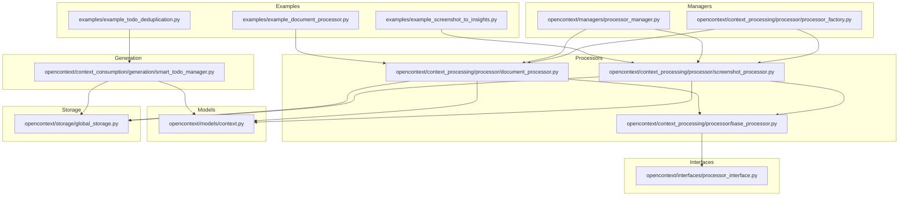
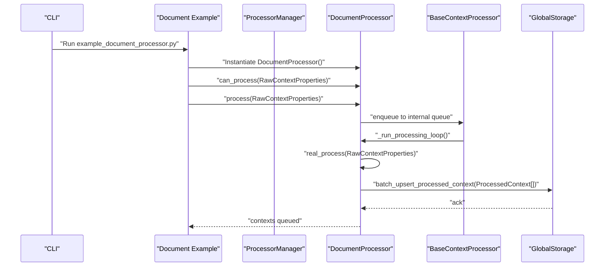
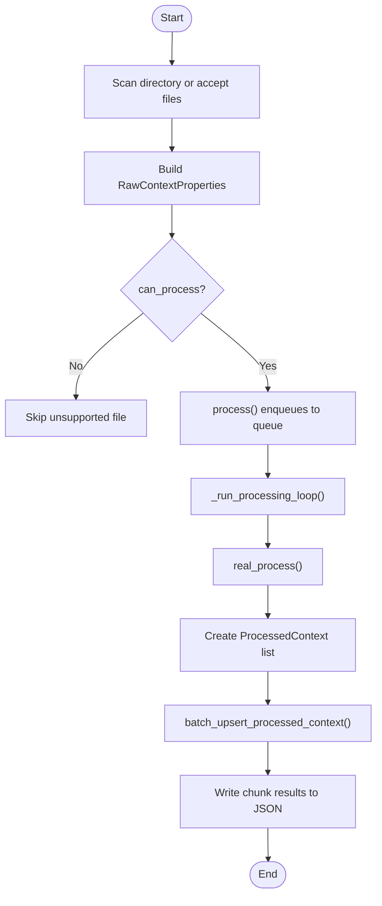
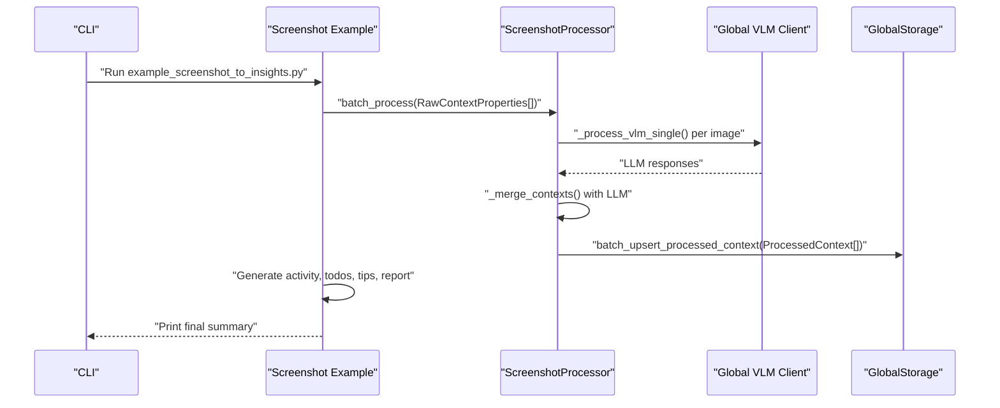
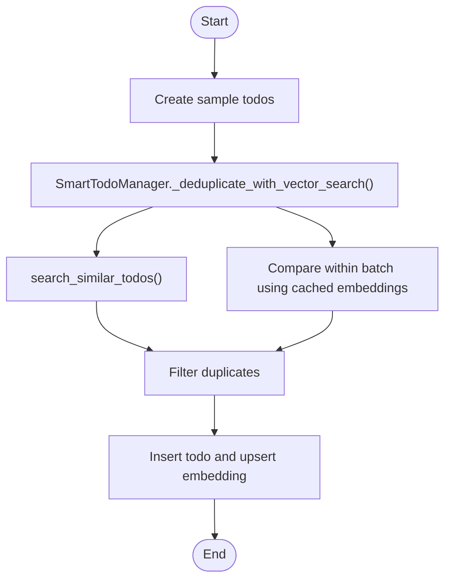
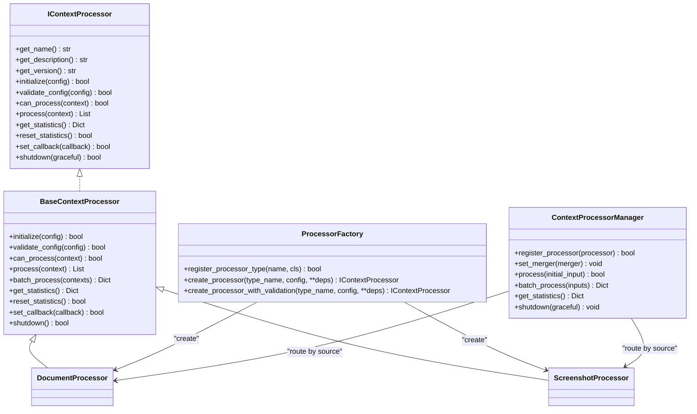
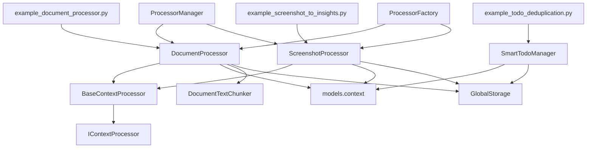

# Data Processing Examples

<cite>
**Referenced Files in This Document**
- [example_document_processor.py](file://examples/example_document_processor.py)
- [example_screenshot_to_insights.py](file://examples/example_screenshot_to_insights.py)
- [example_todo_deduplication.py](file://examples/example_todo_deduplication.py)
- [processor_interface.py](file://opencontext/interfaces/processor_interface.py)
- [base_processor.py](file://opencontext/context_processing/processor/base_processor.py)
- [document_processor.py](file://opencontext/context_processing/processor/document_processor.py)
- [screenshot_processor.py](file://opencontext/context_processing/processor/screenshot_processor.py)
- [smart_todo_manager.py](file://opencontext/context_consumption/generation/smart_todo_manager.py)
- [processor_manager.py](file://opencontext/managers/processor_manager.py)
- [processor_factory.py](file://opencontext/context_processing/processor/processor_factory.py)
- [document_text_chunker.py](file://opencontext/context_processing/chunker/document_text_chunker.py)
- [context.py](file://opencontext/models/context.py)
- [global_storage.py](file://opencontext/storage/global_storage.py)
</cite>

## Table of Contents
1. [Introduction](#introduction)
2. [Project Structure](#project-structure)
3. [Core Components](#core-components)
4. [Architecture Overview](#architecture-overview)
5. [Detailed Component Analysis](#detailed-component-analysis)
6. [Dependency Analysis](#dependency-analysis)
7. [Performance Considerations](#performance-considerations)
8. [Troubleshooting Guide](#troubleshooting-guide)
9. [Conclusion](#conclusion)
10. [Appendices](#appendices)

## Introduction
This document explains the data processing examples that illustrate MineContext’s context processing pipeline. It focuses on:
- Transforming raw document data into structured context with metadata extraction and content analysis (example_document_processor.py).
- Demonstrating data refinement logic for duplicate detection, task merging strategies, and state management (example_todo_deduplication.py).
- Showing end-to-end processing from raw screenshots to AI-generated insights, including image analysis, context enrichment, and storage patterns (example_screenshot_to_insights.py).
It also covers processor registration, execution flow, and integration with the processing pipeline, highlighting extensibility points for custom processing logic.

## Project Structure
The examples reside under the examples directory and integrate with the core processing framework located under opencontext. The key relationships:
- Examples import and instantiate processors from opencontext/context_processing/processor.
- Processors implement the IContextProcessor interface and inherit from BaseContextProcessor.
- Managers coordinate processors and route inputs by source type.
- Models define the data structures for raw and processed contexts.
- Storage provides a global access point for persistence.

**Diagram sources**
- [example_document_processor.py](file://examples/example_document_processor.py#L1-L237)
- [example_screenshot_to_insights.py](file://examples/example_screenshot_to_insights.py#L1-L676)
- [example_todo_deduplication.py](file://examples/example_todo_deduplication.py#L1-L251)
- [processor_interface.py](file://opencontext/interfaces/processor_interface.py#L1-L136)
- [base_processor.py](file://opencontext/context_processing/processor/base_processor.py#L1-L261)
- [document_processor.py](file://opencontext/context_processing/processor/document_processor.py#L1-L653)
- [screenshot_processor.py](file://opencontext/context_processing/processor/screenshot_processor.py#L1-L590)
- [processor_manager.py](file://opencontext/managers/processor_manager.py#L1-L213)
- [processor_factory.py](file://opencontext/context_processing/processor/processor_factory.py#L1-L175)
- [context.py](file://opencontext/models/context.py#L1-L343)
- [global_storage.py](file://opencontext/storage/global_storage.py#L1-L196)
- [smart_todo_manager.py](file://opencontext/context_consumption/generation/smart_todo_manager.py#L1-L505)

**Section sources**
- [example_document_processor.py](file://examples/example_document_processor.py#L1-L237)
- [example_screenshot_to_insights.py](file://examples/example_screenshot_to_insights.py#L1-L676)
- [example_todo_deduplication.py](file://examples/example_todo_deduplication.py#L1-L251)
- [processor_interface.py](file://opencontext/interfaces/processor_interface.py#L1-L136)
- [base_processor.py](file://opencontext/context_processing/processor/base_processor.py#L1-L261)
- [document_processor.py](file://opencontext/context_processing/processor/document_processor.py#L1-L653)
- [screenshot_processor.py](file://opencontext/context_processing/processor/screenshot_processor.py#L1-L590)
- [processor_manager.py](file://opencontext/managers/processor_manager.py#L1-L213)
- [processor_factory.py](file://opencontext/context_processing/processor/processor_factory.py#L1-L175)
- [context.py](file://opencontext/models/context.py#L1-L343)
- [global_storage.py](file://opencontext/storage/global_storage.py#L1-L196)
- [smart_todo_manager.py](file://opencontext/context_consumption/generation/smart_todo_manager.py#L1-L505)

## Core Components
- IContextProcessor defines the processor contract: lifecycle (initialize, shutdown), validation, capability checks (can_process), processing (process), statistics, and callbacks.
- BaseContextProcessor provides shared behavior: configuration, statistics tracking, batch processing, callback invocation, and safe shutdown.
- DocumentProcessor transforms raw documents into ProcessedContext with extracted summaries, keywords, entities, and vectorization; supports structured, text, and visual content.
- ScreenshotProcessor performs real-time deduplication, asynchronous VLM-based extraction, merging, and storage; maintains caches and metrics.
- SmartTodoManager orchestrates vector-based deduplication and task generation from context and activity insights.
- ProcessorManager routes inputs by source type to appropriate processors and aggregates statistics.
- ProcessorFactory registers and instantiates processors by type.
- Models define RawContextProperties, ProcessedContext, ExtractedData, ContextProperties, Vectorize, and related helpers.
- GlobalStorage provides a singleton access point to UnifiedStorage for persistence.

**Section sources**
- [processor_interface.py](file://opencontext/interfaces/processor_interface.py#L1-L136)
- [base_processor.py](file://opencontext/context_processing/processor/base_processor.py#L1-L261)
- [document_processor.py](file://opencontext/context_processing/processor/document_processor.py#L1-L653)
- [screenshot_processor.py](file://opencontext/context_processing/processor/screenshot_processor.py#L1-L590)
- [smart_todo_manager.py](file://opencontext/context_consumption/generation/smart_todo_manager.py#L1-L505)
- [processor_manager.py](file://opencontext/managers/processor_manager.py#L1-L213)
- [processor_factory.py](file://opencontext/context_processing/processor/processor_factory.py#L1-L175)
- [context.py](file://opencontext/models/context.py#L1-L343)
- [global_storage.py](file://opencontext/storage/global_storage.py#L1-L196)

## Architecture Overview
The examples demonstrate three distinct pipelines integrated into the broader MineContext architecture:
- Document processing pipeline: example_document_processor.py initializes a DocumentProcessor, queues raw contexts, and produces ProcessedContext entries stored via GlobalStorage.
- Screenshot-to-insights pipeline: example_screenshot_to_insights.py orchestrates screenshot processing, activity generation, todo extraction, tips generation, and report synthesis using LLM prompts and GlobalStorage.
- Todo deduplication pipeline: example_todo_deduplication.py uses SmartTodoManager to apply vector-based deduplication and persist results.

**Diagram sources**
- [example_document_processor.py](file://examples/example_document_processor.py#L93-L191)
- [document_processor.py](file://opencontext/context_processing/processor/document_processor.py#L186-L246)
- [base_processor.py](file://opencontext/context_processing/processor/base_processor.py#L133-L168)
- [global_storage.py](file://opencontext/storage/global_storage.py#L124-L135)

## Detailed Component Analysis

### Document Processing Example: example_document_processor.py
This example demonstrates transforming raw document data into structured context:
- Scans directories or processes specific files, determines content format, and constructs RawContextProperties.
- Initializes DocumentProcessor and validates capability via can_process.
- Queues contexts for background processing; upon completion, prints chunk summaries and persists results to JSON.
- Uses DocumentProcessor’s real_process to produce ProcessedContext with extracted_data (summary, keywords, entities), vectorize configuration, and metadata.

Key implementation highlights:
- File discovery and filtering by supported extensions.
- RawContextProperties construction with ContextSource.LOCAL_FILE and ContentFormat selection.
- Processor lifecycle: initialize, can_process, process, and shutdown.
- Background processing loop and storage integration.

**Diagram sources**
- [example_document_processor.py](file://examples/example_document_processor.py#L55-L191)
- [document_processor.py](file://opencontext/context_processing/processor/document_processor.py#L186-L246)
- [global_storage.py](file://opencontext/storage/global_storage.py#L124-L135)

**Section sources**
- [example_document_processor.py](file://examples/example_document_processor.py#L1-L237)
- [document_processor.py](file://opencontext/context_processing/processor/document_processor.py#L1-L653)
- [context.py](file://opencontext/models/context.py#L1-L202)
- [global_storage.py](file://opencontext/storage/global_storage.py#L124-L135)

### Screenshot-to-Insights Pipeline: example_screenshot_to_insights.py
This example demonstrates end-to-end processing from raw screenshots to AI-generated insights:
- Scans for images, builds RawContextProperties with ContextSource.SCREENSHOT and ContentFormat.IMAGE.
- Uses ScreenshotProcessor to perform real-time deduplication (perceptual hashing), asynchronous VLM analysis, merging, and storage.
- Orchestrates five steps: processing screenshots, generating activity summaries, extracting todos, generating tips, and composing a comprehensive report.
- Integrates with GlobalStorage for persistence and uses prompt groups for LLM calls.

**Diagram sources**
- [example_screenshot_to_insights.py](file://examples/example_screenshot_to_insights.py#L89-L153)
- [screenshot_processor.py](file://opencontext/context_processing/processor/screenshot_processor.py#L498-L531)
- [global_storage.py](file://opencontext/storage/global_storage.py#L124-L135)

**Section sources**
- [example_screenshot_to_insights.py](file://examples/example_screenshot_to_insights.py#L1-L676)
- [screenshot_processor.py](file://opencontext/context_processing/processor/screenshot_processor.py#L1-L590)
- [context.py](file://opencontext/models/context.py#L131-L202)
- [global_storage.py](file://opencontext/storage/global_storage.py#L124-L135)

### Todo Deduplication Example: example_todo_deduplication.py
This example showcases vector-based deduplication and refinement:
- Creates sample todos, runs SmartTodoManager’s vector-based deduplication against historical and batch sets.
- Inserts deduplicated todos into storage and upserts embeddings for future similarity comparisons.
- Demonstrates configurable similarity thresholds and performance characteristics.

**Diagram sources**
- [example_todo_deduplication.py](file://examples/example_todo_deduplication.py#L102-L171)
- [smart_todo_manager.py](file://opencontext/context_consumption/generation/smart_todo_manager.py#L370-L465)
- [global_storage.py](file://opencontext/storage/global_storage.py#L124-L135)

**Section sources**
- [example_todo_deduplication.py](file://examples/example_todo_deduplication.py#L1-L251)
- [smart_todo_manager.py](file://opencontext/context_consumption/generation/smart_todo_manager.py#L1-L505)
- [global_storage.py](file://opencontext/storage/global_storage.py#L124-L135)

### Processor Registration and Execution Flow
- ProcessorFactory registers built-in processors (document_processor, screenshot_processor) and supports dynamic registration.
- ProcessorManager routes inputs by ContextSource to the appropriate processor and aggregates statistics.
- BaseContextProcessor provides batch processing, statistics, and callback mechanisms.

**Diagram sources**
- [processor_interface.py](file://opencontext/interfaces/processor_interface.py#L1-L136)
- [base_processor.py](file://opencontext/context_processing/processor/base_processor.py#L1-L261)
- [document_processor.py](file://opencontext/context_processing/processor/document_processor.py#L1-L120)
- [screenshot_processor.py](file://opencontext/context_processing/processor/screenshot_processor.py#L1-L120)
- [processor_factory.py](file://opencontext/context_processing/processor/processor_factory.py#L1-L175)
- [processor_manager.py](file://opencontext/managers/processor_manager.py#L1-L213)

**Section sources**
- [processor_factory.py](file://opencontext/context_processing/processor/processor_factory.py#L1-L175)
- [processor_manager.py](file://opencontext/managers/processor_manager.py#L1-L213)
- [base_processor.py](file://opencontext/context_processing/processor/base_processor.py#L1-L261)
- [document_processor.py](file://opencontext/context_processing/processor/document_processor.py#L1-L120)
- [screenshot_processor.py](file://opencontext/context_processing/processor/screenshot_processor.py#L1-L120)

## Dependency Analysis
- Examples depend on processors and models; processors depend on BaseContextProcessor and models.
- ProcessorManager and ProcessorFactory coordinate instantiation and routing.
- Storage is accessed globally via GlobalStorage for persistence.
- DocumentProcessor integrates DocumentTextChunker for intelligent text chunking.

**Diagram sources**
- [example_document_processor.py](file://examples/example_document_processor.py#L1-L237)
- [example_screenshot_to_insights.py](file://examples/example_screenshot_to_insights.py#L1-L676)
- [example_todo_deduplication.py](file://examples/example_todo_deduplication.py#L1-L251)
- [document_processor.py](file://opencontext/context_processing/processor/document_processor.py#L1-L653)
- [screenshot_processor.py](file://opencontext/context_processing/processor/screenshot_processor.py#L1-L590)
- [smart_todo_manager.py](file://opencontext/context_consumption/generation/smart_todo_manager.py#L1-L505)
- [processor_manager.py](file://opencontext/managers/processor_manager.py#L1-L213)
- [processor_factory.py](file://opencontext/context_processing/processor/processor_factory.py#L1-L175)
- [context.py](file://opencontext/models/context.py#L1-L343)
- [global_storage.py](file://opencontext/storage/global_storage.py#L1-L196)
- [document_text_chunker.py](file://opencontext/context_processing/chunker/document_text_chunker.py#L1-L349)

**Section sources**
- [document_processor.py](file://opencontext/context_processing/processor/document_processor.py#L1-L653)
- [screenshot_processor.py](file://opencontext/context_processing/processor/screenshot_processor.py#L1-L590)
- [smart_todo_manager.py](file://opencontext/context_consumption/generation/smart_todo_manager.py#L1-L505)
- [processor_manager.py](file://opencontext/managers/processor_manager.py#L1-L213)
- [processor_factory.py](file://opencontext/context_processing/processor/processor_factory.py#L1-L175)
- [context.py](file://opencontext/models/context.py#L1-L343)
- [global_storage.py](file://opencontext/storage/global_storage.py#L1-L196)
- [document_text_chunker.py](file://opencontext/context_processing/chunker/document_text_chunker.py#L1-L349)

## Performance Considerations
- DocumentProcessor uses a background thread with a bounded queue and batch timeouts to balance throughput and latency.
- ScreenshotProcessor employs perceptual hashing for near-real-time deduplication and batches VLM calls with concurrency limits.
- SmartTodoManager caches embeddings to avoid redundant vectorization and applies vector similarity search to filter duplicates efficiently.
- DocumentTextChunker uses LLM-based semantic chunking for short documents and falls back to paragraph-based chunking for long documents, balancing quality and cost.

[No sources needed since this section provides general guidance]

## Troubleshooting Guide
Common issues and resolutions:
- Processor initialization failures: Verify configuration via validate_config and ensure GlobalStorage is initialized before persistence operations.
- Queue timeouts or blocking: Adjust batch_size and batch_timeout in processor configuration; confirm background threads are started.
- VLM errors: Inspect prompt groups and ensure prompts are configured; handle exceptions raised during LLM calls.
- Storage not initialized: Ensure storage.enabled is true and backends are configured; use GlobalStorage.get_storage() safely.

**Section sources**
- [base_processor.py](file://opencontext/context_processing/processor/base_processor.py#L66-L106)
- [document_processor.py](file://opencontext/context_processing/processor/document_processor.py#L88-L120)
- [screenshot_processor.py](file://opencontext/context_processing/processor/screenshot_processor.py#L86-L120)
- [global_storage.py](file://opencontext/storage/global_storage.py#L73-L103)

## Conclusion
These examples demonstrate how MineContext’s processing pipeline transforms raw inputs into enriched, structured context:
- Documents are chunked and contextualized with metadata and embeddings.
- Screenshots are deduplicated, analyzed via VLM, merged, and persisted.
- Todos are generated and refined using vector similarity to reduce duplication.
Extensibility is achieved through the IContextProcessor interface, BaseContextProcessor, ProcessorFactory, and ProcessorManager, enabling custom processors and routing strategies tailored to new data types and business rules.

[No sources needed since this section summarizes without analyzing specific files]

## Appendices
- Extensibility points:
  - Implement IContextProcessor and inherit from BaseContextProcessor to add new processors.
  - Register processors via ProcessorFactory.register_processor_type and route them in ProcessorManager.
  - Extend chunkers (e.g., DocumentTextChunker) to adapt content analysis strategies.
  - Use GlobalStorage for persistence and vectorization integrations.

[No sources needed since this section provides general guidance]