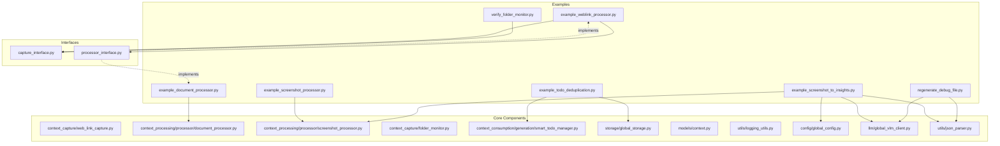
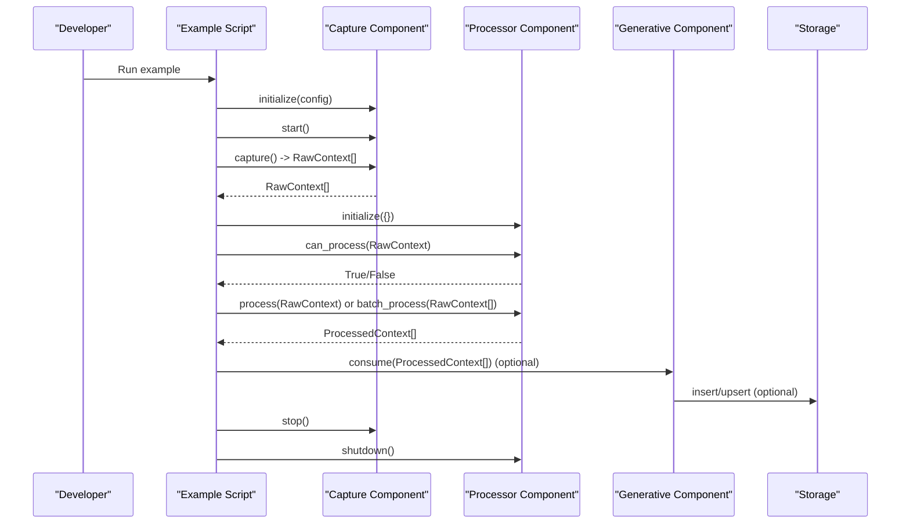
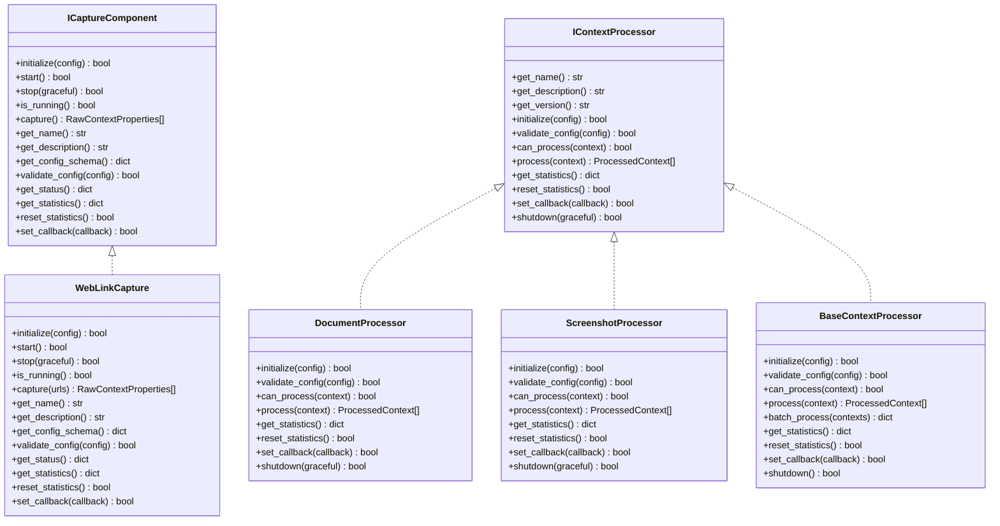

# Examples Directory

<cite>
**Referenced Files in This Document**
- [README.md](file://README.md)
- [examples/example_screenshot_processor.py](file://examples/example_screenshot_processor.py)
- [examples/example_document_processor.py](file://examples/example_document_processor.py)
- [examples/example_weblink_processor.py](file://examples/example_weblink_processor.py)
- [examples/example_todo_deduplication.py](file://examples/example_todo_deduplication.py)
- [examples/verify_folder_monitor.py](file://examples/verify_folder_monitor.py)
- [examples/example_screenshot_to_insights.py](file://examples/example_screenshot_to_insights.py)
- [examples/regenerate_debug_file.py](file://examples/regenerate_debug_file.py)
- [opencontext/interfaces/capture_interface.py](file://opencontext/interfaces/capture_interface.py)
- [opencontext/interfaces/processor_interface.py](file://opencontext/interfaces/processor_interface.py)
- [opencontext/context_processing/processor/base_processor.py](file://opencontext/context_processing/processor/base_processor.py)
- [opencontext/context_capture/web_link_capture.py](file://opencontext/context_capture/web_link_capture.py)
- [opencontext/context_processing/processor/document_processor.py](file://opencontext/context_processing/processor/document_processor.py)
- [opencontext/context_processing/processor/screenshot_processor.py](file://opencontext/context_processing/processor/screenshot_processor.py)
- [opencontext/context_capture/folder_monitor.py](file://opencontext/context_capture/folder_monitor.py)
- [opencontext/storage/global_storage.py](file://opencontext/storage/global_storage.py)
- [opencontext/context_consumption/generation/smart_todo_manager.py](file://opencontext/context_consumption/generation/smart_todo_manager.py)
- [opencontext/models/context.py](file://opencontext/models/context.py)
- [opencontext/utils/logging_utils.py](file://opencontext/utils/logging_utils.py)
- [opencontext/config/global_config.py](file://opencontext/config/global_config.py)
- [opencontext/llm/global_vlm_client.py](file://opencontext/llm/global_vlm_client.py)
- [opencontext/utils/json_parser.py](file://opencontext/utils/json_parser.py)
</cite>

## Table of Contents
1. [Introduction](#introduction)
2. [Project Structure](#project-structure)
3. [Core Components](#core-components)
4. [Architecture Overview](#architecture-overview)
5. [Detailed Component Analysis](#detailed-component-analysis)
6. [Dependency Analysis](#dependency-analysis)
7. [Performance Considerations](#performance-considerations)
8. [Troubleshooting Guide](#troubleshooting-guide)
9. [Conclusion](#conclusion)
10. [Appendices](#appendices)

## Introduction
This document explains the examples directory and how each example demonstrates MineContext’s extensibility and usage patterns. It focuses on:
- Using example_screenshot_processor.py as a template for custom capture components
- Implementing new processing strategies with example_document_processor.py
- Handling web-based context via example_weblink_processor.py
- Demonstrating data processing logic with example_todo_deduplication.py
- Verifying folder monitoring functionality with verify_folder_monitor.py
- Leveraging example_screenshot_to_insights.py and regenerate_debug_file.py for advanced pipelines and debugging

These examples illustrate the interface-based plugin architecture that underpins MineContext’s capture and processing subsystems.

## Project Structure
The examples directory contains runnable scripts that demonstrate:
- How to capture and process screenshots
- How to process documents across multiple formats
- How to capture and process web links
- How to deduplicate todos using vector similarity
- How to verify folder monitoring behavior
- How to build an end-to-end pipeline from screenshots to insights
- How to regenerate and compare LLM outputs from debug files

**Diagram sources**
- [examples/example_screenshot_processor.py](file://examples/example_screenshot_processor.py#L1-L181)
- [examples/example_document_processor.py](file://examples/example_document_processor.py#L1-L237)
- [examples/example_weblink_processor.py](file://examples/example_weblink_processor.py#L1-L95)
- [examples/example_todo_deduplication.py](file://examples/example_todo_deduplication.py#L1-L251)
- [examples/verify_folder_monitor.py](file://examples/verify_folder_monitor.py#L1-L160)
- [examples/example_screenshot_to_insights.py](file://examples/example_screenshot_to_insights.py#L1-L676)
- [examples/regenerate_debug_file.py](file://examples/regenerate_debug_file.py#L1-L180)
- [opencontext/interfaces/capture_interface.py](file://opencontext/interfaces/capture_interface.py#L1-L153)
- [opencontext/interfaces/processor_interface.py](file://opencontext/interfaces/processor_interface.py#L1-L136)
- [opencontext/context_capture/web_link_capture.py](file://opencontext/context_capture/web_link_capture.py)
- [opencontext/context_processing/processor/document_processor.py](file://opencontext/context_processing/processor/document_processor.py)
- [opencontext/context_processing/processor/screenshot_processor.py](file://opencontext/context_processing/processor/screenshot_processor.py)
- [opencontext/context_capture/folder_monitor.py](file://opencontext/context_capture/folder_monitor.py)
- [opencontext/storage/global_storage.py](file://opencontext/storage/global_storage.py)
- [opencontext/context_consumption/generation/smart_todo_manager.py](file://opencontext/context_consumption/generation/smart_todo_manager.py)
- [opencontext/models/context.py](file://opencontext/models/context.py)
- [opencontext/utils/logging_utils.py](file://opencontext/utils/logging_utils.py)
- [opencontext/config/global_config.py](file://opencontext/config/global_config.py)
- [opencontext/llm/global_vlm_client.py](file://opencontext/llm/global_vlm_client.py)
- [opencontext/utils/json_parser.py](file://opencontext/utils/json_parser.py)

**Section sources**
- [README.md](file://README.md#L270-L320)

## Core Components
This section outlines the key interfaces and base classes that the examples rely on to plug into MineContext’s architecture.

- Capture interface defines the contract for capture components, including lifecycle methods (initialize, start, stop, is_running), capture execution, configuration schema, validation, status, statistics, and callbacks.
- Processor interface defines the contract for processing components, including lifecycle methods (initialize, validate_config, can_process, process, get_statistics, reset_statistics, set_callback, shutdown), plus metadata like name, description, and version.
- BaseContextProcessor provides a reusable base class that implements common behaviors such as statistics tracking, configuration management, batch processing, callback invocation, and graceful shutdown.

These interfaces and the base class enable developers to implement custom capture and processing components that integrate seamlessly with the rest of the system.

**Section sources**
- [opencontext/interfaces/capture_interface.py](file://opencontext/interfaces/capture_interface.py#L1-L153)
- [opencontext/interfaces/processor_interface.py](file://opencontext/interfaces/processor_interface.py#L1-L136)
- [opencontext/context_processing/processor/base_processor.py](file://opencontext/context_processing/processor/base_processor.py#L1-L261)

## Architecture Overview
The examples demonstrate a layered, interface-driven architecture:
- Capture layer: Components implement the capture interface to produce raw context data.
- Processing layer: Components implement the processor interface to transform raw context into structured, processed context.
- Consumption layer: Generative components (e.g., SmartTodoManager) consume processed context to produce insights like todos, tips, and reports.
- Utilities: Logging, configuration, and LLM clients support the examples.

**Diagram sources**
- [opencontext/interfaces/capture_interface.py](file://opencontext/interfaces/capture_interface.py#L1-L153)
- [opencontext/interfaces/processor_interface.py](file://opencontext/interfaces/processor_interface.py#L1-L136)
- [opencontext/context_capture/web_link_capture.py](file://opencontext/context_capture/web_link_capture.py)
- [opencontext/context_processing/processor/document_processor.py](file://opencontext/context_processing/processor/document_processor.py)
- [opencontext/context_processing/processor/screenshot_processor.py](file://opencontext/context_processing/processor/screenshot_processor.py)
- [opencontext/context_consumption/generation/smart_todo_manager.py](file://opencontext/context_consumption/generation/smart_todo_manager.py)
- [opencontext/storage/global_storage.py](file://opencontext/storage/global_storage.py)

## Detailed Component Analysis

### example_screenshot_processor.py: Template for Custom Capture Components
This example demonstrates how to:
- Initialize logging
- Discover screenshot files from a directory or accept explicit file paths
- Construct RawContextProperties for each screenshot
- Use ScreenshotProcessor to extract insights without persisting to the database
- Iterate through results and print extracted metadata

Key patterns:
- Use RawContextProperties to describe source, content path, format, and timestamps
- Use ScreenshotProcessor.batch_process to process multiple contexts asynchronously
- Validate file existence and handle errors gracefully

How to adapt as a template:
- Replace file discovery logic with your own capture source (e.g., clipboard, OCR, or a custom monitor)
- Implement a capture method that returns RawContextProperties
- Integrate with a processor that consumes the captured context

**Section sources**
- [examples/example_screenshot_processor.py](file://examples/example_screenshot_processor.py#L1-L181)
- [opencontext/context_processing/processor/screenshot_processor.py](file://opencontext/context_processing/processor/screenshot_processor.py)
- [opencontext/models/context.py](file://opencontext/models/context.py)
- [opencontext/utils/logging_utils.py](file://opencontext/utils/logging_utils.py)

### example_document_processor.py: Implementing New Processing Strategies
This example demonstrates:
- Scanning a directory for supported document formats
- Determining content format based on file extension
- Creating RawContextProperties for each document
- Using DocumentProcessor to enqueue processing
- Saving chunk results to JSON for inspection
- Gracefully shutting down the processor

Key patterns:
- Use can_process to gate unsupported formats
- Use real_process to enqueue processing
- Use batch-like iteration to process multiple files
- Persist chunks to disk for verification

How to adapt:
- Extend the supported format mapping to include new file types
- Implement custom processing logic by subclassing BaseContextProcessor and overriding process
- Integrate with chunkers or converters to tailor extraction behavior

**Section sources**
- [examples/example_document_processor.py](file://examples/example_document_processor.py#L1-L237)
- [opencontext/context_processing/processor/document_processor.py](file://opencontext/context_processing/processor/document_processor.py)
- [opencontext/context_processing/processor/base_processor.py](file://opencontext/context_processing/processor/base_processor.py#L1-L261)
- [opencontext/models/context.py](file://opencontext/models/context.py)

### example_weblink_processor.py: Handling Web-Based Context
This example demonstrates:
- Initializing WebLinkCapture and DocumentProcessor
- Starting the capture component
- Capturing a single URL and processing the resulting raw context
- Iterating through processed contexts and printing extracted data
- Stopping the capture component

Key patterns:
- Initialize capture and processor with configuration
- Start capture component before capture()
- Validate processor capability with can_process
- Use logging to track progress and outcomes

How to adapt:
- Add modes or filters to capture based on URL patterns
- Extend to support multiple URLs or batch capture
- Integrate with custom processors tailored to web content

**Section sources**
- [examples/example_weblink_processor.py](file://examples/example_weblink_processor.py#L1-L95)
- [opencontext/context_capture/web_link_capture.py](file://opencontext/context_capture/web_link_capture.py)
- [opencontext/context_processing/processor/document_processor.py](file://opencontext/context_processing/processor/document_processor.py)
- [opencontext/utils/logging_utils.py](file://opencontext/utils/logging_utils.py)

### example_todo_deduplication.py: Demonstrating Data Processing Logic
This example demonstrates:
- Creating sample todo items with varying similarity
- Using SmartTodoManager to deduplicate todos via vector similarity
- Inserting deduplicated todos into storage and upserting embeddings
- Providing performance notes on vectorization optimization

Key patterns:
- Use get_storage() to insert todos and upsert embeddings
- Call _deduplicate_with_vector_search with a configurable similarity threshold
- Log analysis and performance improvements

How to adapt:
- Adjust similarity thresholds based on domain requirements
- Integrate with historical context to improve deduplication accuracy
- Add custom metadata to embeddings for richer filtering

**Section sources**
- [examples/example_todo_deduplication.py](file://examples/example_todo_deduplication.py#L1-L251)
- [opencontext/context_consumption/generation/smart_todo_manager.py](file://opencontext/context_consumption/generation/smart_todo_manager.py)
- [opencontext/storage/global_storage.py](file://opencontext/storage/global_storage.py)

### verify_folder_monitor.py: Testing Folder Monitoring Functionality
This example verifies:
- Initialization and startup of FolderMonitorCapture
- Detection of file creation, update, and deletion events
- Cleanup behavior by invoking storage deletion for processed contexts
- Mocking storage to simulate context IDs and verify cleanup calls

Key patterns:
- Patch get_storage to return a mock storage instance
- Configure monitor with watch paths, recursive scanning, and initial scan
- Trigger capture() to observe events and verify cleanup

How to adapt:
- Add more event types or filters
- Integrate with custom processors triggered by captured events
- Extend to validate event payloads and metadata

**Section sources**
- [examples/verify_folder_monitor.py](file://examples/verify_folder_monitor.py#L1-L160)
- [opencontext/context_capture/folder_monitor.py](file://opencontext/context_capture/folder_monitor.py)

### example_screenshot_to_insights.py: End-to-End Pipeline
This example demonstrates a full pipeline:
- Discovering screenshots and extracting structured context
- Generating activity summaries via LLM prompts
- Extracting todos and smart tips
- Producing a comprehensive report
- Printing a final summary

Key patterns:
- Use get_prompt_group to fetch system and user prompt templates
- Use generate_with_messages and generate_with_messages_async for LLM calls
- Use parse_json_from_response to normalize LLM outputs
- Chain steps to produce insights and a final report

How to adapt:
- Customize prompt groups for domain-specific insights
- Add more steps (e.g., sentiment analysis, categorization)
- Persist intermediate results for auditing

**Section sources**
- [examples/example_screenshot_to_insights.py](file://examples/example_screenshot_to_insights.py#L1-L676)
- [opencontext/config/global_config.py](file://opencontext/config/global_config.py)
- [opencontext/llm/global_vlm_client.py](file://opencontext/llm/global_vlm_client.py)
- [opencontext/utils/json_parser.py](file://opencontext/utils/json_parser.py)

### regenerate_debug_file.py: Debugging and Reproducing LLM Outputs
This example demonstrates:
- Loading a debug JSON file to extract messages and original response
- Regenerating content using the same messages
- Comparing original and regenerated outputs
- Saving a comparison file with metadata

Key patterns:
- Use generate_with_messages_async to regenerate content
- Save outputs to a new JSON file for later inspection

How to adapt:
- Extend to support multiple generations and statistical comparisons
- Add diff utilities to highlight changes across runs

**Section sources**
- [examples/regenerate_debug_file.py](file://examples/regenerate_debug_file.py#L1-L180)
- [opencontext/llm/global_vlm_client.py](file://opencontext/llm/global_vlm_client.py)
- [opencontext/utils/json_parser.py](file://opencontext/utils/json_parser.py)

## Dependency Analysis
The examples depend on core interfaces and components to remain portable and extensible.

**Diagram sources**
- [opencontext/interfaces/capture_interface.py](file://opencontext/interfaces/capture_interface.py#L1-L153)
- [opencontext/interfaces/processor_interface.py](file://opencontext/interfaces/processor_interface.py#L1-L136)
- [opencontext/context_processing/processor/base_processor.py](file://opencontext/context_processing/processor/base_processor.py#L1-L261)
- [opencontext/context_capture/web_link_capture.py](file://opencontext/context_capture/web_link_capture.py)
- [opencontext/context_processing/processor/document_processor.py](file://opencontext/context_processing/processor/document_processor.py)
- [opencontext/context_processing/processor/screenshot_processor.py](file://opencontext/context_processing/processor/screenshot_processor.py)

**Section sources**
- [opencontext/interfaces/capture_interface.py](file://opencontext/interfaces/capture_interface.py#L1-L153)
- [opencontext/interfaces/processor_interface.py](file://opencontext/interfaces/processor_interface.py#L1-L136)
- [opencontext/context_processing/processor/base_processor.py](file://opencontext/context_processing/processor/base_processor.py#L1-L261)

## Performance Considerations
- Vector-based deduplication: The example highlights an optimization reducing vectorization complexity from O(N^2) to O(N) by caching embeddings, significantly lowering API calls and processing time.
- Batch processing: Use batch_process to reduce overhead and leverage internal grouping by object ID.
- Async processing: Prefer asynchronous APIs for LLM calls and capture operations to maximize throughput.
- Logging and statistics: Track processing counts and errors to identify bottlenecks and optimize configurations.

[No sources needed since this section provides general guidance]

## Troubleshooting Guide
Common issues and resolutions:
- File not found or invalid paths: Ensure input paths exist and are accessible; the examples print warnings and skip missing files.
- Unsupported formats: Use can_process to guard unsupported files; extend format mappings as needed.
- LLM client failures: Verify API keys and model availability; regenerate content from debug files to reproduce and compare outputs.
- Storage cleanup not triggered: Confirm that mock storage returns processed contexts and that delete calls are invoked as expected.

**Section sources**
- [examples/example_screenshot_processor.py](file://examples/example_screenshot_processor.py#L1-L181)
- [examples/example_document_processor.py](file://examples/example_document_processor.py#L1-L237)
- [examples/example_weblink_processor.py](file://examples/example_weblink_processor.py#L1-L95)
- [examples/example_todo_deduplication.py](file://examples/example_todo_deduplication.py#L1-L251)
- [examples/verify_folder_monitor.py](file://examples/verify_folder_monitor.py#L1-L160)
- [examples/regenerate_debug_file.py](file://examples/regenerate_debug_file.py#L1-L180)

## Conclusion
The examples directory showcases MineContext’s extensibility through:
- Interface-driven capture and processing components
- Practical demonstrations of screenshots, documents, web links, and folder monitoring
- End-to-end pipelines that transform raw context into actionable insights
- Robust debugging and verification utilities

By following the patterns shown here, developers can implement custom capture and processing components that integrate cleanly into the system.

[No sources needed since this section summarizes without analyzing specific files]

## Appendices

### How to Use These Examples as Starting Points
- Custom capture component:
  - Implement the capture interface and integrate with your data source
  - Use RawContextProperties to describe captured content
  - Start with example_screenshot_processor.py as a template for discovery and processing
- Custom processing strategy:
  - Subclass BaseContextProcessor and override process
  - Use can_process to gate supported contexts
  - Start with example_document_processor.py to learn batching and chunking
- Web-based context:
  - Initialize capture and processor, then capture and process results
  - Start with example_weblink_processor.py
- Data processing logic:
  - Use SmartTodoManager for vector-based deduplication
  - Start with example_todo_deduplication.py
- Folder monitoring:
  - Initialize and start FolderMonitorCapture, then trigger capture to observe events
  - Start with verify_folder_monitor.py
- Advanced pipelines:
  - Chain screenshot extraction, activity generation, todo extraction, tips, and report generation
  - Start with example_screenshot_to_insights.py
- Debugging:
  - Regenerate LLM outputs from debug files and compare results
  - Start with regenerate_debug_file.py

[No sources needed since this section provides general guidance]