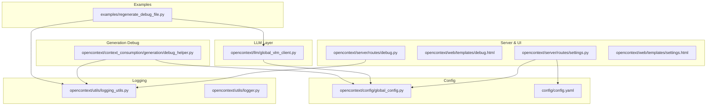
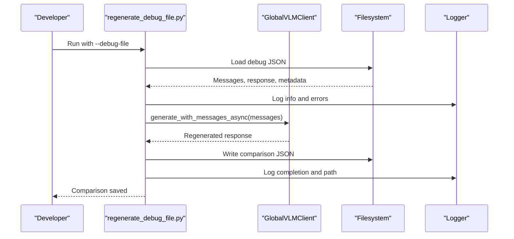
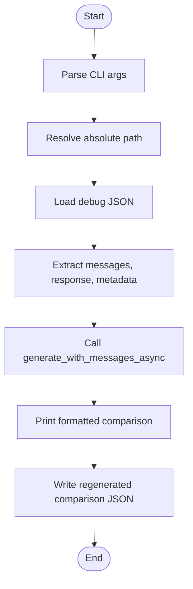
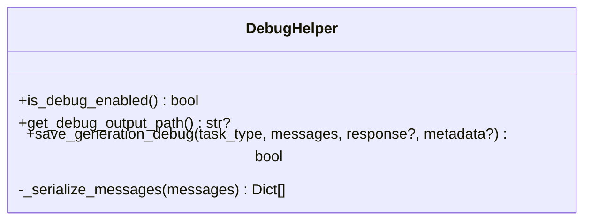
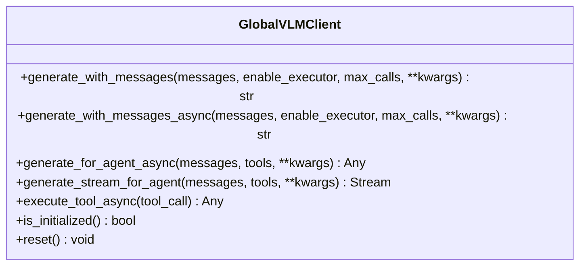
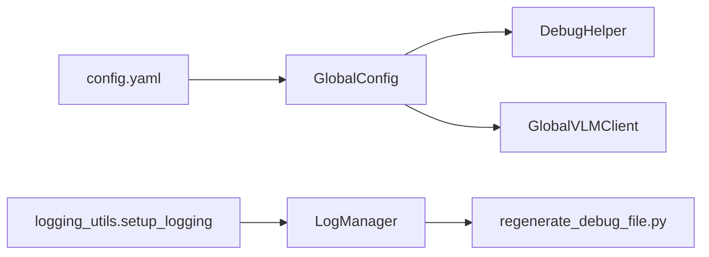
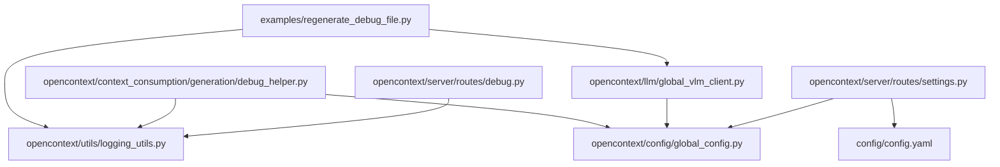

# Utility and Debug Examples

<cite>
**Referenced Files in This Document**
- [regenerate_debug_file.py](file://examples/regenerate_debug_file.py)
- [debug_helper.py](file://opencontext/context_consumption/generation/debug_helper.py)
- [global_vlm_client.py](file://opencontext/llm/global_vlm_client.py)
- [logging_utils.py](file://opencontext/utils/logging_utils.py)
- [logger.py](file://opencontext/utils/logger.py)
- [global_config.py](file://opencontext/config/global_config.py)
- [config.yaml](file://config/config.yaml)
- [debug.py](file://opencontext/server/routes/debug.py)
- [debug.html](file://opencontext/web/templates/debug.html)
- [settings.py](file://opencontext/server/routes/settings.py)
- [settings.html](file://opencontext/web/templates/settings.html)
</cite>

## Table of Contents
1. [Introduction](#introduction)
2. [Project Structure](#project-structure)
3. [Core Components](#core-components)
4. [Architecture Overview](#architecture-overview)
5. [Detailed Component Analysis](#detailed-component-analysis)
6. [Dependency Analysis](#dependency-analysis)
7. [Performance Considerations](#performance-considerations)
8. [Troubleshooting Guide](#troubleshooting-guide)
9. [Conclusion](#conclusion)
10. [Appendices](#appendices)

## Introduction
This document explains the utility and debug examples in MineContext with a focus on diagnosing and reproducing content generation issues. It details the regenerate_debug_file.py utility as a diagnostic tool that regenerates content from previously captured debug artifacts, compares outputs, and integrates with the application’s logging and configuration systems. It also covers how debug artifacts are produced, stored, and consumed for performance analysis, memory profiling, and issue triage. Finally, it outlines best practices for building diagnostic tools that integrate with the application’s monitoring and logging infrastructure.

## Project Structure
The debug and utility ecosystem spans several areas:
- Example utilities under examples/, including regenerate_debug_file.py for artifact regeneration
- Generation debug artifact producer under opencontext/context_consumption/generation/debug_helper.py
- LLM client that executes generation and supports tool-call loops under opencontext/llm/global_vlm_client.py
- Logging subsystem under opencontext/utils/logger.py and opencontext/utils/logging_utils.py
- Configuration that enables debug mode and sets output paths under config/config.yaml and opencontext/config/global_config.py
- Web UI and API routes for debugging and prompt management under opencontext/server/routes/debug.py and opencontext/web/templates/debug.html
- Frontend settings UI for enabling/disabling debug mode and configuring output paths under opencontext/web/templates/settings.html and opencontext/server/routes/settings.py

**Diagram sources**
- [regenerate_debug_file.py](file://examples/regenerate_debug_file.py#L1-L180)
- [debug_helper.py](file://opencontext/context_consumption/generation/debug_helper.py#L1-L156)
- [global_vlm_client.py](file://opencontext/llm/global_vlm_client.py#L1-L317)
- [logging_utils.py](file://opencontext/utils/logging_utils.py#L1-L31)
- [logger.py](file://opencontext/utils/logger.py#L1-L86)
- [global_config.py](file://opencontext/config/global_config.py#L1-L331)
- [config.yaml](file://config/config.yaml#L1-L253)
- [debug.py](file://opencontext/server/routes/debug.py#L1-L691)
- [debug.html](file://opencontext/web/templates/debug.html#L1-L461)
- [settings.py](file://opencontext/server/routes/settings.py#L573-L758)
- [settings.html](file://opencontext/web/templates/settings.html#L333-L359)

**Section sources**
- [regenerate_debug_file.py](file://examples/regenerate_debug_file.py#L1-L180)
- [debug_helper.py](file://opencontext/context_consumption/generation/debug_helper.py#L1-L156)
- [global_vlm_client.py](file://opencontext/llm/global_vlm_client.py#L1-L317)
- [logging_utils.py](file://opencontext/utils/logging_utils.py#L1-L31)
- [logger.py](file://opencontext/utils/logger.py#L1-L86)
- [global_config.py](file://opencontext/config/global_config.py#L1-L331)
- [config.yaml](file://config/config.yaml#L1-L253)
- [debug.py](file://opencontext/server/routes/debug.py#L1-L691)
- [debug.html](file://opencontext/web/templates/debug.html#L1-L461)
- [settings.py](file://opencontext/server/routes/settings.py#L573-L758)
- [settings.html](file://opencontext/web/templates/settings.html#L333-L359)

## Core Components
- regenerate_debug_file.py: Command-line utility to load a debug JSON artifact, regenerate content using the same messages, compare outputs, and write a side-by-side comparison file.
- DebugHelper: Producer of debug artifacts for generation tasks, controlled by configuration, saving messages and responses to disk.
- GlobalVLMClient: LLM client that executes generation with optional tool-call loop and async support, used by both producers and consumers of debug artifacts.
- Logging: Centralized logging via loguru with configurable console and file handlers.
- Configuration: Debug mode enablement and output path resolution for generation artifacts.
- Server routes and UI: Debug endpoints and UI for inspecting and manipulating debug data and prompts.

Key responsibilities:
- Artifact capture and persistence (DebugHelper)
- Artifact regeneration and comparison (regenerate_debug_file.py)
- LLM execution and tool-call orchestration (GlobalVLMClient)
- Logging and configuration integration (logging_utils, logger, global_config, config.yaml)
- UI and API for debugging and prompt management (routes and templates)

**Section sources**
- [regenerate_debug_file.py](file://examples/regenerate_debug_file.py#L1-L180)
- [debug_helper.py](file://opencontext/context_consumption/generation/debug_helper.py#L1-L156)
- [global_vlm_client.py](file://opencontext/llm/global_vlm_client.py#L1-L317)
- [logging_utils.py](file://opencontext/utils/logging_utils.py#L1-L31)
- [logger.py](file://opencontext/utils/logger.py#L1-L86)
- [global_config.py](file://opencontext/config/global_config.py#L1-L331)
- [config.yaml](file://config/config.yaml#L1-L253)
- [debug.py](file://opencontext/server/routes/debug.py#L1-L691)
- [debug.html](file://opencontext/web/templates/debug.html#L1-L461)
- [settings.py](file://opencontext/server/routes/settings.py#L573-L758)
- [settings.html](file://opencontext/web/templates/settings.html#L333-L359)

## Architecture Overview
The debug workflow connects producers and consumers through configuration, logging, and the LLM layer:

**Diagram sources**
- [regenerate_debug_file.py](file://examples/regenerate_debug_file.py#L1-L180)
- [global_vlm_client.py](file://opencontext/llm/global_vlm_client.py#L1-L317)
- [logging_utils.py](file://opencontext/utils/logging_utils.py#L1-L31)
- [logger.py](file://opencontext/utils/logger.py#L1-L86)

## Detailed Component Analysis

### regenerate_debug_file.py
Purpose:
- Load a debug JSON artifact (messages, original response, metadata)
- Regenerate content using the same messages via the LLM client
- Compare original vs regenerated responses and print a formatted diff
- Persist a side-by-side comparison JSON file for later review

Command-line interface:
- Argument: --debug-file <path_to_debug_json>
- Resolves relative paths against project root
- Logs informational and error events

File generation logic:
- Loads JSON, extracts messages and response
- Calls generate_with_messages_async with enable_executor=False to mirror original generation
- Prints a structured comparison and writes a regenerated comparison JSON with original_file, timestamps, task_type, original_response, regenerated_response, and metadata

Integration with logging:
- Uses get_logger to emit logs for lifecycle events and error conditions

Edge cases and error handling:
- Catches file-not-found, invalid JSON, and general exceptions, logging and exiting with non-zero status

**Diagram sources**
- [regenerate_debug_file.py](file://examples/regenerate_debug_file.py#L1-L180)

**Section sources**
- [regenerate_debug_file.py](file://examples/regenerate_debug_file.py#L1-L180)

### DebugHelper (Artifact Producer)
Purpose:
- Save generation messages and responses to local files when debug mode is enabled
- Serialize messages to JSON-serializable format regardless of object type
- Create directory structure by task type and timestamped filenames

Configuration integration:
- Reads content_generation.debug.enabled and content_generation.debug.output_path from configuration
- Expands ${CONTEXT_PATH:.} placeholders to environment CONTEXT_PATH or current directory

Serialization:
- Handles dict messages and ChatCompletionMessage-like objects via model_dump/dict/__dict__
- Falls back to str serialization on failure

Persistence:
- Writes JSON with timestamp, task_type, messages, response, and optional metadata
- Logs success or exceptions

**Diagram sources**
- [debug_helper.py](file://opencontext/context_consumption/generation/debug_helper.py#L1-L156)

**Section sources**
- [debug_helper.py](file://opencontext/context_consumption/generation/debug_helper.py#L1-L156)
- [global_config.py](file://opencontext/config/global_config.py#L1-L331)
- [config.yaml](file://config/config.yaml#L1-L253)

### GlobalVLMClient (LLM Execution)
Purpose:
- Provide a singleton LLM client with async generation and optional tool-call loop
- Execute tool calls in parallel and append tool results back to messages
- Support agent-style streaming and raw response returns

Relevance to debug:
- Used by regenerate_debug_file.py to regenerate content with identical messages
- Used by generation modules that produce debug artifacts

**Diagram sources**
- [global_vlm_client.py](file://opencontext/llm/global_vlm_client.py#L1-L317)

**Section sources**
- [global_vlm_client.py](file://opencontext/llm/global_vlm_client.py#L1-L317)

### Logging and Configuration Integration
Logging:
- LogManager configures console and optional dated file logging with rotation and retention
- get_logger binds a module name to the global logger

Configuration:
- config.yaml defines logging.level and logging.log_path
- config.yaml content_generation.debug.enabled and output_path control artifact generation
- GlobalConfig resolves environment variables and exposes convenience getters

**Diagram sources**
- [config.yaml](file://config/config.yaml#L1-L253)
- [global_config.py](file://opencontext/config/global_config.py#L1-L331)
- [debug_helper.py](file://opencontext/context_consumption/generation/debug_helper.py#L1-L156)
- [global_vlm_client.py](file://opencontext/llm/global_vlm_client.py#L1-L317)
- [logging_utils.py](file://opencontext/utils/logging_utils.py#L1-L31)
- [logger.py](file://opencontext/utils/logger.py#L1-L86)

**Section sources**
- [logging_utils.py](file://opencontext/utils/logging_utils.py#L1-L31)
- [logger.py](file://opencontext/utils/logger.py#L1-L86)
- [global_config.py](file://opencontext/config/global_config.py#L1-L331)
- [config.yaml](file://config/config.yaml#L1-L253)

### Server Routes and UI for Debugging
- Debug routes expose endpoints to list and inspect SQLite tables, trigger generation tasks, and manage prompts
- UI template provides tabs and controls for reports, todos, activities, and tips
- Settings routes and UI allow enabling debug mode and configuring output paths

These components complement the CLI utility by offering runtime inspection and prompt manipulation, while the CLI focuses on offline artifact regeneration and comparison.

**Section sources**
- [debug.py](file://opencontext/server/routes/debug.py#L1-L691)
- [debug.html](file://opencontext/web/templates/debug.html#L1-L461)
- [settings.py](file://opencontext/server/routes/settings.py#L573-L758)
- [settings.html](file://opencontext/web/templates/settings.html#L333-L359)

## Dependency Analysis
Key dependencies and relationships:
- regenerate_debug_file.py depends on GlobalVLMClient for regeneration and logging_utils for logging
- DebugHelper depends on GlobalConfig for configuration and logging_utils for logging
- GlobalVLMClient depends on GlobalConfig for LLM configuration and uses tool executors
- Logging subsystem is centralized via logging_utils and logger modules
- Server routes depend on storage and configuration for data access and prompt management

**Diagram sources**
- [regenerate_debug_file.py](file://examples/regenerate_debug_file.py#L1-L180)
- [global_vlm_client.py](file://opencontext/llm/global_vlm_client.py#L1-L317)
- [logging_utils.py](file://opencontext/utils/logging_utils.py#L1-L31)
- [debug_helper.py](file://opencontext/context_consumption/generation/debug_helper.py#L1-L156)
- [global_config.py](file://opencontext/config/global_config.py#L1-L331)
- [config.yaml](file://config/config.yaml#L1-L253)
- [debug.py](file://opencontext/server/routes/debug.py#L1-L691)
- [settings.py](file://opencontext/server/routes/settings.py#L573-L758)

**Section sources**
- [regenerate_debug_file.py](file://examples/regenerate_debug_file.py#L1-L180)
- [debug_helper.py](file://opencontext/context_consumption/generation/debug_helper.py#L1-L156)
- [global_vlm_client.py](file://opencontext/llm/global_vlm_client.py#L1-L317)
- [logging_utils.py](file://opencontext/utils/logging_utils.py#L1-L31)
- [global_config.py](file://opencontext/config/global_config.py#L1-L331)
- [config.yaml](file://config/config.yaml#L1-L253)
- [debug.py](file://opencontext/server/routes/debug.py#L1-L691)
- [settings.py](file://opencontext/server/routes/settings.py#L573-L758)

## Performance Considerations
- Tool-call loop: GlobalVLMClient can execute multiple tool calls; limiting max_calls reduces latency and cost. The regenerate utility uses enable_executor=False to mirror the original generation behavior.
- Async I/O: Using async LLM calls minimizes blocking and improves throughput; ensure tool executors are efficient.
- Logging overhead: File logging with rotation adds I/O overhead; adjust retention and rotation policies to balance diagnostics and performance.
- Artifact size: Large message lists increase JSON size and regeneration time; consider trimming or sampling for performance-sensitive runs.

[No sources needed since this section provides general guidance]

## Troubleshooting Guide
Common issues and resolutions:
- Debug file not found: Verify the path passed to --debug-file and ensure it exists. The utility logs an error and exits on file-not-found.
- Invalid JSON format: Confirm the debug JSON is valid and contains messages, response, and metadata fields.
- LLM configuration missing: Ensure vlm_model configuration is present in config.yaml; GlobalVLMClient requires valid LLM settings.
- Debug mode disabled: If content_generation.debug.enabled is false, DebugHelper will skip saving artifacts; enable it via settings UI or configuration.
- Environment variables: Debug output path expansion uses ${CONTEXT_PATH:.}; ensure CONTEXT_PATH is set appropriately.

Operational checks:
- Use server debug routes to inspect stored data and confirm storage availability.
- Review logs for warnings and exceptions emitted by the logging subsystem.

**Section sources**
- [regenerate_debug_file.py](file://examples/regenerate_debug_file.py#L1-L180)
- [debug_helper.py](file://opencontext/context_consumption/generation/debug_helper.py#L1-L156)
- [global_vlm_client.py](file://opencontext/llm/global_vlm_client.py#L1-L317)
- [config.yaml](file://config/config.yaml#L1-L253)
- [debug.py](file://opencontext/server/routes/debug.py#L1-L691)

## Conclusion
The regenerate_debug_file.py utility exemplifies best practices for diagnostic tooling in MineContext:
- It integrates tightly with the logging and configuration subsystems
- It mirrors the original generation pipeline by using the same messages and disabling tool-execution loops
- It produces side-by-side comparison artifacts for reproducibility and triage
- It complements server-side debugging endpoints and UI for interactive inspection

By following this pattern, developers can build robust diagnostic tools that:
- Respect configuration and environment variables
- Integrate with the logging framework
- Reproduce edge cases deterministically
- Support performance analysis and memory profiling by isolating and comparing outputs

[No sources needed since this section summarizes without analyzing specific files]

## Appendices

### How to Use regenerate_debug_file.py
- Prepare a debug JSON artifact produced by DebugHelper (ensure content_generation.debug.enabled is true and output_path is configured)
- Run the utility with --debug-file pointing to the artifact
- Review the printed comparison and the generated regenerated comparison JSON for side-by-side analysis

Guidance for performance analysis and memory profiling:
- Use the regenerated comparison to isolate differences caused by prompt changes, tool-call outcomes, or LLM updates
- For memory profiling, temporarily reduce max_calls in GlobalVLMClient to minimize tool-call overhead and measure baseline memory usage
- For performance analysis, compare wall-clock durations of regeneration runs and correlate with tool execution times

Best practices for similar utilities:
- Always resolve configuration via GlobalConfig and respect environment variables
- Use get_logger consistently for observability
- Preserve original inputs (messages, metadata) to ensure deterministic reproduction
- Provide clear output artifacts (JSON diffs, logs) for downstream triage

**Section sources**
- [regenerate_debug_file.py](file://examples/regenerate_debug_file.py#L1-L180)
- [debug_helper.py](file://opencontext/context_consumption/generation/debug_helper.py#L1-L156)
- [global_vlm_client.py](file://opencontext/llm/global_vlm_client.py#L1-L317)
- [logging_utils.py](file://opencontext/utils/logging_utils.py#L1-L31)
- [global_config.py](file://opencontext/config/global_config.py#L1-L331)
- [config.yaml](file://config/config.yaml#L1-L253)