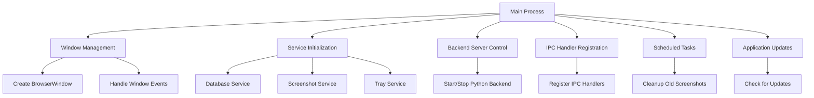
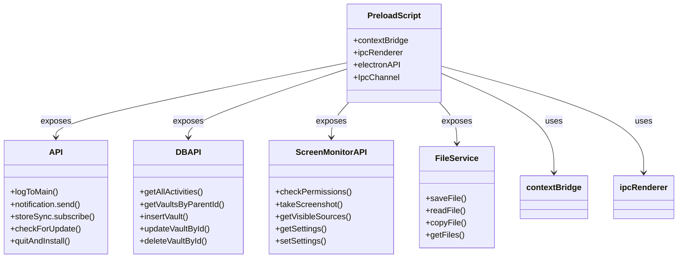
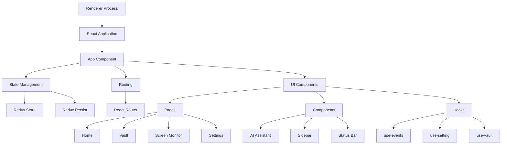
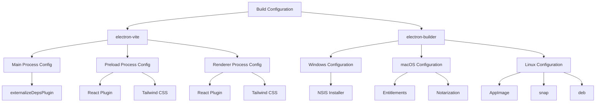
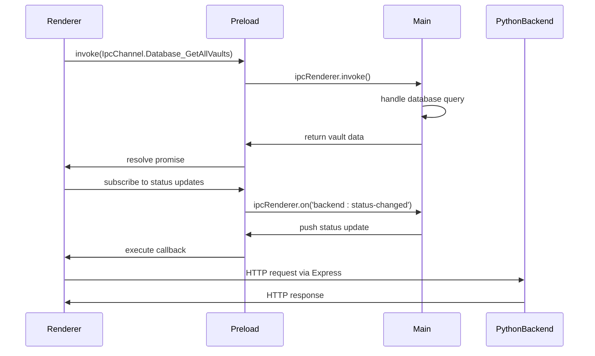

# Frontend Structure

<cite>
**Referenced Files in This Document**   
- [index.ts](file://frontend/src/main/index.ts)
- [IpcChannel.ts](file://frontend/packages/shared/IpcChannel.ts)
- [index.ts](file://frontend/src/preload/index.ts)
- [main.tsx](file://frontend/src/renderer/src/main.tsx)
- [App.tsx](file://frontend/src/renderer/src/App.tsx)
- [electron.vite.config.ts](file://frontend/electron.vite.config.ts)
- [electron-builder.yml](file://frontend/electron-builder.yml)
- [tailwind.config.js](file://frontend/tailwind.config.js)
</cite>

## Table of Contents
1. [Electron Architecture Overview](#electron-architecture-overview)
2. [Main Process](#main-process)
3. [Preload Script](#preload-script)
4. [Renderer Process](#renderer-process)
5. [Build Configuration](#build-configuration)
6. [Inter-Process Communication](#inter-process-communication)
7. [Security Considerations](#security-considerations)

## Electron Architecture Overview

The MineContext Electron application follows the standard Electron architecture with three distinct processes: main, preload, and renderer. This separation ensures security while enabling rich functionality. The main process manages application lifecycle and native operations, the preload script acts as a secure bridge between Node.js and the renderer, and the renderer process hosts the React-based user interface.

**Section sources**
- [index.ts](file://frontend/src/main/index.ts#L1-L348)
- [main.tsx](file://frontend/src/renderer/src/main.tsx#L1-L9)

## Main Process

The main process, implemented in `frontend/src/main/index.ts`, serves as the application's backbone, responsible for window management, lifecycle handling, and system-level operations. It creates and manages the primary BrowserWindow instance with platform-specific configurations, including frameless windows on macOS with custom title bars. The process implements a single-instance lock to prevent multiple application instances and handles window lifecycle events by hiding windows instead of closing them, maintaining the application in the system tray.

Key responsibilities include:
- Initializing services like database, screenshot, and tray services
- Managing backend Python server lifecycle
- Setting up protocol handlers for custom URL schemes
- Registering IPC handlers for inter-process communication
- Implementing scheduled tasks like screenshot cleanup
- Handling application updates through electron-updater

The main process also initializes performance monitoring and sets up global error handling for uncaught exceptions and unhandled rejections in production mode.

**Diagram sources**
- [index.ts](file://frontend/src/main/index.ts#L124-L194)
- [index.ts](file://frontend/src/main/index.ts#L202-L287)

**Section sources**
- [index.ts](file://frontend/src/main/index.ts#L1-L348)

## Preload Script

The preload script, located at `frontend/src/preload/index.ts`, serves as a secure bridge between the Node.js environment and the renderer process. It uses Electron's contextBridge API to expose selected Electron and custom APIs to the renderer while maintaining context isolation. The script defines multiple API namespaces including `api`, `dbAPI`, `screenMonitorAPI`, `fileService`, and `eventLoop`, each exposing specific functionality through IPC invocations.

The preload script implements type safety with TypeScript interfaces for log levels, notifications, and vault data structures. It exposes database operations for vault and activity management, screen monitoring functions for screenshot capture and permissions checking, and file operations for saving and reading files. The script also sets up event listeners for main process logs, forwarding them to the renderer console with appropriate labeling.

Security is maintained by only exposing necessary functionality and using the contextBridge API when context isolation is enabled, falling back to direct assignment only when context isolation is disabled.

**Diagram sources**
- [index.ts](file://frontend/src/preload/index.ts#L17-L157)

**Section sources**
- [index.ts](file://frontend/src/preload/index.ts#L1-L157)

## Renderer Process

The renderer process hosts the React-based user interface, structured with a component hierarchy that includes pages, components, hooks, and services. The application entry point `frontend/src/renderer/src/main.tsx` renders the App component into the DOM, while `frontend/src/renderer/src/App.tsx` serves as the root component that manages application state and routing.

The UI framework uses Arco Design components with theme support for both English and Chinese locales. State management is implemented using Redux Toolkit with redux-persist for data persistence across sessions. The store configuration in `frontend/src/renderer/src/store/index.ts` combines multiple reducers for navigation, settings, screen, vault, events, and chat history, with persistence configured for selective state slices.

The component structure follows a modular approach with pages for Home, Vault, Screen Monitor, Settings, Files, and AI Demo. Each page contains specialized components, such as the Home page's heatmap, to-do cards, and AI assistant. The application uses React Router for navigation with hash-based routing, and implements context providers for notifications and capture sources.

Styling is achieved through a combination of Tailwind CSS and LESS, with Tailwind configured in `tailwind.config.js` to scan renderer source files. The UI layout uses CSS flexbox and the Allotment library for resizable panes, particularly in the AI assistant interface.

**Diagram sources**
- [main.tsx](file://frontend/src/renderer/src/main.tsx#L1-L9)
- [App.tsx](file://frontend/src/renderer/src/App.tsx#L1-L138)
- [index.ts](file://frontend/src/renderer/src/store/index.ts#L1-L85)

**Section sources**
- [main.tsx](file://frontend/src/renderer/src/main.tsx#L1-L9)
- [App.tsx](file://frontend/src/renderer/src/App.tsx#L1-L138)
- [Router.tsx](file://frontend/src/renderer/src/Router.tsx#L1-L103)
- [index.ts](file://frontend/src/renderer/src/store/index.ts#L1-L85)

## Build Configuration

The build configuration for MineContext is managed through electron-vite and electron-builder. The Vite configuration in `electron.vite.config.ts` defines separate build configurations for main, preload, and renderer processes with appropriate plugins and aliases. The main process uses externalizeDepsPlugin to exclude dependencies from bundling, while the preload and renderer processes include React and Tailwind CSS plugins.

The electron-builder configuration in `electron-builder.yml` specifies platform-specific settings, including application ID, product name, and output directory. It configures extra resources for the Python backend and unpacks specific resources like icons. Platform-specific configurations include Windows NSIS installer settings, macOS entitlements and additional binaries for window inspection and capture, and Linux targets for AppImage, snap, and deb packages.

The build process is orchestrated through npm scripts in package.json, including development, production build, and platform-specific build commands. The configuration also sets up publishing to GitHub and notarization for macOS applications.

**Diagram sources**
- [electron.vite.config.ts](file://frontend/electron.vite.config.ts#L1-L84)
- [electron-builder.yml](file://frontend/electron-builder.yml#L1-L72)

**Section sources**
- [electron.vite.config.ts](file://frontend/electron.vite.config.ts#L1-L84)
- [electron-builder.yml](file://frontend/electron-builder.yml#L1-L72)
- [package.json](file://frontend/package.json#L1-L153)

## Inter-Process Communication

Inter-process communication (IPC) in MineContext is structured around a comprehensive channel system defined in `frontend/packages/shared/IpcChannel.ts`. This enum-based approach provides type-safe communication channels between the main and renderer processes. The IPC system supports both request-response patterns through invoke/handle and event-driven communication through on/off listeners.

The main process registers IPC handlers in `frontend/src/main/ipc.ts` (imported via registerIpc) that respond to renderer requests for operations like database queries, file operations, and system interactions. The renderer accesses these channels through the preload script's exposed APIs, which map to specific IPC channels using the IpcChannel enum.

Two-way communication is implemented for real-time updates, with the main process pushing events to the renderer through channels like 'backend:status-changed' and 'tray:navigate-to-screen-monitor'. The server-push-api in the preload script establishes listeners for these push events, enabling the UI to react to system state changes without polling.

The IPC architecture also facilitates communication with the Python backend through HTTP requests from the renderer to the Express server running in the main process context, creating a three-tier communication model between renderer, Electron main process, and Python backend.

**Diagram sources**
- [IpcChannel.ts](file://frontend/packages/shared/IpcChannel.ts#L1-L349)
- [index.ts](file://frontend/src/main/index.ts#L286-L287)
- [index.ts](file://frontend/src/preload/index.ts#L153-L155)

**Section sources**
- [IpcChannel.ts](file://frontend/packages/shared/IpcChannel.ts#L1-L349)
- [index.ts](file://frontend/src/main/index.ts#L286-L287)
- [index.ts](file://frontend/src/preload/index.ts#L153-L155)

## Security Considerations

The MineContext application implements several security measures to protect against common Electron vulnerabilities. Context isolation is enabled in the BrowserWindow configuration, preventing the renderer from accessing Node.js APIs directly and mitigating prototype pollution attacks. The preload script uses contextBridge to securely expose only necessary APIs to the renderer, following the principle of least privilege.

Node integration is disabled in the renderer process, preventing malicious code from executing system commands. The Content Security Policy in index.html restricts script sources to 'self' and 'unsafe-eval' while allowing connections to blob and wildcard domains, balancing security with functionality requirements.

The application implements secure IPC patterns by validating and sanitizing all data passed between processes, particularly for file system operations. Sensitive operations like backend server control and system preferences access are mediated through the main process, which can implement additional security checks.

For macOS, the application includes specific entitlements for camera, microphone, and file system access, declared in the electron-builder configuration, ensuring transparent permission requests to users. The build configuration also includes notarization for macOS to meet Apple's security requirements.

**Section sources**
- [index.ts](file://frontend/src/main/index.ts#L143-L147)
- [index.html](file://frontend/src/renderer/index.html#L11-L12)
- [electron-builder.yml](file://frontend/electron-builder.yml#L37-L50)