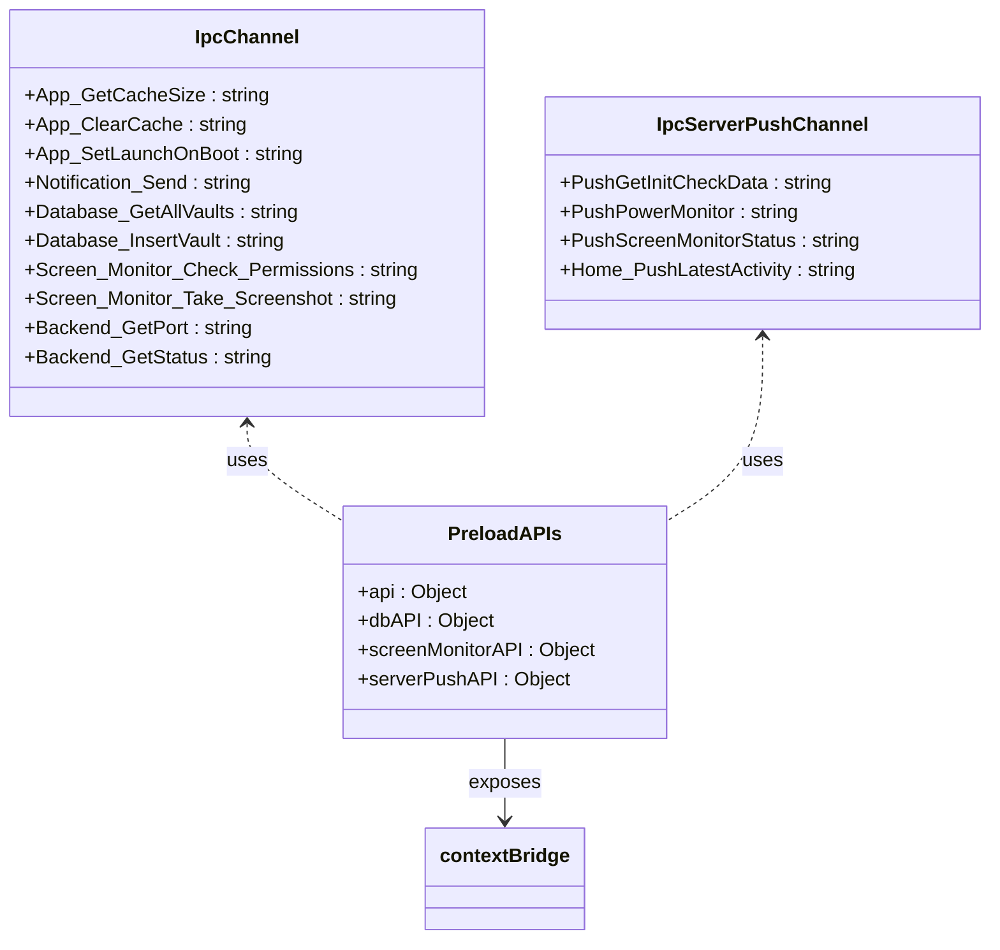
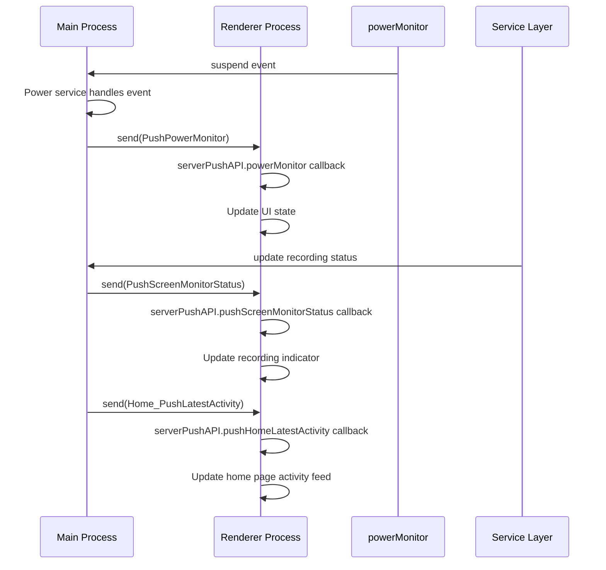
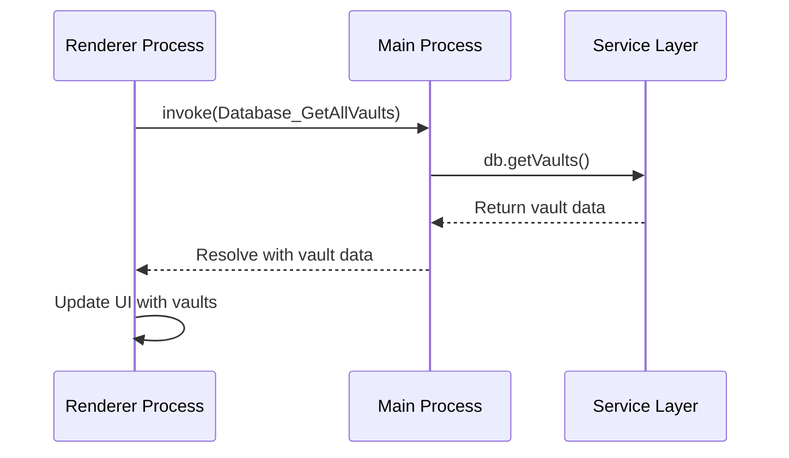
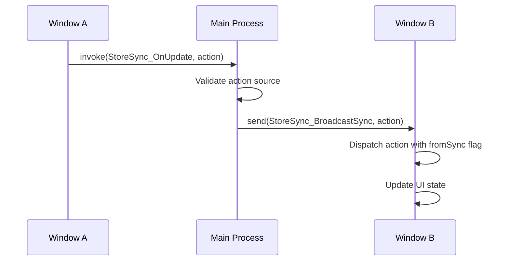

# IPC Communication

<cite>
**Referenced Files in This Document**   
- [ipc.ts](file://frontend/src/main/ipc.ts)
- [IpcChannel.ts](file://frontend/packages/shared/IpcChannel.ts)
- [server-push-api.tsx](file://frontend/src/preload/server-push-api.tsx)
- [ipc-server-push-channel.ts](file://frontend/packages/shared/ipc-server-push-channel.ts)
- [index.ts](file://frontend/src/preload/index.ts)
- [StoreSyncService.ts](file://frontend/src/main/services/StoreSyncService.ts)
</cite>

## Table of Contents
1. [Introduction](#introduction)
2. [Core IPC Architecture](#core-ipc-architecture)
3. [Channel Registration and Message Handling](#channel-registration-and-message-handling)
4. [Shared IPC Channel Definitions](#shared-ipc-channel-definitions)
5. [Server-Push Pattern Implementation](#server-push-pattern-implementation)
6. [IPC Communication Patterns](#ipc-communication-patterns)
7. [Security Considerations](#security-considerations)
8. [Common Issues and Debugging](#common-issues-and-debugging)
9. [Conclusion](#conclusion)

## Introduction
The IPC (Inter-Process Communication) system in this Electron application facilitates secure and efficient communication between the main and renderer processes. The architecture is designed around a well-defined channel registration system, with clear separation between request-response patterns and server-push event broadcasting. This documentation provides a comprehensive analysis of the IPC implementation, covering channel definitions, message handling patterns, server-push mechanisms, security considerations, and common troubleshooting scenarios.

## Core IPC Architecture

```mermaid
graph TD
subgraph "Main Process"
A[ipcMain] --> B[Channel Handlers]
B --> C[Service Layer]
C --> D[Database/File System]
C --> E[External Services]
end
subgraph "Renderer Process"
F[Preload Context] --> G[API Proxies]
G --> H[Renderer Components]
H --> I[React Hooks]
end
A < --> |invoke/handle| G
F --> |on/off| J[Server-Push Channels]
K[Main Services] --> |send| J
style A fill:#4CAF50,stroke:#388E3C
style F fill:#2196F3,stroke:#1976D2
style J fill:#FF9800,stroke:#F57C00
```

**Diagram sources**
- [ipc.ts](file://frontend/src/main/ipc.ts#L45-L609)
- [index.ts](file://frontend/src/preload/index.ts#L17-L156)
- [server-push-api.tsx](file://frontend/src/preload/server-push-api.tsx#L9-L46)

**Section sources**
- [ipc.ts](file://frontend/src/main/ipc.ts#L1-L609)
- [index.ts](file://frontend/src/preload/index.ts#L1-L156)

## Channel Registration and Message Handling

The IPC system follows Electron's recommended security practices with context isolation enabled. Channel registration occurs in the main process through the `registerIpc` function, which sets up handlers for various application domains including app management, system operations, database access, and file operations.

Each IPC channel is registered using `ipcMain.handle()` for asynchronous request-response patterns, allowing the main process to perform potentially blocking operations like file system access or database queries without freezing the renderer process. The handler functions typically validate input, execute business logic through service layers, and return structured responses.

Error handling is implemented consistently across all handlers, with try-catch blocks wrapping critical operations and detailed error messages logged using the application's logging system. Successful operations return success indicators, while failures include descriptive error messages for debugging purposes.

**Section sources**
- [ipc.ts](file://frontend/src/main/ipc.ts#L45-L609)

## Shared IPC Channel Definitions



**Diagram sources**
- [IpcChannel.ts](file://frontend/packages/shared/IpcChannel.ts#L4-L348)
- [ipc-server-push-channel.ts](file://frontend/packages/shared/ipc-server-push-channel.ts#L4-L12)
- [index.ts](file://frontend/src/preload/index.ts#L17-L156)

**Section sources**
- [IpcChannel.ts](file://frontend/packages/shared/IpcChannel.ts#L1-L349)
- [ipc-server-push-channel.ts](file://frontend/packages/shared/ipc-server-push-channel.ts#L1-L13)

The application defines IPC channels using TypeScript enums in shared modules, ensuring type safety and consistency across both main and renderer processes. The `IpcChannel` enum contains over 150 channel definitions organized by functional domains:

- **App Management**: Channels for application lifecycle, updates, and configuration
- **System Operations**: System-level operations like opening external links and managing window properties
- **Database Operations**: Comprehensive CRUD operations for vaults, tasks, activities, and other entities
- **Screen Monitoring**: Screenshot capture, permission management, and monitoring controls
- **Backend Services**: Integration with the application's backend services

The `IpcServerPushChannel` enum defines channels for server-push events, enabling the main process to proactively notify renderer processes of state changes without requiring polling.

## Server-Push Pattern Implementation



**Diagram sources**
- [server-push-api.tsx](file://frontend/src/preload/server-push-api.tsx#L9-L46)
- [Power.ts](file://frontend/src/main/background/os/Power.ts#L37-L68)
- [ipc.ts](file://frontend/src/main/ipc.ts#L556-L580)

**Section sources**
- [server-push-api.tsx](file://frontend/src/preload/server-push-api.tsx#L1-L47)
- [ipc-server-push-channel.ts](file://frontend/packages/shared/ipc-server-push-channel.ts#L1-L13)

The server-push pattern is implemented through Electron's `webContents.send()` method, allowing the main process to proactively push events to renderer processes. The `server-push-api.tsx` module in the preload context exposes subscription functions for various event types:

- **Power Monitoring**: Notifies renderer processes of system suspend, resume, lock, and unlock events
- **Screen Monitoring**: Broadcasts changes to screen recording status
- **Home Page Updates**: Pushes updates to the latest activity feed
- **Initialization Data**: Sends initial check data when the application starts

Each subscription function follows a consistent pattern: it registers an event listener using `ipcRenderer.on()` and returns an unsubscribe function that calls `ipcRenderer.off()`, enabling proper cleanup and preventing memory leaks. The implementation includes error handling to gracefully manage listener setup failures.

## IPC Communication Patterns

### Request-Response Patterns

The application primarily uses asynchronous request-response patterns through `ipcRenderer.invoke()` and `ipcMain.handle()`. This approach prevents the renderer process from blocking while waiting for potentially long-running operations in the main process.



**Diagram sources**
- [index.ts](file://frontend/src/preload/index.ts#L46-L84)
- [ipc.ts](file://frontend/src/main/ipc.ts#L367-L375)

### Synchronous vs Asynchronous Calls

The application exclusively uses asynchronous IPC calls (`invoke`/`handle`) rather than synchronous calls (`sendSync`/`on`), adhering to Electron's best practices for performance and security. Synchronous calls are avoided because they can block the renderer process, leading to unresponsive UI and potential security vulnerabilities.

### Event Broadcasting

The StoreSyncService implements a sophisticated event broadcasting pattern that synchronizes Redux store state across multiple windows:



**Diagram sources**
- [StoreSyncService.ts](file://frontend/src/main/services/StoreSyncService.ts#L24-L107)
- [index.ts](file://frontend/src/preload/index.ts#L23-L27)

**Section sources**
- [StoreSyncService.ts](file://frontend/src/main/services/StoreSyncService.ts#L1-L108)

The broadcasting system includes several key features:
- **Source Validation**: Only subscribed windows can initiate broadcasts
- **Loop Prevention**: Actions are marked with `fromSync: true` to prevent infinite loops
- **Automatic Cleanup**: Window subscriptions are automatically removed when windows are closed
- **Error Resilience**: Invalid or destroyed windows are cleaned up from the subscription list

## Security Considerations

The IPC implementation follows Electron security best practices:

- **Context Isolation**: Enabled and properly configured through `contextBridge.exposeInMainWorld()`
- **Input Validation**: Critical operations include parameter validation and permission checks
- **Channel Hardening**: Use of descriptive channel names that are less susceptible to spoofing
- **Error Handling**: Comprehensive error handling prevents crashes from malformed messages
- **Memory Management**: Proper cleanup of event listeners to prevent memory leaks

The preload script acts as a security boundary, exposing only necessary APIs to the renderer process while keeping direct access to Electron's `ipcRenderer` limited to the preload context.

**Section sources**
- [index.ts](file://frontend/src/preload/index.ts#L124-L151)
- [ipc.ts](file://frontend/src/main/ipc.ts#L195-L198)
- [server-push-api.tsx](file://frontend/src/preload/server-push-api.tsx#L13-L45)

## Common Issues and Debugging

### Message Serialization Errors
- **Cause**: Attempting to send non-serializable objects (functions, symbols, circular references)
- **Solution**: Ensure all IPC payloads contain only JSON-serializable data
- **Debugging**: Check console for "Failed to serialize" errors and validate data structures

### Channel Naming Conflicts
- **Cause**: Duplicate or ambiguous channel names
- **Solution**: Use consistent naming conventions with domain prefixes (e.g., "database:", "screen-monitor:")
- **Debugging**: Search for duplicate channel definitions and verify handler registration

### Memory Leaks from Unremoved Listeners
- **Cause**: Event listeners not properly cleaned up
- **Solution**: Always return unsubscribe functions and call them in cleanup routines
- **Debugging**: Monitor memory usage and use Chrome DevTools to identify retained objects

### Debugging Techniques
1. **Structured Logging**: Use the application's logger with appropriate log levels
2. **Error Boundaries**: Wrap IPC calls in try-catch blocks with detailed error reporting
3. **Type Checking**: Leverage TypeScript interfaces to catch parameter mismatches
4. **Channel Monitoring**: Use Electron's debugging tools to inspect IPC traffic

**Section sources**
- [server-push-api.tsx](file://frontend/src/preload/server-push-api.tsx#L13-L45)
- [StoreSyncService.ts](file://frontend/src/main/services/StoreSyncService.ts#L63-L66)
- [index.ts](file://frontend/src/preload/index.ts#L29-L34)

## Conclusion
The IPC communication system in this Electron application demonstrates a well-architected approach to inter-process communication. By leveraging TypeScript enums for channel definitions, implementing consistent error handling, and following security best practices, the system provides a reliable foundation for the application's functionality. The combination of request-response patterns for direct operations and server-push mechanisms for real-time updates creates a responsive user experience while maintaining separation of concerns between process contexts.