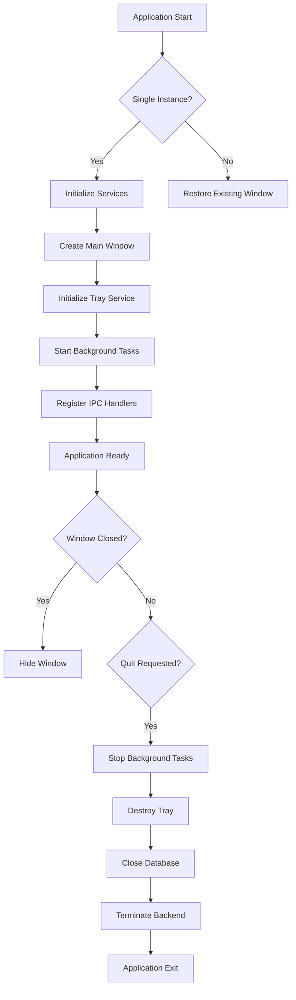
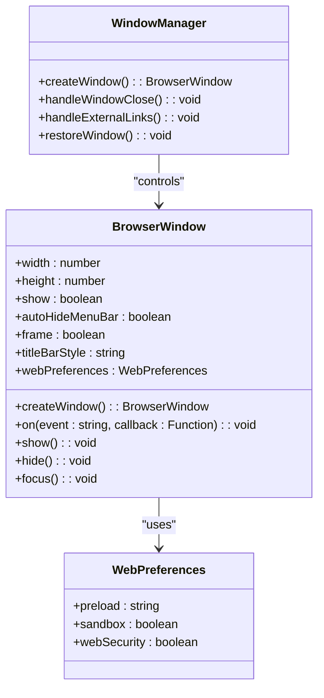
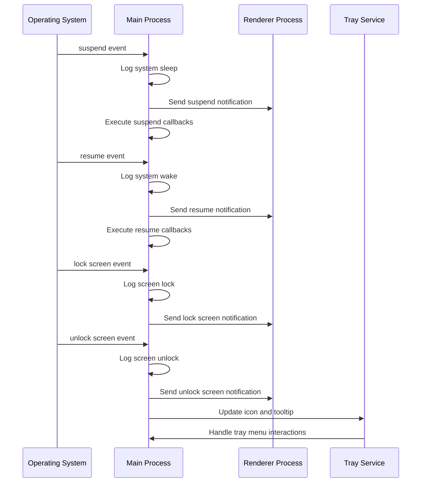
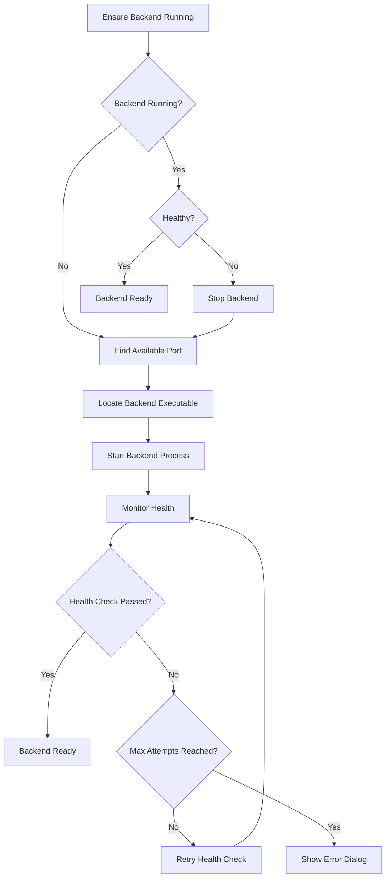
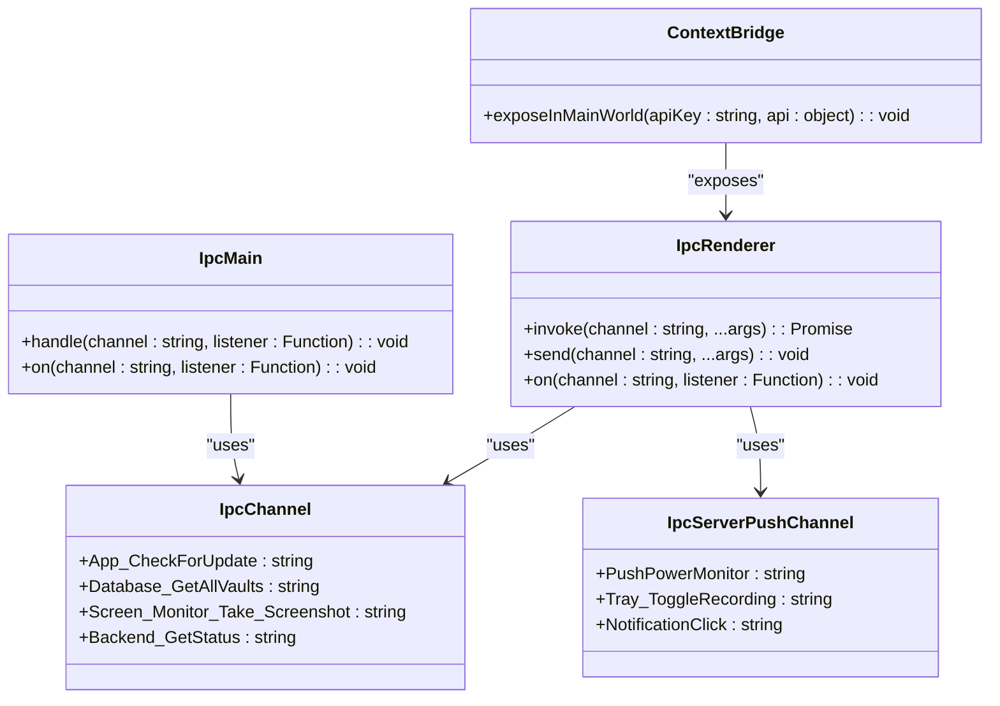
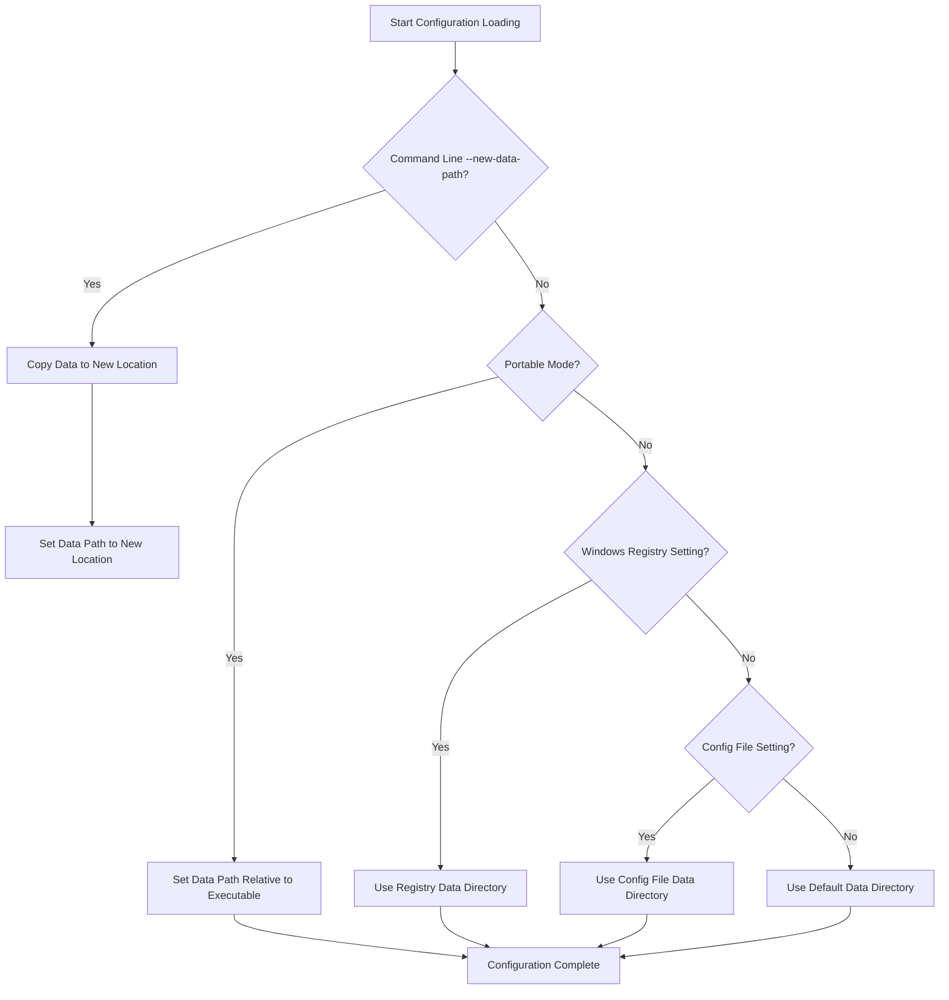
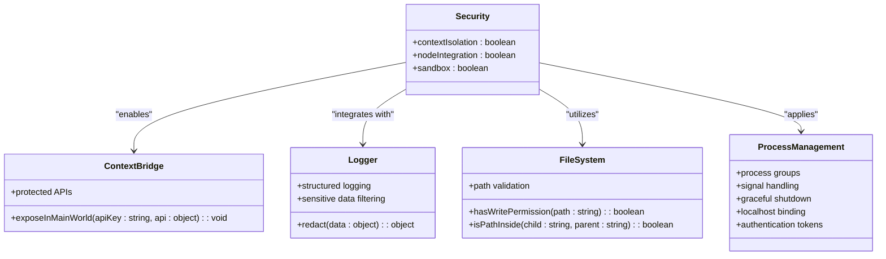

# Main Process

<cite>
**Referenced Files in This Document**   
- [index.ts](file://frontend/src/main/index.ts)
- [bootstrap.ts](file://frontend/src/main/bootstrap.ts)
- [config.ts](file://frontend/src/main/config.ts)
- [backend.ts](file://frontend/src/main/backend.ts)
- [ipc.ts](file://frontend/src/main/ipc.ts)
- [mac-window-manager.ts](file://frontend/src/main/utils/mac-window-manager.ts)
- [TrayService.ts](file://frontend/src/main/services/TrayService.ts)
- [Power.ts](file://frontend/src/main/background/os/Power.ts)
- [init.ts](file://frontend/src/main/utils/init.ts)
- [file.ts](file://frontend/src/main/utils/file.ts)
- [IpcChannel.ts](file://packages/shared/IpcChannel.ts)
- [ipc-server-push-channel.ts](file://packages/shared/ipc-server-push-channel.ts)
- [constant.ts](file://frontend/src/main/constant.ts)
- [logger/main.ts](file://packages/shared/logger/main.ts)
- [logger/init.ts](file://packages/shared/logger/init.ts)
</cite>

## Table of Contents
1. [Introduction](#introduction)
2. [Application Lifecycle Management](#application-lifecycle-management)
3. [Window Creation and Management](#window-creation-and-management)
4. [System-Level Integrations](#system-level-integrations)
5. [Python Backend Lifecycle Management](#python-backend-lifecycle-management)
6. [Inter-Process Communication (IPC)](#inter-process-communication-ipc)
7. [Initialization Sequence](#initialization-sequence)
8. [Configuration Loading](#configuration-loading)
9. [Security Practices](#security-practices)
10. [Common Issues and Debugging](#common-issues-and-debugging)

## Introduction
The Electron main process in MineContext serves as the central orchestrator for the application's core functionality, managing the application lifecycle, window creation, system-level integrations, and communication with the Python backend. This document provides a comprehensive analysis of the main process architecture, detailing its role in coordinating various components and services that enable MineContext's context-aware capabilities. The main process implements robust initialization sequences, secure inter-process communication patterns, and sophisticated system integrations that work together to create a seamless user experience across different operating systems.

**Section sources**
- [index.ts](file://frontend/src/main/index.ts#L1-L348)
- [bootstrap.ts](file://frontend/src/main/bootstrap.ts#L1-L75)
- [config.ts](file://frontend/src/main/config.ts#L1-L14)

## Application Lifecycle Management

The main process in MineContext implements a comprehensive application lifecycle management system that ensures proper initialization, execution, and cleanup of resources. The lifecycle begins with the `app.whenReady()` event, which triggers the creation of the main window and initialization of core services. The application enforces single-instance behavior through `app.requestSingleInstanceLock()`, preventing multiple instances from running simultaneously. When a second instance is detected, the existing window is restored and brought to focus.

The lifecycle management includes sophisticated window behavior where closing the window hides it rather than terminating the application, allowing the app to continue running in the system tray. This behavior is controlled by intercepting the 'close' event on the BrowserWindow and calling `event.preventDefault()` while hiding the window. The application only terminates when explicitly requested through the 'before-quit' event, typically triggered by user action in the tray menu.

During shutdown, the main process executes a thorough cleanup sequence, stopping background tasks, destroying the tray icon, closing database connections, and ensuring the Python backend is properly terminated. This graceful shutdown process prevents resource leaks and ensures data integrity.



**Diagram sources **
- [index.ts](file://frontend/src/main/index.ts#L202-L347)

**Section sources**
- [index.ts](file://frontend/src/main/index.ts#L41-L54)
- [index.ts](file://frontend/src/main/index.ts#L172-L179)
- [index.ts](file://frontend/src/main/index.ts#L297-L347)

## Window Creation and Management

The window creation process in MineContext is implemented in the `createWindow()` function within index.ts, which configures the main BrowserWindow with platform-specific settings. The window is created with a fixed size of 1180x660 pixels and configured with appropriate frame settings for each operating system. On macOS, the application uses a frameless window with a hidden title bar to achieve a native look and feel, while Windows and Linux use standard framed windows.

The window configuration includes important security settings such as disabling web security (`webSecurity: false`) to allow loading of local resources and setting up the preload script that establishes the secure communication channel between the main and renderer processes. The window's web preferences specify the preload script path, which is crucial for implementing context isolation and secure IPC patterns.

Window behavior is further customized through event listeners that handle various scenarios. The 'ready-to-show' event triggers the display of the window and initiates backend services in production mode. The 'close' event is intercepted to hide the window instead of closing it, supporting the tray-based application model. External links are intercepted and opened in the default browser rather than within the application.



**Diagram sources **
- [index.ts](file://frontend/src/main/index.ts#L124-L194)

**Section sources**
- [index.ts](file://frontend/src/main/index.ts#L124-L194)

## System-Level Integrations

MineContext's main process implements several system-level integrations that enhance the application's functionality and user experience. The most significant integration is the system tray functionality, managed by the TrayService class. This service creates a system tray icon with a context menu that allows users to show the main window, toggle recording status, and quit the application. The tray icon dynamically updates its appearance based on the recording state, providing visual feedback to the user.

Another critical system integration is power monitoring, implemented through the Power class in Power.ts. This component uses Electron's powerMonitor API to detect system events such as suspend, resume, lock screen, and unlock screen. When these events occur, the main process notifies the renderer process via IPC, allowing the application to respond appropriately to system state changes. The power monitoring also includes a powerSaveBlocker to prevent the system from suspending during critical operations.

The application also integrates with macOS-specific accessibility features, checking and requesting accessibility permissions when necessary. This integration is essential for screen monitoring and window management capabilities on macOS, where such permissions are required for accessing window information and controlling system behavior.



**Diagram sources **
- [TrayService.ts](file://frontend/src/main/services/TrayService.ts#L12-L296)
- [Power.ts](file://frontend/src/main/background/os/Power.ts#L1-L87)

**Section sources**
- [TrayService.ts](file://frontend/src/main/services/TrayService.ts#L1-L296)
- [Power.ts](file://frontend/src/main/background/os/Power.ts#L1-L87)

## Python Backend Lifecycle Management

The main process manages the Python backend lifecycle through the backend.ts module, which handles the startup, monitoring, and shutdown of the Python-based server component. The backend management system is responsible for locating the appropriate executable, finding an available port, launching the process, and monitoring its health through periodic health checks.

The `ensureBackendRunning()` function serves as the primary entry point for backend management, checking if the backend process is already running and healthy, and starting it if necessary. The system implements a sophisticated port management strategy, using `findAvailablePort()` to locate an unused port starting from 1733, with fallback mechanisms to handle port conflicts. This dynamic port allocation prevents conflicts with other applications and allows multiple instances to run if needed.

Backend process management includes robust error handling and recovery mechanisms. If the backend process crashes or becomes unresponsive, the main process can detect this through failed health checks and automatically restart the service. The shutdown process is equally comprehensive, with both graceful termination attempts and forceful killing of processes that fail to respond to termination signals.

The backend management system also handles platform-specific considerations, such as creating process groups on Unix systems to ensure all child processes are properly terminated. It includes detailed logging of backend operations, with dedicated log files that capture both stdout and stderr output from the Python process, facilitating debugging and troubleshooting.



**Diagram sources **
- [backend.ts](file://frontend/src/main/backend.ts#L1-L740)

**Section sources**
- [backend.ts](file://frontend/src/main/backend.ts#L1-L740)

## Inter-Process Communication (IPC)

The inter-process communication system in MineContext is implemented through Electron's IPC mechanism, with a well-structured channel-based approach defined in IpcChannel.ts. The main process exposes numerous IPC handlers through the `registerIpc()` function in ipc.ts, allowing the renderer process to invoke main process functionality securely.

The IPC architecture follows a request-response pattern for most operations, with the renderer process invoking handlers using `ipcRenderer.invoke()` and the main process responding with the requested data or operation result. For event-driven communication, the system uses a push model where the main process sends notifications to the renderer using `window.webContents.send()`.

The IPC channels are organized into logical groups based on functionality, including application management, system operations, database access, screen monitoring, and backend services. Each channel has a descriptive name that follows a consistent naming convention (e.g., 'app:check-for-update', 'database:get-all-vaults'). This organization makes the API intuitive and easy to understand.

Security is a key consideration in the IPC implementation. The system uses context isolation and the contextBridge API to expose only the necessary functionality to the renderer process, preventing direct access to Node.js APIs. Sensitive operations are validated and sanitized in the main process before execution, ensuring that renderer-initiated requests cannot compromise system security.



**Diagram sources **
- [ipc.ts](file://frontend/src/main/ipc.ts#L45-L610)
- [IpcChannel.ts](file://packages/shared/IpcChannel.ts#L1-L349)
- [ipc-server-push-channel.ts](file://packages/shared/ipc-server-push-channel.ts#L1-L13)

**Section sources**
- [ipc.ts](file://frontend/src/main/ipc.ts#L45-L610)
- [IpcChannel.ts](file://packages/shared/IpcChannel.ts#L1-L349)
- [ipc-server-push-channel.ts](file://packages/shared/ipc-server-push-channel.ts#L1-L13)

## Initialization Sequence

The initialization sequence in MineContext follows a carefully orchestrated order to ensure proper setup of all components. The process begins with the import of bootstrap.ts at the very top of index.ts, which executes critical early initialization tasks before any other code runs. This bootstrap phase handles data directory migration based on command-line parameters, ensuring user data is in the correct location before the application proceeds.

Following the bootstrap phase, the config.ts module is imported, which sets up the application's data path based on the environment (development vs. production) and platform-specific considerations. This configuration step ensures that all subsequent operations use the correct file system locations for storing user data, logs, and configuration files.

The main initialization occurs within the `app.whenReady()` callback, where the following sequence takes place:
1. Protocol handlers are registered for custom URL schemes
2. Application user model ID is set for Windows taskbar integration
3. Development tools are configured based on the environment
4. The main window is created and displayed
5. Debugging tools are opened in development mode
6. System watchers (power monitoring) are started
7. The Python backend is launched in the background
8. The tray service is initialized and created
9. Background tasks for screenshot cleanup and activity monitoring are started
10. IPC handlers are registered to enable communication with the renderer process

This sequential initialization ensures that dependencies are resolved in the correct order and that all services are available before the application becomes fully operational.

```mermaid
flowchart TD
A[Import bootstrap.ts] --> B[Data Directory Migration]
B --> C[Import config.ts]
C --> D[Set Data Path]
D --> E[app.whenReady()]
E --> F[Register Protocol Handlers]
F --> G[Set App User Model ID]
G --> H[Configure Dev Tools]
H --> I[Create Main Window]
I --> J[Open DevTools in Dev Mode]
J --> K[Start Power Monitoring]
K --> L[Launch Python Backend]
L --> M[Initialize Tray Service]
M --> N[Start Background Tasks]
N --> O[Register IPC Handlers]
O --> P[Application Ready]
```

**Diagram sources **
- [index.ts](file://frontend/src/main/index.ts#L7-L348)
- [bootstrap.ts](file://frontend/src/main/bootstrap.ts#L1-L75)
- [config.ts](file://frontend/src/main/config.ts#L1-L14)

**Section sources**
- [index.ts](file://frontend/src/main/index.ts#L7-L348)
- [bootstrap.ts](file://frontend/src/main/bootstrap.ts#L1-L75)
- [config.ts](file://frontend/src/main/config.ts#L1-L14)

## Configuration Loading

Configuration loading in MineContext is handled through a combination of environment variables, command-line arguments, and persistent storage. The primary configuration mechanism is implemented in config.ts and the utils/init.ts module, which work together to determine the appropriate data directory for the application.

The system supports multiple configuration sources with a defined precedence order:
1. Command-line arguments (highest precedence)
2. Registry settings (Windows only)
3. Portable mode configuration
4. Configuration file settings
5. Default system locations (lowest precedence)

The `initAppDataDir()` function in init.ts implements this precedence logic, checking each source in order and using the first valid configuration it finds. For portable installations, the data directory is set relative to the executable location, allowing the application to run from removable media without modifying the host system.

The configuration system also handles data directory migration, allowing users to move their data to a new location through command-line parameters. This feature is implemented in bootstrap.ts, which checks for the '--new-data-path' argument and copies user data from the old location to the new one before the application fully initializes.

Environment-specific configuration is supported through the NODE_ENV variable, with development mode using a separate data directory to prevent interference with the production environment. This separation allows developers to test the application without affecting their regular usage.



**Diagram sources **
- [config.ts](file://frontend/src/main/config.ts#L1-L14)
- [init.ts](file://frontend/src/main/utils/init.ts#L1-L170)
- [bootstrap.ts](file://frontend/src/main/bootstrap.ts#L1-L75)

**Section sources**
- [config.ts](file://frontend/src/main/config.ts#L1-L14)
- [init.ts](file://frontend/src/main/utils/init.ts#L1-L170)
- [bootstrap.ts](file://frontend/src/main/bootstrap.ts#L1-L75)

## Security Practices

MineContext implements several security practices in its main process to protect user data and system resources. The most fundamental security measure is context isolation, which is enabled in the BrowserWindow configuration and enforced through the contextBridge API in the preload script. This isolation prevents the renderer process from accessing Node.js APIs directly, reducing the attack surface for potential security vulnerabilities.

The IPC system follows secure patterns by validating all inputs and sanitizing sensitive information before processing. The logging system, implemented in logger/init.ts, includes automatic redaction of sensitive data through the redact function, ensuring that potentially confidential information is not written to log files. The logs are structured as JSON objects with consistent formatting, making them easier to parse and analyze while maintaining security.

File system operations include permission checks to prevent unauthorized access to user data. The `hasWritePermission()` function in file.ts verifies that the application has the necessary permissions before writing to a directory, preventing errors and potential security issues. Path validation is implemented through the `isPathInside()` function, which prevents directory traversal attacks by ensuring that file operations stay within designated directories.

The application also implements secure process management for the Python backend, using proper process groups on Unix systems and careful signal handling to prevent orphaned processes. The backend communication uses localhost binding (127.0.0.1) to prevent external access to the backend API, and includes authentication tokens for additional protection.



**Diagram sources **
- [index.ts](file://frontend/src/main/index.ts#L143-L147)
- [preload/index.ts](file://frontend/src/preload/index.ts#L124-L132)
- [logger/init.ts](file://packages/shared/logger/init.ts#L63-L113)
- [file.ts](file://frontend/src/main/utils/file.ts#L42-L85)
- [backend.ts](file://frontend/src/main/backend.ts#L62-L63)

**Section sources**
- [index.ts](file://frontend/src/main/index.ts#L143-L147)
- [preload/index.ts](file://frontend/src/preload/index.ts#L124-L132)
- [logger/init.ts](file://packages/shared/logger/init.ts#L63-L113)
- [file.ts](file://frontend/src/main/utils/file.ts#L42-L85)
- [backend.ts](file://frontend/src/main/backend.ts#L62-L63)

## Common Issues and Debugging

The main process in MineContext includes comprehensive debugging and error handling mechanisms to address common issues that may arise during operation. The most common issues include backend startup failures, IPC desynchronization, and permission-related problems, each of which is addressed through specific diagnostic and recovery strategies.

Backend startup failures are handled through a multi-layered approach that includes detailed logging, port conflict resolution, and user-friendly error reporting. When the backend fails to start, the system creates a dedicated log file that captures all stdout and stderr output, making it easier to diagnose the root cause. The error handling includes specific messages for common failure modes such as port conflicts (EADDRINUSE) and connection refused errors, with appropriate remediation steps suggested to the user.

IPC desynchronization issues are mitigated through robust error handling in both the main and renderer processes. The system uses try-catch blocks around all IPC operations and includes fallback mechanisms for critical functionality. The logging system captures all IPC messages and errors, allowing developers to trace communication issues and identify patterns that may indicate deeper problems.

The application includes a sophisticated logging system that captures structured logs in JSON format, making them easier to analyze and search. The logs include timestamps, log levels, scopes, and contextual data, with sensitive information automatically redacted. Different log levels are used for different environments, with debug-level logging in development and more conservative logging in production to balance diagnostic information with performance.

For troubleshooting, the application provides several diagnostic tools, including the ability to open developer tools in development mode, detailed error dialogs with log file references, and system information reporting through the App_Info IPC channel. These tools enable both developers and advanced users to diagnose and resolve issues effectively.

```mermaid
flowchart TD
A[Common Issue Detected] --> B{Issue Type?}
B --> |Backend Startup| C[Check Port Availability]
B --> |IPC Desynchronization| D[Verify Channel Registration]
B --> |Permission Error| E[Check Directory Permissions]
C --> F{Port In Use?}
F --> |Yes| G[Suggest Alternative Port]
F --> |No| H[Check Backend Executable]
H --> I{Executable Found?}
I --> |No| J[Show File Path Error]
I --> |Yes| K[Check Execution Permissions]
D --> L[Verify Handler Registration]
L --> M{Handler Registered?}
M --> |No| N[Check Module Imports]
M --> |Yes| O[Inspect Message Format]
E --> P[Use hasWritePermission()]
P --> Q{Permission Granted?}
Q --> |No| R[Request Elevated Permissions]
Q --> |Yes| S[Proceed with Operation]
G --> T[Detailed Error Logging]
J --> T
K --> T
N --> T
O --> T
R --> T
T --> U[User-Friendly Error Dialog]
U --> V[Include Log File Reference]
```

**Diagram sources **
- [backend.ts](file://frontend/src/main/backend.ts#L39-L79)
- [ipc.ts](file://frontend/src/main/ipc.ts#L159-L179)
- [file.ts](file://frontend/src/main/utils/file.ts#L42-L49)
- [logger/init.ts](file://packages/shared/logger/init.ts#L23-L115)

**Section sources**
- [backend.ts](file://frontend/src/main/backend.ts#L39-L79)
- [ipc.ts](file://frontend/src/main/ipc.ts#L159-L179)
- [file.ts](file://frontend/src/main/utils/file.ts#L42-L49)
- [logger/init.ts](file://packages/shared/logger/init.ts#L23-L115)