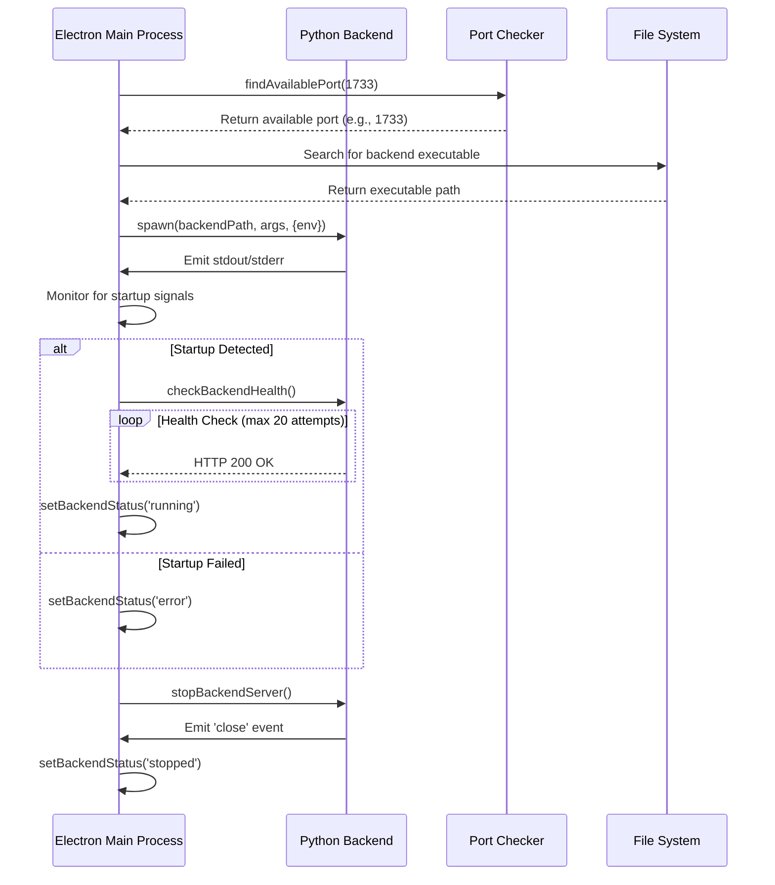
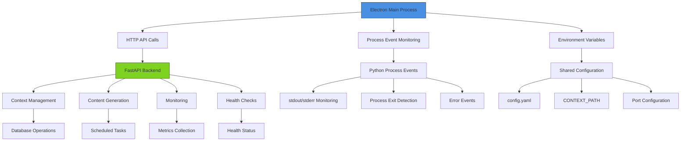

# Python Backend Integration

<cite>
**Referenced Files in This Document**   
- [backend.ts](file://frontend/src/main/backend.ts)
- [native-capture-helper.ts](file://frontend/src/main/utils/native-capture-helper.ts)
- [mac-window-manager.ts](file://frontend/src/main/utils/mac-window-manager.ts)
- [get-capture-sources.ts](file://frontend/src/main/utils/get-capture-sources.ts)
- [env.ts](file://frontend/src/main/utils/env.ts)
- [opencontext.py](file://opencontext/server/opencontext.py)
- [config_manager.py](file://opencontext/config/config_manager.py)
- [config.yaml](file://config/config.yaml)
- [cli.py](file://opencontext/cli.py)
- [window_capture.py](file://frontend/externals/python/window_capture/window_capture.py)
- [window_inspector.py](file://frontend/externals/python/window_inspector/window_inspector.py)
</cite>

## Table of Contents
1. [Introduction](#introduction)
2. [Process Lifecycle Management](#process-lifecycle-management)
3. [Inter-Process Communication](#inter-process-communication)
4. [Native Capture Helper Utilities](#native-capture-helper-utilities)
5. [Practical Examples and Error Handling](#practical-examples-and-error-handling)
6. [Troubleshooting Guide](#troubleshooting-guide)

## Introduction
This document provides a comprehensive overview of the integration between the Electron main process and the Python backend in the MineContext application. It details the architecture, process lifecycle management, inter-process communication mechanisms, and specialized utilities for window capture functionality. The integration enables seamless operation between the Node.js-based Electron frontend and the Python-based backend services, facilitating context capture, processing, and storage.

**Section sources**
- [backend.ts](file://frontend/src/main/backend.ts#L1-L740)
- [opencontext.py](file://opencontext/server/opencontext.py#L1-L300)

## Process Lifecycle Management

The lifecycle of the Python backend process is managed entirely by the Electron main process through the `backend.ts` module. This module orchestrates the startup, monitoring, and shutdown of the Python process, ensuring reliable operation across different platforms and environments.

The process begins with the `ensureBackendRunning` function, which checks the current state of the backend and initiates startup if necessary. Before launching the Python process, the system first identifies an available port by scanning from the default port 1733 upward, preventing port conflicts. This port discovery mechanism uses the `findAvailablePort` function, which attempts to bind to successive ports until an available one is found.

Once a port is secured, the system locates the Python executable through a comprehensive search across multiple potential paths. This search accommodates various deployment scenarios, including packaged applications and development environments. The search algorithm checks numerous possible locations for the backend executable, ensuring compatibility with different build configurations and directory structures.

The actual process startup is handled by the `startBackendServer` function, which spawns the Python process using Node.js's `child_process.spawn` method. The process is configured with specific environment variables, most notably `CONTEXT_PATH`, which points to the application's user data directory. This variable is crucial for the backend to locate configuration files, logs, and persistent data.

During startup, the system monitors both stdout and stderr streams for specific success indicators such as "Uvicorn running on" or "Application startup complete". Upon detecting these signals, the system initiates a health check sequence that polls the backend's `/api/health` endpoint. This health check mechanism includes exponential backoff and retry logic, attempting up to 20 times with 20-second intervals between attempts, providing robust startup verification even on slower systems.

For process termination, the system implements a graceful shutdown sequence. When stopping the backend, it first sends a SIGTERM signal to allow the process to clean up resources. If the process does not terminate within 5 seconds, it escalates to a SIGKILL signal to force termination. Additionally, the system includes a synchronous shutdown method (`stopBackendServerSync`) that is called during application exit, ensuring proper cleanup even in scenarios where asynchronous operations might be interrupted.



**Diagram sources **
- [backend.ts](file://frontend/src/main/backend.ts#L347-L582)
- [opencontext.py](file://opencontext/server/opencontext.py#L272-L299)

**Section sources**
- [backend.ts](file://frontend/src/main/backend.ts#L1-L740)
- [env.ts](file://frontend/src/main/utils/env.ts#L1-L30)

## Inter-Process Communication

The integration between Electron and the Python backend employs a hybrid communication strategy that combines HTTP-based API calls with direct process monitoring. This approach leverages the FastAPI framework in the Python backend to expose a comprehensive REST API, while the Electron main process acts as both a process manager and API client.

The primary communication channel is HTTP-based, with the Electron process making requests to the Python backend's API endpoints. The backend exposes numerous routes for different functionalities, including health checks (`/api/health`), context management, content generation, and monitoring. The `checkBackendHealth` function in `backend.ts` exemplifies this pattern, making periodic HTTP GET requests to verify the backend's operational status.

In addition to HTTP communication, the system uses direct process monitoring through event listeners on the spawned Python process. The Electron main process attaches listeners to the `stdout`, `stderr`, `close`, and `error` events of the child process. This allows real-time monitoring of the backend's status and immediate reaction to startup, shutdown, or error conditions.

The system also implements environment variable-based configuration to facilitate communication and coordination between the processes. The `CONTEXT_PATH` environment variable is particularly important, as it establishes a shared understanding of the application's data directory between the Electron frontend and Python backend. This shared context enables both processes to access configuration files, logs, and persistent storage in a coordinated manner.

Version compatibility is managed through configuration files and runtime checks. The `config.yaml` file contains settings that affect both the frontend and backend behavior, ensuring alignment between the two components. The Python backend's configuration manager loads these settings and performs necessary validation, while the Electron process references the same configuration for its operations.

Error handling in the IPC mechanism is comprehensive, with multiple layers of protection. Network-related errors (ECONNREFUSED, EADDRINUSE) are caught and translated into user-friendly error messages. Process startup failures trigger detailed logging and, in non-development environments, display error dialogs to inform users. The system also includes timeout mechanisms to prevent indefinite waiting during startup or health checks.



**Diagram sources **
- [backend.ts](file://frontend/src/main/backend.ts#L83-L137)
- [opencontext.py](file://opencontext/server/opencontext.py#L272-L299)
- [config.yaml](file://config/config.yaml#L1-L253)

**Section sources**
- [backend.ts](file://frontend/src/main/backend.ts#L1-L740)
- [opencontext.py](file://opencontext/server/opencontext.py#L1-L300)
- [config_manager.py](file://opencontext/config/config_manager.py#L1-L253)
- [config.yaml](file://config/config.yaml#L1-L253)

## Native Capture Helper Utilities

The native capture helper utilities provide platform-specific functionality for window and screen capture, with a particular focus on macOS systems. These utilities are implemented as a combination of Python scripts and Node.js wrappers that work together to overcome the limitations of Electron's built-in capture capabilities.

The core of the capture system consists of two Python utilities: `window_capture.py` and `window_inspector.py`. These scripts leverage macOS's Quartz framework to access window information and capture functionality that is not available through standard Electron APIs. The `window_inspector.py` script uses `CGWindowListCopyWindowInfo` to retrieve detailed information about all windows, including those on other desktop spaces or minimized windows. This information includes window IDs, application names, titles, bounds, and visibility status.

The `window_capture.py` script implements advanced capture techniques using `CGWindowListCreateImage` with various capture options. It employs a multi-strategy approach to capture windows, trying different combinations of capture flags to handle various window types and properties. If direct window capture fails, the script falls back to screen capture with cropping, ensuring maximum compatibility across different applications and window configurations.

On the Node.js side, the `mac-window-manager.ts` module serves as a bridge between Electron and the Python capture utilities. It spawns the Python scripts as child processes and parses their JSON output to provide structured window information to the rest of the application. This module also implements application-specific logic to identify important applications and filter out system windows.

The `native-capture-helper.ts` module provides a pure JavaScript fallback for screen capture using the `node-screenshots` library. This implementation is used when Python-based capture is not available or fails, ensuring that basic screen capture functionality remains operational. The helper class manages the lifecycle of the capture module and provides a consistent interface for screen capture operations.

The integration between these components is orchestrated by the `get-capture-sources.ts` module, which combines information from multiple sources to present a comprehensive list of capture targets. It merges results from Electron's `desktopCapturer` (which only shows visible windows) with information from the Python-based window inspector (which can see windows on other spaces). This creates a unified view of all potential capture sources, including minimized windows of important applications.

```mermaid
classDiagram
class NativeCaptureHelper {
+isRunning : boolean
+screenshots : nodeScreenshots
+initialize() : Promise~void~
+captureScreen(monitorIndex : number) : Promise~CaptureResult~
+captureApp(appName : string) : Promise~CaptureResult~
+shutdown() : Promise~void~
}
class MacWindowManager {
+getAllWindows() : Promise~FinalWindowInfo[]~
}
class CaptureSourcesTools {
+nativeCaptureHelper : NativeCaptureHelper
+getCaptureSourcesTools() : Promise~SourceResult~
+takeSourceScreenshotTools(sourceId : string) : Promise~CaptureResult~
}
class WindowInspector {
+getWindowsWithRealIds() : Promise~QuartzWindowInfo[]~
}
class WindowCapture {
+captureWindow(appName : string, windowId : number) : Promise~Buffer~
}
NativeCaptureHelper --> nodeScreenshots : "uses"
CaptureSourcesTools --> NativeCaptureHelper : "uses"
CaptureSourcesTools --> MacWindowManager : "uses"
MacWindowManager --> WindowInspector : "spawns Python process"
CaptureSourcesTools --> WindowCapture : "spawns Python process"
note right of NativeCaptureHelper
Pure JavaScript implementation
using node-screenshots library
Fallback when Python capture fails
end note
note right of MacWindowManager
Bridges Electron and Python
Spawns window_inspector.py
Parses JSON output
end note
note right of WindowCapture
Python script using Quartz
CGWindowListCreateImage
Multiple capture strategies
Fallback to screen capture + crop
end note
```

**Diagram sources **
- [native-capture-helper.ts](file://frontend/src/main/utils/native-capture-helper.ts#L1-L154)
- [mac-window-manager.ts](file://frontend/src/main/utils/mac-window-manager.ts#L1-L187)
- [get-capture-sources.ts](file://frontend/src/main/utils/get-capture-sources.ts#L1-L775)
- [window_capture.py](file://frontend/externals/python/window_capture/window_capture.py#L1-L221)
- [window_inspector.py](file://frontend/externals/python/window_inspector/window_inspector.py#L1-L133)

**Section sources**
- [native-capture-helper.ts](file://frontend/src/main/utils/native-capture-helper.ts#L1-L154)
- [mac-window-manager.ts](file://frontend/src/main/utils/mac-window-manager.ts#L1-L187)
- [get-capture-sources.ts](file://frontend/src/main/utils/get-capture-sources.ts#L1-L775)

## Practical Examples and Error Handling

The integration between Electron and the Python backend includes comprehensive examples and error handling mechanisms to ensure reliable operation in various scenarios. These examples demonstrate proper startup procedures, environment variable configuration, and recovery from common failure modes.

To start the backend with proper environment variables, the system automatically configures the `CONTEXT_PATH` variable based on the application's execution mode. In development, this points to the current directory, while in production, it uses Electron's `userData` path. The startup sequence automatically discovers an available port and locates the backend executable, minimizing configuration requirements for end users.

When handling crashes, the system implements multiple layers of protection. The `ensureBackendRunning` function periodically checks the backend's health and automatically restarts it if it becomes unresponsive. The process monitoring includes detection of abnormal exit codes, which triggers restart attempts and detailed logging. For persistent failures, the system creates comprehensive debug logs that include timestamps, platform information, and error details to aid in troubleshooting.

Version alignment is maintained through the configuration system, which uses the `config.yaml` file as a single source of truth for settings that affect both frontend and backend behavior. The Python backend's configuration manager loads this file and performs environment variable substitution, ensuring that both components operate with consistent settings. The system also includes fallback mechanisms for missing configuration values, preventing startup failures due to incomplete configuration.

Common issues are addressed through specific handling in the codebase. For Python environment mismatches, the system uses bundled Python executables rather than relying on system Python installations, eliminating dependency on specific Python versions or packages. Port conflicts are resolved through the dynamic port allocation system that scans for available ports starting from 1733. Permission errors on macOS are handled by requesting screen recording permissions through Electron's `systemPreferences.askForMediaAccess` method when necessary.

The error handling system translates low-level technical errors into user-friendly messages. Network errors like ECONNREFUSED are presented as "connection refused" issues, while EADDRINUSE errors are shown as "port already in use" messages. Backend crashes during startup trigger detailed error dialogs that include the path to the debug log file, enabling users to provide comprehensive information when reporting issues.

```mermaid
flowchart TD
A[Start Backend] --> B{Development Mode?}
B --> |Yes| C[Set CONTEXT_PATH to '.'}
B --> |No| D[Set CONTEXT_PATH to userData]
C --> E[Find Available Port]
D --> E
E --> F[Locate Backend Executable]
F --> G[Spawn Python Process]
G --> H{Process Output}
H --> |Startup Signals| I[Start Health Checks]
H --> |Error| J[Log Error, Show Dialog]
I --> K{Health Check Success?}
K --> |Yes| L[Mark as Running]
K --> |No| M[Retry or Fail]
M --> N{Max Attempts Reached?}
N --> |No| O[Wait, Retry]
N --> |Yes| P[Show Startup Error]
L --> Q[Monitor Process]
Q --> R{Process Crashes?}
R --> |Yes| S[Restart Backend]
R --> |No| T[Continue Monitoring]
style A fill:#f9f,stroke:#333
style L fill:#8f8,stroke:#333
style P fill:#f88,stroke:#333
style S fill:#ff9,stroke:#333
```

**Diagram sources **
- [backend.ts](file://frontend/src/main/backend.ts#L316-L345)
- [env.ts](file://frontend/src/main/utils/env.ts#L1-L30)
- [config.yaml](file://config/config.yaml#L1-L253)

**Section sources**
- [backend.ts](file://frontend/src/main/backend.ts#L1-L740)
- [config.yaml](file://config/config.yaml#L1-L253)

## Troubleshooting Guide

This section addresses common issues encountered in the Electron-Python backend integration, with platform-specific guidance for diagnosis and resolution.

**Python Environment Mismatches**: The application bundles its own Python environment, eliminating the need for system Python installations. If Python-related errors occur, verify that the bundled executables in the `externals/python` directory are intact and have proper execute permissions. On Unix-like systems, ensure the executables are marked as executable using `chmod +x`.

**Port Conflicts**: The system automatically detects and avoids port conflicts by scanning for available ports starting from 1733. If port-related errors persist, check for other instances of the application running simultaneously or other applications using ports in the 1733+ range. The `lsof -ti:1733` command on macOS/Linux or `netstat -ano | findstr :1733` on Windows can identify processes using specific ports.

**Permission Errors on macOS**: Screen capture functionality requires explicit screen recording permissions. If capture fails, ensure the application has permission in System Preferences > Security & Privacy > Screen Recording. The application will prompt for this permission when needed, but it may need to be granted manually if the prompt is missed. Additionally, ensure the application has accessibility permissions if window management features are required.

**Windows-Specific Issues**: On Windows, process management uses `taskkill /F` to forcefully terminate processes when graceful shutdown fails. Ensure the application has sufficient privileges to terminate processes. Antivirus software may interfere with process spawning or termination; add the application directory to antivirus exclusions if issues persist.

**Linux Considerations**: On Linux systems, ensure that the appropriate display server (X11 or Wayland) dependencies are installed. The application may require additional packages for screen capture functionality, such as `libx11-dev` or `libxtst-dev`. Check that the user has permission to access the display server.

**General Troubleshooting Steps**:
1. Check the debug logs in the application's userData directory under the `debug` folder
2. Verify that all required files exist in the expected locations, particularly the backend executables
3. Ensure sufficient disk space and proper file permissions in the application directory
4. Restart the application completely, ensuring no background processes remain
5. Reinstall the application if file corruption is suspected

The system generates comprehensive debug logs that include platform information, Node.js and Electron versions, and detailed error messages. These logs are invaluable for diagnosing issues and should be included when reporting problems.

**Section sources**
- [backend.ts](file://frontend/src/main/backend.ts#L259-L313)
- [get-capture-sources.ts](file://frontend/src/main/utils/get-capture-sources.ts#L336-L345)
- [config.yaml](file://config/config.yaml#L1-L253)