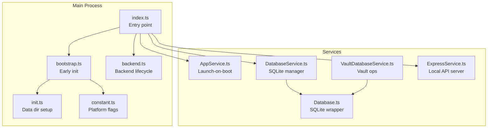
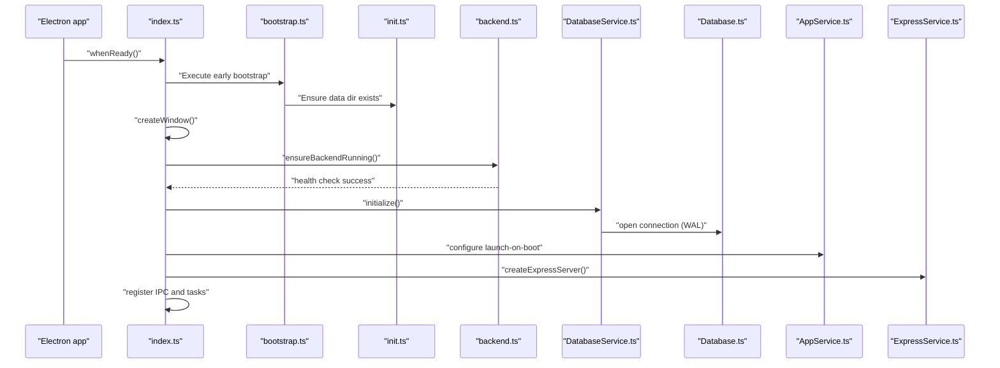
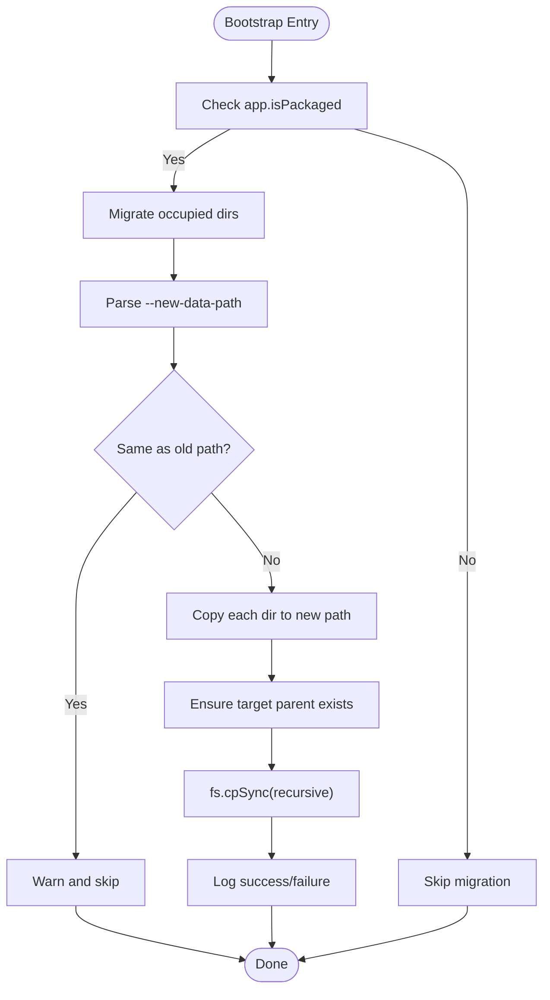
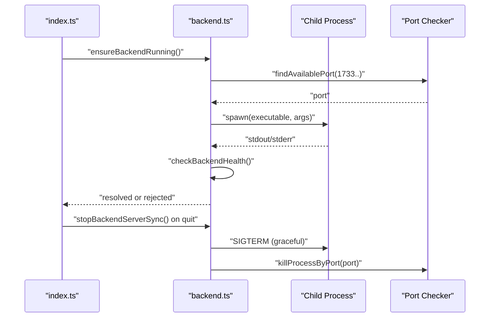
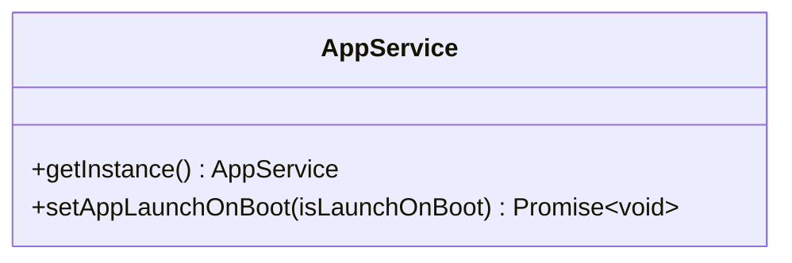
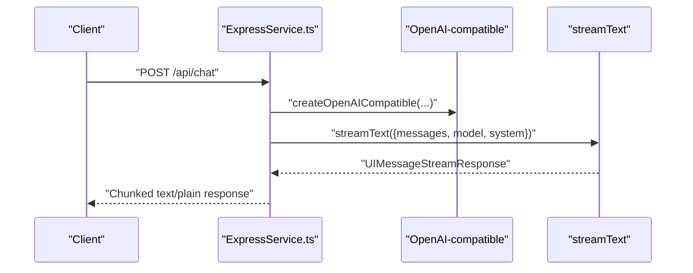
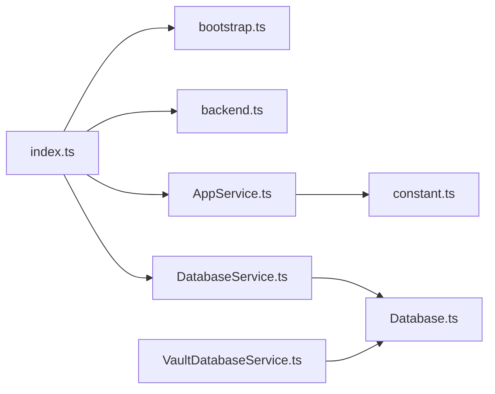

# Service Orchestration

<cite>
**Referenced Files in This Document**
- [index.ts](file://frontend/src/main/index.ts)
- [bootstrap.ts](file://frontend/src/main/bootstrap.ts)
- [init.ts](file://frontend/src/main/utils/init.ts)
- [constant.ts](file://frontend/src/main/constant.ts)
- [backend.ts](file://frontend/src/main/backend.ts)
- [AppService.ts](file://frontend/src/main/services/AppService.ts)
- [Database.ts](file://frontend/src/main/services/Database.ts)
- [DatabaseService.ts](file://frontend/src/main/services/DatabaseService.ts)
- [VaultDatabaseService.ts](file://frontend/src/main/services/VaultDatabaseService.ts)
- [ExpressService.ts](file://frontend/src/main/services/ExpressService.ts)
- [schema.sql](file://frontend/src/main/db/schema.sql)
</cite>

## Table of Contents
1. [Introduction](#introduction)
2. [Project Structure](#project-structure)
3. [Core Components](#core-components)
4. [Architecture Overview](#architecture-overview)
5. [Detailed Component Analysis](#detailed-component-analysis)
6. [Dependency Analysis](#dependency-analysis)
7. [Performance Considerations](#performance-considerations)
8. [Troubleshooting Guide](#troubleshooting-guide)
9. [Conclusion](#conclusion)

## Introduction
This document explains the service orchestration layer in the main process, focusing on the initialization sequence, service startup order, dependency management, and lifecycle handling. It covers:
- Bootstrap initialization and early data directory preparation
- Application-level settings management (launch-on-boot)
- Database integration with SQLite and schema initialization
- Local API hosting via ExpressService
- Practical examples of service lifecycle management, error handling during startup, and graceful shutdown
- Monitoring and recovery strategies for common issues such as database connection failures, port conflicts, and race conditions

## Project Structure
The main process orchestrates services through a clear entry point and supporting utilities:
- Entry and bootstrap: index.ts and bootstrap.ts
- Backend orchestration: backend.ts (external backend lifecycle)
- Services: AppService.ts, Database.ts, DatabaseService.ts, VaultDatabaseService.ts, ExpressService.ts
- Utilities: init.ts (data directory setup), constant.ts (platform detection)



**Diagram sources**
- [index.ts](file://frontend/src/main/index.ts#L1-L348)
- [bootstrap.ts](file://frontend/src/main/bootstrap.ts#L1-L75)
- [backend.ts](file://frontend/src/main/backend.ts#L1-L740)
- [init.ts](file://frontend/src/main/utils/init.ts#L1-L170)
- [constant.ts](file://frontend/src/main/constant.ts#L1-L11)
- [AppService.ts](file://frontend/src/main/services/AppService.ts#L1-L87)
- [Database.ts](file://frontend/src/main/services/Database.ts#L1-L192)
- [DatabaseService.ts](file://frontend/src/main/services/DatabaseService.ts#L1-L364)
- [VaultDatabaseService.ts](file://frontend/src/main/services/VaultDatabaseService.ts#L1-L412)
- [ExpressService.ts](file://frontend/src/main/services/ExpressService.ts#L1-L112)

**Section sources**
- [index.ts](file://frontend/src/main/index.ts#L1-L348)
- [bootstrap.ts](file://frontend/src/main/bootstrap.ts#L1-L75)
- [backend.ts](file://frontend/src/main/backend.ts#L1-L740)
- [init.ts](file://frontend/src/main/utils/init.ts#L1-L170)
- [constant.ts](file://frontend/src/main/constant.ts#L1-L11)

## Core Components
- Bootstrap and early initialization: Ensures app data directory is prepared before any windows are created and migrates occupied directories when requested.
- Backend orchestration: Manages an external backend process lifecycle, including port selection, health checks, and graceful shutdown.
- AppService: Provides platform-aware launch-on-boot configuration.
- Database layer: Robust SQLite wrapper and manager with WAL mode, pragmas, and safe exit hooks; vault operations built on top.
- ExpressService: Minimal local API server for streaming chat responses.

**Section sources**
- [bootstrap.ts](file://frontend/src/main/bootstrap.ts#L1-L75)
- [backend.ts](file://frontend/src/main/backend.ts#L1-L740)
- [AppService.ts](file://frontend/src/main/services/AppService.ts#L1-L87)
- [Database.ts](file://frontend/src/main/services/Database.ts#L1-L192)
- [DatabaseService.ts](file://frontend/src/main/services/DatabaseService.ts#L1-L364)
- [VaultDatabaseService.ts](file://frontend/src/main/services/VaultDatabaseService.ts#L1-L412)
- [ExpressService.ts](file://frontend/src/main/services/ExpressService.ts#L1-L112)

## Architecture Overview
The main process initializes early, sets up platform-specific data directories, and then proceeds to:
- Create the main window
- Start the backend process (if applicable)
- Initialize services (database, app settings, and local API)
- Register IPC handlers and background tasks



**Diagram sources**
- [index.ts](file://frontend/src/main/index.ts#L196-L295)
- [bootstrap.ts](file://frontend/src/main/bootstrap.ts#L1-L75)
- [init.ts](file://frontend/src/main/utils/init.ts#L1-L170)
- [backend.ts](file://frontend/src/main/backend.ts#L315-L583)
- [DatabaseService.ts](file://frontend/src/main/services/DatabaseService.ts#L35-L109)
- [Database.ts](file://frontend/src/main/services/Database.ts#L33-L66)
- [AppService.ts](file://frontend/src/main/services/AppService.ts#L27-L81)
- [ExpressService.ts](file://frontend/src/main/services/ExpressService.ts#L9-L37)

## Detailed Component Analysis

### Bootstrap and Early Initialization
- Executes before creating windows to prepare the app data directory and migrate occupied directories when a new data path is provided.
- Uses Electron’s command line parser to read switches and performs cross-platform migration safely.



**Diagram sources**
- [bootstrap.ts](file://frontend/src/main/bootstrap.ts#L1-L75)

**Section sources**
- [bootstrap.ts](file://frontend/src/main/bootstrap.ts#L1-L75)
- [init.ts](file://frontend/src/main/utils/init.ts#L1-L170)
- [constant.ts](file://frontend/src/main/constant.ts#L1-L11)

### Backend Orchestration (External Process)
- Selects an available port, spawns the backend executable from multiple possible locations, and monitors startup via health checks.
- Implements graceful shutdown with SIGTERM and fallback SIGKILL, plus port cleanup.



**Diagram sources**
- [index.ts](file://frontend/src/main/index.ts#L196-L295)
- [backend.ts](file://frontend/src/main/backend.ts#L39-L137)
- [backend.ts](file://frontend/src/main/backend.ts#L315-L583)
- [backend.ts](file://frontend/src/main/backend.ts#L203-L314)
- [backend.ts](file://frontend/src/main/backend.ts#L616-L740)

**Section sources**
- [backend.ts](file://frontend/src/main/backend.ts#L1-L740)
- [index.ts](file://frontend/src/main/index.ts#L196-L295)

### AppService: Launch-on-Boot Management
- Provides a singleton interface to configure launch-on-boot across platforms:
  - Windows/macOS via Electron’s login item settings
  - Linux via autostart desktop file management
- Handles AppImage scenarios and writes/removes desktop entries conditionally.



**Diagram sources**
- [AppService.ts](file://frontend/src/main/services/AppService.ts#L1-L87)

**Section sources**
- [AppService.ts](file://frontend/src/main/services/AppService.ts#L1-L87)

### Database Layer: SQLite Integration and Schema Initialization
- Database wrapper (Database.ts):
  - Singleton pattern with lazy initialization
  - Applies SQLite pragmas for performance and reliability
  - Sets up exit hooks for clean shutdown
- Database manager (DatabaseService.ts):
  - Ensures database directory exists with retries
  - Initializes SQLite connection and enables WAL mode
  - Checks and prepares tables (placeholder for schema)
- Vault operations (VaultDatabaseService.ts):
  - Provides CRUD and query helpers for vaults using the shared DB wrapper

```mermaid
classDiagram
class DB {
+getInstance(dbName, dbPath) DB
+insert(table, data) RunResult
+update(table, data, where) RunResult
+upsert(table, data, conflictTarget) RunResult
+query(sql, params) T[]
+queryOne(sql, params) T
+execute(sql, params) RunResult
+close() void
}
class DatabaseManager {
-db Database
-dbPath string
-isInitialized boolean
-initPromise Promise~void~
+initialize() Promise~void~
-waitForDatabaseDirectory() Promise~void~
-ensureTablesExist() void
+close() void
}
class VaultDatabaseService {
+queryVaults(options) Vault[]
+getVaults() Vault[]
+getVaultById(id) Vault
+getVaultsByDocumentType(types) Vault[]
+getVaultsByParentId(parentId) Vault[]
+getFolders() Vault[]
+getVaultByTitle(title) Vault[]
+insertVault(vault) { id }
+updateVaultById(id, data) { changes }
+softDeleteVaultById(id) { changes }
+restoreVaultById(id) { changes }
+hardDeleteVaultById(id) { changes }
+createFolder(title, parentId?) { id }
+deleteVaultById(id) { changes }
+getVaultsInTimeRange(from,to,limit,offset) Vault[]
+getVaultsByTypesAndTimeRange(types,from,to,limit,offset) Vault[]
+getRecentlyUpdatedVaults(days,limit) Vault[]
+getVaultsByFolderAndTimeRange(parentId,from,to,limit) Vault[]
}
DatabaseManager --> DB : "uses"
VaultDatabaseService --> DB : "uses"
```

**Diagram sources**
- [Database.ts](file://frontend/src/main/services/Database.ts#L1-L192)
- [DatabaseService.ts](file://frontend/src/main/services/DatabaseService.ts#L1-L109)
- [VaultDatabaseService.ts](file://frontend/src/main/services/VaultDatabaseService.ts#L1-L114)

**Section sources**
- [Database.ts](file://frontend/src/main/services/Database.ts#L1-L192)
- [DatabaseService.ts](file://frontend/src/main/services/DatabaseService.ts#L1-L109)
- [VaultDatabaseService.ts](file://frontend/src/main/services/VaultDatabaseService.ts#L1-L114)
- [schema.sql](file://frontend/src/main/db/schema.sql#L1-L61)

### ExpressService: Local API Hosting
- Creates an Express server with JSON/URL-encoded middleware and CORS support
- Exposes a streaming chat endpoint that integrates with an OpenAI-compatible provider
- Streams responses back to clients and handles errors



**Diagram sources**
- [ExpressService.ts](file://frontend/src/main/services/ExpressService.ts#L9-L112)

**Section sources**
- [ExpressService.ts](file://frontend/src/main/services/ExpressService.ts#L1-L112)

## Dependency Analysis
- index.ts depends on bootstrap.ts for early initialization, backend.ts for backend lifecycle, and services for runtime orchestration.
- DatabaseService.ts depends on Database.ts for the underlying SQLite connection.
- VaultDatabaseService.ts depends on Database.ts for SQL operations.
- AppService.ts depends on platform flags from constant.ts and Electron’s app APIs.
- backend.ts encapsulates process spawning and port management.



**Diagram sources**
- [index.ts](file://frontend/src/main/index.ts#L1-L348)
- [bootstrap.ts](file://frontend/src/main/bootstrap.ts#L1-L75)
- [backend.ts](file://frontend/src/main/backend.ts#L1-L740)
- [AppService.ts](file://frontend/src/main/services/AppService.ts#L1-L87)
- [Database.ts](file://frontend/src/main/services/Database.ts#L1-L192)
- [DatabaseService.ts](file://frontend/src/main/services/DatabaseService.ts#L1-L364)
- [VaultDatabaseService.ts](file://frontend/src/main/services/VaultDatabaseService.ts#L1-L412)
- [constant.ts](file://frontend/src/main/constant.ts#L1-L11)

**Section sources**
- [index.ts](file://frontend/src/main/index.ts#L1-L348)
- [DatabaseService.ts](file://frontend/src/main/services/DatabaseService.ts#L1-L364)
- [Database.ts](file://frontend/src/main/services/Database.ts#L1-L192)
- [VaultDatabaseService.ts](file://frontend/src/main/services/VaultDatabaseService.ts#L1-L412)
- [AppService.ts](file://frontend/src/main/services/AppService.ts#L1-L87)
- [constant.ts](file://frontend/src/main/constant.ts#L1-L11)

## Performance Considerations
- DatabaseService enables WAL mode and applies pragmas for concurrency and durability.
- Database wrapper caches prepared statements to reduce overhead.
- Backend orchestration uses health checks and timeouts to detect readiness efficiently.
- ExpressService streams responses to minimize latency and memory usage.

[No sources needed since this section provides general guidance]

## Troubleshooting Guide

### Database Connection Failures
Symptoms:
- Initialization throws directory not found after retries
- Queries fail due to uninitialized state

Mitigations:
- Ensure the database directory exists before initialization
- Use the initialization guard to prevent concurrent initialization
- Confirm WAL mode and pragmas are applied

Monitoring and recovery:
- Log directory existence and retries
- Re-throw initialization errors for upstream handling
- Close connections on shutdown to release locks

**Section sources**
- [DatabaseService.ts](file://frontend/src/main/services/DatabaseService.ts#L49-L87)
- [DatabaseService.ts](file://frontend/src/main/services/DatabaseService.ts#L89-L109)
- [Database.ts](file://frontend/src/main/services/Database.ts#L33-L66)

### Port Conflicts in ExpressService
Symptoms:
- Port already in use or connection refused
- Health checks failing for backend

Mitigations:
- Use a dedicated port range and automatic selection
- Implement port availability checks before binding
- Graceful shutdown and port cleanup

Monitoring and recovery:
- Log port selection and conflicts
- Attempt health checks with retries and timeouts
- Kill lingering processes on the port post-shutdown

**Section sources**
- [backend.ts](file://frontend/src/main/backend.ts#L39-L80)
- [backend.ts](file://frontend/src/main/backend.ts#L203-L314)
- [backend.ts](file://frontend/src/main/backend.ts#L616-L740)

### Race Conditions During Service Initialization
Symptoms:
- Concurrent initialization causing duplicate connections
- Data directory not yet created when DB opens

Mitigations:
- Use a single initialization promise to serialize setup
- Wait for directory existence with bounded retries
- Ensure bootstrap runs before window creation

Monitoring and recovery:
- Log initialization steps and outcomes
- Fail fast on missing prerequisites
- Provide clear error messages for diagnostics

**Section sources**
- [DatabaseService.ts](file://frontend/src/main/services/DatabaseService.ts#L35-L47)
- [bootstrap.ts](file://frontend/src/main/bootstrap.ts#L70-L75)

### Graceful Shutdown Procedures
- Backend: Send SIGTERM, wait, then SIGKILL if needed; kill processes on the port
- Frontend: Close database, stop backend, cancel timers, destroy tray
- Express: Close server when shutting down

**Section sources**
- [backend.ts](file://frontend/src/main/backend.ts#L203-L314)
- [backend.ts](file://frontend/src/main/backend.ts#L616-L740)
- [index.ts](file://frontend/src/main/index.ts#L324-L347)
- [DatabaseService.ts](file://frontend/src/main/services/DatabaseService.ts#L351-L359)

## Conclusion
The service orchestration layer coordinates early initialization, backend lifecycle, database setup, and local API hosting with robust error handling and graceful shutdown. By centralizing lifecycle management and applying defensive patterns (guards, retries, health checks), the system remains resilient under real-world conditions. Use the provided monitoring and recovery strategies to diagnose and remediate common issues effectively.