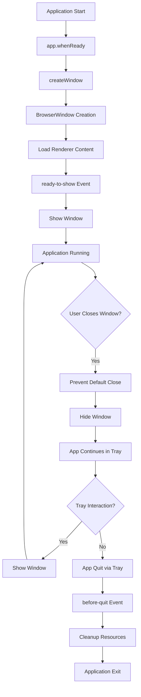
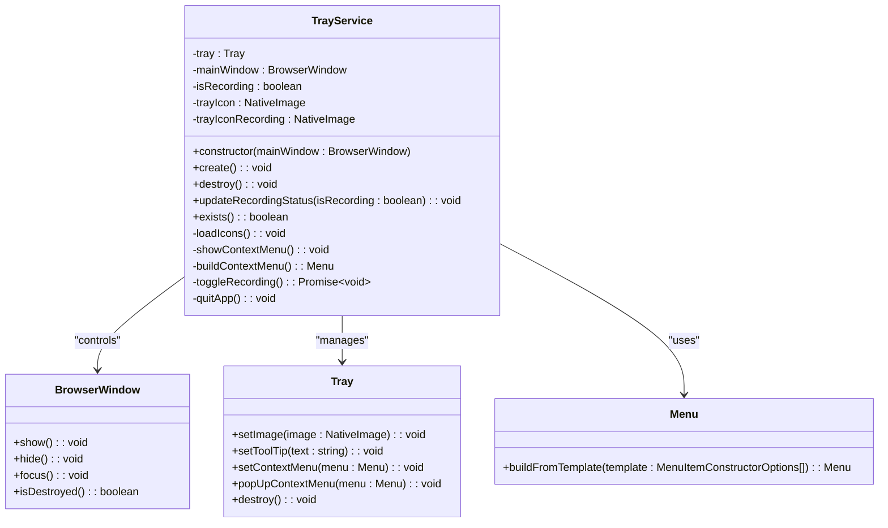
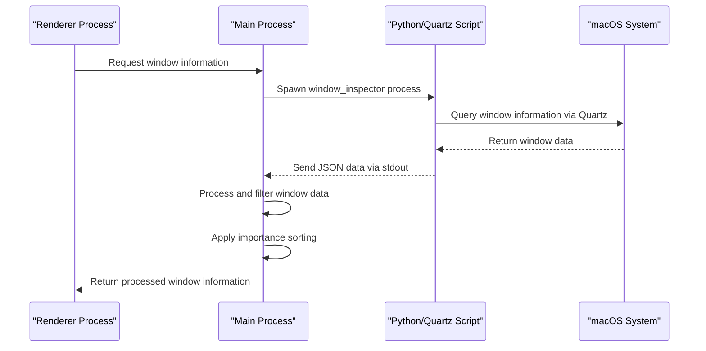
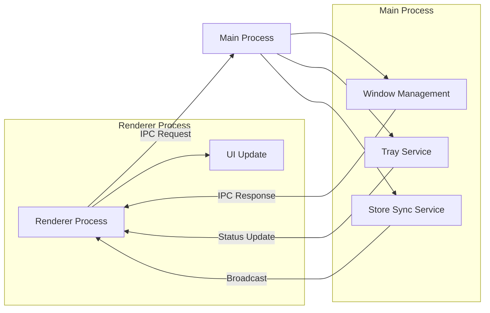

# Window Management

<cite>
**Referenced Files in This Document**   
- [index.ts](file://frontend/src/main/index.ts)
- [mac-window-manager.ts](file://frontend/src/main/utils/mac-window-manager.ts)
- [TrayService.ts](file://frontend/src/main/services/TrayService.ts)
- [ipc.ts](file://frontend/src/main/ipc.ts)
- [constant.ts](file://frontend/src/main/constant.ts)
- [IpcChannel.ts](file://frontend/packages/shared/IpcChannel.ts)
</cite>

## Table of Contents
1. [Introduction](#introduction)
2. [Main Window Lifecycle](#main-window-lifecycle)
3. [System Tray Integration](#system-tray-integration)
4. [Platform-Specific Window Management](#platform-specific-window-management)
5. [Renderer Process Integration](#renderer-process-integration)
6. [Cross-Platform Considerations](#cross-platform-considerations)
7. [Common Issues and Debugging Strategies](#common-issues-and-debugging-strategies)
8. [Best Practices](#best-practices)

## Introduction
The window management subsystem in the Electron main process of MineContext handles the creation, lifecycle management, and platform-specific behaviors of application windows. This document details how windows are managed through the main process, focusing on the main window lifecycle, system tray integration, and macOS-specific window management. The architecture ensures the application remains responsive while providing consistent user experience across platforms.

## Main Window Lifecycle

The main window lifecycle is managed through a well-defined sequence of events and handlers in the Electron main process. The `createWindow` function in `index.ts` initializes the main application window with platform-specific configurations, including frameless windows on macOS with hidden title bars and standard framed windows on Windows/Linux.

Window creation is triggered during the `app.whenReady()` event, where the main window is instantiated with predefined dimensions (1180x660) and configured with appropriate web preferences including preload scripts. The window is initially created with `show: false` to prevent flickering during initialization, and only displayed after the `ready-to-show` event fires, ensuring all content is loaded.

A key aspect of the window lifecycle is the interception of the close event. Instead of destroying the window when the user attempts to close it, the application hides the window using `event.preventDefault()` and `mainWindow.hide()`. This allows the application to continue running in the background, accessible via the system tray. The window can be restored through various triggers including tray interactions or application activation.

The application handles multiple instances through Electron's single instance lock mechanism. When a second instance is detected, the existing window is restored, brought to the foreground, and focused, ensuring only one instance runs at a time.

**Diagram sources**
- [index.ts](file://frontend/src/main/index.ts#L124-L179)
- [index.ts](file://frontend/src/main/index.ts#L271-L284)

**Section sources**
- [index.ts](file://frontend/src/main/index.ts#L124-L179)
- [index.ts](file://frontend/src/main/index.ts#L271-L284)

## System Tray Integration

The system tray integration is implemented through the `TrayService` class, which provides a consistent interface for managing the application's presence in the system tray across different operating systems. The service is initialized with the main window reference and handles tray icon creation, context menu management, and recording status updates.

Tray icon management is platform-specific, with different icon formats and sizes used for each operating system. On macOS, PNG icons are loaded and resized to 18x18 pixels with template image settings to ensure proper appearance against both light and dark menu bars. Windows uses 32x32 pixel icons for high-DPI support, while Linux uses a standard 16x16 pixel icon.

The tray service implements different interaction patterns based on the platform. On Windows, left-clicking the tray icon shows the main window, while right-click displays the context menu. On macOS and Linux, clicking the tray icon directly shows the context menu. The context menu displays the current recording status and provides options to show the main window, toggle recording, and quit the application.

The tray service integrates with the window visibility system by updating the tray icon and tooltip based on the recording status. When recording is active, the icon changes to a recording state indicator, and the tooltip reflects the current status. This provides immediate visual feedback to users about the application's state.

**Diagram sources**
- [TrayService.ts](file://frontend/src/main/services/TrayService.ts#L12-L293)

**Section sources**
- [TrayService.ts](file://frontend/src/main/services/TrayService.ts#L12-L293)
- [index.ts](file://frontend/src/main/index.ts#L62-L64)
- [index.ts](file://frontend/src/main/index.ts#L261-L264)

## Platform-Specific Window Management

The window management system implements specialized behaviors for macOS through the `mac-window-manager.ts` utility, which addresses platform-specific requirements for window visibility and focus handling. This module uses a combination of Python scripts and Electron APIs to gather comprehensive window information that is not accessible through standard Electron methods.

The macOS window management system leverages the Quartz framework via a Python subprocess to obtain detailed information about all application windows, including those on other desktop spaces or minimized windows. The `getWindowsWithRealIds` function spawns a Python executable that uses the Quartz framework to enumerate windows and returns structured JSON data containing window IDs, application names, titles, bounds, and visibility status.

This approach is necessary because Electron's built-in `desktopCapturer` API has limitations on macOS, particularly regarding windows on other desktop spaces and minimized windows. By using the Quartz framework directly, the application can accurately determine which applications have visible windows across all desktop spaces, enabling more sophisticated window management decisions.

The system maintains lists of important applications (such as Zoom, Slack, and Visual Studio Code) and system applications (such as MineContext and SystemUIServer) to filter and prioritize window information. Important applications are given higher priority in the results, and window titles are normalized for consistency. The system also handles edge cases such as applications with no window title by generating appropriate default titles based on the application name.

**Diagram sources**
- [mac-window-manager.ts](file://frontend/src/main/utils/mac-window-manager.ts#L54-L85)
- [mac-window-manager.ts](file://frontend/src/main/utils/mac-window-manager.ts#L94-L175)

**Section sources**
- [mac-window-manager.ts](file://frontend/src/main/utils/mac-window-manager.ts#L1-L187)
- [get-capture-sources.ts](file://frontend/src/main/utils/get-capture-sources.ts)
- [get-visible-source.ts](file://frontend/src/main/utils/get-visible-source.ts)

## Renderer Process Integration

The integration between the main process and renderer process is facilitated through Electron's Inter-Process Communication (IPC) system, with well-defined channels for window management operations. The `IpcChannel` enum defines a comprehensive set of communication channels that enable bidirectional communication between the processes.

Key IPC channels for window management include `Tray_UpdateRecordingStatus`, `Tray_Show`, and `Tray_Hide`, which allow the renderer process to control tray visibility and update its status. The main process handles these channels in the `ipc.ts` file, where the `registerIpc` function sets up handlers for each channel.

The system implements a store synchronization mechanism through the `StoreSyncService`, which allows state changes in one window to be broadcast to other windows. This is particularly important for maintaining consistent UI state across multiple windows and ensuring that window management actions are properly coordinated.

The renderer process can also influence window behavior through console logging interception. When the main process redirects `console.log` to send messages to the renderer via `mainWindow.webContents.send('main-log', ...)`, it enables centralized logging that can be displayed in the application UI, providing transparency into window management operations.

**Diagram sources**
- [ipc.ts](file://frontend/src/main/ipc.ts#L45-L580)
- [IpcChannel.ts](file://frontend/packages/shared/IpcChannel.ts)
- [StoreSyncService.ts](file://frontend/src/main/services/StoreSyncService.ts)

**Section sources**
- [ipc.ts](file://frontend/src/main/ipc.ts#L45-L580)
- [index.ts](file://frontend/src/main/index.ts#L150-L159)
- [StoreSyncService.ts](file://frontend/src/main/services/StoreSyncService.ts)

## Cross-Platform Considerations

The window management system implements several cross-platform considerations to ensure consistent behavior across different operating systems while respecting platform-specific conventions. The application detects the current platform using constants defined in `constant.ts` and adjusts its behavior accordingly.

On macOS, the application uses a frameless window with a hidden title bar (`titleBarStyle: 'hidden'`) to achieve a modern, native appearance. The traffic light buttons are positioned at coordinates {x: 12, y: 12} to provide adequate spacing from the window edge. This design follows macOS Human Interface Guidelines for applications that want to provide a custom window chrome experience.

On Windows, the application uses standard window controls with a visible frame. The tray interaction model differs from macOS, with left-click showing the window and right-click showing the context menu, which aligns with Windows user expectations for system tray applications.

The system handles application lifecycle differences between platforms. On macOS, the application continues running when all windows are closed, following the standard macOS application model where the application remains active in the dock and menu bar. On Windows and Linux, the application would typically quit when the last window closes, but MineContext overrides this behavior to maintain tray functionality.

File path handling and permissions are also managed with cross-platform considerations. The application uses Node.js `path` module utilities to ensure proper path resolution across platforms, and implements platform-specific methods for checking write permissions and resolving paths.

**Section sources**
- [index.ts](file://frontend/src/main/index.ts#L133-L142)
- [constant.ts](file://frontend/src/main/constant.ts)
- [TrayService.ts](file://frontend/src/main/services/TrayService.ts#L128-L148)

## Common Issues and Debugging Strategies

Several common issues can arise in the window management subsystem, particularly related to platform-specific behaviors and resource management. One common issue is window visibility state inconsistency, where the application window may not appear when expected. This can be caused by the window being hidden rather than closed, and can be debugged by checking the window's visibility state through the Electron DevTools.

Another common issue is tray icon display problems, particularly on high-DPI displays. This can be addressed by ensuring the correct icon sizes are used for each platform and that the icons are properly scaled. The application logs tray icon creation status, which can help diagnose loading issues.

Permission-related issues, particularly on macOS, can prevent proper window detection. The `mac-window-manager.ts` module includes comprehensive error handling and logging to help diagnose issues with the Python subprocess or Quartz framework access. Checking the application's accessibility permissions through System Preferences is often necessary to resolve these issues.

Resource cleanup is critical for preventing memory leaks. The application implements proper cleanup in the `before-quit` event handler, where it stops scheduled tasks, destroys the tray service, and closes database connections. Developers should ensure that all event listeners are properly removed and that references to windows are cleared when they are no longer needed.

Debugging strategies include enabling detailed logging through the application's logger system, using Electron DevTools to inspect window properties, and monitoring the application's behavior through the comprehensive logging system that records window show/hide events, tray interactions, and system events.

**Section sources**
- [index.ts](file://frontend/src/main/index.ts#L324-L347)
- [mac-window-manager.ts](file://frontend/src/main/utils/mac-window-manager.ts#L180-L185)
- [TrayService.ts](file://frontend/src/main/services/TrayService.ts#L95-L97)

## Best Practices

Effective window management in Electron applications requires adherence to several best practices. First, always use the `ready-to-show` event to show windows only after content is fully loaded, preventing flickering and improving user experience.

Second, implement proper resource cleanup in the `before-quit` event handler to ensure all timers, services, and connections are properly terminated before the application exits. This prevents resource leaks and ensures a clean shutdown.

Third, use platform-specific UI patterns to provide a native user experience. This includes using appropriate window styles, tray interactions, and system integration that follow each platform's human interface guidelines.

Fourth, implement comprehensive error handling and logging for all window management operations, particularly for platform-specific code that may fail due to missing permissions or system configuration.

Fifth, use Electron's single instance lock mechanism to prevent multiple instances of the application from running simultaneously, ensuring consistent state management.

Finally, optimize performance by minimizing the frequency of window information queries and caching results when appropriate, particularly for resource-intensive operations like enumerating all system windows on macOS.

**Section sources**
- [index.ts](file://frontend/src/main/index.ts)
- [TrayService.ts](file://frontend/src/main/services/TrayService.ts)
- [mac-window-manager.ts](file://frontend/src/main/utils/mac-window-manager.ts)