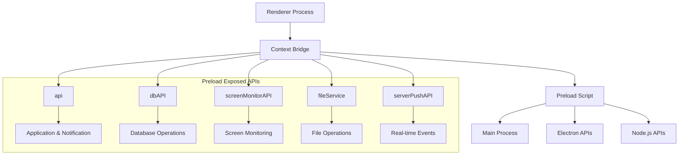
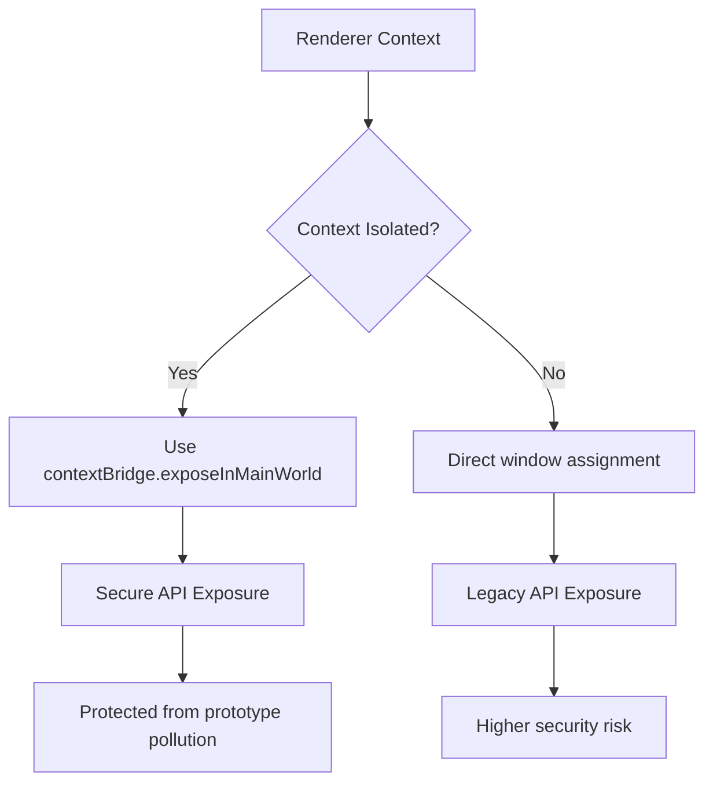
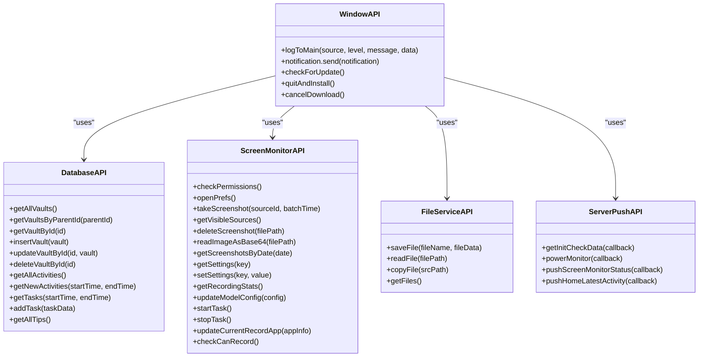
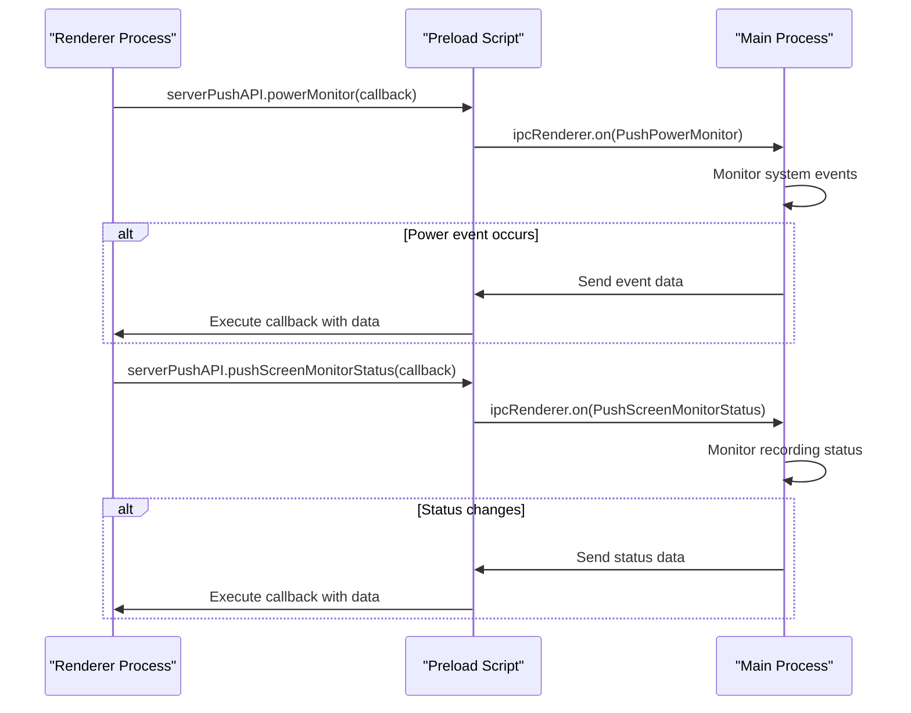
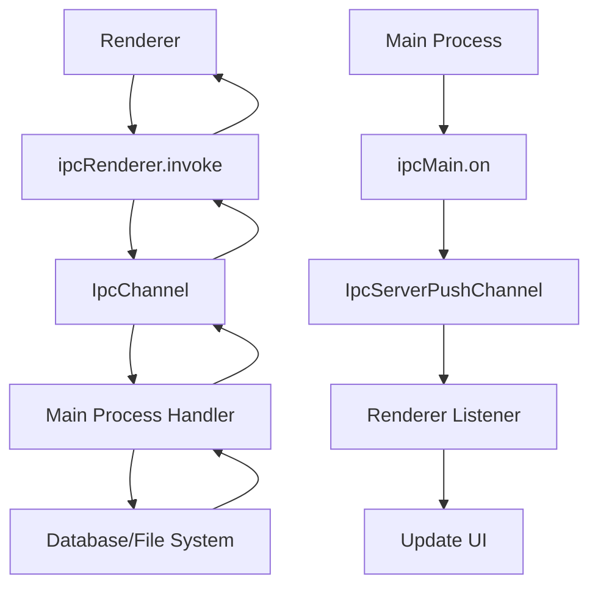

# Preload Script

<cite>
**Referenced Files in This Document**   
- [index.ts](file://frontend/src/preload/index.ts)
- [server-push-api.tsx](file://frontend/src/preload/server-push-api.tsx)
- [IpcChannel.ts](file://frontend/packages/shared/IpcChannel.ts)
- [ipc-server-push-channel.ts](file://frontend/packages/shared/ipc-server-push-channel.ts)
- [index.d.ts](file://frontend/src/preload/index.d.ts)
- [ipc.ts](file://frontend/src/main/ipc.ts)
- [index.ts](file://frontend/src/main/index.ts)
</cite>

## Table of Contents
1. [Introduction](#introduction)
2. [Preload Script Architecture](#preload-script-architecture)
3. [Context Isolation and Security](#context-isolation-and-security)
4. [API Exposure Mechanism](#api-exposure-mechanism)
5. [Server Push API Implementation](#server-push-api-implementation)
6. [IPC Channel Integration](#ipc-channel-integration)
7. [Event Subscription Patterns](#event-subscription-patterns)
8. [Data Serialization and Type Safety](#data-serialization-and-type-safety)
9. [Security Considerations](#security-considerations)
10. [Common Issues and Debugging](#common-issues-and-debugging)

## Introduction
The preload script in this Electron application serves as a secure bridge between the main and renderer processes, enabling controlled access to Node.js and Electron APIs while maintaining context isolation. This document details the implementation of the preload script, focusing on how it exposes limited APIs to the renderer context, handles real-time IPC events, and facilitates communication with backend services through well-defined IPC channels.

## Preload Script Architecture
The preload script architecture is designed to securely expose specific Electron and Node.js functionalities to the renderer process while preventing direct access to potentially dangerous APIs. The architecture consists of multiple API objects that are selectively exposed through the context bridge, each serving a specific domain of functionality.



**Diagram sources**
- [index.ts](file://frontend/src/preload/index.ts#L17-L156)
- [main/index.ts](file://frontend/src/main/index.ts#L144-L148)

**Section sources**
- [index.ts](file://frontend/src/preload/index.ts#L1-L157)
- [main/index.ts](file://frontend/src/main/index.ts#L124-L150)

## Context Isolation and Security
The preload script implements Electron's context isolation feature to create a secure boundary between the renderer process and Node.js/Electron APIs. This security model prevents the renderer from directly accessing potentially dangerous APIs while allowing controlled access through the context bridge.

The implementation checks the `process.contextIsolated` flag and uses `contextBridge.exposeInMainWorld()` when context isolation is enabled. This approach ensures that only explicitly exposed APIs are available to the renderer process, preventing prototype pollution and other security vulnerabilities.



**Diagram sources**
- [index.ts](file://frontend/src/preload/index.ts#L124-L151)

**Section sources**
- [index.ts](file://frontend/src/preload/index.ts#L124-L151)
- [index.d.ts](file://frontend/src/preload/index.d.ts#L8-L47)

## API Exposure Mechanism
The preload script exposes a comprehensive set of APIs to the renderer process through well-defined objects that map to specific functional domains. Each API object contains methods that invoke IPC channels defined in IpcChannel.ts, creating a clean separation between the interface and implementation.

The exposure mechanism uses Electron's `contextBridge` to safely expose these APIs to the renderer context. The main API objects include:

- **api**: Application-level functionality including logging, notifications, and update management
- **dbAPI**: Database operations for vaults, activities, tasks, and tips
- **screenMonitorAPI**: Screen monitoring and screenshot capture functionality
- **fileService**: File operations including saving, reading, and copying
- **serverPushAPI**: Real-time event subscription for server push notifications



**Diagram sources**
- [index.ts](file://frontend/src/preload/index.ts#L17-L119)
- [IpcChannel.ts](file://frontend/packages/shared/IpcChannel.ts#L4-L348)

**Section sources**
- [index.ts](file://frontend/src/preload/index.ts#L17-L119)
- [IpcChannel.ts](file://frontend/packages/shared/IpcChannel.ts#L4-L348)

## Server Push API Implementation
The serverPushAPI implementation handles real-time IPC events from the main process, enabling the renderer to receive push notifications for various application events. This implementation follows a subscription pattern where the renderer registers callback functions that are invoked when specific events occur in the main process.

The serverPushAPI provides methods for subscribing to events such as initialization data, power monitoring events, screen monitor status changes, and home page latest activity updates. Each method accepts a callback function that will be executed when the corresponding event is received.



**Diagram sources**
- [server-push-api.tsx](file://frontend/src/preload/server-push-api.tsx#L9-L46)
- [ipc-server-push-channel.ts](file://frontend/packages/shared/ipc-server-push-channel.ts#L4-L12)

**Section sources**
- [server-push-api.tsx](file://frontend/src/preload/server-push-api.tsx#L9-L46)
- [ipc-server-push-channel.ts](file://frontend/packages/shared/ipc-server-push-channel.ts#L4-L12)

## IPC Channel Integration
The preload script integrates with the main process through a comprehensive set of IPC channels defined in IpcChannel.ts. These channels provide a standardized interface for communication between the renderer and main processes, ensuring type safety and consistency across the application.

The integration follows a request-response pattern for most operations, where the renderer invokes an IPC handler in the main process and receives a promise that resolves with the result. For real-time events, the integration uses an event subscription pattern where the renderer registers listeners for specific events.



**Diagram sources**
- [index.ts](file://frontend/src/preload/index.ts#L17-L119)
- [ipc.ts](file://frontend/src/main/ipc.ts#L45-L610)
- [IpcChannel.ts](file://frontend/packages/shared/IpcChannel.ts#L4-L348)
- [ipc-server-push-channel.ts](file://frontend/packages/shared/ipc-server-push-channel.ts#L4-L12)

**Section sources**
- [index.ts](file://frontend/src/preload/index.ts#L17-L119)
- [ipc.ts](file://frontend/src/main/ipc.ts#L45-L610)

## Event Subscription Patterns
The preload script implements event subscription patterns for handling real-time updates from the main process. These patterns follow the observer pattern, where the renderer subscribes to specific events and provides callback functions that are executed when those events occur.

The serverPushAPI provides methods for subscribing to various events, each returning an unsubscribe function that can be used to clean up event listeners. This pattern ensures proper resource management and prevents memory leaks.

```mermaid
flowchart LR
A[Renderer Component] --> B[useEffect]
B --> C[Subscribe to Event]
C --> D[serverPushAPI.method(callback)]
D --> E[Store Unsubscribe Function]
E --> F[Cleanup on Unmount]
F --> G[Return Unsubscribe]
```

**Section sources**
- [server-push-api.tsx](file://frontend/src/preload/server-push-api.tsx#L9-L46)
- [App.tsx](file://frontend/src/renderer/src/App.tsx#L95-L101)
- [event-loop.atom.tsx](file://frontend/src/renderer/src/atom/event-loop.atom.tsx#L24-L26)

## Data Serialization and Type Safety
The preload script ensures data serialization and type safety through TypeScript interfaces and proper data handling. The implementation uses TypeScript types to define the structure of data passed between processes, ensuring compile-time type checking and reducing runtime errors.

The index.d.ts file provides type definitions for the exposed APIs, enabling type checking in the renderer process. This approach ensures that developers have proper IntelliSense and type checking when using the preload APIs.

```mermaid
classDiagram
class WindowApiType {
+logToMain : (source : LogSourceWithContext, level : LogLevel, message : string, data : any[]) => Promise<void>
+notification : { send : (notification : Notification) => Promise<void> }
+storeSync : { subscribe : () => Promise<void>, unsubscribe : () => Promise<void>, onUpdate : (action : any) => Promise<void> }
+onWindowShow : (callback : () => void) => () => void
+onAppActivate : (callback : () => void) => () => void
+checkForUpdate : () => Promise<any>
+quitAndInstall : () => Promise<void>
+cancelDownload : () => Promise<void>
}
class Window {
+electron : ElectronAPI
+api : WindowApiType
+dbAPI : DbAPIType
+screenMonitorAPI : ScreenMonitorAPIType
+fileService : FileServiceAPIType
+serverPushAPI : ServerPushAPIType
}
WindowApiType <|-- Window : "extends"
```

**Diagram sources**
- [index.d.ts](file://frontend/src/preload/index.d.ts#L8-L47)
- [index.ts](file://frontend/src/preload/index.ts#L156-L157)

**Section sources**
- [index.d.ts](file://frontend/src/preload/index.d.ts#L8-L47)
- [index.ts](file://frontend/src/preload/index.ts#L156-L157)

## Security Considerations
The preload script implementation addresses several security considerations to protect against common vulnerabilities in Electron applications:

1. **Context Isolation**: Enabled by default, preventing prototype pollution and ensuring a secure boundary between contexts
2. **Sandboxing**: Disabled in this implementation but could be enabled for additional security
3. **Input Validation**: All IPC handlers in the main process should validate input data before processing
4. **Error Handling**: Comprehensive error handling in the serverPushAPI to prevent crashes from malformed events
5. **Resource Cleanup**: Proper cleanup of event listeners to prevent memory leaks

The implementation avoids exposing dangerous Node.js APIs directly to the renderer process, instead providing a controlled interface through the context bridge. This approach minimizes the attack surface while still providing necessary functionality.

**Section sources**
- [index.ts](file://frontend/src/preload/index.ts#L124-L151)
- [server-push-api.tsx](file://frontend/src/preload/server-push-api.tsx#L14-L45)

## Common Issues and Debugging
Common issues with preload scripts and their solutions include:

1. **Context Bridge Errors**: Occur when context isolation is misconfigured. Ensure `contextIsolation: true` in webPreferences and use `contextBridge.exposeInMainWorld()`.

2. **Missing API Exposure**: Verify that the API is properly exposed in the preload script and that the corresponding IPC handler is registered in the main process.

3. **Type Errors**: Ensure that TypeScript types in index.d.ts match the actual implementation in index.ts.

4. **Event Listener Memory Leaks**: Always return and call the unsubscribe function returned by serverPushAPI methods.

5. **IPC Timeout Issues**: Implement proper error handling for IPC invocations that may fail due to main process unresponsiveness.

Debugging preload script failures can be done by:
- Checking the renderer console for errors
- Verifying that the preload script is properly loaded in webPreferences
- Ensuring that all required modules are properly imported
- Validating that IPC channel names match between preload and main process
- Using Electron's built-in developer tools to inspect the global namespace

**Section sources**
- [index.ts](file://frontend/src/preload/index.ts#L124-L151)
- [server-push-api.tsx](file://frontend/src/preload/server-push-api.tsx#L14-L45)
- [main/index.ts](file://frontend/src/main/index.ts#L144-L148)
- [ipc.ts](file://frontend/src/main/ipc.ts#L45-L610)