# AI Assistant Interfaces

<cite>
**Referenced Files in This Document**   
- [use-ai-assistant.ts](file://frontend/src/renderer/src/hooks/use-ai-assistant.ts)
- [use-chat-stream.ts](file://frontend/src/renderer/src/hooks/use-chat-stream.ts)
- [ChatStreamService.ts](file://frontend/src/renderer/src/services/ChatStreamService.ts)
- [index.tsx](file://frontend/src/renderer/src/components/ai-assistant/index.tsx)
- [chat-history-list.tsx](file://frontend/src/renderer/src/components/ai-assistant/chat-history-list.tsx)
- [chat-history-list-item.tsx](file://frontend/src/renderer/src/components/ai-assistant/chat-history-list-item.tsx)
- [conversation.tsx](file://frontend/src/renderer/src/components/ai-elements/conversation.tsx)
- [response.tsx](file://frontend/src/renderer/src/components/ai-elements/response.tsx)
- [prompt-input.tsx](file://frontend/src/renderer/src/components/ai-elements/prompt-input.tsx)
- [message.tsx](file://frontend/src/renderer/src/components/ai-elements/message.tsx)
- [sources.tsx](file://frontend/src/renderer/src/components/ai-elements/sources.tsx)
- [inline-citation.tsx](file://frontend/src/renderer/src/components/ai-elements/inline-citation.tsx)
- [tool.tsx](file://frontend/src/renderer/src/components/ai-elements/tool.tsx)
</cite>

## Table of Contents
1. [Introduction](#introduction)
2. [AI Assistant Architecture Overview](#ai-assistant-architecture-overview)
3. [Core Components Analysis](#core-components-analysis)
4. [Chat History Management](#chat-history-management)
5. [Message Display and Conversation Flow](#message-display-and-conversation-flow)
6. [Streaming Service Implementation](#streaming-service-implementation)
7. [Interactive Features Implementation](#interactive-features-implementation)
8. [Error Handling and Resilience](#error-handling-and-resilience)
9. [Performance Optimization](#performance-optimization)
10. [Conclusion](#conclusion)

## Introduction
This document provides a comprehensive analysis of the AI assistant interface components within the renderer process of the application. It details the architecture, integration, and implementation of various UI components that enable users to interact with the AI assistant. The documentation covers the chat history rendering system, message display mechanisms, conversation flow management, real-time streaming capabilities, and interactive features such as prompt input, citation display, and tool execution visualization. The analysis also includes error handling strategies for stream interruptions and parsing failures, as well as performance optimization techniques for rendering large conversation histories.

## AI Assistant Architecture Overview
The AI assistant interface is implemented as a React-based component system within the renderer process, following a modular architecture that separates concerns between state management, UI rendering, and backend communication. The architecture consists of three main layers: the UI components layer, the hooks layer for state management, and the services layer for backend integration.

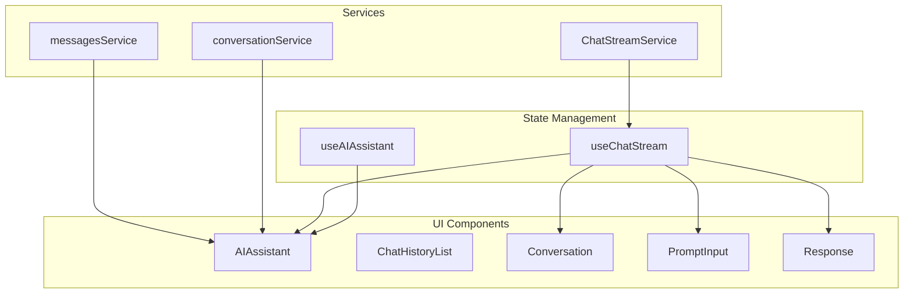

**Diagram sources**
- [use-ai-assistant.ts](file://frontend/src/renderer/src/hooks/use-ai-assistant.ts)
- [use-chat-stream.ts](file://frontend/src/renderer/src/hooks/use-chat-stream.ts)
- [ChatStreamService.ts](file://frontend/src/renderer/src/services/ChatStreamService.ts)
- [index.tsx](file://frontend/src/renderer/src/components/ai-assistant/index.tsx)

**Section sources**
- [use-ai-assistant.ts](file://frontend/src/renderer/src/hooks/use-ai-assistant.ts)
- [use-chat-stream.ts](file://frontend/src/renderer/src/hooks/use-chat-stream.ts)
- [ChatStreamService.ts](file://frontend/src/renderer/src/services/ChatStreamService.ts)

## Core Components Analysis
The AI assistant interface is built around several core components that work together to provide a seamless user experience. These components are organized in a hierarchical structure with the main AIAssistant component serving as the container for all other elements.

### AI Assistant Component
The AIAssistant component serves as the main container for the AI assistant interface, managing the overall state and layout of the assistant panel. It integrates various sub-components and coordinates their interactions through state management hooks.

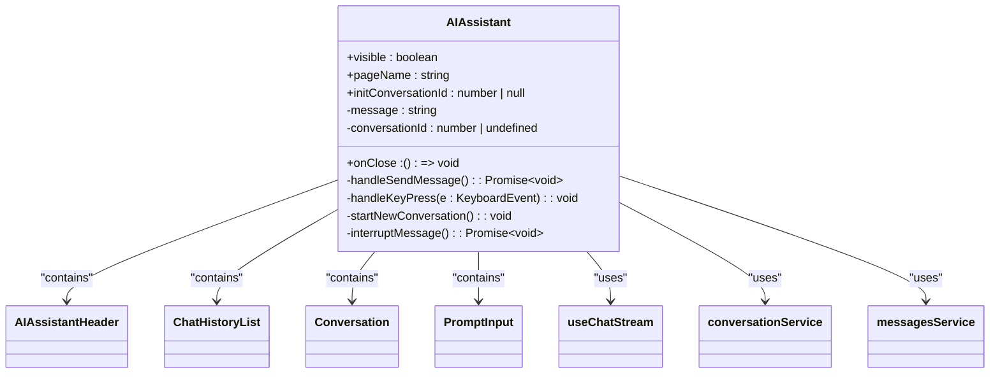

**Diagram sources**
- [index.tsx](file://frontend/src/renderer/src/components/ai-assistant/index.tsx)

**Section sources**
- [index.tsx](file://frontend/src/renderer/src/components/ai-assistant/index.tsx)

### State Management Hooks
The AI assistant interface utilizes two primary custom hooks for state management: useAIAssistant and useChatStream. These hooks encapsulate the logic for managing the assistant's visibility state and chat streaming functionality, respectively.

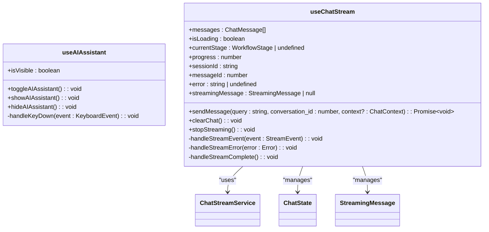

**Diagram sources**
- [use-ai-assistant.ts](file://frontend/src/renderer/src/hooks/use-ai-assistant.ts)
- [use-chat-stream.ts](file://frontend/src/renderer/src/hooks/use-chat-stream.ts)

**Section sources**
- [use-ai-assistant.ts](file://frontend/src/renderer/src/hooks/use-ai-assistant.ts)
- [use-chat-stream.ts](file://frontend/src/renderer/src/hooks/use-chat-stream.ts)

## Chat History Management
The chat history management system provides users with the ability to view, navigate, and manage their conversation history with the AI assistant. This system consists of two main components: ChatHistoryList and ChatHistoryListItem.

### Chat History List
The ChatHistoryList component renders a list of previous conversations, allowing users to quickly access and resume past discussions. It displays a summary of each conversation and provides navigation controls.

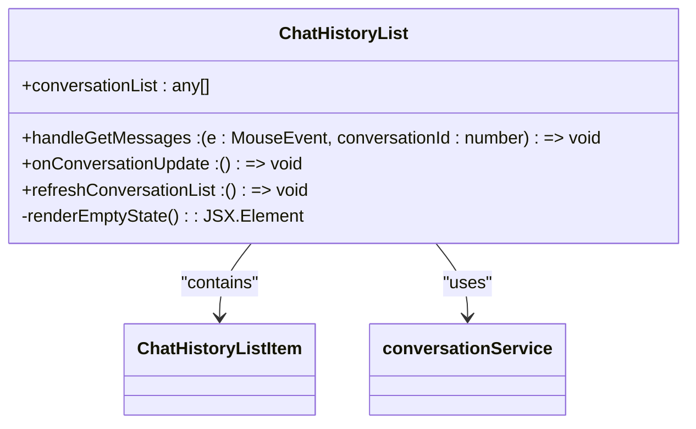

**Diagram sources**
- [chat-history-list.tsx](file://frontend/src/renderer/src/components/ai-assistant/chat-history-list.tsx)

**Section sources**
- [chat-history-list.tsx](file://frontend/src/renderer/src/components/ai-assistant/chat-history-list.tsx)
- [chat-history-list-item.tsx](file://frontend/src/renderer/src/components/ai-assistant/chat-history-list-item.tsx)

### Chat History List Item
The ChatHistoryListItem component represents an individual conversation in the chat history list. It provides controls for interacting with each conversation, including renaming and deletion functionality.

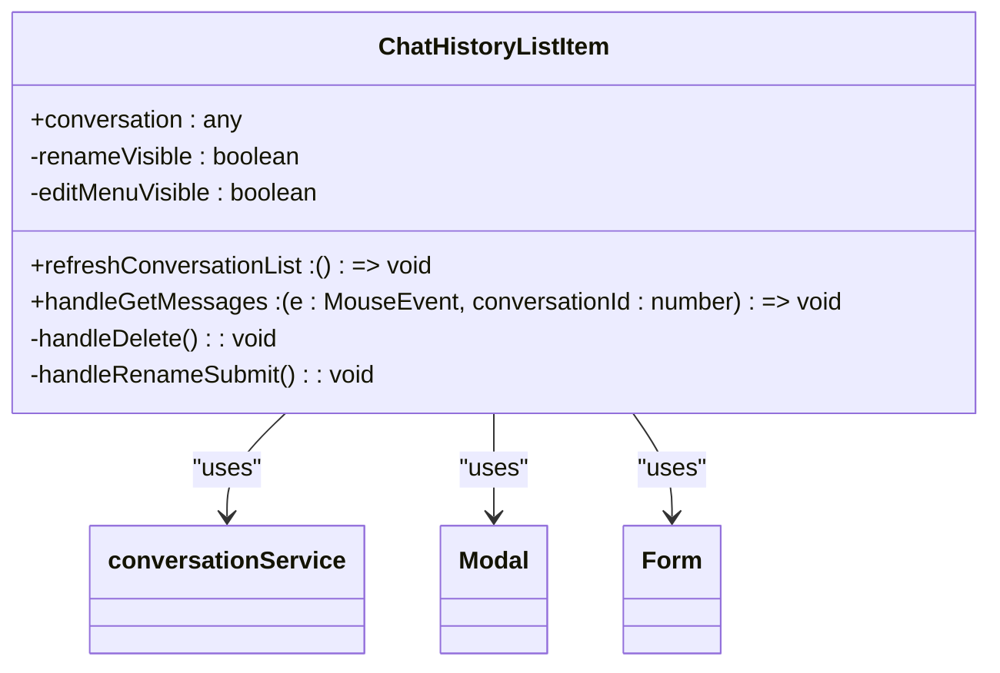

**Diagram sources**
- [chat-history-list-item.tsx](file://frontend/src/renderer/src/components/ai-assistant/chat-history-list-item.tsx)

**Section sources**
- [chat-history-list-item.tsx](file://frontend/src/renderer/src/components/ai-assistant/chat-history-list-item.tsx)

## Message Display and Conversation Flow
The message display and conversation flow components are responsible for rendering the chat interface where users can view the conversation with the AI assistant and input new messages.

### Conversation Component
The Conversation component manages the scrollable area where messages are displayed. It implements auto-scrolling behavior to keep the latest messages visible and provides a scroll-to-bottom button when the user has scrolled up.

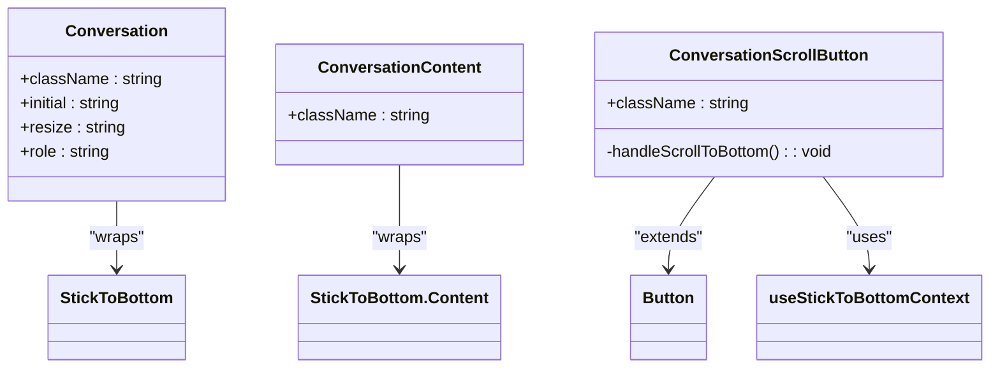

**Diagram sources**
- [conversation.tsx](file://frontend/src/renderer/src/components/ai-elements/conversation.tsx)

**Section sources**
- [conversation.tsx](file://frontend/src/renderer/src/components/ai-elements/conversation.tsx)

### Message and Response Components
The Message and Response components handle the rendering of individual messages in the conversation. The Message component manages the layout and styling of messages based on their sender, while the Response component handles the streaming display of AI responses.

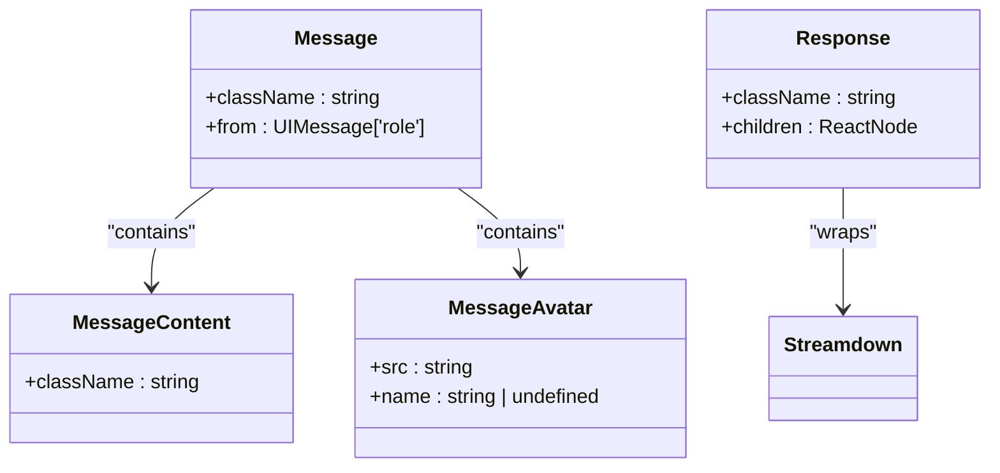

**Diagram sources**
- [message.tsx](file://frontend/src/renderer/src/components/ai-elements/message.tsx)
- [response.tsx](file://frontend/src/renderer/src/components/ai-elements/response.tsx)

**Section sources**
- [message.tsx](file://frontend/src/renderer/src/components/ai-elements/message.tsx)
- [response.tsx](file://frontend/src/renderer/src/components/ai-elements/response.tsx)

## Streaming Service Implementation
The streaming service implementation enables real-time communication between the frontend and backend, allowing for the progressive display of AI-generated responses as they are produced.

### ChatStreamService
The ChatStreamService class handles the low-level communication with the backend API using Server-Sent Events (SSE). It manages the streaming connection, parses incoming events, and notifies the application of new data.

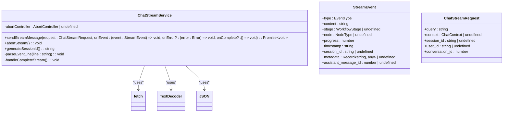

**Diagram sources**
- [ChatStreamService.ts](file://frontend/src/renderer/src/services/ChatStreamService.ts)

**Section sources**
- [ChatStreamService.ts](file://frontend/src/renderer/src/services/ChatStreamService.ts)

### Stream Event Handling
The useChatStream hook processes incoming stream events from the ChatStreamService, updating the application state accordingly. It handles different event types such as thinking, running, stream_chunk, and completed.

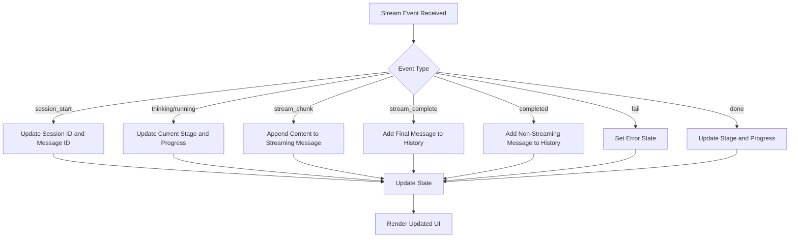

**Diagram sources**
- [use-chat-stream.ts](file://frontend/src/renderer/src/hooks/use-chat-stream.ts)

**Section sources**
- [use-chat-stream.ts](file://frontend/src/renderer/src/hooks/use-chat-stream.ts)

## Interactive Features Implementation
The AI assistant interface includes several interactive features that enhance the user experience and provide additional functionality.

### Prompt Input Component
The PromptInput component provides a rich text input area where users can enter their queries to the AI assistant. It supports keyboard shortcuts and form submission.

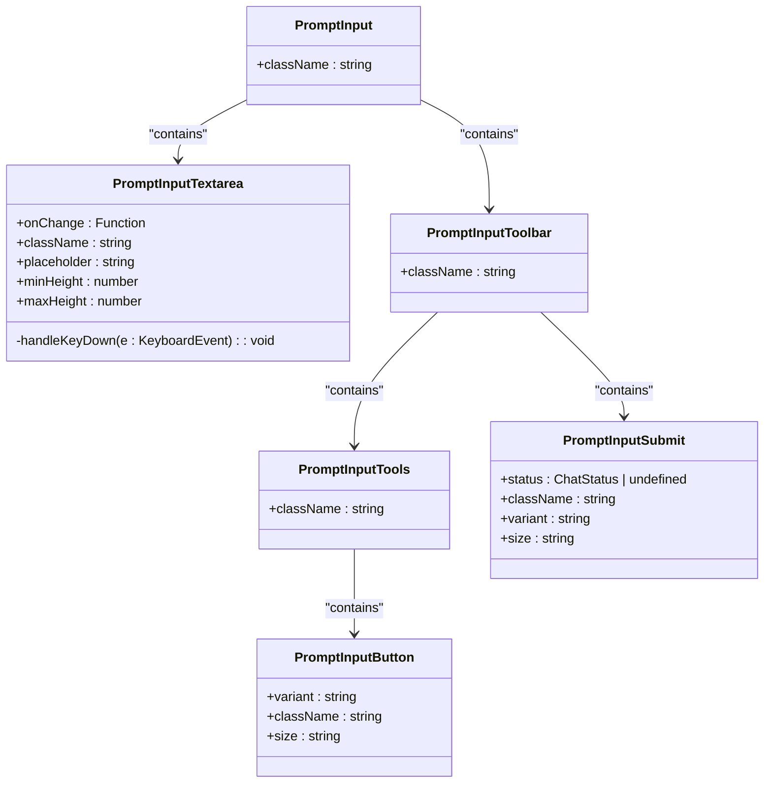

**Diagram sources**
- [prompt-input.tsx](file://frontend/src/renderer/src/components/ai-elements/prompt-input.tsx)

**Section sources**
- [prompt-input.tsx](file://frontend/src/renderer/src/components/ai-elements/prompt-input.tsx)

### Citation and Source Components
The inline-citation and sources components provide mechanisms for displaying references and citations within AI-generated responses, allowing users to verify the information and explore the sources.

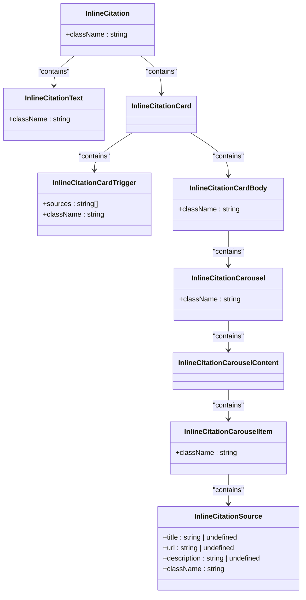

**Diagram sources**
- [inline-citation.tsx](file://frontend/src/renderer/src/components/ai-elements/inline-citation.tsx)

**Section sources**
- [inline-citation.tsx](file://frontend/src/renderer/src/components/ai-elements/inline-citation.tsx)

### Tool Execution Visualization
The tool component provides a visual representation of tool executions performed by the AI assistant, showing the status, parameters, and results of each tool call.

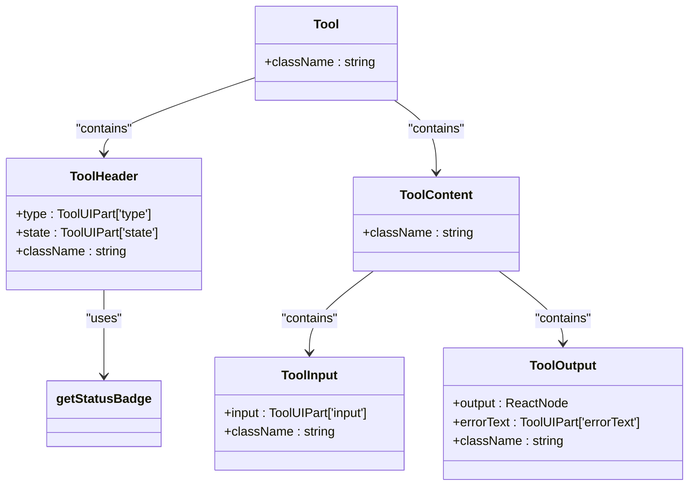

**Diagram sources**
- [tool.tsx](file://frontend/src/renderer/src/components/ai-elements/tool.tsx)

**Section sources**
- [tool.tsx](file://frontend/src/renderer/src/components/ai-elements/tool.tsx)

## Error Handling and Resilience
The AI assistant interface implements comprehensive error handling to ensure a resilient user experience even when issues occur during streaming or message processing.

### Stream Error Handling
The system handles various types of errors that can occur during the streaming process, including network connectivity issues, parsing failures, and server errors.

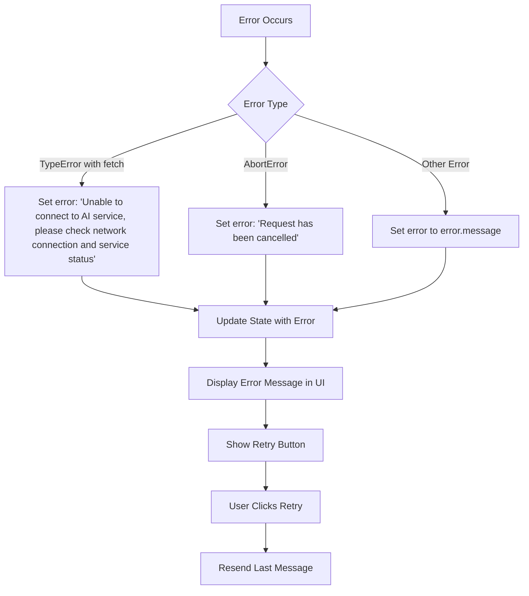

**Diagram sources**
- [use-chat-stream.ts](file://frontend/src/renderer/src/hooks/use-chat-stream.ts)
- [ChatStreamService.ts](file://frontend/src/renderer/src/services/ChatStreamService.ts)

**Section sources**
- [use-chat-stream.ts](file://frontend/src/renderer/src/hooks/use-chat-stream.ts)
- [ChatStreamService.ts](file://frontend/src/renderer/src/services/ChatStreamService.ts)

### Message Parsing Resilience
The system includes error handling for message parsing failures, ensuring that invalid or malformed messages do not crash the application.

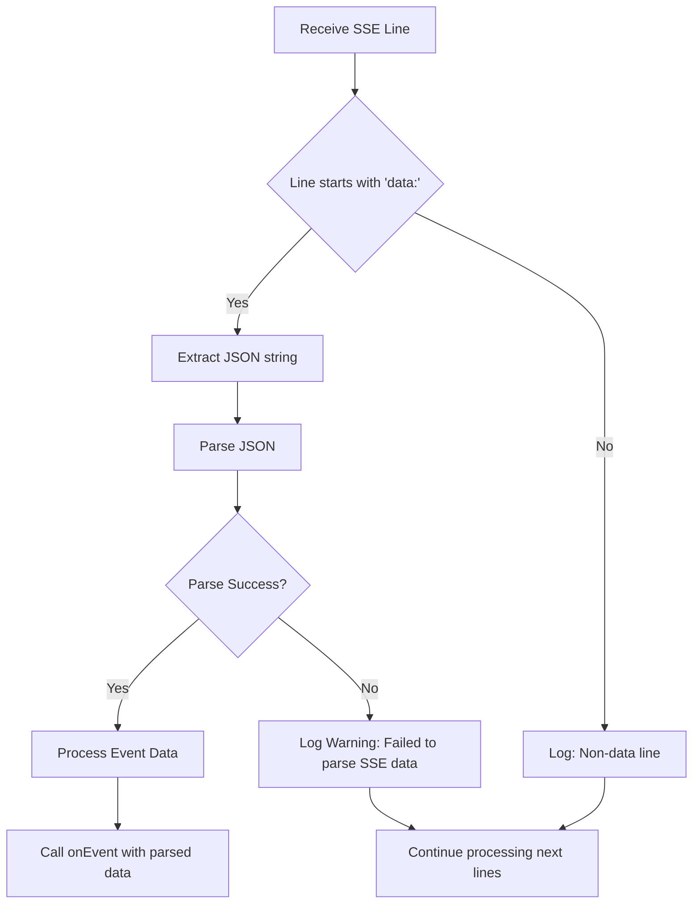

**Diagram sources**
- [ChatStreamService.ts](file://frontend/src/renderer/src/services/ChatStreamService.ts)

**Section sources**
- [ChatStreamService.ts](file://frontend/src/renderer/src/services/ChatStreamService.ts)

## Performance Optimization
The AI assistant interface implements several performance optimization techniques to ensure smooth rendering and minimal re-renders, especially when dealing with large conversation histories.

### Memoization and React Optimization
The components use React's memoization features to prevent unnecessary re-renders and optimize performance.

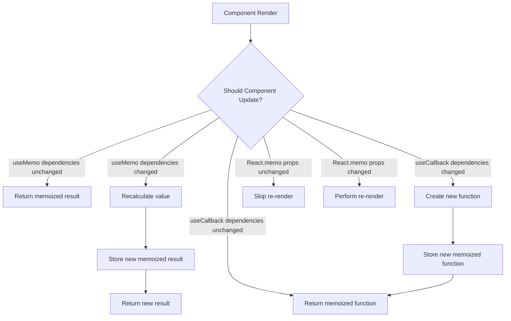

**Diagram sources**
- [index.tsx](file://frontend/src/renderer/src/components/ai-assistant/index.tsx)
- [inline-citation.tsx](file://frontend/src/renderer/src/components/ai-elements/inline-citation.tsx)

**Section sources**
- [index.tsx](file://frontend/src/renderer/src/components/ai-assistant/index.tsx)
- [inline-citation.tsx](file://frontend/src/renderer/src/components/ai-elements/inline-citation.tsx)

### Efficient State Management
The state management system is designed to minimize re-renders by batching state updates and using immutable patterns.

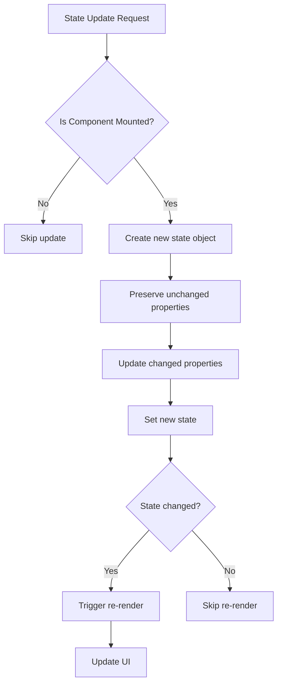

**Diagram sources**
- [use-chat-stream.ts](file://frontend/src/renderer/src/hooks/use-chat-stream.ts)

**Section sources**
- [use-chat-stream.ts](file://frontend/src/renderer/src/hooks/use-chat-stream.ts)

## Conclusion
The AI assistant interface in the renderer process is a sophisticated system that integrates multiple components to provide a seamless user experience. The architecture is well-structured, with clear separation of concerns between UI components, state management hooks, and backend services. The implementation of real-time streaming through the ChatStreamService enables progressive rendering of AI responses, while the useChatStream hook provides a robust state management layer that handles various stream events and errors. Interactive features such as citation display, tool execution visualization, and chat history management enhance the functionality and usability of the assistant. The system includes comprehensive error handling for stream interruptions and parsing failures, ensuring resilience in various scenarios. Performance optimizations through memoization and efficient state management help maintain smooth rendering even with large conversation histories. Overall, the AI assistant interface demonstrates a well-designed and implemented solution for integrating AI capabilities into the application.