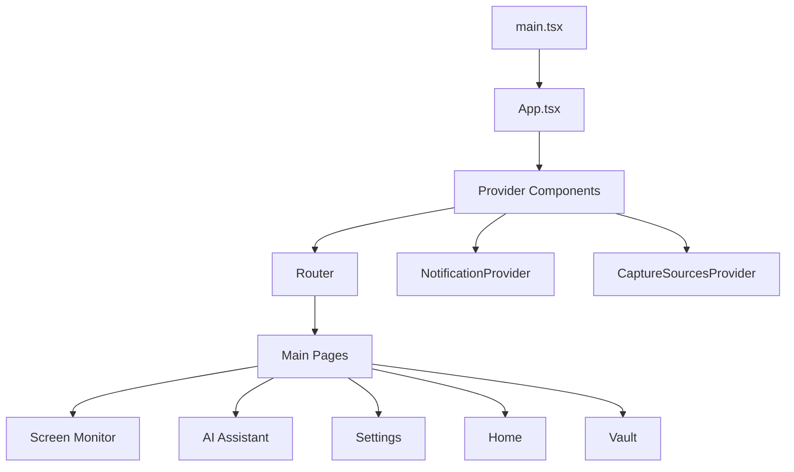
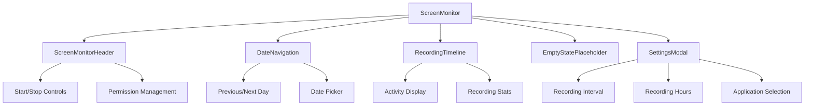
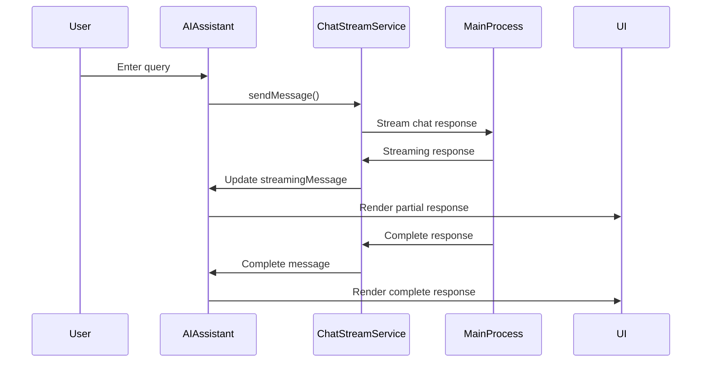
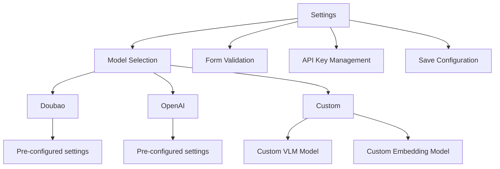
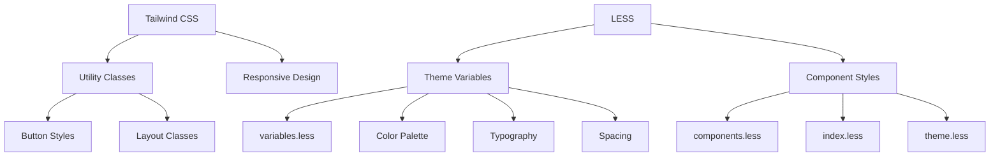

# Renderer Process

<cite>
**Referenced Files in This Document**   
- [main.tsx](file://frontend/src/renderer/src/main.tsx)
- [App.tsx](file://frontend/src/renderer/src/App.tsx)
- [Router.tsx](file://frontend/src/renderer/src/Router.tsx)
- [store/index.ts](file://frontend/src/renderer/src/store/index.ts)
- [store/navigation.ts](file://frontend/src/renderer/src/store/navigation.ts)
- [store/setting.ts](file://frontend/src/renderer/src/store/setting.ts)
- [hooks/use-screen.tsx](file://frontend/src/renderer/src/hooks/use-screen.tsx)
- [pages/screen-monitor/screen-monitor.tsx](file://frontend/src/renderer/src/pages/screen-monitor/screen-monitor.tsx)
- [components/ai-assistant/index.tsx](file://frontend/src/renderer/src/components/ai-assistant/index.tsx)
- [pages/settings/settings.tsx](file://frontend/src/renderer/src/pages/settings/settings.tsx)
- [hooks/use-ai-assistant.ts](file://frontend/src/renderer/src/hooks/use-ai-assistant.ts)
- [components/Sidebar/index.tsx](file://frontend/src/renderer/src/components/Sidebar/index.tsx)
- [assets/theme/variables.less](file://frontend/src/renderer/src/assets/theme/variables.less)
- [tailwind.config.js](file://frontend/tailwind.config.js)
</cite>

## Table of Contents
1. [Introduction](#introduction)
2. [Application Structure](#application-structure)
3. [Routing System](#routing-system)
4. [State Management](#state-management)
5. [Key UI Components](#key-ui-components)
6. [Custom Hooks](#custom-hooks)
7. [Styling and Theming](#styling-and-theming)
8. [Component Composition](#component-composition)
9. [Performance Optimization](#performance-optimization)
10. [Common Rendering Issues](#common-rendering-issues)

## Introduction
The renderer process in MineContext is responsible for the React-based UI layer that provides users with an interactive interface for managing their context-aware computing environment. This document provides a comprehensive overview of the renderer process architecture, focusing on the component hierarchy, routing system, state management, and key UI elements that make up the application's user interface.

**Section sources**
- [App.tsx](file://frontend/src/renderer/src/App.tsx#L1-L138)
- [main.tsx](file://frontend/src/renderer/src/main.tsx#L1-L9)

## Application Structure
The application structure in MineContext follows a well-organized component hierarchy starting from the main entry point. The `main.tsx` file serves as the entry point for the renderer process, where the React application is mounted to the DOM using `createRoot`.



**Diagram sources**
- [main.tsx](file://frontend/src/renderer/src/main.tsx#L1-L9)
- [App.tsx](file://frontend/src/renderer/src/App.tsx#L1-L138)

**Section sources**
- [main.tsx](file://frontend/src/renderer/src/main.tsx#L1-L9)
- [App.tsx](file://frontend/src/renderer/src/App.tsx#L1-L138)

## Routing System
The routing system in MineContext is implemented using React Router with a hash-based routing strategy. The `Router.tsx` component defines the application's routes and manages navigation between different pages.

```mermaid
flowchart TD
A[HashRouter] --> B[AppContent]
B --> C[Routes]
C --> D[/ → HomePage]
C --> E[/vault → VaultPage]
C --> F[/screen-monitor → ScreenMonitor]
C --> G[/settings → Settings]
C --> H[/files → Files]
C --> I[/ai-demo → AIDemo]
B --> J[Sidebar]
B --> K[Global Event Listeners]
K --> L[Tray Navigation Events]
K --> M[Tray Toggle Recording]
```

The routing system also handles global events from the main process, such as tray navigation and recording toggle actions, ensuring seamless integration between the system tray and the application interface.

**Diagram sources**
- [Router.tsx](file://frontend/src/renderer/src/Router.tsx#L1-L103)

**Section sources**
- [Router.tsx](file://frontend/src/renderer/src/Router.tsx#L1-L103)

## State Management
MineContext employs a Redux-based state management system with Redux Toolkit for efficient state handling across the application. The store is configured with persistence using redux-persist to maintain user preferences and application state between sessions.

```mermaid
classDiagram
class Store {
+configureStore()
+persistStore()
+handleSaveData()
}
class NavigationState {
+activeNavigationType : NavigationType
+activeMainTab : string
+activeVaultId : number | null
}
class SettingState {
+screenSettings : ScreenSettings
}
class ScreenState {
+isMonitoring : boolean
+currentSession : MonitorSession | null
}
Store --> NavigationState : "manages"
Store --> SettingState : "manages"
Store --> ScreenState : "manages"
Store --> "redux-persist" : "uses"
```

The state management system includes several slices for different aspects of the application:
- **Navigation**: Manages the current active page and navigation state
- **Setting**: Handles user preferences and configuration options
- **Screen**: Tracks screen monitoring status and session data
- **Vault**: Manages vault-related data and file organization
- **Events**: Handles application events and notifications
- **ChatHistory**: Stores AI assistant conversation history

The store configuration includes middleware for syncing specific state slices (screen and setting) with the main process, ensuring consistency between the renderer and main processes.

**Diagram sources**
- [store/index.ts](file://frontend/src/renderer/src/store/index.ts#L1-L85)
- [store/navigation.ts](file://frontend/src/renderer/src/store/navigation.ts#L1-L86)
- [store/setting.ts](file://frontend/src/renderer/src/store/setting.ts#L1-L35)

**Section sources**
- [store/index.ts](file://frontend/src/renderer/src/store/index.ts#L1-L85)
- [store/navigation.ts](file://frontend/src/renderer/src/store/navigation.ts#L1-L86)
- [store/setting.ts](file://frontend/src/renderer/src/store/setting.ts#L1-L35)

## Key UI Components
### Screen Monitor
The Screen Monitor component provides users with a comprehensive view of their screen recording activities and monitoring status. It displays a timeline of recorded activities, allows users to navigate through different dates, and provides controls for starting and stopping the monitoring process.



The component handles various states including permission status, monitoring status, and date selection, providing appropriate UI feedback for each state.

**Diagram sources**
- [pages/screen-monitor/screen-monitor.tsx](file://frontend/src/renderer/src/pages/screen-monitor/screen-monitor.tsx#L1-L575)

**Section sources**
- [pages/screen-monitor/screen-monitor.tsx](file://frontend/src/renderer/src/pages/screen-monitor/screen-monitor.tsx#L1-L575)

### AI Assistant
The AI Assistant component provides an interactive chat interface that allows users to query their context-aware AI partner. The component supports streaming responses, displays the AI's processing stage, and handles error conditions with retry functionality.



The AI Assistant includes features such as:
- Markdown rendering for formatted responses
- Workflow stage indicators showing processing status
- Error handling with retry functionality
- Context-aware queries based on current page and selection
- Keyboard shortcuts for quick access

**Diagram sources**
- [components/ai-assistant/index.tsx](file://frontend/src/renderer/src/components/ai-assistant/index.tsx#L1-L356)

**Section sources**
- [components/ai-assistant/index.tsx](file://frontend/src/renderer/src/components/ai-assistant/index.tsx#L1-L356)

### Settings
The Settings component allows users to configure their AI model preferences and API credentials. It supports multiple AI platforms including Doubao, OpenAI, and custom configurations.



The component uses a form-based interface with validation rules and provides helpful links for obtaining API keys from the respective platforms.

**Diagram sources**
- [pages/settings/settings.tsx](file://frontend/src/renderer/src/pages/settings/settings.tsx#L1-L337)

**Section sources**
- [pages/settings/settings.tsx](file://frontend/src/renderer/src/pages/settings/settings.tsx#L1-L337)

## Custom Hooks
### use-screen.tsx
The `use-screen` custom hook provides a comprehensive interface for managing screen monitoring functionality. It encapsulates state management, permission handling, and API interactions related to screen capture and monitoring.

```mermaid
classDiagram
class useScreen {
+isMonitoring : boolean
+hasPermission : boolean
+selectedImage : string | null
+setIsMonitoring()
+setCurrentSession()
+removeScreenshot()
+captureScreenshot()
+getNewActivities()
+getActivitiesByDate()
+loadAndShowImage()
+downloadScreenshot()
}
useScreen --> "Redux Store" : "connects to"
useScreen --> "window.screenMonitorAPI" : "uses"
useScreen --> "axiosInstance" : "uses"
useScreen --> "Message" : "displays"
```

The hook manages several key functionalities:
- Monitoring state (start/stop)
- Permission checking and request handling
- Screenshot capture and processing
- Activity data retrieval
- Image loading and display
- Screenshot downloading

**Diagram sources**
- [hooks/use-screen.tsx](file://frontend/src/renderer/src/hooks/use-screen.tsx#L1-L219)

**Section sources**
- [hooks/use-screen.tsx](file://frontend/src/renderer/src/hooks/use-screen.tsx#L1-L219)

### use-ai-assistant.ts
The `use-ai-assistant` custom hook manages the visibility and interaction state of the AI assistant panel. It handles keyboard shortcuts and provides a clean API for showing, hiding, and toggling the assistant.

```mermaid
flowchart TD
A[useAIAssistant] --> B[State Management]
B --> C[isVisible: boolean]
A --> D[Action Handlers]
D --> E[toggleAIAssistant()]
D --> F[showAIAssistant()]
D --> G[hideAIAssistant()]
A --> H[Event Listeners]
H --> I[Command+P shortcut]
H --> J[Escape key to close]
```

The hook implements keyboard event listeners for the Command+P (Mac) shortcut to toggle the assistant and the Escape key to close it when visible.

**Diagram sources**
- [hooks/use-ai-assistant.ts](file://frontend/src/renderer/src/hooks/use-ai-assistant.ts#L1-L48)

**Section sources**
- [hooks/use-ai-assistant.ts](file://frontend/src/renderer/src/hooks/use-ai-assistant.ts#L1-L48)

## Styling and Theming
MineContext uses a combination of Tailwind CSS and LESS for styling, providing a flexible and maintainable approach to UI design. The theme system allows for customization through variables defined in LESS files.



The theme customization is primarily handled through the `variables.less` file, which defines the core design tokens for the application including colors, typography, and spacing. These variables are then used throughout the component-specific LESS files to ensure visual consistency.

**Diagram sources**
- [assets/theme/variables.less](file://frontend/src/renderer/src/assets/theme/variables.less)
- [tailwind.config.js](file://frontend/tailwind.config.js)

**Section sources**
- [assets/theme/variables.less](file://frontend/src/renderer/src/assets/theme/variables.less)
- [tailwind.config.js](file://frontend/tailwind.config.js)

## Component Composition
### AI Elements
The AI elements are composed of several reusable components that work together to create the AI assistant interface. These components are organized in the `ai-elements` directory and include:

- **actions.tsx**: Action buttons for AI interactions
- **branch.tsx**: Branching conversation elements
- **code-block.tsx**: Code block rendering with syntax highlighting
- **conversation.tsx**: Conversation thread management
- **image.tsx**: Image display and handling
- **inline-citation.tsx**: Inline citation rendering
- **loader.tsx**: Loading indicators for AI processing
- **message.tsx**: Message display with formatting
- **prompt-input.tsx**: Input field for user queries
- **reasoning.tsx**: Reasoning step visualization
- **response.tsx**: AI response rendering
- **sources.tsx**: Source citation display
- **suggestion.tsx**: Suggested query buttons
- **task.tsx**: Task-related UI elements
- **tool.tsx**: Tool usage visualization
- **web-preview.tsx**: Web content preview

These components are designed to be composable and reusable across different parts of the application where AI interactions occur.

### Navigation
The navigation system is implemented through the Sidebar component, which provides a consistent navigation interface across the application. The Sidebar uses the `useNavigation` hook to manage navigation state and handle tab selection.

```mermaid
flowchart TD
A[Sidebar] --> B[Logo and Title]
A --> C[Navigation Tabs]
C --> D[Home]
C --> E[Screen Monitor]
C --> F[Settings]
A --> G[VaultTree]
A --> H[UpdateAvailableButton]
A --> I[useNavigation Hook]
I --> J[navigateToMainTab()]
I --> K[isMainTabActive()]
```

The Sidebar component is designed to be a persistent navigation element that remains visible as users move between different sections of the application.

**Section sources**
- [components/ai-elements/](file://frontend/src/renderer/src/components/ai-elements/)
- [components/Sidebar/index.tsx](file://frontend/src/renderer/src/components/Sidebar/index.tsx#L1-L111)

## Performance Optimization
MineContext implements several performance optimization techniques to ensure a smooth user experience:

1. **Code Splitting**: The application uses React.lazy and Suspense for code splitting, loading components only when needed.
2. **Memoization**: Custom hooks and components use useMemoizedFn from ahooks to memoize expensive calculations and function references.
3. **Conditional Rendering**: Components are rendered conditionally based on state to avoid unnecessary re-renders.
4. **Event Delegation**: Global event listeners are properly cleaned up to prevent memory leaks.
5. **Polling Optimization**: Data polling is managed carefully, with intervals cleared when not needed and adjusted based on application state.

The use of Redux Toolkit with proper slice design helps minimize unnecessary re-renders by ensuring that components only re-render when their specific state dependencies change.

**Section sources**
- [hooks/use-screen.tsx](file://frontend/src/renderer/src/hooks/use-screen.tsx#L1-L219)
- [pages/screen-monitor/screen-monitor.tsx](file://frontend/src/renderer/src/pages/screen-monitor/screen-monitor.tsx#L1-L575)
- [App.tsx](file://frontend/src/renderer/src/App.tsx#L1-L138)

## Common Rendering Issues
### Hydration Errors
Hydration errors can occur when there is a mismatch between server-rendered and client-rendered content. In MineContext, this is mitigated by:

1. Ensuring consistent initial state between server and client
2. Using proper loading states for asynchronous data
3. Implementing proper error boundaries

### State Synchronization Problems
State synchronization issues between the main process and renderer process are addressed through:

1. **Redux Persist**: Persisting critical state to ensure consistency across application restarts
2. **IPC Communication**: Using Electron's IPC system for real-time state updates
3. **Event Listeners**: Properly managing event listeners for state changes from the main process
4. **Error Handling**: Implementing robust error handling for failed state updates

The application uses the `storeSyncService` to synchronize specific state slices (screen and setting) between the renderer and main processes, ensuring that critical configuration and monitoring state remains consistent.

**Section sources**
- [App.tsx](file://frontend/src/renderer/src/App.tsx#L1-L138)
- [store/index.ts](file://frontend/src/renderer/src/store/index.ts#L1-L85)
- [Router.tsx](file://frontend/src/renderer/src/Router.tsx#L1-L103)