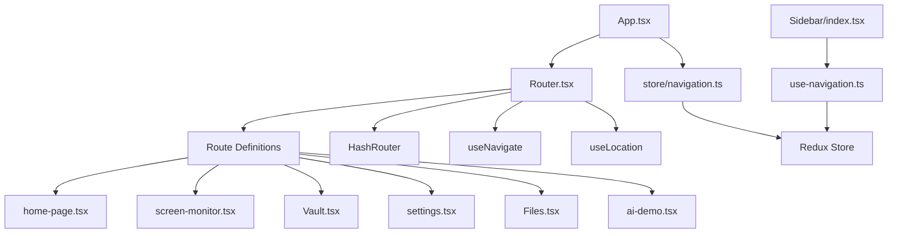
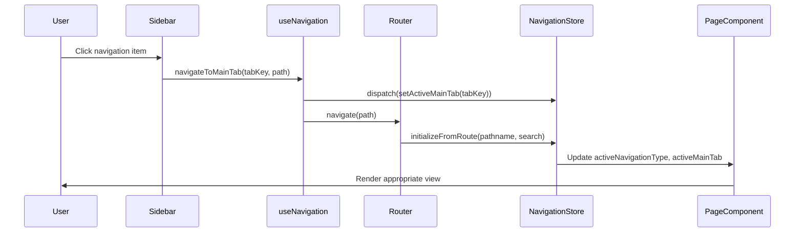
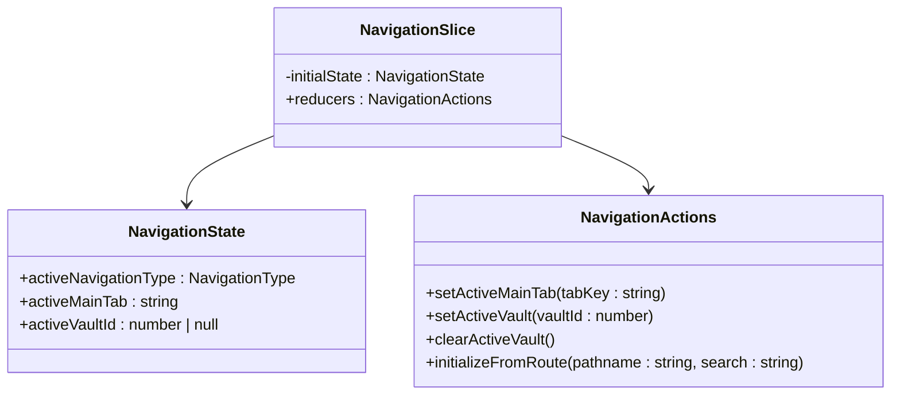
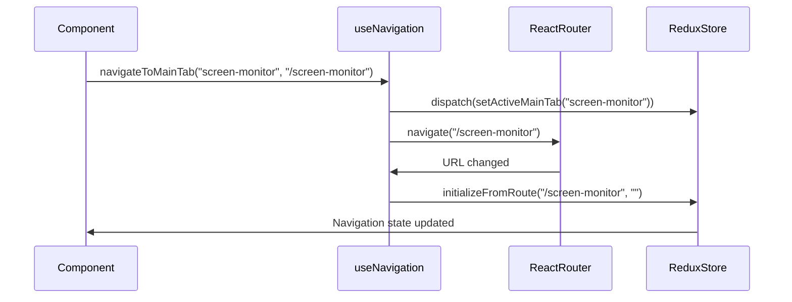
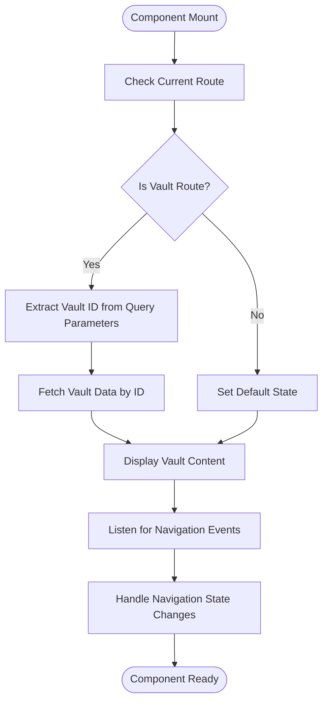
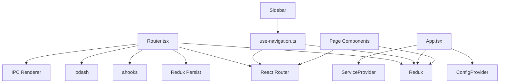

# Routing and Navigation

<cite>
**Referenced Files in This Document**   
- [App.tsx](file://frontend/src/renderer/src/App.tsx)
- [Router.tsx](file://frontend/src/renderer/src/Router.tsx)
- [use-navigation.ts](file://frontend/src/renderer/src/hooks/use-navigation.ts)
- [home-page.tsx](file://frontend/src/renderer/src/pages/home/home-page.tsx)
- [screen-monitor.tsx](file://frontend/src/renderer/src/pages/screen-monitor/screen-monitor.tsx)
- [Vault.tsx](file://frontend/src/renderer/src/pages/vault/Vault.tsx)
- [settings.tsx](file://frontend/src/renderer/src/pages/settings/settings.tsx)
- [navigation.ts](file://frontend/src/renderer/src/store/navigation.ts)
- [Sidebar/index.tsx](file://frontend/src/renderer/src/components/Sidebar/index.tsx)
</cite>

## Table of Contents
1. [Introduction](#introduction)
2. [Project Structure](#project-structure)
3. [Core Components](#core-components)
4. [Architecture Overview](#architecture-overview)
5. [Detailed Component Analysis](#detailed-component-analysis)
6. [Dependency Analysis](#dependency-analysis)
7. [Performance Considerations](#performance-considerations)
8. [Troubleshooting Guide](#troubleshooting-guide)
9. [Conclusion](#conclusion)

## Introduction
The MineContext application implements a comprehensive routing and navigation system that manages the flow between different views such as home, screen-monitor, settings, and vault. This documentation provides a detailed analysis of how the routing system is structured and implemented, focusing on the Router.tsx component that defines the application's route structure, the integration between App.tsx and the routing configuration, and the use of custom hooks for programmatic navigation. The system leverages React Router for URL-based navigation while maintaining navigation state through Redux, enabling both declarative routing and programmatic control. The documentation also covers navigation state persistence, deep linking support, and URL parameter handling across various page components.

## Project Structure
The routing and navigation system in MineContext is organized within the frontend/src/renderer/src directory, following a component-based architecture. The core routing functionality is centered around the Router.tsx file, which defines the application's route structure using React Router. The App.tsx file serves as the main entry point and orchestrates the integration between the routing system and the application's state management. Navigation state is managed through Redux in the store/navigation.ts file, while reusable navigation logic is encapsulated in the use-navigation.ts hook. Page components such as home-page.tsx, screen-monitor.tsx, Vault.tsx, and settings.tsx represent the individual views that are rendered based on the current route. The Sidebar component provides a persistent navigation menu that allows users to switch between different views. This structure enables a clear separation of concerns between route definition, state management, and UI presentation.

**Diagram sources**
- [App.tsx](file://frontend/src/renderer/src/App.tsx)
- [Router.tsx](file://frontend/src/renderer/src/Router.tsx)
- [navigation.ts](file://frontend/src/renderer/src/store/navigation.ts)
- [use-navigation.ts](file://frontend/src/renderer/src/hooks/use-navigation.ts)
- [Sidebar/index.tsx](file://frontend/src/renderer/src/components/Sidebar/index.tsx)

**Section sources**
- [App.tsx](file://frontend/src/renderer/src/App.tsx)
- [Router.tsx](file://frontend/src/renderer/src/Router.tsx)

## Core Components
The routing and navigation system in MineContext consists of several core components that work together to provide a seamless user experience. The Router.tsx component defines the application's route structure using React Router's HashRouter, Route, and Routes components. It maps URLs to specific page components such as home, screen-monitor, settings, and vault. The App.tsx component serves as the main application container, integrating the routing system with the Redux store and other global providers. The navigation state is managed through the navigation slice in the Redux store, which tracks the active navigation type, main tab, and vault ID. The use-navigation.ts hook provides a clean API for programmatic navigation and state management, abstracting away the complexity of direct Redux dispatch calls. The Sidebar component implements a persistent navigation menu that allows users to switch between different views, with visual indicators showing the currently active tab.

**Section sources**
- [App.tsx](file://frontend/src/renderer/src/App.tsx#L1-L138)
- [Router.tsx](file://frontend/src/renderer/src/Router.tsx#L1-L103)
- [navigation.ts](file://frontend/src/renderer/src/store/navigation.ts#L1-L86)
- [use-navigation.ts](file://frontend/src/renderer/src/hooks/use-navigation.ts#L1-L75)
- [Sidebar/index.tsx](file://frontend/src/renderer/src/components/Sidebar/index.tsx#L1-L111)

## Architecture Overview
The routing and navigation architecture in MineContext follows a well-defined pattern that separates route configuration from navigation logic and state management. At the core of the system is React Router, which handles URL-based navigation using a HashRouter implementation. The Router.tsx component defines the route structure, mapping specific paths to their corresponding page components. This declarative approach allows for clean separation between route configuration and component implementation. The navigation state is managed through Redux, with the navigation slice maintaining information about the currently active view and any associated parameters. This state is synchronized with the URL through the initializeFromRoute action, which parses the current pathname and query parameters to update the navigation state accordingly. The use-navigation.ts hook provides a unified interface for both navigating between views and accessing the current navigation state, making it easy for components to respond to navigation changes. The Sidebar component demonstrates how UI elements can be connected to the navigation system, using the useNavigation hook to determine which tab should be highlighted based on the current route.

**Diagram sources**
- [Router.tsx](file://frontend/src/renderer/src/Router.tsx#L1-L103)
- [navigation.ts](file://frontend/src/renderer/src/store/navigation.ts#L1-L86)
- [use-navigation.ts](file://frontend/src/renderer/src/hooks/use-navigation.ts#L1-L75)
- [Sidebar/index.tsx](file://frontend/src/renderer/src/components/Sidebar/index.tsx#L1-L111)

## Detailed Component Analysis

### Router Configuration and Route Definitions
The Router.tsx component is responsible for defining the application's route structure and handling navigation events. It uses React Router's HashRouter to manage navigation without requiring server-side routing support. The component defines routes for the main application views: home (root path), vault, screen-monitor, settings, files, and ai-demo. Each route is associated with a specific page component that is rendered when the corresponding URL is active. The Router also handles navigation events from external sources, such as the system tray, by listening for IPC events and programmatically navigating to the appropriate view. For example, when a user clicks on the tray icon to navigate to the screen-monitor view, the Router listens for the Tray_NavigateToScreenMonitor event and uses the navigate function to update the current route. Similarly, it handles the Tray_ToggleRecording event by navigating to the screen-monitor view with a state parameter indicating that recording should be toggled.

**Section sources**
- [Router.tsx](file://frontend/src/renderer/src/Router.tsx#L1-L103)

### App Component Integration
The App.tsx component serves as the main entry point for the application and orchestrates the integration between the routing system and other application components. It wraps the entire application in the necessary providers, including the Redux Provider, ConfigProvider for UI localization, and ServiceProvider for event handling. The App component manages the application's loading state, displaying a loading component until the backend service is running, at which point it renders either the settings page (if needed) or the Router component. This conditional rendering ensures that users are guided through the initial setup process before accessing the main application features. The component also handles backend status changes, updating the UI accordingly when the backend service starts or stops. This integration between the App component and the routing system ensures that navigation only occurs when the application is in a ready state, preventing navigation to views that depend on backend services that are not yet available.

**Section sources**
- [App.tsx](file://frontend/src/renderer/src/App.tsx#L1-L138)

### Navigation State Management
The navigation state in MineContext is managed through a Redux slice defined in navigation.ts. This slice maintains three key pieces of state: activeNavigationType (either 'main' or 'vault'), activeMainTab (the currently selected main navigation tab), and activeVaultId (the currently selected vault, if applicable). The slice provides several actions for updating this state: setActiveMainTab for switching between main navigation tabs, setActiveVault for navigating to a specific vault, clearActiveVault for returning to the main navigation, and initializeFromRoute for synchronizing the navigation state with the current URL. The initializeFromRoute action is particularly important as it parses the current pathname and query parameters to determine the appropriate navigation state. For example, when the URL is '/vault?id=123', the action extracts the vault ID from the query parameter and updates the navigation state accordingly. This ensures that the application can properly handle deep links and browser navigation while maintaining a consistent internal state.

#### For Object-Oriented Components:

**Diagram sources**
- [navigation.ts](file://frontend/src/renderer/src/store/navigation.ts#L1-L86)

**Section sources**
- [navigation.ts](file://frontend/src/renderer/src/store/navigation.ts#L1-L86)

### Programmatic Navigation with use-navigation Hook
The use-navigation.ts hook provides a clean and reusable interface for programmatic navigation and navigation state management. It encapsulates the logic for interacting with both the React Router navigation functions and the Redux navigation state, providing a unified API for components to use. The hook exposes several key functions: navigateToMainTab for switching between main navigation tabs, navigateToVault for navigating to a specific vault with the appropriate URL parameters, and clearVaultSelection for returning to the main navigation. It also provides utility functions for checking the current navigation state, such as isMainTabActive, isVaultActive, and isInVaultArea. These functions allow components to conditionally render content based on the current navigation context. The hook uses the useLocation and useNavigate hooks from React Router to access the current route and perform navigation, while also using useAppSelector and useAppDispatch from Redux to access and update the navigation state. This combination of React Router and Redux provides a robust foundation for navigation that supports both URL-based navigation and programmatic control.

#### For API/Service Components:

**Diagram sources**
- [use-navigation.ts](file://frontend/src/renderer/src/hooks/use-navigation.ts#L1-L75)
- [navigation.ts](file://frontend/src/renderer/src/store/navigation.ts#L1-L86)

**Section sources**
- [use-navigation.ts](file://frontend/src/renderer/src/hooks/use-navigation.ts#L1-L75)

### Page Component Structure and Data Initialization
The page components in MineContext follow a consistent structure that includes data fetching and initialization patterns. Each page component is responsible for managing its own state and data requirements, while also responding to navigation events. For example, the home-page.tsx component uses several hooks to manage its state, including useAllotment for layout management, useAppSelector for accessing Redux state, and useUnmount for cleanup. It also uses the getRecentVaults utility function to fetch data for display in the vault card component. The screen-monitor.tsx component demonstrates a more complex initialization pattern, using useEffect hooks to fetch activities for the current date and manage polling for new activities when monitoring is active. It also handles navigation state passed through the location.state object, allowing it to respond to actions initiated from outside the component, such as toggling recording from the system tray. The Vault.tsx component uses the useSearchParams hook to extract the vault ID from the URL query parameters, then uses the useVaults hook to fetch the corresponding vault data. This pattern of using React Router hooks in conjunction with custom data fetching hooks ensures that page components are properly initialized with the necessary data when they are rendered.

#### For Complex Logic Components:

**Diagram sources**
- [home-page.tsx](file://frontend/src/renderer/src/pages/home/home-page.tsx#L1-L106)
- [screen-monitor.tsx](file://frontend/src/renderer/src/pages/screen-monitor/screen-monitor.tsx#L1-L575)
- [Vault.tsx](file://frontend/src/renderer/src/pages/vault/Vault.tsx#L1-L123)

**Section sources**
- [home-page.tsx](file://frontend/src/renderer/src/pages/home/home-page.tsx#L1-L106)
- [screen-monitor.tsx](file://frontend/src/renderer/src/pages/screen-monitor/screen-monitor.tsx#L1-L575)
- [Vault.tsx](file://frontend/src/renderer/src/pages/vault/Vault.tsx#L1-L123)

### Sidebar Navigation Implementation
The Sidebar component implements the persistent navigation menu that appears on the left side of the application. It uses the useNavigation hook to access the current navigation state and provide navigation functionality. The component defines a list of navigation items in the tabItems array, each with a key, icon, label, and path. These items correspond to the main navigation tabs in the application. When a user clicks on a navigation item, the handleTabChange function is called, which uses the navigateToMainTab function from the useNavigation hook to update both the navigation state and the current route. The component also uses the isMainTabActive function to determine which tab should be visually highlighted based on the current navigation state. This ensures that the sidebar accurately reflects the current view, even when navigation occurs through other means such as URL changes or system tray interactions. The sidebar also includes additional components such as the VaultTree for navigating between vaults and the UpdateAvailableButton for displaying update notifications, demonstrating how the navigation system can be extended with additional functionality.

**Section sources**
- [Sidebar/index.tsx](file://frontend/src/renderer/src/components/Sidebar/index.tsx#L1-L111)

## Dependency Analysis
The routing and navigation system in MineContext has several key dependencies that enable its functionality. The primary dependency is React Router, which provides the core routing capabilities through components like HashRouter, Route, Routes, useNavigate, and useLocation. This library is essential for managing URL-based navigation and rendering the appropriate components based on the current route. The system also depends on Redux and Redux Toolkit for state management, specifically for maintaining the navigation state across the application. The redux-persist library is used to persist the navigation state between application sessions, ensuring that users return to their previous view when they restart the application. The implementation also relies on several utility libraries, including ahooks for memoized functions and lodash for object manipulation. The system integrates with the application's IPC (Inter-Process Communication) system to handle navigation events from external sources like the system tray. This is achieved through the window.electron.ipcRenderer object, which allows the renderer process to listen for events from the main process. The navigation system is also tightly coupled with the application's component structure, as each page component must be properly configured to handle its specific data requirements and respond to navigation events.

**Diagram sources**
- [Router.tsx](file://frontend/src/renderer/src/Router.tsx#L1-L103)
- [use-navigation.ts](file://frontend/src/renderer/src/hooks/use-navigation.ts#L1-L75)
- [App.tsx](file://frontend/src/renderer/src/App.tsx#L1-L138)
- [Sidebar/index.tsx](file://frontend/src/renderer/src/components/Sidebar/index.tsx#L1-L111)

**Section sources**
- [Router.tsx](file://frontend/src/renderer/src/Router.tsx#L1-L103)
- [use-navigation.ts](file://frontend/src/renderer/src/hooks/use-navigation.ts#L1-L75)
- [App.tsx](file://frontend/src/renderer/src/App.tsx#L1-L138)
- [Sidebar/index.tsx](file://frontend/src/renderer/src/components/Sidebar/index.tsx#L1-L111)

## Performance Considerations
The routing and navigation system in MineContext is designed with performance in mind, leveraging several optimization techniques to ensure a smooth user experience. One key consideration is the use of React Router's HashRouter instead of BrowserRouter, which avoids the need for server-side routing configuration and reduces the complexity of URL management. The system also uses lazy loading patterns, where page components are imported directly in the route definitions rather than being eagerly loaded at application startup. This reduces the initial bundle size and improves startup performance. The navigation state is managed efficiently through Redux, with the navigation slice containing only the essential state needed for navigation. The use of memoized functions through the ahooks library helps prevent unnecessary re-renders by ensuring that callback functions maintain referential equality across renders. The system also implements efficient event handling, using the useObservableTask hook to manage screen lock/unlock events and other system events that affect navigation. This prevents memory leaks by properly cleaning up event listeners when components are unmounted. Additionally, the use of React's useEffect hook with proper dependency arrays ensures that side effects are only executed when necessary, reducing unnecessary computations and API calls.

## Troubleshooting Guide
When encountering issues with the routing and navigation system in MineContext, several common problems may arise. For broken navigation issues, where clicking on navigation items does not change the view, check that the useNavigation hook is properly imported and that the navigateToMainTab or navigateToVault functions are being called with the correct parameters. Verify that the Redux store is properly configured and that the navigation actions are being dispatched correctly. For incorrect route matching issues, where the wrong component is displayed for a given URL, examine the route definitions in Router.tsx to ensure that the paths are correctly specified and that there are no conflicting routes. Check that the initializeFromRoute action in the navigation slice is properly parsing the URL and updating the navigation state. For hydration mismatches, which can occur when the server-rendered HTML does not match the client-rendered HTML, ensure that all navigation state is properly synchronized between the server and client. This can be achieved by using redux-persist to store the navigation state in localStorage and restoring it on application startup. When debugging navigation issues, use the browser's developer tools to inspect the Redux store and verify that the navigation state is being updated as expected. Also check the network tab to ensure that any data fetching required by page components is completing successfully. For issues with deep linking, where navigating directly to a URL does not properly initialize the application state, verify that the initializeFromRoute action is being called when the component mounts and that it correctly parses the URL parameters.

**Section sources**
- [Router.tsx](file://frontend/src/renderer/src/Router.tsx#L1-L103)
- [navigation.ts](file://frontend/src/renderer/src/store/navigation.ts#L1-L86)
- [use-navigation.ts](file://frontend/src/renderer/src/hooks/use-navigation.ts#L1-L75)

## Conclusion
The routing and navigation system in MineContext provides a robust and flexible foundation for managing application flow and user interaction. By combining React Router for URL-based navigation with Redux for state management, the system achieves a clean separation of concerns while maintaining a consistent navigation state across the application. The use of custom hooks like use-navigation abstracts away the complexity of direct Redux and React Router interactions, providing a clean and reusable API for components to use. The system supports various navigation patterns, including direct URL navigation, programmatic navigation, and event-driven navigation from external sources like the system tray. The implementation also handles edge cases such as deep linking, navigation state persistence, and responsive design through the use of conditional rendering and layout management. Overall, the routing and navigation system in MineContext demonstrates a well-architected approach to client-side routing that balances flexibility, performance, and maintainability.