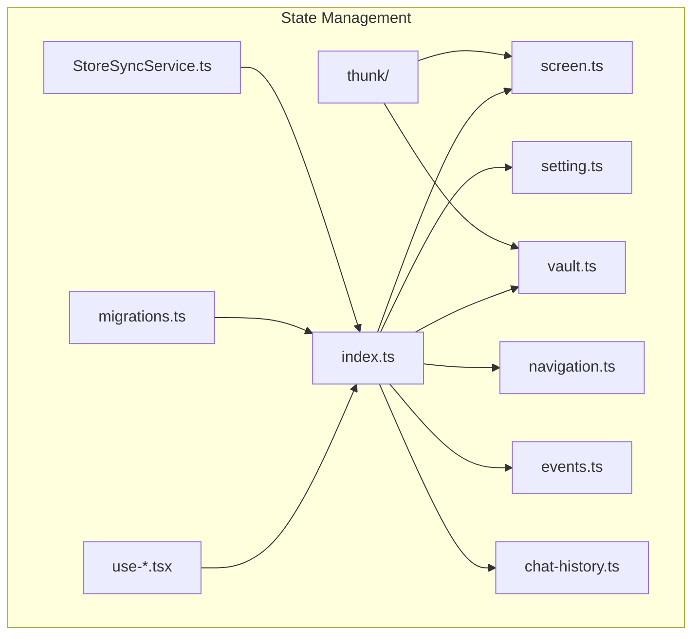
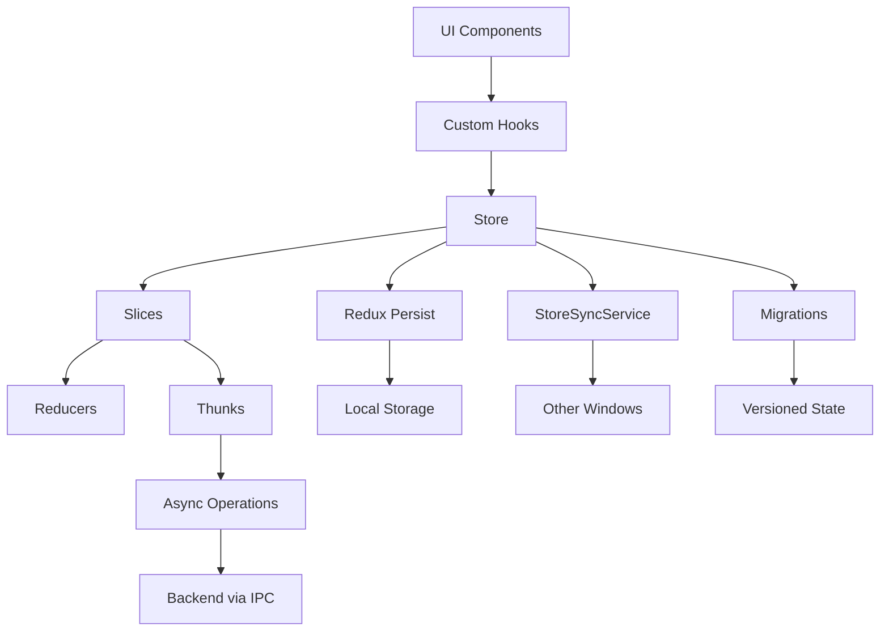
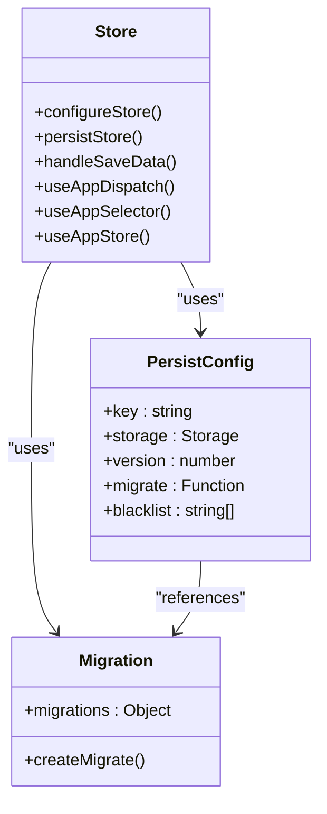
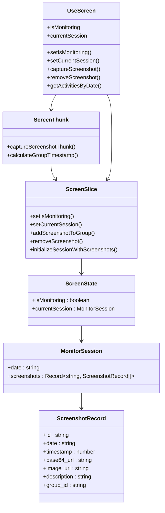
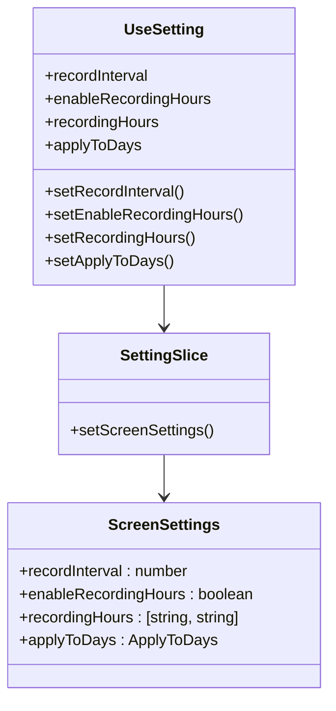
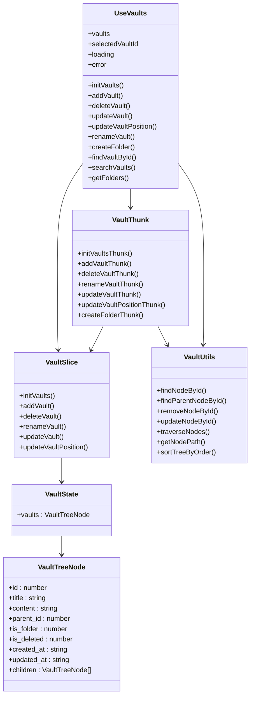
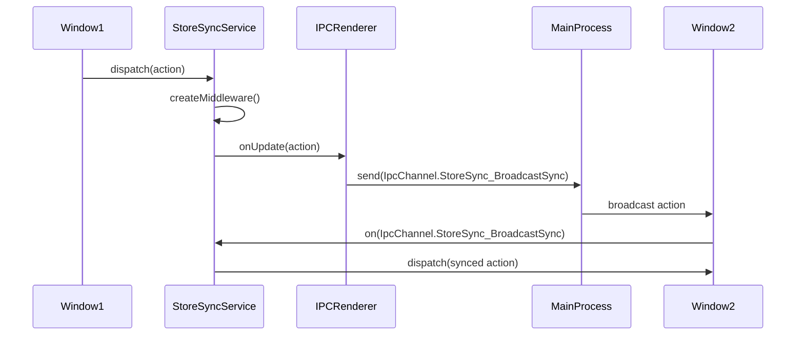
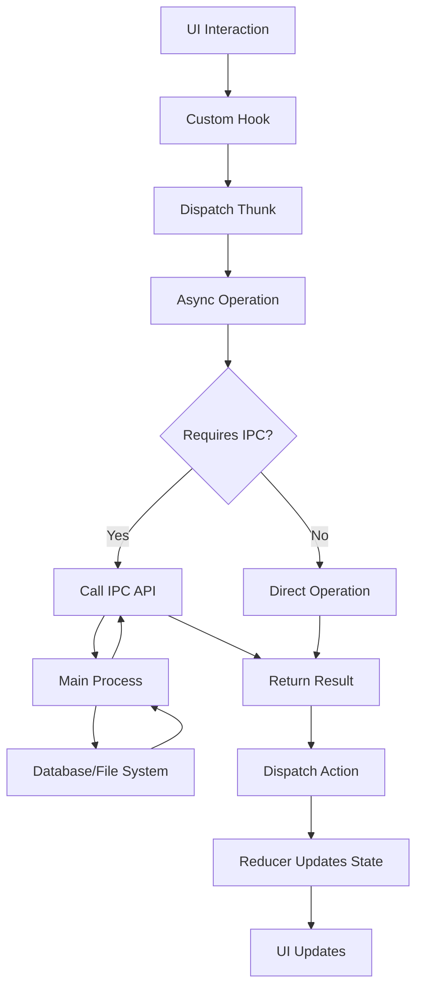
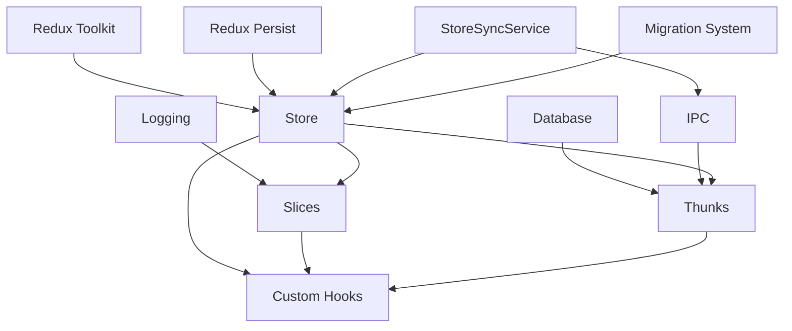

# State Management System

<cite>
**Referenced Files in This Document**   
- [index.ts](file://frontend/src/renderer/src/store/index.ts)
- [screen.ts](file://frontend/src/renderer/src/store/screen.ts)
- [setting.ts](file://frontend/src/renderer/src/store/setting.ts)
- [vault.ts](file://frontend/src/renderer/src/store/vault.ts)
- [migrations.ts](file://frontend/src/renderer/src/store/migrations.ts)
- [screen-thunk.ts](file://frontend/src/renderer/src/store/thunk/screen-thunk.ts)
- [vault-thunk.ts](file://frontend/src/renderer/src/store/thunk/vault-thunk.ts)
- [use-screen.tsx](file://frontend/src/renderer/src/hooks/use-screen.tsx)
- [use-setting.ts](file://frontend/src/renderer/src/hooks/use-setting.ts)
- [use-vault.ts](file://frontend/src/renderer/src/hooks/use-vault.ts)
- [StoreSyncService.ts](file://frontend/src/renderer/src/services/StoreSyncService.ts)
- [index.tsx](file://frontend/src/renderer/src/databases/index.tsx)
- [vault.ts](file://frontend/src/renderer/src/utils/vault.ts)
- [vault.ts](file://frontend/src/renderer/src/types/vault.ts)
- [navigation.ts](file://frontend/src/renderer/src/store/navigation.ts)
- [events.ts](file://frontend/src/renderer/src/store/events.ts)
- [chat-history.ts](file://frontend/src/renderer/src/store/chat-history.ts)
</cite>

## Table of Contents
1. [Introduction](#introduction)
2. [Project Structure](#project-structure)
3. [Core Components](#core-components)
4. [Architecture Overview](#architecture-overview)
5. [Detailed Component Analysis](#detailed-component-analysis)
6. [Dependency Analysis](#dependency-analysis)
7. [Performance Considerations](#performance-considerations)
8. [Troubleshooting Guide](#troubleshooting-guide)
9. [Conclusion](#conclusion)

## Introduction
This document provides a comprehensive overview of the state management system in the renderer process of the MineContext application. The system is built on Redux Toolkit and follows Jotai/Redux patterns to manage application state across key modules such as screen monitoring, settings, and vault management. The architecture includes store slices for different domains, thunks for handling asynchronous operations, custom hooks for accessing state in functional components, and mechanisms for state persistence, migration, and synchronization with the backend via IPC. Special attention is given to performance optimization and error handling in asynchronous operations.

## Project Structure
The state management system is organized under the `frontend/src/renderer/src/store` directory, with dedicated slices for each major module. The structure follows a modular approach where each feature has its own slice, thunks, and corresponding custom hooks. The system leverages Redux Toolkit for reducer logic, Redux Persist for state persistence, and a custom StoreSyncService for cross-window state synchronization.

**Diagram sources**
- [index.ts](file://frontend/src/renderer/src/store/index.ts)
- [screen.ts](file://frontend/src/renderer/src/store/screen.ts)
- [setting.ts](file://frontend/src/renderer/src/store/setting.ts)
- [vault.ts](file://frontend/src/renderer/src/store/vault.ts)
- [navigation.ts](file://frontend/src/renderer/src/store/navigation.ts)
- [events.ts](file://frontend/src/renderer/src/store/events.ts)
- [chat-history.ts](file://frontend/src/renderer/src/store/chat-history.ts)
- [migrations.ts](file://frontend/src/renderer/src/store/migrations.ts)
- [StoreSyncService.ts](file://frontend/src/renderer/src/services/StoreSyncService.ts)

**Section sources**
- [index.ts](file://frontend/src/renderer/src/store/index.ts)
- [screen.ts](file://frontend/src/renderer/src/store/screen.ts)
- [setting.ts](file://frontend/src/renderer/src/store/setting.ts)
- [vault.ts](file://frontend/src/renderer/src/store/vault.ts)
- [navigation.ts](file://frontend/src/renderer/src/store/navigation.ts)
- [events.ts](file://frontend/src/renderer/src/store/events.ts)
- [chat-history.ts](file://frontend/src/renderer/src/store/chat-history.ts)
- [migrations.ts](file://frontend/src/renderer/src/store/migrations.ts)
- [StoreSyncService.ts](file://frontend/src/renderer/src/services/StoreSyncService.ts)

## Core Components
The state management system consists of several core components that work together to manage application state. These include store slices for different domains (screen, setting, vault), thunks for handling asynchronous operations, custom hooks for accessing state in functional components, and utilities for state persistence and migration. The system is designed to be modular and scalable, allowing for easy addition of new features and components.

**Section sources**
- [index.ts](file://frontend/src/renderer/src/store/index.ts)
- [screen.ts](file://frontend/src/renderer/src/store/screen.ts)
- [setting.ts](file://frontend/src/renderer/src/store/setting.ts)
- [vault.ts](file://frontend/src/renderer/src/store/vault.ts)
- [migrations.ts](file://frontend/src/renderer/src/store/migrations.ts)
- [StoreSyncService.ts](file://frontend/src/renderer/src/services/StoreSyncService.ts)

## Architecture Overview
The state management architecture follows a Redux pattern with Redux Toolkit for reducer logic and Redux Persist for state persistence. The system is divided into multiple slices, each responsible for a specific domain of the application. Thunks are used to handle asynchronous operations such as API calls and database interactions. Custom hooks provide a clean interface for components to access and update state. The StoreSyncService enables state synchronization across multiple windows, while the migration system ensures backward compatibility when the state structure changes.

**Diagram sources**
- [index.ts](file://frontend/src/renderer/src/store/index.ts)
- [StoreSyncService.ts](file://frontend/src/renderer/src/services/StoreSyncService.ts)
- [migrations.ts](file://frontend/src/renderer/src/store/migrations.ts)

## Detailed Component Analysis

### Store Configuration and Root Reducer
The store is configured using Redux Toolkit's `configureStore` function, with Redux Persist for state persistence. The root reducer combines multiple slices using `combineReducers`. The persistence configuration includes a migration system to handle changes in the state structure across versions. Certain slices like vault and screen are blacklisted from persistence as their data is stored in the SQLite database.

**Diagram sources**
- [index.ts](file://frontend/src/renderer/src/store/index.ts)
- [migrations.ts](file://frontend/src/renderer/src/store/migrations.ts)

**Section sources**
- [index.ts](file://frontend/src/renderer/src/store/index.ts)
- [migrations.ts](file://frontend/src/renderer/src/store/migrations.ts)

### Screen Monitoring State Management
The screen monitoring module manages the state related to screenshot capture and monitoring sessions. The `screenSlice` contains the state for monitoring status and session data, with reducers for updating these values. The `screen-thunk.ts` file contains thunks for handling asynchronous operations such as taking screenshots and uploading them to the server. The `use-screen.tsx` hook provides a clean interface for components to access and update screen monitoring state.

**Diagram sources**
- [screen.ts](file://frontend/src/renderer/src/store/screen.ts)
- [screen-thunk.ts](file://frontend/src/renderer/src/store/thunk/screen-thunk.ts)
- [use-screen.tsx](file://frontend/src/renderer/src/hooks/use-screen.tsx)

**Section sources**
- [screen.ts](file://frontend/src/renderer/src/store/screen.ts)
- [screen-thunk.ts](file://frontend/src/renderer/src/store/thunk/screen-thunk.ts)
- [use-screen.tsx](file://frontend/src/renderer/src/hooks/use-screen.tsx)

### Settings State Management
The settings module manages application settings such as screen recording intervals and recording hours. The `settingSlice` contains the state for screen settings, with a reducer for updating these values. The `use-setting.ts` hook provides a clean interface for components to access and update settings. The settings are persisted across application restarts using Redux Persist.

**Diagram sources**
- [setting.ts](file://frontend/src/renderer/src/store/setting.ts)
- [use-setting.ts](file://frontend/src/renderer/src/hooks/use-setting.ts)

**Section sources**
- [setting.ts](file://frontend/src/renderer/src/store/setting.ts)
- [use-setting.ts](file://frontend/src/renderer/src/hooks/use-setting.ts)

### Vault Management State Management
The vault management module handles the state for the vault tree structure, including folders and documents. The `vaultSlice` contains the state for the vault tree, with reducers for adding, deleting, and updating vaults. The `vault-thunk.ts` file contains thunks for handling asynchronous operations such as database interactions. The `use-vault.ts` hook provides a comprehensive interface for components to interact with the vault system, including CRUD operations and utility methods.

**Diagram sources**
- [vault.ts](file://frontend/src/renderer/src/store/vault.ts)
- [vault-thunk.ts](file://frontend/src/renderer/src/store/thunk/vault-thunk.ts)
- [use-vault.ts](file://frontend/src/renderer/src/hooks/use-vault.ts)
- [vault.ts](file://frontend/src/renderer/src/utils/vault.ts)
- [vault.ts](file://frontend/src/renderer/src/types/vault.ts)

**Section sources**
- [vault.ts](file://frontend/src/renderer/src/store/vault.ts)
- [vault-thunk.ts](file://frontend/src/renderer/src/store/thunk/vault-thunk.ts)
- [use-vault.ts](file://frontend/src/renderer/src/hooks/use-vault.ts)
- [vault.ts](file://frontend/src/renderer/src/utils/vault.ts)
- [vault.ts](file://frontend/src/renderer/src/types/vault.ts)

### State Synchronization and Persistence
The StoreSyncService enables state synchronization across multiple windows by broadcasting actions from one window to others via IPC. The service uses a whitelist approach to determine which actions should be synchronized. Redux Persist is used for state persistence, with a migration system to handle changes in the state structure across versions. The migration system ensures backward compatibility when the state structure changes.

**Diagram sources**
- [StoreSyncService.ts](file://frontend/src/renderer/src/services/StoreSyncService.ts)

**Section sources**
- [StoreSyncService.ts](file://frontend/src/renderer/src/services/StoreSyncService.ts)

### Data Flow and IPC Integration
The state management system integrates with the backend via IPC for operations that require database access or system-level operations. The data flow starts with a UI interaction, which triggers a custom hook that dispatches a thunk. The thunk performs the asynchronous operation, which may involve IPC calls to the main process. The result is then used to update the state via reducers, triggering UI updates.

**Diagram sources**
- [use-screen.tsx](file://frontend/src/renderer/src/hooks/use-screen.tsx)
- [use-vault.ts](file://frontend/src/renderer/src/hooks/use-vault.ts)
- [screen-thunk.ts](file://frontend/src/renderer/src/store/thunk/screen-thunk.ts)
- [vault-thunk.ts](file://frontend/src/renderer/src/store/thunk/vault-thunk.ts)

**Section sources**
- [use-screen.tsx](file://frontend/src/renderer/src/hooks/use-screen.tsx)
- [use-vault.ts](file://frontend/src/renderer/src/hooks/use-vault.ts)
- [screen-thunk.ts](file://frontend/src/renderer/src/store/thunk/screen-thunk.ts)
- [vault-thunk.ts](file://frontend/src/renderer/src/store/thunk/vault-thunk.ts)

## Dependency Analysis
The state management system has a well-defined dependency structure. The store depends on Redux Toolkit and Redux Persist for core functionality. Each slice depends on the store and may depend on other utilities such as logging and database services. Thunks depend on the store and external services for asynchronous operations. Custom hooks depend on the store and thunks to provide a clean interface for components. The StoreSyncService depends on the store and IPC for cross-window synchronization.

**Diagram sources**
- [index.ts](file://frontend/src/renderer/src/store/index.ts)
- [StoreSyncService.ts](file://frontend/src/renderer/src/services/StoreSyncService.ts)
- [migrations.ts](file://frontend/src/renderer/src/store/migrations.ts)
- [databases/index.tsx](file://frontend/src/renderer/src/databases/index.tsx)

**Section sources**
- [index.ts](file://frontend/src/renderer/src/store/index.ts)
- [StoreSyncService.ts](file://frontend/src/renderer/src/services/StoreSyncService.ts)
- [migrations.ts](file://frontend/src/renderer/src/store/migrations.ts)
- [databases/index.tsx](file://frontend/src/renderer/src/databases/index.tsx)

## Performance Considerations
The state management system includes several performance optimizations. Custom hooks use `useMemoizedFn` to memoize functions and prevent unnecessary re-renders. The StoreSyncService uses a whitelist approach to minimize the number of actions that are broadcast across windows. The vault system uses tree traversal algorithms that are optimized for performance, with methods like `findNodeById` and `updateNodeById` that stop searching once the target node is found. The system also includes error handling and loading states to provide feedback during asynchronous operations.

**Section sources**
- [use-screen.tsx](file://frontend/src/renderer/src/hooks/use-screen.tsx)
- [use-vault.ts](file://frontend/src/renderer/src/hooks/use-vault.ts)
- [StoreSyncService.ts](file://frontend/src/renderer/src/services/StoreSyncService.ts)
- [vault.ts](file://frontend/src/renderer/src/utils/vault.ts)

## Troubleshooting Guide
Common issues in the state management system include problems with state persistence, synchronization across windows, and asynchronous operations. For persistence issues, ensure that the migration system is correctly configured and that the state structure matches the expected format. For synchronization issues, verify that the StoreSyncService is properly initialized and that the action types are included in the sync whitelist. For asynchronous operation failures, check the error handling in thunks and ensure that IPC calls are properly implemented.

**Section sources**
- [index.ts](file://frontend/src/renderer/src/store/index.ts)
- [StoreSyncService.ts](file://frontend/src/renderer/src/services/StoreSyncService.ts)
- [screen-thunk.ts](file://frontend/src/renderer/src/store/thunk/screen-thunk.ts)
- [vault-thunk.ts](file://frontend/src/renderer/src/store/thunk/vault-thunk.ts)

## Conclusion
The state management system in the renderer process of the MineContext application is a robust and scalable solution built on Redux Toolkit. It effectively manages application state across multiple domains including screen monitoring, settings, and vault management. The system leverages thunks for handling asynchronous operations, custom hooks for providing a clean interface to components, and a migration system for ensuring backward compatibility. The StoreSyncService enables state synchronization across multiple windows, while Redux Persist provides local state persistence. The architecture is modular and well-structured, making it easy to maintain and extend.