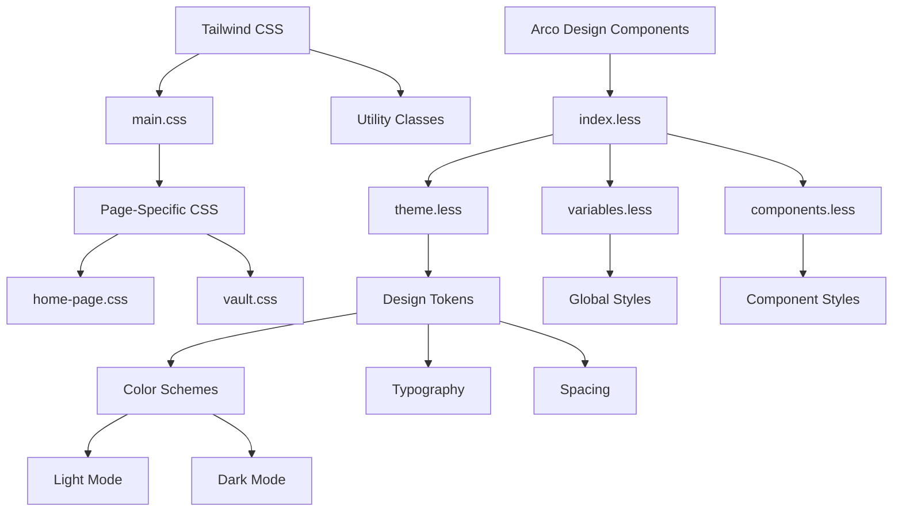
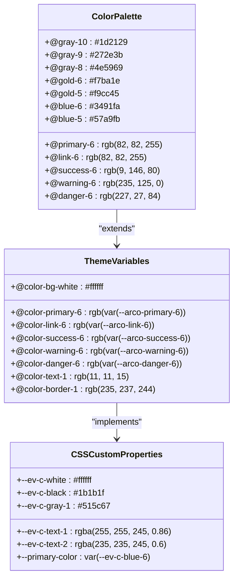
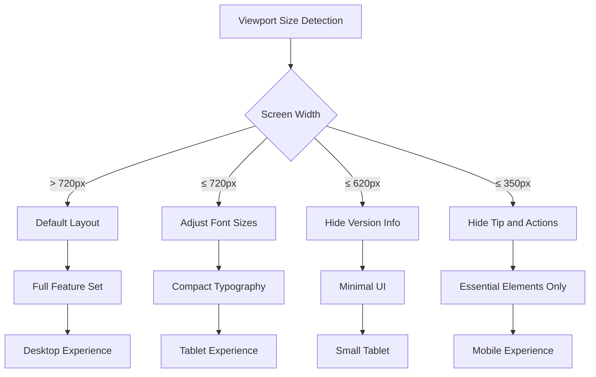
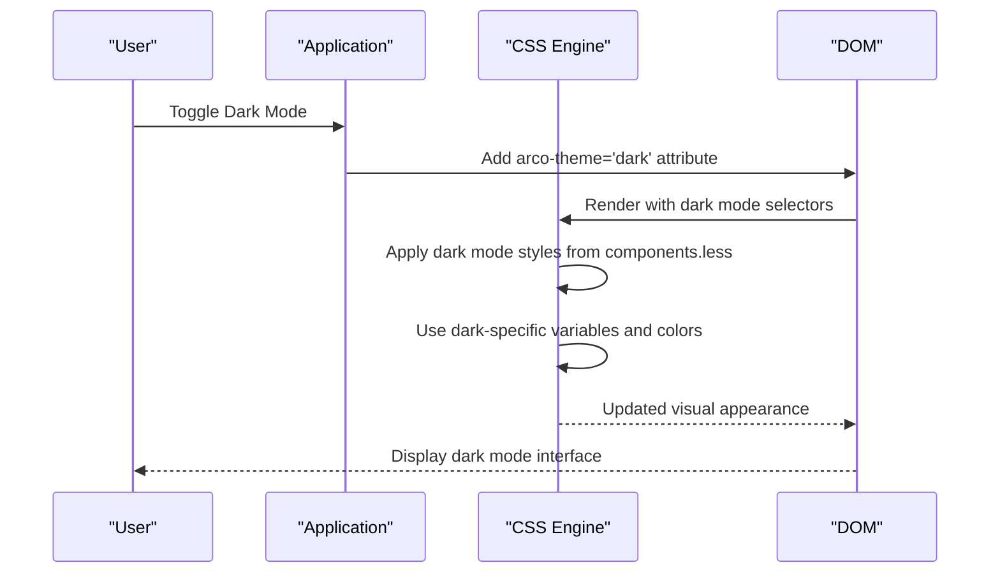

# Styling and Theme Management

<cite>
**Referenced Files in This Document**   
- [tailwind.config.js](file://frontend/tailwind.config.js)
- [variables.less](file://frontend/src/renderer/src/assets/theme/variables.less)
- [theme.less](file://frontend/src/renderer/src/assets/theme/theme.less)
- [components.less](file://frontend/src/renderer/src/assets/theme/components.less)
- [index.less](file://frontend/src/renderer/src/assets/theme/index.less)
- [main.css](file://frontend/src/renderer/src/assets/main.css)
- [base.css](file://frontend/src/renderer/src/assets/base.css)
- [home-page.css](file://frontend/src/renderer/src/pages/home/home-page.css)
- [vault.css](file://frontend/src/renderer/src/pages/vault/vault.css)
- [Sidebar/index.css](file://frontend/src/renderer/src/components/Sidebar/index.css)
</cite>

## Table of Contents
1. [Introduction](#introduction)
2. [Architecture Overview](#architecture-overview)
3. [Core Theme Components](#core-theme-components)
4. [Theme Customization Workflow](#theme-customization-workflow)
5. [Responsive Design Implementation](#responsive-design-implementation)
6. [Dark Mode Support](#dark-mode-support)
7. [Common Styling Issues and Solutions](#common-styling-issues-and-solutions)
8. [Performance Considerations](#performance-considerations)

## Introduction
The styling and theme management system in the renderer process implements a hybrid approach that combines Tailwind CSS with LESS for custom theming. This architecture enables rapid UI development through utility classes while maintaining design consistency through structured theme variables and component styling. The system supports both light and dark modes, responsive layouts, and customizable design tokens for typography, spacing, and color schemes.

**Section sources**
- [tailwind.config.js](file://frontend/tailwind.config.js#L1-L26)
- [index.less](file://frontend/src/renderer/src/assets/theme/index.less#L1-L12)

## Architecture Overview
The styling architecture follows a layered approach with multiple CSS processing stages. At the foundation, Tailwind CSS provides utility classes that are processed according to the configuration in `tailwind.config.js`. This configuration specifies content sources and enables core plugins for CSS reset behavior. The system imports Arco Design components and extends them with custom theme variables and component styles.

**Diagram sources **
- [tailwind.config.js](file://frontend/tailwind.config.js#L1-L26)
- [index.less](file://frontend/src/renderer/src/assets/theme/index.less#L1-L12)
- [main.css](file://frontend/src/renderer/src/assets/main.css#L1-L238)

**Section sources**
- [tailwind.config.js](file://frontend/tailwind.config.js#L1-L26)
- [index.less](file://frontend/src/renderer/src/assets/theme/index.less#L1-L12)
- [main.css](file://frontend/src/renderer/src/assets/main.css#L1-L238)

## Core Theme Components

### Design Tokens (variables.less)
The `variables.less` file defines comprehensive design tokens that serve as the foundation for the entire theme system. These tokens include color palettes with multiple shades for primary, secondary, success, warning, and danger states. The system implements a structured approach to spacing with `@spacing-1` through `@spacing-22` variables, and sizing with `@size-1` through `@size-50`. Typography is standardized through font size variables from `@font-size-display-3` down to `@font-size-caption`, with corresponding font weight variables from `@font-weight-100` to `@font-weight-900`. Additional tokens cover border radii, shadows, z-index values, and transition durations.

**Section sources**
- [variables.less](file://frontend/src/renderer/src/assets/theme/variables.less#L1-L800)

### Global Styles (theme.less)
The `theme.less` file contains global style definitions that establish the visual language across the application. It imports the same design tokens as `variables.less` and extends them with component-specific variables and mixins. The file defines consistent styling for text elements, form controls, and interactive components. It also includes utility functions like `.getColorRgbStr()` for color manipulation. The theme system uses CSS variables prefixed with `--ev-c-` for dynamic theming capabilities, allowing runtime theme switching.

**Section sources**
- [theme.less](file://frontend/src/renderer/src/assets/theme/theme.less#L1-L800)

### Component-Specific Styling (components.less)
The `components.less` file contains detailed styling rules for individual UI components, organized by component type. Each component section follows a consistent pattern with base styles and dark mode overrides. The file uses the Arco Design component class naming convention with variables like `@alert-prefix-cls` and `@btn-prefix-cls` to ensure selector specificity. Component styles address visual properties such as padding, margins, border radii, hover states, and focus indicators. Dark mode support is implemented through attribute selectors targeting `arco-theme='dark'`, allowing conditional styling based on the current theme.

**Section sources**
- [components.less](file://frontend/src/renderer/src/assets/theme/components.less#L1-L800)

### Base Styling (base.css)
The `base.css` file establishes foundational styles using CSS layers to control specificity. It defines custom properties for color schemes in the `:root` selector, including semantic variables like `--ev-c-text-1` and `--ev-c-background`. The file implements a consistent box-sizing model and resets default margins. Typography is standardized with a comprehensive font stack prioritizing system fonts. The base layer also includes utility classes for common layout patterns and responsive behavior.

**Section sources**
- [base.css](file://frontend/src/renderer/src/assets/base.css#L1-L75)

## Theme Customization Workflow

### Color Scheme Management
The theme system implements a comprehensive color management approach with multiple color families including gray, gold, yellow, lime, cyan, blue, purple, pinkpurple, magenta, red, orange, and green. Each color family contains 10 shades, enabling nuanced color transitions and gradients. The system uses both LESS variables (e.g., `@blue-6`) and CSS custom properties (e.g., `--ev-c-blue-6`) for maximum flexibility. Primary colors are defined with semantic names like `@primary-6` and `@link-6`, allowing consistent application across components.

**Diagram sources **
- [variables.less](file://frontend/src/renderer/src/assets/theme/variables.less#L1-L800)
- [theme.less](file://frontend/src/renderer/src/assets/theme/theme.less#L1-L800)
- [base.css](file://frontend/src/renderer/src/assets/base.css#L1-L75)

### Spacing and Layout System
The spacing system is built on a consistent scale with variables from `@spacing-1` (2px) to `@spacing-22` (120px). This system enables predictable and harmonious layouts across components. The theme uses these spacing variables for margins, paddings, and gaps in flex and grid layouts. Component-specific spacing is defined in `components.less` using the global spacing scale, ensuring consistency. The system also includes size variables from `@size-1` (4px) to `@size-50` (200px) for fixed dimensions like icon sizes and component heights.

**Section sources**
- [variables.less](file://frontend/src/renderer/src/assets/theme/variables.less#L1-L800)
- [components.less](file://frontend/src/renderer/src/assets/theme/components.less#L1-L800)

### Typography Settings
Typography is standardized through a comprehensive system of font size variables ranging from `@font-size-display-3` (36px) for headings to `@font-size-caption` (12px) for captions. The system implements a typographic scale with consistent ratios between sizes. Font weights are defined from `@font-weight-100` to `@font-weight-900`, enabling precise control over text hierarchy. The font family stack prioritizes system fonts with fallbacks to common web fonts, ensuring optimal rendering across platforms.

**Section sources**
- [variables.less](file://frontend/src/renderer/src/assets/theme/variables.less#L1-L800)

## Responsive Design Implementation
The system implements responsive design through a combination of Tailwind utility classes and custom CSS media queries. The `tailwind.config.js` file specifies content sources that enable responsive utility classes to be generated. Page-specific CSS files like `home-page.css` and `vault.css` include media queries for different viewport sizes. For example, `home-page.css` adjusts font sizes and hides elements on smaller screens with breakpoints at 720px, 620px, and 350px. The responsive system uses relative units and flexible layouts to ensure usability across device sizes.

**Diagram sources **
- [tailwind.config.js](file://frontend/tailwind.config.js#L1-L26)
- [home-page.css](file://frontend/src/renderer/src/pages/home/home-page.css#L1-L146)
- [vault.css](file://frontend/src/renderer/src/pages/vault/vault.css#L1-L156)

**Section sources**
- [tailwind.config.js](file://frontend/tailwind.config.js#L1-L26)
- [home-page.css](file://frontend/src/renderer/src/pages/home/home-page.css#L1-L146)
- [vault.css](file://frontend/src/renderer/src/pages/vault/vault.css#L1-L156)

## Dark Mode Support
Dark mode is implemented through a combination of CSS attribute selectors and custom properties. The system uses the `arco-theme='dark'` attribute to target dark mode styles, with selectors like `@{arco-theme-tag}[@{dark-text}]` in the LESS files. Component styles in `components.less` include dark mode overrides for background colors, text colors, and interactive states. The theme system defines dark-specific variables such as `@dark-color-bg-1` and `@dark-color-text-1` that are applied when the dark theme is active. The implementation ensures sufficient contrast and visual hierarchy in low-light environments.

**Diagram sources **
- [components.less](file://frontend/src/renderer/src/assets/theme/components.less#L1-L800)
- [theme.less](file://frontend/src/renderer/src/assets/theme/theme.less#L1-L800)

**Section sources**
- [components.less](file://frontend/src/renderer/src/assets/theme/components.less#L1-L800)

## Common Styling Issues and Solutions

### Specificity Conflicts
Specificity conflicts are managed through a layered CSS approach using `@layer` directives in `main.css`. The system uses Tailwind's base layer to reset problematic styles that interfere with Arco Design components. Important declarations (`!important`) are used sparingly and only when necessary to override framework styles, such as in `home-page.css` where default body styles are reset for the home page layout. The architecture minimizes specificity wars by following a consistent order of style application: reset → base → components → utilities → page-specific.

**Section sources**
- [main.css](file://frontend/src/renderer/src/assets/main.css#L1-L238)
- [home-page.css](file://frontend/src/renderer/src/pages/home/home-page.css#L1-L146)

### Class Naming Collisions
Class naming collisions are prevented through the use of Arco Design's component class naming convention and BEM-like methodology. Component classes are prefixed with `arco-` followed by the component name (e.g., `arco-tree-node`). Custom components use descriptive class names that reflect their purpose, such as `vault-card` and `note-tree`. The system avoids generic class names and uses unique identifiers for page-specific styles. The combination of Tailwind utility classes and scoped component styles minimizes the risk of naming conflicts.

**Section sources**
- [Sidebar/index.css](file://frontend/src/renderer/src/components/Sidebar/index.css#L1-L152)
- [vault.css](file://frontend/src/renderer/src/pages/vault/vault.css#L1-L156)

### CSS Bundle Performance
CSS bundle performance is optimized through several strategies. The system uses Tailwind's content configuration to purge unused utility classes, reducing the final CSS bundle size. The `tailwind.config.js` file specifies content sources to enable tree-shaking of unused styles. Component styles are organized in separate files (`variables.less`, `theme.less`, `components.less`) to enable selective importing. The architecture uses CSS custom properties for dynamic values, reducing the need for duplicate style rules. Critical styles are inlined in `main.css` while less frequently used styles are loaded on demand.

**Section sources**
- [tailwind.config.js](file://frontend/tailwind.config.js#L1-L26)
- [main.css](file://frontend/src/renderer/src/assets/main.css#L1-L238)

## Performance Considerations
The styling system prioritizes performance through several architectural decisions. The hybrid approach of Tailwind CSS and LESS balances development speed with maintainability. Tailwind's utility-first methodology reduces the need for custom CSS, while LESS enables structured theming and variable management. The system uses CSS variables for dynamic properties, enabling theme switching without reloading stylesheets. The architecture minimizes reflows and repaints by using efficient selectors and avoiding expensive CSS properties. The build process optimizes the final CSS output through minification and compression.

**Section sources**
- [tailwind.config.js](file://frontend/tailwind.config.js#L1-L26)
- [main.css](file://frontend/src/renderer/src/assets/main.css#L1-L238)