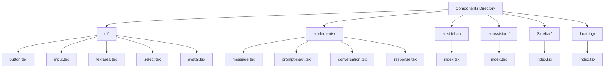
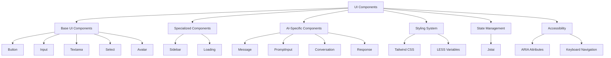
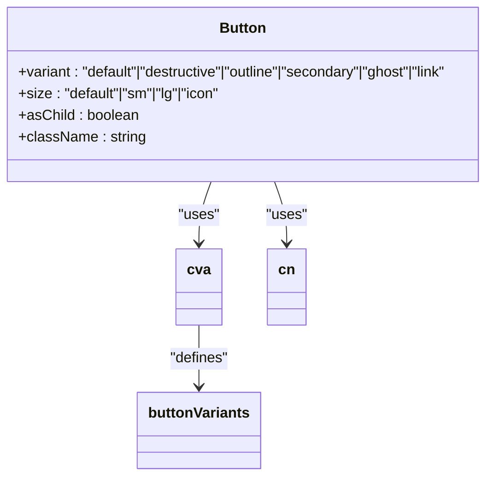
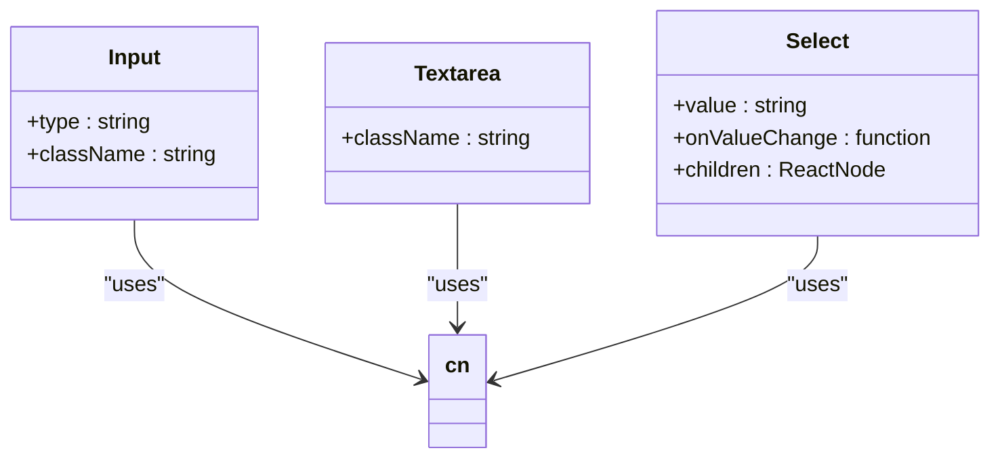
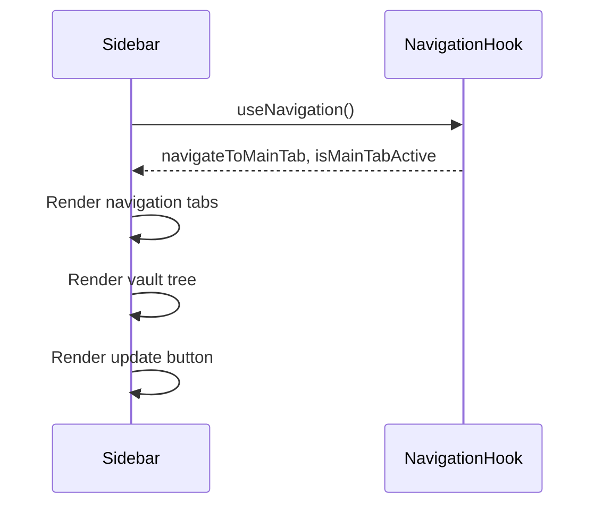
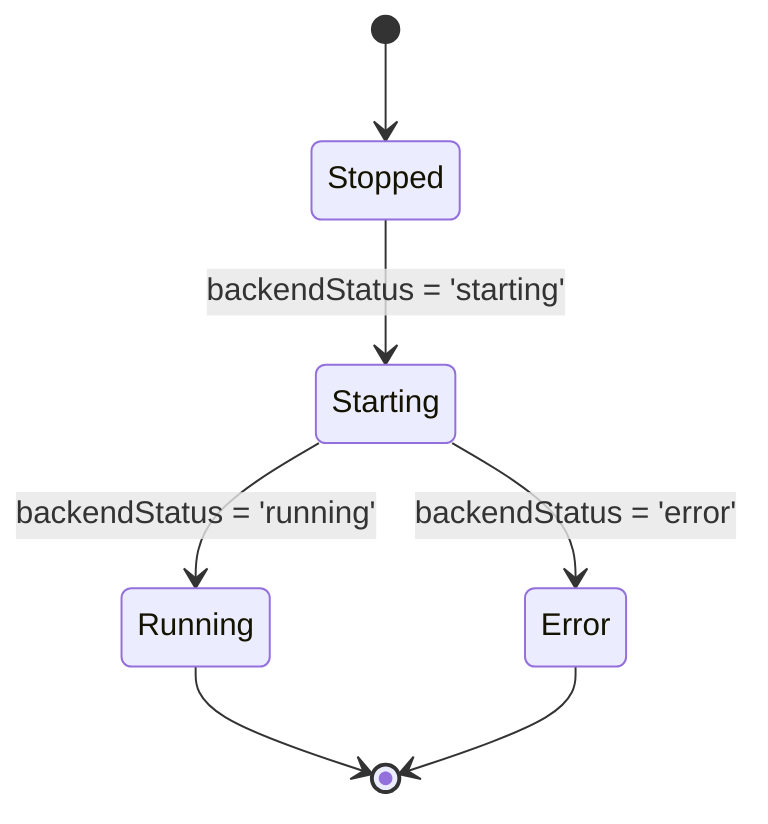
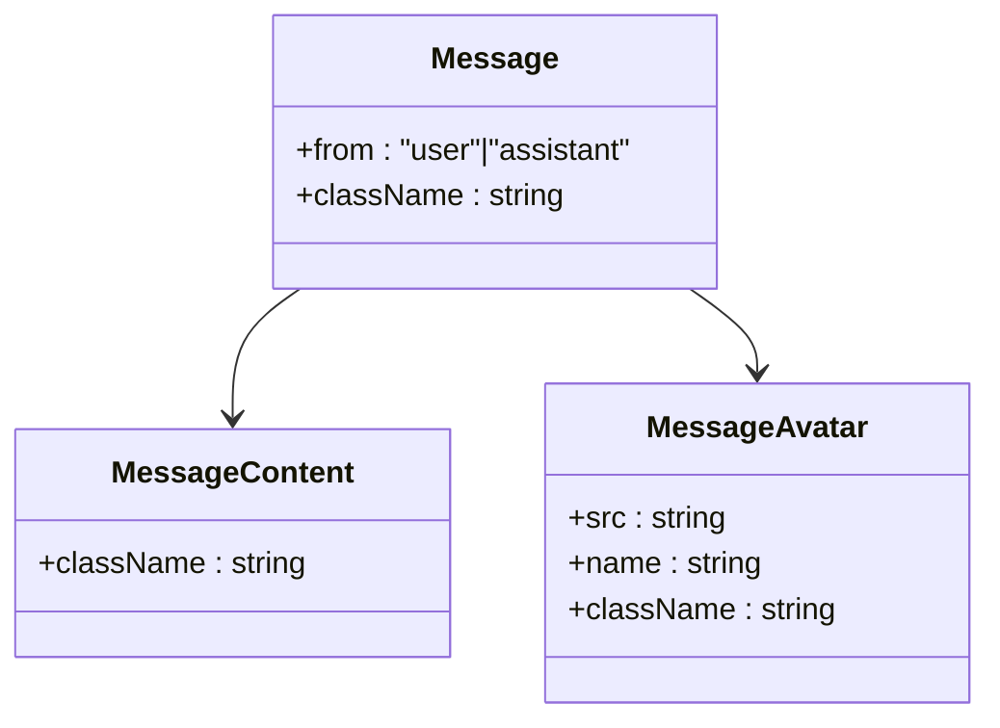
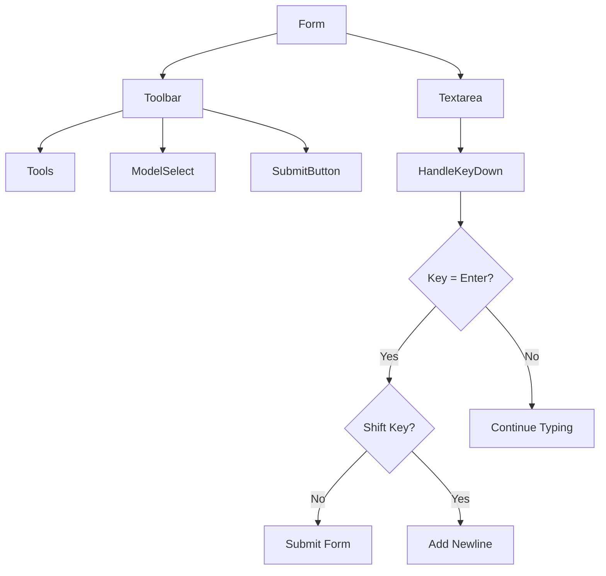
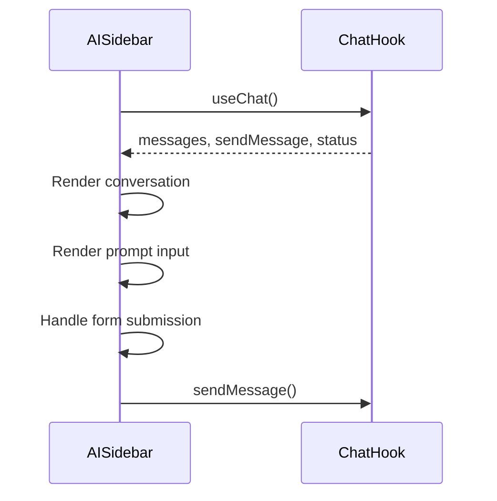
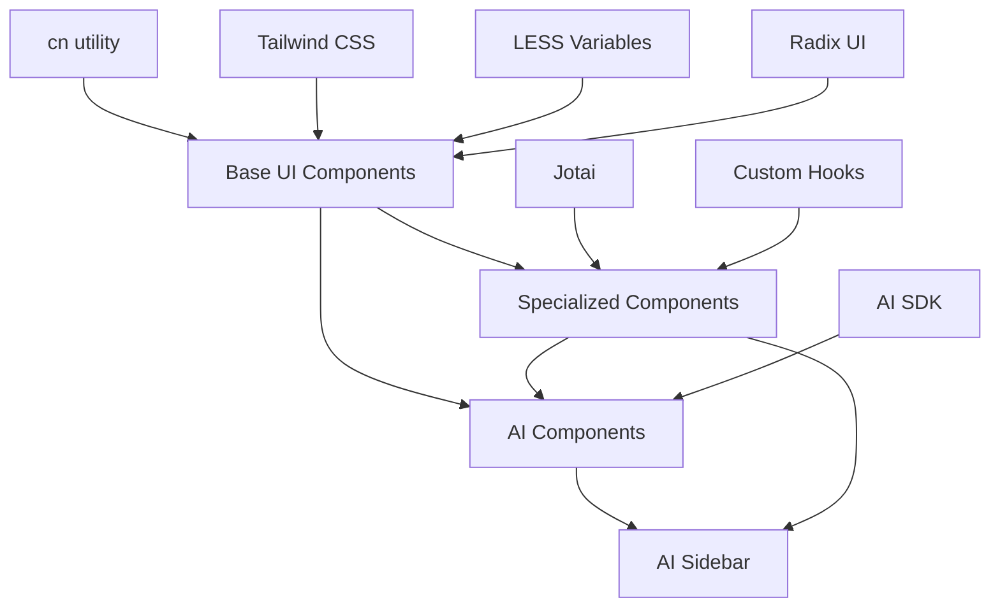

# UI Components Library

<cite>
**Referenced Files in This Document**   
- [button.tsx](file://frontend/src/renderer/src/components/ui/button.tsx)
- [avatar.tsx](file://frontend/src/renderer/src/components/ui/avatar.tsx)
- [input.tsx](file://frontend/src/renderer/src/components/ui/input.tsx)
- [select.tsx](file://frontend/src/renderer/src/components/ui/select.tsx)
- [textarea.tsx](file://frontend/src/renderer/src/components/ui/textarea.tsx)
- [Sidebar/index.tsx](file://frontend/src/renderer/src/components/Sidebar/index.tsx)
- [Loading/index.tsx](file://frontend/src/renderer/src/components/Loading/index.tsx)
- [ai-elements/message.tsx](file://frontend/src/renderer/src/components/ai-elements/message.tsx)
- [ai-elements/prompt-input.tsx](file://frontend/src/renderer/src/components/ai-elements/prompt-input.tsx)
- [ai-sidebar/index.tsx](file://frontend/src/renderer/src/components/ai-sidebar/index.tsx)
- [ai-assistant/index.tsx](file://frontend/src/renderer/src/components/ai-assistant/index.tsx)
- [theme.less](file://frontend/src/renderer/src/assets/theme/theme.less)
- [variables.less](file://frontend/src/renderer/src/assets/theme/variables.less)
- [utils.ts](file://frontend/src/renderer/src/lib/utils.ts)
</cite>

## Table of Contents
1. [Introduction](#introduction)
2. [Project Structure](#project-structure)
3. [Core Components](#core-components)
4. [Architecture Overview](#architecture-overview)
5. [Detailed Component Analysis](#detailed-component-analysis)
6. [Dependency Analysis](#dependency-analysis)
7. [Performance Considerations](#performance-considerations)
8. [Troubleshooting Guide](#troubleshooting-guide)
9. [Conclusion](#conclusion)

## Introduction
This documentation provides a comprehensive overview of the UI components library in MineContext's renderer process. The library is built on a design system of reusable React components, with a focus on accessibility, theming, and integration with AI functionality. The components are organized into a modular structure with base UI elements, specialized components like Sidebar and Loading, and AI-specific elements that enable rich chat interactions. The styling approach combines Tailwind CSS utility classes with LESS variables for consistent theming, while state management is handled through Jotai for global state synchronization.

## Project Structure
The UI components library is organized within the `frontend/src/renderer/src/components` directory, following a modular structure that separates base UI components from specialized and AI-specific elements. This organization promotes reusability and maintainability across the application.

**Diagram sources**
- [components/](file://frontend/src/renderer/src/components/)

**Section sources**
- [components/](file://frontend/src/renderer/src/components/)

## Core Components
The UI components library consists of three main categories: base UI components in the `ui` directory, specialized components like Sidebar and Loading, and AI-specific components that enable rich chat interactions. The base UI components follow the Headless UI pattern, using Radix UI primitives for accessibility and behavior, while providing styling through Tailwind CSS and utility functions. These components include Button, Input, Textarea, Select, and Avatar, each designed with variants and accessibility features.

The specialized components include Sidebar, which provides navigation and vault tree functionality, and Loading, which displays application startup progress with dynamic backend status. The AI-specific components are designed to work together to create a cohesive chat interface, with components for messages, prompts, responses, and supporting elements like sources and reasoning.

**Section sources**
- [ui/](file://frontend/src/renderer/src/components/ui/)
- [Sidebar/index.tsx](file://frontend/src/renderer/src/components/Sidebar/index.tsx)
- [Loading/index.tsx](file://frontend/src/renderer/src/components/Loading/index.tsx)

## Architecture Overview
The UI components library follows a layered architecture that separates concerns between presentation, state management, and integration with external systems. The components are built using React with TypeScript, leveraging modern React patterns like hooks and component composition. The styling system combines Tailwind CSS utility classes with LESS variables for theming, allowing for both rapid development and consistent design across the application.

**Diagram sources**
- [ui/](file://frontend/src/renderer/src/components/ui/)
- [Sidebar/index.tsx](file://frontend/src/renderer/src/components/Sidebar/index.tsx)
- [Loading/index.tsx](file://frontend/src/renderer/src/components/Loading/index.tsx)
- [ai-elements/](file://frontend/src/renderer/src/components/ai-elements/)

## Detailed Component Analysis

### Base UI Components Analysis
The base UI components in the `ui` directory are built using the Headless UI approach, leveraging Radix UI primitives for accessibility and behavior while providing styling through Tailwind CSS. This approach allows for complete control over the visual design while ensuring accessibility best practices are followed.

#### Button Component
The Button component uses the `cva` (Class Variance Authority) library to define variants for different styles and sizes. It supports multiple variants including default, destructive, outline, secondary, ghost, and link, with corresponding visual treatments. The component also supports different sizes: default, small, large, and icon.

**Diagram sources**
- [button.tsx](file://frontend/src/renderer/src/components/ui/button.tsx#L10-L36)

**Section sources**
- [button.tsx](file://frontend/src/renderer/src/components/ui/button.tsx)

#### Form Components
The form components (Input, Textarea, Select) follow a consistent pattern of using Radix UI primitives for behavior and accessibility, with styling applied through Tailwind CSS utility classes. Each component includes proper labeling, error states, and keyboard navigation support.

**Diagram sources**
- [input.tsx](file://frontend/src/renderer/src/components/ui/input.tsx)
- [textarea.tsx](file://frontend/src/renderer/src/components/ui/textarea.tsx)
- [select.tsx](file://frontend/src/renderer/src/components/ui/select.tsx)

**Section sources**
- [input.tsx](file://frontend/src/renderer/src/components/ui/input.tsx)
- [textarea.tsx](file://frontend/src/renderer/src/components/ui/textarea.tsx)
- [select.tsx](file://frontend/src/renderer/src/components/ui/select.tsx)

### Specialized Components Analysis
The specialized components include Sidebar and Loading, which provide specific functionality within the application.

#### Sidebar Component
The Sidebar component provides navigation and vault tree functionality, with a fixed width and drag region for window management. It includes navigation tabs for Home, Screen Monitor, and Settings, along with a vault tree and update availability button.

**Diagram sources**
- [Sidebar/index.tsx](file://frontend/src/renderer/src/components/Sidebar/index.tsx)

**Section sources**
- [Sidebar/index.tsx](file://frontend/src/renderer/src/components/Sidebar/index.tsx)

#### Loading Component
The Loading component displays application startup progress with a dynamic progress bar that reflects the backend status. It supports different states including stopped, starting, running, and error, with corresponding visual feedback.

**Diagram sources**
- [Loading/index.tsx](file://frontend/src/renderer/src/components/Loading/index.tsx)

**Section sources**
- [Loading/index.tsx](file://frontend/src/renderer/src/components/Loading/index.tsx)

### AI-Specific Components Analysis
The AI-specific components are designed to work together to create a cohesive chat interface, with components for messages, prompts, responses, and supporting elements.

#### Message Component
The Message component displays chat messages with different styling for user and assistant messages. It includes Message, MessageContent, and MessageAvatar subcomponents that work together to create a complete message display.

**Diagram sources**
- [ai-elements/message.tsx](file://frontend/src/renderer/src/components/ai-elements/message.tsx)

**Section sources**
- [ai-elements/message.tsx](file://frontend/src/renderer/src/components/ai-elements/message.tsx)

#### Prompt Input Component
The PromptInput component provides a comprehensive interface for user input in the chat system, including a textarea, toolbar, tools, model selection, and submit button. It handles keyboard events for submission and supports different states like submitted, streaming, and error.

**Diagram sources**
- [ai-elements/prompt-input.tsx](file://frontend/src/renderer/src/components/ai-elements/prompt-input.tsx)

**Section sources**
- [ai-elements/prompt-input.tsx](file://frontend/src/renderer/src/components/ai-elements/prompt-input.tsx)

#### AI Sidebar Component
The AI Sidebar component integrates multiple AI elements to create a complete chat interface, including conversation history, message input, and response display. It uses the useChat hook from AI SDK for React to manage chat state and interactions.

**Diagram sources**
- [ai-sidebar/index.tsx](file://frontend/src/renderer/src/components/ai-sidebar/index.tsx)

**Section sources**
- [ai-sidebar/index.tsx](file://frontend/src/renderer/src/components/ai-sidebar/index.tsx)

## Dependency Analysis
The UI components library has a well-defined dependency structure, with base components depending on utility functions and styling systems, while specialized components depend on both base components and application-specific hooks.

**Diagram sources**
- [utils.ts](file://frontend/src/renderer/src/lib/utils.ts)
- [tailwind.config.js](file://frontend/tailwind.config.js)
- [theme.less](file://frontend/src/renderer/src/assets/theme/theme.less)
- [variables.less](file://frontend/src/renderer/src/assets/theme/variables.less)

**Section sources**
- [lib/utils.ts](file://frontend/src/renderer/src/lib/utils.ts)
- [assets/theme/](file://frontend/src/renderer/src/assets/theme/)

## Performance Considerations
The UI components library is designed with performance in mind, using several optimization techniques:

1. **Memoization**: Components use React.memo and useMemo to prevent unnecessary re-renders
2. **Code Splitting**: Components are organized in a modular structure that enables code splitting
3. **Efficient Styling**: The combination of Tailwind CSS and LESS variables minimizes CSS bundle size
4. **Lazy Loading**: Components can be lazily loaded when needed
5. **Virtualization**: Long lists are virtualized to improve rendering performance

The library also follows React best practices for performance, including proper use of keys, avoiding inline function definitions in render methods, and minimizing state updates.

## Troubleshooting Guide
When working with the UI components library, several common issues may arise:

### Style Collisions
Style collisions can occur when custom styles conflict with Tailwind CSS utilities or LESS variables. To resolve:
- Use the `cn` utility function to properly merge class names
- Avoid using !important in custom styles
- Ensure LESS variables are properly scoped
- Use Tailwind's `@apply` directive sparingly and only in component-specific styles

### State Synchronization Issues
State synchronization issues between the renderer and main process can occur due to:
- Improper use of Jotai atoms
- Missing dependency arrays in useEffect hooks
- Race conditions in async operations

To resolve:
- Ensure all state updates are properly batched
- Use the correct dependency arrays in hooks
- Implement proper error handling for async operations
- Use Jotai's persistence utilities for critical state

### Accessibility Issues
Accessibility issues may arise from:
- Missing ARIA attributes
- Improper keyboard navigation
- Insufficient color contrast

To resolve:
- Use Radix UI primitives which include built-in accessibility
- Test with screen readers and keyboard navigation
- Ensure sufficient color contrast according to WCAG guidelines
- Provide proper labels and descriptions for all interactive elements

**Section sources**
- [utils.ts](file://frontend/src/renderer/src/lib/utils.ts)
- [theme.less](file://frontend/src/renderer/src/assets/theme/theme.less)
- [variables.less](file://frontend/src/renderer/src/assets/theme/variables.less)

## Conclusion
The UI components library in MineContext's renderer process provides a comprehensive set of reusable React components that follow modern design and development practices. The library's architecture promotes consistency, accessibility, and maintainability through its modular structure, consistent styling approach, and proper state management. By combining Tailwind CSS utility classes with LESS variables for theming, the library achieves both development efficiency and design consistency. The AI-specific components demonstrate how the base components can be composed to create complex, interactive interfaces that integrate seamlessly with the application's AI functionality. The library serves as a solid foundation for building a cohesive and accessible user interface across the MineContext application.