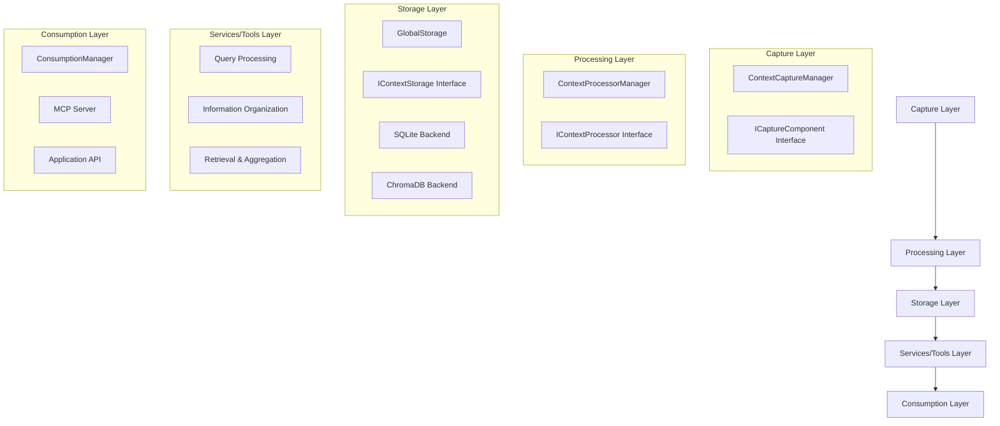
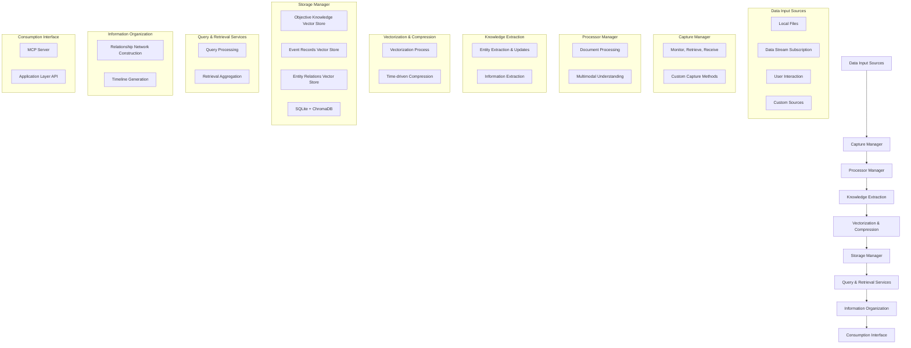
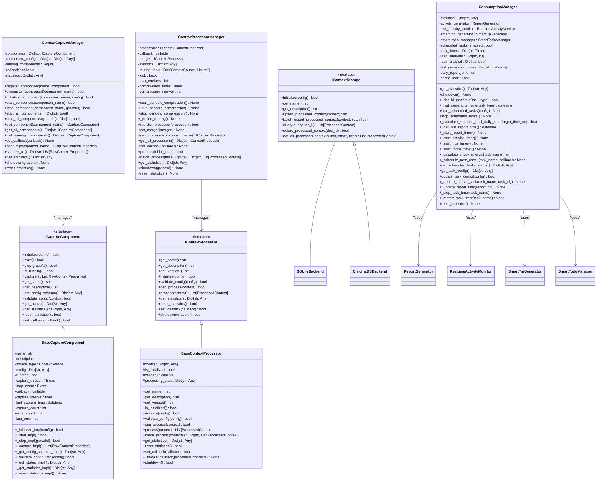

# Source Documentation Directory

<cite>
**Referenced Files in This Document**   
- [architecture-overview.md](file://src/architecture-overview.md)
- [architecture-overview-zh.md](file://src/architecture-overview-zh.md)
- [capture_manager.py](file://opencontext/managers/capture_manager.py)
- [processor_manager.py](file://opencontext/managers/processor_manager.py)
- [consumption_manager.py](file://opencontext/managers/consumption_manager.py)
- [capture_interface.py](file://opencontext/interfaces/capture_interface.py)
- [processor_interface.py](file://opencontext/interfaces/processor_interface.py)
- [storage_interface.py](file://opencontext/interfaces/storage_interface.py)
- [base.py](file://opencontext/context_capture/base.py)
- [base_processor.py](file://opencontext/context_processing/processor/base_processor.py)
- [sqlite_backend.py](file://opencontext/storage/backends/sqlite_backend.py)
</cite>

## Table of Contents
1. [Architecture Overview Documentation](#architecture-overview-documentation)
2. [Layered Architecture](#layered-architecture)
3. [Data Flow and System Components](#data-flow-and-system-components)
4. [Extension Points and Modularity](#extension-points-and-modularity)
5. [Value for Developers and Contributors](#value-for-developers-and-contributors)
6. [Conclusion](#conclusion)

## Architecture Overview Documentation

The `architecture-overview.md` and `architecture-overview-zh.md` files serve as comprehensive guides to understanding the system-level design of MineContext. These documents provide a high-level architectural understanding of the application, detailing its modular structure, data flow, and extension mechanisms. The English version (`architecture-overview.md`) and Chinese version (`architecture-overview-zh.md`) ensure accessibility for both international and Chinese-speaking developers, maintaining identical technical content while catering to different language preferences.

These overview documents are essential for developers and contributors who need to understand how the system is structured and how its components interact. They explain the layered architecture that separates concerns into distinct components: capture, processing, storage, services/tools, and consumption. This separation enables a clear understanding of the system's modularity and facilitates easier maintenance and extension.

The documentation illustrates the complete system flow from context capture to AI consumption, showing how data moves through the system and how different components transform and utilize this data. By providing visual representations of the architecture and detailed explanations of each component's role, these documents help developers quickly grasp the overall system design and identify where new features or modifications should be implemented.

**Section sources**
- [architecture-overview.md](file://src/architecture-overview.md#L1-L267)
- [architecture-overview-zh.md](file://src/architecture-overview-zh.md#L1-L254)

## Layered Architecture

MineContext follows a layered architectural approach with well-defined interfaces between components. The system is organized into five core layers that handle different aspects of context management:

1. **Capture Layer**: Responsible for collecting context from various sources such as local files, data streams, user interactions, and custom methods. This layer is managed by the `ContextCaptureManager` which coordinates multiple capture components through the `ICaptureComponent` interface.

2. **Processing Layer**: Handles the transformation and analysis of captured context. This includes document processing (both structured and unstructured), multimodal understanding, entity extraction, knowledge extraction, and vectorization. The `ContextProcessorManager` orchestrates processing components that implement the `IContextProcessor` interface.

3. **Storage Layer**: Manages the persistence of processed context data using multiple storage backends. The system supports both SQLite for document storage and ChromaDB for vector storage, with an abstract `IContextStorage` interface that allows for interchangeable storage implementations.

4. **Services/Tools Layer**: Provides query processing, information organization, and retrieval capabilities. This layer enables features like intent recognition, relationship network construction, timeline generation, and hybrid search across different data types.

5. **Consumption Layer**: Facilitates the use of processed context through various interfaces including the Model Context Protocol (MCP) server and application layer APIs. The `ConsumptionManager` coordinates components that generate reports, smart tips, and todo items based on the available context.

This layered architecture ensures separation of concerns, making the system more maintainable and extensible. Each layer has well-defined responsibilities and interfaces, allowing developers to understand and modify specific components without needing to comprehend the entire system.

**Diagram sources**
- [architecture-overview.md](file://src/architecture-overview.md#L9-L44)
- [capture_manager.py](file://opencontext/managers/capture_manager.py#L23-L391)
- [processor_manager.py](file://opencontext/managers/processor_manager.py#L21-L213)
- [consumption_manager.py](file://opencontext/managers/consumption_manager.py#L31-L524)
- [capture_interface.py](file://opencontext/interfaces/capture_interface.py#L18-L153)
- [processor_interface.py](file://opencontext/interfaces/processor_interface.py#L16-L136)
- [storage_interface.py](file://opencontext/interfaces/storage_interface.py#L18-L65)

**Section sources**
- [architecture-overview.md](file://src/architecture-overview.md#L9-L44)
- [capture_manager.py](file://opencontext/managers/capture_manager.py#L23-L391)
- [processor_manager.py](file://opencontext/managers/processor_manager.py#L21-L213)
- [consumption_manager.py](file://opencontext/managers/consumption_manager.py#L31-L524)

## Data Flow and System Components

The data flow in MineContext follows a well-defined path from input sources through processing and storage to final consumption. The system begins with data input from various sources including local files, data stream subscriptions, user interactions, and custom sources. These inputs are managed by the `ContextCaptureManager` which coordinates different capture components.

Once data is captured, it flows to the `ContextProcessorManager` which routes it to appropriate processing components based on the source type. The processing layer performs several transformations including document segmentation, multimodal understanding, entity extraction, knowledge extraction, and vectorization. Processed context is then stored in the appropriate storage backend through the `GlobalStorage` system.

The storage layer uses both SQLite for structured data and ChromaDB for vectorized context, allowing for efficient retrieval and querying. From storage, context data can be accessed through various services and tools that provide query processing, information organization, and retrieval capabilities. Finally, the processed and organized context is made available through consumption interfaces including the MCP server and application layer APIs.

This data flow is designed to be modular and extensible, with clear interfaces between components. The system uses callback mechanisms to pass data between components, ensuring loose coupling and enabling asynchronous processing where appropriate. The architecture supports both real-time processing and batch operations, making it suitable for a wide range of use cases.

**Diagram sources**
- [architecture-overview.md](file://src/architecture-overview.md#L101-L190)
- [capture_manager.py](file://opencontext/managers/capture_manager.py#L23-L391)
- [processor_manager.py](file://opencontext/managers/processor_manager.py#L21-L213)
- [consumption_manager.py](file://opencontext/managers/consumption_manager.py#L31-L524)

**Section sources**
- [architecture-overview.md](file://src/architecture-overview.md#L49-L190)
- [capture_manager.py](file://opencontext/managers/capture_manager.py#L23-L391)
- [processor_manager.py](file://opencontext/managers/processor_manager.py#L21-L213)

## Extension Points and Modularity

The architecture overview documents highlight several key extension points that demonstrate the system's modularity and extensibility. These extension points are designed to allow developers to add new functionality without modifying the core system, following the open/closed principle.

The primary extension points include:

1. **Adding New Context Sources**: Developers can implement the `ICaptureComponent` interface to create new capture components for different data sources. These components can then be registered with the `ContextCaptureManager` to become part of the system. The base `BaseCaptureComponent` class provides common functionality that can be extended.

2. **Adding New Processing Strategies**: New processing strategies can be added by implementing the `IContextProcessor` interface and registering them with the `ProcessorFactory`. This allows for custom processing of specific types of context data, such as specialized document formats or unique data structures.

3. **Adding New Storage Backends**: The storage system is designed to support multiple backends through the `IContextStorage` interface. Developers can implement this interface to add support for new storage technologies beyond the existing SQLite and ChromaDB implementations.

4. **Adding New LLM Providers**: The system can be extended to support additional large language model providers by implementing the appropriate client interface and updating the configuration handling.

These extension points are facilitated by the system's use of interfaces and dependency injection, ensuring that new components can be integrated without modifying existing code. The architecture promotes loose coupling between components, making it easier to maintain and evolve the system over time.

**Diagram sources**
- [architecture-overview.md](file://src/architecture-overview.md#L193-L213)
- [capture_manager.py](file://opencontext/managers/capture_manager.py#L23-L391)
- [processor_manager.py](file://opencontext/managers/processor_manager.py#L21-L213)
- [consumption_manager.py](file://opencontext/managers/consumption_manager.py#L31-L524)
- [base.py](file://opencontext/context_capture/base.py#L26-L515)
- [base_processor.py](file://opencontext/context_processing/processor/base_processor.py#L23-L261)
- [sqlite_backend.py](file://opencontext/storage/backends/sqlite_backend.py#L29-L800)

**Section sources**
- [architecture-overview.md](file://src/architecture-overview.md#L193-L213)
- [capture_manager.py](file://opencontext/managers/capture_manager.py#L23-L391)
- [processor_manager.py](file://opencontext/managers/processor_manager.py#L21-L213)
- [consumption_manager.py](file://opencontext/managers/consumption_manager.py#L31-L524)

## Value for Developers and Contributors

The architecture overview documents provide significant value for both developers trying to understand the system and contributors looking to add new features. For developers, these documents serve as a roadmap to the system's design, explaining how the different components work together and how data flows through the application. This understanding is crucial for effective debugging, performance optimization, and feature development.

For contributors, the documentation clearly outlines the extension points available in the system, making it easier to add new functionality without disrupting existing code. The modular design and well-defined interfaces mean that new features can be implemented as separate components that integrate seamlessly with the rest of the system. This lowers the barrier to contribution and encourages community involvement.

The documentation illustrates the relationship between components through clear diagrams and detailed descriptions, helping developers understand the system's modularity. This is particularly valuable when implementing new features, as it allows developers to identify the appropriate place for their code within the existing architecture. The separation of concerns into distinct layers (capture, processing, storage, consumption) makes it easier to reason about the system and to make targeted changes.

Additionally, the documentation highlights the system's support for different deployment architectures, from standalone to distributed deployments. This information helps developers understand how the system can be scaled and deployed in different environments, which is essential for both development and production use cases.

**Section sources**
- [architecture-overview.md](file://src/architecture-overview.md#L1-L267)
- [architecture-overview-zh.md](file://src/architecture-overview-zh.md#L1-L254)

## Conclusion

The `architecture-overview.md` and `architecture-overview-zh.md` documents are essential resources for understanding the MineContext system architecture. They provide a comprehensive view of the system's layered design, data flow, and extension mechanisms, serving as valuable guides for both developers and contributors. By clearly illustrating the relationships between components and the overall system flow from context capture to AI consumption, these documents enable a deep understanding of the system's modularity and extensibility.

The architecture's design promotes loose coupling between components through well-defined interfaces, making the system more maintainable and easier to extend. The clear separation of concerns into distinct layers (capture, processing, storage, services/tools, and consumption) allows developers to focus on specific aspects of the system without needing to understand every detail. This modular approach facilitates both learning and development, lowering the barrier to entry for new contributors.

For developers, these overview documents provide the context needed to effectively work with the codebase, debug issues, and implement new features. For contributors, they clearly outline the extension points available in the system, showing how new functionality can be added without modifying core components. Together, these documents serve as a foundation for understanding and extending the MineContext system, supporting both current development and future growth.

**Section sources**
- [architecture-overview.md](file://src/architecture-overview.md#L1-L267)
- [architecture-overview-zh.md](file://src/architecture-overview-zh.md#L1-L254)